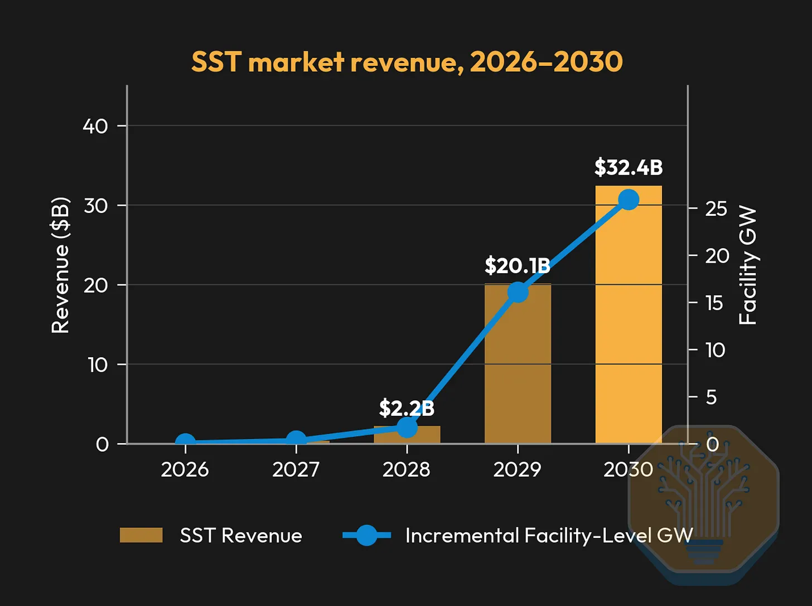

# GIGAWATT — From watts to useful compute

Authored draft — external expert and learner reviews pending. Updated 2026-09-10.

The course is organized around mechanisms, solved examples, tradeoffs and changed-scenario practice. Runtime follows teaching and rehearsal; no ten-hour duration is asserted.

Generated from the lesson records in `course/expansion/` and boundary exercises in `course/domain-checkins.json` with `uv run gigawatt-expand`. This is a reading view; the [filled-in course template](COURSE_REVIEW.md) owns course design and production decisions.

Each domain ends with one optional scenario: pause, make a prediction, compare the reasoning, and connect it to the next problem. These check-ins carry no score and do not block progression.

[Open the visual reader](index.html) · [Domain map](DOMAIN_MAP.md) · [Dry-run guide](PRESENTING.md)

## Learning path

- **D01** [One rack, three paths](lessons/d01-boundaries.md) — What crosses the boundary of a working data center?
- **D01** [A megawatt is not a megawatt-hour](lessons/d01-power-over-time.md) — How can two facilities use equal energy but need different electrical capacity?
- **D01** [Attach a denominator and a date](lessons/d01-metrics-and-evidence.md) — What does an efficiency or capacity claim actually establish?
- **D02** [Design for a job, not a rack count](lessons/d02-workload-brief.md) — What must the infrastructure deliver for this workload to count as successful?
- **D02** [Busy, powered, and productive are different](lessons/d02-productive-utilization.md) — Why can lower average power accompany worse energy per useful result?
- **D02** [The workload has a rhythm](lessons/d02-phases-and-envelopes.md) — How do batching and synchronized phases change demand without changing installed equipment?
- **D03** [A contract is not a cable](lessons/d03-power-and-procurement.md) — How do energy purchases relate to the physical supply that keeps a rack running?
- **D03** [Move power with fewer amperes](lessons/d03-voltage-and-distance.md) — Why does a higher transport voltage reduce one important class of losses?
- **D03** [Behind the meter and the first usable megawatt](lessons/d03-service-and-siting.md) — Can behind-the-meter supply bring a site online sooner and keep its protected load running during an outage?
- **D12** [A rack must fit on its worst day](lessons/d12-room-and-replacement-route.md) — Why can a layout that fits every rack still be impossible to maintain?
- **D12** [Choose a site that can deliver the first phase](lessons/d12-hazards-and-site-evidence.md) — Which parcel can support the required campus, with usable land and services ready on time?
- **D12** [A shared boundary can defeat two independent systems](lessons/d12-safety-and-control-boundaries.md) — How do physical access, stored energy and control permissions shape availability?
- **D04** [Read a power train as a set of jobs](lessons/d04-read-the-power-train.md) — What changes, branches, and limits between the campus connection and the rack?
- **D04** [Kilowatts do not fill a kilovolt-ampere nameplate](lessons/d04-current-and-rating.md) — How do efficiency and power factor change upstream equipment loading?
- **D04** [Moving a converter moves an interface](lessons/d04-conversion-placement.md) — How should centralized and distributed conversion be compared fairly?
- **D05** [A battery has two limits before it has a runtime](lessons/d05-storage-power-and-time.md) — Can the stored energy reach the load at the required rate?
- **D05** [Continuity belongs to the complete service](lessons/d05-paths-and-transitions.md) — Which loads remain usable during an interruption, transfer, and maintenance event?
- **D05** [A fault needs a boundary and an exit](lessons/d05-protection-and-fault-domains.md) — Why can the same breaker arrangement behave differently under another source or grounding scheme?
- **D06** [Follow the watts through the rack](lessons/d06-conversion-ledger.md) — Why is the sum of processor power ratings not the power entering the rack?
- **D06** [800 V is an interface, not an entire architecture](lessons/d06-eight-hundred-volt-architectures.md) — What changes when conversion sits in the rack, beside the rack, or at the facility boundary?
- **D06** [A rack upgrade is an interface negotiation](lessons/d06-rack-migration.md) — Why can a retrofit reject the architecture that looks best on an empty site?
- **D07** [A rack is a path through several memories](lessons/d07-data-path.md) — What must happen between a stored dataset and a completed accelerator operation?
- **D07** [Find the limit before buying more arithmetic](lessons/d07-bottleneck-model.md) — Is a workload constrained by memory capacity, memory bandwidth, compute or communication?
- **D07** [The rack becomes a service boundary](lessons/d07-rack-as-system.md) — How does tighter hardware integration change deployment, maintenance and usable job capacity?
- **D08** [Count the paths, not just the advertised ports](lessons/d08-topology-budget.md) — How do topology, physical distance and the campus fiber handoff constrain a communication plan?
- **D08** [A collective makes waiting contagious](lessons/d08-collective-progress.md) — How can one constrained participant delay a job running on many healthy accelerators?
- **D08** [Choose where electricity becomes light](lessons/d08-copper-light-service.md) — How should reach, power and replacement boundaries shape the choice between copper, pluggable optics and CPO?
- **D09** [Storage is a traffic and state system](lessons/d09-storage-paths.md) — Why can a large, fast storage array still leave accelerators waiting?
- **D09** [Count preserved progress, lost progress and recovery](lessons/d09-checkpoint-timeline.md) — When do more frequent checkpoints improve completed work, and when do they only add overhead?
- **D09** [Turn installed hardware into an accepted service](lessons/d09-service-acceptance.md) — What must a tenant demonstrate before the cluster can be called usable?
- **D10** [A cool room can contain an overheating chip](lessons/d10-local-thermal-paths.md) — Why do equal rack heat loads create different local cooling problems?
- **D10** [Flow arithmetic is only the first pump question](lessons/d10-flow-and-pressure.md) — How much liquid transports the heat, and can that flow reach every required branch?
- **D10** [Two liquid loops exchange heat, not fluid](lessons/d10-cdu-interfaces.md) — What does a CDU do, and why is loop temperature rise different from approach temperature?
- **D11** [The heat does not disappear at the chiller](lessons/d11-heat-rejection.md) — What reaches the environment after cooling equipment has moved the IT heat?
- **D11** [The same air temperature can create different cooling limits](lessons/d11-weather-and-operating-envelope.md) — How do dry bulb, wet bulb and exchanger approach determine whether the rack receives cool enough liquid?
- **D11** [Count water at the boundary, then ask who can use the heat](lessons/d11-water-and-heat-reuse.md) — Can a facility improve one resource metric while making another site constraint harder?
- **D13** [The longest lead time is not the completion date](lessons/d13-delivery-dependencies.md) — Which delay actually changes the date when a phase can deliver service?
- **D13** [Two adequate products can form an inadequate system](lessons/d13-interface-contracts.md) — What can proceed when 200 × 100 kW racks become 100 × 200 kW just before fabrication?
- **D13** [Commission the intersection, not the inventory](lessons/d13-commissioning-complete-paths.md) — When do installed components become a tested service path?
- **D14** [A believable number can describe the wrong thing](lessons/d14-telemetry-and-observability.md) — How do we distinguish a real cooling constraint from a measurement problem?
- **D14** [The scheduler cannot negotiate with physics after the fact](lessons/d14-coordinating-control-and-work.md) — How should a workload change relate to equipment control and facility operating sequences?
- **D14** [Measure the service, investigate the incident](lessons/d14-maintenance-and-service-reliability.md) — Why do equipment uptime and a redundant topology fail to determine useful-service availability?
- **D15** [Find the constraint after reconciling the boundaries](lessons/d15-capacity-ledger.md) — How many rack equivalents can the specified system support, and what would an upgrade actually change?
- **D15** [Compare the service you receive, not the invoice label](lessons/d15-cost-per-service.md) — How should ownership, energy, timing and useful output enter a defensible cost comparison?
- **D15** [Choose the intervention, then audit the claim](lessons/d15-upgrade-and-evidence.md) — Which improvement delivers useful results within the horizon, and which public statements actually support the project model?
- **capstone** [The servers stay powered. The service does not.](lessons/c01-coupled-outage.md) — Can this facility sustain useful work through the specified utility interruption?
- **capstone** [A hot day changes two limits at once](lessons/c02-weather-capacity.md) — How many complete rack equivalents remain supportable when weather changes cooling capacity and auxiliary power?
- **capstone** [The rack upgrade that does not fit the building](lessons/c03-density-retrofit.md) — Does a lower-current rack-power architecture solve the actual retrofit constraint?
- **capstone** [The powered cluster that keeps waiting](lessons/c04-stalled-job.md) — Which measurement would distinguish a fabric limit from a storage or compute limit?
- **capstone** [Open one phase, with evidence](lessons/c05-open-a-phase.md) — Which racks can be counted as accepted service, and what must happen before the next phase opens?

## Objective-to-lesson coverage

Every entry below is authored and has practice; this is not evidence of learner mastery or external engineering review.

| Objective | Authored lessons |
| --- | --- |
| D01.1 | [One rack, three paths](lessons/d01-boundaries.md) |
| D01.2 | [A megawatt is not a megawatt-hour](lessons/d01-power-over-time.md) |
| D01.3 | [One rack, three paths](lessons/d01-boundaries.md), [A megawatt is not a megawatt-hour](lessons/d01-power-over-time.md), [Attach a denominator and a date](lessons/d01-metrics-and-evidence.md), [A hot day changes two limits at once](lessons/c02-weather-capacity.md) |
| D01.4 | [Attach a denominator and a date](lessons/d01-metrics-and-evidence.md) |
| D02.1 | [Design for a job, not a rack count](lessons/d02-workload-brief.md), [The workload has a rhythm](lessons/d02-phases-and-envelopes.md) |
| D02.2 | [Busy, powered, and productive are different](lessons/d02-productive-utilization.md), [The powered cluster that keeps waiting](lessons/c04-stalled-job.md) |
| D02.3 | [The workload has a rhythm](lessons/d02-phases-and-envelopes.md) |
| D02.4 | [Design for a job, not a rack count](lessons/d02-workload-brief.md), [Busy, powered, and productive are different](lessons/d02-productive-utilization.md), [The workload has a rhythm](lessons/d02-phases-and-envelopes.md) |
| D03.1 | [A contract is not a cable](lessons/d03-power-and-procurement.md) |
| D03.2 | [Move power with fewer amperes](lessons/d03-voltage-and-distance.md) |
| D03.3 | [Behind the meter and the first usable megawatt](lessons/d03-service-and-siting.md), [Open one phase, with evidence](lessons/c05-open-a-phase.md) |
| D03.4 | [A contract is not a cable](lessons/d03-power-and-procurement.md), [Behind the meter and the first usable megawatt](lessons/d03-service-and-siting.md) |
| D12.1 | [A rack must fit on its worst day](lessons/d12-room-and-replacement-route.md), [The rack upgrade that does not fit the building](lessons/c03-density-retrofit.md) |
| D12.2 | [Choose a site that can deliver the first phase](lessons/d12-hazards-and-site-evidence.md) |
| D12.3 | [A shared boundary can defeat two independent systems](lessons/d12-safety-and-control-boundaries.md) |
| D12.4 | [A shared boundary can defeat two independent systems](lessons/d12-safety-and-control-boundaries.md) |
| D04.1 | [Read a power train as a set of jobs](lessons/d04-read-the-power-train.md) |
| D04.2 | [Kilowatts do not fill a kilovolt-ampere nameplate](lessons/d04-current-and-rating.md) |
| D04.3 | [Moving a converter moves an interface](lessons/d04-conversion-placement.md) |
| D04.4 | [Read a power train as a set of jobs](lessons/d04-read-the-power-train.md), [Moving a converter moves an interface](lessons/d04-conversion-placement.md) |
| D05.1 | [A battery has two limits before it has a runtime](lessons/d05-storage-power-and-time.md), [The servers stay powered. The service does not.](lessons/c01-coupled-outage.md) |
| D05.2 | [A battery has two limits before it has a runtime](lessons/d05-storage-power-and-time.md), [Continuity belongs to the complete service](lessons/d05-paths-and-transitions.md), [The servers stay powered. The service does not.](lessons/c01-coupled-outage.md) |
| D05.3 | [Continuity belongs to the complete service](lessons/d05-paths-and-transitions.md), [A fault needs a boundary and an exit](lessons/d05-protection-and-fault-domains.md), [The servers stay powered. The service does not.](lessons/c01-coupled-outage.md) |
| D05.4 | [A fault needs a boundary and an exit](lessons/d05-protection-and-fault-domains.md) |
| D06.1 | [Follow the watts through the rack](lessons/d06-conversion-ledger.md), [The rack upgrade that does not fit the building](lessons/c03-density-retrofit.md) |
| D06.2 | [Follow the watts through the rack](lessons/d06-conversion-ledger.md), [800 V is an interface, not an entire architecture](lessons/d06-eight-hundred-volt-architectures.md), [The rack upgrade that does not fit the building](lessons/c03-density-retrofit.md) |
| D06.3 | [800 V is an interface, not an entire architecture](lessons/d06-eight-hundred-volt-architectures.md), [A rack upgrade is an interface negotiation](lessons/d06-rack-migration.md), [The rack upgrade that does not fit the building](lessons/c03-density-retrofit.md) |
| D06.4 | [800 V is an interface, not an entire architecture](lessons/d06-eight-hundred-volt-architectures.md), [A rack upgrade is an interface negotiation](lessons/d06-rack-migration.md), [The rack upgrade that does not fit the building](lessons/c03-density-retrofit.md) |
| D06.5 | [A rack upgrade is an interface negotiation](lessons/d06-rack-migration.md), [The rack upgrade that does not fit the building](lessons/c03-density-retrofit.md) |
| D07.1 | [A rack is a path through several memories](lessons/d07-data-path.md), [The rack becomes a service boundary](lessons/d07-rack-as-system.md) |
| D07.2 | [A rack is a path through several memories](lessons/d07-data-path.md), [Find the limit before buying more arithmetic](lessons/d07-bottleneck-model.md) |
| D07.3 | [Find the limit before buying more arithmetic](lessons/d07-bottleneck-model.md), [The rack becomes a service boundary](lessons/d07-rack-as-system.md), [The powered cluster that keeps waiting](lessons/c04-stalled-job.md) |
| D07.4 | [The rack becomes a service boundary](lessons/d07-rack-as-system.md) |
| D08.1 | [Count the paths, not just the advertised ports](lessons/d08-topology-budget.md), [A collective makes waiting contagious](lessons/d08-collective-progress.md) |
| D08.2 | [Count the paths, not just the advertised ports](lessons/d08-topology-budget.md), [A collective makes waiting contagious](lessons/d08-collective-progress.md), [The powered cluster that keeps waiting](lessons/c04-stalled-job.md) |
| D08.3 | [A collective makes waiting contagious](lessons/d08-collective-progress.md), [The powered cluster that keeps waiting](lessons/c04-stalled-job.md) |
| D08.4 | [Choose where electricity becomes light](lessons/d08-copper-light-service.md) |
| D08.5 | [Count the paths, not just the advertised ports](lessons/d08-topology-budget.md), [A collective makes waiting contagious](lessons/d08-collective-progress.md), [Choose where electricity becomes light](lessons/d08-copper-light-service.md) |
| D09.1 | [Storage is a traffic and state system](lessons/d09-storage-paths.md), [Count preserved progress, lost progress and recovery](lessons/d09-checkpoint-timeline.md), [The powered cluster that keeps waiting](lessons/c04-stalled-job.md) |
| D09.2 | [Count preserved progress, lost progress and recovery](lessons/d09-checkpoint-timeline.md), [Turn installed hardware into an accepted service](lessons/d09-service-acceptance.md), [The powered cluster that keeps waiting](lessons/c04-stalled-job.md) |
| D09.3 | [Storage is a traffic and state system](lessons/d09-storage-paths.md), [Turn installed hardware into an accepted service](lessons/d09-service-acceptance.md) |
| D09.4 | [Count preserved progress, lost progress and recovery](lessons/d09-checkpoint-timeline.md), [Turn installed hardware into an accepted service](lessons/d09-service-acceptance.md), [Open one phase, with evidence](lessons/c05-open-a-phase.md) |
| D10.1 | [A cool room can contain an overheating chip](lessons/d10-local-thermal-paths.md), [Flow arithmetic is only the first pump question](lessons/d10-flow-and-pressure.md) |
| D10.2 | [Flow arithmetic is only the first pump question](lessons/d10-flow-and-pressure.md), [Two liquid loops exchange heat, not fluid](lessons/d10-cdu-interfaces.md) |
| D10.3 | [Two liquid loops exchange heat, not fluid](lessons/d10-cdu-interfaces.md) |
| D10.4 | [A cool room can contain an overheating chip](lessons/d10-local-thermal-paths.md), [Two liquid loops exchange heat, not fluid](lessons/d10-cdu-interfaces.md) |
| D11.1 | [The heat does not disappear at the chiller](lessons/d11-heat-rejection.md), [The same air temperature can create different cooling limits](lessons/d11-weather-and-operating-envelope.md) |
| D11.2 | [The heat does not disappear at the chiller](lessons/d11-heat-rejection.md) |
| D11.3 | [The same air temperature can create different cooling limits](lessons/d11-weather-and-operating-envelope.md), [A hot day changes two limits at once](lessons/c02-weather-capacity.md) |
| D11.4 | [Count water at the boundary, then ask who can use the heat](lessons/d11-water-and-heat-reuse.md) |
| D11.5 | [The same air temperature can create different cooling limits](lessons/d11-weather-and-operating-envelope.md), [Count water at the boundary, then ask who can use the heat](lessons/d11-water-and-heat-reuse.md) |
| D13.1 | [The longest lead time is not the completion date](lessons/d13-delivery-dependencies.md), [Open one phase, with evidence](lessons/c05-open-a-phase.md) |
| D13.2 | [Two adequate products can form an inadequate system](lessons/d13-interface-contracts.md), [The rack upgrade that does not fit the building](lessons/c03-density-retrofit.md) |
| D13.3 | [Commission the intersection, not the inventory](lessons/d13-commissioning-complete-paths.md), [Open one phase, with evidence](lessons/c05-open-a-phase.md) |
| D13.4 | [Commission the intersection, not the inventory](lessons/d13-commissioning-complete-paths.md), [Open one phase, with evidence](lessons/c05-open-a-phase.md) |
| D14.1 | [A believable number can describe the wrong thing](lessons/d14-telemetry-and-observability.md) |
| D14.2 | [The scheduler cannot negotiate with physics after the fact](lessons/d14-coordinating-control-and-work.md) |
| D14.3 | [Measure the service, investigate the incident](lessons/d14-maintenance-and-service-reliability.md) |
| D14.4 | [Measure the service, investigate the incident](lessons/d14-maintenance-and-service-reliability.md) |
| D14.5 | [Measure the service, investigate the incident](lessons/d14-maintenance-and-service-reliability.md), [The servers stay powered. The service does not.](lessons/c01-coupled-outage.md), [The powered cluster that keeps waiting](lessons/c04-stalled-job.md) |
| D15.1 | [Find the constraint after reconciling the boundaries](lessons/d15-capacity-ledger.md), [A hot day changes two limits at once](lessons/c02-weather-capacity.md), [Open one phase, with evidence](lessons/c05-open-a-phase.md) |
| D15.2 | [Compare the service you receive, not the invoice label](lessons/d15-cost-per-service.md) |
| D15.3 | [Compare the service you receive, not the invoice label](lessons/d15-cost-per-service.md) |
| D15.4 | [Choose the intervention, then audit the claim](lessons/d15-upgrade-and-evidence.md), [A hot day changes two limits at once](lessons/c02-weather-capacity.md), [The rack upgrade that does not fit the building](lessons/c03-density-retrofit.md) |
| D15.5 | [Choose the intervention, then audit the claim](lessons/d15-upgrade-and-evidence.md), [Open one phase, with evidence](lessons/c05-open-a-phase.md) |

## Full course text

## One rack, three paths

**D01 · Authored draft · Objectives:** D01.1, D01.3

Locate white and grey space, trace electricity, heat, and information, then close a facility energy balance without counting any load twice.

**Driving question:** What crosses the boundary of a working data center?

## Start with a place, then trace a connection

Imagine standing in front of a rack: a cabinet holding computing equipment and the hardware that supports it. A server is a computer inside that cabinet; a board connects components inside a server; a package contains one or more semiconductor dies. A row holds several racks, a hall several rows, a building one or more halls, and a campus one or more buildings plus shared infrastructure. These are locations nested inside locations. None of those words specifies a universal power requirement.

Two floor-plan terms help locate those systems. White space is the area housing IT equipment and its immediate support infrastructure. Grey space, also spelled gray space, is the supporting electrical, mechanical, and service area outside the IT hall, such as an electrical room or mechanical gallery. These labels describe areas in a particular layout. They are not equipment categories: a power shelf or a cooling distribution unit can occupy white space when installed with the racks.

Now draw three paths through the same picture. Electrical energy arrives through conductors and conversion equipment. Heat leaves through air, liquid, and heat-transfer equipment. Information arrives, moves between machines, and leaves through communication links. Their arrows mean different things. Coolant circulates around a loop; heat crosses an exchanger between separate loops. Data may travel both ways along a link while electrical energy continues to enter the associated equipment. Giving each arrow a clear meaning prevents an attractive drawing from teaching a false connection.

A boundary is the imaginary line around the equipment you are accounting for. Draw it tightly around a processor and its regulators may lie outside. Draw it around a rack and those regulators, fans, and power supplies may all be inside. Draw it around the facility and cooling pumps and outdoor rejection equipment enter the account. Widening a boundary changes which loads must be counted; it does not physically change their consumption. Always ask where the meter sits relative to that line.

The opening presentation uses NVIDIA’s GB300 NVL72 as a real product anchor. The enterprise reference architecture lists a full-rack requirement of up to 142 kW. That is kilowatts, not watts, and does not specify constant observed consumption or an exact metering plane. A separate teaching case assumes ten racks each draw 142 kW at their AC inputs, adds 80 kW of separate networking/storage and 300 kW of facility support, and obtains 1,800 kW total demand. A hypothetical 2,000 kW supply nameplate is a rating distinct from that demand and from 1,500 kW of IT load. Neither the nameplate nor a subtraction alone establishes usable IT capacity after redundancy, thermal and downstream constraints.

## Close the ledger without throwing computation away

Suppose ten hypothetical racks draw 100 kW each at their inlets. Dedicated network and storage equipment outside those racks draws another 100 kW. The IT total is therefore 1,100 kW. Upstream electrical conversion dissipates 40 kW, cooling machinery draws 160 kW, and other facility equipment draws 20 kW. These are distinct, nonoverlapping categories. Adding them gives 1,320 kW at the facility input. The network equipment counts as IT even though its job is to connect computers rather than execute the main model.

Over a steady interval, nearly all that electrical input ultimately becomes heat. Computing creates valuable results, but those results are not a large competing energy outlet that can be subtracted from the cooling requirement. Our 1,100 kW of IT therefore imposes approximately 1,100 kW of IT heat removal. The remaining electrical loads add heat elsewhere. Exactly where compressor and pump input enters the thermal system depends on the chosen boundary; we need not pretend that all 1,320 kW passes through the rack coolant.

The word approximately matters. Stored electrical energy and warming material can change during a transient, and small energy streams can cross through light or other signals. Our simplified balance assumes those effects are negligible over the chosen steady interval. This is a useful engineering approximation, not an assertion that every joule takes an identical microscopic path. If equipment is warming because heat removal has failed, the missing heat is temporarily accumulating, so the steady-state balance cannot be used unchanged.

## Use the mismatch to find a mistake

A second analyst adds 1,000 kW of rack power, 80 kW of rack power-supply losses, and the 100 kW networking load. The sum is wrong if the 1,000 kW was measured at rack inlets: the supplies already consume their power inside that boundary. Their 80 kW is an internal allocation of the rack total. It becomes an extra term only if the stated 1,000 kW was delivered downstream of the supplies. One changed meter location changes the arithmetic, even though all the equipment names remain identical.

A detailed ledger is more work than one campus number, but it allows a useful question: did an improvement reduce electrical losses, cooling overhead, or the energy required per completed task? Those are different mechanisms. Reducing rack input by 100 kW normally reduces the corresponding heat source, whereas merely moving a converter outside the rack moves a heat-accounting boundary. A visually smaller rack loss does not prove that the facility uses less energy.

Try a location check before claiming a space saving. A converter moves out of the rack into a cabinet beside it. Rack mounting space may be released, but the sidecar still occupies white-space floor area. Move the converter into a separate electrical room and it occupies grey space instead. To claim a smaller facility footprint, compare both layouts, their service access, and their replacement routes. Moving a box across a boundary changes its address; it does not prove that its total space or energy requirement vanished.

Test yourself by removing the cooling power arrow while leaving IT electricity connected. The diagram should not imply continued indefinite operation. The rack remains an active heat source without a complete removal path. The immediate temperature history requires thermal storage, flow, controls, and equipment limits that this ledger does not contain. We can identify the missing dependency without inventing a shutdown time. That habit will carry through every later electrical and thermal comparison.

## Worked example: Account for one hypothetical facility

- All values are simultaneous steady real power.
- Rack inlet totals already include their internal power supplies and fans.
- Dedicated networking/storage lies outside the ten rack totals.

1. Compute-rack input — 10 × 100 kW = 1,000 kW — Multiply the per-rack measured input by the number of identical racks.
2. All IT — 1,000 + 100 = 1,100 kW — Include separately metered networking and storage once.
3. Facility input — 1,100 + 40 + 160 + 20 = 1,320 kW — Add electrical, cooling, and other facility loads at matching boundaries.
4. Four-hour energy — 1,320 kW × 4 h = 5,280 kWh — Holding the stated load constant turns a rate into an energy total.

**Result:** The facility draws 1.32 MW; IT contributes approximately 1.10 MW of heat.

**Model boundary:** The heat figure concerns IT equipment; it is not the duty of a specified outdoor cooling device.

## The tradeoff

Choice: Use subsystem meters instead of a single aggregate total.

Benefit: You can locate changes and avoid overlapping categories.

Cost: More measurement points and careful time alignment are required.

## When the situation changes

Trigger: IT remains powered while its only heat-removal path fails.

Mechanism: Electrical input continues to become heat, so thermal storage grows instead of remaining steady.

Response: Identify the unsupported thermal path and require a thermal model before predicting duration.

## Apply the idea

If 80 kW of the ten racks’ measured input is internal supply loss, should facility power become 1,400 kW? Separately, sketch an IT hall and its supporting electrical room. A rack converter moves to a cabinet beside the rack, then to that room. Label white and grey space at each step. Has either move established lower facility power or a smaller building?

Reveal the worked answer

No. It remains 1,320 kW. The rack and adjacent cabinet occupy white space; the separate electrical room is grey space. Neither move alone establishes lower facility power or a smaller building.

The 80 kW is part of the 1,000 kW rack inlet total. Add it separately only when starting from a downstream power boundary that excludes it. Area labels locate equipment. Placement does not remove its electrical load, and freeing a rack slot does not account for the new cabinet, room, access or cable routes.

**The idea to keep:** Choose the boundary before adding watts; useful computation does not remove the heat obligation.

## Sources and reading boundaries

- [EIA — Laws of energy](https://www.eia.gov/energyexplained/what-is-energy/laws-of-energy.php) — Energy changes form rather than disappearing; the ledger uses conservation. Read 2026-09-06. Read the public energy-conservation explanation. The campus quantities and deductions are original hypothetical examples.
- [DOE — Best Practices Guide for Energy-Efficient Data Center Design](https://www.energy.gov/sites/default/files/2024-07/best-practice-guide-data-center-design_0.pdf) — Data-center accounting separates IT, electrical, and cooling systems. Read 2026-09-06. Read the guide overview and relevant system/metrics material; no named facility configuration or operating measurement is inferred.
- [Leviton — Data center white space and gray space](https://leviton.com/support/literature/newsletters/insider/insideroctober2025/focusedproductoctober2025) — White space houses IT; gray space describes supporting back-of-house infrastructure. Read 2026-09-10. Reviewed the White Space and Gray Space definitions under Leviton Solutions for Data Centers. These are area conventions, not a rule assigning every power or cooling device to one room type.
- [Vertiv — Deploying Liquid Cooling in the Data Center](https://prod.vertiv.cn/4a9616/globalassets/documents/white-papers/liquid-cooling/vertiv-liquidcooling-wp-en-na-sl-71113-web.pdf) — Cooling equipment may occupy white space or a grey-space mechanical gallery; service and replacement need room in either location. Read 2026-09-10. Reviewed Designing Mechanical Space, printed pages 14–15, and the space-use discussion on page 13. No equipment clearance, floor rating, or universal footprint saving is taken from this example.
- [NVIDIA NVL72 AI Factory — System Hardware & Components](https://docs.nvidia.com/enterprise-reference-architectures/nvl72-ai-factory/latest/components.html) — An identified GB300 rack example for distinguishing compute trays, switched in-rack connectivity, external compute and storage networks, management, power shelves and cooling interfaces. Use the component hierarchy rather than treating the rack as a collection of identical GPU power ratings. Opening product example: full GB300 NVL72 rack requiring up to 142 kW; annotated manufacturer image. Read 2026-09-12. The /latest/ URL is mutable. Page inspected as updated May 18, 2026. Marketing performance ratios are workload-dependent and are not adopted. Its bandwidth recommendation block has an unclear per-GPU versus aggregate scope, and scale-out wording for in-rack NVLink needs interpretation against the switched topology. Do not reproduce those as universal specifications; verify exact OEM configuration before any sizing exercise. The 142 kW bullet does not explicitly name its AC/DC measurement plane or workload. The course ledger labels 142 kW at an AC inlet as a hypothetical operating assumption, not a measured NVIDIA result.

## A megawatt is not a megawatt-hour

**D01 · Authored draft · Objectives:** D01.2, D01.3

Integrate a stepped load profile, distinguish average and peak demand, and test what interval sampling hides.

**Driving question:** How can two facilities use equal energy but need different electrical capacity?

## Read the height and the area

Power tells you how quickly energy is transferred. One watt is one joule per second; a kilowatt is one thousand watts, and a megawatt is one thousand kilowatts. Energy includes duration. One megawatt-hour is the energy transferred by a constant one-megawatt rate for one hour. The hour is multiplied by the power, not divided into it. A battery described as one megawatt-hour does not necessarily have a one-megawatt output capability.

Draw time horizontally and power vertically. The height answers how much power the system must deliver at that moment. The area under the trace answers how much energy was delivered during an interval. A rectangular segment has width measured in hours and height measured in megawatts, so its area is measured in megawatt-hours. For a stepped trace, find each rectangle's area and add them. This is the same idea used by integration, without requiring calculus.

A capacity rating is a limit or capability stated under conditions. A measured load is what equipment actually draws. If a service is rated 12 MW, the most we can say from that number alone is that a specified capacity claim exists at that boundary. We cannot conclude that the site draws 12 MW continuously, that its cooling can remove the associated heat, or that IT is installed. Even multiplying 12 MW by a year only creates an energy ceiling under the added assumption of continuous full loading.

## Calculate a day, then change its shape

Consider a synthetic 24-hour facility trace: 6 MW for eight hours, 10 MW for twelve hours, and 4 MW for four hours. The three energy blocks are 48, 120, and 16 MWh. Together they total 184 MWh. To find the average power, spread that energy evenly across the same 24 hours: 184 divided by 24 is about 7.67 MW. The maximum stated segment is still 10 MW. The average has not made a 7.67 MW connection sufficient for the original trace.

Now imagine moving flexible work so the facility consumes exactly 7.67 MW all day. The total energy remains 184 MWh in this ideal thought experiment, while peak demand falls. That illustrates why scheduling can affect infrastructure capacity even when work and energy remain unchanged. A real rescheduling change might alter cooling efficiency, queue delay, job completion time, and total energy. We held those effects fixed to isolate the shape of demand; the calculation does not promise they are absent.

Look at the headroom under a 12 MW service rating. During the 10 MW segment, the arithmetic difference is 2 MW. During the 4 MW segment it is 8 MW. Neither number is a complete admission policy for a new workload. Other equipment, redundancy requirements, and fast excursions may bind first. An arithmetic margin at a meter is useful evidence, but it is not transferable capacity everywhere downstream of that meter.

The revised opening gives this scheduling concept an LLM workload: evaluation batches are ready at 00:00 and due at 24:00. Live inference plus fixed facility support remains at 4 MW. Running the evaluations together adds 4 MW for 12 hours; staggering independent batch starts uses 2 MW for 24 hours. Both add 48 MWh to the base 96 MWh, so total energy remains 144 MWh while peak facility demand falls from 8 to 6 MW. The queue availability, spare compute, fixed support energy, equal evaluation energy and identical results are declared assumptions. This does not require postponing interactive responses or pausing a single tightly coupled training job.

## Measurement resolution changes the question

Suppose a displayed five-minute average is 8 MW. That display could come from a constant 8 MW draw. It could also come from one minute at 12 MW followed by four minutes at 7 MW: the energy-equivalent average is (12 + 4 × 7) divided by 5, also 8 MW. These traces are indistinguishable to the average yet impose different peak demands. When investigating a disturbance, collect measurements at a timescale capable of seeing the behavior in question.

The converse mistake is turning a brief spike into a full-day energy assumption. A one-minute excursion may matter to control and protection while adding little to the daily energy total. Quantify both before deciding what to change. A storage device might smooth a short peak if its power, usable energy, controls, and connection permit it. It cannot be selected merely by comparing the daily MWh with a capacity label.

There is also an operational tradeoff. Flattening a flexible training workload may reduce peaks but postpone completion. Flattening interactive demand by making people wait changes the service being delivered. A fair comparison therefore keeps the workload deadline or latency requirement beside the power trace. If the service requirement changes, acknowledge that change instead of reporting a pure electrical improvement.

When you read an energy bill, equipment rating, or monitoring graph, name four things before calculating: the electrical boundary, the units, the duration, and whether the value is a measurement or a rating. Those four labels determine which arithmetic is meaningful. They also prevent a monthly energy total from masquerading as a transient power model, or a large planned connection from masquerading as electricity already consumed.

## Worked example: A three-level daily load

- The three constant segments cover a full day without overlap.
- All loads are measured at the same facility input.

1. First segment — 6 MW × 8 h = 48 MWh — Area equals power multiplied by time.
2. Second segment — 10 MW × 12 h = 120 MWh — A higher plateau contributes more energy per hour.
3. Third segment — 4 MW × 4 h = 16 MWh — Add the last interval, not its power alone.
4. Daily total and average — 48 + 120 + 16 = 184 MWh; 184 / 24 = 7.67 MW — Divide energy by the full duration to recover average power.

**Result:** Average demand is 7.67 MW, while the stated peak is 10 MW.

**Model boundary:** These segment averages do not establish subinterval peaks or equipment transient response.

## The tradeoff

Choice: Shift flexible work from the 10 MW interval to quieter intervals.

Benefit: The peak may fall while the same daily energy and work are preserved in the simplified model.

Cost: Jobs may finish later, and actual energy efficiency can change with scheduling and weather.

## When the situation changes

Trigger: Use a five-minute average to assess a one-minute limit violation.

Mechanism: Averaging can hide the peak that challenged the electrical system.

Response: Compare the relevant time-resolved trace with the applicable limit and measurement boundary.

## Apply the idea

A 2 MW excursion lasts 90 seconds. How much extra energy is it, and does that determine the storage output rating?

Reveal the worked answer

Extra energy is 0.05 MWh, or 50 kWh; the output power must separately support the 2 MW excursion.

Ninety seconds is 90/3,600 = 0.025 hours. Multiplying by 2 MW gives 0.05 MWh. Energy alone says nothing about whether an inverter can deliver 2 MW.

**The idea to keep:** Capacity constrains a rate; energy adds that rate across time.

## Sources and reading boundaries

- [EIA — Measuring electricity](https://www.eia.gov/energyexplained/electricity/measuring-electricity.php) — kW and MW measure power; kWh and MWh include elapsed time. Read 2026-09-06. Read the public unit definitions. All traces, durations, averages, and practice values are original.
- [OpenStax — Electrical Energy and Power](https://openstax.org/books/university-physics-volume-2/pages/9-5-electrical-energy-and-power) — Electrical power is a rate of energy transfer. Read 2026-09-06. Read the power definition and equations; the source is not a data-center telemetry or transient specification.
- [Google Cloud — Best practices for batch inference on GKE](https://docs.cloud.google.com/kubernetes-engine/docs/best-practices/machine-learning/inference/batch-inference) — Distinguish scheduled, latency-tolerant batch inference from real-time serving and request batching; motivate a queue of independent LLM evaluation batches. Read 2026-09-12. Reviewed the overview, architectural-pattern and batch-size sections. The 48 MWh evaluation queue, 4 MW base load, 24-hour deadline and preserved-energy assumption are original examples, not Google measurements or performance promises.

## Attach a denominator and a date

**D01 · Authored draft · Objectives:** D01.3, D01.4

Reconcile facility and IT metrics, then separate engineering laws, scenarios, product specifications, and operating evidence.

**Driving question:** What does an efficiency or capacity claim actually establish?

## A ratio answers the question in its denominator

Suppose a facility meter records 240 MWh over a day. Matching IT meters record 192 MWh, including networking and storage. The ratio of facility to IT energy is 240 divided by 192, or 1.25. The overhead is 48 MWh. Relative to IT, that overhead is 48/192 = 25 percent; relative to total facility energy, it is 48/240 = 20 percent. Both percentages are correct. Their denominators differ, so their meanings differ.

For this lesson call 1.25 the observed daily facility-to-IT energy ratio. Do not silently present a one-day exercise as a compliant annual PUE report. Formal reporting rules define measurement categories and periods, and those requirements must be followed when claiming the metric. More fundamentally, an energy ratio over any period is not automatically the instantaneous power ratio at a hot afternoon peak or during an outage. An annual summary cannot supply an unmeasured plant operating curve.

Now add service. Assume the same system completes 96,000 successful jobs under a fixed workload definition that day. It uses 240,000 kWh divided by 96,000 jobs, or 2.5 kWh per completed job at the facility boundary. Using IT energy instead gives 2 kWh per job. These are different useful measurements. A compute-only submeter might give another value. State whether the job count includes failures, retries, and jobs that missed their deadline; otherwise the denominator can improve on paper while users receive a worse service.

## Compare outcomes without changing the test

The opening presentation first isolates facility overhead. Hold the installed IT, completed workload and one-hour IT energy at 1,500 kWh. Reduce supporting-system energy from 300 to 150 kWh: facility energy falls from 1,800 to 1,650 kWh and the interval PUE falls from 1.20 to 1.10. IT capacity and actual IT energy both remain unchanged, but those are distinct quantities. This is an assumed overhead reduction, not a claim about a named cooling product or a measured annual PUE. The following counterexamples extend the reference beyond this introductory comparison.

Consider two hypothetical days with the same accepted workload and completion count. Day A uses 240 MWh facility energy and 192 MWh IT energy. Day B uses 228 MWh facility energy and 180 MWh IT energy. Day B has a slightly larger facility-to-IT ratio: 228/180 is about 1.267. Yet it uses less total energy for the same useful work. Its overhead remains 48 MWh while IT energy falls. Judging only by the overhead ratio would punish the better total-energy result.

Reverse the experiment. Add an unnecessary 20 MWh of IT consumption without changing useful output or facility overhead. The ratio falls because the denominator grows, even though total electricity use increases. This is not a reason to abandon overhead metrics. It is a reason to pair each metric with the outcome it cannot measure. Facility overhead, workload efficiency, resource use, and availability are separate questions. A dashboard should keep them separate rather than compressing them into one score.

Fair comparisons require matching conditions. A faster or lower-energy run at a different model quality, precision, input length, batch size, or failure policy is not automatically an improvement for the original service. Record the changed condition and decide whether it is acceptable. The same discipline applies to a site case: a source-side connection rating and a rack count collected months apart cannot be combined as though they were simultaneous measurements of one commissioned configuration.

## Sort evidence before drawing a conclusion

Classify six example statements. First, energy is conserved: that is a physical principle, with the chosen boundary determining the bookkeeping. Second, this exercise assumes each rack draws 100 kW: that is a teaching input. Third, a manufacturer's document rates a product at a specified voltage and load: that is a product specification under its stated conditions. Fourth, an operator reports that a particular building began a named workload on a particular date: that is a dated operating claim, whose scope is limited by the evidence supplied.

Fifth, a developer announces a future campus capacity: that establishes a stated intention, not installed equipment. Sixth, an analyst predicts a future architecture's market share: that is a forecast, not a measurement. A credible author can produce several of these evidence types in one article. Authority does not make the types interchangeable. Preserve the distinction in notes and diagrams so a forecast never quietly becomes the assumed as-built configuration of a real facility.

To call additional capacity operational, ask what complete service path has been established. The answer may require connection status, installed and accepted electrical equipment, cooling at the applicable conditions, configured IT, and actual workload evidence. Different questions need different documents. Commissioning reports establish tested behavior within their scope; they do not by themselves establish months of productive utilization. One building may be operating while the rest of the campus is still in construction.

The practical payoff is precision rather than skepticism for its own sake. You can calculate confidently when the scenario supplies the necessary inputs, and you can stop cleanly when a real claim does not. Mark the missing fact and the evidence that would resolve it. That produces a useful question for an operator or source author instead of a spurious decimal produced by multiplying unrelated headline numbers.

## Worked example: An overhead ratio can rise while energy per job improves

- Both days complete 96,000 identical accepted jobs.
- Facility and IT energy use matching daily intervals.
- The exercise is not an annual PUE report.

1. Day A ratio — 240 / 192 = 1.25 — Facility energy is the numerator and IT energy the denominator.
2. Day B ratio — 228 / 180 = 1.267 — Fixed 48 MWh overhead occupies a larger share of the reduced IT total.
3. Day A service energy — 240,000 / 96,000 = 2.50 kWh/job — Convert MWh to kWh before dividing.
4. Day B service energy — 228,000 / 96,000 = 2.375 kWh/job — The same accepted service uses five percent less facility energy.

**Result:** Day B improves energy per job despite a higher overhead ratio.

**Model boundary:** This comparison holds service quality, workload definition, completion count, and time window fixed.

## The tradeoff

Choice: Optimize an overhead metric alone.

Benefit: It highlights facility energy outside IT and helps track that category.

Cost: It cannot establish computing productivity and can move opposite to total energy per useful result.

## When the situation changes

Trigger: Combine an announced connection with an unrelated rack specification to report operating compute.

Mechanism: The calculation supplies missing deployment, configuration, and utilization facts without evidence.

Response: Label the output as a conditional scenario or leave the operating quantity unknown.

## Apply the idea

A facility uses 150 MWh while IT uses 120 MWh. Is its 30 MWh overhead 20 percent or 25 percent?

Reveal the worked answer

It is 20 percent of facility energy and 25 percent of IT energy.

Thirty divided by 150 is 0.20; thirty divided by 120 is 0.25. Neither ratio says how many useful jobs the site completed.

**The idea to keep:** A useful claim has a defined boundary, time window, evidence type, and limit on what follows from it.

## Sources and reading boundaries

- [DOE — Best Practices Guide for Energy-Efficient Data Center Design](https://www.energy.gov/sites/default/files/2024-07/best-practice-guide-data-center-design_0.pdf) — Facility efficiency metrics require defined IT and facility boundaries. Read 2026-09-06. Read relevant metrics discussion; this lesson intentionally uses daily ratios rather than claiming standards-compliant annual PUE.
- [MLCommons — MLPerf Inference: Datacenter](https://mlcommons.org/benchmarks/inference-datacenter/) — Benchmark energy/performance comparisons declare workload scenarios and measurement boundaries. Read 2026-09-06. Read the public benchmark and power-measurement descriptions, not every result or implementation.
- [Commissioning & Performance Validation | AI Data Center Energy Performance Framework](https://www.ashrae.org/technical-resources/ai-data-center-framework/commissioning-performance-validation) — Commissioning and documented performance validation have a defined scope and evidentiary role. Read 2026-09-06. Read the public framework discussion; no project report or full paid standard was reviewed.
- [The Green Grid — PUE: A Comprehensive Examination of the Metric](https://datacenters.lbl.gov/sites/default/files/WP49-PUE%20A%20Comprehensive%20Examination%20of%20the%20Metric_v6.pdf) — PUE compares facility energy with IT equipment energy and cannot by itself establish useful-work efficiency. Read 2026-09-11. Reviewed printed pages 8–9, 14–22 and 34. Original one-hour counterexample; no current standards compliance or measured annual PUE is claimed.

## D01 domain check-in: What does the meter establish?

Optional: pause and make a prediction, then compare your reasoning. You can continue whenever you are ready.

A hypothetical campus records 12 MWh at the facility meter and 10 MWh at its IT meters during the same hour. An analyst adds them and reports 22 MW of useful compute.

**Pause and predict:** Correct the total and explain what these readings leave unknown.

Compare your reasoning

The facility averaged 12 MW, including the IT load. These readings do not measure useful compute output.

The IT boundary sits inside the facility boundary, so adding the two readings counts the IT energy twice. Over this hour, the facility used 2 MWh beyond the IT load and its energy ratio was 12 / 10 = 1.2. Neither that ratio nor the electrical demand tells us how much accepted work the campus completed.

**The next problem:** We can now account for the watts. What job must those watts support, and what counts as a successful result?

Continue in **D02**: Design for a job, not a rack count.

## Design for a job, not a rack count

**D02 · Authored draft · Objectives:** D02.1, D02.4

Turn contrasting training and inference requests into explicit compute, memory, communication, storage, and service requirements.

**Driving question:** What must the infrastructure deliver for this workload to count as successful?

## A request for accelerators leaves the problem undefined

A team asks for 64 accelerators. Before deciding what building infrastructure they need, ask what those accelerators must accomplish. One team may want to complete a training experiment before a deadline. Another may need to answer interactive requests within a latency target while traffic varies. Training changes model parameters by processing examples and updating state. Inference uses a configured model to produce outputs. Both can occupy similar equipment, yet their service requirements can differ substantially.

An infrastructure brief makes those requirements explicit. Name the model and implementation, numerical representation, input sizes, output or quality criterion, expected concurrency, and measurement period. For training, define the accepted progress or completed workload, not merely how long a process runs. For inference, define successful requests, response-time requirements, and the traffic pattern. A tokens-per-second number without input/output lengths and latency conditions can hide a very different service.

Translate the brief into several interacting resources. Parameters and working state need memory; arithmetic needs processors; distributed work exchanges data; input and checkpoints use storage; all equipment needs electrical and thermal capacity. The resource list alone is insufficient. Ask how much of each resource the job needs at each phase, what can overlap, and what happens if one arrives late. The measured training step or request timeline connects the software requirement to the physical system.

## Build a bounded memory and throughput estimate

Use a hypothetical model with 12 billion parameters. Suppose inference stores each parameter in two bytes: the weights occupy 24 billion bytes, or 24 decimal GB. The selected workload additionally needs an assumed 20 GB for cache and temporary workspace, plus an 8 GB reservation. That produces a 52 GB memory budget. These extra quantities are inputs supplied by our hypothetical measurement, not universal multipliers. A different context length or batching policy can change them.

For a separate training configuration of the same parameter count, assume the supplied accounting is 16 bytes per parameter across weights, gradients, master weights, and optimizer state. That gives 192 GB. Add an assumed 64 GB of peak activations and working memory to reach 256 GB. Two devices with 80 GB each provide only 160 GB of aggregate capacity, so even a perfect partition cannot fit this stated budget. Four provide 320 GB in aggregate, which passes the first arithmetic screen.

Passing that screen does not establish that the workload fits or runs efficiently. The implementation must partition the state so no device exceeds its own capacity, preserve necessary buffers, and communicate intermediate information. Four separate 80 GB pools are not automatically one unrestricted 320 GB pool. Conversely, techniques that change state representation or recomputation may reduce memory at the expense of arithmetic, communication, or complexity. Keep those changes explicit instead of quietly altering the original brief.

Now suppose a supplied benchmark reports 400 accepted training samples per second for a particular eight-device configuration. If the same performance is sustained for 20 hours, the arithmetic is 400 × 20 × 3,600 = 28.8 million samples. That is a conditional throughput estimate. It does not prove convergence, because progress per example and the stopping criterion are separate parts of the experiment. It also does not predict a 64-device result by multiplying by eight without a scaling measurement.

## Write acceptance criteria that survive a demonstration

A useful acceptance statement might say: the specified inference service must process at least 120 accepted requests per second under the supplied arrival trace, with a declared percentile of end-to-end response times below the agreed limit. It must use the named model quality and input/output distributions, within a specified system power envelope. State which failures or maintenance conditions are included. The actual numbers are application choices; the form prevents a fast demonstration from silently changing the test.

For training, specify a complete job or validated progress target and its completion deadline, including input staging, checkpoint overhead, expected recoveries, and final output handling. Separate sustained service from a best short interval. A fast kernel benchmark verifies that kernel on its tested configuration. It does not establish storage recovery behavior, production tail latency, or cooling capacity during the hottest allowed condition. Benchmarks become valuable when their scope matches a question rather than being asked to certify the whole facility.

There is a consequential choice between buying headroom and narrowing the supported workload envelope. Larger memory and additional infrastructure may accommodate broader future demands, but capacity held in reserve costs money and still requires compatible interfaces. Narrowing the brief can produce a more efficient system for a specific job, yet a later workload change may force a redesign. Record uncertainty as an explicit range or scenario, so the team can decide where flexibility is worth paying for.

When someone converts site megawatts straight into tokens, this brief is the missing bridge. Electricity establishes a resource budget. A declared workload model and measurements establish how the system turns that budget into accepted service. Neither substitutes for the other. The correct answer to an underspecified brief is a short list of measurements or decisions that would make it solvable.

## Worked example: Two memory envelopes for one parameter count

- Decimal GB means one billion bytes.
- All per-parameter and workspace values are hypothetical inputs.
- Device capacity is 80 GB; no unlisted memory overhead is assumed in the screening calculation.

1. Inference weights — 12 × 10^9 parameters × 2 bytes = 24 GB — Parameter count multiplied by bytes per parameter gives storage.
2. Inference total — 24 + 20 + 8 = 52 GB — Add measured/assumed workspace and the declared reservation.
3. Training state — 12 × 10^9 × 16 bytes = 192 GB — The supplied training representation keeps more state than the inference weights.
4. Training peak — 192 + 64 = 256 GB — Two devices provide 160 GB and fail this aggregate screen; four provide 320 GB but still require a valid partition.

**Result:** The same model count produces different memory requirements under different workloads.

**Model boundary:** These are hypothetical state budgets, not measured requirements for a named model or a guarantee of multi-device fit.

## The tradeoff

Choice: Reserve capacity for a broader workload envelope.

Benefit: Future inputs, concurrency, or implementations may fit without replacing the system.

Cost: Additional capacity costs money and can remain unused; aggregate capacity still needs a workable partition.

## When the situation changes

Trigger: Accept a short compute benchmark as proof of production service.

Mechanism: The test excludes queueing, data movement, recovery, or the required workload distribution.

Response: Match acceptance conditions to the actual service and measure the missing phases.

## Apply the idea

If inference workspace rises from 20 to 44 GB while the other assumptions stay fixed, does the 80 GB device pass the arithmetic screen?

Reveal the worked answer

Yes: 24 + 44 + 8 = 76 GB, leaving 4 GB beyond the stated budget.

This is only a capacity screen. Unmodeled overhead, implementation allocation, and workload performance still need measurement.

**The idea to keep:** Start with accepted work and its constraints; hardware quantities follow from a measured workload model.

## Sources and reading boundaries

- [NVIDIA — DGX SuperPOD Key Components](https://docs.nvidia.com/dgx-superpod/reference-architecture-scalable-infrastructure-h100/latest/dgx-superpod-components.html) — A documented AI cluster architecture includes compute, management, networking, and storage components. Read 2026-09-06. Read the public component and design-requirement page for the H100 reference architecture; no product count or performance is copied into the hypothetical brief.
- [MLCommons — MLPerf Inference: Datacenter](https://mlcommons.org/benchmarks/inference-datacenter/) — Benchmark results depend on a declared workload scenario and measurement conditions. Read 2026-09-06. Read the public scenario and power-measurement descriptions; no named system performance is asserted.

## Busy, powered, and productive are different

**D02 · Authored draft · Objectives:** D02.2, D02.4

Read allocation, execution, waiting, power, and accepted output as separate traces instead of treating one utilization percentage as the answer.

**Driving question:** Why can lower average power accompany worse energy per useful result?

## Choose what your utilization number measures

A scheduler can allocate every accelerator to a job while that job waits for storage. From the scheduler's perspective, the devices are occupied. From the user's perspective, useful progress may have stopped. Meanwhile the equipment still consumes electricity. These are not contradictory observations; they describe different quantities. Allocation tells us who has reserved the resource. A hardware activity counter describes some measured device behavior. Productive utilization asks how much useful service the available system delivers.

Be careful with the word occupancy. In this lesson, allocation occupancy means the fraction of accelerators assigned to a workload. Some programming tools use occupancy for a much narrower hardware scheduling concept. A shared word does not make those metrics interchangeable. Always attach the numerator, denominator, and interval: allocated device-seconds divided by available device-seconds, active execution time divided by observation time, or accepted output divided by a stated reference capability.

Even useful execution needs an outcome definition. Repeating a failed job can keep devices active and consume energy without increasing accepted completed work. Communication can be essential to progress, so time outside arithmetic kernels is not automatically waste. The diagnostic question is whether that time is necessary for this workload, avoidable under another configuration, or evidence of a fault. A timeline with phase labels is more informative than a single percentage stripped of context.

## Compare two complete one-minute observations

Take a hypothetical system observed for sixty seconds. During compute phases it draws 60 kW and produces 1,000 accepted samples per second. During waiting phases it draws 25 kW and produces no accepted samples. Case A spends 45 seconds computing and 15 seconds waiting. The accepted output is 45,000 samples. Energy is power multiplied by time in each state: (60 × 45 + 25 × 15) divided by 3,600 equals approximately 0.854 kWh.

Case B spends 30 seconds computing and 30 seconds waiting. It produces 30,000 samples and uses (60 × 30 + 25 × 30)/3,600, or approximately 0.708 kWh. Its average power is lower: 42.5 kW instead of 51.25 kW. That does not make it more efficient for the accepted service. Convert each energy total to joules by multiplying kWh by 3.6 million, then divide by output. Case A uses about 68.3 joules per sample; Case B uses 85 joules per sample.

Why does the less active system use more energy per accepted result? Each minute includes time spent drawing power while producing no new accepted samples. Case B spreads that waiting energy across fewer results. This is a property of the declared scenario, not a universal claim that every system should run at maximum power. A different operating point might reduce compute power enough to improve energy per sample. The measurements must settle that comparison under the same service conditions.

Now consider a third minute in which no job is assigned and the system draws 12 kW while producing zero output. The energy is 0.2 kWh. Energy per accepted sample is undefined because the denominator is zero. Reporting zero would suggest perfect efficiency, while reporting an arbitrary giant number would hide the mathematical issue. Report idle energy and the absence of accepted output directly.

## Use the traces to select the next experiment

If allocation remains high while compute phases shrink and storage waits grow, adding more accelerators may simply create more waiting clients. A useful next experiment changes the suspected constraint: pre-stage the same inputs, vary checkpoint timing, or compare runs with measured storage service. The goal is to distinguish competing explanations while preserving the workload definition. Changing several knobs at once may improve performance but make the cause impossible to identify.

A utilization target can also conflict with responsiveness. An inference service may intentionally keep spare capacity so arriving requests do not join a long queue. Filling every available execution slot can raise throughput while harming tail latency. The unoccupied interval is then part of the service design rather than an obvious inefficiency. Decide which tradeoff is acceptable using the response-time and traffic requirements in the workload brief.

For training, distinguish a fast step from a fast completed job. A configuration might execute arithmetic more quickly but save larger checkpoints, recover more slowly, or repeat more work after failures. Productive utilization over the whole job includes those consequences. The same lesson applies to availability: equipment that is powered and responds to a health check can still fail to deliver the intended user service.

Collect synchronized traces of allocation, relevant device activity, workload phases, system power, and accepted output. Compare changes on a common clock before assigning causality. Correlation between a power drop and lower progress narrows the question, but does not identify the failing subsystem by itself. The most useful conclusion states both what the evidence supports and the controlled measurement that would resolve the remaining uncertainty.

## Worked example: Lower power, higher energy per accepted sample

- All power is measured at the same system AC boundary.
- Compute produces 1,000 accepted samples/s at 60 kW.
- Waiting produces no accepted samples at 25 kW.

1. Case A energy — (60 × 45 + 25 × 15) / 3,600 = 0.8542 kWh — Power in kW times seconds is converted to kWh by dividing by seconds per hour.
2. Case A output — 45 × 1,000 = 45,000 samples — Only the declared compute interval contributes output.
3. Case B energy — (60 × 30 + 25 × 30) / 3,600 = 0.7083 kWh — Less compute reduces total minute energy.
4. Normalize by service — A: 3,075,000 / 45,000 = 68.3 J/sample; B: 2,550,000 / 30,000 = 85 J/sample — Energy per result includes waiting energy.

**Result:** Case B draws less average power but uses about 24.4 percent more energy per accepted sample.

**Model boundary:** No GPU product, quality change, or facility-overhead behavior is represented.

## The tradeoff

Choice: Keep spare serving capacity to absorb incoming requests.

Benefit: Requests can begin sooner during bursts.

Cost: Average allocation can be lower, and idle energy must be included in the service account.

## When the situation changes

Trigger: Count allocated hardware as useful work.

Mechanism: A job retains resources during waits, retries, or failures while the allocation metric stays high.

Response: Inspect synchronized phase and accepted-output traces, then test the suspected bottleneck.

## Apply the idea

Case C computes for 50 seconds and waits for 10 seconds under the same power/output assumptions. What is its energy per sample?

Reveal the worked answer

65 J per accepted sample.

Energy is 60,000 × 50 + 25,000 × 10 = 3,250,000 J. Output is 50,000 samples. Dividing gives 65 J/sample.

**The idea to keep:** Define utilization by the resource and denominator; measure useful output independently of power.

## Sources and reading boundaries

- [MLCommons — MLPerf Inference: Datacenter](https://mlcommons.org/benchmarks/inference-datacenter/) — The public MLPerf power description measures the system AC boundary during the performance measurement. Read 2026-09-06. Read the power-measurement description; this lesson uses its own synthetic traces and does not reproduce benchmark results.
- [NVIDIA — DGX SuperPOD Key Components](https://docs.nvidia.com/dgx-superpod/reference-architecture-scalable-infrastructure-h100/latest/dgx-superpod-components.html) — Compute, storage, and communication are distinct cooperating parts of a cluster. Read 2026-09-06. Read the public architecture component page; the lesson makes no claim about a measured H100 utilization profile.

## The workload has a rhythm

**D02 · Authored draft · Objectives:** D02.3, D02.4, D02.1

Connect request queues and job phases to latency, aggregate power, and the limits of a benchmark-derived design envelope.

**Driving question:** How do batching and synchronized phases change demand without changing installed equipment?

## A batch trades waiting for a different execution shape

An inference request can begin immediately or wait briefly so the server can process several requests together. A batch is that group of inputs executed together under the implementation's rules. Combining requests can improve throughput by changing how overhead and hardware work are shared. It can also add queueing delay. NVIDIA Triton's public documentation describes dynamic batching and a configurable delay limit; it does not promise that every model benefits or that a particular delay is safe for every service.

Use an original toy measurement: one request takes 8 milliseconds to execute, while a batch of four takes 20 milliseconds. With a permanently full queue, sequential single-request execution produces 1/0.008 = 125 requests per second. Full batches produce 4/0.020 = 200 requests per second. The batched path has higher throughput under those assumed measurements, but each batch still requires 20 milliseconds of execution after its requests have been gathered. Throughput is not the same quantity as one request's response time.

Suppose requests arrive every 6 milliseconds and a batch begins when four have arrived. They arrive at 0, 6, 12, and 18 milliseconds. Starting at 18 and finishing at 38 means the first request experiences 38 milliseconds from arrival to completion, while the fourth experiences 20. Their average is 29 milliseconds. This controlled example excludes network and other queueing delays. It exposes the mechanism: waiting to form the group changes different users' latency by different amounts.

At one arrival every six milliseconds, the incoming rate is about 166.7 requests per second. That already exceeds the assumed single-request execution capacity of 125 requests per second. Removing batch-gathering delay therefore does not solve the sustained service with one execution instance: its queue would grow. The comparison must satisfy both the arrival-rate requirement and the response-time requirement, rather than improving one while silently failing the other.

## Shared phase timing changes the aggregate trace

Now turn from serving requests to four independent hypothetical jobs. Each job's sixty-second cycle contains thirty seconds of compute at 120 kW, fifteen seconds of communication at 40 kW, and fifteen seconds of checkpointing at 60 kW. Those are scenario inputs, not a universal training waveform. One job uses 120 × 30 + 40 × 15 + 60 × 15 = 5,100 kW-seconds per cycle, so its average is 85 kW. Four jobs average 340 kW.

If all four begin each phase together, aggregate power is 480 kW during compute, 160 kW during communication, and 240 kW during checkpointing. If independent jobs can instead be offset by fifteen seconds, the idealized system always has two computing, one communicating, and one checkpointing. Aggregate power then stays at 2 × 120 + 40 + 60 = 340 kW. Cycle energy is unchanged because each job spends the same time in each state.

The condition of independence is essential. Participants in one distributed training job may need to reach a communication point together. Arbitrarily delaying one participant can make the others wait and change both completion time and the power profile. Even independent jobs may contend for the same fabric or storage. Our perfect staggering result is a controlled scheduling illustration, not a promise that a production cluster can achieve a flat trace without side effects.

The original synchronized step from 480 to 160 kW is a 320 kW change. If that transition occurs over two seconds in a supplied trace, its average rate of change over those two seconds is 160 kW per second downward. A five-minute average would not reveal that rate. Electrical equipment and controls encounter behavior on multiple timescales, so a facility brief must include the time resolution relevant to the particular question.

## Specify the envelope a test must actually explore

A workload design envelope combines several conditions: input sizes, concurrency, execution settings, traffic or phase timing, minimum accepted throughput, latency or deadline, and electrical/thermal limits. It also says which degraded states are supported. Write these down before running the demonstration. Otherwise, a test can succeed because its queue was permanently full, its input was unusually small, or its measurement omitted the difficult startup and recovery intervals.

For the toy inference example, a requirement below 30 milliseconds for every request would reject the four-request gathering behavior because the first request takes 38 milliseconds. The higher 200 requests/s full-queue throughput does not override the response-time requirement. A different batch limit, a shorter gathering delay, more execution instances, or a changed requirement might be appropriate. Each changes a stated mechanism, and each needs a new measurement under the intended arrival pattern.

For the job example, record both the 340 kW average and the synchronized phase values. If the proposed scheduling policy depends on staggering, verify that it preserves accepted work and remains effective when jobs start, finish, checkpoint, or recover at unexpected times. A power cap may reduce a peak while extending the job; a storage schedule may smooth writes while increasing recovery exposure. Those consequences belong in the decision, not in a footnote after the power graph.

A good benchmark narrows uncertainty. It can verify the tested implementation's response under declared conditions. It cannot by itself validate untested input distributions, multi-day failure behavior, or every operating state of the facility. Describe the boundary of what was tested, then select the next scenario most likely to challenge the design. That is how a workload measurement becomes a useful infrastructure requirement.

## Worked example: Synchronized versus staggered independent jobs

- Four identical, independent jobs each repeat a 60-second cycle.
- Per job: 30 s at 120 kW, 15 s at 40 kW, and 15 s at 60 kW.
- Staggering causes no extra waiting or resource contention in this model.

1. One-job average — (120 × 30 + 40 × 15 + 60 × 15) / 60 = 85 kW — Weight each power by its time fraction.
2. Four-job energy — 4 × 5,100 / 3,600 = 5.667 kWh per cycle — The same individual phase durations imply the same aggregate energy.
3. Synchronized maximum — 4 × 120 = 480 kW — All jobs occupy the high-power phase simultaneously.
4. Ideal staggered power — 2 × 120 + 40 + 60 = 340 kW — A fifteen-second offset maintains this composition of phases.

**Result:** The ideal staggering lowers the peak from 480 to 340 kW while preserving cycle energy.

**Model boundary:** This result requires independent jobs and excludes contention; it cannot be imposed on synchronized workers without analysis.

## The tradeoff

Choice: Delay requests to form larger batches.

Benefit: The measured execution can produce more requests per second.

Cost: Gathering and execution delay may violate the service latency requirement.

## When the situation changes

Trigger: Assume a smooth average remains smooth during synchronized job transitions.

Mechanism: Several jobs change phase together, creating a large aggregate step.

Response: Use a time-resolved workload envelope and test controls/scheduling against the relevant transitions.

## Apply the idea

In the four-request example, what are the four response times, and does every request meet a 30 ms target?

Reveal the worked answer

38, 32, 26, and 20 ms; the first two miss the target.

Average response time is 29 ms, yet an average below 30 ms does not mean every request meets a 30 ms requirement.

**The idea to keep:** The timing of work matters alongside its total amount; a mean load does not define a demand envelope.

## Sources and reading boundaries

- [NVIDIA Triton — Batchers](https://docs.nvidia.com/deeplearning/triton-inference-server/user-guide/docs/user_guide/batcher.html) — Dynamic batching can combine requests and introduce a configurable waiting interval. Read 2026-09-06. Read the public dynamic-batcher and delayed-batching sections. All timings and throughput numbers in this lesson are hypothetical.
- [Vertiv — BESS and UPS roles in large data center power architecture](https://www.vertiv.com/en-us/insights/articles/white-papers/bess-and-ups-roles-in-large-data-center-power-architecture/) — Synchronized AI load changes motivate coordination across power-system levels. Read 2026-09-06. Read the public white-paper landing page only, not the downloadable full white paper; no universal measured waveform is asserted.

## D02 domain check-in: Same hardware, different service

Optional: pause and make a prediction, then compare your reasoning. You can continue whenever you are ready.

Two hypothetical inference services have the same accelerator count and average IT demand. One meets its response-time target; the other builds a queue whenever requests arrive in bursts.

**Pause and predict:** Would you give them the same usable-service rating? Name the missing evidence.

Compare your reasoning

No. Equal hardware and average demand do not establish equal output within the response-time target.

Compare accepted responses under the same arrival pattern, quality requirement and latency target, including the slow end of the response-time distribution. Then measure the load phases and simultaneous peaks needed to deliver that service. A mean demand alone does not define its infrastructure envelope.

**The next problem:** Once the workload has an explicit demand envelope, where can the required power actually be delivered?

Continue in **D03**: A contract is not a cable.

## A contract is not a cable

**D03 · Authored draft · Objectives:** D03.1, D03.4

Separate the shared grid, commercial arrangements, and time-matched supply, then calculate the storage a matching claim leaves out.

**Driving question:** How do energy purchases relate to the physical supply that keeps a rack running?

## Draw two relationships without confusing their arrows

A data center connects electrically through an arrangement of conductors, substations, switches, protection, and upstream grid infrastructure. Those connections determine possible physical power paths. A commercial agreement describes purchases, prices, delivery obligations, or environmental attributes. It may be associated with generation somewhere on that grid, but the agreement is not an extra feeder into the building. Draw it with a different line style so it cannot be mistaken for a redundant electrical route.

EPA distinguishes a physical power purchase agreement, involving delivery or title to electricity under its arrangement, from a financial PPA that does not deliver electricity to the buyer. That distinction matters, but neither label alone establishes a dedicated generator-to-campus wire or uninterrupted supply. The actual location, contractual structure, utility arrangements, and physical connection still matter. This course uses the distinction to interpret claims, not to give procurement advice for a particular jurisdiction.

Environmental attributes require their own account. An attribute associated with a quantity of generation addresses the characteristic being claimed for that generation. It does not increase a cable's current limit or make a generator produce during an interval when it is unavailable. Keep the physical service, commercial energy, and attribute ledgers connected by explicit references, while preserving the different questions each can answer. That is more informative than coloring one grid wire green.

## Equal daily totals can hide a half-day gap

Consider a hypothetical facility drawing 10 MW for 24 hours. Its energy demand is 240 MWh. A separately described generation profile produces 20 MW for twelve hours and zero for twelve hours, also totaling 240 MWh. The matching annual or daily totals are equal. The profiles are not. During the generating interval, production exceeds this load by 10 MW. During the zero-production interval, the load exceeds production by 10 MW.

The time-matching surplus and deficit are each 10 MW × 12 h = 120 MWh. These are differences between two stated profiles, not a claim about the site's metered import and export. If the generator is elsewhere under a PPA, the campus may still physically import from the shared grid throughout the day. A physical meter reading depends on the actual electrical arrangement, not simply on subtracting contractual generation from campus demand.

Suppose we now construct a separate idealized system in which a battery can capture the entire surplus and later support the full 10 MW deficit. With perfect efficiency, it needs 120 MWh of usable output energy and at least 10 MW of output power. These are separate requirements. It also needs a compatible charge path, charge capability, controls, and an actual connection to the protected load. A 120 MWh store with a 2 MW output limit cannot supply the missing 10 MW service.

Real losses change the matching arithmetic. Assume a hypothetical 90 percent round-trip efficiency: 120 MWh put into storage returns only 108 MWh. That leaves 12 MWh of the later demand uncovered. Supplying the full 120 MWh from this storage would require 120/0.90 = 133.3 MWh of charging energy, more than the original 120 MWh surplus. Equal production and demand totals therefore cannot close this particular time-shifting balance once losses are included.

## Choose which uncertainty you are solving

A long-term energy agreement can address a commercial objective while leaving the site's connection schedule unresolved. Additional physical service can expand usable power while leaving energy cost or sourcing objectives unresolved. Storage can shift energy in time while leaving a protection or transfer problem unresolved. Each is valuable when matched to the requirement it can actually satisfy. The mistake is allowing one solution's label to stand in for the entire system.

Consider an outage during the nonproducing interval. If the hypothetical storage is connected only through an unavailable common bus, its energy inventory does not create an alternative path to the racks. If it is designed to support the relevant loads, the available duration still depends on its state of charge and discharge conditions at that moment. A system that has already used its energy for another purpose may have less reserve for an outage. Reserve policy is therefore a real tradeoff, not a free capacity multiplier.

For an on-site supply comparison, add fuel and operating constraints where relevant. A machine's output rating does not establish how long fuel can be supplied, whether it can operate independently of the grid, or what supporting equipment stays available. A photovoltaic installation is not automatically an island-capable microgrid simply because it sits on the same property. DOE's islanding description treats sources and loads as a coordinated system, with the required behavior at disconnection and reconnection.

When evaluating a supply claim, produce three small drawings or ledgers: the physical path, the commercial/attribute relationships, and the time-resolved energy balance. Then name what each leaves unresolved. This makes the claim actionable. Instead of arguing vaguely about whether a campus has enough power, you can ask whether the missing piece is a connection, deliverable capacity, a particular interval's energy, or the controls and reserve required to survive a disruption.

## Worked example: Matching 240 MWh does not provide every hour

- Facility load is a constant 10 MW for 24 h.
- Generation is 20 MW for 12 h and zero for 12 h.
- The storage exercise is a separately specified hypothetical physical arrangement.

1. Load energy — 10 × 24 = 240 MWh — This is the demand profile area.
2. Generation energy — 20 × 12 = 240 MWh — Equal area does not imply equal height at every time.
3. Night deficit — 10 × 12 = 120 MWh — This energy must come from another source or stored energy.
4. Storage losses — 120 × 0.90 = 108 MWh returned — The original surplus falls 12 MWh short after the assumed round-trip loss.

**Result:** Perfect time shifting needs 120 MWh usable output and 10 MW output capability; 90 percent round-trip efficiency requires extra charging energy.

**Model boundary:** Profile differences are not necessarily actual campus meter imports/exports under an off-site contract.

## The tradeoff

Choice: Use stored energy for normal time shifting as well as outage reserve.

Benefit: The same equipment may support more than one economic or operating objective.

Cost: Energy committed to one use can reduce the reserve available for another unless the policy explicitly preserves it.

## When the situation changes

Trigger: Assume a commercial energy purchase creates a surviving power path.

Mechanism: An agreement does not bypass an unavailable conductor, bus, or conversion interface.

Response: Inspect the physical topology and the state-dependent energy/power budget.

## Apply the idea

If the usable storage output is 80 MWh and its output rating is 12 MW, how long can it cover the 10 MW deficit?

Reveal the worked answer

Eight hours, leaving four hours of the twelve-hour deficit unsupported.

Twelve MW exceeds the required 10 MW, but 80/10 = 8 hours. More inverter power does not create additional stored energy.

**The idea to keep:** Purchased energy and continuous physical service answer different questions; trace and quantify each separately.

## Sources and reading boundaries

- [US EPA — Physical PPA](https://www.epa.gov/green-power-markets/physical-ppa) — Physical and financial PPAs differ in whether electricity is physically delivered or title is conveyed under the arrangement. Read 2026-09-06. Read the public EPA distinctions; contractual eligibility and local legal requirements are outside this lesson.
- [DOE — Islanding a Microgrid](https://www.energy.gov/cmei/femp/articles/islanding-microgrid) — Islanding requires coordinated operation of sources and loads within an electrical boundary. Read 2026-09-06. Read the public DOE explanation; no particular on-site plant or local interconnection permission is established.

## Move power with fewer amperes

**D03 · Authored draft · Objectives:** D03.2

Start with a closed DC circuit and AC waveforms, explain the three-phase power equation, then compare transport current and conductor heating at a fixed campus load.

**Driving question:** Why does a higher transport voltage reduce one important class of losses?

## Build from a closed DC loop to alternating current

Voltage is an electrical potential difference: energy transferred per unit charge. Current is the rate at which charge passes a point. In a simple DC boundary, their product gives electrical power. A higher voltage can therefore transfer the same power with less current. That observation is the starting point for understanding transport voltage, but it does not by itself choose an installation voltage. Equipment interfaces, insulation, protection, clearances, conversion, and cost still matter.

In a steady DC circuit, voltage keeps one polarity and conventional current travels around a complete source–load–return loop. Both the outgoing and return conductors carry the same current; adding their magnitudes counts one circuit current twice. For an ideal resistive load receiving 100 kW at 800 V DC, each conductor carries 125 A. The introductory circuit has no conductor or converter losses.

Now use a single-phase sinusoidal AC source and another resistive load, still chosen to receive 100 kW on average. Voltage and current reverse together every half-cycle. Instantaneous power is their product, so the resistor keeps receiving power when both signs reverse. RMS is the effective value for resistive heating, not the peak: a 480 V RMS sine wave peaks at about 679 V. This single-phase example needs 208.33 A RMS; its received power ranges from zero to 200 kW and averages 100 kW. The equal-power anchor describes the load requirement, not an unchanged resistor.

## Combine three phases without changing the power requirement

Balanced three-phase AC uses three equal phase voltages separated by 120 degrees, or one-third of a cycle. Picture three equal resistive load branches sharing a star point, a wye connection. Each branch averages one-third of the total power. Their staggered instantaneous powers add to a constant 100 kW in this ideal balanced sinusoidal model. Three phases do not mean three times the specified total load.

The signed line currents sum to zero at every instant. Current entering on some phase conductors leaves on the others, so a neutral would carry zero load current in this balanced sinusoidal case. Real unequal loads or nonlinear current waveforms can require a neutral. Protective earth is not the normal load-current return, and a three-conductor teaching model is not a complete installation drawing.

At 480 V line-to-line RMS, each wye branch sees 480/√3 ≈ 277 V RMS from phase to star point. Line-to-line voltage is the difference between two phase voltages separated by 120 degrees, giving the √3 relationship. Add the three branch powers at power factor one: P = 3 × V_phase-to-neutral × I_line = √3 × V_line-to-line × I_line. The 100 kW example therefore uses 120.281 A RMS per line. The 800 V DC example uses 125 A per conductor; average energy delivery remains equal. The visual 800 V sample develops this circuit and waveform sequence before its copper comparison.

## Use the three-phase formula with a named boundary

For a balanced three-phase AC example, real power is P = √3 × VLL × I × PF. VLL is the line-to-line RMS voltage, I is RMS line current, and PF is the real-to-apparent power ratio. The factor √3, approximately 1.732, comes from the relationship among the three phases and the line-to-line voltage convention. Do not insert a phase-to-neutral voltage into this version of the equation. That would mix definitions and produce an incorrect current.

To solve for current, divide both sides by √3 × VLL × PF. The result is I = P/(√3 × VLL × PF). We will use a balanced, sinusoidal, unity-power-factor scenario so the comparison stays narrow. Later lessons add equipment efficiency and apparent-power limits. For now, the purpose is to predict the direction and size of a current change before relying on a calculator.

## Work through a two-voltage transport comparison

Now increase the example load explicitly from the 100 kW electrical primer to a hypothetical 10 MW campus receiving boundary. Deliver that same 10 MW at either 10 kV or 20 kV line-to-line, with PF = 1. At 10 kV, current is 10,000,000/(1.732 × 10,000), approximately 577.4 A. At 20 kV it is approximately 288.7 A. Doubling voltage has halved current because the delivered real power and power factor are held fixed. We have not claimed that the same piece of equipment can simply be operated at either voltage.

Assume each of the three phase conductors has 0.10 ohm resistance at the operating condition being compared. Resistive heating is I²R per conductor. Across three equal conductors it is 3I²R. The lower-voltage case loses 3 × 577.4² × 0.10, approximately 100,000 W, or 100 kW. The higher-voltage case loses approximately 25 kW. Halving current quarters this particular loss because the current is squared.

The difference is 75 kW. If both cases remained at their stated load for eight hours, the conductor-energy difference would be 75 kW × 8 h = 600 kWh. This isolates one mechanism. It excludes transformer losses, converter losses, reactive effects beyond the stated power factor, additional auxiliaries, and any change in conductor design. It is not a total-system efficiency prediction or a construction specification.

Check the electrical accounting. We specified 10 MW delivered at the receiving boundary, so the sending source must cover that plus the modeled conductor heating. In this simplified comparison it supplies 10.100 MW in the first case and 10.025 MW in the second. If a diagram labels both ends 10 MW while also showing positive losses, the numbers do not balance. A clear diagram makes the receiving and sending boundaries visible.

## Test which assumptions make the result hold

Change the power factor to 0.80 while keeping delivered real power and voltage fixed. Current rises by 1/0.80 = 1.25. Conductor heating rises by 1.25 squared, or 1.5625. At 10 kV with the same resistance, the loss becomes 156.25 kW. Power factor has increased the current needed to deliver the same real power. It has not changed the stated 10 MW into 12.5 MW of real load.

Now change the conductor rather than the voltage. If the higher-voltage design uses a different resistance, the loss ratio becomes the current-squared ratio multiplied by the resistance ratio. A resistance twice as large would turn the earlier quarter-loss result into half the loss. You cannot keep saying one quarter after changing the assumption that produced it. This is why a comparison should display its fixed inputs next to the visual.

Higher transport voltage brings a real tradeoff. It can reduce current and conductor burden for a given transfer, but requires appropriate equipment and insulation interfaces and may change conversion placement. If a higher-voltage route needs an additional conversion stage, its losses belong in a whole-path comparison. The correct choice depends on the complete architecture, not only the elegant inverse-square relationship.

A useful failure test is to ask what happens if the required load doubles while the transport voltage and conductor remain unchanged. Current doubles and conductor heating becomes four times as large in the simplified model. Temperature-dependent resistance and equipment operating limits can make the actual response more complicated. The model gives an early warning about scaling, while the engineering design still requires the missing thermal, protection, and installation information.

## Case study: equipment delivery changes the electrical path

In its August 7, 2026 construction analysis, SemiAnalysis describes a procurement workaround in the Southaven/MiniHard buildout discussion: imported power modules and medium-voltage delivery from generation to transformers supplying low voltage, avoiding long-lead switchgear and large power transformers. This is the reported procurement rationale, rather than a claim that every circuit at Colossus uses medium voltage.

Compare two conceptual paths. One raises generation voltage for transmission and later steps it down again. The other distributes locally at medium voltage before stepping down for the load. Removing the large-transformer stages can remove a delivery dependency, but current, conductor quantity, protection, distance and losses still constrain the alternative. The actual circuit count, ratings and procurement dates require project records.

Pause: for the same balanced three-phase 200 MW transfer at power factor 1, compare 34.5 kV with 161 kV. These are hypothetical voltages, not xAI site specifications. Using I = P/(√3 V), aggregate line current is about 3.35 kA versus 0.717 kA, a 4.67-fold change. At the same equivalent resistance, I²R loss changes about 21.8-fold. A real design can add parallel circuits or conductor area, so this does not estimate xAI losses. The decision is whether a deliverable alternative earns enough earlier useful work to justify its other costs.

## Worked example: Ten megawatts at two AC voltages

- Balanced sinusoidal three-phase load with PF = 1.
- Receiving real power is 10 MW in both cases.
- Each phase conductor has 0.10 Ω resistance at the stated condition.

1. 10 kV current — 10,000,000 / (√3 × 10,000) = 577.35 A — Use line-to-line RMS voltage.
2. 20 kV current — 10,000,000 / (√3 × 20,000) = 288.68 A — At fixed real power, doubling voltage halves current.
3. 10 kV conductor loss — 3 × 577.35² × 0.10 = 100,000 W — Account for all three equal phase conductors.
4. 20 kV conductor loss — 3 × 288.68² × 0.10 = 25,000 W — Current squared makes this one quarter of the first loss.

**Result:** The modeled conductor losses are 100 kW and 25 kW, a 75 kW difference.

**Model boundary:** No transformer, switchgear, converter, installation, or total architecture efficiency claim follows from this isolated resistance model.

## The tradeoff

Choice: Increase transport voltage.

Benefit: Required current and resistive conductor heating can fall for the same delivered power.

Cost: Voltage-compatible equipment, insulation, conversion, and protection must be considered as part of the full architecture.

## When the situation changes

Trigger: Double load without changing the conductor path.

Mechanism: Current doubles and the modeled I²R heating quadruples.

Response: Recalculate the complete operating envelope instead of extrapolating a nameplate or linear loss assumption.

## Apply the idea

At 20 kV, double each conductor resistance from 0.10 to 0.20 Ω. Is loss still one quarter of the 10 kV, 0.10 Ω case?

Reveal the worked answer

No. It becomes 50 kW, or one half of the original 100 kW loss.

The current-squared ratio is one quarter; multiplying by a resistance ratio of two produces one half.

**The idea to keep:** At fixed real power and power factor, higher voltage reduces current; the conductor-loss benefit depends on the resistance being compared.

## Sources and reading boundaries

- [Schneider Electric — Installed apparent power](https://www.electrical-installation.org/enwiki/Installed_apparent_power_(kVA)) — Balanced three-phase apparent power and line current use line-to-line voltage and the √3 factor. Read 2026-09-06. Read the public equation and variable definitions; this scenario assumes sinusoidal balanced conditions and does not reproduce equipment selection tables.
- [OpenStax — Electrical Energy and Power](https://openstax.org/books/university-physics-volume-2/pages/9-5-electrical-energy-and-power) — Resistive heating follows I²R under the stated resistor model. Read 2026-09-06. Read the electrical-power equations; conductor resistance and all numerical values are original assumptions.
- [OpenStax — 20.5 Alternating Current versus Direct Current (College Physics 2e)](https://openstax.org/books/college-physics-2e/pages/20-5-alternating-current-versus-direct-current) — Explains AC and DC, sinusoidal peak and RMS values, and average power delivered to a resistive load. The 100 kW comparisons are original teaching models. Read 2026-09-10. The AC primer assumes a sinusoidal source and a resistive load with power factor one; it does not model nonlinear rack power electronics.
- [Steven H. Low — Power System Analysis: Analytical tools and structural properties (April 7, 2025 draft)](https://netlab.caltech.edu/assets/book/PSA/Low-PSA-v20250407.pdf) — Sections 1.2–1.3 develop balanced three-phase circuits, phase-to-line voltage relationships, constant total instantaneous power and zero neutral current under balanced conditions. Read 2026-09-10. April 7, 2025 draft; used for the balanced sinusoidal circuit derivation. No real installation, neutral sizing or protection design follows from the simplified teaching model.
- [SpaceX 10GW in 2027 — construction pace and equipment procurement](https://newsletter.semianalysis.com/p/spacex-10gw-in-2027-why-its-real) — Reported speed-versus-efficiency tradeoff: power modules and medium-voltage generation-to-distribution path bypass long-lead switchgear and large power transformers. Read 2026-09-12. Public construction-pace section reviewed, especially the paragraph immediately following MiniHard. Attribution is SemiAnalysis research in the Southaven/MiniHard buildout context; not an as-built one-line for every Colossus site. No market, revenue or 2027 capacity forecast adopted. Do not rewrite this as all site equipment operating at MV.

## Behind the meter and the first usable megawatt

**D03 · Authored draft · Objectives:** D03.3, D03.4

Locate the customer meter, calculate grid import and an islanded supply deficit, then combine those limits with a phased site schedule.

**Driving question:** Can behind-the-meter supply bring a site online sooner and keep its protected load running during an outage?

## A connection is a process, not a single number

A large-load project begins with an intended service requirement and a proposed physical location. The utility or system operator needs enough information to assess how that load connects and behaves. Studies, agreements, network upgrades, equipment delivery, construction, and operational authorization can all stand between the initial request and available service. Their exact names and sequence differ by jurisdiction and project. A generic course diagram must not be mistaken for the current application procedure of a particular utility.

ERCOT's June 2026 announcement of a batch-study approach provides a dated example of why this matters: multiple large projects must be assessed together against the network they would share. The lesson is not to memorize that announcement's process as universal. It is to recognize that requested capacity can interact with other projects and required grid work. A customer's desired date is an input to planning, not evidence that the grid can deliver the requested load on that date.

Inside the property, additional dependencies continue. Electrical equipment can be energized while cooling, control integration, network connections, or IT acceptance remains incomplete. Commissioning checks behavior for the stated scope; operation then supplies evidence of actual service. A phased campus may therefore have several statuses at once. Keep a ledger for each usable block rather than attaching one completion percentage to the entire site.

## Behind the meter describes a boundary, not independence

Behind-the-meter (BTM) generation or storage is electrically on the customer side of the utility meter used for the comparison. Draw that meter between the grid and the customer bus, then connect the local generator, storage, and site loads to the customer bus. Several meters may exist on a real campus, so state which one defines the claim. A property fence, equipment owner, or nearby power plant does not by itself establish this electrical arrangement.

Keep three descriptions separate. On-site describes physical location. Behind the meter describes the electrical relationship to the stated utility meter. Islanded describes operation while disconnected from the wider grid; off-grid can describe a site operated without a utility connection. An off-site power purchase agreement (PPA) is a commercial supply arrangement. It does not move that generator inside the customer boundary or demonstrate that it can supply this campus after the grid path is lost.

Use one original, simplified boundary at Site B. The customer bus supplies 8 MW, including the declared cooling, controls, and downstream losses. A local generator delivers 6 MW net to that bus, and storage is idle. Neglect losses between the meter and this bus. Grid import is 8 − 6 = 2 MW. Over one hour the site uses 8 MWh, supplied by 6 MWh locally and 2 MWh through the meter. Reduced purchased electricity is not an efficiency gain: the site still requires 8 MW, and producing the local 6 MW also consumes its declared fuel or other energy resource.

Now change only local generation to 10 MW with the same 8 MW load and idle storage. The signed grid balance is 8 − 10 = −2 MW: the negative sign describes a proposed 2 MW export. That operating point requires an export-capable, authorized arrangement. If export is unavailable, the proposed state must change, for example through permitted generation reduction or charging within the storage limits. At exactly 8 MW of generation, zero net import would still not tell you whether the grid connection is open.

Finally remove grid support from the original 8 MW load and 6 MW generation case. A suitably designed island must replace the missing 2 MW and maintain a stable supply. The BTM label alone supplies neither function. DOE’s microgrid explanation shows why coordinated controls and equipment matter, and why some local solar systems disconnect during a grid outage. The following duration calculation assumes that an authorized island mode is already established; it does not calculate transfer time or prove seamless continuity.

## Find the last required dependency, then the usable limit

Compare two hypothetical sites for a service that requires power, a finished building, cooling, and fiber. At Site A, the supplied readiness dates are months 18, 22, 21, and 20 respectively. At Site B, they are months 20, 19, 20, and 21. Under the explicit assumption that these dates represent accepted readiness and all other requirements are satisfied, Site A cannot supply the complete service before month 22; Site B cannot before month 21.

The calculation is a maximum, not an average. Averaging Site A's four dates gives 20.25, but there is no useful 20.25-month service if its required building is unavailable until month 22. The maximum identifies the last necessary dependency. These are supplied scenario dates rather than a forecast of an actual project. If the dates are only expected installation dates, additional acceptance and commissioning work must remain on the schedule.

Capacity uses a different operation. Suppose Site B eventually has a 12 MW facility service rating. Return to the 8 MW protected load and 6 MW net generator output at the same customer bus. With the grid available and storage idle, import was 2 MW. In the assumed supported island mode, grid import becomes zero and storage must now supply that same 2 MW deficit. If storage has 4 MWh usable output and a 3 MW output rating at this bus, its power screen passes but its energy lasts only 4/2 = 2 hours. The 12 MW utility service rating contributes nothing while that connection is unavailable.

Add the supplied fuel constraint: the generator can operate for four hours at its assumed 6 MW output before fuel replenishment is required. The battery deficit reaches its limit sooner, after two hours. If the protected load were reduced to 6 MW, the battery deficit would disappear in this steady simplified interval, but generator fuel would still limit duration. This comparison assumes the generator is already stable; starting and transfer behavior require a separate timeline.

## Treat siting requirements as coupled constraints

Land, fiber, climate, water, electrical service, equipment access, and local requirements influence one another. A site with earlier grid availability may need a cooling solution that changes auxiliary power and delivery time. A location with low energy prices may impose a workload latency disadvantage or a difficult expansion path. A single weighted score can be useful for preferences, but it should not average away a hard requirement that the site fails.

Separate requirements into conditions that must pass and tradeoffs among feasible options. If an application needs a maximum network round-trip time, a location outside that envelope may be unsuitable regardless of its lower cost. If a cooling design depends on a water allocation that has not been established, that is unresolved evidence rather than zero cost. List the missing fact and the party or document that could establish it.

On-site supply can reduce grid import for a fixed site load and may help an earlier phase become feasible. In the 8 MW example, a proposed interim 2 MW import limit would cover the normal remainder only while the local 6 MW is available. If that generator stops and storage remains idle, the requested import becomes 8 MW. The proposal must address that changed state through an established supply or load-management plan; the generator nameplate alone has not solved the grid-capacity problem. Fuel, maintenance, controls, emissions, connection requirements, and the generator’s net output under actual conditions remain dependencies.

The final choice should state a complete service envelope: how much load, beginning when, under which normal and degraded conditions, and with which remaining uncertainties. This converts a location comparison into an infrastructure decision. It also identifies where further work has the greatest value: the dependency controlling the delivery date, the capacity limiting accepted load, or the operating condition that breaks the proposed service promise.

## Our recurring campus: Abilene

Abilene, Texas is the recurring real campus reference in this course. We follow the original Crusoe-built Stargate campus across service, construction, cooling and operating evidence. Each real claim retains a source date. Calculators use clearly stated teaching assumptions whenever the public record does not supply matching inputs; their results are not Abilene measurements.

Crusoe’s March 27, 2026 update separates the original campus from a new adjacent Microsoft development. Two original 100 MW buildings were energized; six further buildings were expected by year-end. The adjacent 900 MW development targeted initial energization in mid-2027. Ask which building and which milestone a number describes before combining capacities.

## Worked example: The same 8 MW load before and after grid support is lost

- All readiness dates are supplied accepted-readiness assumptions; the 12 MW service rating is a capacity limit, not the actual load.
- The customer bus supplies 8 MW including stated auxiliaries and downstream losses; losses between this bus and the utility meter are neglected.
- The generator delivers 6 MW net to the bus; storage has 4 MWh usable output and a 3 MW output limit at that bus.
- Grid-connected storage is idle; the island calculation starts after stable, authorized island operation has been established. Startup and transfer are excluded.
- The generator has four hours of fuel at its stated 6 MW output.

1. Site A ready — max(18, 22, 21, 20) = month 22 — The service waits for its last necessary subsystem.
2. Site B ready — max(20, 19, 20, 21) = month 21 — Earlier grid readiness alone does not choose the earlier complete site.
3. Grid-connected import — 8 MW load − 6 MW generation = 2 MW from the grid — The meter sees the remainder; the customer load has not become 2 MW.
4. Supported island — 6 MW generation + 2 MW storage + 0 MW grid = 8 MW load — The same deficit moves from the grid to storage only under the stated island-capability assumption.
5. Storage duration — 4 MWh / 2 MW = 2 h — The 3 MW storage output rating exceeds the 2 MW deficit; usable energy binds first.

**Result:** Site B is ready earlier under the supplied schedule. Its 8 MW load imports 2 MW when grid-connected; the assumed island lasts two hours before usable storage energy is exhausted.

**Model boundary:** These are planning scenarios, not project forecasts, field operating procedures, or proof of local operating authorization.

## The tradeoff

Choice: Add on-site supply to reduce dependence on a particular utility-service condition.

Benefit: It can support a specifically designed alternative supply mode.

Cost: Fuel, controls, maintenance, environmental requirements, and usable capacity introduce additional dependencies.

## When the situation changes

Trigger: Treat the earliest energized subsystem as a completed site.

Mechanism: A later building, cooling, fiber, or acceptance dependency prevents the intended service.

Response: Track complete blocks and keep readiness, commissioning, and observed operation as separate evidence states.

## Apply the idea

In the assumed supported island, the 8 MW load sheds 1 MW. How long can the same generator and storage sustain it? Would an off-site 6 MW PPA alone support that calculation after the grid path is lost?

Reveal the worked answer

Four hours with the stated local generator and storage. An off-site PPA alone does not establish the required island supply.

The remaining 7 MW load needs 1 MW from storage, so 4/1 = 4 h, equal to the supplied generator fuel duration. The calculation assumes the generator can deliver inside this island; a purchase contract does not establish that electrical path. Starting, transfers, and the service consequences of shedding remain separate.

**The idea to keep:** Behind the meter names an electrical location. Usable capacity, grid exchange, and island operation each need their own demonstrated conditions.

## Sources and reading boundaries

- [ERCOT — Batch Zero large-load connection announcement, June 18, 2026](https://www.ercot.com/news/release/06182026-puct-approves-ercots) — Large-load connection studies consider shared network capacity and required upgrades. Read 2026-09-06. Read the dated June 18, 2026 ERCOT announcement; do not treat its process or thresholds as universal or permanent.
- [Commissioning & Performance Validation | AI Data Center Energy Performance Framework](https://www.ashrae.org/technical-resources/ai-data-center-framework/commissioning-performance-validation) — Commissioning and handover can occur in smaller infrastructure blocks with documented acceptance. Read 2026-09-06. Read the public framework discussion; all dates and capacity ledgers here are synthetic.
- [DOE — Islanding a Microgrid](https://www.energy.gov/cmei/femp/articles/islanding-microgrid) — Grid-connected and islanded operation require a coordinated system of sources and loads. Read 2026-09-10. Reviewed the public animation transcript, including coordinated source operation and loss of grid support. The example assumes an established island and does not reproduce its switching sequence or assess a real plant.
- [NARUC — Regulators’ Financial Toolbox: Behind-the-Meter Energy Storage](https://pubs.naruc.org/pub/6233DBE2-B58B-52FF-925E-250DD26DECF9) — Behind-the-meter describes the customer side of the utility meter; it can include resources that exchange power with the grid. Read 2026-09-10. Reviewed the BTM/FTM definition and diagram on printed pages 2–3. The lesson generalizes the electrical-boundary distinction to its stated generator-and-storage example; no tariff benefit or export permission is assumed.
- [DOE — Solar Integration: Distributed Energy Resources and Microgrids Basics](https://www.energy.gov/cmei/systems/solar-integration-distributed-energy-resources-and-microgrids-basics) — Local generation and designed island operation are distinct; many solar systems disconnect during loss of the wider grid. Read 2026-09-10. Reviewed Distributed Energy Resources and Islands and Microgrids. The course does not assume that a data-center generator, inverter, or campus inherits island capability from location or nameplate alone.
- [US EPA — Physical PPA](https://www.epa.gov/green-power-markets/physical-ppa) — A physical PPA is a purchase arrangement that may involve on-site or off-site generation; an off-site project can deliver through the grid. Read 2026-09-10. Reviewed What is a Physical Power Purchase Agreement? and How Do Physical PPAs Work? Contract structure does not establish a dedicated electrical path or island supply for the example.
- [Crusoe — Abilene campus development update](https://www.crusoe.ai/resources/newsroom/crusoe-announces-new-900-mw-ai-factory-campus-in-abilene-texas-to-support-microsoft-ai-infrastructure) — Separate the original Abilene campus from the adjacent Microsoft development; distinguish energized buildings from future capacity. Read 2026-09-12. Main announcement reviewed. Dated company account: two original 100 MW buildings energized; six more expected by end-2026; adjacent 900 MW project targets first energization in mid-2027. These are not September 2026 metered loads.

## D03 domain check-in: Can this phase open?

Optional: pause and make a prediction, then compare your reasoning. You can continue whenever you are ready.

A hypothetical project has an energy contract covering its planned annual consumption. Its first phase needs 10 MW at the facility connection, but the available connection is limited to 8 MW. No local generation or storage is included.

**Pause and predict:** Does the energy contract make the full first phase deliverable? Explain the constraint.

Compare your reasoning

No. The stated connection leaves a 2 MW shortfall at the required boundary.

Commercial energy coverage does not increase the physical connection limit. The project needs an evidenced route to more deliverable power or a smaller operating phase. Matching annual energy also says nothing by itself about supply during each operating hour.

**The next problem:** Power is one site condition. Can the parcel, building, access routes and other services support the same phase?

Continue in **D12**: A rack must fit on its worst day.

## A rack must fit on its worst day

**D12 · Authored draft · Objectives:** D12.1

Separate white and grey space, equipment footprints, service and movement envelopes, and the loads actually applied to a structure.

**Driving question:** Why can a layout that fits every rack still be impossible to maintain?

## Draw three floor plans, not one

A footprint drawing answers a narrow question: can the equipment occupy this position? A service drawing asks whether doors, drawers, cables, hoses and lifting aids can move while nearby equipment remains available. A replacement drawing follows a component from its installed position through turns, thresholds, doors, staging areas and the loading route. These drawings overlap, but none can substitute for the others. The longest or heaviest replaceable object may determine feasibility more than the rack cabinet.

Apply the white/grey distinction from the opening lesson to the actual floor plan. The IT hall is white space; a separate supporting electrical room or mechanical gallery is grey space. A cooling distribution unit can be installed in either area, so its equipment name does not settle the classification. Vertiv’s mechanical-space guidance makes this placement choice explicit and requires room for service and replacement. Count access in the area where the equipment is actually placed.

Consider eight hypothetical racks, each 0.8 m wide and 1.2 m deep. Their combined footprint is 7.68 m². Now give the row a specified 1.5 m front service zone, 1.2 m rear zone and 1 m at each end. Its illustrative planning envelope becomes 8.4 m by 3.9 m, or 32.76 m². Those dimensions are supplied exercise inputs, not code requirements. The difference explains why dividing gross room area by cabinet footprint can overstate a useful layout dramatically.

Not every clearance must be permanently exclusive; some activities can share space at different times. That creates a scheduling and availability condition. If replacing rack A blocks the only access to rack B, the design should state which activity takes priority and whether both services remain supportable. A promise of maintainability is conditional on those actual routes, not just on the electrical single-line diagram.

Consider a converter removed from a rack. Putting it in a sidecar beside the rack can release rack mounting units while consuming white-space floor area and access. Moving it to a separate electrical room consumes grey-space area and may change cable routes. Which option reduces the total building footprint? Neither location alone answers that question. Compare both complete layouts, including the space that can actually be reused and the space newly required. A freed rack slot, a freed hall position, and a smaller building are three different claims.

## A structure sees forces, locations and combinations

Mass becomes a gravitational force through W = mg. Two thousand kilograms corresponds to about 19.6 kN using g = 9.81 m/s². Dividing that force by a cabinet footprint produces an average pressure, but it does not describe how feet, rails, spreader plates or casters transmit force to a raised floor and structural members. The local load path matters. So do the equipment operating state, attached piping, installation loads and support configuration.

An allowable uniformly distributed floor load is therefore not automatically a permitted wheel load. A moving rack can place substantial force onto a small number of contact points or cross a panel edge. Structural interpretation belongs to the supplied engineering criteria and qualified review. The calculation below deliberately provides a separate wheel limit so that we can make a bounded rejection without pretending that one average number proves the whole building safe.

Increasing rack density can reduce the number of cabinets while increasing weight, cooling connections and the demands on handling equipment. NVIDIA’s H100 deployment guidance illustrates the wider principle: rack and layout choices can change cable lengths and other domains. The course does not turn that particular product configuration into a universal layout. It uses the relationship to ask which interfaces must be recalculated when a cabinet changes.

## Treat the route as a chain of interfaces

Follow the same physical object throughout the journey. Its shipping dimensions may differ from operating dimensions, and temporary handling fixtures may widen it. A door can be wide enough while the turn beyond it is not. A lift can have adequate total capacity while the object’s shape prevents entry. A route may cross a space controlled by a different tenant or become unavailable during another phase of construction. Each is a distinct interface, with an owner and evidence.

For a replacement plan, record the object, mass, orientation, handling assembly, clear envelope, permitted loads and any temporary changes. Then identify dependencies on live services: cable trays overhead, coolant hoses nearby, fire access and the surviving maintenance path. The value of this record is that another person can examine the actual limiting step. A reassuring statement that the route was considered gives them little to verify.

You do not need a complete professional design to discover an incompatibility. If the supplied wheel criterion is 3 kN and the computed static force per wheel is already 5.4 kN, the proposed route fails that stated criterion. Passing it would still not prove adequacy, because unequal load sharing, dynamic effects and structural details remain. This asymmetry is useful: limited evidence can decisively reject a configuration without being sufficient to approve it.

## Worked example: The moving assembly fails where the installed rack passes

- Synthetic installed rack mass 2,000 kg; movement assembly including trolley is 2,200 kg.
- Four wheels are assumed equally loaded for this lower-complexity calculation.
- The specified route limit is 3 kN per wheel; g = 9.81 m/s². No dynamic allowance is included.

1. Installed weight — 2,000 × 9.81 / 1,000 = 19.62 kN — The installed support arrangement must be checked using its own criteria.
2. Moving assembly weight — 2,200 × 9.81 / 1,000 = 21.582 kN — The trolley changes the object that the route must support.
3. Per-wheel static force — 21.582 / 4 = 5.40 kN — Even ideal equal sharing exceeds the supplied 3 kN wheel criterion.

**Result:** Reject this movement configuration against the stated route criterion; investigate a different engineered handling arrangement or route.

**Model boundary:** No floor rating, lifting procedure, structural approval or code clearance is established by this exercise.

## The tradeoff

Choice: Reserve a wider replacement corridor.

Benefit: It can preserve access and reduce interference during equipment exchange.

Cost: It consumes space that cannot simultaneously be sold or assigned to permanently installed cabinets.

## When the situation changes

Trigger: A failed component is too large for the approved exit route.

Mechanism: The electrical spare exists, but restoration depends on a physical movement the layout cannot support.

Response: Escalate the route incompatibility through the qualified facilities and equipment teams; revise the service plan before representing the spare as a complete recovery solution.

## Apply the idea

The same 2,200 kg assembly uses six equally loaded wheels. Does it now satisfy the stated 3 kN limit? A separate proposal moves a rack converter into a sidecar in the IT hall. Which space is released, which area contains the sidecar, and what evidence would establish a net facility-space saving?

Reveal the worked answer

No. The static average is 21.582/6 = 3.60 kN per wheel. The move releases rack mounting space; the sidecar occupies white space. Net facility-space savings require a complete before/after layout, including support areas and service routes.

Six contacts reduce the average but still exceed the supplied criterion. Real uneven contact may produce a larger maximum. Merely increasing wheel count does not constitute a validated handling design; the revised assembly and route would need their own reviewed loading assumptions. Classifying a cabinet as supporting equipment does not make its footprint grey space when it sits in the IT hall. Compare the newly required and actually reusable spaces, not just the emptied rack slots.

**The idea to keep:** Check installation, operation and replacement configurations. A free square metre is not necessarily usable rack space.

## Sources and reading boundaries

- [NVIDIA H100 SuperPOD: White Space Infrastructure](https://docs.nvidia.com/dgx-superpod/design-guides/dgx-superpod-data-center-design-h100/latest/infrastructure.html) — Rack dimensions and service/layout choices interact with row arrangement and cable length. Read 2026-09-06. Selected white-space planning discussion inspected. All dimensions, masses and force limits in this lesson are invented inputs, not NVIDIA specifications.
- [NVIDIA H100 SuperPOD: Planning a Data Center Deployment](https://docs.nvidia.com/dgx-superpod/design-guides/dgx-superpod-data-center-design-h100/latest/planning.html) — Changes in power density and footprint can affect network layout. Read 2026-09-06. Cross-domain planning discussion inspected; no complete product site plan or compliance assessment is reproduced.
- [Leviton — Data center white space and gray space](https://leviton.com/support/literature/newsletters/insider/insideroctober2025/focusedproductoctober2025) — White space houses IT; gray space describes supporting back-of-house infrastructure. Read 2026-09-10. Reviewed the White Space and Gray Space definitions under Leviton Solutions for Data Centers. These are area conventions, not a rule assigning every power or cooling device to one room type.
- [Vertiv — Deploying Liquid Cooling in the Data Center](https://prod.vertiv.cn/4a9616/globalassets/documents/white-papers/liquid-cooling/vertiv-liquidcooling-wp-en-na-sl-71113-web.pdf) — Cooling equipment may occupy white space or a grey-space mechanical gallery; service and replacement need room in either location. Read 2026-09-10. Reviewed Designing Mechanical Space, printed pages 14–15, and the space-use discussion on page 13. No equipment clearance, floor rating, or universal footprint saving is taken from this example.

## Choose a site that can deliver the first phase

**D12 · Authored draft · Objectives:** D12.2

Compare two parcels by usable area, utility delivery, cooling, fiber, land rights and permissions. Follow the constraint that prevents opening, rather than choosing the largest tract.

**Driving question:** Which parcel can support the required campus, with usable land and services ready on time?

## Start with a campus requirement, not a land listing

In this original example, the first phase needs 60 MW delivered at the customer bus, including the stated campus auxiliaries, a 40-acre campus envelope, two physically separate fiber routes, and opening by month 24. The campus envelope includes the buildings, electrical and cooling plant, access and service areas. It is a supplied layout requirement, not an acres-per-megawatt rule. Compare every parcel against that same brief.

A parcel’s price and acreage cannot establish whether that campus can be built. A utility line may be nearby without available capacity. A large tract may lose useful area to drainage or existing rights of way. A land option may expire before the project can resolve its conditions. Keep each unresolved fact visible; a weighted score cannot compensate for a condition that prevents the first phase.

## Confirm the power and fuel that can reach the site

Obtain the capacity, delivery point, required upgrades, operating restrictions and date from the actual utility process. A substation rating is not a commitment to supply that amount to this customer. D03 develops the electrical service boundary; here the question is whether the proposed parcel can obtain that service on the project schedule.

An on-site gas plant replaces some electrical dependencies with fuel dependencies. Establish required gas volume and pressure, supply and transportation terms, curtailment conditions, and the tap, metering, lateral and any compression needed to connect. Confirm who builds them, when, and across whose land. DOE’s gas-turbine guidance explains why insufficient pressure can require a fuel-gas compressor. Owning a generator and seeing a gas pipeline on a map do not answer those questions.

## Draw the land that the campus can actually use

Parcel A has 100 gross acres. The example excludes 25 acres for drainage and flood constraints and a separate, nonoverlapping 15 acres of easements, leaving 60 usable acres. Parcel B has 72 gross acres, with 12 acres of drainage exclusion and 8 separate easement acres, leaving 52. Both exceed the supplied 40-acre campus envelope. Real exclusion polygons can overlap; calculate their union rather than subtracting the same ground twice.

The supplied area screen assumes a contiguous envelope with suitable access. It does not establish foundation design. A topographic survey, grading and drainage plan, geotechnical investigation, equipment routes and expansion layout resolve different questions. USDA warns that regional soil surveys are not site-specific evaluations and do not test for toxic spills. A flood can also disable an off-site substation, bridge or fuel route while leaving the building dry: trace the dependency beyond the fence.

## Match cooling and fiber to the actual design

For cooling, establish the available water source, allocation, quality and discharge conditions against the chosen heat-rejection design and local weather. A recirculating loop can still need makeup water; dry cooling instead changes the equipment and hot-weather operating requirements. D11 owns those heat and water calculations. Here, retain the resulting capacity and readiness conditions in the site comparison.

For communications, verify capacity, route length, delivery dates, site entrances and the rights to construct each route. Two carrier contracts can share a trench or bridge. In this example, two physically separate routes are a stated requirement; Parcel B’s second route arriving in month 23 is the last supplied prerequisite. Its first route arriving earlier does not satisfy both paths.

## Secure the parcel and the rights across it

A land-purchase option gives the developer a time-limited right to buy on agreed terms without an obligation to complete the purchase. The option is commonly paid for. It can reserve the purchase decision while the developer investigates the site; testing access, extensions and other permissions still depend on the agreement. If the conditions cannot be resolved before expiry, the developer may need to negotiate an extension or let the option lapse.

Purchase, lease and option arrangements give different rights for different periods. Check the actual terms for investigations, access, assignment, closing conditions and extensions, then compare their dates with the utility and permit work. Review title exceptions, recorded easements and the additional routes needed to bring power, gas, fiber and water to the campus. A line crossing another owner’s property needs its own established right; control of the main parcel does not supply it.

In Texas, the surface and mineral estates can have different owners. The Railroad Commission explains that mineral development can carry rights to reasonably necessary surface use, subject to applicable limits. A surface purchase alone therefore does not settle potential mineral-development conflicts. The example assumes Parcel B’s required rights are resolved through month 26. Parcel A’s option ends in month 18 with no agreed extension; that is unresolved control, not a date that can silently slide to month 30.

## Check permitted uses, neighbors and what the old site leaves behind

Identify the approvals and conditions for this layout: land use, air emissions, noise, water, drainage, construction and fire access. Equipment intended for continuous generation can raise different questions from standby equipment. Nearby homes, schools and other sensitive uses affect the actual siting conversation. A permit for one phase does not establish approval for the later campus.

A greenfield project starts on previously undeveloped land; brownfield redevelopment, in the ordinary site-reuse sense, begins with an existing site and its history. Industrial reuse may offer roads, utility connections and a building, while also carrying obsolete equipment or contamination. EPA distinguishes historical and site-condition review from sampling and cleanup planning. Establish what can remain, what must be removed, and any restrictions on the intended use. An apparently empty contamination folder is not equivalent to completed investigation. This use of brownfield does not establish a statutory designation or contamination at a named site.

## Two real connections show why the delivery details matter

MLGW’s 2025 xAI update describes the Paul Lowery Road campus in the former Electrolux facility: an existing 16-inch gas main served the site, and xAI paid for an 8-inch tap. The same dated update describes additional gas capacity at the separate Tulane Road site as still under study. Infrastructure reuse, a funded connection and a pending service study are three different states. This historical record does not establish either site’s September 2026 capacity.

Energy Transfer’s Q2 2026 presentation reports an agreement to construct gas-delivery facilities for Crusoe’s Abilene expansion. It verifies an infrastructure agreement, not completed service. A separate slide bullet about a completed Abilene lateral does not identify that lateral as the Crusoe project. Neither case supports casually saying that an AI company built a regional pipeline.

## Case study: original Colossus reuses an industrial site

The original Colossus at Paul Lowery Road in Memphis, Tennessee occupies the former Electrolux factory. This is our brownfield redevelopment example; Abilene’s original phase supplies the greenfield comparison. Reuse can retain a shell, roads and utility access, while a new site offers more freedom to arrange structures and routes. Neither label decides cost or opening date.

MLGW’s historical 2025 account assigns 8 MW of grid service to the existing substation and 142 MW to a new one. Of that 150 MW total, 142/150 ≈ 94.7% came through the new substation. A reused factory still needed substantial new electrical work. These are historical service quantities, not a present IT-load measurement or evidence of a specific cost saving.

Pause: an owner offers an industrial building with existing utility connections at a lower purchase price. What would justify calling it the cheaper data-center option? Compare the same useful-work target and opening date, including conversion of the shell, new service, cooling, fiber, equipment access, investigations and ongoing operation. Without that common scope, cheaper land or a retained wall cannot establish cheaper delivered compute.

## Worked example: The smaller parcel meets the opening brief

- Original hypothetical brief: 60 MW net at the customer bus, including auxiliaries; 40 contiguous usable acres; two physically separate fiber routes; opening by month 24.
- Parcel A: 100 gross acres minus 25 drainage/flood acres and 15 nonoverlapping easement acres. Parcel B: 72 minus 12 and 8 respectively. Layout fit, soil suitability and access within the remaining envelope are supplied assumptions.
- Accepted-readiness months for power, civil works, cooling/water, two fiber routes and permits: A = 30, 20, 20, 21, 22; B = 22, 21, 20, 23, 21. These are teaching inputs, not project forecasts.
- A’s land option ends in month 18 without an agreed extension; its proposed gas bridge has no established volume, pressure or lateral rights. B’s required land and service rights are resolved through month 26; its permitted first phase does not rely on gas generation.
- All other prerequisites, including the supplied Phase I/II findings and any required remediation, are assumed resolved for B. The model screens stated conditions; it is not engineering or legal approval.

1. Usable area — A: 100 − 25 − 15 = 60 ac; B: 72 − 12 − 8 = 52 ac — Both fit the supplied 40-acre envelope. The larger acreage is not the deciding constraint.
2. Earliest service date — A: max(30, 20, 20, 21, 22) = month 30; B: max(22, 21, 20, 23, 21) = month 23 — A misses the month-24 brief. B waits for its second fiber route.
3. Control and fuel — A: option ends at 18 < 30; gas bridge unresolved. B: control through 26 > 23 — A needs a new land agreement and evidence for any alternative supply. The proposed gas plant cannot be credited as available power.
4. First-phase selection — B: 52 ≥ 40 ac; 60 MW; month 23 ≤ 24 — B passes the declared screen with 12 acres outside the initial envelope. That remainder is not proven future MW.

**Result:** Select Parcel B for the supplied brief. Parcel A’s extra land does not resolve its later power date or expired land-control assumption.

**Model boundary:** Area exclusions are disjoint and dimensions schematic. Dates represent supplied accepted readiness. No actual site, contract, water allocation, gas capacity, permit or construction program is approved by this example.

## The tradeoff

Choice: Favor a smaller parcel whose first-phase services and rights are established.

Benefit: It can meet the stated opening date without relying on unresolved supply or land extensions.

Cost: Less remaining land may constrain expansion; future capacity still needs its own layout and service evidence.

## When the situation changes

Trigger: Two nominal fiber providers share the only bridge into the site, or the required independent route slips.

Mechanism: The network requirement fails even though the campus buildings and power are ready.

Response: Verify the physical routes and delivery obligation; revise the opening plan or the service requirement explicitly.

## Apply the idea

Parcel B’s second fiber route is delayed from month 23 to month 28. Its land-control period still ends in month 26. Does the parcel still meet the brief?

Reveal the worked answer

No. Earliest readiness becomes month 28, after both the month-24 opening deadline and the month-26 control period.

A replacement route or changed service requirement would need explicit acceptance. A land extension would solve only the control problem, not the month-24 deadline. Neither change can be assumed from the original parcel choice.

**The idea to keep:** Nearby infrastructure and gross acreage are starting points. A site needs usable space, enforceable rights and services that meet the same capacity and date.

## Sources and reading boundaries

- [National Weather Service: Flood Related Hazards](https://www.weather.gov/safety/flood-hazards) — Flood mechanisms differ and can affect low-lying and urban infrastructure through rainfall and overflow. Read 2026-09-06. Public hazard descriptions inspected; no local elevation, flood probability or engineering requirement is inferred.
- [USGS: What is seismic hazard?](https://www.usgs.gov/faqs/what-seismic-hazard-what-a-seismic-hazard-map-and-how-are-they-used) — Seismic hazard maps incorporate fault, propagation and near-surface site information. Read 2026-09-06. FAQ reviewed; it is not a parcel assessment or a code-specific structural design input.
- [DOE — Beyond Land Leases: Harnessing Data Centers for Tribal Economic Development](https://www.energy.gov/indianenergy/beyond-land-leases-harnessing-data-centers-tribal-economic-development-webinar) — DOE speakers connect land, power access, water and cooling choices, fiber, roads, local impacts and development timing. Read 2026-09-11. Reviewed introductory transcript, especially the siting discussion. Speaker-specific projects and claimed performance are not adopted as general data-center facts.
- [USDA NRCS — Understanding Soil Risks and Hazards](https://www.nrcs.usda.gov/sites/default/files/2023-01/Understanding-Soil-Risks-and-Hazards.pdf) — Soil-survey limitations distinguish regional screening from parcel-specific investigation and contamination testing. Read 2026-09-11. Reviewed introduction and Limitations of Soil Surveys, not every hazard chapter. No parcel conditions or geotechnical design values are established.
- [Railroad Commission of Texas — Oil and Gas Exploration and Surface Ownership](https://www.rrc.texas.gov/about-us/faqs/oil-gas-faq/oil-gas-exploration-and-surface-ownership/) — Texas surface and mineral estates can be separately owned; mineral development can entail reasonably necessary surface use subject to applicable limits. Read 2026-09-11. Texas-specific general guidance. It neither determines the title of a particular parcel nor prescribes the rights needed for a data-center transaction.
- [EPA — Eligible Brownfields Planning Activities](https://www.epa.gov/brownfields/eligible-planning-activities) — Phase I environmental assessment examines site history and conditions; Phase II can investigate contamination; cleanup planning depends on intended reuse. Read 2026-09-11. Reviewed planning and assessment descriptions. Funding eligibility and liability protections are not inferred for any teaching parcel.
- [MLGW — 2025 xAI Update](https://www.mlgw.com/images/content/files/pdf/new/xAI%202025%20Update.pdf) — The Paul Lowery Road site reused the Electrolux facility and an existing 16-inch gas main; xAI paid for an 8-inch tap. The update separately describes a pending gas-capacity study at Tulane Road. Read 2026-09-11. Historical 2025 utility update, not September 2026 operating status. The tap is not evidence that xAI built a regional gas pipeline; the two sites and their service states must remain distinct.
- [Energy Transfer — Q2 2026 investor presentation](https://ir.energytransfer.com/static-files/c29697db-5336-4262-8bf3-3c6e409ccb19) — Printed slide 3 reports a Q2 2026 agreement to construct gas-delivery facilities for Crusoe’s Abilene campus expansion. Read 2026-09-11. Primary search-extracted slide text reviewed; full PDF fetch returned HTTP 403. An agreement is not operational completion. A separate bullet about a completed 14-mile Abilene lateral is not attributed to Crusoe without explicit linkage.
- [DOE — CHP Technologies: Gas Turbines](https://betterbuildingssolutioncenter.energy.gov/sites/default/files/attachments/CHP_Gas_Turbines.pdf) — The fuel-supply discussion explains that insufficient site gas pressure requires a fuel-gas compressor. Read 2026-09-11. Primary searchable PDF excerpt reviewed; full fetch returned HTTP 502. No generic pressure, efficiency or cost is adopted as an actual data-center turbine specification.
- [Cornell Legal Information Institute — Option](https://www.law.cornell.edu/wex/option) — An option reserves a contractual right to transact during an agreed period without obliging its holder to exercise it; real-estate options depend on specified terms. Read 2026-09-11. Read the definition and real-estate discussion. General terminology only; no particular land agreement or jurisdictional enforceability is assessed.
- [Crusoe — 2025 impact report web summary](https://www.crusoe.ai/resources/blog/crusoes-2025-impact-report) — Names 12 MW of solar and 63 MWh of repurposed EV battery capacity for the Redwood project; describes original Abilene phase as greenfield. Read 2026-09-12. Selected web sections reviewed, not the linked full report. Equipment ratings are not measured continuous output or usable battery energy. Company-wide renewable procurement claims cannot establish hourly matching at every campus.

## A shared boundary can defeat two independent systems

**D12 · Authored draft · Objectives:** D12.3, D12.4

Draw hazard and access boundaries around equipment and control systems, then trace an original shared-dependency scenario.

**Driving question:** How do physical access, stored energy and control permissions shape availability?

## Equipment stores more than a place on a diagram

A battery, pressurized fluid circuit, rotating machine and electrical distribution assembly present different forms of stored or supplied energy. Removing one input does not by itself establish that every relevant energy source is absent. This observation changes the questions a layout must answer: where qualified personnel need access, which adjacent services remain live, how an event is detected, and which barriers or separations belong to the approved design.

Fire, electrical and mechanical arrangements interact. A fluid route can cross electrical equipment; a battery installation can alter environmental and emergency-response requirements; a cabinet door can obstruct access that another component needs. The relevant requirements depend on the installation, equipment and jurisdiction. The purpose here is to identify the interface for specialist review, not to supply an abbreviated design code or an executable switching procedure.

OSHA’s public electrical work-practice material explicitly addresses stored energy and qualified work. That is evidence that equipment state cannot be reduced to a dashboard on/off label. We do not reproduce a field isolation sequence. Instead, an educational drawing should label which work boundary is assumed and which evidence would be required before a qualified team could accept it. A schematic that leaves this unspecified cannot prove maintainability.

## Control systems are part of the physical service

A facility controller can change pumps, fans, valves or operating modes. Physical access systems can determine whether an authorized person reaches equipment. These systems therefore influence a physical process even if their visible interface resembles ordinary enterprise software. NIST SP 800-82 treats building automation and physical access as operational technology and emphasizes their performance, reliability and safety context. That classification explains why a generic office-network change can have unintended facilities consequences.

Draw authority as well as connectivity. Who can observe a value, alter a setpoint, change a sequence or install software? Which identity service, management switch, power supply and remote support arrangement do those actions depend on? A read-only monitoring failure differs from a control-command failure. A disconnected controller may continue its local operation, enter a predetermined mode, or become unable to satisfy the process; the actual specified behavior must be established.

Permissions are also temporal. A contractor can require access during a defined maintenance window without needing permanent authority over every tenant’s equipment. Temporary access, change approval, observation and withdrawal of authority should be visible in the operating plan. This is a conceptual governance model. It neither authorizes a person to operate equipment nor prescribes how to configure a particular security system.

## Follow one shared dependency all the way to the rack

Our synthetic facility has two cooling trains, each rated at 6 MW thermal duty under the stated condition. The IT load is 5 MW and either train can meet it. Their mechanical equipment is separate, but both supervisory controllers rely on one 300 W management switch. The drawing appears redundant if it stops at pumps; it has a shared control dependency when the switch is added. The actual consequence of losing that switch depends on the specified local fallback behavior.

For the example, assume the local controllers remain within their established operating limits for loss of supervision, but coordinated load changes are no longer authorized. Cooling may continue at the current supported state, while the ability to increase load has changed. If instead an untested shared configuration command disabled both trains, the same topology could produce service loss. Equipment duplication does not settle either question; control behavior and change scope are essential evidence.

Boundaries should be revisited after migration. A second network link may use the same upstream device; separate credentials may still allow one global write; physical access may require a shared system during an outage. The useful review asks what one action or failure can influence, which state follows, and how that state was verified. It avoids declaring independence merely because two labels or two icons appear on the drawing.

## Worked example: Count the control support load separately

- Synthetic control-support load: one 300 W switch plus two 50 W controllers.
- A stated usable DC energy store delivers 0.8 kWh to this load; conversion and reserve deductions are already included.
- The example calculates energy duration only; it does not establish mechanical or thermal ride-through.

1. Support power — 300 W + 2 × 50 W = 400 W = 0.4 kW — The shared switch dominates this small support budget.
2. Energy duration — 0.8 kWh / 0.4 kW = 2 h — This is an ideal constant-load duration at the declared usable-energy boundary.
3. Interpret the result — 2 h of control power ≠ 2 h of useful service — Pumps, valves, heat rejection, communications behavior and workload still have their own dependencies.

**Result:** The stated store can support the modeled control electrical load for two hours, provided its power limit and other assumptions hold.

**Model boundary:** No battery specification, fire arrangement, isolation procedure or guaranteed service duration is established.

## The tradeoff

Choice: Centralize supervisory visibility and configuration.

Benefit: It can simplify consistent observation and coordinated operation.

Cost: Shared authority and infrastructure can expand the scope of one failure or erroneous change unless boundaries and local behavior are designed deliberately.

## When the situation changes

Trigger: A global configuration change reaches two supposedly independent control paths.

Mechanism: Common command authority creates a correlated failure across duplicated equipment.

Response: Use the approved incident and change-management process to establish the affected scope, preserve evidence and verify the reviewed recovery state; do not improvise field commands from this lesson.

## Apply the idea

A separate 100 W monitoring device is added to the same usable 0.8 kWh store. What changes, and what remains unknown?

Reveal the worked answer

The ideal energy duration falls to 0.8/0.5 = 1.6 hours. Cooling or service ride-through remains unknown.

Adding 100 W increases support demand by 25 percent, so the constant-energy duration falls by 20 percent. This tells us only about the specified control-support electrical boundary. It says nothing about stored thermal capacity or whether local controllers can meet the process requirements without their shared dependencies.

**The idea to keep:** Independent power equipment still needs independent and deliberate control, access and maintenance boundaries.

## Sources and reading boundaries

- [NIST SP 800-82 Revision 3: OT Security](https://csrc.nist.gov/pubs/sp/800/82/r3/final) — The abstract includes building automation and physical access within OT and identifies reliability and safety requirements. Read 2026-09-06. Publication abstract and revision context inspected; this lesson does not claim full implementation review of the 2023 guide or any draft successor.
- [OSHA 1910.333: Electrical work practices](https://www.osha.gov/laws-regs/regulations/standardnumber/1910/1910.333) — Indexed regulatory excerpts address stored energy and qualified work. Read 2026-09-06. Relevant public indexed excerpts reviewed; no field procedure or jurisdiction-wide compliance claim is supplied.

## D12 domain check-in: It fits until replacement day

Optional: pause and make a prediction, then compare your reasoning. You can continue whenever you are ready.

A hypothetical equipment room has enough floor area and verified structural capacity. A required cabinet will enter before the final wall is built, but its assembled replacement cannot pass through the finished access route.

**Pause and predict:** Is the layout ready to accept? Identify the missing condition.

Compare your reasoning

No. The layout has not demonstrated a workable replacement route.

Installation, operation and replacement are different physical configurations. A cabinet footprint and acceptable floor loading do not establish how the equipment can later leave or return. The design needs a verified route or an agreed, feasible replacement method before the layout is accepted.

**The next problem:** With the physical routes established, follow the electrical route: what must each device between the campus connection and the load do?

Continue in **D04**: Read a power train as a set of jobs.

## Read a power train as a set of jobs

**D04 · Authored draft · Objectives:** D04.1, D04.4

Learn to read a generic single-line diagram by equipment function, then reconcile IT and auxiliary demand against two independent limits.

**Driving question:** What changes, branches, and limits between the campus connection and the rack?

## Follow one line without mistaking it for one wire

A single-line diagram simplifies an electrical system so you can see its connections and major equipment. One drawn line may represent a multiphase circuit, not one physical conductor. Symbols stand for equipment whose ratings and detailed wiring live in other documents. Begin by locating the source boundary, then follow the path to the load. Read branches as separate connected loads or alternative routes, and check the legend before interpreting an unfamiliar symbol.

A transformer changes AC voltage and current while transferring power, with losses. It does not by itself turn AC into DC. Switching equipment establishes or interrupts connections. Protection uses measurements and defined logic to detect conditions requiring isolation, then acts through a suitable interrupting device. Metering reports quantities at a particular point. Switchgear or switchboards can package several of these functions; the enclosure name alone does not tell you the complete protection scheme.

In a generic building path, upstream service supplies transformation and distribution equipment, a UPS where the selected loads require it, and downstream conductors or busway to rack connections. A busway is a distribution assembly using bus conductors rather than a loose synonym for the entire power system. A PDU distributes power to multiple loads and may include other functions in a particular product. Inspect the specified function rather than assuming every device called a PDU has the same voltage conversion or topology.

Mark the auxiliary branches. Pumps, cooling equipment, controls, and building services draw power too. Some may connect through a different continuity path from the main IT load. Their location matters both to the energy account and to the outage account. Moving them off the IT branch does not make their consumption disappear from the facility meter.

## Two limits can leave the same small margin

Consider an original phase-opening scenario. The available facility service is 6.0 MW. The IT branch can deliver 4.8 MW at its output boundary. Actual IT demand is 4.6 MW, declared upstream electrical losses are 0.2 MW, and all other facility demand is 1.0 MW. The facility input is 4.6 + 0.2 + 1.0 = 5.8 MW. There is 0.2 MW of arithmetic service headroom and 0.2 MW of IT-branch headroom, but they exist at different boundaries.

A team proposes another 0.5 MW of IT. The supplied expansion estimate also adds 0.1 MW of auxiliaries and 0.02 MW of electrical losses. The facility requirement becomes 5.8 + 0.5 + 0.1 + 0.02 = 6.42 MW, exceeding the 6.0 MW service. The IT requirement becomes 5.1 MW, exceeding the 4.8 MW branch. Upgrading only the utility service would leave the downstream branch problem unresolved.

Now suppose the service upgrade raises the facility limit to 10 MW, while the IT branch remains unchanged. A large number at the top of the diagram does not travel through a narrower downstream interface by arithmetic permission. The 5.1 MW IT request still fails the stated branch limit. Each segment must carry the load that passes through it, and each limit must be compared with demand at the same electrical boundary.

The loss entries here are supplied scenario estimates, not a constant-loss model valid at every load. A real extension requires an appropriate efficiency and thermal account for its operating point. The example's purpose is to prevent double counting and reveal separate constraints, not to select conductors or equipment from a few real-power totals.

## Read the diagram in a changed operating state

Return to the initial 4.6 MW IT state, but let a hot-weather scenario raise auxiliary demand from 1.0 to 1.4 MW while the supplied 0.2 MW loss estimate stays fixed. Facility input becomes 6.2 MW, exceeding the original 6.0 MW service even though the IT branch still carries only 4.6 MW. A rack-level limit has not changed, yet the wider system can no longer support the same combination of loads within its stated capacity.

This is why a static picture needs an operating condition. A normal-state line can disappear after a fault; an alternate supply can have a different rating; a cooling branch can demand more power in another climate condition. Annotate the chosen state before tracing what survives. A closed loop in the drawing is not evidence that every connection can be closed simultaneously, and an open switching symbol is not a field instruction.

Centralized infrastructure can simplify shared equipment and measurement, but it can also create a dependency serving many downstream loads. Splitting equipment can limit the affected group while adding interfaces and coordination work. You cannot choose between these layouts by counting boxes. Identify the service each box supports, the common elements still present, and the failure or maintenance condition being tested.

A good reading exercise ends with questions, not just labels. Which load does this meter include? Which component changes voltage? Which device can interrupt this circuit under the specified conditions? Where does the cooling pump obtain power? Which upstream limit still binds after a downstream upgrade? Answering those questions makes unfamiliar diagrams readable without pretending that a simplified course drawing is a complete engineered installation.

## Worked example: Opening a phase with two electrical constraints

- Service and IT-branch limits are usable real-power limits supplied for this scenario.
- Auxiliaries exclude IT, and electrical losses are separately supplied estimates.

1. Existing facility demand — 4.6 + 0.2 + 1.0 = 5.8 MW — IT, losses, and auxiliaries are distinct categories.
2. Proposed facility demand — 5.8 + 0.5 + 0.1 + 0.02 = 6.42 MW — Account for the support load and added loss as well as new IT.
3. Service exceedance — 6.42 − 6.0 = 0.42 MW — The requested combination exceeds the upstream limit.
4. IT-branch exceedance — 4.6 + 0.5 − 4.8 = 0.30 MW — The downstream branch also fails, independently of the service upgrade.

**Result:** The extension requires resolving both service and IT-branch constraints.

**Model boundary:** These supplied MW limits are not transformer kVA ratings or an equipment-sizing prescription.

## The tradeoff

Choice: Share a larger distribution component across several load groups.

Benefit: It can consolidate equipment and simplify a common upstream interface.

Cost: The shared element can become a larger common dependency and must be evaluated under maintenance and faults.

## When the situation changes

Trigger: Upgrade only the 6 MW service to 10 MW.

Mechanism: The 4.8 MW downstream branch still cannot deliver the proposed 5.1 MW IT demand.

Response: Trace the complete path and resolve each binding interface.

## Apply the idea

At the original IT demand, auxiliaries rise to 1.4 MW. What limit fails first in the stated ledger?

Reveal the worked answer

The service limit fails: 4.6 + 0.2 + 1.4 = 6.2 MW exceeds 6.0 MW.

The IT branch remains below 4.8 MW. The increased support load matters at the wider facility boundary.

**The idea to keep:** A power train is a connected set of interfaces and constraints, not a list of equipment names.

## Sources and reading boundaries

- [DOE — Best Practices Guide for Energy-Efficient Data Center Design](https://www.energy.gov/sites/default/files/2024-07/best-practice-guide-data-center-design_0.pdf) — A data-center distribution path contains several electrical functions and auxiliary loads. Read 2026-09-06. Read electrical-system sections 6.1–6.3. No historical voltage example or universal efficiency claim from the guide is applied to this synthetic path.
- [Commissioning & Performance Validation | AI Data Center Energy Performance Framework](https://www.ashrae.org/technical-resources/ai-data-center-framework/commissioning-performance-validation) — Phased infrastructure acceptance must preserve the scope of what was tested and handed over. Read 2026-09-06. Read the public ASHRAE framework discussion; the numerical opening plan is original.

## Kilowatts do not fill a kilovolt-ampere nameplate

**D04 · Authored draft · Objectives:** D04.2

Move backward from a required DC output through conversion efficiency, apparent power, and three-phase current, preserving every denominator.

**Driving question:** How do efficiency and power factor change upstream equipment loading?

## Start at the load and work toward the source

Use the electrical foundations from “Move power with fewer amperes”: RMS values describe effective AC magnitudes; 480 V line-to-line is measured between phases, and √3 connects that voltage convention to total balanced three-phase power. The earlier resistive examples used power factor one. Here we deliberately change the model to a converter with specified efficiency and a supplied power factor below one, and name its 900 kW DC output boundary before working upstream.

A rack-side system needs 900 kW of DC output. The upstream AC equipment does not supply only 900 kW if conversion has losses. Define conversion efficiency as output real power divided by input real power. At an assumed 96 percent efficiency, every 0.96 units delivered require one unit at the converter input. To recover the input requirement, divide the output by 0.96. Multiplying by 0.96 would move in the wrong direction and suggest that losses create power.

The AC boundary introduces another quantity: apparent power, expressed in kVA or MVA. It combines voltage and current magnitudes in the stated system. Power factor is real power divided by apparent power. A supplied power factor of 0.90 means that 0.90 kW of real input accompanies each kVA at that operating point. Therefore apparent power is real power divided by 0.90. The difference between kVA and kW is not itself a real-power heat term. However, the associated higher current can increase actual conductor and equipment losses, which require their own accounting.

For balanced three-phase conditions, current is apparent power divided by √3 times the line-to-line RMS voltage. Keep the unit conversion explicit: kVA multiplied by one thousand gives VA. In this lesson the voltage is 480 V line-to-line. The numerical exercise assumes the specified balanced conditions and a supplied total power factor. It does not infer power factor from an arbitrary phase-angle measurement of a distorted load.

## Calculate the rating screen step by step

Begin with 900 kW output and efficiency 0.96. Input real power is 900/0.96 = 937.5 kW. The converter dissipates 37.5 kW at this operating point, found by subtracting output from input. That heat belongs wherever the converter sits. Moving it to another room changes the local cooling account, while its electrical input/output difference remains part of the facility balance.

Next divide 937.5 kW by PF 0.90. Apparent power is approximately 1,041.7 kVA. At 480 V, current is 1,041,667/(√3 × 480), approximately 1,253 A. A hypothetical transformer with a usable 1,000 kVA limit fails this simple apparent-power screen: the requested load is about 104.2 percent of that limit. The fact that 937.5 kW is less than 1,000 does not rescue it; those numbers have different units and describe different constraints.

If the supplied power factor improves to 0.99 while output and efficiency remain unchanged, apparent power becomes about 947.0 kVA. The arithmetic screen now fits beneath 1,000 kVA. Real input power is still 937.5 kW and converter heat is still 37.5 kW in the stated model. This isolates the distinction between reducing a current/apparent-power burden and reducing conversion loss.

The screen is necessary but not sufficient. Equipment limits also depend on operating temperature, load waveform, installation, voltage conditions, and the rating's defined duty. Harmonic currents can matter to heating and equipment performance. An aggregate average can conceal unequal phase loading. The short calculation identifies a plainly inconsistent proposal; it does not substitute for the additional studies needed to endorse a real installation.

## Do not multiply allowances without naming them

Suppose the planning policy reserves twenty percent of a 1.2 MVA usable rating. The remaining apparent-power budget is 1.2 × 0.80 = 0.96 MVA. At PF 0.90 that supports 0.864 MW real input. At efficiency 0.96 it supports 0.82944 MW, or 829.44 kW, of the defined DC output. Each factor applies to a different question: reservation, AC power factor, and conversion efficiency. Combining them is valid only because their boundaries and meanings have been stated.

A reserve policy is not automatically a physical derating, and a physical derating is not automatically redundancy. Derating changes the applicable equipment capability under a condition. Reservation holds some otherwise usable capability for a purpose such as uncertainty or expansion. Redundancy asks what remains available after a selected element is unavailable. Treating all three as one unexplained safety factor makes it impossible to tell whether capacity has been counted twice or not at all.

There is a tradeoff between a larger equipment rating and tighter control of the workload envelope. More rated capacity can create room for growth and operating variation, but may increase cost, footprint, and low-load losses. Tighter limits can use existing equipment efficiently but constrain the accepted workload or require enforceable power management. Neither choice can be assessed from an average utilization percentage alone.

Finally, keep the quantities visible on the diagram. Write 900 kW DC at the output, 937.5 kW real and 1,041.7 kVA at the input, and 1,253 A next to the specified 480 V circuit. The labels show why each number exists. If a subsequent lesson changes the converter, voltage, or power factor, you can update the affected terms without rebuilding the entire explanation from vague notions of electrical capacity.

## Worked example: A 900 kW output behind a 1 MVA limit

- DC output is 900 kW.
- Conversion efficiency is 0.96 and input PF is 0.90.
- The AC input is balanced three-phase at 480 V line-to-line RMS.

1. Input real power — 900 / 0.96 = 937.5 kW — Divide by efficiency because input must exceed output.
2. Converter heat — 937.5 − 900 = 37.5 kW — The input/output difference is the stated conversion loss.
3. Apparent power — 937.5 / 0.90 = 1,041.67 kVA — Power factor relates real power to apparent power.
4. Line current — 1,041,667 / (√3 × 480) ≈ 1,253 A — Use VA and volts to obtain amperes.
5. Rating screen — 1,041.67 / 1,000 = 104.17% — The hypothetical 1,000 kVA usable limit is exceeded.

**Result:** The proposal fails the apparent-power screen despite real input below 1,000 kW.

**Model boundary:** No cable, breaker, transformer thermal, harmonics, or installation design is established by this arithmetic alone.

## The tradeoff

Choice: Increase equipment capacity rather than tighten the supported load envelope.

Benefit: Additional capacity can accommodate growth or uncertainty.

Cost: Cost, footprint, and operating efficiency need their own assessment.

## When the situation changes

Trigger: Compare 937.5 kW directly with a 1,000 kVA rating.

Mechanism: The comparison ignores the stated power factor and therefore understates apparent-power loading.

Response: Convert quantities at matching boundaries before comparing with a rating.

## Apply the idea

With PF 0.99 and the same 900 kW output and 96% efficiency, what apparent power is required?

Reveal the worked answer

Approximately 946.97 kVA.

Input real power remains 937.5 kW. Dividing by 0.99 gives 946.97 kVA; this passes only the stated apparent-power screen.

**The idea to keep:** Output power, input real power, apparent power, and current are different quantities that must be reconciled at their own boundaries.

## Sources and reading boundaries

- [Schneider Electric — Installed apparent power](https://www.electrical-installation.org/enwiki/Installed_apparent_power_(kVA)) — The public guide relates output power, efficiency, power factor, apparent power, and balanced three-phase current. Read 2026-09-06. Read the formula and variable definitions. Nonlinear-load and installation behavior require additional evidence; the example values are hypothetical.
- [Schneider Electric — Choice of transformer rating](https://www.electrical-installation.org/enwiki/Choice_of_transformer_rating) — Transformer rating selection considers apparent-power loading and installation constraints. Read 2026-09-06. Read the public rating discussion, not a site-specific selection study; no listed product rating is used.

## Moving a converter moves an interface

**D04 · Authored draft · Objectives:** D04.3, D04.4

Compare two complete hypothetical paths at the same delivered boundary, allocate their losses, and test how centralization changes failure and expansion exposure.

**Driving question:** How should centralized and distributed conversion be compared fairly?

## Compare functions before naming the winning architecture

Electrical power changes form and voltage at several places between a utility connection and a processor. A transformer changes AC voltage. A rectifier converts AC to DC. An inverter converts DC to AC. A DC converter changes a DC voltage level. Actual products can package these functions together with controls, storage interfaces, and protection. Counting the boxes in a simplified drawing can therefore conceal what conversion really occurs.

In a distributed arrangement, conversion may sit near each load or rack. In a centralized arrangement, a larger conversion stage may serve several downstream loads. Those labels describe placement and grouping, not an automatic efficiency ranking. The important comparison is which conductors carry which voltage and waveform, where conversion losses occur, what protection and storage interfaces change, and which equipment is shared. The next domain develops specific high-voltage DC proposals; here we establish how to judge a comparison.

Choose a common endpoint. If one architecture is measured at the rack AC inlet and another at a downstream DC bus, their reported input powers are not directly comparable. Draw both paths from the same upstream boundary to the same useful electrical output. Include every different stage between them. Any unchanged stages beyond the endpoint can be excluded only if the exclusion is stated consistently for both alternatives.

## A DC/DC converter can contain a transformer, but it is not one

A transformer transfers energy through a changing magnetic field. It does not take steady DC on its own and continuously deliver a different DC voltage. A DC/DC converter is the complete circuit that changes DC voltage or regulates a DC output.

A non-isolated buck converter lowers voltage using a controlled switch, an inductor and filtering capacitors; it needs no transformer. In an isolated DC/DC converter, switches turn the DC input into a changing waveform, a transformer transfers energy and provides isolation, and rectification plus filtering produces the DC output. The transformer is one component inside that converter.

The UPS battery interface in the teaching diagram is intentionally generic: some designs connect batteries directly to the DC link, while others use a controlled converter. Neither arrangement justifies an assumption of zero internal transient or a universal battery-start delay.

## Why step down before rectifying?

A conventional transformer has conductive windings around a magnetic core, commonly laminated steel. Alternating current creates changing magnetic flux; the changing flux induces voltage in another winding. Electronic switching and a permanent magnet are not required for that function. Some transformers cool by natural convection; larger designs may add fans. Cooling equipment is distinct from the core-and-windings mechanism.

A conventional route is medium-voltage AC → isolation and step-down transformer → controlled AC/DC converter → 800 V DC. The transformer reduces the voltage seen by the electronics and supplies isolation. The controlled converter establishes the required DC output; a plain rectifier alone does not turn 13.8 kV AC into an isolated 800 V bus.

This is a semiconductor and system-design tradeoff. A compact direct-MV converter needs devices that withstand higher voltage or multiple switches/cells that share it, with added isolation, control and protection demands. Commercial availability of higher-voltage SiC devices can reduce that complexity. The SemiAnalysis passage that motivates this question later explicitly acknowledges conventional MV rectification using series-stacked silicon devices; its device-scarcity point should not be converted into a universal 10 kV system limit.

Rectifying at medium voltage is possible. The design must manage device blocking voltage, AC peaks, transients, insulation and voltage sharing. Cascaded converter cells can divide the input voltage, so each semiconductor need not withstand the full system voltage. An SST combines electronic conversion with an internal high-frequency isolation transformer. It is one way to build the interface; 800 V DC distribution also works with conventional transformers and rectifiers.

Keep the units and product claim precise: 10 kV = 10,000 V. Wolfspeed announced a commercially available 10 kV SiC power MOSFET in March 2026. That is a device-category announcement, not a ceiling on rectifiable system voltage. A 2022 ETH/Delta/Paderborn study already described a 13.2 kV cascaded SST using 1,200 V devices.

The conventional path uses established transformer and low-voltage power-electronic technologies. Direct medium-voltage conversion for 800 V data centers is a developing alternative, not an unavailable one. Eaton currently lists a 2 MW MVSST with 12.47 kV nominal input and 800 V DC output. A product offering does not establish widespread deployment, delivery time or universal economic superiority.

## Read the architecture drawings from the same boundaries

In the first drawing, compare which AC conversion and distribution functions are grouped into the future 800 V DC interface. The single “medium voltage rectifier or solid-state transformer” block is a system abstraction: voltage reduction, isolation, controls and protection still need an implementation. The drawing’s “Today” and “Future” are the publisher’s conceptual alternatives, not a claim that all facilities follow either path.

NVIDIA architecture comparison, reproduced as Figure 1 in Wolfspeed’s March 2026 paper. User-supplied image preserved unchanged. The 480 V and 415 V labels belong to this example; storage and conversion details are condensed. [Wolfspeed, Figure 1, PDF page 3](https://assets.wolfspeed.com/uploads/2026/03/Wolfspeed_Powering_AI_with_reliable_SiC-based_solid-state_transformers_white_paper.pdf)

SemiAnalysis battery-rack concept. Upstream rectification does not remove downstream energy storage or distribution. The 800 kW and Kyber/Rubin Ultra labels are source-specific proposal labels, not validated course equipment ratings. “DC/DC distribution” here does not establish a voltage step-down. [SemiAnalysis — Inside the 800VDC Revolution, Part 1](https://newsletter.semianalysis.com/p/inside-the-800vdc-revolution-part)

## A complete two-stage loss calculation

Use an original scenario delivering 1 MW at the same rack-side DC boundary. Path A distributes AC with an assumed 98 percent path efficiency, then converts near the rack at 96 percent efficiency. Work backward from the 1 MW output. The rack converter needs 1/0.96 = 1.041667 MW input. The upstream AC distribution needs 1.041667/0.98 = 1.062925 MW. Total modeled loss is therefore approximately 62.925 kW.

Allocate that loss to its location. The near-rack converter dissipates 41.667 kW. The preceding distribution dissipates about 21.259 kW. Together they match the source-to-output difference, allowing for rounding. If a drawing moves the converter outside the rack boundary, the rack's apparent heat burden falls by the relocated amount, but the facility still has to supply and reject that loss unless the converter's actual performance changes.

Path B converts centrally at an assumed 97.5 percent efficiency and then distributes DC with an assumed 99 percent efficiency to the same endpoint. The downstream distribution requires 1/0.99 = 1.010101 MW input. The central converter requires 1.010101/0.975 = 1.036001 MW. Total modeled loss is about 36.001 kW: 10.101 kW in the distribution and 25.900 kW in the central converter. Under these supplied assumptions, Path B needs approximately 26.924 kW less source power.

This is an arithmetic result for two specified models, not evidence that DC universally saves that percentage. The efficiencies are hypothetical operating-point values, including only the stated stages. Different loading, voltage, conductor resistance, standby requirements, or equipment could reverse the outcome. Indeed, if Path B's conversion efficiency were 94 percent instead of 97.5 percent, its source requirement would rise to about 1.074575 MW, exceeding Path A.

## An efficient path must also fit the service

Centralization can remove equipment from individual racks or simplify a shared conversion interface. It can also put more loads behind a common component. If a shared converter is unavailable, which loads retain an independent compatible path? Does the replacement route have enough usable output, and do the connected loads tolerate the transition? A more efficient normal-state diagram is not automatically a better continuity design.

Distributed conversion can support incremental growth because conversion capacity can be added close to a new load group. It can also multiply maintenance points and impose packaging or service-access constraints near racks. Central equipment may be purchased before the full load arrives, so its partial-load and standby behavior matter during early phases. Compare the actual anticipated operating points, rather than assigning one full-load efficiency to every year of the campus plan.

A brownfield migration adds another constraint: equipment already installed has interfaces and limits. A new downstream architecture may retain the existing upstream transformer, service, or feeder. That retained equipment can continue to bind even if a conversion stage becomes smaller. Ask which components are reused, which are replaced, and which must temporarily coexist during migration. A lower eventual loss does not remove the need for a compatible transition plan.

Finish the comparison with a table of interfaces and a balanced loss ledger. Each path should identify its input and output type, voltage boundaries, losses, shared dependencies, and supported maintenance/failure states. Mark uncertain efficiency values as uncertain. That combination lets you ask whether a proposed change is worthwhile under the actual service brief, instead of being persuaded by a shorter line of boxes or a striking rack photograph.

## Worked example: Two routes to the same 1 MW DC output

- All efficiencies are hypothetical values at the compared operating point.
- Path A: AC distribution 0.98, then near-rack conversion 0.96.
- Path B: central conversion 0.975, then DC distribution 0.99.

1. Path A input — 1 / (0.98 × 0.96) = 1.062925 MW — Overall efficiency is the product because output from one stage becomes input to the next.
2. Path A total loss — 1.062925 − 1 = 0.062925 MW — The common 1 MW output is subtracted once.
3. Path B input — 1 / (0.975 × 0.99) = 1.036001 MW — Work backward through both included stages.
4. Difference — 1.062925 − 1.036001 = 0.026924 MW — The stated models differ by approximately 26.9 kW of source input.

**Result:** Path B wins this specified operating-point calculation; neither the placement label nor DC alone establishes the result.

**Model boundary:** Unchanged downstream silicon conversion and unspecified auxiliaries are outside both paths; real equipment curves and topology must be checked separately.

## The tradeoff

Choice: Move a shared conversion function upstream of several racks.

Benefit: It can change packaging and reduce loss under an appropriately specified design.

Cost: Shared failure exposure, partial-load operation, protection, and migration interfaces may become more consequential.

## When the situation changes

Trigger: Compare one architecture at an AC inlet with another at a downstream DC output.

Mechanism: Different included conversions make the reported powers incomparable.

Response: Redraw both from a common source boundary to a common delivered endpoint.

## Apply the idea

If Path B conversion efficiency falls to 0.94 while distribution remains 0.99, which path uses less source power?

Reveal the worked answer

Path A: 1.062925 MW versus Path B: 1/(0.94 × 0.99) = 1.074575 MW.

The altered assumption reverses the ranking. Path B now needs about 11.65 kW more input than Path A for the same output.

**The idea to keep:** Compare complete paths under matching conditions; moving a loss outside the rack does not eliminate it.

## Sources and reading boundaries

- [DOE — Best Practices Guide for Energy-Efficient Data Center Design](https://www.energy.gov/sites/default/files/2024-07/best-practice-guide-data-center-design_0.pdf) — Conversion stages and distribution placement affect electrical losses and operating efficiency. Read 2026-09-06. Read sections 6.1–6.3. Do not reuse the guide’s historical comparison as evidence for present architecture-wide savings; all efficiencies here are hypothetical.
- [Schneider Electric — Choice of transformer rating](https://www.electrical-installation.org/enwiki/Choice_of_transformer_rating) — Initial and future loading and installation conditions matter to upstream equipment selection. Read 2026-09-06. Read the public selection considerations; the lesson does not size a real transformer or declare an architecture optimal.
- [Wolfspeed — Powering AI with reliable SiC-based solid-state transformers](https://assets.wolfspeed.com/uploads/2026/03/Wolfspeed_Powering_AI_with_reliable_SiC-based_solid-state_transformers_white_paper.pdf) — Identify the supplied NVIDIA AC-versus-800-V-DC architecture figure and distinguish a system block from its internal conversion functions. Read 2026-09-10. Reviewed Figure 1 on PDF page 3 and surrounding architecture discussion. Vendor concept comparison, not an as-built site or universal migration plan. Numerical promotional claims are not adopted.
- [Texas Instruments — TIDA-011012 modular solid-state transformer reference design](https://www.ti.com/tool/TIDA-011012) — Explain how input-series converter submodules divide medium-voltage stress across lower-voltage semiconductor devices. Read 2026-09-10. Reviewed overview and feature list. Reference-design architecture, not a deployed data-center system; its stated DC-link voltages are not an 800 V output specification.
- [Huber et al. — Comparative Evaluation of MVAC–LVDC SST and Hybrid Transformer Concepts for Future Datacenters (IPEC 2022)](https://www.ams-publications.ee.ethz.ch/uploads/tx_ethpublications/1_IPEC_2022_Final_Huber.pdf) — Compare transformer-plus-rectifier and SST architectures for 800 V DC; separate system voltage from per-device voltage. Read 2026-09-10. Reviewed Figure 1 and Sections II–IV. The study includes a 13.2 kV cascaded design using 1,200 V devices. Efficiency and density results belong to its 2022 models and are not current universal rankings.
- [Wolfspeed — Introduction of a commercially available 10 kV SiC power MOSFET](https://www.wolfspeed.com/company/news-events/news/wolfspeed-introduces-industrys-first-commercially-available-10000v-silicon-carbide-power-mosfet/) — Scope and date the 10 kV SiC MOSFET announcement; distinguish device availability from achievable converter system voltage. Read 2026-09-10. Manufacturer announcement, March 5, 2026. Attribute the first-commercially-available claim to Wolfspeed and its SiC power MOSFET category. It does not establish that only one semiconductor technology or supplier can rectify medium voltage.
- [Inside the 800VDC Revolution – Part 1](https://newsletter.semianalysis.com/p/inside-the-800vdc-revolution-part) — The supplied battery-rack illustration motivates separating central rectification from downstream storage and distribution. Read 2026-09-10. Read the Phase 3 battery-rack section and voltage-rating claim. Figures are attributed source concepts; product forecasts and broad semiconductor-rating statements are not adopted as facts.
- [Texas Instruments — Basic Calculation of a Buck Converter’s Power Stage](https://www.ti.com/lit/an/slva477b/slva477b.pdf) — Figure 1 shows a buck converter made from switching, inductance and capacitance without a transformer. Read 2026-09-11. Reviewed basic configuration and inductor-ripple discussion. The continuous-conduction calculation is not an 800 V converter or UPS design.
- [Texas Instruments — TIDA-00349 isolated DC/DC converter](https://www.ti.com/tool/TIDA-00349) — Distinguish an isolated DC/DC converter system from its transformer: switching on the primary side and rectification on the secondary side are required functions. Read 2026-09-11. Low-power reference-design overview and topology reviewed; no efficiency, dimensions or power rating are extrapolated to a data-center battery interface.
- [Hitachi Energy — Core-type transformers](https://www.hitachienergy.com/products-and-solutions/transformers/power-transformers/generator-step-up-transformers-gsu/core-type-transformers) — Transformer anatomy uses conductive windings and a laminated magnetic steel core. Read 2026-09-11. Product-family anatomy description reviewed. No rating or physical layout is adopted as a universal distribution-transformer specification.
- [Schneider Electric — AA and AA/FA transformer cooling](https://www.se.com/ca/en/faqs/FA102583/) — Natural air convection and added fan cooling are distinct transformer cooling arrangements; fans are not inherent to the transformer function. Read 2026-09-11. FAQ cooling distinctions reviewed. No fan rating, installation requirement or universal capacity threshold is inferred.
- [Eaton — Medium-voltage solid-state transformer](https://www.eaton.com/us/en-us/catalog/medium-voltage-power-distribution-control-systems/medium-voltage-solid-state-transformer.html) — Eaton lists a 2 MW MVSST with 12.47 kV nominal input and 800 V DC output, demonstrating a direct-MV product offering. Read 2026-09-11. Manufacturer product listing reviewed on 2026-09-11. Offered specifications do not establish installed capacity, deployment prevalence, lead time or a measured efficiency advantage.

## D04 domain check-in: Which rating stops the load?

Optional: pause and make a prediction, then compare your reasoning. You can continue whenever you are ready.

At a hypothetical AC interface, a load needs 900 kW at power factor 0.9. The upstream transformer is rated 1,000 kVA, while a downstream device at the same voltage is limited to 950 kVA. Ignore losses and other constraints for this screen.

**Pause and predict:** Does this path pass the stated capacity screen? Show the comparison.

Compare your reasoning

No. The load requires 900 / 0.9 = 1,000 kVA, exceeding the downstream 950 kVA limit.

The transformer reaches its stated rating, but every element of the path must carry the load. Comparing 900 kW directly with a kVA rating would hide the constraint. Passing this arithmetic screen would still leave installation and operating conditions to verify.

**The next problem:** A path that carries normal demand is only the start. What happens when supply is interrupted or equipment is unavailable?

Continue in **D05**: A battery has two limits before it has a runtime.

## A battery has two limits before it has a runtime

**D05 · Authored draft · Objectives:** D05.1, D05.2

Calculate output energy after usable-capacity and reserve assumptions, screen discharge power separately, and distinguish a UPS role from a generic storage inventory.

**Driving question:** Can the stored energy reach the load at the required rate?

## Separate the energy inventory from the delivery path

A storage system needs both an energy inventory and a way to deliver that energy. The inventory determines how much can be supplied over time. The power-conversion path determines how quickly it can be supplied under the stated conditions. Two systems with the same MWh can therefore support entirely different loads. A large reservoir behind a narrow outlet is a useful analogy only for this distinction; actual batteries and converters have electrical, thermal, control, and protection limits that the analogy does not capture.

Runtime begins by defining usable energy at a particular boundary. A nameplate may describe a stored-energy quantity under stated test conditions. The available energy at the start of an event depends on the actual state, operating limits, aging, temperature, and reserved inventory. Conversion then changes how much reaches the load. If the supplied energy figure is already usable output energy, do not apply the same discharge loss again. The calculation must identify which losses are inside its input.

A UPS is a continuity architecture, not merely a synonym for a battery. Public vendor descriptions distinguish protected-load UPS behavior from conventional site-level storage used for energy management. The differences include connection, controls, response, and purpose. Storage that can discharge for an hour is not thereby proven to provide no-break support to a sensitive load. Conversely, a short-duration UPS may be excellent at its intended bridging job without solving a multi-hour energy shortage.

## Zero transfer time still needs a fast energy buffer

An online UPS in double-conversion mode already supplies the load through its inverter. Losing the rectifier input does not require switching the load onto a newly started inverter. Zero transfer time describes that output continuity, not instantaneous internal current changes. The battery interface may be a direct DC connection or a controlled DC/DC converter, depending on the equipment; an isolated DC/DC converter may contain a high-frequency transformer.

DC-link capacitors remain useful in online operation. They supply and absorb rapid current differences, smooth switching ripple and support bus voltage while the rectifier or battery path responds. Batteries sustain the longer energy demand. Offline or line-interactive transfer gaps are another reason for load-side hold-up, not the only reason capacitors exist. Capacitors in the UPS DC link and capacitors on a separate rack DC bus occupy different boundaries.

For a separate, hypothetical 800 V rack bus, take an effective 0.20 F capacitance directly across the bus, a constant 1 MW bus load and a 700 V converter shutdown threshold. Assume the converters stay regulated down to that threshold and that no other source contributes. Usable energy is ½ × 0.20 × (800² − 700²) = 15,000 J. Hold-up is 15,000 J / 1,000,000 W = 0.015 s, or 15 ms. At 700 V the bank still stores 49,000 J; that energy is below the permitted operating range. These are chosen teaching values, not specifications of the pictured UPS.

This 15 ms is capacitor-only hold-up, not a UPS transfer time. The load is defined at the DC bus, so do not count downstream converter losses twice; if instead 1 MW were useful downstream output, bus power would include those losses. Once a battery or other source contributes, capacitor energy supplies only the remaining power deficit. More generally, the time integral of P_load − P_source equals the energy withdrawn from the capacitor. The ideal calculation ignores capacitance variation, ESR, wiring resistance and inductance; those affect actual voltage excursions and usable hold-up.

Now allow the battery contribution at that same bus to rise linearly from zero to 1 MW during the first 10 ms. This assumed ramp starts at time zero; it does not wait for the 15 ms capacitor-only limit. The battery supplies 5 kJ and the capacitor supplies the other 5 kJ during those 10 ms. The capacitor deficit is the area of a triangle: ½ × 1 MW × 0.010 s = 5 kJ. Bus voltage reaches √(800² − 2 × 5,000/0.20) = 768.1 V, above the 700 V cutoff.

From 10 ms onward the battery supplies the full 1 MW, so the capacitor no longer loses energy in this ideal model. Its voltage does not automatically return to 800 V: recharge requires power above the ongoing load. The UPS presenter sequence teaches both cases directly in the “Capacitor buffer” scene. Its 10 ms ramp is an assumed comparison, not a measurement of the photographed UPS.

## Solve one reserve-aware runtime

Consider two hypothetical storage systems. Each begins with a stated 1.0 MWh energy inventory. The scenario permits an 80 percent usable operating window, leaving 0.8 MWh within that window. A policy then reserves 0.2 MWh at the battery-output accounting boundary. The energy available for this event is 0.8 − 0.2 = 0.6 MWh before the specified output conversion loss. This sequence avoids treating the reserve as both a fraction and another unannounced reduction.

Assume the event discharge conversion is 95 percent efficient. Deliverable energy at the protected-load boundary is 0.6 × 0.95 = 0.57 MWh. A constant 6 MW protected load would use that in 0.57/6 = 0.095 hours. Multiply by sixty to obtain 5.7 minutes. The units show why the formula works: MWh divided by MW leaves hours. This is a bounded energy estimate under our assumptions, not a guaranteed product runtime.

System A can deliver 8 MW at the stated output boundary. It passes the 6 MW power screen, so the energy calculation is relevant. System B can deliver only 4 MW. It cannot support the full 6 MW load even though its energy inventory is identical. Calling System B a 5.7-minute solution would confuse a stored quantity with a deliverable service. Its shortfall begins immediately in the simplified steady power screen.

Now add 0.3 MW of cooling and control auxiliaries to the protected scope. Total protected demand becomes 6.3 MW. System A still passes the power screen, but runtime falls to 0.57/6.3 × 60, approximately 5.43 minutes. System B still fails. The arithmetic demonstrates why naming the protected loads matters before sizing storage: preserving servers while omitting the equipment needed to keep them usable can produce a misleading continuity claim.

## Reserve policy has an opportunity cost

The 0.2 MWh reserve is a deliberate operating choice in this example. Removing it would increase event energy to 0.8 × 0.95 = 0.76 MWh and extend the 6 MW estimate to 7.6 minutes. That does not prove the reserve should be removed. It may exist for another event, uncertainty, battery operating policy, or a service obligation. A tradeoff should make the purpose visible so the same energy is not promised to multiple uses at once.

Load shape also matters. For a changing protected demand, calculate energy interval by interval and check the power limit at every relevant interval. A short higher-power phase can fail the power screen while barely changing total energy. A lower sustained phase can fit the converter but exhaust the inventory. Neither the maximum MW nor the total MWh alone describes both problems.

A successful transfer to another supply ends the battery's bridging interval only if the other supply has actually become acceptable to the protected system. Generator start, stabilization, load acceptance, transfer behavior, and auxiliary restoration are system events with their own evidence. No generic runtime formula supplies those timings. Use an explicit timeline and compare the required output energy through that interval with the available energy.

Finally, do not claim complete recovery when the load merely returns to its normal source. The store may be depleted and require recharge before it can support a second event. Recharging competes for electrical capacity and may have its own rate limit. A continuity promise therefore needs the starting state, the supported event, and the restored readiness condition. The next lesson follows that event across electricity and cooling rather than stopping at the battery icon.

## Case study: solar and second-life batteries in Sparks

The solar example is Crusoe and Redwood Materials at Sparks, Nevada. Crusoe’s May 2026 summary specifies 12 MW of solar and 63 MWh of repurposed EV battery capacity. These quantities answer different questions: generation capability and stored energy.

For an original ideal example, assume a full usable 63 MWh store, a constant 3 MW total load, no solar input, no reserve and no conversion loss. Energy alone would last 21 hours. At 6 MW it would last 10.5 hours, only if the delivery path could supply 6 MW. Actual runtime needs usable energy, discharge limits, state of charge, auxiliaries and the weather/load time series. Neither quotient is a measured Sparks runtime.

Crusoe’s March 2026 update reports 99.2% microgrid availability over seven months and 99.9% Cloud availability using grid backup. Pause: does that mean 99.2% of electricity came from solar? No. Availability measures time meeting a service definition; solar share measures energy from a source. An hourly supply ledger is needed to answer the latter. The grid-backup disclosure also prevents describing this operating account as entirely off-grid.

## Worked example: Same MWh, different deliverable service

- Starting stated inventory is 1.0 MWh for both systems.
- Usable window is 80%; reserve is 0.2 MWh before 95% output conversion.
- Protected real load is constant at 6 MW.

1. Operating-window energy — 1.0 × 0.80 = 0.8 MWh — Apply the declared usable window once.
2. Event energy before conversion — 0.8 − 0.2 = 0.6 MWh — Subtract the explicitly located reserve.
3. Usable load energy — 0.6 × 0.95 = 0.57 MWh — Conversion loss reduces energy reaching the protected load.
4. Power screen — A: 8 MW ≥ 6 MW; B: 4 MW < 6 MW — Only System A can support the stated full load.
5. Energy-limited duration for A — 0.57 / 6 × 60 = 5.7 minutes — The estimate applies after the power screen passes.

**Result:** System A has a 5.7-minute scenario energy budget; System B fails the full-load power requirement.

**Model boundary:** The example supplies usable-window, reserve, and efficiency inputs; it does not infer battery chemistry behavior or no-break transfer performance.

## The tradeoff

Choice: Reserve more stored energy for a second purpose or uncertainty.

Benefit: The system retains explicitly protected energy for that need.

Cost: Less energy remains available for the current outage interval.

## When the situation changes

Trigger: Use an MWh label to claim support for a load above the converter output rating.

Mechanism: The required delivery rate exceeds the available path even before energy is exhausted.

Response: Check the output MW limit and the complete protected scope before calculating runtime.

## Apply the idea

System A must support 6.3 MW including auxiliaries. How long does 0.57 MWh of usable output last?

Reveal the worked answer

About 5.43 minutes.

0.57/6.3 hours multiplied by 60 gives 5.4286 minutes. Do not multiply by 95 percent again, because that loss was already applied.

**The idea to keep:** Check deliverable power first; divide only the appropriately defined usable energy by the complete protected load.

## Sources and reading boundaries

- [EIA — Measuring electricity](https://www.eia.gov/energyexplained/electricity/measuring-electricity.php) — Runtime follows energy divided by power when a constant output load is specified. Read 2026-09-06. Read the public power/energy unit definitions. Battery-window and reserve values are original assumptions.
- [Vertiv — BESS and UPS roles in large data center power architecture](https://www.vertiv.com/en-us/insights/articles/white-papers/bess-and-ups-roles-in-large-data-center-power-architecture/) — UPS and conventional behind-the-meter storage have different typical architecture roles. Read 2026-09-06. Read the public landing-page explanation only; the downloadable full white paper and product performance curves were not reviewed.
- [Eaton — DC-link capacitor modules](https://www.eaton.com/gb/en-gb/products/electronic-components/topics/dc-link-modules.html) — Locate DC-link capacitors between rectifier and inverter; explain voltage buffering, ripple and rapid load transitions. Read 2026-09-11. Reviewed the opening functional explanation and UPS application listing. Listed product values do not specify the course UPS or the hypothetical 0.20 F bus.
- [Eaton — Choosing the optimal UPS topology](https://www.eaton.com/us/en-us/products/backup-power-ups-surge-it-power-distribution/backup-power-ups/choosing-the-optimal-ups-topology-.html) — Distinguish zero output transfer time in online double-conversion operation from standby and line-interactive transfers. Read 2026-09-11. Reviewed topology and Online UPS sections. Zero transfer time is not a guarantee of zero internal transient or an equipment-specific battery-interface response time.
- [Crusoe and Redwood — Sparks microgrid update](https://www.crusoe.ai/resources/newsroom/crusoe-and-redwood-materials-expand-strategic-partnership-scaling-to-7x-the-original-ai-infrastructure-density) — Teach solar, storage and grid backup at Sparks, Nevada; distinguish microgrid availability from Cloud availability and energy share. Read 2026-09-12. Main release reviewed. Company reports 99.2% microgrid availability over seven months and 99.9% Cloud availability using grid backup. Expansion to 24 modular data centers is announced, not confirmed complete. Do not carry forward the initial off-grid description as present status.
- [Crusoe — 2025 impact report web summary](https://www.crusoe.ai/resources/blog/crusoes-2025-impact-report) — Names 12 MW of solar and 63 MWh of repurposed EV battery capacity for the Redwood project; describes original Abilene phase as greenfield. Read 2026-09-12. Selected web sections reviewed, not the linked full report. Equipment ratings are not measured continuous output or usable battery energy. Company-wide renewable procurement claims cannot establish hourly matching at every campus.

## Continuity belongs to the complete service

**D05 · Authored draft · Objectives:** D05.2, D05.3

Follow a supplied electrical/thermal restoration timeline, calculate its energy requirement, and test redundancy under a second unavailable component.

**Driving question:** Which loads remain usable during an interruption, transfer, and maintenance event?

## Follow a supplied timeline across electrical and thermal paths

Begin with a hypothetical protected system drawing 5 MW for IT, 0.4 MW for circulation pumps, and 0.1 MW for controls. Its total UPS output is 5.5 MW. The outdoor heat-rejection plant is on a separately described supply path. At time zero, utility power becomes unavailable. The scenario states that the UPS maintains its connected loads, the generator is ready at 30 seconds, and acceptable generator power reaches the UPS input and outdoor plant at 45 seconds.

The electrical bridge therefore lasts 45 seconds. At 5.5 MW it requires 5.5 × 45/3,600 = 0.06875 MWh, or 68.75 kWh, of usable UPS output energy. If the store has 120 kWh available at that boundary and adequate output power, it passes this energy screen. The claimed continuity still depends on the supplied transfer behavior actually being valid for the hardware and loads; the arithmetic does not manufacture that behavior.

The thermal timeline continues. Suppose the supplied plant sequence reaches adequate heat rejection only at 90 seconds. Pumps and controls remained powered, but that alone does not establish sufficient heat removal during the interval. Heat may be stored in coolant, equipment, and other material; thermal capacity and temperature margins need their own model. We can identify a 90-second interval requiring thermal evidence without inventing how long the IT can remain within its temperature limits.

After power returns, include restoration and recharge. A store that spent 68.75 kWh cannot immediately promise its original 120 kWh reserve for another event. A successful first transfer and a ready-for-next-event state are different milestones. The system's operating policy must define when full support is again available and what restrictions apply in between.

## Count the capacity that survives the selected event

Now study redundancy independently of the timeline. A protected load needs 6 MW. Four identical modules can each deliver 2 MW under the stated conditions. Three modules are necessary to meet the load, so N is three modules and the fourth is the additional module in an N+1 capacity arrangement. All four provide 8 MW installed capacity. Losing one leaves 6 MW, which exactly supports the specified load in this simplified capacity account.

Take one module out for planned maintenance. The three remaining modules still provide 6 MW. If another module then becomes unavailable, only 4 MW remains. N+1 does not mean an unlimited number of failures can be absorbed during maintenance. The event being tested must state what is already unavailable, what subsequently fails, and what output is required. A changing load can also change N; the label depends on the demand being supported.

Compare two separate 6 MW routes, either of which can support the entire 6 MW load. This is a 2N capacity concept at the declared boundary. It can provide a full-capacity alternative route, but independence remains a separate question. If both routes require the same upstream bus, fuel support, control system, or sole cooling interface, that shared dependency may defeat the intended service. Two colors and two power cords cannot prove two independent complete systems.

The load interface matters too. A dual-input device must be able to maintain the required output under the specified surviving-feed condition and transition. Some arrangements share demand across inputs; capacity in normal operation is not automatically the capacity available after one input is lost. The system must demonstrate compatible behavior at the actual required load, not merely show that two connectors exist.

## Capacity, maintainability, and fault response answer different questions

Capacity asks whether the remaining equipment can carry the load. Maintainability asks whether selected equipment can be removed from service for planned work while the promised service continues. Fault tolerance asks what happens when a defined unplanned event occurs. These questions overlap but are not identical. A path may have spare capacity but no compatible route around equipment being maintained. A system may tolerate a planned transition while responding differently to an abrupt fault.

Uptime's public Tier descriptions distinguish maintainability and fault-tolerance requirements and include electrical and cooling behavior. This lesson does not assign a Tier to our small diagrams. A certification claim requires the applicable criteria and assessment of the actual infrastructure. The useful transferable skill is to remove a specified element on paper, trace valid routes, and state which additional evidence is needed before asserting continuity.

There is an economic and operating tradeoff in greater path separation. Additional independent equipment can reduce exposure to a common failure and improve maintenance options, but adds cost, footprint, interfaces, and maintenance obligations. If both nominally independent paths share a neglected dependency, that extra investment may not buy the intended behavior. Spend analytical effort on the complete dependency graph before counting the spare modules.

Return to the 45-second electrical bridge and 90-second thermal interval. Passing the UPS energy screen answers one question. Passing the surviving-module capacity screen answers another. Neither proves that cooling is continuously adequate or that a second event is supported before recharge. A strong continuity explanation keeps these answers separate and then combines only the conclusions that the evidence actually supports.

## Worked example: An electrical bridge with an unresolved thermal interval

- Protected UPS output is 5.0 + 0.4 + 0.1 = 5.5 MW.
- The supplied electrical transition completes at 45 seconds.
- Usable UPS output energy is 120 kWh; outdoor heat rejection is restored at 90 seconds.

1. Protected demand — 5.0 + 0.4 + 0.1 = 5.5 MW — Include IT, circulation pumps, and controls at the same output boundary.
2. Bridge energy — 5.5 × 45 / 3,600 = 0.06875 MWh — Convert the supplied bridge duration to hours.
3. Remaining energy — 120 − 68.75 = 51.25 kWh — This is the remaining stated output-energy inventory after the first bridge.
4. Maximum constant-load energy interval — 0.120 / 5.5 × 3,600 ≈ 78.55 s — This energy ceiling does not establish thermal continuity or transfer compatibility.

**Result:** The 45-second bridge fits the stated energy inventory; the 90-second thermal interval remains an independent unresolved requirement.

**Model boundary:** All sequence times are hypothetical supplied behavior, not generator or cooling product specifications.

## The tradeoff

Choice: Build greater separation between complete supply routes.

Benefit: A shared dependency can be removed and maintenance options can improve.

Cost: More equipment and interfaces require investment, space, validation, and ongoing maintenance.

## When the situation changes

Trigger: One 2 MW module is maintained and another fails in the four-module, 6 MW example.

Mechanism: Only two modules remain, providing 4 MW rather than the required 6 MW.

Response: State the supported degraded service or add a justified architecture capability; do not call the original N+1 label sufficient.

## Apply the idea

If electrical transfer takes 100 seconds instead of 45, how much UPS output energy is required, and does 120 kWh suffice?

Reveal the worked answer

About 152.78 kWh is needed; 120 kWh is short by 32.78 kWh.

5.5 × 100 / 3,600 MWh equals 0.15278 MWh. The separate thermal and transfer questions still require evidence even if more energy is added.

**The idea to keep:** A surviving power path needs enough capacity, compatible transfer behavior, and the auxiliaries required to keep the service usable.

## Sources and reading boundaries

- [Tier Classification System](https://uptimeinstitute.com/tiers) — Public Tier descriptions distinguish maintainability and fault tolerance and include continuous cooling requirements at the relevant level. Read 2026-09-06. Read the public overview only; no certification assessment or full topology standard is claimed.
- [Vertiv — BESS and UPS roles in large data center power architecture](https://www.vertiv.com/en-us/insights/articles/white-papers/bess-and-ups-roles-in-large-data-center-power-architecture/) — Critical-load continuity depends on UPS architecture and the surrounding supply system. Read 2026-09-06. Read the public white-paper landing page; all event timings and module capacities are synthetic.

## A fault needs a boundary and an exit

**D05 · Authored draft · Objectives:** D05.4, D05.3

Explain fault detection and selective isolation, distinguish AC and DC interruption, and use a bounded heating example without pretending to choose real protection settings.

**Driving question:** Why can the same breaker arrangement behave differently under another source or grounding scheme?

## Protect a zone without losing the whole system

A fault is an unintended electrical condition, such as an insulation failure that creates a new current path. The system must detect the relevant condition and interrupt or otherwise manage it within the equipment's capabilities. Protection therefore includes a measurement or detection function, a decision about the affected zone, and a suitable action. A circuit-breaker symbol on a drawing represents only part of that chain. Its presence does not establish that the complete system will behave selectively.

Selectivity means coordinating protection so that the appropriate downstream device can isolate the affected circuit while unrelated circuits remain supplied, within the stated range of faults and conditions. Imagine three rack groups connected through separate branch devices to one upstream bus. A fault in the middle branch should not unnecessarily remove all three groups if the architecture is intended to preserve the others. However, a fault on the shared bus is a different event; branch devices cannot create a path around that missing common element.

The available fault behavior changes with the source. A utility connection, generator, and current-limited converter can produce different current magnitudes and time profiles. A scheme checked only in the normal utility-fed state may not behave as intended in another supported state. Schneider's public coordination guidance explicitly distinguishes source conditions when assessing selectivity. The course-level implication is to ask which source and topology were evaluated, not to choose a protection setting from a nominal load current.

## Compare clearing exposure without designing a breaker

Use a deliberately narrow mathematical example. During a hypothetical fault, assume a fixed 1,000 A flows through a segment with 0.020 ohm resistance until isolation occurs. Resistive heating during that constant-current interval is I²R times duration. If the interval is 20 milliseconds, convert it to 0.020 seconds: 1,000² × 0.020 × 0.020 equals 400 joules. If it lasts 100 milliseconds, the corresponding value is 2,000 joules.

The fivefold duration produces fivefold heating in this fixed-current, fixed-resistance model. The associated I²t quantities are 20,000 and 100,000 ampere-squared seconds. They are useful for seeing the role of time, but they are not complete equipment damage or personnel hazard calculations. Actual fault current changes with time; resistance can change with temperature; stored energy, arcing, device behavior, and thermal limits require additional analysis.

Selectivity introduces another dimension. If the upstream device removes the entire bus quickly, the isolated branch's exposure may be limited but every downstream group loses power. If the intended branch device isolates only the affected group, service to others can continue under the specified disturbance tolerance. The correct design must satisfy protection and continuity requirements together. It is not enough to declare that the smallest clearing time or the fewest tripped devices is always best.

Now compare AC and DC conceptually. AC current normally crosses zero periodically, which can assist interruption under suitable conditions. DC has no recurring natural zero crossing of that kind. Its interrupting system must force or achieve current extinction while handling the circuit's stored energy and recovery conditions. This difference is one reason an AC voltage/current rating cannot simply be reused for a DC circuit. The actual device's specified duty and the actual network must agree.

## Grounding changes the fault path, not the laws of electricity

Grounding, also called earthing in many references, describes how source and exposed conductive parts relate to earth and protective conductors. It influences the voltage that can appear on accessible parts, the path taken by fault current, and the detection strategy required. Current does not disappear into an earth symbol. Draw the complete circuit back toward the source, including the impedances that limit current and any relevant capacitive paths.

Standardized earthing families make different choices about the source-to-earth relationship and the connection of exposed conductive parts. An isolated or impedance-referenced source is not simply a system with no protective bonding, nor a guarantee that faults are harmless. First and subsequent insulation faults can have different consequences. The letters IT in an earthing scheme also do not mean information-technology equipment. These distinctions belong in the vocabulary before using a compact grounding symbol as an explanation.

Power electronics can further alter fault detection. A converter may limit sustained fault current while stored capacitors supply a brief initial contribution. A protection scheme based only on a large sustained overcurrent might therefore be inappropriate. ABB's indexed technical discussion highlights that converter and circuit dynamics matter to interruption. This lesson does not translate that observation into device settings; it identifies the evidence a design comparison must supply.

Before endorsing an architecture, ask for its supported source states, grounding arrangement, prospective fault-current behavior, interrupting ratings, coordination evidence, stored-energy paths, and load disturbance tolerance. Ask separately what happens when protection itself or a common control dependency fails. These are conceptual review questions, not instructions to work on energized equipment. A complete answer must come from the engineered installation and its validation.

The worked heating example makes one mechanism visible: changing current or clearing duration can sharply change energy deposited in a resistive path. The system diagram supplies a different mechanism: where isolation occurs determines which loads lose service. Combine those perspectives without confusing either with a complete safety or reliability certification. Good teaching shows why the missing studies matter while remaining honest about what a simple model can establish.

## Worked example: A fixed-current fault heating comparison

- Fault current is held at 1,000 A solely for this illustration.
- The segment resistance is constant at 0.020 Ω.
- The example excludes arcs, capacitor energy, changing current, and equipment damage thresholds.

1. Convert time — 20 ms = 0.020 s; 100 ms = 0.100 s — Energy calculations require a consistent time unit.
2. Short interval heating — 1,000² × 0.020 × 0.020 = 400 J — I²R gives watts, then multiplication by seconds gives joules.
3. Long interval heating — 1,000² × 0.020 × 0.100 = 2,000 J — At fixed current and resistance, energy scales directly with duration.
4. Exposure ratio — 2,000 / 400 = 5 — Five times the interval gives five times the modeled resistive heating.

**Result:** Clearing duration matters strongly, but the calculation does not select a protective device or establish a safe operating procedure.

**Model boundary:** Only a stated constant-current resistive segment is modeled; actual fault and interruption behavior requires topology-specific engineering.

## The tradeoff

Choice: Coordinate isolation to preserve unaffected branches.

Benefit: A local fault can be confined to its intended zone under the validated conditions.

Cost: Coordination must remain valid across source states and equipment limits; a shared-bus fault still affects the common dependency.

## When the situation changes

Trigger: Reuse a protection claim after changing from utility AC supply to a different converter-fed or DC topology.

Mechanism: Fault waveforms, current limits, interruption conditions, or grounding paths may no longer match the earlier evidence.

Response: Require protection and coordination evidence for the new topology and supported states before claiming equivalence.

## Apply the idea

At 2,000 A for 10 ms through the same 0.020 Ω segment, what is the modeled heating?

Reveal the worked answer

800 J, twice the 400 J result for 1,000 A over 20 ms.

Doubling current multiplies I² by four; halving time divides by two. Net heating doubles: 2,000² × 0.020 × 0.010 = 800 J.

**The idea to keep:** Protection must match the actual sources, fault paths, stored energy, earthing arrangement, and loads that need to remain supported.

## Sources and reading boundaries

- [Schneider Electric — Coordination between circuit-breakers](https://www.electrical-installation.org/enwiki/Coordination_between_circuit-breakers) — Protection selectivity depends on fault conditions and the available supply source. Read 2026-09-06. Read the public coordination discussion. No trip settings, installation method, or device coordination table is prescribed.
- [ABB — Protection Devices for Direct Current Applications](https://library.e.abb.com/public/5cd83dcb95a74dcdb571be5f256e1af8/9AKK108470A9606_en_B_Protection%20Devices%20for%20Direct%20Current%20Applications%20-%20Technical%20Application%20Paper.pdf) — DC interruption and converter-fed fault behavior depend on circuit dynamics and device capabilities. Read 2026-09-06. Read the publicly indexed excerpt of section 6; the PDF URL responded successfully, but the complete document was not reviewed. No product selection is claimed.
- [Schneider Electric — Definition of standardised earthing schemes](https://www.electrical-installation.org/enwiki/Definition_of_standardised_earthing_schemes) — Earthing schemes distinguish the source-earth relationship from exposed-part protective connections. Read 2026-09-06. Read publicly indexed definitions of the standardized schemes, not a site-specific grounding study.
- [OpenStax — Electrical Energy and Power](https://openstax.org/books/university-physics-volume-2/pages/9-5-electrical-energy-and-power) — The fixed-current resistive energy example follows I²R multiplied by time. Read 2026-09-06. Read the public resistor-power equations; all fault currents and durations are hypothetical teaching inputs.

## D05 domain check-in: Maintenance, then another loss

Optional: pause and make a prediction, then compare your reasoning. You can continue whenever you are ready.

Three hypothetical UPS modules can each deliver 1 MW to a common output serving 1.8 MW, including all protected auxiliaries. One module is isolated for maintenance; another then fails. Assume the surviving output path remains connected and has enough stored energy for the required bridge interval.

**Pause and predict:** Can the full load remain supported? Explain which limit matters now.

Compare your reasoning

No. Only 1 MW remains available for a 1.8 MW load, leaving a 0.8 MW power shortfall.

With one module unavailable, the two remaining modules supplied 2 MW. Losing another removes that margin and more. Enough stored energy cannot overcome an output-power limit; preserving a smaller service would require a pre-established way to reduce the supported load.

**The next problem:** Carry those power, energy and failure boundaries into the rack. Which conversions and interfaces remain when its inlet voltage changes?

Continue in **D06**: Follow the watts through the rack.

## Follow the watts through the rack

**D06 · Authored draft · Objectives:** D06.1, D06.2

Build an electrical ledger from the rack inlet to useful device rails, with separate conversion losses and auxiliary loads.

**Driving question:** Why is the sum of processor power ratings not the power entering the rack?

## Draw boundaries before calculating

A rack is a distribution system containing several kinds of load. Accelerators perform arithmetic, host processors manage execution, memory holds working state, switches move information, and management hardware keeps the system observable. Fans and pumps may also draw electricity inside the chosen rack boundary. Begin with the measured inlet, then draw arrows to each converter and load. Label an arrow with both voltage and power. Voltage describes the electrical interface; power describes the rate of energy transfer. Two arrows can carry the same power at very different currents.

A processor rating is attached to a particular device and operating convention. It does not automatically include the memory, conversion losses or external switches supporting that processor. Nor does a collection of ratings establish simultaneous measured demand. For a first ledger, declare a steady operating point and give every branch an assumed load. Later, compare that ledger with telemetry at matching timestamps. If one meter averages a minute while another samples a burst, apparent missing watts may be a measurement-boundary problem.

## Conversion moves the loss as well as the voltage

For a converter with efficiency eta, useful output equals eta times electrical input. Therefore input equals output divided by eta, and loss equals input minus output. Work backward from the loads when the question is how much upstream capacity is required. If two converters operate in series, their efficiencies multiply. If two loads operate on parallel branches, their input powers add. Adding efficiencies, or applying a series product to parallel loads, gives an incorrect answer even when every component rating is accurate.

Conversion loss becomes heat where the conversion takes place. Moving an AC-to-DC stage into a separate power rack can move some heat and occupied space out of the compute rack. It does not make that heat disappear from the building. The final low-voltage regulation close to silicon still matters: supplying a high distribution voltage does not mean applying that voltage directly to a processor. Preserve the distinction between distribution bus, intermediate rail and point-of-load regulator in every diagram.

## Current is a local consequence of the boundary

At a declared DC boundary, P = V × I. A synthetic 100 kW load draws 2,000 A at 50 V and 125 A at 800 V. That sixteenfold difference follows from holding delivered power constant. It says nothing by itself about the total efficiency of two complete architectures. To compare conductor heating with I²R, first specify the same conductor resistance, including the return path. To compare conductor designs, resistance changes with geometry, length, temperature and connection details. Those are different comparisons.

For example, use a deliberately fixed 1 milliohm round-trip resistance. The idealized heating is 4 kW at 2,000 A and about 15.6 W at 125 A. This dramatic ratio is a property of the stipulated currents and unchanged resistance, not a predicted saving for a real rack. It excludes converters, connectors, insulation spacing, protection and cooling. A fair system comparison follows all losses from the same upstream point to the same useful loads, at the same operating conditions. The lower-current result is a reason to investigate architecture, not a completed design.

## Worked example: A synthetic rack power ledger

- A group of processor rails delivers 72 kW at a steady point.
- Point-of-load conversion efficiency is 92%. Other DC-bus loads total 12 kW, including all auxiliaries inside this example.
- The rack AC-to-DC shelf operates at 97% efficiency; no other electrical stages are inside the rack boundary.

1. Feed the processor regulators — 72 / 0.92 = 78.261 kW — The difference, 6.261 kW, is regulator loss.
2. Add parallel DC loads — 78.261 + 12 = 90.261 kW — The shelf supplies both branches; the 12 kW is already measured at its bus.
3. Find rack input — 90.261 / 0.97 = 93.052 kW — The shelf dissipates another 2.792 kW.
4. Close the ledger — 72 + 12 + 6.261 + 2.792 ≈ 93.052 kW — Rounding explains the last decimal; no load is counted twice.

**Result:** A 72 kW processor total corresponds to about 93.05 kW at this synthetic rack inlet.

**Model boundary:** The assumed efficiencies are illustrative operating points, not product specifications. Facility UPS losses and room cooling are outside this rack ledger.

## The tradeoff

Choice: Move a conversion stage outside the compute rack.

Benefit: Recover internal space and shift the location of converter heat and service work.

Cost: The external equipment still needs electrical capacity, cooling, protection and access; interconnecting losses must be included.

## When the situation changes

Trigger: An engineer allocates a feeder using processor power alone.

Mechanism: Parallel host, memory, switch and auxiliary demand plus conversion loss exceeds the omitted allowance.

Response: Reconcile a component ledger with inlet measurements for the specified workload and redundancy state before changing the allocation.

## Apply the idea

The 12 kW auxiliary branch increases to 18 kW while every other assumption remains fixed. How much additional AC input is required, and why is it not 6 kW?

Reveal the worked answer

Additional input is 6 / 0.97 = 6.186 kW; total rack input becomes about 99.238 kW.

Only the conversion stages upstream of a changed branch affect its incremental demand. Applying the 92% regulator efficiency would invent a path that this branch does not traverse. An actual shelf may change efficiency with loading, so the fixed-efficiency answer is a controlled approximation.

**The idea to keep:** Every efficiency has an input and output boundary; every watt entering the rack must have a destination.

## Sources and reading boundaries

- [NVIDIA NVL72 AI Factory — System Hardware & Components](https://docs.nvidia.com/enterprise-reference-architectures/nvl72-ai-factory/latest/components.html) — The named rack includes compute, switching, management and power-shelf components; a rack is not only a GPU count. Read 2026-09-06. Mutable reference architecture, inspected as updated May 18, 2026. No advertised performance ratios or ambiguous aggregate-bandwidth recommendations are used.

## 800 V is an interface, not an entire architecture

**D06 · Authored draft · Objectives:** D06.2, D06.3, D06.4

Compare three declared architectures while preserving their conversion, storage and protection interfaces.

**Driving question:** What changes when conversion sits in the rack, beside the rack, or at the facility boundary?

## Keep the three drawings separate

Architecture A brings AC distribution to a compute rack, converts it to a lower-voltage DC bus, and regulates power near devices. Architecture B retains AC distribution but moves rectification into an adjacent power rack or row unit. A higher-voltage DC connection then reaches compute racks, which contain the required downstream conversion. Architecture C begins DC distribution farther upstream, potentially near the facility electrical boundary. These drawings can share a nominal DC voltage while differing in conductor lengths, maintenance zones, fault exposure and responsibility for stored energy.

The comparison becomes useful when unchanged equipment stays visible. In B, the upstream AC feeder still carries the aggregate load delivered to the row, plus conversion losses. In C, a longer portion of the facility becomes a DC distribution system and must be designed accordingly. Neither sketch determines how many storage modules, isolation stages or protective devices are required. Draw those as explicit blocks with interfaces rather than assuming that central rectification automatically replaces every UPS function.

## Compare the three distribution paths side by side

Trace each column from medium-voltage input to the rack. Traditional AC keeps lower-voltage AC distribution through the hall. The DC sidecar retains those upstream stages, then creates an 800 V DC interface near the rack. The third path makes 800 V DC upstream of the hall distribution and busway through a medium-voltage conversion system.

The right-hand column is a direct-medium-voltage design. It differs from the preceding transformer-plus-low-voltage-rectifier example: both can feed an 800 V DC hall. A compact system block does not mean that voltage reduction, isolation, storage, protection or downstream rack DC/DC conversion cease to be necessary functions where the design requires them. The diagram leaves several of these functions out.

Use this drawing to compare conversion placement and AC/DC interfaces. It has no deployment dates and does not prove an efficiency percentage or equipment readiness. Keep the dated SemiAnalysis roadmap separate from these architectural alternatives.

User-supplied figure, attributed to the Open Compute Project; the original publication has not yet been identified. The linked OCP paper provides related LVDC architecture context. The right-hand path depicts direct medium-voltage conversion, not the conventional transformer-plus-low-voltage-rectifier route. These are selected conversion and distribution functions, not complete power or protection designs. [Related OCP LVDC architecture paper](https://www.opencompute.org/documents/dcf-power-distribution-lvdc-white-paper-version-1-0-final-pdf-1)

## Read a roadmap as a dated design proposal

NVIDIA’s May 2025 account described a facility-level 800 VDC concept and linked full-scale production to 2027 systems. Its August 11, 2026 update separately described a hybrid power rack expected in the second half of 2026, a row power center expected in 2027, and a broader DC power block. These are vendor descriptions and availability expectations as published. They establish proposed architecture categories, not evidence that a named site has accepted an operating installation or achieved a claimed efficiency.

When a diagram says 800 V, ask between which conductors it is measured. A two-conductor 800 V differential and a bipolar arrangement described relative to a midpoint cannot be substituted silently. Their conductor-to-ground stress, fault cases and service interfaces depend on the actual grounding arrangement. The teaching diagram should show the specified convention without inventing it. Similarly, an AC voltage label needs a declared phase configuration and line-to-line or line-to-neutral meaning. A DC current comparison must not be casually reused as a three-phase AC feeder calculation.

## Compare a chain, not the number of boxes

Fewer conversion stages can be attractive, but stage count is not an efficiency measurement. A larger converter at low load may behave differently from several smaller modules loaded near their intended operating range. Redundancy, thermal conditions, auxiliary power and standby behavior can also change the result. Create a table of stage efficiencies for each architecture at the same delivered load. Multiply efficiencies only along one energy path, add branch loads where they join, and allocate auxiliary consumption to its real location.

The physical interfaces deserve equal attention. A rack input specification must cover steady demand, peak demand, permitted voltage variation and the response to a sudden load change. The downstream equipment and upstream supply must agree on startup sequencing, fault isolation and shutdown behavior. A higher voltage reduces current at fixed power, but stored electrical energy and fault interruption remain separate engineering questions. The course comparison asks which functions moved and which must be revalidated. It does not instruct a learner to select protective equipment from a nominal voltage alone.

## Optional market context — SST demand forecast

The model connects future facility adoption to equipment spending using an assumed $1.25 million of SST content per MW. Both adoption and equipment pricing can change; medium-voltage rectifiers compete for part of this opportunity. An 800 V DC interface does not require an SST.

FORECAST · SemiAnalysis, 26 May 2026. Gold: modeled SST revenue ($B). Blue: incremental facility-level GW. These are projections, not observed revenue or deployed capacity. [SemiAnalysis Industrials Model — SST market opportunity](https://newsletter.semianalysis.com/p/inside-the-800vdc-revolution-part)

## Worked example: Two deliberately simplified conversion chains

- Both paths deliver exactly 100 kW at the same final DC load boundary.
- Path A has assumed efficiencies of 98%, 97% and 95%; path B has 98.5% and 96%.
- Auxiliary loads, conductors and redundancy effects are excluded equally to isolate the series-conversion calculation.

1. Compute path A efficiency — 0.98 × 0.97 × 0.95 = 0.90307 — The three serial stages deliver 90.307% of their input to the declared output.
2. Compute path B efficiency — 0.985 × 0.96 = 0.9456 — Two assumed stages deliver 94.56%.
3. Compare inputs — 100 / 0.90307 = 110.733 kW; 100 / 0.9456 = 105.753 kW — At equal output, the input difference is about 4.980 kW.
4. State the comparison correctly — (110.733 − 105.753) / 110.733 ≈ 4.50% — This is a reduction in modeled input relative to A, not the percentage-point difference between efficiencies.

**Result:** Path B uses about 4.50% less input in this constructed example. That conclusion follows from the assigned efficiencies, not from the label 800 V.

**Model boundary:** No values represent measured NVIDIA hardware, and omitted parallel loads would change an end-to-end result.

## The tradeoff

Choice: Extend DC distribution farther toward the facility boundary.

Benefit: Allow conversion and distribution to be reconsidered together instead of preserving every existing stage.

Cost: Expand the scope of protection, grounding, maintenance, controls and equipment qualification that must be coordinated.

## When the situation changes

Trigger: A team treats a hybrid sidecar as a facility-wide DC conversion.

Mechanism: The drawing hides retained AC constraints and incorrectly attributes all upstream losses and UPS functions to equipment that has not changed.

Response: Mark every retained and replaced block, then compare the same electrical endpoints under a documented operating state.

## Apply the idea

Path B requires an additional constant 6 kW auxiliary load supplied at the upstream boundary. Does it still use less input than A in this example?

Reveal the worked answer

No. B becomes 111.753 kW, about 1.020 kW above A.

The unmodeled auxiliary reverses the arithmetic result. This does not show that a real high-voltage design has such a load. It demonstrates why architecture claims require an inclusive boundary and measured auxiliary behavior.

**The idea to keep:** Specify where 800 V begins and ends, what remains AC, and which claims are roadmap statements.

## Sources and reading boundaries

- [NVIDIA 800 VDC Architecture Will Power the Next Generation of AI Factories](https://developer.nvidia.com/blog/nvidia-800-v-hvdc-architecture-will-power-the-next-generation-of-ai-factories/) — May 2025 facility DC concept, conversion placement and forward-looking 2027 timing. Read 2026-09-06. Vendor roadmap; projected savings and reliability claims are not adopted as measured results.
- [Why Scaling AI Compute Performance Requires a New Power Architecture](https://blogs.nvidia.com/blog/800-vdc-power-architecture-ai-factory/) — August 2026 distinction between hybrid power rack, row power center and facility DC power block. Read 2026-09-06. Published availability expectations are not proof of installation, acceptance or site compatibility.
- [Inside the 800VDC Revolution – Part 1](https://newsletter.semianalysis.com/p/inside-the-800vdc-revolution-part) — User-supplied SST market forecast and its equipment-content assumption in the 26 May 2026 article. Read 2026-09-10. Analyst forecast, not observed revenue, commissioned capacity, an independently reproduced market model or a requirement to use SSTs. Unlabelled 2026/2027 revenue bars and exact GW values are not inferred from chart pixels.
- [OCP — Data Center Facility: Low Voltage Direct Current Power Distribution, v1.0](https://www.opencompute.org/documents/dcf-power-distribution-lvdc-white-paper-version-1-0-final-pdf-1) — Context for representative LVDC power-distribution architectures; not a confirmed source for the supplied three-column figure. Read 2026-09-11. Introduction and document metadata inspected. The exact origin of the user-supplied image remains unverified. Do not assign a figure number, mandate this topology, or treat these alternatives as a dated deployment sequence.

## A rack upgrade is an interface negotiation

**D06 · Authored draft · Objectives:** D06.3, D06.4, D06.5

Test a higher-density rack against electrical, thermal, mechanical and operational constraints before accepting the upgrade path.

**Driving question:** Why can a retrofit reject the architecture that looks best on an empty site?

## Start with a service brief and two inventories

Write the desired service first: a workload, useful-throughput target, availability expectation and date. Then create two inventories. The first describes the existing site: available feeder capacity under the intended redundancy condition, cooling interfaces, physical access, floor support, management network and permitted maintenance windows. The second describes the proposed rack: input range, continuous and transient power, coolant conditions, residual air heat, weight, cabling, service clearances and restart behavior. The project consists of reconciling those inventories, not merely fitting the new cabinet into an old footprint.

A missing value is a project risk to resolve, not a zero. If rack weight is unknown, do not infer it from a photograph. If a supplier specifies cooling capacity without fluid and temperature conditions, the interface is incomplete. If the operator promises a maintenance window but the customer cannot checkpoint within it, the operational interface is incomplete. Identify the owner of each missing specification and the evidence that will close it. This makes the decision reviewable without pretending that a classroom exercise is an engineering approval.

## Read the rack format before counting equipment

For a conventional EIA 19-inch rack, “19-inch” names the nominal equipment mounting format, not the exterior cabinet width. Vertical space is allocated in rack units: 1U = 1.75 inches = 44.45 mm of mounting pitch. A 2U device occupies two such positions. Its actual enclosure dimensions and mounting kit still come from its specification.

A 42U rack offers 42 units of usable mounting height: 42 × 44.45 = 1,866.9 mm, or 73.5 inches. This is not its outside height; the frame, base and other structure add to the overall dimensions. Check the exterior dimensions separately when planning doorways and placement.

Make a small synthetic rack-space ledger: twelve 2U servers occupy 24U, two 1U switches occupy 2U, a stipulated power shelf occupies 4U, and horizontal cable management occupies 2U. Total allocation is 24 + 2 + 4 + 2 = 32U, leaving 42 − 32 = 10U. Those ten free units are space, not permission to add five more servers. Mounting width, usable depth, equipment weight, electrical power, cooling and service clearances must each fit independently. These quantities are a classroom arrangement, not a product bill of materials.

Do not silently substitute OCP OpenU (OU) for EIA U. The reviewed Open Rack V3 base specification defines 48 mm OpenU spacing and separately describes optional 44.45 mm EIA rack-unit support. A label such as 1OU therefore does not mean 1U. Record the actual rack specification, mechanical option and mounting interfaces; an AI rack need not follow the conventional format used in the 42U example.

## Separate steady power from the time response

A feeder can have sufficient average capacity while a load transient still violates a converter’s permitted voltage range. Conversely, a short burst can be buffered locally even when a longer increase cannot be sustained. Plot power against time and label which device responds over each interval. Energy is the area between demand and supply. A 40 kW deficit lasting 0.2 seconds requires 8 kJ delivered to the relevant bus. That arithmetic does not select a battery or capacitor: voltage droop, accessible energy, conversion power, control delay and repetition frequency remain to be established.

For a capacitor model, usable energy between two allowed voltages is one half of capacitance times the difference of their squares. The usable range matters more than total nameplate energy when the load cannot tolerate deep voltage reduction. For a repeated burst, the source must also replenish the buffer between events. A buffer solves a temporary mismatch only while its power and energy limits permit it. It cannot make a permanently overloaded feeder adequate, and recharge can create a new upstream peak.

## Brownfield and greenfield optimize different things

On an empty site, the designer can coordinate power rooms, pipe routes, service access and equipment zones before construction. In an occupied building, the same change may require planned outages, temporary capacity and work beside operating systems. Retained assets have both value and constraints. A hybrid power rack may preserve part of the AC system while consuming scarce floor positions. Facility-level DC might offer a cleaner future layout but require a much larger conversion project. The comparison must value time and disruption alongside equipment losses.

Use a decision table whose columns are throughput available by the required date, enabling works, service access, power headroom, cooling headroom and reversibility. Reject a route when a hard requirement cannot be met; score preferences only after that. Then perform a reversal test: identify the smallest plausible change that would alter the choice. If one extra feeder upgrade makes the delayed route attractive, obtain that cost and schedule before declaring a winner. An architecture decision becomes stronger when the team can say what evidence would change it.

## Worked example: A sidecar does not increase feeder capacity

- An existing row has 240 kW available at its AC allocation boundary under the required operating condition.
- Two new compute racks each need 120 kW DC. A shared sidecar is assumed 96% efficient and has 3 kW of additional upstream-fed auxiliaries.
- No simultaneous-load discount is allowed. An alternative reduced setting is 110 kW DC per rack.

1. Test full rack demand — (2 × 120) / 0.96 + 3 = 253 kW — The requested DC output already consumes all nominal AC headroom before losses.
2. Find the shortfall — 253 − 240 = 13 kW — Moving conversion outside the rack does not remove this upstream requirement.
3. Test the reduced setting — (2 × 110) / 0.96 + 3 = 232.167 kW — The lower load leaves about 7.833 kW of modeled electrical headroom.

**Result:** The full setting fails the supplied electrical constraint. The reduced setting passes this one arithmetic screen but still needs workload and interface acceptance.

**Model boundary:** These are synthetic allocations, not conductor ampacities or permission to operate equipment. No real rack power cap or performance response is implied.

## The tradeoff

Choice: Use a staged retrofit with a lower initial rack power setting.

Benefit: Potentially meet an earlier service date while completing enabling work later.

Cost: Useful throughput may fall or become workload-dependent; two qualification cycles and future interruptions may be required.

## When the situation changes

Trigger: The design passes steady-state checks but startup triggers simultaneous charging and compute demand.

Mechanism: The aggregate transient exceeds the agreed input envelope or causes a voltage excursion even though the eventual steady point fits.

Response: Have the responsible engineering teams validate startup sequencing, buffer recharge and load-step behavior against both supplier and site limits.

## Apply the idea

The project can obtain another 20 kW of allocation, but doing so adds six weeks. Its customer needs service in three weeks and accepts a verified lower-throughput mode temporarily. Which route is defensible?

Reveal the worked answer

A staged reduced-load route can be defensible if it passes all interfaces and the customer’s measured service target; schedule the larger allocation as a separate enabling phase.

The full setting would then fit the expanded 260 kW allocation, with only 7 kW of modeled margin, but it misses the initial date. The customer’s acceptance changes the feasible set. Without measured low-power throughput and a qualified migration procedure, even the staged route remains a proposal.

**The idea to keep:** An upgrade succeeds only when every required interface can support the agreed operating and failure states.

## Sources and reading boundaries

- [Open Rack/SpecsAndDesigns](https://www.opencompute.org/wiki/Open_Rack/SpecsAndDesigns) — Rack, power, connector, battery and manifold interfaces are documented separately with revisions. Read 2026-09-06. Index reviewed; individual component specifications require independent review and qualification.
- [Why Scaling AI Compute Performance Requires a New Power Architecture](https://blogs.nvidia.com/blog/800-vdc-power-architecture-ai-factory/) — A hybrid power-rack category can retain upstream AC distribution. Read 2026-09-06. The vendor compatibility statement does not establish the capacity of a particular existing site.
- [Eaton — Rack Basics: Selection, Installation and Cooling](https://tripplite.eaton.com/support/rack-cabinet-basics-selection-installation-cooling) — EIA 19-inch mounting terminology, 1.75-inch rack units, usable U height versus external cabinet height, and separate depth and load considerations. Read 2026-09-08. Reviewed indexed public text under Rack Standards, Rack Units, Height, Width and Depth; direct page retrieval returned 403. Manufacturer explainer, not a review of the full EIA standard. Product-independent classroom allocation is original; no universal AI-rack compatibility or advertised cooling savings are adopted.
- [Open Compute Project — Open Rack V3 Base Specification, revision 1.0](https://www.opencompute.org/documents/open-rack-base-specification-version-3-pdf) — Sections 6, 6.1.2 and 6.1.3 distinguish 48 mm OpenU spacing from optional 44.45 mm EIA rack-unit support and allow exterior frame dimensions to vary. Read 2026-09-08. Reviewed the public PDF mechanical sections on printed pages 7, 9 and 11, plus revision table on page 6. Revision 1.0 is the identified reference, not a claim to the latest revision. Electrical, connector and qualification requirements were not audited; the lesson does not infer interchangeability from height alone.

## D06 domain check-in: Did moving the converter save energy?

Optional: pause and make a prediction, then compare your reasoning. You can continue whenever you are ready.

A hypothetical redesign moves a converter from each rack to a nearby cabinet. Useful device output, converter efficiency, cable losses and auxiliary demand all remain unchanged.

**Pause and predict:** Did the redesign reduce facility electricity use? Name something it did change.

Compare your reasoning

No energy saving follows from these assumptions. The converter's location and the rack's physical and electrical interfaces changed.

The same output still requires the same total input across the complete path. Conversion heat now occurs outside the rack, and rack space may be released. Shared failure exposure, protection, service access and expansion arrangements need checking at the new location.

**The next problem:** Now that power reaches the devices, what determines whether those devices spend their time doing useful work?

Continue in **D07**: A rack is a path through several memories.

## A rack is a path through several memories

**D07 · Authored draft · Objectives:** D07.1, D07.2

Follow bytes through storage, host processing, accelerator memory, execution and communication, and distinguish movement from ownership.

**Driving question:** What must happen between a stored dataset and a completed accelerator operation?

## Trace one batch before drawing a whole cluster

Start with a dataset record in durable storage. A process identifies the record, obtains permission to read it, retrieves its bytes and interprets its format. The host CPU may decode, tokenize, transform or assemble those bytes into a batch. Host memory holds intermediate state. A transfer places the required tensors in accelerator-accessible memory, kernels operate on them, and results feed another kernel, a communication operation or a stored output. This deliberately simple path is a reasoning tool. Some implementations bypass intermediate copies, but their control and correctness responsibilities still exist.

The CPU is not merely a smaller accelerator. It may run the operating system, launch work, prepare data, coordinate communications and execute parts of the application that do not map efficiently to parallel kernels. The accelerator combines execution units with a hierarchy of memories and caches. A NIC connects the node to an external fabric; an accelerator interconnect connects participating devices within a specified system. A storage device holds data across power cycles according to its guarantees. Each component solves a different part of the journey.

## Capacity, locality and copies are different questions

Memory capacity asks whether the required live state fits. Bandwidth asks how quickly bytes cross an interface. Latency asks how long an individual request waits for completion. A workload may fit comfortably while spending most of its time moving data. It may also have ample nominal bandwidth but issue too little concurrent work to use it. Write the working set as weights, temporary state, input/output buffers and any cached history needed by the algorithm. Do not compare model-file size alone with memory capacity and conclude that execution will fit.

Locality changes which link is used. A value already in a nearby cache may avoid a trip to device memory; a local dataset cache may avoid a remote storage transfer. Caching helps only when data is reused and remains valid. A first pass can still be slow, and a new workload can evict useful state. Distinguish a copy from a view or reference: the software may expose a convenient address while the physical bytes remain across a limited interconnect. Apparent memory unification does not erase bandwidth or ownership rules.

## Turn the data path into a pipeline model

If preparation, transfer and execution run strictly one after another, their times add. If separate batches can use those stages concurrently, steady-state batch spacing is bounded by the slowest stage, after the pipeline fills. That improvement requires enough buffers and independent resources. A CPU preparing the next batch may contend with checkpoint staging; a transfer may share a link with communication. Therefore perfect overlap is an optimistic model, not a default property of an architecture.

The distinction between throughput and latency becomes visible here. A pipeline can complete a batch every 40 milliseconds even though each individual batch takes longer from entry to exit. The first result still waits for every required stage. For an interactive request with a tight response deadline, that end-to-end delay may matter more than steady-state batch throughput. For a long offline job, the spacing between completed batches may dominate. The correct infrastructure brief names both the output being counted and the timing condition under which it must arrive.

## Read a real rack without importing its marketing

The NVL72 reference page provides a concrete example of compute trays, switched interconnects, separate networking roles, local storage and management. Use that hierarchy to ask where the bytes travel. The numerical exercise below is entirely fictional. It does not inherit the page’s performance ratios or its ambiguous bandwidth aggregation. A reference architecture is most useful when it reveals interfaces that a simplified sketch accidentally omitted.

## Worked example: Three stages, two execution policies

- Each synthetic batch takes 30 ms of host preparation, 20 ms of transfer and 40 ms of accelerator execution.
- Ten batches are processed; startup overhead outside these stages is zero.
- For the pipelined case, stages have independent resources, sufficient buffers and no interference.

1. Process batches serially — 10 × (30 + 20 + 40) = 900 ms — Each batch waits until the preceding batch completes every stage.
2. Fill the pipeline — 30 + 20 + 40 = 90 ms — The first batch still crosses all three stages.
3. Complete the remaining batches — 9 × max(30, 20, 40) = 360 ms — After filling, the bottleneck stage determines batch spacing.
4. Compare total duration — 90 + 360 = 450 ms — Ideal overlap halves this ten-batch duration.

**Result:** The same components deliver different throughput because the schedule changes. The first-batch latency remains 90 ms in this model.

**Model boundary:** Real overlap depends on implementation, buffer capacity, shared links and contention; this is not a benchmark of a named platform.

## The tradeoff

Choice: Allocate more buffering to overlap host work, transfer and accelerator execution.

Benefit: Reduce idle gaps and approach the slowest-stage throughput bound.

Cost: Consume memory, complicate lifetime management and potentially increase queued work and response latency.

## When the situation changes

Trigger: A new dataset takes 70 ms per batch to decode on the host.

Mechanism: Host preparation becomes the bottleneck; faster accelerator arithmetic cannot fill the resulting input gaps.

Response: Measure stage timing, then investigate preparation parallelism, data representation or caching while preserving equivalent input semantics.

## Apply the idea

With the 70 ms preparation stage, 20 ms transfer and 40 ms execution, what is the ideal duration for ten pipelined batches? Would halving accelerator execution time restore the original 450 ms result?

Reveal the worked answer

Duration is 130 + 9 × 70 = 760 ms. Halving execution to 20 ms gives 110 + 630 = 740 ms, still far from 450 ms.

The dominant repeated interval is now host preparation. Faster execution shortens only the fill/drain contribution because it was already shorter than the bottleneck stage.

**The idea to keep:** A powerful arithmetic engine contributes only when the data, software and synchronization it needs arrive in time.

## Sources and reading boundaries

- [GPU Performance Background User’s Guide](https://docs.nvidia.com/deeplearning/performance/dl-performance-gpu-background/index.html) — A GPU combines execution resources and a memory hierarchy; achieved performance depends on workload behavior. Read 2026-09-06. Use conceptual structure only; dated product examples and throughput tables are not applied.
- [NVIDIA NVL72 AI Factory — System Hardware & Components](https://docs.nvidia.com/enterprise-reference-architectures/nvl72-ai-factory/latest/components.html) — The component hierarchy distinguishes compute, switching, networking, local storage and management. Read 2026-09-06. Inspected May 18, 2026 page revision; no universal power or bandwidth numbers inferred.

## Find the limit before buying more arithmetic

**D07 · Authored draft · Objectives:** D07.2, D07.3

Apply a small performance model, then test its assumptions against capacity and the job’s critical path.

**Driving question:** Is a workload constrained by memory capacity, memory bandwidth, compute or communication?

## Use four different tests

Begin with feasibility: does the required live state fit in the memory accessible under the chosen execution plan? This is a capacity test, not a speed test. If it fails, the plan must change by partitioning state, recomputing intermediates, offloading data or changing the workload. Each option changes traffic and possibly numerical behavior. Once the plan fits, count the operations it performs and bytes it moves across a specified memory interface. Then count communication on the critical path between participating devices.

FLOPS is an execution rate for specified operations and numerical formats. Bytes per second is a movement rate across a specified interface. Neither is a generic unit of job progress. A comparison must hold the algorithm, precision, correctness target, batch policy and output definition constant enough to be meaningful. Installed megawatts only constrain an electrical envelope. They do not reveal how much of that envelope feeds arithmetic that advances the requested result, or how much time the equipment spends waiting.

## Derive a useful lower bound

Let W be the required floating-point operations, F the available execution rate, M the bytes transferred from the chosen memory boundary and B its bandwidth. Execution takes at least W/F; memory transfer takes at least M/B. If those activities can overlap ideally, elapsed time is at least their maximum. If they must occur serially, the sum is a more appropriate model. Arithmetic intensity W/M expresses how much calculation occurs per byte moved. Comparing it with F/B suggests which resource limits the idealized case.

The model is valuable because its assumptions are visible. It does not include all kernel launch delays, instruction dependencies, irregular access, insufficient parallelism or inter-device synchronization. It also requires the correct traffic count. Counting each mathematical input once can underestimate bytes if the implementation rereads it repeatedly; counting all logical accesses as device-memory transfers can overestimate bytes if cache reuse is effective. Use the model to formulate a measurement question, then use profiling to check the actual boundary and traffic.

## Equal power can hide very different useful capacity

Imagine two synthetic rack configurations with equal electrical input limits. Rack A provides twice as much nominal arithmetic as B, but B provides twice the effective memory bandwidth for the chosen workload. A bandwidth-heavy job can favor B even though A has the more impressive FLOPS total. A compute-heavy job can favor A. Neither result ranks the racks universally. It establishes a workload-dependent comparison that can be revisited when model size, batch size or parallelization changes.

Communication introduces another limit. If a step needs 50 milliseconds of unavoidable synchronization after 100 milliseconds of computation, doubling compute speed gives a 100-millisecond step, not a 75-millisecond step. The unchanged portion becomes a larger share of elapsed time. Overlap can reduce that penalty only where dependencies permit it. This is why faster devices can increase the value of a better network or storage path: they shorten one phase until an older waiting phase becomes exposed. A balanced system is balanced for a particular workload, not for every imaginable application.

## Measure the output that matters

For training, count progress under a fixed convergence or validation objective rather than treating every arithmetic operation as equally useful. For inference, specify request mix, output length, quality and latency constraints before comparing completed tokens. A change that increases batch throughput while violating response deadlines may reduce accepted service. Keep energy per accepted output separate from peak power. An experiment should report both the electrical boundary and the conditions under which the output was counted.

## Worked example: A fictional kernel and two resource upgrades

- A kernel performs 120 trillion operations and moves 3 trillion bytes across the specified device-memory boundary.
- The synthetic device provides 300 trillion operations per second and 2 trillion bytes per second.
- The 100 GB live working set fits in 128 GB of usable memory; computation and memory traffic overlap ideally.

1. Check arithmetic time — 120 / 300 = 0.4 s — Operation units cancel consistently.
2. Check memory time — 3 / 2 = 1.5 s — Memory traffic sets the larger idealized time.
3. Compare resource ratios — 120 / 3 = 40 operations/byte; 300 / 2 = 150 operations/byte — The workload provides too little arithmetic per transferred byte to reach this device’s compute ceiling.
4. Test upgrades — Double compute: max(0.2, 1.5) = 1.5 s; double bandwidth: max(0.4, 0.75) = 0.75 s — Only the bandwidth upgrade changes the active bound in this model.

**Result:** The predicted limit is memory bandwidth, after capacity feasibility has been established.

**Model boundary:** All numbers are synthetic. This optimistic bound excludes software, caching details, communication and contention.

## The tradeoff

Choice: Increase batch size to reuse data across more arithmetic.

Benefit: Potentially increase arithmetic intensity and reduce movement per output.

Cost: Increase live memory demand and possibly queueing delay; training or serving semantics must remain acceptable.

## When the situation changes

Trigger: An optimization reduces arithmetic time but increases temporary state beyond 128 GB.

Mechanism: The previously feasible memory plan fails or begins offloading over a slower interface.

Response: Recompute the live-state and traffic ledger together; do not celebrate a faster isolated kernel until the full job remains feasible.

## Apply the idea

A second implementation performs the same 120 trillion operations but moves only 0.6 trillion bytes, with the original device. What is its bound, and which resource is now active?

Reveal the worked answer

Memory time becomes 0.3 s, so the idealized bound is max(0.4, 0.3) = 0.4 s, with computation active.

Reducing traffic can be more valuable than buying additional arithmetic. The improvement depends on actually eliminating transfers at the measured boundary, while retaining correct output and sufficient parallelism.

**The idea to keep:** The useful comparison is work divided by the time needed to obtain its inputs, execute it and exchange its results.

## Sources and reading boundaries

- [GPU Performance Background User’s Guide](https://docs.nvidia.com/deeplearning/performance/dl-performance-gpu-background/index.html) — Arithmetic intensity offers a first-order compute-versus-memory model whose assumptions require profiling. Read 2026-09-06. The lesson derives its own examples; historical NVIDIA device values are not used.
- [Matrix Multiplication Background User’s Guide](https://docs.nvidia.com/deeplearning/performance/dl-performance-matrix-multiplication/index.html) — Matrix shape and reuse can alter arithmetic intensity and the active performance limit. Read 2026-09-06. A guide to particular operations, not a universal model of end-to-end AI job performance.

## The rack becomes a service boundary

**D07 · Authored draft · Objectives:** D07.1, D07.3, D07.4

Connect tray and rack organization to physical interfaces and failure scope, then distinguish nominal from schedulable capacity.

**Driving question:** How does tighter hardware integration change deployment, maintenance and usable job capacity?

## Distinguish the containers from the communication domain

A server, tray and rack are physical assemblies. A communication domain is the set of devices that can participate under a specified connectivity and software model. The two boundaries may coincide, but they need not. Several independent servers can share one cabinet, while a tightly connected system can span multiple trays. A statement that devices are connected does not imply that each pair has its own dedicated physical wire. Switched connectivity and direct point-to-point wiring are different graphs.

When reading a rack diagram, identify the replaceable assemblies and the dependencies that cross them. A tray may contain processors, memory, network interfaces and local storage. A switch tray may be shared by many compute trays. Power shelves may supply a common bus, and coolant manifolds may serve parallel branches. This creates opportunities to share infrastructure, but also requires a precise account of what happens when a shared component is removed. The smallest replaceable unit, fault domain and scheduled job allocation can all differ.

## Dense hardware changes more than kilowatts per cabinet

A replacement rack can change static weight, rolling installation loads, delivery dimensions, floor anchoring, cable bend space and the clearance needed to remove an assembly. It can also shift heat from room air into a coolant loop while leaving power supplies, networking or other components dependent on air. The electrical inlet, liquid connections, drain or service provisions and management connections must all meet the supplied installation requirements. One acceptable aggregate rack power value cannot answer these separate questions.

The operating team must be able to reach and replace parts without unintentionally disturbing adjacent systems. Ask whether a repair requires draining a branch, isolating a power zone, moving cables or temporarily reducing the communication domain. Consider the recovery path: a replacement component needs compatible firmware, configuration and health validation before it becomes useful. Procurement of a spare is not equivalent to restoration of service. The service plan should name the tools, staff, spares and verification required for the intended repair boundary.

## Convert device inventory into feasible job allocations

Count healthy devices, but also describe how they are connected and which resources a job needs simultaneously. A job may require eight devices in one compatible group, sufficient memory per device, network access and an available software image. A rack with twenty-eight healthy devices might support only three such groups if a failure fragments its topology. The unused devices have not vanished electrically; they are unavailable to that particular allocation. Smaller jobs may still use them.

This creates a scheduling and reliability tradeoff. Large tightly integrated groups may reduce communication cost for some workloads. They can also make partial faults more disruptive when a job cannot shrink or remap around the failure. Flexible partitioning can preserve service for smaller jobs, but it may reduce the maximum group size or change performance. Evaluate the actual customer job mix and software capabilities. The appropriate capacity measure is the number of feasible allocations and their accepted throughput, not a single count of powered processors.

## Accept the system under more than one condition

An acceptance exercise should include normal operation, an agreed degraded condition and restoration. Record which job sizes remain supported, what throughput changes and whether the management plane accurately reports the loss. Repeating a small benchmark on every device individually may miss failures that appear only during collective communication or simultaneous load. Conversely, a whole-rack test can hide one marginal branch if it reports only an average. Combine component checks with a workload exercise that traverses the shared dependencies.

## Worked example: Thirty-two devices, three usable groups

- A synthetic rack contains four independently schedulable groups of eight accelerators.
- An important job requires exactly eight healthy accelerators within one group; this software version cannot combine fragments from different groups.
- Four devices fail in one group; all other devices, power and cooling remain available.

1. Count the healthy devices — 32 − 4 = 28 — This is the physical inventory after the fault.
2. Count feasible large jobs — 3 intact groups × 1 job/group = 3 jobs — The partial fourth group cannot satisfy the stated topology requirement.
3. Compare utilization measures — 28 / 32 = 87.5%; 3 / 4 = 75% — Healthy-device share and large-job-slot availability differ.
4. Identify residual opportunity — 4 healthy devices remain in the affected group — They may support a compatible smaller job if the scheduler and service policy allow it.

**Result:** The rack retains 87.5% of its devices but only 75% of its specified large-job slots.

**Model boundary:** The grouping and failure response are invented to teach allocation constraints; no real product is asserted to behave this way.

## The tradeoff

Choice: Build larger tightly connected job domains.

Benefit: Potentially reduce the communication and coordination burden for workloads that use the full domain.

Cost: Qualification, maintenance and some failure states can affect a larger set of jobs; flexible partitioning must be demonstrated.

## When the situation changes

Trigger: A replaced switch assembly has an incompatible configuration.

Mechanism: Devices pass local health checks, yet the expected communication graph is incomplete or degraded.

Response: Validate the topology, collective behavior and required job sizes after replacement before returning the group to service.

## Apply the idea

The scheduler gains a tested mode that combines the two healthy four-device fragments of two affected groups, at 80% of an intact group’s throughput. How should the capacity report change?

Reveal the worked answer

Report one additional feasible eight-device job slot with a measured degraded-throughput factor of 0.8, plus the unchanged intact-group slots.

The new mode recovers an allocation, but it does not make the fractured topology equivalent to an intact group. The service report should preserve that distinction and state which workloads were tested.

**The idea to keep:** A system’s useful size is defined by the topology and service it can sustain, including maintenance and failures.

## Sources and reading boundaries

- [NVIDIA DGX SuperPOD — Network Fabrics](https://docs.nvidia.com/dgx-superpod/reference-architecture-scalable-infrastructure-h100/latest/network-fabrics.html) — A named reference system distinguishes compute, storage and management fabrics and explicit topology groupings. Read 2026-09-06. H100 reference architecture updated November 19, 2025; no component counts or ratios are generalized.
- [Open Rack/SpecsAndDesigns](https://www.opencompute.org/wiki/Open_Rack/SpecsAndDesigns) — Physical rack, power and liquid interfaces have separate versioned documents. Read 2026-09-06. An index is a starting point; actual installation and maintenance requirements must come from the supplied equipment.

## D07 domain check-in: Twice the arithmetic, same progress?

Optional: pause and make a prediction, then compare your reasoning. You can continue whenever you are ready.

In a hypothetical model, computation and memory transfer overlap completely. A step needs 2 ms of arithmetic and 8 ms to fetch its inputs. An upgrade halves arithmetic time while leaving the memory path and all other conditions unchanged.

**Pause and predict:** What happens to the modeled step time, and why?

Compare your reasoning

It remains 8 ms: max(2, 8) and max(1, 8) are both 8.

The memory path sets the limit in this supplied model, so extra arithmetic capacity does not shorten the step. The conclusion depends on complete overlap and unchanged data movement; a real job needs evidence about its dependencies and measured bottleneck.

**The next problem:** Inputs and results also move between devices. What happens when a shared network path becomes the slowest dependency?

Continue in **D08**: Count the paths, not just the advertised ports.

## Count the paths, not just the advertised ports

**D08 · Authored draft · Objectives:** D08.1, D08.2, D08.5

Account for a cluster's ports and cables, then trace its connection through the campus boundary to external networks.

**Driving question:** How do topology, physical distance and the campus fiber handoff constrain a communication plan?

## Separate three communication scales

Scale-up communication joins devices within a tightly integrated execution domain, such as the GPUs in a scale-up rack. Scale-out joins nodes or such domains across a cluster. Data-center interconnect (DCI) connects facilities, including buildings on one campus; a wide-area network (WAN) extends communication across more distant sites or provider networks. DCI therefore need not mean long-haul, and scale-up need not end at every rack boundary. These terms describe relationships rather than fixed distances or universal protocols. Identify the participants, synchronization pattern and actual route before assigning a label.

Physical distance establishes a propagation floor that faster serialization cannot remove. Using an illustrative fiber propagation speed of 200,000 kilometers per second, a 100-kilometer route takes at least 0.5 milliseconds one way before switching, queueing or protocol work. A request-response dependency crosses that distance twice. Long bulk transfers may tolerate that delay; many sequential dependent exchanges may not. Route length also differs from straight-line map distance. A WAN proposal needs the actual route and service behavior, not just the names of two cities.

## Draw a topology as a graph of constrained resources

Endpoints attach to leaf switches; leaf switches connect through an upper tier such as spines. Each cable consumes a port at each end. A diagram with four uplinks drawn as one thick line still needs four physical links and their associated ports. Specify whether a bandwidth label is per port, per endpoint, the sum of one direction, or a bidirectional aggregate. Dividing an aggregate bidirectional number by a one-way payload is a common way to create an impossibly fast transfer estimate.

Oversubscription compares offered endpoint capacity with capacity available toward the rest of the fabric, under a stated direction and traffic pattern. Eight 100 Gb/s downlinks sharing four 100 Gb/s uplinks give a 2:1 ratio at that leaf. This is not a promise that every job runs at half speed. Traffic staying within the leaf may not use uplinks; sparse or staggered transfers may fit easily. The ratio becomes restrictive when simultaneous traffic demands more capacity across the shared cut than the cut can provide.

## Derive bounds from the traffic matrix

A traffic matrix states who sends how much to whom. For every relevant cut in the graph, add the bytes that must cross it and divide by the usable capacity in that direction. Also check endpoint injection and receiving limits. The largest required time across these constraints is a lower bound, assuming the routing can realize the capacities together. Switch internal bandwidth, routing collisions, protocol overhead, retransmission and queueing can make the actual time longer. A bisection is a cut that divides the endpoint set into equal halves. Its capacity is useful only with a declared direction and graph; it does not replace endpoint or other narrower-cut checks.

A balanced fabric does not guarantee balanced traffic. Many senders targeting one receiver create an incast bottleneck even when the rest of the network is idle. A checkpoint burst can collide with dataset reads if they share links. A topology-aware schedule can reduce traffic through a constrained tier by locating communicating workers together, but placement may wait for suitable resources. The correct decision compares the time saved during execution with additional queueing and the effect on other jobs. Network capacity and scheduling policy are therefore parts of the same system.

## Connect the graph to the installation

After the logical calculation, count cables, endpoint ports and switch ports separately. Then add reach, routing space, patching and replacement access. A feasible graph on paper can be difficult to cable if all high-density connections must cross one congested tray. Labels should preserve the relationship between physical port, logical link and scheduled device. That mapping is essential when a technician needs to locate a degraded link without disconnecting a neighboring healthy path.

## Follow the campus connection to a carrier

Trace an external path from the cluster network through border equipment and patch panels to the outside fiber route. The entrance facility brings outside-plant cabling into the building. A meet-me room (MMR) provides an interconnection area for tenant, operator and carrier cabling; a private campus may use a different room arrangement. These are functions to locate, not a universal sequence of separate rooms. Corning's multitenant example connects outside plant, the MMR and customer rack cabling.

At the agreed demarcation point, mark where one party's service responsibility ends and the next begins. In Equinix's example, customers patch their equipment to the operator's demarcation. An intra-facility cable reaches the MMR and a cross-connect completes the physical connection there. That cable alone does not supply Internet transit: identify the actual carrier or private service, endpoint, capacity and acceptance boundary. D12 checks whether the route and construction rights can be delivered; D08 checks what the resulting connection carries.

## Test routes, not carrier names

Two carrier contracts do not prove two independent physical paths. Map each circuit through its entrance, duct, splice points, bridge crossings and upstream facilities; two fibers in one cable or conduit share that exposure. The FCC's physical-diversity discussion identifies shared cables, conduits and structures as common failure points. Provider diversity and route diversity answer different questions. Verify the route evidence and the surviving service, including border equipment and routing behavior; separate entrances alone do not prove end-to-end independence.

In an original campus example, two 100 Gb/s services share the same bridge. Cutting both bridge cables removes both services, even though the invoices name different carriers. Moving one service to a verified independent crossing removes that particular shared failure. It does not establish automatic failover, enough remaining payload capacity, or independence from every other hazard. This is the external-network counterpart of the shared-bus failure in the UPS lesson.

## Worked example: A four-leaf synthetic fabric

- Four leaf switches each connect eight endpoints at 100 Gb/s, one port per endpoint.
- Each leaf has four 100 Gb/s uplinks, one to each of four spine switches. Links are full duplex; all calculations below use one direction.
- Eight endpoints on one leaf send a total of 64 GB to endpoints on another leaf, evenly balanced. GB and Gb use decimal units; switching and routing are otherwise ideal.

1. Count endpoints and links — 4 × 8 = 32 endpoint links; 4 × 4 = 16 leaf-spine links — There are 48 cables in this logical design, before any management connections.
2. Count occupied switch ports — Leaves: 32 + 16 = 48; spines: 16 — A fabric cable consumes a port on both tiers, while an endpoint cable consumes one switch port and one NIC port.
3. Calculate oversubscription — (8 × 100) / (4 × 100) = 2:1 — Each leaf can inject 800 Gb/s from endpoints toward 400 Gb/s of uplinks.
4. Bound transfer time — 400 Gb/s / 8 = 50 GB/s; 64 / 50 = 1.28 s — The transmitting and receiving leaf uplinks impose the same aggregate bound under balanced routing.

**Result:** The transfer cannot finish in less than 1.28 seconds under the supplied model, despite the endpoints collectively offering twice that uplink rate.

**Model boundary:** This is a topology exercise, not an Ethernet or InfiniBand benchmark. Effective payload rate and real routing require measurement.

## The tradeoff

Choice: Reduce uplinks for a workload expected to communicate mostly within each leaf.

Benefit: Reduce switch-port, cable and transceiver requirements.

Cost: Cross-leaf bursts and future workload changes can expose the oversubscription; placement flexibility becomes more valuable.

## When the situation changes

Trigger: A job is spread across leaves despite a local communication pattern assumed during design.

Mechanism: Traffic crosses constrained uplinks that the capacity estimate assumed would remain lightly used.

Response: Compare the observed traffic matrix and placement with the design assumptions before concluding that endpoint NICs are slow.

## Apply the idea

One sending-leaf uplink fails and traffic balances perfectly over the remaining three. What is the new lower bound for the same 64 GB transfer? Separately, do two campus carriers survive a cable cut if both routes use the same bridge and both cables are cut?

Reveal the worked answer

300 Gb/s equals 37.5 GB/s, so the transfer bound is 64 / 37.5 ≈ 1.707 seconds. Neither carrier survives the specified bridge cut; two service contracts did not create physical diversity.

Internal link counts and external service counts both need a physical path. Verify independent routing and remaining capacity before assuming that a second connection preserves the required service.

**The idea to keep:** An endpoint link rate is only one constraint on a path through a shared network.

## Sources and reading boundaries

- [NVIDIA DGX SuperPOD — Network Fabrics](https://docs.nvidia.com/dgx-superpod/reference-architecture-scalable-infrastructure-h100/latest/network-fabrics.html) — A concrete reference distinguishes network roles and accounts for leaf/spine cables and ports. Read 2026-09-06. Use the topology concepts only; this lesson’s counts are independently constructed.
- [Slurm Workload Manager — Topology Guide](https://slurm.schedmd.com/topology.html) — Topology-aware allocation can seek to keep jobs within suitable switch groupings. Read 2026-09-06. Current documentation is version-sensitive; no example configuration is offered as production-ready.
- [Corning — Meet-Me-Room to Outside Plant Data Center Solutions](https://www.corning.com/data-center/worldwide/en/home/applications/multi-tenant-data-center/meet-me-room.html) — Connect outside-plant fiber, a meet-me room and customer cabling; DCI can join campus buildings. Read 2026-09-12. Opening MMR/OSP sections reviewed. Multitenant example, not a universal campus layout or security guarantee.
- [Equinix — Customer-Managed Pre-Cabling and Demarcations](https://docs.equinix.com/cross-connect/installation/xc-customer-managed-precabling/) — Separate customer cabling, MMR cross-connects and the demarcation responsibility boundary. Read 2026-09-12. Pre-cabling page and linked Demarcations page reviewed. Product-specific implementation; no fees, availability or universal room arrangement adopted.
- [FCC 25-21 — Physical Diversity, paragraph 63](https://docs.fcc.gov/public/attachments/FCC-25-21A1.pdf) — Shared cables, conduits and structures can defeat physical path diversity. Read 2026-09-12. Paragraphs 62–63 on printed page 26 reviewed. NG911 proposed rulemaking used only for the engineering distinction, not data-center legal requirements.

## A collective makes waiting contagious

**D08 · Authored draft · Objectives:** D08.1, D08.2, D08.3, D08.5

Walk through a ring all-reduce, then connect synchronization, congestion and placement to the job timeline.

**Driving question:** How can one constrained participant delay a job running on many healthy accelerators?

## Understand the result before choosing an algorithm

An all-reduce combines corresponding values from participating workers and returns the combined result to each worker. For example, three workers holding 2, 5 and 7 can all receive 14 after a sum reduction. An all-gather instead distributes each worker’s distinct contribution to everyone; an all-to-all sends different pieces to different destinations. Their names identify data transformations, not one mandatory topology. A library can implement a transformation with different algorithms depending on message size, topology and available hardware.

The workers must agree on the operation they are participating in. NCCL’s collective documentation requires compatible participation, counts and data types and warns that mismatches can hang, crash or corrupt execution. This is a software correctness condition distinct from link capacity. A job that stops during communication may have a missing or mismatched participant rather than a damaged cable. Diagnosis must examine both communication progress and the execution history that led each rank to that point.

## Derive one ring rather than memorizing a formula

For a simplified ring all-reduce with N workers, divide each worker’s input buffer into N equal chunks. During a reduce-scatter phase, workers pass and combine chunks for N minus one rounds. At its end, each worker holds one final reduced chunk. During an all-gather phase, another N minus one rounds circulate the completed chunks until everyone holds the full reduced buffer. In this model, each worker sends one chunk in each round, giving total sent bytes of 2(N−1)S/N for an input buffer of size S.

If every ring edge sustains bandwidth B, the transfer component is that byte count divided by B. Add an assumed per-round startup cost alpha for 2(N−1) rounds. This model neglects reduction execution, protocol overhead and interference, and assumes that sends can proceed concurrently around the ring. It is a teaching model of one algorithm. It is not a prediction that a library will choose a ring or that every real all-reduce reaches the resulting time.

## Place the communication on the job’s critical path

If a step cannot begin its next computation until the collective finishes, collective delay extends the step directly. If some independent computation can overlap, only the exposed portion extends the critical path. The distinction matters when evaluating a network upgrade. Halving a communication phase does not halve a job whose time is mostly spent elsewhere. Conversely, a phase that seems small on one device can dominate at scale if it repeatedly waits for a slow participant.

Congestion makes available bandwidth time-dependent. Several flows can share an output queue, and one worker can receive less than its nominal link rate. A degraded link can also shift traffic onto remaining paths. The collective may then wait for the slowest required transfer even while most devices report no local error. Look for distributions of completion time, retransmissions or congestion indicators and rank-level timing. An average utilization metric can hide the worker that determines the finish line.

## Select a fabric as an operating system decision

Ethernet and InfiniBand are families of technologies and implementations, not universal performance rankings. Meta’s March 2024 report describes separate large clusters using RoCE and InfiniBand and explains that routing, collective software and topology-aware scheduling required joint tuning. That case supports testing the full system. It does not prove equal performance for every workload or make operational expertise irrelevant. A useful comparison names the hardware, protocol configuration, topology, software version, message distribution and failure conditions being tested.

## Worked example: Eight ranks on a fictional ring

- Eight ranks each contribute a 1 GB input buffer.
- Every ring edge sustains 25 GB/s; each of fourteen rounds has 10 microseconds of startup overhead.
- A training step also has 200 ms of computation; no communication overlaps that computation.

1. Calculate sent bytes per rank — 2 × (8 − 1) / 8 × 1 GB = 1.75 GB — Seven reduce-scatter and seven all-gather rounds each send a 0.125 GB chunk.
2. Calculate collective time — 1.75 / 25 s + 14 × 10 microseconds = 70.14 ms — Bandwidth time and stipulated startup time are added.
3. Calculate step time — 200 + 70.14 = 270.14 ms — The collective is fully exposed after computation.
4. Halve available ring bandwidth — 1.75 / 12.5 s + 0.14 ms = 140.14 ms; step = 340.14 ms — A constrained effective ring rate adds 70 ms without changing the compute hardware.

**Result:** The step becomes about 25.9% longer under the stipulated bandwidth degradation, while every accelerator can remain powered and locally healthy.

**Model boundary:** The model uses a single uniform effective ring rate. Real routing, algorithms, overlap and reduction costs must be measured.

## The tradeoff

Choice: Wait for a compact topology placement instead of launching immediately across a wider fabric.

Benefit: Potentially reduce communication time and contention during a long job.

Cost: Increase queueing delay and possibly fragment available resources for other jobs.

## When the situation changes

Trigger: One rank skips a collective after an earlier application exception.

Mechanism: Other ranks wait for a required participant; replacing healthy network hardware would not fix the dependency mismatch.

Response: Correlate rank logs and collective progress, identify the first divergence, and restart from a valid state after correcting the cause.

## Apply the idea

A communication improvement reduces the 70.14 ms collective to 35.07 ms while computation stays at 200 ms. What is the end-to-end speedup?

Reveal the worked answer

270.14 / 235.07 ≈ 1.149, about a 14.9% throughput increase for repeated identical steps.

Only part of the step improves. The communication phase is twice as fast, but the whole dependency chain is not. If the job also has input, checkpoint or queueing overhead, the total-service gain is smaller still.

**The idea to keep:** Communication is part of the computation’s dependency graph, so local health does not establish global progress.

## Sources and reading boundaries

- [NCCL Collective Operations](https://docs.nvidia.com/deeplearning/nccl/user-guide/docs/usage/collectives.html) — Defines collective transformations and participation requirements. Read 2026-09-06. Inspected NCCL 2.31.2 documentation; the ring timing model is original and is not asserted to be the library’s chosen implementation.
- [Building Meta’s GenAI Infrastructure](https://engineering.fb.com/2024/03/12/data-center-engineering/building-metas-genai-infrastructure/) — First-party example of RoCE and InfiniBand clusters and joint network/software/placement tuning. Read 2026-09-06. March 2024 operator report; no reported benchmark ratio is generalized.

## Choose where electricity becomes light

**D08 · Authored draft · Objectives:** D08.4, D08.5

Compare media and optical packaging at the link level, then include their effects on switch cooling, cabling and repair.

**Driving question:** How should reach, power and replacement boundaries shape the choice between copper, pluggable optics and CPO?

## Start with the required link, not the fashionable package

A link has two endpoints, a required payload rate, a physical route and an acceptable error behavior. Its media choice must satisfy those conditions under the intended environment. Copper carries an electrical signal along the route; optical fiber carries modulated light after electro-optical conversion. Copper can be attractive for sufficiently short qualified connections, while increasing rate and distance can make electrical loss and signal conditioning harder. There is no universal distance at which every copper design stops and every optical design begins: specify the actual interface and approved cable.

A pluggable optical transceiver places the electrical-to-optical boundary in a replaceable module attached to a host port. The signal still travels electrically between the switching silicon and that module. Co-packaged optics moves optical engines close to the switching silicon, shortening that electrical portion. External laser arrangements, fiber connections and serviceable subassemblies vary by design. CPO names a packaging approach, not a guarantee that every optical component is inseparable or that every repair requires replacing an entire switch.

## Compare complete and equal power boundaries

NVIDIA’s August 2025 photonics description uses shorter electrical paths as a motivation for CPO and describes then-proposed switch platforms. That is a useful mechanism to study. Its advertised savings and reliability ratios are not adopted here as universal field measurements. A comparison must state the included elements: host electrical interfaces, retimers or signal processing where present, optical engines, lasers and any additional cooling. If one number includes both ends of a link and another includes only the switch end, the apparent saving is not meaningful.

Power is also not energy per completed job. A lower-power network that slows an important collective can keep the much larger compute system running longer. Conversely, a somewhat higher-power network can reduce total job energy if it improves accepted throughput enough. Hold the workload, topology, payload rate and availability condition constant when comparing link hardware. Then separately test the application effect. Keep a component power budget for thermal design and an end-to-end energy ledger for useful service.

## Serviceability is a design requirement with a topology

The relevant maintenance question is what must be isolated, reached and replaced after a specified fault. A front-panel module can offer a convenient replacement boundary, but dense cabling may make access difficult. More integrated optics can change the set of replaceable assemblies and require a different spare strategy. Neither arrangement is automatically more reliable merely because it contains fewer visible boxes. Failure rates, shared dependencies, detection quality and restoration time all matter.

Consider a single optical engine serving several logical links. Its failure may affect more than one endpoint, depending on the design. Consider a removable module with one marginal connection: it may produce intermittent errors rather than a clean link-down event. The software can experience retries or a degraded route while the hardware inventory still looks complete. Acceptance should exercise the intended link rates and communication patterns, and operations should connect error telemetry to physical cable and component identities.

## Treat cabling and cooling as part of the network

Fiber routes require handling, cleaning, bend control, labeling and accessible connection points according to the supplied hardware requirements. Copper routes impose their own bend, weight and reach constraints. Dense optical and switching equipment also dissipates heat at a specific location; a switch may have a liquid interface even when its neighboring networking equipment uses air. Moving optical conversion inward can change where heat must be captured. The installation review should therefore connect the logical network graph to cable routes, cooling interfaces and the actual replacement procedure.

## Worked example: A synthetic optical power comparison

- Compare 64 equivalent links at the same payload capability; each link has two counted endpoints.
- Design A assigns 20 W per endpoint to the included optical subsystem.
- Design B assigns 8 W per endpoint plus a shared 160 W laser subsystem and 100 W of incremental cooling electricity. Everything else is held equal.

1. Count optical endpoints — 64 × 2 = 128 endpoints — Counting only one side would understate a full-link comparison.
2. Calculate design A — 128 × 20 = 2,560 W — The stated A boundary has no extra shared load in this constructed example.
3. Calculate design B — 128 × 8 + 160 + 100 = 1,284 W — Include the shared and cooling terms instead of comparing only engine power.
4. Compare at the stated boundary — 2,560 − 1,284 = 1,276 W — The difference is 49.8% of A’s included subsystem power.

**Result:** B uses 1.276 kW less within this hypothetical equal-service boundary. It does not establish the saving of an actual CPO product or whole data center.

**Model boundary:** All wattages are invented. Real comparisons require product-specific optical budgets, load conditions and replacement architectures.

## The tradeoff

Choice: Move optical engines closer to the switch silicon.

Benefit: Potentially reduce electrical-path loss and the power needed to sustain high-rate signaling.

Cost: Change packaging, thermal integration, supply-chain dependencies and the set of components that can be serviced independently.

## When the situation changes

Trigger: A marginal link remains up but repeatedly corrects or retries traffic.

Mechanism: Usable payload bandwidth or latency consistency degrades, extending communication phases before a simple device-count monitor flags a failure.

Response: Correlate physical-link error counters and workload timing; isolate the affected path using the qualified operating procedure and verify performance after repair.

## Apply the idea

Suppose design B causes a 1 MW compute workload to run one extra minute while saving 1.276 kW throughout a one-hour baseline job. Could the link-power saving offset that extra compute energy?

Reveal the worked answer

Extra compute energy is about 16.67 kWh. A uses 2.56 kWh of the compared network subsystem in 60 minutes; B uses 1.284 × 61/60 = 1.3054 kWh. The network saving is only about 1.255 kWh.

The longer compute duration overwhelms the smaller network energy saving. The scenario is synthetic and does not assert that CPO slows workloads; it demonstrates why each design must be compared over the time needed to complete the same useful output.

**The idea to keep:** Moving optical conversion changes the electrical path and service boundary; it does not remove the need for a complete link budget and operating plan.

## Sources and reading boundaries

- [Scaling AI Factories with Co-Packaged Optics for Better Power Efficiency](https://developer.nvidia.com/blog/scaling-ai-factories-with-co-packaged-optics-for-better-power-efficiency/) — Describes moving optical conversion nearer switch silicon and the associated electrical-path mechanism. Read 2026-09-06. August 18, 2025 vendor account; availability and benefit claims are dated proposals, not universal deployment evidence.
- [NVIDIA Optical Transceivers and Cables](https://www.nvidia.com/en-us/networking/interconnect/) — Provides distinct interconnect product categories whose compatibility must be checked at the actual interface. Read 2026-09-06. Product catalog and marketing page; no power, reach or reliability rating is adopted without its specific datasheet.

## D08 domain check-in: Healthy devices, waiting job

Optional: pause and make a prediction, then compare your reasoning. You can continue whenever you are ready.

A hypothetical synchronized training step cannot finish until every participant completes its required exchange. One shared fabric link becomes congested, although every accelerator remains healthy.

**Pause and predict:** Can the job slow down without losing any accelerators? Trace the dependency.

Compare your reasoning

Yes. Delayed communication can hold up the exchange that the entire step needs before it can advance.

Healthy endpoints do not establish a healthy end-to-end communication path. Follow the affected traffic through shared links and the collective's dependencies. Placement or path changes might help, but only if they relieve the actual constrained route.

**The next problem:** The cluster also needs durable data and recoverable progress. What survives when an interruption stops the job?

Continue in **D09**: Storage is a traffic and state system.

## Storage is a traffic and state system

**D09 · Authored draft · Objectives:** D09.1, D09.3

Separate dataset, cache and checkpoint paths, then model capacity, metadata and sustained throughput independently.

**Driving question:** Why can a large, fast storage array still leave accelerators waiting?

## Give each storage tier a job

Local storage can stage data near a node and absorb temporary output. Shared storage can provide a common namespace or service to many workers. Object storage exposes objects through its API and can serve as a durable dataset or checkpoint destination under its configured guarantees. These are roles and interfaces, not a universal speed ordering. A well-designed remote path can outperform a poorly used local device, and a local cache can disappear with the node that holds it. Record what each tier stores, who can access it and what failure it is expected to survive.

Trace ingestion and checkpointing as separate paths. Dataset bytes move toward execution, potentially through decoding and caches. Checkpoint bytes move away from an evolving application state toward a recoverable version. Their timing can differ: ingestion may be relatively continuous while many workers checkpoint together. A shared fabric or backend must handle the combined demand under the intended scheduling policy. Two workloads that each meet a bandwidth target in isolation may interfere when synchronized in production.

## Three resource questions hide behind one word

Capacity asks whether the stored data, retained versions, temporary space and redundancy overhead fit. Throughput asks how many bytes the system can sustain for a specified access pattern and concurrency. Metadata performance asks how quickly the system can locate, create, inspect or commit the records describing those bytes. A million tiny files can be constrained by per-object work even when their total payload is small. A large sequential file can exercise a very different path from random small reads.

Compression, sharding and caching change these demands. Combining small records into larger containers can reduce metadata operations but makes random access, updates and parallel ownership different. Compression reduces transported bytes but adds work to encoding or decoding and may change the stage that limits throughput. Caching can make a repeated test look fast while hiding the cold-start path. A storage test must therefore declare dataset size relative to cache, operation sizes, concurrency, read/write mix and whether data was already resident.

## A checkpoint needs a completion definition

A distributed checkpoint can contain shards from many workers plus metadata that identifies one coherent state. Writing some shards is not the same as completing that checkpoint. The application needs a way to know that all required data belongs to the same saved version and has reached the promised persistence boundary. A partial new checkpoint should not silently replace the last usable one. The precise commit mechanism depends on the storage system and framework, so teach the invariant before presenting an implementation.

A successful write call can mean different things at different interfaces. Data may be in an application buffer, operating-system cache, a local device or a remote service with specified replication semantics. The recovery claim must name the boundary that was reached and the failures it survives. Checksums can detect some corruption, but do not by themselves create redundancy or authorize access. Replication can improve availability, but synchronized deletion or a bad application write can propagate. A separate retained recovery copy addresses a different failure class.

## Use an end-to-end bottleneck model

For a bulk transfer, compare the source’s ability to produce bytes, the host path, network, destination ingestion and backend persistence. The lowest effective rate is an optimistic sustained bound if all stages overlap. Add serialized setup and commit work when the stated implementation requires it. Do not divide a checkpoint by the sum of drive datasheet bandwidths and call that the recovery time. Restart also includes scheduling, environment setup, reading state, reconstructing distributed ownership and reaching the first valid new output.

## Worked example: A synthetic checkpoint has more than payload time

- A 512 GB checkpoint is written in 4,096 shards.
- Effective aggregate rates are 16 GB/s for source staging, 24 GB/s for the network and 20 GB/s for backend persistence. Payload stages overlap ideally.
- For this constructed implementation, shard setup is serialized before payload transfer at 1,024 metadata operations per second, followed by a 2-second final commit.

1. Find the payload bottleneck — min(16, 24, 20) = 16 GB/s — The source path limits this checkpoint even though the network is faster.
2. Calculate payload duration — 512 / 16 = 32 s — This is only the bulk-transfer contribution.
3. Account for metadata — 4,096 / 1,024 = 4 s — The example explicitly places this phase before the transfer.
4. Reach the durable completion boundary — 4 + 32 + 2 = 38 s — The checkpoint becomes usable only after the stipulated commit succeeds.

**Result:** The modeled checkpoint takes 38 seconds. A network-only estimate of 21.33 seconds would miss the source bottleneck and serialized work.

**Model boundary:** The phase ordering and rates are invented. Real systems may overlap metadata differently and must define their own durability and commit semantics.

## The tradeoff

Choice: Combine many small checkpoint records into fewer larger shards.

Benefit: Potentially reduce metadata work and improve streaming efficiency.

Cost: Change parallelism, partial-read cost, failure recovery and the size of a unit that must be rewritten or verified.

## When the situation changes

Trigger: One worker fails after most new checkpoint shards have been written.

Mechanism: The new version is incomplete; treating it as the newest recoverable state can make restart fail or mix incompatible state.

Response: Retain and select the last verified complete checkpoint, record the incomplete attempt and investigate the missing shard before reclaiming older recovery copies.

## Apply the idea

Source staging is upgraded to 32 GB/s while all other assumptions remain. What is the new checkpoint time, and does doubling the source rate halve it?

Reveal the worked answer

Backend persistence becomes the 20 GB/s limit, giving 512 / 20 + 4 + 2 = 31.6 seconds.

The network can sustain 24 GB/s, but the backend cannot. Fixed metadata and commit time also remain. The checkpoint improves by about 16.8%, not 50%, because the original bottleneck was only one part of the complete path.

**The idea to keep:** Usable storage is defined by the required operations and durability boundaries, not by one capacity or bandwidth number.

## Sources and reading boundaries

- [NVIDIA DGX SuperPOD — Storage Architecture](https://docs.nvidia.com/dgx-superpod/reference-architecture-scalable-infrastructure-h100/latest/storage-architecture.html) — Storage requirements vary with data format, cache behavior, workload and checkpoint traffic. Read 2026-09-06. H100 reference guidance updated November 19, 2025; its numerical sizing recommendations are not imported.
- [PyTorch Distributed Checkpoint](https://docs.pytorch.org/docs/stable/distributed.checkpoint.html) — A distributed checkpoint coordinates application state across participants and storage writers. Read 2026-09-06. Public indexed API excerpts reviewed; the directly opened stable URL returned a redirect shell. Pin and review the selected framework release and storage writer before implementation; no complete API audit is claimed.

## Count preserved progress, lost progress and recovery

**D09 · Authored draft · Objectives:** D09.1, D09.2, D09.4

Compare explicit failure timelines and explain why asynchronous saving and replicated storage do not eliminate recovery design.

**Driving question:** When do more frequent checkpoints improve completed work, and when do they only add overhead?

## Draw four different kinds of time

A job timeline contains useful computation, checkpoint work, lost computation and recovery. Useful computation becomes lost only when a failure forces the job to return to an earlier saved state. Recovery includes more than reading bytes: detecting failure, obtaining resources, recreating the environment, restoring state and becoming ready to advance again can each consume time. Color those intervals separately. Otherwise a report can count recomputed work as new progress or describe storage transfer time as the entire outage.

Define the checkpoint interval carefully. It might mean wall-clock time between attempts, useful computation between completed checkpoints, or a number of application steps. These policies behave differently when checkpoint duration changes. The example below uses useful-computation time between checkpoints, pauses progress while saving, and declares a single failure at a fixed wall-clock instant. That makes every interval auditable. It does not assume that real failures arrive periodically or independently.

## A completed snapshot is a recovery point

The recovery point objective describes how much state or progress the service can afford to lose under its intended scenario. The recovery time objective describes how quickly the service should be restored. Checkpoint frequency influences the first, while scheduling, storage reads, initialization and operator response influence the second. Neither objective is guaranteed by a retention policy written on paper. A recovery exercise must demonstrate that the selected checkpoint is readable, coherent and compatible with the environment being restored.

Redundant storage and backup solve overlapping but different problems. Replication may preserve access after a device failure while also copying an accidental deletion. A retained backup may survive that deletion but take longer to restore. A model checkpoint may preserve training state but omit the software environment, dataset version or credentials required to continue safely. The recovery plan therefore includes a manifest of dependencies and a clear definition of valid progress, not only a directory full of large files.

## Asynchronous saving moves contention rather than abolishing it

Asynchronous checkpointing can allow computation to continue while saved state is written. PyTorch’s documented approach includes staging state and managing outstanding saves; its tutorial highlights additional host-memory pressure. The central invariant is that the saved version must remain coherent while the live application changes. Overlap can shorten the visible pause, but memory copies, CPU work, network traffic and storage writes still consume resources. If these interfere with input preparation or communication, normal steps can become slower.

Bound the number of outstanding saves. If a new checkpoint arrives faster than the backend can persist the previous one, queued state can accumulate and exhaust memory or storage. The newest attempted checkpoint is not necessarily the newest completed recovery point. Monitoring should expose both timestamps. Evaluate the whole job duration and recoverable progress under load, rather than quoting only the time until an asynchronous function returns. A fast return is an API behavior, not a durability measurement.

## Choose a policy with a failure model and a service goal

More frequent checkpoints generally reduce the maximum unsaved interval while increasing normal saving work. Their benefit depends on when failures occur, what scope is lost and how long restoration takes. A rare node fault that affects one small task differs from a shared storage outage that blocks an entire cluster. Use measured incidents where available and explicit scenarios where they are not. Compare policies across several failure positions and include a no-failure case so the cost of protection remains visible.

## Worked example: Two policies face one failure at minute 35

- The job needs 60 minutes of useful computation. A valid initial checkpoint exists at zero progress.
- Policy A checkpoints after every 20 useful minutes; policy B after every 40. Each checkpoint pauses computation for 2 minutes.
- A single failure occurs at wall-clock minute 35 and restoration takes 5 minutes. No final checkpoint is required to count job completion.

1. Follow policy A to failure — Work 0–20; save 20–22; work 22–35 — A has preserved 20 useful minutes and loses the following 13.
2. Follow policy B to failure — Work 0–35; no completed new checkpoint — B loses all 35 attempted useful minutes and returns to zero.
3. Restore both jobs — Recovery 35–40 — The same five-minute restoration is assumed for both policies.
4. Finish policy A — Work 40–60; save 60–62; work 62–82 — Forty remaining useful minutes produce completion at minute 82.
5. Finish policy B — Work 40–80; save 80–82; work 82–102 — Sixty remaining useful minutes produce completion at minute 102.

**Result:** Policy A finishes 20 minutes earlier for this failure placement. Without a failure, A would incur one extra two-minute checkpoint before completing the same work.

**Model boundary:** This is an explicit scenario, not an estimate of failure probabilities or an optimal interval for a real cluster.

## The tradeoff

Choice: Shorten the interval between checkpoints.

Benefit: Reduce the amount of unsaved progress exposed to many failure timings.

Cost: Increase checkpoint traffic and pauses or asynchronous contention; more saved versions also consume retention capacity.

## When the situation changes

Trigger: Monitoring treats an initiated asynchronous save as a completed checkpoint.

Mechanism: After a fault, the service attempts to restore a version whose background write never reached a valid completion boundary.

Response: Track completion and verification separately from initiation, retain a previous valid state and exercise restart from the exact selected version.

## Apply the idea

Move the only failure to minute 55, keeping all policies unchanged. How much progress has each preserved, and when does each finish after the five-minute recovery?

Reveal the worked answer

Both have preserved 40 useful minutes. Both restart at minute 60 and complete the remaining 20 useful minutes at minute 80.

A loses 11 unsaved minutes while B loses 13, but A spent two additional minutes saving before failure. Their net preserved progress is identical at this failure instant. More frequent saving is not strictly better for every realized timeline.

**The idea to keep:** A checkpoint policy trades normal overhead against the amount of work that must be repeated after a specified failure.

## Sources and reading boundaries

- [Asynchronous Saving with Distributed Checkpoint](https://docs.pytorch.org/tutorials/recipes/distributed_async_checkpoint_recipe.html) — Asynchronous saving requires staged state, host-memory capacity and management of concurrent save requests. Read 2026-09-06. Tutorial updated February 3, 2026; APIs are version-sensitive. No tutorial benchmark is generalized.
- [PyTorch Distributed Checkpoint](https://docs.pytorch.org/docs/stable/distributed.checkpoint.html) — Distributed state saving and loading require coordinated state and backend-specific handling. Read 2026-09-06. Public indexed API excerpts reviewed; the directly opened stable URL returned a redirect shell. Pin and review the selected framework release and storage writer before implementation; no complete API audit is claimed.

## Turn installed hardware into an accepted service

**D09 · Authored draft · Objectives:** D09.3, D09.4, D09.2

Connect scheduling, provisioning, isolation and observability to a reproducible end-to-end acceptance exercise.

**Driving question:** What must a tenant demonstrate before the cluster can be called usable?

## Scheduling matches a request to a feasible set

A scheduler receives more than a request for a device count. A job can require memory per device, host memory, CPU resources, compatible software, network locality, storage access and a duration. The available inventory must satisfy those requirements together. A free device in the wrong topology or software pool may not be usable for that job. This is why physical utilization, allocated utilization and useful output should be reported separately: each answers a different question about the service.

Placement can trade queue time for execution time. Keeping communicating workers close can reduce traffic through constrained network tiers, but suitable groups may be occupied. Slurm’s topology guide describes allocation that considers switch groupings; the actual behavior depends on the configured plugin and version. A scheduler also needs trustworthy resource information. If an unhealthy device remains marked available, allocation can succeed while execution fails. If repaired resources remain drained indefinitely, installed capacity stays hidden from users.

## Provisioning and isolation make the allocation real

Provisioning turns selected hardware into a reproducible execution environment. It includes boot and firmware state, drivers, runtime libraries, application images, network configuration and access to the required data. A container image helps capture user-space dependencies but does not by itself standardize every host driver or device interface. Record versions and compatibility rather than assuming that a successful image download proves a working stack. The same job should start from a declared clean state and produce a recognizable result.

Isolation controls what an allocation may consume and access. Resource accounting reports use; enforcement limits it. Slurm’s cgroup documentation distinguishes mechanisms that track processes, collect usage and constrain resources, so enabling telemetry alone should not be mistaken for enforcement. Storage authorization, network separation and management-plane access are additional concerns. An acceptance plan should test the authorized tenant’s intended operations and verify that its agreed resource boundaries are enforced, using a controlled test environment and explicit service expectations.

## Test a chain that ends in correct output

Create a small representative workload with a pinned code revision, environment identifier, input checksum, random-seed policy and expected output condition. Specify the allocation topology, startup deadline, sustained-throughput window and allowable variance before running it. Trace the path from authenticated dataset access through job submission, provisioning, collective communication and durable output. Record stage timing as well as total time. A failure should leave enough evidence to identify which dependency broke, rather than only a final nonzero exit code.

Correctness and performance must both pass. A very fast job that silently reads the wrong dataset or produces incomplete output is not accepted. A correct job that misses the agreed response or throughput target also fails that service requirement. Distinguish cold-start and warm-cache conditions, and state whether other tenants or background services are active. Reproduce a result under the same conditions before comparing it with a changed architecture. A single favorable run is a useful observation, not a complete operating envelope.

## Exercise recovery and return to service

Within an isolated, approved acceptance environment, introduce an agreed non-destructive fault such as terminating one test worker after a completed checkpoint. Observe detection, cleanup, replacement allocation, state restoration and the first correct new output. Compare the result with an uninterrupted control using the declared correctness criteria. Then verify that temporary resources and stale processes are removed. This tests recovery as a service path rather than assuming that a restart command proves progress survived.

The final report should say which service configuration passed, which degraded modes were exercised and which conditions remain untested. Keep raw logs, configuration identifiers, timestamps and output checksums with the report. Power-on counts and electrical capacity remain valuable infrastructure facts, but they are inputs to this acceptance exercise. The accepted output is an executable service commitment tied to workload, environment and recovery behavior.

## Case study: Google shifts flexible work through time

Google’s October 2023 account describes pilots that shifted eligible non-urgent tasks across time and location to reduce demand during grid stress. This complements the Sparks battery case: storage shifts available energy through time; scheduling shifts work and its demand. Neither changes every workload into a flexible job.

Consider an original teaching brief: a video-processing job must finish tomorrow, while an interactive request must respond in 200 ms. A two-hour grid event may allow the video job to move if enough later capacity remains. The same delay would fail the interactive service. Check deadlines, progress retention, placement and the later peak before promising a demand reduction. Moving execution does not automatically reduce its total energy.

## Worked example: Thirty-two free GPUs, no eligible allocation

- A fictional cluster has two topology groups, each containing four nodes with eight GPUs per node.
- A job requires four free nodes within one group and a validated common software image.
- Two nodes are free in each group. Every free node is healthy and has the right image. Cross-group placement is outside the accepted service configuration.

1. Count free hardware — 4 free nodes × 8 GPUs = 32 free GPUs — The physical count equals the requested device count.
2. Check each eligible group — Group A: 2 < 4 nodes; group B: 2 < 4 nodes — Neither group can satisfy the placement constraint.
3. State feasible capacity — Eligible four-node allocations = 0 — The job must wait, change requirements or use a separately validated service mode.

**Result:** The hardware is healthy, powered and sufficiently numerous, yet the requested service cannot launch under its accepted topology.

**Model boundary:** The grouping rule is synthetic; it is not an assertion about a particular scheduler’s default behavior.

## The tradeoff

Choice: Admit smaller flexible jobs while waiting for a large topology-constrained allocation.

Benefit: Use otherwise idle resources and improve service for suitable workloads.

Cost: Without reservations or preemption policy, those jobs can prolong fragmentation and delay the larger job.

## When the situation changes

Trigger: A worker restarts with a different runtime library than the remaining ranks.

Mechanism: Device discovery succeeds, but distributed initialization or execution becomes incompatible and useful output stops.

Response: Compare environment manifests, restore the validated version set and rerun the end-to-end acceptance path before releasing the resources.

## Apply the idea

The owner proposes allowing cross-group placement to launch the waiting job immediately. What evidence is required before treating that as equivalent service?

Reveal the worked answer

Measure correctness, collective behavior, sustained throughput, contention effects and recovery under the cross-group topology using the same pinned workload and output criteria.

Relaxing a constraint creates a new configuration. It may be worthwhile even with lower performance, but the service target and customer acceptance must reflect the measured result. The free-device count cannot establish equivalence.

**The idea to keep:** A usable cluster launches the right environment on the right topology, produces correct output and restores progress after an agreed fault.

## Sources and reading boundaries

- [Slurm Workload Manager — Topology Guide](https://slurm.schedmd.com/topology.html) — Topology-aware placement considers network groupings when selecting resources. Read 2026-09-06. Plugin, configuration and release determine behavior; synthetic allocation rules are explicit.
- [Control Group in Slurm](https://slurm.schedmd.com/cgroups.html) — Process tracking, accounting and resource confinement have distinct roles. Read 2026-09-06. Current documentation includes version-specific behavior; no live configuration changes are prescribed.
- [NVIDIA DGX SuperPOD — Software](https://docs.nvidia.com/dgx-superpod/reference-architecture-scalable-infrastructure-h100/latest/dgx-software.html) — A reference cluster includes orchestration, system management, libraries and operating-system components. Read 2026-09-06. Vendor reference stack, updated November 19, 2025; it does not certify an arbitrary tenant environment.
- [Google — Supporting power grids with demand response](https://cloud.google.com/blog/products/infrastructure/using-demand-response-to-reduce-data-center-power-consumption) — Compare storing energy with rescheduling eligible non-urgent work during grid stress. Read 2026-09-12. Publisher-indexed introduction reviewed after direct fetch timed out. Historical pilot description; no claim that every workload can move or that reduced demand necessarily reduces total energy.

## D09 domain check-in: Which progress comes back?

Optional: pause and make a prediction, then compare your reasoning. You can continue whenever you are ready.

In a hypothetical run, the latest validated, durable checkpoint represents progress through minute 20. A failure occurs at minute 28; no newer checkpoint survives. Restoration takes 3 minutes, and the same work runs at the same rate afterward.

**Pause and predict:** How much completed work must be repeated, and when can the run regain its pre-failure progress?

Compare your reasoning

It repeats 8 minutes of work and regains its minute-28 progress at wall-clock minute 39.

Restoration ends at minute 31. Replaying the 8 minutes after the durable checkpoint then takes until minute 39. The surviving checkpoint preserves earlier progress, but it does not remove restore time or the work completed after its saved state.

**The next problem:** While the recovered job runs, its hardware keeps producing heat. Can every device transfer that heat into a supported cooling path?

Continue in **D10**: A cool room can contain an overheating chip.

## A cool room can contain an overheating chip

**D10 · Authored draft · Objectives:** D10.1, D10.4

Trace heat through local thermal resistances and parallel air/liquid paths, then compare the capture point of different cooling approaches.

**Driving question:** Why do equal rack heat loads create different local cooling problems?

## Name where the cooling happens

A cooling system has several jobs: capture heat at the hardware, transport it through the building, and reject it outdoors. Air cooling, rear-door heat exchangers, cold plates and immersion describe capture near the rack. Dry coolers and evaporative towers describe outdoor rejection. A chiller adds refrigeration when the required temperature cannot be maintained by the available passive heat-transfer path. These choices can be combined; they are not competing names for one component.

Water cooler is too ambiguous to identify a data-center architecture. Name the actual equipment: a water-fed cold plate, a chilled-water air handler, a dry fluid cooler, a cooling tower or a water-cooled chiller. In the last term, water-cooled describes the chiller condenser. An air-cooled chiller can still supply chilled water to the building. Always ask which fluid takes heat from which object, then follow it to the next boundary.

## Follow temperature through the heat path

In a steady operating state, most electrical energy consumed by computing equipment becomes heat within the facility’s accounting boundary. That energy balance says how much heat must ultimately leave. It does not say that every device is at an acceptable temperature. Heat must cross a sequence of interfaces: from active silicon through its package and thermal interface, then into a heat sink, cold plate or immersion fluid, and onward to another cooling boundary. A restrictive local interface can overheat a device while the room-level heat balance still appears adequate.

A simple thermal-resistance model writes temperature difference as heat flow multiplied by thermal resistance. State exactly which two temperatures the resistance connects. Junction-to-case, case-to-fluid and a complete effective path are different quantities. A measurement of coolant inlet temperature is not automatically the local bulk-fluid temperature beside the hottest region. Contact quality, flow distribution and heating along the path can matter. The model is a way to identify required temperature margin, not a substitute for a supplier’s qualified thermal performance map.

## Total heat and heat flux answer different questions

Heat flux is heat flow per area. Four hundred watts spread over sixteen square centimeters averages 25 W/cm²; the same heat through four square centimeters averages 100 W/cm². The second case concentrates the transfer over a smaller area. This does not prove a particular temperature without the geometry and thermal path, but it explains why total rack kilowatts alone cannot rank cooling difficulty. Within one package, local hotspots can be more demanding than the area average.

The temperature limit matters too. A device that tolerates a higher operating temperature has a different allowable path resistance at the same heat and coolant temperature. Reducing coolant temperature can create more margin, but it may increase the work required farther upstream or introduce condensation constraints. Improving the local interface can also create margin. Evaluate those options with the complete thermal and energy system in view. The most effective intervention depends on where the limiting temperature difference actually occurs.

## Compare where each method captures heat

An air-cooled heat sink transfers heat into a moving air stream. Containment and air management help prevent heated exhaust from mixing back into device inlets, but adequate room cooling cannot compensate for insufficient flow through a particular server. A rear-door heat exchanger captures heat from rack exhaust air into a liquid circuit. The server still needs a functioning internal air path, and the added exchanger must be compatible with its airflow and service requirements.

Room air must then pass its heat onward. A computer-room air handler (CRAH) uses a chilled-water coil: room air gives heat to the water, which returns to the cooling plant. A computer-room air conditioner (CRAC) uses a compressor-driven refrigerant circuit, often called direct expansion (DX). Its condenser still needs an air or water heat-rejection path. Perimeter, in-row and overhead describe placement and air delivery, not new ways to eliminate heat.

A cold plate captures heat near selected components and transfers it to a technology coolant loop. Components outside that liquid path can still reject heat to air, so a liquid-cooled rack may retain a substantial residual-air requirement. Immersion places qualified hardware in a compatible dielectric fluid. Single-phase systems transport sensible heat as the liquid warms; two-phase approaches use boiling and condensation as part of the transfer process. Fluid compatibility, component qualification, vapor or liquid containment and service procedures depend on the actual design. These approaches cannot be ranked from the word liquid alone.

## Close parallel heat paths without erasing local limits

Draw liquid-captured heat and residual air heat as separate arrows whose sum matches the defined rack heat load. Include auxiliaries consistently. If a 100 kW rack transfers 85 kW into a cold-plate loop and 15 kW to room air, the air system still needs to manage that 15 kW at the right locations. A failed fan can harm an air-cooled component while the liquid supply remains normal. Likewise, a blocked cold-plate branch can cause local throttling even if the room is comfortable and the CDU’s aggregate load is below its rating.

## Worked example: Equal heat, unequal device temperature

- Two hypothetical devices each dissipate 400 W at steady state.
- Both have the same 35°C local fluid reference temperature. Device A has a stipulated effective thermal resistance of 0.08 K/W; B has 0.12 K/W.
- Both devices have an invented maximum junction temperature of 80°C. The effective resistance connects that junction to the stated fluid reference.

1. Predict device A temperature — 35 + 400 × 0.08 = 67°C — A has 13 K of margin to the hypothetical limit.
2. Predict device B temperature — 35 + 400 × 0.12 = 83°C — B exceeds the limit despite producing the same total heat.
3. Find the required resistance bound — (80 − 35) / 400 = 0.1125 K/W — The complete effective path must be no worse than this value in the stated model.

**Result:** The same heat load and fluid temperature produce different feasibility because the local thermal paths differ.

**Model boundary:** The resistances and temperature limit are invented; this calculation cannot qualify a processor, cold plate or mounting procedure.

## The tradeoff

Choice: Capture more heat directly with cold plates.

Benefit: Reduce the fraction that must travel through the room-air path and potentially improve local heat removal.

Cost: Add fluid interfaces, material and leak qualification, branch-flow requirements and a different maintenance procedure.

## When the situation changes

Trigger: A cold plate has poor thermal contact after maintenance.

Mechanism: Effective local resistance increases while total coolant flow and rack electrical demand remain near normal.

Response: Correlate device temperatures with the qualified local operating model, remove the affected equipment from the agreed service state and have the responsible team verify the interface.

## Apply the idea

For device B, lowering the fluid reference to 30°C gives what junction temperature? Does that automatically make the better facility design?

Reveal the worked answer

30 + 400 × 0.12 = 78°C, so it passes the hypothetical local limit. It does not automatically establish the better facility design.

Lower supply temperature may require additional upstream cooling work or condensation management. Improving the local path could preserve warmer facility operation. Compare qualified alternatives across both the device constraint and the wider energy and service boundaries.

**The idea to keep:** Heat quantity sets transport demand; heat concentration, resistance and temperature limits determine whether the device can operate.

## Sources and reading boundaries

- [ASHRAE — Emergence and Expansion of Liquid Cooling in Mainstream Data Centers](https://www.ashrae.org/file%20library/technical%20resources/bookstore/emergence-and-expansion-of-liquid-cooling-in-mainstream-data-centers_wp.pdf) — Thermal resistance connects device temperature, cooling-medium temperature and device heat; local requirements can drive cooling changes. Read 2026-09-06. Selected thermal-resistance discussion reviewed from the 2021 white paper. No historical trend figure or vendor temperature class is reproduced.
- [ASHRAE Handbook, Chapter 20: Data Centers and Telecommunication Facilities](https://handbook.ashrae.org/Handbooks/A23/SI/A23_Ch20/a23_ch20_si.aspx) — Provides context for air and liquid heat paths, CRAH chilled-water coils, CRAC compressorized circuits, and equipment-specific environmental requirements. Read 2026-09-11. Selected public 2023 local-cooling and CRAC/CRAH sections reviewed. Equipment names distinguish circuits, not a universal layout; current equipment limits govern actual use.
- [Trane TRACE 3D Plus — Air Cooled Chillers](https://trace3dplus.help.trane.com/air_cooled_chillers.html) — An air-cooled chiller can make chilled water while its condenser rejects heat to air, resolving the ambiguity between load coolant and condenser cooling medium. Read 2026-09-11. Opening definition reviewed. No software performance curve is reused or extrapolated.

## Flow arithmetic is only the first pump question

**D10 · Authored draft · Objectives:** D10.1, D10.2

Derive a single-phase flow requirement, then add pressure drop, pump operating point and branch maldistribution.

**Driving question:** How much liquid transports the heat, and can that flow reach every required branch?

## Derive the heat-transport equation

For a single-phase liquid with approximately constant specific heat, each kilogram absorbs cp times its temperature rise in energy. Multiplying by mass flow rate gives heat-transfer rate: Qdot = mdot × cp × delta T. Keep heat rate distinct from liquid flow, even when a drawing uses the same letter Q for both. If heat is in kilowatts and cp in kilojoules per kilogram-kelvin, mass flow comes out in kilograms per second. Convert to volume flow only after specifying density.

The temperature rise is the difference between the liquid leaving and entering the load. It is not the absolute supply temperature, nor the approach temperature across a heat exchanger. A larger allowed rise reduces required mass flow for the same heat, but warms the return and changes temperatures along the load path. A smaller rise needs more flow and can increase hydraulic demand. The acceptable range must come from the equipment’s thermal requirements and the complete system design.

## Ask what pressure difference produces that flow

A pump supplies pressure difference that drives liquid through restrictions. Pipes, hoses, valves, filters, connectors and cold plates all contribute pressure drop. A pump has a relationship between flow and available pressure; the system has a relationship between flow and required pressure. Their intersection gives an operating point under the stated conditions. Selecting a pump from a maximum free-flow number ignores the pressure required by the installed circuit.

For a simplified friction-dominated circuit, pressure drop can be approximated as proportional to the square of flow over a limited range. Hydraulic power is pressure difference times volume flow. With that approximation, changing flow can have a strong effect on pumping demand. Actual pump and system curves, fluid viscosity, controls and component limits still govern. A glycol mixture cannot inherit a water calculation without checking its density, heat capacity and viscosity at the intended conditions. Treat fluid identity as part of the interface, not a cosmetic label.

## Parallel branches can hide a local shortage

A manifold divides total flow among branches according to their hydraulic resistances and available pressure difference. Equal branch heat does not guarantee equal branch flow. A partly blocked filter, a connector restriction or a changed valve position can reduce one branch’s flow while another receives more. Aggregate flow at the CDU can look acceptable even as a device on the restricted branch approaches its thermal limit. This is why the flow ledger must identify branches as well as totals.

Temperature sensing helps reveal the consequence, but a mixed return temperature can hide the hottest stream. If one branch leaves at a high temperature and mixes with cooler liquid from other branches, the average may remain within a broad alarm threshold. Local device temperatures, branch flow or differential-pressure information can therefore be more diagnostic than one rack-average reading. The right sensor set depends on the failure modes and response time the system must manage.

## Include pump energy and qualification boundaries

Electrical power consumed by pumping eventually appears as heat somewhere within the wider system, but its allocation depends on the motor and fluid boundaries. If all pump input is assigned to the liquid in a simplified balance, add it to the heat that the next exchanger must transfer. If part leaves to room air, track that path separately. The first flow calculation often neglects this small term to isolate the main mechanism; the final engineering ledger should state whether it has been included.

A qualified loop also needs compatible wetted materials, fluid chemistry, cleanliness and service procedures. More flow is not a universal response to every temperature problem: it may exceed a component’s allowed pressure, velocity or pumping envelope while leaving poor thermal contact unresolved. Use the supplied curves and limits to distinguish a hydraulic shortage from a local heat-transfer defect before changing an operating point.

## Worked example: Heat balance meets two synthetic curves

- The loop captures 84 kW into single-phase water modeled with cp = 4.2 kJ/(kg·K) and density = 1 kg/L.
- The desired load-side temperature rise is 10 K. Pump heat is excluded from this first transport calculation.
- With volume flow q in L/s, the invented pump curve is delta p = 160 − 10q² kPa and system curve is delta p = 30q² kPa. Overall pump efficiency is assumed 60%.

1. Find required mass and volume flow — 84 / (4.2 × 10) = 2 kg/s = 2 L/s = 120 L/min — The specified fluid properties allow the mass-to-volume conversion.
2. Find the hydraulic operating point — 160 − 10q² = 30q²; q = 2 L/s — The two invented curves intersect at the required flow.
3. Find operating pressure difference — 30 × 2² = 120 kPa — The pump must supply this pressure difference across the declared circuit.
4. Calculate pump power — 120,000 Pa × 0.002 m³/s = 240 W hydraulic; 240 / 0.60 = 400 W electrical — Consistent SI units convert pressure times volume flow into watts.

**Result:** The synthetic pump and system deliver the heat-balance flow at 120 kPa with 400 W of modeled input.

**Model boundary:** These curves do not select real equipment. Fluid-property variation, branch balance, transient behavior, pressure limits and redundancy remain outside the example.

## The tradeoff

Choice: Allow a larger liquid temperature rise to reduce required flow.

Benefit: Potentially reduce hydraulic demand and the burden on piping and pumping.

Cost: Increase downstream fluid temperatures and potentially reduce device thermal margin; actual pump operation must be recalculated.

## When the situation changes

Trigger: One of four equal 21 kW branches receives only 0.25 L/s instead of 0.5 L/s.

Mechanism: Its modeled temperature rise doubles from 10 K to 20 K even if other branches remain normal.

Response: Use local temperature and hydraulic evidence to identify the restricted branch and follow the qualified isolation and restoration procedure.

## Apply the idea

If the entire 400 W pump input enters the liquid upstream of the exchanger, what heat must the exchanger reject and what is the overall temperature rise at 2 kg/s?

Reveal the worked answer

The exchanger transfers 84.4 kW, and the corresponding overall rise is 84.4 / (2 × 4.2) ≈ 10.048 K.

The small difference does not invalidate the first-pass calculation, but explicitly closing it prevents pump energy from disappearing between boundaries. A different motor-to-air heat allocation would require a separate air-path term.

**The idea to keep:** Heat capacity sets an energy-transport requirement; the hydraulic network determines the flow actually delivered.

## Sources and reading boundaries

- [Liquid to Liquid CDU Test Methodology and Performance Rating — Revision 1.0](https://www.opencompute.org/documents/ocp-wp-l-lcdu-test-methodology-performance-rating-r1-pdf) — CDU evaluation includes thermal conditions, technology-loop pressure head and facility-loop flow impedance. Read 2026-09-06. Selected performance and fluid-service sections reviewed; supplied synthetic pump curves are not extracted from the paper. Front matter has inconsistent date labels.
- [Open Compute Project — Cold Plate workstream](https://www.opencompute.org/wiki/Cooling_Environments/Cold_Plate) — The workstream separates cold-plate, loop, fluid and connector requirements. Read 2026-09-06. Index reviewed; linked loop-requirement PDF did not load during this pass and is not treated as audited.

## Two liquid loops exchange heat, not fluid

**D10 · Authored draft · Objectives:** D10.2, D10.3, D10.4

Label a liquid-to-liquid CDU, distinguish loop rise from approach, and read a real 2 MW CoolIT example against its stated conditions.

**Driving question:** What does a CDU do, and why is loop temperature rise different from approach temperature?

## Draw two closed loops with four temperatures

A liquid-to-liquid coolant distribution unit places a heat exchanger between the technology coolant system serving IT equipment and the facility water system carrying heat toward the plant. In normal operation the liquids remain separated; heat crosses the exchanger surface. The technology side can have its own pumps, controls and fluid requirements. This separation allows the two circuits to have different pressure, chemistry and flow conditions within the equipment’s specifications. It does not make either circuit independent of the other’s thermal performance.

Label technology supply going toward the rack and technology return coming back hot. Separately label facility supply entering the CDU and facility return leaving warmer. A load-side temperature rise is technology return minus technology supply. The approach convention used here is technology supply minus facility supply, matching the OCP CDU paper. These differences connect different points. Calling both of them delta T without a diagram invites a serious reasoning error.

## Finite heat transfer requires a temperature difference

A heat exchanger cannot move a finite heat rate with zero driving temperature difference everywhere unless an unphysical infinite conductance is assumed. A simplified exchanger model uses heat rate equal to UA times an appropriate mean temperature difference, where U represents overall transfer behavior and A the effective area. For the special counterflow example below, both end differences are equal, so their common value is also the log-mean difference. General cases require the appropriate exchanger calculation and performance data.

If facility supply becomes warmer while heat load, flow rates and exchanger performance remain fixed, technology supply generally must rise to preserve the required driving difference. More facility cooling capacity in megawatts does not guarantee that the supply temperature is low enough. Likewise, a large CDU nameplate capacity is meaningful only at its rated fluid, flow and temperature conditions. Compare the required operating point with the supplier’s performance map, including the degraded condition that the service promises to survive.

## Controls manage the interface within physical limits

Controls observe temperature, flow, pressure and fault indications, then adjust the available actuators according to the specified design. A controller can alter pump speed or valve position where provided, but it cannot create unlimited exchanger conductance or make hot facility water behave like cold water. Control response also has a time scale. A rapid workload change can temporarily store heat in equipment and liquid before the next boundary responds. The acceptable excursion depends on the system’s thermal mass, flow and device limits.

Leak management and fluid compatibility belong to this same interface. A compatible fluid in an incompatible seal or mixed-metal circuit can create long-term problems even if initial temperature tests pass. Filters and cleanliness protect narrow passages but introduce pressure drop and maintenance needs. Quick disconnects change the service procedure and hydraulic circuit. The appropriate response to a leak or lost flow must be defined jointly by the IT and facility teams so that electrical shutdown, isolation and restoration preserve the intended safety and service conditions.

## A real row-scale CDU: CoolIT CHx2000

The CHx2000 is a freestanding, row-based liquid-to-liquid CDU serving a group of racks. Follow the hardware functions in order: pumps supply the pressure difference that drives technology coolant through piping, filters and cold plates; the heat exchanger transfers the collected heat into a separate facility circuit; sensors and controls adjust operation and report abnormal conditions. The cabinet needs facility-water connections and service access. It does not reject the heat outdoors itself. CoolIT also sells liquid-to-air CDUs, which transfer collected liquid heat into room air instead: CDU describes a function, not one universal destination for heat.

CoolIT’s current product page lists 2,000 kW of cooling at a 5°C approach. The 2 MW is heat-transfer capacity, not electrical consumption and not a promise at every water temperature. In the CDU convention used here, a 5 K approach means that 30°C facility supply could correspond to 35°C technology supply at the applicable rated conditions. Those temperatures are illustrative; they are not a complete CHx2000 operating point. The rack-loop temperature rise is a different measurement, found from the sensible-heat balance using the actual load, coolant properties and flow.

Read the remaining specifications independently. The current page lists 2,125 L/min at 35 psi, a hydraulic operating point: useful flow must still be delivered against the loop’s resistance. It also lists 12.24 kW electrical consumption without tying that figure to the same thermal and hydraulic condition. Do not divide these numbers to claim a measured system efficiency. Its April 2025 launch description identifies 25-micron filtration and serviceable pumps, filters and sensors. Filters keep contaminants away from narrow passages; accumulated debris raises resistance and creates a maintenance requirement. Match any installation to the current manufacturer selection data, including fluid, temperature, pressure and degraded-operation requirements.

## Count surviving cooling paths, not just spare cabinets

Redundancy can be built into pumps and power supplies inside a CDU, across a group of CDUs, or through facility pumps, chillers, heat rejection, piping, power and controls. These are different failure boundaries. NVIDIA’s DSX reference describes N+1 CDU groups with shared piping in mechanical galleries. That is a concrete example of group redundancy; it does not establish two independent facility-water paths. The current CoolIT CHx2000 page is not used to assign an N+1 pump arrangement.

In the original teaching example, a selected liquid heat load is 1,000 kW and each CDU is qualified for 600 kW at the stated fluid conditions. N is therefore two CDUs at the design duty, and three installed units give N+1. An independently isolated unit failure leaves 1,200 kW. The sum is usable only if the surviving branches, headers, pumps and outdoor plant can deliver the required conditions. Loss of their shared facility path defeats the heat-removal route despite healthy CDU cabinets. Spare units do not repair a failed common control panel or a leak in a shared manifold.

A separate 2N example has two upstream trains, each with two 600 kW CDU modules and independent facility-water, outdoor rejection, power and control paths. The model transfers the selected 1,000 kW demand to one compatible surviving train, so its displayed capacity is the larger surviving train capacity rather than A+B. The downstream load interface remains shared. A fault in that shared interface is outside the failure survived by this example; a 2N label at one boundary does not establish whole-campus fault tolerance.

If two of the three CDUs in the first example fail, 600 kW remains. A coordinated IT response is assumed to reduce heat entering that liquid path from 1,000 to 500 kW, leaving 100 kW of thermal capacity margin. This is a comparison of operating points, not a prediction that a controller can react before a temperature limit is reached. A real policy has to account for the hardware’s power scope, heat capture fraction, local flow and temperature limits, and confirmed achieved power. D11 develops the distinction between that planned reduction, local thermal protection, and shutdown or isolation when no compatible cooling path remains.

## Choose a capture method against the complete brief

Consider a retrofit with an existing air system, limited floor space, a usable facility water loop and a requirement for routine component replacement. Retained air cooling might require lower density or more air-handling capacity. A rear-door exchanger can move exhaust heat into water while retaining server air paths. Cold plates can remove a declared fraction near the devices but leave residual air loads. Immersion changes the hardware qualification and service workflow more substantially. Evaluate each against actual temperature, fluid, pressure, access, compatibility and maintenance requirements.

The decision cannot be completed by selecting the largest stated cooling capacity. A cold-plate option that captures 85% of a hypothetical 100 kW rack leaves 15 kW for air; that passes a 20 kW residual-air allowance arithmetically. It still needs qualified local temperatures and fluid interfaces. A rear-door option requires its own airflow and water-side operating point. An immersion proposal with unknown component compatibility remains unresolved even if its heat capacity looks ample. Keep the unknowns visible until evidence closes them.

## Worked example: A counterflow CDU with a five-kelvin approach

- A synthetic CDU transfers 84 kW between two water loops, each modeled at 2 kg/s and cp = 4.2 kJ/(kg·K).
- Technology supply/return are 35°C/45°C. Facility supply/return are 30°C/40°C. Pump heat and ambient losses are excluded.
- The exchanger is counterflow and modeled by fixed UA at this operating point.

1. Verify both loop rises — 84 / (2 × 4.2) = 10 K — Each liquid changes by 10 K while traversing its side of the transfer path.
2. Calculate approach — 35 − 30 = 5 K — This compares the two supply temperatures, not supply and return within one loop.
3. Check both exchanger end differences — 45 − 40 = 5 K; 35 − 30 = 5 K — Equal end differences give a 5 K mean driving difference in this special case.
4. Infer the synthetic conductance — UA = 84 / 5 = 16.8 kW/K — This is an illustrative effective conductance, not a real CDU rating.

**Result:** The loop temperature rise is 10 K while the approach is 5 K; both are correct because they compare different temperature points.

**Model boundary:** Real conductance varies with flows, fluids, fouling and exchanger behavior. This idealized example is not equipment selection.

## The tradeoff

Choice: Target a smaller approach at the same heat load.

Benefit: Potentially deliver cooler technology supply for a given facility supply temperature, or permit warmer facility water.

Cost: Require different exchanger performance, area, flow or operating conditions, with effects on cost, pressure drop and service design.

## When the situation changes

Trigger: Facility supply rises from 30°C to 34°C while the load and the example’s fixed-flow exchanger behavior remain unchanged.

Mechanism: Technology supply rises from 35°C to 39°C to preserve the five-kelvin driving difference; the CDU cannot hold its old supply temperature merely by retaining an 84 kW label.

Response: Compare the new temperature with the IT limit, coordinate a qualified load or plant response and verify the actual exchanger operating point.

## Apply the idea

The IT supply limit is 38°C. At 34°C facility supply and 84 kW load, what maximum approach is allowed, and what conductance would the equal-end-difference model require?

Reveal the worked answer

Approach must be at most 4 K. The simplified model requires UA of at least 84 / 4 = 21 kW/K, compared with the original 16.8 kW/K.

That is 25% more effective conductance at the specified equal-flow operating point. It does not prescribe a replacement size: an actual solution could change facility conditions, exchanger design, flow or permitted load, subject to all other interfaces.

**The idea to keep:** A CDU transfers heat across a finite temperature difference while managing a specified loop; the heat still needs a path out of the building.

## Sources and reading boundaries

- [Liquid to Liquid CDU Test Methodology and Performance Rating — Revision 1.0](https://www.opencompute.org/documents/ocp-wp-l-lcdu-test-methodology-performance-rating-r1-pdf) — Defines approach as technology supply minus facility supply and rates performance with fluid and flow conditions. Read 2026-09-06. Selected thermal, hydraulic, sensing and fluid-service sections reviewed. Synthetic conductance and temperatures are original; no product is qualified.
- [ASHRAE Handbook, Chapter 20: Data Centers and Telecommunication Facilities](https://handbook.ashrae.org/Handbooks/A23/SI/A23_Ch20/a23_ch20_si.aspx) — Air and liquid arrangements must be considered with their environmental and facility interfaces. Read 2026-09-06. Selected public 2023 sections only; specific equipment and later requirements need separate review.
- [CoolIT Systems — CHx2000 Row-Based CDU for AI](https://www.coolitsystems.com/cdu-product/chx2000/) — Official product type, current thermal and hydraulic claims, listed electrical consumption, and manufacturer photographs. Read 2026-09-11. The separately listed thermal, hydraulic and electrical figures do not establish one simultaneous operating point. Vendor superiority, rack-count, availability and factory-test claims are not adopted. The mutable page differs from older product collateral.
- [CoolIT Systems — Cooling Distribution Units](https://www.coolitsystems.com/products-services/data-center-products/cooling-distribution-units/) — CDU pumping, temperature-control and heat-transfer functions; distinction between liquid-to-liquid and liquid-to-air equipment. Read 2026-09-11. Portfolio mechanism descriptions only; product capacity does not establish suitability for a particular facility.
- [CoolIT Systems — CHx2000 launch announcement, April 15, 2025](https://www.coolitsystems.com/resources/news/coolit-systems-announces-further-breakthroughs-in-row-based-coolant-distribution-unit-performance/) — Dated identification of integrated filtration and service access for pumps, filters and sensors. Read 2026-09-11. 2025 product description. Comparative performance, availability and footprint-density claims are not reused as current specifications. Current procurement needs current selection data.
- [NVIDIA System Management Interface — thermal slowdown, shutdown and power limits](https://docs.nvidia.com/deploy/nvidia-smi/index.html) — The Clock Event Reasons, Temperature, GPU Power Readings and Module Power Readings sections distinguish temperature-triggered clock reduction, shutdown thresholds and configured power ceilings. Read 2026-09-11. Selected definitions reviewed. Support and limits vary by device. This does not specify liquid-cooling fault response time, safe operation without flow, or a universal cap-to-performance relationship.
- [Dell PowerEdge event guide — liquid-cooling and temperature-triggered Emergency Power Reduction](https://www.dell.com/support/manuals/en-us/poweredge-xe9780/error_event_message_guide_c/cpwrpower-configuration-event-messages?guid=guid-3683ef35-10cc-4072-b1bb-e0f44ffcc67f&lang=en-us) — CPWR0139 identifies liquid-cooling-alert-triggered power throttling or shutdown; CPWR0050 and CPWR0131 describe temperature-triggered group EPR. CPWR0026 and CPWR0177 document failed action paths. Read 2026-09-11. Selected event definitions reviewed, not a tested installation or universal implementation. Feature support, licensing, communications and target response matter; no reaction time or achieved cooling protection is inferred.
- [OCP — Modular Technology Cooling Systems, Revision 1](https://www.opencompute.org/documents/ocp-modular-tcs-rev-1-final-2025-pdf) — Sections 3.7–3.8 connect electrical and cooling boundaries, redundancy/maintainability, and branch flow; Appendix A and the service-level framework discuss failure scope and response expectations. Read 2026-09-11. Selected sections reviewed. The course does not adopt universal flow rules, numerical reliability estimates, or the document's inconsistently written energy/flow units. Synthetic examples are original.
- [Vertiv — How N+1 redundancy supports continuous data center cooling](https://www.vertiv.com/en-ca/about/news-and-events/articles/educational-articles/how-n1-redundancy-supports-continuous-data-center-cooling/) — Define cooling N, N+1 and 2N and distinguish redundant units from shared power, water and control dependencies. Read 2026-09-11. Definitions and shared-dependency discussion reviewed. No prevalence, Tier mapping or blanket continuity guarantee adopted; capacity and connectivity require a particular design and operating conditions.
- [NVIDIA — DSX Facilities Infrastructure Reference Design Overview](https://docs.nvidia.com/dsx/facilities-infra/reference-design-overview) — The mechanical-gallery CDU section specifies N+1 CDU groups with shared piping and separates the technical and facility-water loops. Read 2026-09-11. Selected CDU and gallery sections reviewed in mutable HTML. One reference design does not prove site deployment, independent facility-water paths or the ratings and response time of the synthetic course example.

## D10 domain check-in: The liquid loop is not the whole rack

Optional: pause and make a prediction, then compare your reasoning. You can continue whenever you are ready.

A hypothetical 100 kW rack transfers 80 kW into its liquid loop and 20 kW into room air. Its liquid loop remains available, but the room's air-cooling path becomes unavailable.

**Pause and predict:** Can you claim the rack can keep running at 100 kW? Explain the remaining heat obligation.

Compare your reasoning

No. The 20 kW released to air still needs a working heat-removal path.

Adequate liquid capacity does not establish cooling for components whose heat enters the air. Without another demonstrated path, the supplied facts do not support continued full-load operation. Thermal limits and any allowable ride-through require additional evidence.

**The next problem:** Heat captured from the rack has only started its journey. How does it finally reach the outdoor environment?

Continue in **D11**: The heat does not disappear at the chiller.

## The heat does not disappear at the chiller

**D11 · Authored draft · Objectives:** D11.1, D11.2

Separate rack heat capture from outdoor dry, wet and hybrid rejection; distinguish air- and water-cooled chillers, then close the heat and work balance.

**Driving question:** What reaches the environment after cooling equipment has moved the IT heat?

## Follow the heat before naming the equipment

D10 collected heat at an air stream, rear-door exchanger, cold plate or immersion bath. Here the question is how that heat leaves the site. A dry cooler moves warm liquid through a coil while outdoor air passes over it. The streams stay separate and the liquid cools without intentional evaporation. Dry describes outdoor rejection: water can still circulate through the building. The relevant air temperature is the dry bulb, introduced and compared with wet bulb in the next lesson.

Wet cooling uses evaporation. In an open cooling tower, some circulating water evaporates as air contacts it; the remaining water cools and returns to collect more heat. A closed-circuit evaporative cooler instead keeps process liquid inside a coil while separate spray water evaporates outside it. Neither arrangement implies that rack coolant is sprayed into the air. Identify the water circuit that consumes makeup water; D11’s water ledger follows that circuit.

Hybrid equipment combines dry and evaporative operation. One adiabatic arrangement precools entering air through wetted pads before that air reaches a dry coil. The process liquid remains inside the coil, while the precooling step consumes water. Humidity limits the evaporative benefit, and the controller can enable wet operation only under selected conditions. A wet pad is not a compressor, and adding one does not guarantee the required temperature on every day.

A chiller uses refrigeration to transfer heat from its colder evaporator to its warmer condenser. Air-cooled means the condenser rejects to air; water-cooled means it rejects to a separate water circuit. That water circuit commonly leads to a tower, though the supplied design must identify its actual final sink. Both types can deliver chilled water to the same load. Thus liquid cooling at the rack does not determine the chiller type or prove that outdoor rejection consumes evaporative water.

An economizer is an operating arrangement that uses favorable outdoor conditions to reduce or avoid compressor operation. An airside arrangement can use outdoor air to cool the room; a waterside arrangement can transfer heat through a cooler or tower path. Pumps, fans, filtration and controls still require resources. Mark each heat-transfer interface, electrical input and water intake on the same drawing before comparing modes.

## COP is a ratio at a stated boundary

Cooling coefficient of performance is cooling delivered divided by the corresponding work input, expressed in consistent units. A cooling duty of 10 MW with 2 MW of compressor input has a compressor-boundary COP of five. That is not an electrical conversion efficiency of 500 percent. The machine is moving heat already present at its evaporator, and work is helping drive that transfer. DOE defines COP in terms of useful cooling or heating effect relative to work input; which mode and equipment boundary matter.

For our idealized steady chiller, the condenser receives both the evaporator heat and the compressor work: Qcond = Qevap + Wcomp. If a condenser rating is compared only with the IT load, the compressor contribution can be omitted accidentally. Conversely, adding all site overhead to the evaporator and then adding it again at the condenser double counts energy. Follow the actual location where each motor, pump or conversion loss becomes heat, rather than putting every auxiliary in one convenient box.

A broader plant COP includes the chosen pumps and fans in its electrical denominator. It is usually a different number from the chiller COP. Neither ratio by itself is PUE: PUE relates total facility energy to IT energy over a stated interval. If a dashboard displays a high COP, ask which meters produced the numerator and denominator, how their intervals were aligned, and whether the reported load and input were simultaneous. The ratio is meaningful only after those questions have answers.

## Why a correct balance can still be an incomplete design

A steady energy balance answers how much heat must leave; it does not tell us what temperatures, pressures, flows or equipment will achieve the transfer. Ten megawatts can be collected at different coolant temperatures, and the same outdoor equipment can behave differently across those conditions. The useful design question is whether the entire transfer chain can satisfy the required device inlet conditions at the declared load and ambient condition.

Time adds another boundary. Immediately after a load increase, heat can accumulate in metal, coolant and air. The instantaneous external rejection rate therefore need not equal the instantaneous electrical draw. To predict temperature rise, we would need stored thermal energy, effective heat capacities, mixing, transport delays and control behavior. This lesson deliberately calculates an established steady operating point. It does not turn an omitted thermal model into a guessed ride-through time.

The practical habit is to annotate every arrow with both a physical meaning and an accounting boundary. A fluid arrow represents moving material; a heat arrow represents energy crossing an interface. A wire feeding a fan brings electricity that eventually joins a heat path. Once these are distinct, a changed architecture becomes easier to compare: identify which interfaces moved, which electrical inputs changed, and which outdoor duty remains to be served.

## Worked example: One load, two COP boundaries

- Synthetic steady operating point; all rates in MW.
- The evaporator receives 10 MW. Compressor input is 2 MW.
- A separate 0.5 MW of pumps and fans lies outside the chiller electrical boundary. This exercise places its dissipation outside the evaporator load.

1. Chiller COP — 10 MW / 2 MW = 5 — Only compressor input is included in this declared equipment ratio.
2. Condenser duty — 10 MW + 2 MW = 12 MW — Compressor work joins the extracted heat on the hot side.
3. Plant COP — 10 MW / (2 + 0.5) MW = 4 — The same useful cooling is divided by a larger, explicitly defined electrical input.
4. Ultimate heat addition — 10 + 2 + 0.5 = 12.5 MW — All listed energy eventually reaches the environment, although not necessarily through one condenser.

**Result:** The chiller COP is 5, plant COP is 4, and the condenser itself rejects 12 MW under the stated placement of auxiliaries.

**Model boundary:** No equipment sizing, temperature lift, transient response or certified efficiency is inferred.

## The tradeoff

Choice: Move toward warmer coolant where device limits permit.

Benefit: A smaller temperature lift or wider economizer opportunity may reduce cooling work.

Cost: Device operating envelopes, exchanger approaches and control margins must still be satisfied; this direction is not a quantified saving without performance evidence.

## When the situation changes

Trigger: The design review sizes outdoor rejection at the evaporator duty alone.

Mechanism: Compressor heat has been omitted, leaving the selected operating point unsupported.

Response: Reconcile each input at its actual boundary and compare the resulting duty with specified performance at the required temperatures.

## Apply the idea

The same evaporator duty is 10 MW, but compressor input rises to 2.5 MW and the other auxiliaries stay at 0.5 MW. Find chiller COP, plant COP and condenser duty.

Reveal the worked answer

Chiller COP = 4; plant COP = 10/3 ≈ 3.33; condenser duty = 12.5 MW.

More compressor work lowers both ratios while increasing hot-side rejection. The outdoor condenser receives 10 + 2.5 MW, not 13 MW, because the separate auxiliary dissipation was explicitly placed outside that condenser boundary. Ultimate environmental heat from all listed inputs is 13 MW.

**The idea to keep:** Cooling moves a heat load and often adds another one. State the boundary before calculating COP or rejection duty.

## Sources and reading boundaries

- [Incorporate Minimum Efficiency Requirements for Heating and Cooling Products into Federal Acquisition Documents](https://www.energy.gov/cmei/femp/incorporate-minimum-efficiency-requirements-heating-and-cooling-products-federal) — COP definition in the heat-pump table notes; cooling effect divided by work in identical units. Read 2026-09-06. Definition and rating-boundary notes inspected; no listed efficiency threshold is used as a data-center design requirement.
- [ASHRAE Handbook, Chapter 20: Data Centers and Telecommunication Facilities](https://handbook.ashrae.org/Handbooks/A23/SI/A23_Ch20/a23_ch20_si.aspx) — Cooling-system and economizer discussion supports distinguishing heat-path arrangements. Read 2026-09-06. Selected cooling discussion inspected; this lesson supplies original simplified schematics and does not reproduce handbook figures or equipment ratings.
- [ASHRAE Handbook 2024 — Cooling Towers](https://handbook.ashrae.org/Handbooks/S24/IP/s24_ch40/s24_ch40_ip.aspx) — Tower range compares entering and leaving water; tower approach compares leaving water with entering-air wet bulb. Performance depends on the stated heat load, flow and air conditions; closed-circuit towers separate process liquid from spray water. Read 2026-09-11. Selected mechanism, terminology, closed-circuit and performance-curve sections reviewed. No handbook example approach, capacity or water-saving percentage is adopted as a universal design value.
- [Vertiv — Optimizing Chilled Water Systems, July 2024](https://www.vertiv.com/495988/globalassets/shared/vertiv-chilled-water-solution-white-paper-sl-18066.pdf) — The Adiabatic System section explains evaporative air precooling through wet pads ahead of coils and control-dependent water use. Read 2026-09-11. Selected text on printed pages 6–7 reviewed. The claim of no additional energy cost and the simulated energy/WUE savings are not adopted; fans, pumps and controls retain their declared electricity boundary.
- [Trane — Air vs. Water Cooled Chillers](https://www.trane.com/commercial/north-america/us/en/about-us/newsroom/blogs/air-vs-water-cooled-chillers.html) — Air-cooled and water-cooled classify the condenser heat-rejection arrangement. The discussed water-cooled configuration uses condenser water and a cooling tower; compressor work depends on operating conditions. Read 2026-09-11. Mechanism and comparison sections reviewed. The tower-based configuration is one arrangement, not proof every water-cooled chiller must use an evaporative tower; no generic lifespan or efficiency advantage is adopted.
- [Trane TRACE 3D Plus — Air Cooled Chillers](https://trace3dplus.help.trane.com/air_cooled_chillers.html) — An air-cooled chiller can make chilled water while its condenser rejects heat to air, resolving the ambiguity between load coolant and condenser cooling medium. Read 2026-09-11. Opening definition reviewed. No software performance curve is reused or extrapolated.

## The same air temperature can create different cooling limits

**D11 · Authored draft · Objectives:** D11.1, D11.3, D11.5

Compare dry and wet heat rejection at explicitly labeled temperatures, check cooling electricity against the site ceiling, and distinguish redundant cooling from reduced-power operation after a fault.

**Driving question:** How do dry bulb, wet bulb and exchanger approach determine whether the rack receives cool enough liquid?

## Dry bulb measures the air; wet bulb reveals evaporative opportunity

Dry-bulb temperature is ordinary air temperature, measured with the sensor shaded from radiation and kept dry. A ventilated wet-bulb sensor has a wetted covering. Evaporation cools it below the dry bulb when the air is unsaturated; the two readings meet at saturation. Wetter air offers less evaporative cooling at the same dry-bulb temperature. Wet bulb is an air condition, not the temperature of the water pipe and not a separate outdoor thermometer measuring colder air.

A conventional dry cooler transferring heat from water to outdoor air needs the cooled water to remain warmer than the entering air at finite duty. Evaporative rejection can cool water below that air’s dry-bulb temperature because evaporation carries energy into water vapor. A conventional cooling tower approaches the entering wet-bulb temperature instead. This is why a hot, dry day can support a wet-cooling mode that a similarly hot, humid day cannot.

Neither temperature is a complete equipment rating. Duty also depends on flow, liquid properties, exchanger capability, fouling and the operating mode. The temperatures below are original teaching inputs. A real selection uses the relevant equipment performance data and local design conditions, not these numerical differences as rules of thumb.

## Approach belongs to two named temperature points

For a cooling tower, approach is leaving-water temperature minus entering-air wet bulb. For the dry cooler in our example, we explicitly use leaving-fluid temperature minus entering-air dry bulb. At the liquid-to-liquid CDU, D10 uses technology supply minus facility supply. State the equipment and the two sensor locations every time: approach is not one universal gap that can be copied between all three.

Loop temperature rise compares warm return with cool supply in one circuit. The same circuit can rise by 10 K across its load while its cooler operates at a 3 K or 5 K approach to another temperature. At the tower the inlet-to-outlet drop is called range. Approach can change with load, flow and equipment configuration; a smaller value at one operating point is not a guaranteed value across the operating envelope.

## Trace one 84 kW load through the two outdoor options

Reuse D10’s synthetic 84 kW load and 2 kg/s water loops with heat capacity 4.2 kJ/(kg·K), giving a 10 K temperature rise. Require technology supply at or below 35°C, and stipulate a 5 K CDU approach. For this comparison only, specify outdoor air at 35°C dry bulb and 22°C wet bulb. In the wet route chosen here, open-tower water is kept separate from the facility loop, so this design includes another heat exchanger. Count that interface when comparing the complete routes.

Dry route: stipulate a 5 K dry-cooler approach at this load. Its 35°C entering air permits a modeled 40°C facility supply. The CDU’s additional 5 K makes technology supply 45°C, above the 35°C requirement. The full steady temperature pairs would be facility 40°C supply / 50°C return and technology 45°C supply / 55°C return. This is a failed temperature screen, not permission to operate the rack at that point.

Wet route: stipulate a 3 K tower approach, so 22°C wet bulb gives 25°C tower outlet water. A separate counterflow exchanger with a stipulated 5 K approach gives 30°C facility supply. The CDU adds its 5 K to give 35°C technology supply. Label every loop: tower 25°C supply / 35°C return; facility 30°C / 40°C; technology 35°C / 45°C. Both ends of each counterflow exchanger retain a 5 K difference. The additional separating exchanger has been counted rather than hidden.

For this temperature comparison, all circulating-water rates are approximated as 2 kg/s; pump heat and the small flow change caused by evaporation are excluded. Every exchanger is stipulated to transfer 84 kW at its stated point. The tower’s water makeup and blowdown need their own ledger. These 3 K and 5 K approaches are invented inputs, not standard equipment performance. Meeting the temperature screen alone does not establish capacity reserve, control behavior or a complete plant design.

## Change humidity without changing the dry bulb

Now hold dry bulb at 35°C and raise wet bulb from 22°C to 28°C. In the same stipulated fixed-approach screen, the wet route gives 28 + 3 + 5 + 5 = 41°C technology supply. It now fails the 35°C requirement. The dry route is still screened against 35°C dry bulb. The outdoor air thermometer did not change, but the evaporative option lost its useful temperature advantage.

A different exchanger selection, colder weather, a qualified warmer IT inlet, a reduced heat load or mechanical refrigeration could change the answer. An adiabatic dry cooler must count the wet-pad outlet temperature and the coil approach rather than simply substitute wet bulb for dry bulb. No finite pad automatically reaches the inlet wet bulb. A chiller can maintain a colder load circuit by doing work; its condenser must then reject the load heat plus that work.

## Two ceilings must survive the same hot hour

Consider a site with 10 MW of available electrical input. Its non-cooling overhead is 0.4 MW. In our synthetic model, cooling input equals IT heat divided by a stated plant COP; that ratio includes every cooling electrical load used in this exercise. We assume IT heat equals IT power at the modeled evaporator boundary. The site inequality is therefore PIT + PIT/COP + 0.4 ≤ 10 MW. This accounting avoids applying a yearly efficiency average to a particular hour.

In the cool condition the plant COP is eight and available thermal duty is 9 MW. In the hot condition the plant COP is four and thermal duty is 8.5 MW. At a proposed 8 MW IT load, the hot plant can remove the heat, but it consumes 2 MW doing so. The complete site then requires 10.4 MW. Thermal capacity alone says yes; the electrical balance says no. Reducing the IT load to 7.68 MW satisfies the hot electrical limit before the thermal ceiling is reached.

The result is a coupled constraint, not a penalty that can be assigned twice. First calculate feasible IT power from the electrical balance, then compare that result with available thermal duty and every other relevant ceiling. If a real performance curve changes COP with load, this simple division is no longer exact. Solve the electrical and thermal conditions together using the supplied load-dependent values rather than holding a favorable COP constant while changing its operating point.

## A cooling fault changes the available operating envelope

Cooling redundancy asks which complete heat-removal path survives a specified failure. An extra CDU pump can preserve circulation after that pump fails; it does not duplicate the shared heat exchanger, electrical feed, header or outdoor plant. Apply the N+1 and 2N reasoning from the UPS lesson to the actual cooling boundary, at the required flow and temperatures. OCP's modular cooling guidance connects loop boundaries with electrical failure scope and treats additional CDU capacity as useful when it serves a defined redundancy or maintenance requirement.

Power reduction is another response, with a different outcome: less heat is generated and less computing work may be delivered. NVIDIA distinguishes GPU temperature-triggered clock reduction from a configured power ceiling. A GPU cap is not automatically a cap on the complete rack. Coordinated controls can act on facility signals before waiting for chip protection: Dell's event guide explicitly describes liquid-cooling alerts triggering Emergency Power Reduction by throttling or shutdown. Such integration must be configured and its response demonstrated.

For the same synthetic comparison used in the cooling presentation, suppose this liquid path captures 1,000 kW but its surviving route is stipulated to support only 600 kW at the permitted temperatures. If 1,000 kW continues entering while only 600 kW leaves, stored thermal energy rises at 400 kJ/s. Reducing captured heat to 500 kW brings demand below that stated capability. This is a candidate reduced-service state; the capacity screen alone does not establish chip temperatures, branch flow, control response or the performance delivered to users.

Complete loss of useful circulation needs a different analysis. The steady-flow heat equation cannot give a safe operating power or time-to-overheat when flow is zero. Liquid and metal may buffer energy temporarily, but thermal protection does not guarantee continued service. A leak can also require isolation and shutdown even while some cooling remains. NVIDIA's detailed rack-management documentation separates BMS isolation actions from supervisory handling. Restore a validated heat path or follow the specified protective response; an arbitrary power cap does not repair the fault.

## A useful weather model retains timing

An annual climate average hides the duration and coincidence of demanding conditions. A plant may face high ambient temperature when workloads are also heavy, or water restrictions may eliminate a mode assumed available by the energy calculation. For an estimate, divide a supplied time trace into operating bins and integrate the corresponding input. If switching, hysteresis or thermal storage matters, preserve the sequence instead of treating bins as interchangeable hours.

For a twelve-hour cool period followed by twelve hot hours, the synthetic site can sustain 8 MW IT in the cool bin and 7.68 MW in the hot bin. That is a capacity-limited dispatch assumption, not measured application demand. The resulting IT energy is 188.16 MWh; cooling uses 35.04 MWh; non-cooling overhead adds 9.6 MWh. Their sum is 232.8 MWh. The reduction in IT work cannot be quantified without a workload model.

An economizer, thermal store or higher supply temperature might alter this result. Each proposal must say which equation or constraint it changes and what additional resource it consumes. A heat-reuse customer is similarly conditional: it must accept the available temperature and heat at the required times. A receiving building that needs little summer heat does not remove the obligation to reject a summer data-center load.

## Worked example: A complete hot-hour power balance

- All values are synthetic, with constant COP within each declared bin.
- Site limit 10 MW; non-cooling overhead 0.4 MW. Cool COP 8 and thermal limit 9 MW; hot COP 4 and thermal limit 8.5 MW.
- IT power becomes the modeled cooling duty; cooling input includes all plant auxiliaries.

1. Proposed hot load — 8 + 8/4 + 0.4 = 10.4 MW — Eight megawatts fits the thermal envelope but exceeds the site electrical limit.
2. Electrical IT ceiling — PIT ≤ (10 − 0.4)/(1 + 1/4) = 7.68 MW — Rearrange the full power budget instead of subtracting a cooling load calculated at a different IT load.
3. Check thermal ceiling — min(7.68, 8.5) = 7.68 MW — The electrical budget is binding for this hot condition.

**Result:** The feasible hot-bin IT ceiling is 7.68 MW in this model.

**Model boundary:** No real climate, product curve or control stability is represented. Other site constraints may reduce the feasible load further.

## The tradeoff

Choice: Retain compressor capacity for unfavorable outdoor conditions.

Benefit: It can widen the temperature envelope in which the required cooling duty is achievable.

Cost: Its electricity, capital, maintenance and rejection duty must be included, even if it operates infrequently.

## When the situation changes

Trigger: An annual PUE is used to authorize a high-load hot-weather operating point.

Mechanism: The average conceals a higher cooling demand during the constrained hour.

Response: Reconcile time-aligned load, ambient and equipment performance, then compare feasible operating responses within validated limits.

## Apply the idea

A revised synthetic hot mode has COP 5 but only 7.5 MW thermal capacity. What now limits IT under the same 10 MW site limit and 0.4 MW overhead?

Reveal the worked answer

The electrical ceiling is 9.6/1.2 = 8 MW, but thermal capacity limits IT to 7.5 MW.

Better COP frees electrical headroom, but it does not repair the separate heat-removal ceiling. At 7.5 MW IT, site input is 7.5 + 1.5 + 0.4 = 9.4 MW. The unused 0.6 MW cannot support additional IT without increasing the thermal capability or changing the stated conditions.

**The idea to keep:** Follow the temperature difference at every interface. Dry bulb, wet bulb, loop rise and approach answer different questions.

## Sources and reading boundaries

- [ASHRAE Handbook, Chapter 20: Data Centers and Telecommunication Facilities](https://handbook.ashrae.org/Handbooks/A23/SI/A23_Ch20/a23_ch20_si.aspx) — Selected discussion supports the dependence of cooling choices on environmental and system conditions. Read 2026-09-06. No equipment curve or universal economizer threshold is taken from this chapter; all operating-bin numbers are original hypothetical inputs.
- [Best Practices Guide for Energy-Efficient Data Center Design](https://www.energy.gov/cmei/femp/articles/best-practices-guide-energy-efficient-data-center-design) — The overview identifies environmental conditions, cooling and heat recovery as connected design subjects. Read 2026-09-06. Landing-page scope reviewed; no claim to have audited every linked design recommendation. Synthetic energy calculations are independent.
- [National Weather Service — Dry Bulb, Wet Bulb, and Dew Point Temperatures](https://www.weather.gov/source/zhu/ZHU_Training_Page/definitions/dry_wet_bulb_definition/dry_wet_bulb.html) — Dry-bulb and ventilated wet-bulb measurement definitions; evaporation lowers wet-bulb temperature in unsaturated air, with equality at saturation. Read 2026-09-11. Definitions reviewed. The lesson supplies its own paired weather values; they are not a weather observation, equipment rating or heat-stress threshold.
- [ASHRAE Handbook 2024 — Cooling Towers](https://handbook.ashrae.org/Handbooks/S24/IP/s24_ch40/s24_ch40_ip.aspx) — Tower range compares entering and leaving water; tower approach compares leaving water with entering-air wet bulb. Performance depends on the stated heat load, flow and air conditions; closed-circuit towers separate process liquid from spray water. Read 2026-09-11. Selected mechanism, terminology, closed-circuit and performance-curve sections reviewed. No handbook example approach, capacity or water-saving percentage is adopted as a universal design value.
- [Vertiv — Optimizing Chilled Water Systems, July 2024](https://www.vertiv.com/495988/globalassets/shared/vertiv-chilled-water-solution-white-paper-sl-18066.pdf) — The Adiabatic System section explains evaporative air precooling through wet pads ahead of coils and control-dependent water use. Read 2026-09-11. Selected text on printed pages 6–7 reviewed. The claim of no additional energy cost and the simulated energy/WUE savings are not adopted; fans, pumps and controls retain their declared electricity boundary.
- [NVIDIA System Management Interface — thermal slowdown, shutdown and power limits](https://docs.nvidia.com/deploy/nvidia-smi/index.html) — The Clock Event Reasons, Temperature, GPU Power Readings and Module Power Readings sections distinguish temperature-triggered clock reduction, shutdown thresholds and configured power ceilings. Read 2026-09-11. Selected definitions reviewed. Support and limits vary by device. This does not specify liquid-cooling fault response time, safe operation without flow, or a universal cap-to-performance relationship.
- [Dell PowerEdge event guide — liquid-cooling and temperature-triggered Emergency Power Reduction](https://www.dell.com/support/manuals/en-us/poweredge-xe9780/error_event_message_guide_c/cpwrpower-configuration-event-messages?guid=guid-3683ef35-10cc-4072-b1bb-e0f44ffcc67f&lang=en-us) — CPWR0139 identifies liquid-cooling-alert-triggered power throttling or shutdown; CPWR0050 and CPWR0131 describe temperature-triggered group EPR. CPWR0026 and CPWR0177 document failed action paths. Read 2026-09-11. Selected event definitions reviewed, not a tested installation or universal implementation. Feature support, licensing, communications and target response matter; no reaction time or achieved cooling protection is inferred.
- [NVIDIA Infra Controller — Leak Detection and Handling](https://docs.nvidia.com/infra-controller/documentation/operations-day-2/leak-detection-handling) — The current capability and critical/severe/general leak sections distinguish BMS electrical/liquid isolation from infrastructure-management handling and identify integration prerequisites. Read 2026-09-11. Current capability sections reviewed. Future API-customizable policies and broader lifecycle coverage are not treated as delivered features. This is a specific rack-management implementation, not a universal leak procedure.
- [OCP — Modular Technology Cooling Systems, Revision 1](https://www.opencompute.org/documents/ocp-modular-tcs-rev-1-final-2025-pdf) — Sections 3.7–3.8 connect electrical and cooling boundaries, redundancy/maintainability, and branch flow; Appendix A and the service-level framework discuss failure scope and response expectations. Read 2026-09-11. Selected sections reviewed. The course does not adopt universal flow rules, numerical reliability estimates, or the document's inconsistently written energy/flow units. Synthetic examples are original.

## Count water at the boundary, then ask who can use the heat

**D11 · Authored draft · Objectives:** D11.4, D11.5

Reconcile tower makeup and blowdown, distinguish withdrawal from consumption, and evaluate heat reuse against an actual receiving load.

**Driving question:** Can a facility improve one resource metric while making another site constraint harder?

## Recirculation is not the same as zero water demand

A cooling loop can circulate the same water repeatedly while still requiring makeup water. In an evaporative rejection system, some water leaves as vapor. Dissolved material does not leave in the same proportion, so the remaining water becomes more concentrated. Blowdown removes some concentrated liquid, and makeup replaces losses. Drift and leakage create additional paths. DOE’s cooling-tower guidance explains these mechanisms and the need to manage concentration within the actual water chemistry.

For a deliberately simple steady balance, ignore drift, leaks and storage changes. Let M be makeup, E evaporation and B blowdown. Water balance gives M = E + B. If makeup dissolved-solids concentration is c and blowdown concentration is Cc, a simplified solids balance gives Mc = BCc, so M = CB. Combining the equations yields B = E/(C − 1). C is the cycles-of-concentration ratio. This algebra is a bookkeeping model, not permission to select a treatment setting.

The distinction matters because a site can reduce blowdown while continuing to evaporate almost the same quantity for a given duty. Increasing the allowable concentration therefore does not eliminate water consumption. Chemistry, corrosion, deposition, biological control and equipment materials constrain the feasible regime. An alternative water supply can change freshwater demand but also introduce treatment, storage and reliability requirements. The source of water belongs in the design brief, not just in a favorable annual total.

## Make the numerator say what it measures

Withdrawal refers to water taken from a source; consumption concerns the portion not returned to the relevant water system in the accounting framework. Water delivered by a utility is also different from a facility directly withdrawing from a river or aquifer. USGS distinguishes withdrawal and consumptive-use data because they answer different questions. At a data center, a supply meter alone cannot establish every downstream return flow, basin impact or upstream electricity-related water use.

In our synthetic day, evaporation is 100 cubic metres and cycles of concentration are five. With the simplified assumptions, blowdown is 25 cubic metres and makeup is 125. Suppose the 25 cubic metres are returned to the same accounting basin after suitable treatment, while evaporation is counted as consumption. The site then records 125 cubic metres of intake and 100 of consumption. If that return destination were unknown, the consumption conclusion would require qualification rather than an invented return credit.

Normalize only after stating the time and energy boundary. If IT used 100 MWh that day, intake intensity is 1.25 litres per IT kWh, and consumption intensity is 1 litre per IT kWh. Explicitly label these ratios rather than casually assigning an unspecified WUE label. If facility energy is 120 MWh that day, its facility/IT energy ratio is 1.20. This one-day ratio is not an annual PUE report. None of these figures tells us useful training progress, watershed scarcity, water quality or the consequences of an outage in the makeup supply.

## Heat reuse needs a customer, a temperature and a clock

A stream of warm coolant is not automatically a useful heat product. The receiving process needs a temperature, flow, delivery pressure, schedule and reliability arrangement. Heat may need another exchanger or a heat pump before it is usable. Distribution requires pipework and pumping, and a backup rejection path may remain necessary when the customer shuts down. A reuse proposal should identify how much heat can actually be transferred across the receiver boundary rather than crediting the full IT load.

Consider a separate synthetic receiving load that can accept 2 MW for six hours, while the data center has 4 MW available continuously. The maximum directly accepted heat over those six hours is 12 MWh, assuming suitable temperatures and no distribution losses. The data center produces 96 MWh over the day, so this arrangement accounts for 12.5 percent of that heat. It leaves 84 MWh requiring another destination. A pipe connection is not evidence of year-round demand.

Whether reuse is preferable depends on the counterfactual and the constraints. Does it replace a receiving building’s fuel use, add electricity for a heat pump, or displace another low-emission source? Is the benefit delivered during the same hours that the data center needs rejection? Keep energy, water and emissions ledgers separate. The decisive comparison is a specified service arrangement against an alternative, with the assumptions that could reverse the answer visible.

## Case study: Abilene closes the coolant loop, then rejects heat to air

Crusoe’s August 2025 Abilene description specifies closed-loop facility water and air-cooled chillers for non-evaporative heat rejection. It separately accounts for initial fill and maintenance water. This dated design description is our recurring campus example, not an audited annual water balance.

Follow the mechanism: fluid circulates inside the system, heat crosses the chiller interfaces, and outdoor air receives the rejected heat. Closed-loop describes the fluid path. Non-evaporative describes the rejection process. Neither term means zero compressor work, zero maintenance water or unlimited capacity on a hot day.

Pause: would replacing the air-cooled rejection arrangement with an evaporative tower leave the water ledger unchanged merely because the equipment coolant loop stays closed? No. The equipment loop may still recirculate, while a separate tower circuit needs makeup water. Identify each circuit before applying a water-use claim to the whole campus.

## Worked example: A synthetic tower water ledger

- One day; E = 100 m³/day, concentration ratio C = 5.
- Negligible drift, leaks and storage change; dissolved solids leave through blowdown.
- IT electricity is 100 MWh/day. Blowdown is assumed returned to the same accounting basin after appropriate treatment.

1. Blowdown — B = 100/(5 − 1) = 25 m³/day — Solve the water and simplified solids balances together.
2. Makeup — M = 100 + 25 = 125 m³/day — This is the measured intake requirement under the assumptions.
3. Intake intensity — 125,000 L / 100,000 kWh = 1.25 L/kWh — Both numerator and denominator cover the same day.
4. Consumption intensity — 100,000 L / 100,000 kWh = 1.00 L/kWh — This conclusion depends on the specified return-flow accounting.

**Result:** Intake and consumption differ even though both are associated with the same cooling system.

**Model boundary:** This is not a water-treatment prescription, site WUE certification, or watershed impact assessment.

## The tradeoff

Choice: Select a dry-rejection alternative for a water-constrained brief.

Benefit: It can reduce direct evaporative water demand at the site.

Cost: The alternative still needs evidenced thermal capacity, fan/compressor electricity, footprint and high-ambient performance; indirect resource effects remain separate.

## When the situation changes

Trigger: A summer water restriction removes a tower mode assumed available in the design case.

Mechanism: A resource constraint changes the feasible heat path even while the electrical service remains intact.

Response: Evaluate the specified alternate rejection mode and permitted workload response; do not assume nameplate cooling survives the restriction.

## Apply the idea

Keep evaporation at 100 m³/day but use C = 3. What are makeup and intake intensity? Does evaporation decrease?

Reveal the worked answer

Blowdown is 50 m³/day, makeup is 150 m³/day and intake intensity is 1.50 L/kWh. Evaporation remains 100 m³/day by assumption.

Lower concentration requires more blowdown in this model. It increases intake by 25 m³/day without changing the stipulated evaporative heat-rejection requirement. The calculation does not establish which concentration is chemically feasible, and no treatment recommendation follows from choosing the lower numerical intake.

**The idea to keep:** Water, electricity and recovered heat have different boundaries and timing. Report them separately before deciding which architecture is preferable.

## Sources and reading boundaries

- [DOE FEMP: Cooling Tower Management](https://www.energy.gov/cmei/femp/best-management-practice-10-cooling-tower-management) — Evaporation, blowdown, makeup and concentration mechanisms support the simplified conservation example. Read 2026-09-06. Overview and water-balance discussion inspected; no chemical dosing, operating limit or treatment procedure is reproduced.
- [USGS National Water Availability Assessment Data Companion](https://waterdata.usgs.gov/blog/nwdc-overview/) — The water-use discussion distinguishes withdrawals from consumptive use. Read 2026-09-06. Selected definitions inspected; the lesson’s hypothetical return-flow assumption is not an observation about a real basin.
- [Crusoe — Abilene cooling design](https://www.crusoe.ai/resources/blog/an-inside-look-at-the-abilene-ai-data-center) — Abilene provides a recurring example of grid supply, backup and closed-loop cooling with air-cooled heat rejection. Read 2026-09-12. Energy and water sections reviewed. Historical company design description, not audited operating water use. Initial fill and maintenance remain separate from non-evaporative heat rejection.

## D11 domain check-in: What reaches the condenser?

Optional: pause and make a prediction, then compare your reasoning. You can continue whenever you are ready.

A hypothetical chiller removes 1.0 MW from its evaporator loop while its compressor consumes 0.2 MW. Ignore other heat transfers and exclude pumps and fans from this stated balance.

**Pause and predict:** How much heat must its condenser reject, and what is the cooling COP at this boundary?

Compare your reasoning

The condenser rejects 1.2 MW, and cooling COP is 1.0 / 0.2 = 5.

The condenser receives the cooling duty plus compressor work: 1.0 + 0.2 MW. Cooling COP uses the evaporator duty as its numerator. This balance does not establish outdoor equipment capacity under a given climate, or account for the excluded pumps and fans.

**The next problem:** We have traced the power, work and heat paths. What evidence proves that the delivered equipment can operate as one complete service?

Continue in **D13**: The longest lead time is not the completion date.

## The longest lead time is not the completion date

**D13 · Authored draft · Objectives:** D13.1

Build a dependency graph, compare site-built and prefabricated delivery of the same 20 MW phase, and decide which work a late rack change actually delays.

**Driving question:** Which delay actually changes the date when a phase can deliver service?

## Make the endpoint a service condition

A schedule needs a precise finish condition. Equipment delivered, building energized and customer service accepted are different endpoints. Suppose our endpoint is a hypothetical first phase whose electrical, cooling and information paths have passed the specified integrated acceptance. Working backward from that condition exposes the necessary predecessors. It also reveals items that do not belong in the first-phase path, rather than forcing the entire future campus into one opening date.

A dependency is a statement that one activity needs an output from another. Procurement may require approved interfaces, installation may require both a delivered assembly and an available room, and integrated testing may require controls, safe test conditions and completed subsystem checks. Some work runs in parallel. Adding every duration produces an unnecessarily late date; taking only the largest individual duration usually produces an implausibly early one.

The GAO schedule guide explains why a reliable integrated schedule matters to cost and change assessment. Our exercise uses an original small dependency network to demonstrate the calculation. It excludes calendars, resource contention and probability distributions so that the dependency logic remains visible. Those exclusions matter later: a mathematically consistent plan with one specialist assigned to simultaneous tasks may still be impossible to execute.

## Calculate forward, then find the constraint

Start requirements work at week zero and finish after two weeks. The hypothetical electrical package takes eighteen weeks after those requirements, so delivery occurs at week twenty. Its installation then takes three weeks, finishing at week twenty-three. Cooling procurement takes ten weeks after requirements, followed by four weeks of installation, and finishes at week sixteen. Utility work starts at zero and finishes at week sixteen. All durations are exercise inputs, not current supplier lead times.

Integrated controls and acceptance need all three paths and then take four weeks. Their earliest start is the maximum predecessor finish: max(23, 16, 16) = week twenty-three. Acceptance therefore finishes at week twenty-seven. The electrical chain is critical in this deterministic example. Its eighteen-week procurement is the longest single activity, but the service date includes requirements, installation and the final integration work too.

The cooling path finishes seven weeks before it is needed by the final join. Advancing it by four weeks does not change the earliest service date while the electrical path remains unchanged. Delaying it by eight weeks moves its finish to week twenty-four and pushes acceptance to week twenty-eight. Slack is conditional on the rest of the current schedule; it is not a permanent entitlement to delay work without consequence.

## Recalculate after each intervention

An expedited electrical package that arrives four weeks earlier moves its installation finish to week nineteen and acceptance to week twenty-three. That four-week benefit assumes the installation team, room and test resources are also available earlier. If their calendars remain fixed, the purchased acceleration may become waiting time. A commercial promise to shorten one delivery therefore needs to be evaluated against the rest of the route to usable service.

A change can also create a different critical path. If utility readiness slips to week thirty, even the original electrical installation at week twenty-three is no longer controlling the final join. Acceptance now ends at week thirty-four. Expediting the electrical package cannot recover those seven weeks of utility delay. The next useful action would address the actual predecessor or alter the scope of the accepted phase, with any changes reviewed explicitly.

Keep forecasts and evidence separate when updating the network. A reported shipment date is not installation complete; installation complete is not a passed test. Record the status date, remaining work and basis for durations. Compare the current forecast with the approved baseline to understand the change, while resisting the temptation to move dates merely to make a dashboard appear healthy. The purpose of scheduling is to expose consequences early enough to make a meaningful decision.

## EPC responsibility and manufacturing strategy answer different questions

Consider one illustrative 20 MW IT phase divided into ten 2 MW service zones. Initially each zone serves twenty 100 kW racks. Compare assembling its distribution and cooling services in the building with delivering factory-built service modules. Keep the IT duty, required operating conditions and acceptance endpoint fixed. This is an original comparison, not an Abilene construction account or a supplier delivery claim.

EPC means engineering, procurement and construction: it describes the responsibilities assigned in a delivery scope. In this example, the owner contracts one EPC team to coordinate the design, purchase the packages, deliver the site works and integrate the completed systems against the owner’s requirements. Site-built versus prefabricated describes where and how assemblies are made. That same EPC scope can use either strategy or a mixture; a module vendor does not acquire responsibility for the whole facility merely by delivering a tested product. The actual contract must assign the boundaries and acceptance duties.

In the site-built route, factories still manufacture switchgear, cooling equipment and other components. Site trades install supports, assemble distribution and pipework, connect controls and integrate those products in the building. In our prefabricated route, the module factory fits a transportable service frame with electrical distribution, manifolds, internal wiring and controls, and checks the specified internal assemblies before shipment. Site teams still deliver access and foundations, utility and plant connections, unloading and placement, connections between modules and the building, IT rack installation and integrated acceptance. A factory test cannot demonstrate a site connection that did not exist during that test.

## Put the factory and the site on parallel schedule branches

Use a separate controlled schedule for these two routes. Week zero means approved interfaces and available components; upstream equipment lead times have already elapsed equally for both options. All durations are stipulated. Site enabling takes eight weeks. In the site-built route, service assembly then takes six weeks, followed by two weeks of integrated acceptance: 8 + 6 + 2 = week 16. This comparison does not replace the earlier week-27 procurement example.

For the prefabricated route, factory assembly and its internal checks take six weeks while the eight-week site branch runs in parallel. Transport takes one week after the factory release. Setting and site connections take two weeks after both the module arrival and site readiness, then the same two-week integrated acceptance follows: max(6 + 1, 8) + 2 + 2 = week 12. The four-week advance comes from overlapping assembly with site work under these assumptions. It is not a universal percentage saving from modular construction.

A manufacturing release freezes the dimensions, ratings, connection locations, control definitions and drawings that fabrication will consume. It does not freeze every future software or operating choice. Both routes need design control before irreversible work, but cutting a module frame or manufacturing a manifold can commit an interface while the site is still being prepared. An unresolved dimension can stop the factory branch long before it would have stopped site assembly. Release separate packages only where their approved boundaries establish that later decisions cannot invalidate them.

Transport is a real predecessor. Before releasing the module envelope, agree the shipping configuration, dimensions, mass and center of gravity, route clearances and permitted loads, lifting points, access and placement sequence. A module that works electrically and thermally can still require redesign or a different shipment plan. Confirm these inputs for the actual route; the stipulated one-week transport duration is not evidence of access. Protection during shipment and receipt checks belong between the factory record and the site connection record.

## A late rack change consumes interface float

Just before fabrication, the owner changes the phase from 200 × 100 kW to 100 × 200 kW racks. Each 2 MW zone now serves ten racks. The 20 MW IT total remains fixed, but the local electrical, hydraulic and physical interfaces may change. Continue the revised design and supplier reviews, and continue site work whose approved boundaries are demonstrably unaffected. Hold the affected fabrication packages, rack connections and dependent structural or placement work. The next lesson identifies the evidence that releases each hold.

Suppose those required interface approvals arrive together at week 3. Assume no affected factory assembly can start earlier, the factory still has a six-week slot available then, transport remains one week, and independent site work still finishes in week 8. Arrival moves from week 7 to week 10; setting and connections finish in week 12 and integrated acceptance finishes in week 14: max(3 + 6 + 1, 8) + 2 + 2 = 14. The three-week approval delay causes a two-week completion delay because the original delivery branch had one week of float before the site join.

Under the same assumptions, the site-built route can retain week 16 because the revised service interfaces are approved before site assembly starts in week 8. That does not make late changes free: altered purchasing, foundations, equipment lead times or site scope would change the result. Releasing a revised drawing also does not reserve factory labor, test equipment, a truck or a crane. The scheduler must obtain the available manufacturing slot and logistics dates, connect them to the signed release milestones and calculate the current finish. Different packages can have different release dates; do not hide their dependencies behind one unchanged MW figure.

## Worked example: Three paths join before acceptance

- Synthetic durations in continuous weeks, with unconstrained resources and no calendar effects.
- Requirements: 2 weeks. Electrical procurement: 18 weeks after requirements; electrical installation: 3 weeks.
- Cooling procurement: 10 weeks after requirements; cooling installation: 4 weeks. Utility path: 16 weeks from start. Final integration: 4 weeks after all paths.

1. Electrical ready — 2 + 18 + 3 = week 23 — Sequential predecessors accumulate.
2. Cooling and utility ready — Cooling: 2 + 10 + 4 = week 16; utility: week 16 — These paths run in parallel with electrical delivery.
3. Accepted phase — max(23, 16, 16) + 4 = week 27 — The final join waits for every required predecessor.

**Result:** The earliest modeled acceptance is week 27; expediting cooling alone does not advance it.

**Model boundary:** This is neither a supplier lead-time forecast nor a construction commitment. Resource, permit, interface and risk constraints are omitted deliberately.

## The tradeoff

Choice: Freeze module interfaces early enough to assemble services in parallel with site enabling.

Benefit: In the stipulated comparison, overlap moves integrated acceptance from week 16 to week 12.

Cost: The design commits before site assembly would begin; later rack changes can invalidate factory work, consume delivery float or lose a manufacturing slot. Transport and site integration remain necessary.

## When the situation changes

Trigger: A project keeps its factory release and completion dates because the revised rack population still totals 20 MW.

Mechanism: The unchanged aggregate duty hides unapproved branch ratings, manifold connections and support geometry; the factory may build the wrong interfaces or wait for replacements.

Response: Place holds on the affected packages, continue evidenced independent work, assign release owners and recalculate from actual approval, manufacturing, transport and site milestones.

## Apply the idea

For the 20 MW comparison, required rack-change approvals now arrive at week 5. Factory assembly still takes 6 weeks, transport 1, site setting/connections 2 and integrated acceptance 2; independent site work still finishes in week 8. What can continue, when does the modular route finish, and can the site-built route still finish at week 16?

Reveal the worked answer

Independent approved site work can continue. The modular route finishes at max(5 + 6 + 1, 8) + 2 + 2 = week 16. The site-built route can also retain week 16 if all revised inputs and resources are ready before its week-8 assembly start.

Hold only the work whose inputs are unresolved, including any affected supports or embedded connections on the site branch. Electrical, hydraulic and spatial sign-offs release their packages; the scheduler then confirms factory, transport, site and test resources. A five-week approval delay consumes one week of original arrival float and delays modular completion by four weeks. If the rack change alters the supposedly independent site work or component availability, neither finish follows from these assumptions.

**The idea to keep:** A delivery date belongs to a complete dependency path. Shortening an activity without changing that path may create no earlier service.

## Sources and reading boundaries

- [GAO Schedule Assessment Guide](https://www.gao.gov/products/gao-16-89g) — The guide overview supports integrated schedules, explicit dependencies and the connection between schedule slippage and cost. Read 2026-09-06. Overview and guide structure inspected. The network, durations, slack and interventions are original teaching scenarios, not GAO project examples. The site-built/prefabricated comparison and rack-change release dates are also synthetic; no modular supplier performance is attributed to this guide.
- [WBDG: Commissioning Documents](https://legacy.wbdg.org/building-commissioning/commissioning-documents) — The existing OPR, basis-of-design and review discussion supports connecting project requirements to traceable design and acceptance records. Read 2026-09-06. Selected document-role and design-review passages inspected in the existing source review. The EPC allocation, module scope and release workflow are stipulated teaching choices, not a prescribed contract model or a quotation from WBDG.

## Two adequate products can form an inadequate system

**D13 · Authored draft · Objectives:** D13.2

Keep a 20 MW IT duty fixed, test the changed electrical, hydraulic and spatial interfaces, and assign the evidence needed to release fabrication and schedule holds.

**Driving question:** What can proceed when 200 × 100 kW racks become 100 × 200 kW just before fabrication?

## Start with the required behavior, not the catalog number

An owner requirement describes what the intended service must do. A design basis explains how the proposed arrangement will accomplish it. The WBDG commissioning-document guidance distinguishes these roles and connects them to reviewed records. In a data-center project, that distinction prevents a vendor selection from quietly redefining the service: an available component is not automatically an adequate response to the original workload, availability or operating envelope.

An interface contract should specify what crosses a boundary and under which conditions. For cooling, this includes temperatures, flow, pressure behavior, fluid compatibility and the division of control responsibility. For power, it includes the relevant electrical characteristics and protection assumptions. For information, it includes the meaning, units, timing and authority of exchanged signals. Physical connectors are only one part of compatibility; a connection can mate while the expected behavior remains impossible.

The contract also needs ownership. Who provides the requirement, who demonstrates it, who reviews the demonstration, and what happens when one side changes? A vague shared responsibility can leave both suppliers assuming the other side provides a necessary sensor or control function. Turning the interface into an explicit record exposes these gaps while the project can still change drawings or procurement terms.

## The same 20 MW puts twice the demand through each rack connection

Continue the delivery comparison: ten service zones each carry 2 MW, changing from twenty 100 kW racks to ten 200 kW racks per zone just before fabrication. Hold the IT load, voltage, power factor and cooling temperatures fixed. These are synthetic equipment and operating assumptions, not product ratings or an Abilene design. The 20 MW is IT power, so it does not establish unchanged total facility demand if cooling pumps, conversion losses or other support loads change.

For the electrical check, use balanced 480 V three-phase AC and power factor 1 at the rack input. Model one supply path carrying the entire rack load: I = P/(√3 × V × PF). A 100 kW rack draws about 120.3 A; a 200 kW rack draws about 240.6 A. The existing complete branch has a stipulated allowable continuous operating current of 160 A under these conditions. It passes the original calculation and fails the revised one. Halving the branch count does not give each remaining conductor, tap, connector or protective device twice its rating. With redundant feeds, the revised design must also establish the current and protection of each surviving path after a specified failure; normal sharing cannot be presumed to solve it.

For the thermal check, assign all IT heat to a single-phase water circuit and ignore auxiliary heat in this illustrative balance. At a maximum 10 K rise and cp = 4.18 kJ/(kg·K), each rack needs 100/(4.18 × 10) = 2.39 kg/s before the change and 200/(4.18 × 10) = 4.78 kg/s after it. The phase total stays about 478.5 kg/s and each 2 MW zone stays about 47.8 kg/s. Yet the old rack branch has a stipulated 3.0 kg/s flow limit, so it fails the new requirement. At 10 K it can carry only 125.4 kW. A CDU or header’s aggregate thermal rating cannot release this branch.

Flow also needs pressure. For a separate check of the reused branch hardware, stipulate a 20 kPa drop at the original flow, an approximately quadratic pressure-flow relationship over this range, and only 60 kPa available across that same hardware. Doubling flow would require about 4 × 20 = 80 kPa, beyond the available pressure. This approximation tests the old hardware; it is not a prediction for a redesigned rack or all parts of the loop. The hydraulic review needs the actual pump and system curves, remaining rack/exchanger losses, balancing behavior and pressure limits. Do not turn a constant total flow into an assumption of constant required pump head.

## Fewer racks do not establish smaller or lighter infrastructure

A rack count is not a floor plan. Obtain the revised cabinet dimensions, service and removal clearances, connector locations, hose routes, cable bends, access to isolation devices and network connection schedule. Ten new racks may require a different arrangement within a zone; the former twenty takeoffs do not automatically line up with ten higher-duty connections. Deleting half the floor area or cutting off alternate manifold branches before this review would commit unverified geometry.

To make the structural consequence concrete, stipulate that the revised vendor drawing specifies twice the installed mass on the same four support feet, with equal static sharing for this comparison. That mass change is an exercise input, not something inferred from doubling kW. Total rack mass per 2 MW zone remains constant because there are half as many racks, but each occupied rack position and each foot carries twice the original load. The structural designer must check the local floor or module frame, anchorage, installation and replacement route; a whole-zone weight total cannot establish those conditions.

The logistics lead and module supplier also need the actual shipping configuration. Our service modules receive IT racks on-site, so the doubled installed rack mass is not automatically a doubled shipping payload. Changed buswork, manifolds or frame design can still alter module mass, lifting loads, center of gravity or dimensions. Release the revised module envelope only when the agreed transport route, clearances, load limits, handling and placement sequence fit that configuration. Module joints need tolerances and accessible connections as well as nominal dimensions.

## Give every module boundary one accountable integration owner

For this exercise, the EPC interface manager owns closure of every connection between the module and the facility. The owner’s requirements representative approves changes to required service; the electrical, mechanical and structural design leads approve their technical interfaces. The module supplier owns its internal assemblies and terminal/flange drawings, and the site contractor owns the external connections and installation records. The commissioning lead defines and witnesses the agreed evidence across the joined systems. Write these duties into the interface register, with one accountable integration owner, drawing revisions and release status for each boundary. Supplier approval of its own end is not closure of the joint.

At the module’s incoming electrical terminals, name the upstream and internal design owners, voltage, load and failure envelope, current and fault-duty limits, protection assumptions and termination geometry. At the coolant flanges, name the facility-loop and module-loop owners, temperatures, flow and pressure envelope, fluid specification, connection locations and isolation duties. At the base and module joints, name the structure and installation owners, datum coordinates, tolerances, support reactions and access. At the controls gateway, name the alarm and command owners, units, timestamps, rack/branch addresses, loss-of-communication behavior and authority to request or enforce load reduction.

The rack change requires new identifiers as well as new hardware: old cooling alarms, power circuits and shutdown groups must map to the intended new racks. The EPC interface manager resolves a cross-boundary conflict and records acceptance by both technical sides; the commissioning lead later verifies that the physical installation and configured behavior match that record. A vendor factory test can release shipment for its specified scope. It cannot release integrated service acceptance for the completed site.

## Acceptance criteria make a requirement observable

A requirement such as sufficient cooling is too vague to test. A stronger record identifies a declared heat load, inlet conditions, measurement locations, allowable behavior, duration and response to specified changes. Each acceptance condition should connect to recorded evidence. If temperature sensors are placed on different sides of a heat exchanger, their difference may not mean the quantity assumed in the flow calculation. The metering plan is therefore part of the interface agreement.

Control semantics deserve the same precision. State whether a reported flow is commanded, measured or inferred; whether an alarm denotes a warning or a protective action; and whether a value is instantaneous or averaged. Specify how stale or unavailable data is represented. A display that silently reuses its last good value can make a stopped communication path look like an unusually stable process. That is an interface failure even though the physical equipment has not changed.

A cooling-fault response is also an interface to demonstrate: identify the sensor, affected rack or branch, action authority, power-cap scope, and confirmation that the action occurred. Distinguish a warning, requested reduction, enforced reduction and shutdown. Dell documents failed Emergency Power Reduction actions when a target is unreachable or rejects shutdown. NVIDIA's rack leak integration requires explicit BMS connectivity and configuration. A cooling alarm on a dashboard alone therefore does not establish an operating protection path.

When a revision arrives, compare it with the recorded interface before accepting the substitution. A lighter rack may alter center of gravity; a new CDU may change connection pressure; a software release may rename a signal or change its range. Record the affected requirements, retests and downstream documents. A disciplined change record saves time because it tells the project exactly what to re-examine instead of reopening every design question or assuming nothing consequential changed.

## Release work with evidence, package by package

Proceed with impact analysis, revised drawings, supplier data requests and schedule updates. Site access, earthworks or upstream orders can continue only for packages whose responsible designer has recorded that the changed racks do not alter their approved inputs. For an upstream electrical or cooling package, that record must check operating and failure loads, auxiliary demand, temperatures and interfaces; “still 20 MW” is insufficient. Hold affected embedded services, foundations or common supports too if their geometry or loads remain unresolved.

Electrical hold — Stop fabrication or installation of the affected rack distribution, taps, cables and terminations. The electrical design lead releases it with the revised rack input specification, one-line and branch schedule; verified allowable operating current, equipment/connector ratings and derating; fault-duty and protection review, including required failure states; and coordinated terminal drawings accepted by the module supplier and site electrical contractor. The old 160 A branch cannot receive a 240.6 A duty through a paperwork-only release.

Hydraulic hold — Stop affected manifold takeoffs, rack hoses, connections and any changed CDU/pump selection. The mechanical design lead releases it with the approved rack thermal and coolant envelope, selected components that support 4.78 kg/s at the allowed temperatures, a pressure/flow calculation using actual component and pump curves, balancing and control provisions, and a coordinated piping diagram. A claimed 20 MW plant rating does not discharge the 3.0 kg/s branch limit or the 80 kPa versus 60 kPa pressure mismatch.

Spatial and logistics hold — Stop cutting affected frames and penetrations, fixing supports or foundations, and releasing the revised module for shipment or placement. The structural and layout leads release fabrication using vendor dimensional and mass drawings, coordinated clearances and routes, checked local support loads, anchorage and connection tolerances. The logistics lead separately releases movement against the confirmed as-shipped dimensions, mass, center of gravity, lifting and route/placement plan. A layout approval is not evidence that a truck or crane can deliver that configuration.

Controls and acceptance hold — Hold the changed alarm, circuit and rack-address mappings and any claim that the original test evidence covers the revision. Controls owners provide an approved signal and cause/action matrix for the new rack groups; the commissioning lead updates factory and site test scopes, instrumentation and criteria. Release fabrication or configuration on those approved inputs, release shipment on the specified factory records, and release service only after the required site and integrated tests close the affected issues. Tests at the former rack duty do not demonstrate the new duty.

Schedule hold — Hold an unconditional factory-start or service-date commitment until the EPC scheduler has the signed package releases, revised component availability, a confirmed factory slot, transport and placement resources, site readiness and test resources in one dependency network. For the prior example with all required approvals at week 3, those confirmations support week 14. If the frame can safely begin earlier under its own approved interfaces, model that split explicitly; if a manufacturing slot is lost, use the replacement slot rather than pretending the six-week clock started at drawing approval.

## Worked example: Release a revised 20 MW phase, one interface at a time

- Ten 2 MW zones: 200 × 100 kW racks become 100 × 200 kW. IT duty stays 20 MW; facility auxiliary loads require separate review.
- Balanced 480 V three-phase rack input, PF = 1, one supply path carrying the full rack duty. Old branch allowable continuous current: 160 A.
- All IT heat enters water; cp = 4.18 kJ/(kg·K), maximum rise 10 K, old branch flow limit 3.0 kg/s. For the reused branch hardware alone, Δp ∝ flow², with 20 kPa at old flow and 60 kPa available.
- The new rack has twice the stipulated installed mass on the same four support feet; equal static sharing is assumed. IT racks are installed after module shipment.
- Required approvals arrive at week 3. Confirmed factory work takes 6 weeks, transport 1, independent site work finishes at week 8, site connections take 2 and integrated acceptance takes 2.

1. Electrical branch — 100,000/(√3 × 480) = 120.3 A; 200,000/(√3 × 480) = 240.6 A > 160 A — Hold the affected distribution until a revised rated and protected path is approved.
2. Hydraulic branch — 100/(4.18 × 10) = 2.39 kg/s; 200/(4.18 × 10) = 4.78 kg/s > 3.0 kg/s; 20 × 2² = 80 kPa > 60 kPa — Hold the branch/manifold design; unchanged total heat and flow do not establish local transport capacity or sufficient pressure.
3. Local support — Half as many racks × twice the mass = same zone mass; mass per occupied rack and load per foot both double — Hold affected supports until the local structural and layout review passes. Check the shipping configuration separately.
4. Dependency join — max(3 + 6 + 1, 8) + 2 + 2 = week 14 — Independent site work continues; the factory waits for the required releases. Confirmed resources make the assumed durations usable.

**Result:** Neither unchanged MW nor unchanged total coolant flow releases the affected interfaces. Continue demonstrably independent work; release changed packages only on their named evidence. The modeled acceptance moves from week 12 to week 14.

**Model boundary:** This is an original design-review exercise, not an equipment selection, structural calculation or construction commitment. Real product curves, support details, failure states, factory slots and integrated test records must replace the assumptions.

## The tradeoff

Choice: Release independent module packages while the revised rack interfaces are being resolved.

Benefit: Unaffected site and factory work can preserve useful overlap.

Cost: A supposedly independent frame, penetration or manifold can embed an unresolved interface. The design owner must establish that independence before fabrication, and the schedule must retain the remaining joins.

## When the situation changes

Trigger: The factory deletes alternate 100 kW rack connections and labels the remaining ten positions in each zone 200 kW.

Mechanism: The surviving 160 A and 3.0 kg/s branches cannot support the new duty; local support loads, connector positions and control mappings are also unverified.

Response: Hold the affected fabrication, record the interface owners and obtain revised electrical, hydraulic, spatial and control evidence before release. Recompute manufacturing, transport and integrated acceptance dates.

## Apply the idea

The rack change remains 200 × 100 kW → 100 × 200 kW. The electrical lead has approved replacement branches for the revised normal and failure duties; the mechanical lead has approved the new hydraulic operating points. The revised mass/layout drawing and transport plan are still missing, and no replacement factory slot is confirmed. Which work can proceed, what stays held, and what evidence is still needed?

Reveal the worked answer

Release the approved electrical and hydraulic packages only to the extent that their fabrication does not consume unresolved geometry or common supports. Continue independently released site work and design coordination. Hold affected frames, support locations, penetrations, shipment/placement and an unconditional completion-date commitment.

Electrical and hydraulic adequacy cannot locate connectors or establish floor reactions, access or transport fit. The structural/layout leads must approve the vendor dimensions, twice-per-position loads, routes, tolerances and connection locations; logistics must approve the actual shipping and placement configuration. The EPC interface manager closes the joints with both suppliers, controls owners remap the new rack groups, and the commissioning lead defines revised tests. The scheduler then needs a confirmed factory slot, component readiness, transport/site resources and the resulting dependency dates. Factory records release only their specified scope; site and integrated evidence remain necessary for service acceptance.

**The idea to keep:** The same MW total can require different branches, manifolds and supports. Release each affected package against a checked interface and an accountable owner.

## Sources and reading boundaries

- [WBDG: Commissioning Documents](https://legacy.wbdg.org/building-commissioning/commissioning-documents) — The OPR, basis-of-design and review discussion supports requirements ownership and traceable acceptance documentation. Read 2026-09-06. Selected document-role and design-review passages inspected; no standard text or complete acceptance procedure is reproduced. The module responsibility register and hold/release decisions are original teaching allocations.
- [Commissioning & Performance Validation | AI Data Center Energy Performance Framework](https://www.ashrae.org/technical-resources/ai-data-center-framework/commissioning-performance-validation) — Design-phase feedback and early monitoring/control coordination are relevant to interface validation. Read 2026-09-06. Selected highlights reviewed. All rack, module, current, flow, pressure, mass and schedule values here are synthetic, not ASHRAE ratings. Existing source review is reused; no new external review is implied.
- [Dell PowerEdge event guide — liquid-cooling and temperature-triggered Emergency Power Reduction](https://www.dell.com/support/manuals/en-us/poweredge-xe9780/error_event_message_guide_c/cpwrpower-configuration-event-messages?guid=guid-3683ef35-10cc-4072-b1bb-e0f44ffcc67f&lang=en-us) — CPWR0139 identifies liquid-cooling-alert-triggered power throttling or shutdown; CPWR0050 and CPWR0131 describe temperature-triggered group EPR. CPWR0026 and CPWR0177 document failed action paths. Read 2026-09-11. Selected event definitions reviewed, not a tested installation or universal implementation. Feature support, licensing, communications and target response matter; no reaction time or achieved cooling protection is inferred.
- [NVIDIA Infra Controller — Leak Detection and Handling](https://docs.nvidia.com/infra-controller/documentation/operations-day-2/leak-detection-handling) — The current capability and critical/severe/general leak sections distinguish BMS electrical/liquid isolation from infrastructure-management handling and identify integration prerequisites. Read 2026-09-11. Current capability sections reviewed. Future API-customizable policies and broader lifecycle coverage are not treated as delivered features. This is a specific rack-management implementation, not a universal leak procedure.

## Commission the intersection, not the inventory

**D13 · Authored draft · Objectives:** D13.3, D13.4

Distinguish installation and subsystem tests from integrated acceptance, then count overlapping accepted rack paths rather than adding milestone totals.

**Driving question:** When do installed components become a tested service path?

## Every milestone answers a different question

Installed equipment is physically present in its intended arrangement. Energized equipment has an electrical state, but that does not establish its full behavior. A component test checks a specified item under declared conditions. A subsystem functional test examines the function of a connected system. Integrated testing asks whether multiple systems work together across the intended scenarios. Service acceptance adds the project’s end-to-end requirements and the evidence the owner requires before using the phase.

ASHRAE’s AI commissioning framework describes staged validation from factory and installation checks through functional and integrated performance. Those labels are useful orientation, but a stage name is not the test record. A project can use different organization while still needing explicit criteria, observed results and resolution of issues. Ask what was actually exercised, at what load, with which instrumentation, and what remained outside the test scope.

A synthetic test load can establish important facilities behavior without reproducing a full application. An application test can demonstrate job progress without exercising every facility failure case. Both may be necessary. The important distinction is between what a test stresses and what someone later claims it proves. Do not let a successful demonstration at one boundary become evidence for untested behavior at another.

## The same racks must have complete paths

Imagine one hundred named rack positions, A01 through A100. The recorded electrical acceptance covers A01–A80. Cooling acceptance covers A21–A100. Network acceptance covers A01–A60. Taking the minimum of the three counts gives sixty, but that result is wrong: only A21–A60 are present in all three sets. Their intersection contains forty positions. The counts alone concealed that different parts of the hall had been tested.

This distinction is especially important in phased construction. A completed cooling loop can serve a different block from an energized electrical section. The topology and identity of the accepted paths determine what can be combined. A generic capacity minimum is valid only when its constraints have been reconciled to the same population and boundaries. Otherwise, even correct arithmetic produces an unsupported available-capacity claim.

If the synthetic brief assigns 100 kW per accepted rack position, forty complete positions correspond to a 4 MW envelope for that stated population. They do not prove a 4 MW measured load or a particular training throughput. Evidence of acceptance establishes the permitted and demonstrated conditions of service; observation of present demand and useful output requires additional measurements.

## Acceptance includes the ability to operate afterward

A proposed integrated test matrix should cover the required normal behavior, specified failures, maintenance configurations and restoration. For each conceptual scenario, state the starting configuration, observable requirement, measurement points and criteria for stopping or accepting the exercise. Real tests need project-specific engineering and qualified execution. The learner’s task is to identify what evidence is missing, not to improvise an outage procedure on operating equipment.

Handover should preserve the configuration that was tested. Updated topology, equipment identifiers, control versions, unresolved issues, operating documentation and training connect the observed result to future operation. If a critical setting changes afterward, the old result may no longer support the same claim. WBDG treats commissioning records as information used in ongoing operations; the course uses that principle to make evidence traceable to a phase and configuration.

An unresolved issue needs an explicit disposition. Some issues prevent the stated service condition; others may be accepted with a defined limitation and owner decision. A list of open items is more informative than a single percentage complete when it identifies which paths and claims are affected. Before expanding a phase, recalculate the overlap and inspect shared systems whose configuration changes. The next building can affect the first even when their milestone trackers are separate.

## Worked example: Why min(80, 80, 60) is not enough

- Synthetic named rack population A01–A100.
- Electrical acceptance: A01–A80; cooling acceptance: A21–A100; network acceptance: A01–A60.
- All other criteria are assumed met for the intersecting positions, and the exercise assigns 100 kW per position.

1. Electrical ∩ cooling — A21–A80 = 60 positions — Both physical requirements apply to these same positions.
2. Add network acceptance — A21–A80 ∩ A01–A60 = A21–A60 = 40 positions — Only the overlap carries the complete evidence set.
3. Declared envelope — 40 × 100 kW = 4,000 kW = 4 MW — This expresses the exercise’s accepted capacity envelope, not its operating demand.

**Result:** Forty complete rack paths are evidenced under the stated assumptions; a minimum of aggregate counts would overstate them.

**Model boundary:** No real project commissioning status, permitted load or application throughput is established.

## The tradeoff

Choice: Hand over smaller accepted phases.

Benefit: It can expose interface problems earlier and permit useful service before all future equipment is finished.

Cost: Shared systems, boundaries, configuration control and the separation of construction from live operation become more demanding.

## When the situation changes

Trigger: Individually successful cooling and electrical tests apply to different blocks of the hall.

Mechanism: The project combines their totals without confirming that the same rack paths satisfy both.

Response: Reconcile asset identities, topology and test scope, then state the accepted intersection and remaining gaps.

## Apply the idea

Cooling evidence is extended to A01–A100, while electrical and network scopes remain unchanged. How many paths are now complete?

Reveal the worked answer

A01–A60 now satisfy all three sets: 60 positions, corresponding to 6 MW only under the same 100 kW-per-position assumption.

The added cooling evidence closes the missing condition for A01–A20. Positions A61–A80 still lack network acceptance, and A81–A100 also lack electrical acceptance. Extending one subsystem’s scope does not advance every part of the phase equally.

**The idea to keep:** Usable service requires the same path to satisfy every necessary condition. Separate subsystem counts do not establish that intersection.

## Sources and reading boundaries

- [Commissioning & Performance Validation | AI Data Center Energy Performance Framework](https://www.ashrae.org/technical-resources/ai-data-center-framework/commissioning-performance-validation) — The staged commissioning and integrated-systems discussion distinguishes component checks from coupled validation. Read 2026-09-06. Selected commissioning-stage and handover discussion inspected; project procedures, pass criteria and synthetic rack sets are original.
- [WBDG: Commissioning Documents](https://legacy.wbdg.org/building-commissioning/commissioning-documents) — Commissioning records and systems documentation support continued operation and maintenance. Read 2026-09-06. Selected documentation purpose reviewed; this is not a claim to have applied a complete ASHRAE standard or GSA acceptance process.

## D13 domain check-in: 20 MW stays; what can the factory release?

Optional: pause and make a prediction, then compare your reasoning. You can continue whenever you are ready.

Just before fabrication, the illustrative phase changes from 200 × 100 kW to 100 × 200 kW racks. Each old rack branch permits 160 A and 3.0 kg/s. Use balanced 480 V AC at PF 1; assign all IT heat to water with cp = 4.18 kJ/(kg·K) and a maximum 10 K rise. The new vendor drawing also doubles rack mass on the same four feet. Independent site work remains approved.

**Pause and predict:** What can proceed, what must be held, and what evidence releases each hold? Address electrical, hydraulic, spatial and scheduling constraints. Does a successful factory test establish site service acceptance?

Compare your reasoning

Continue the approved independent site work and redesign. Hold the affected branches, manifold and supports, shipment/placement and any unsupported completion-date promise. The revised rack needs about 240.6 A and 4.78 kg/s, beyond the old limits; the stipulated load per foot doubles. Factory approval alone cannot establish service acceptance.

Electrical: the design lead must approve the revised rack inputs, branch/connector ratings, one-line and protection/failure review. Halving the number of branches does not double each remaining branch’s allowable current.

Hydraulic: the mechanical lead must demonstrate the revised flow at allowed temperatures and pressures with actual pump/component curves, piping and balancing provisions. The phase still needs about 478.5 kg/s in this model, but each rack needs twice its former flow. Constant total flow does not establish adequate branch pressure.

Spatial: the structural/layout leads need coordinated dimensions, local support loads, access and connection locations. Fewer racks with twice the stipulated mass leave total zone mass unchanged while doubling each occupied position’s load. Logistics separately needs the actual shipping envelope, mass, lifting and route/placement plan.

Scheduling: the EPC interface manager records each approved boundary and the scheduler confirms components, factory slot, transport, site and test resources. With all required approvals at week 3, factory work 6 weeks, transport 1, site ready in week 8, connections 2 and acceptance 2, the finish is max(3 + 6 + 1, 8) + 2 + 2 = week 14. Approval dates alone do not reserve those resources.

Acceptance: controls owners must remap alarms and actions to the new racks, and the commissioning lead must revise the tests. Factory evidence covers its tested scope; completed site connections and integrated workload/failure/recovery evidence are still required. No service path has been demonstrated merely because a module can ship.

**The next problem:** After those revised paths pass acceptance, which measurements, configuration records and maintenance responsibilities will keep their operating limits visible?

Continue in **D14**: A believable number can describe the wrong thing.

## A believable number can describe the wrong thing

**D14 · Authored draft · Objectives:** D14.1

Place measurements at physical boundaries, align their times and use conservation checks to discriminate between competing explanations.

**Driving question:** How do we distinguish a real cooling constraint from a measurement problem?

## Give every measurement a location and a meaning

A temperature value needs a physical location. A supply temperature before a mixing junction is not necessarily the temperature reaching a rack; a return value from one branch may not describe the entire loop. A power value needs an electrical boundary. A flow value needs to say whether it is measured, commanded or inferred. Without these labels, combining individually plausible numbers can produce a calculation that corresponds to no actual piece of the system.

Time is equally important. One meter may report an instantaneous sample, another a minute average, and a third its most recent successful value. A plot that places them at the same horizontal position can imply a relationship their acquisition times do not support. Preserve the observation timestamp, the reporting timestamp and the aggregation interval where they differ. A missing measurement should remain missing instead of being interpreted as zero or silently held forever.

Google’s SRE monitoring discussion distinguishes observations of internal behavior from observations of externally experienced service. The same distinction helps facilities reasoning. A pump’s reported running state is an internal status; adequate flow at the required interface is a process observation; successful useful work is a service observation. Each can disagree with another without being contradictory, because they measure different parts of the causal chain.

## Use a balance to ask a sharper question

Our hypothetical loop removes a steady 2.09 MW. At 100 kg/s and a stipulated specific heat of 4.18 kJ/(kg·K), a 5 K temperature rise gives Q = 100 × 4.18 × 5 = 2,090 kW. Now the displayed temperature rise becomes 10 K while the flow screen still shows 100 kg/s. The same calculation reports 4.18 MW. Does that prove the computers doubled their heat output? No: the calculation depends on whether the measurements represent the same flow and interval.

Several explanations remain possible. Actual heat input may have changed; the flow reading may be stale; temperature locations may not enclose the intended load; or heat may be accumulating or leaving stored material during a transient. A good diagnosis proposes an observation that separates these cases. In the supplied scenario, an independent time-aligned measurement establishes that actual flow fell to 50 kg/s while electrical heat input stayed at 2.09 MW. That evidence closes the balance at the larger temperature rise.

The independent observation is essential. Without it, choosing the stale-flow explanation simply because it fits the story would be guessing. Even after the balance closes, the reason for reduced flow remains a separate question. A valve position, pump speed, pressure difference or blockage hypothesis needs relevant evidence. Conservation is a powerful consistency check, but it is not a magic sensor that identifies every mechanism from one alarm.

## Design monitoring around decisions

A useful sensor arrangement begins with the decisions operators need to make. To determine whether a heat exchanger is meeting its role, instrument the appropriate entering and leaving conditions on the relevant loops. To distinguish excessive electrical load from reduced thermal capacity, align power and process measurements. To understand service impact, inspect job throughput or latency at the same time. Adding many sensors without an explanatory model can increase uncertainty rather than reduce it.

Alarm design should also distinguish a symptom from an actionable condition. A single brief spike, a sustained excursion and stale data may require different interpretation. Choose thresholds, delays and severity through the actual operating requirements and evidence; this course does not invent universal temperature or alarm values. Document what an alarm means and what additional information supports the approved response. Otherwise, repeated ambiguous alarms train people to ignore signals that may eventually matter.

Keep the diagnostic record reproducible. Preserve raw samples when available, transformations, units, sensor identity, known quality issues and the time range used for the calculation. An incident graph should separate observed values from inferred quantities and hypotheses. When a sensor is corrected, retain the reason rather than rewriting history as though the earlier false reading never existed. That record lets future operators distinguish a recurring physical problem from a recurring measurement failure.

## Worked example: One stale flow value doubles the apparent heat

- Synthetic steady loop with cp = 4.18 kJ/(kg·K).
- Initial actual flow 100 kg/s and temperature rise 5 K.
- Later independent measurements show actual flow 50 kg/s and rise 10 K; the original flow display is stale at 100 kg/s.

1. Initial consistent duty — 100 × 4.18 × 5 = 2,090 kW — The three quantities refer to the same loop and interval.
2. Misleading display-based duty — 100 × 4.18 × 10 = 4,180 kW — The stale value creates an apparent doubling.
3. Correct time-aligned duty — 50 × 4.18 × 10 = 2,090 kW — The independent observation establishes the reduced flow and restores the balance.

**Result:** The apparent heat increase was a measurement-combination error; the actual flow reduction still needs its own cause analysis.

**Model boundary:** The diagnostic outcome is stipulated for the synthetic trace. It is not a universal inference from a higher return temperature.

## The tradeoff

Choice: Add independent process and service observations.

Benefit: They can distinguish sensor faults from actual constraints and reveal whether a component issue affects useful work.

Cost: Sensors, calibration, timestamps, data retention and interpretation create ongoing operational work; more points alone do not establish observability.

## When the situation changes

Trigger: A communication failure freezes a flow value without a visible quality flag.

Mechanism: A valid-looking old number is combined with current temperatures, producing a false heat calculation.

Response: Identify data age and quality, compare independent evidence and restore a trustworthy measurement path through the approved operating process.

## Apply the idea

You observe a doubled temperature difference and unchanged displayed flow, but have no independent flow or aligned power data. Can you conclude that flow halved?

Reveal the worked answer

No. Halved flow is one hypothesis, not an established diagnosis.

Changed heat input, temperature-sensor error, different measurement boundaries and transient storage can also alter the calculated relationship. State the missing observations: synchronized load measurements, actual flow at the same interface, sensor location/quality and the relevant time behavior. The appropriate next step is an evidence check, not a guessed operational adjustment.

**The idea to keep:** An alarm is evidence of a reported condition. A diagnosis requires consistent measurements that distinguish its possible causes.

## Sources and reading boundaries

- [Google SRE: Monitoring Distributed Systems](https://sre.google/sre-book/monitoring-distributed-systems/) — The monitoring discussion distinguishes internal and external observations and separates symptoms from causes. Read 2026-09-06. Selected monitoring principles inspected; this lesson’s thermal trace, numerical diagnostic and sensor placement examples are original.

## The scheduler cannot negotiate with physics after the fact

**D14 · Authored draft · Objectives:** D14.2

Separate fast local control, plant-level coordination and workload decisions, then account for a stipulated delay and thermal-energy buffer.

**Driving question:** How should a workload change relate to equipment control and facility operating sequences?

## Three layers answer three different questions

A device controller acts on a local process variable through an actuator. For example, a specified controller may vary a fan or valve to keep a measured condition within its approved operating behavior. A facility sequence coordinates equipment states: which units are enabled, how capacity is staged and what happens under defined changes. A workload scheduler decides when and where jobs run. They may exchange information, but they do not have interchangeable responsibilities.

NIST’s description of operational technology includes systems that monitor and change the physical environment. This matters because an apparently simple software request can ultimately influence pressure, temperature or power demand. A scheduler that sees unused accelerators may regard a new job as feasible; a facility sequence may still be bringing required capacity into a ready state. The gap is an interface question, not evidence that either layer should guess the other’s state.

Use explicit signals with understood semantics. Available capacity must specify its boundary, conditions and freshness. Ready must mean a defined physical state, not merely that a start command was sent. Acknowledge, executing and proven available can be different states. When information is missing, the operating policy should say how decisions are constrained. A cheerful green icon does not replace a supported state transition.

## Delays create an energy question as well as a capacity question

Consider a synthetic cooling system with 5 MW of currently available heat removal. A proposed workload raises heat input from 4 MW to 6 MW. A standby unit can add the required capacity, but the stipulated transition takes two minutes. During those two minutes, the heat imbalance is 1 MW if the active unit provides 5 MW. That mismatch must go somewhere: it accumulates in the modeled system, is handled by another stated path, or causes operating limits to be exceeded.

For this exercise alone, assume a validated usable thermal-energy buffer of 0.04 MWh over the permitted operating envelope. The two-minute mismatch requires 1 MW × 2/60 h = 0.0333 MWh. It fits that supplied scalar energy budget. The calculation does not prove local device temperatures, flow distribution or control stability, because a single buffer value does not describe them. Real authorization would need the full relevant operating evidence.

If the standby transition takes three minutes instead, the mismatch requires 0.05 MWh and exceeds the stipulated budget. A one-minute delay changes the result even though the eventual installed cooling capacity is unchanged. This is why a steady nameplate total is insufficient for sequencing a load change. Capacity, readiness and transition behavior must describe the same scenario.

## Coordinate before consuming the margin

One possible operating arrangement is to establish the required capacity before admitting the additional workload. Another may allow a documented staged ramp within the supported dynamic envelope. A third may relocate or defer work. These are choices to evaluate through the actual operating requirements; the lesson does not prescribe a field control sequence. Their costs include waiting time, auxiliary energy, reserve usage and the availability required by the workload.

Overly aggressive reactions can also create interaction between layers. If a workload repeatedly starts and pauses around the same threshold while the plant repeatedly stages equipment, the combined behavior may be undesirable even when each rule appears sensible alone. Time delays, state persistence and different measurements can matter. Engineers use the real dynamic model and tests to establish suitable logic. We do not select a universal deadband or controller gain from the simple energy arithmetic.

After a change, observe whether the intended state was achieved and whether service stayed within its requirement. Preserve the sequence of commands, measured responses and job behavior. If the expected transition does not occur, the record should make the difference visible. That feedback connects commissioning with operation: a new workload or control revision can create behavior not exercised in the original accepted configuration.

## Worked example: A two-minute transition consumes most of the stated buffer

- Synthetic step to 6 MW heat input; active removal is 5 MW.
- Standby readiness delay is exactly two minutes in the base case.
- A separately stipulated usable buffer is 0.04 MWh, and all other operating conditions are assumed met for this arithmetic check.

1. Temporary imbalance — 6 − 5 = 1 MW — Only heat not removed by the active capacity draws on the buffer.
2. Two-minute energy — 1 MW × 2/60 h = 0.0333 MWh — Power multiplied by duration gives accumulated energy.
3. Remaining scalar margin — 0.04 − 0.0333 = 0.0067 MWh — Only one-sixth of the original energy allowance remains in the model.

**Result:** The base transition fits the supplied energy budget; a three-minute transition does not.

**Model boundary:** The buffer is a hypothetical validated input, not a heat-capacity estimate or an asserted safe ride-through time for real equipment.

## The tradeoff

Choice: Prove extra physical capacity ready before admitting a job.

Benefit: It can avoid depending on an uncertain transition while the new load is already present.

Cost: It may delay useful work or operate auxiliary equipment before it is needed; the service brief determines whether that cost is worthwhile.

## When the situation changes

Trigger: The scheduler treats a standby start command as proven available cooling capacity.

Mechanism: The job arrives during a transition whose duration or result is not yet established.

Response: Apply the approved coordination policy, distinguish commanded from measured readiness and investigate the mismatch with time-aligned evidence.

## Apply the idea

The workload rises to 5.5 MW instead of 6 MW, while standby readiness takes three minutes. How much buffer energy is required?

Reveal the worked answer

(5.5 − 5) MW × 3/60 h = 0.025 MWh, below the supplied 0.04 MWh scalar budget.

The smaller half-megawatt mismatch more than compensates for the longer delay in this particular energy check. It still does not certify temperatures or dynamics. The result illustrates why a supported load envelope should specify ramp or step size and timing rather than only a final MW total.

**The idea to keep:** Each control layer has a different objective and timescale. A load decision must respect the state the physical system can actually support.

## Sources and reading boundaries

- [NIST SP 800-82 Revision 3: OT Security](https://csrc.nist.gov/pubs/sp/800/82/r3/final) — OT includes physical-process monitoring and control and must account for reliability and performance needs. Read 2026-09-06. Abstract scope reviewed; no detailed control tuning or security configuration is inferred. All timing and buffer values are original stipulated inputs.
- [Google SRE: Monitoring Distributed Systems](https://sre.google/sre-book/monitoring-distributed-systems/) — Monitoring should connect system behavior with externally visible service. Read 2026-09-06. Selected conceptual discussion reviewed; the plant/scheduler scenario is an original cross-domain teaching example.

## Measure the service, investigate the incident

**D14 · Authored draft · Objectives:** D14.3, D14.4, D14.5

Evaluate maintenance against surviving capacity, calculate a defined service metric and build an evidence-based incident explanation.

**Driving question:** Why do equipment uptime and a redundant topology fail to determine useful-service availability?

## Maintenance consumes a real configuration

Two 3 MW paths do not support a 5 MW load during maintenance of one path if the remaining path can carry only 3 MW. Adding their normal ratings hides the maintenance condition. Three such units might preserve 6 MW after one is removed, but only if their distribution, controls and other dependencies permit the required surviving arrangement. Count the functions available in the actual maintenance state, not the number of equipment symbols.

Uptime Institute distinguishes concurrent maintainability and fault-tolerant infrastructure in its Tier descriptions. Those are topology and performance concepts within a defined framework, not measured uptime percentages that can be assigned to an arbitrary sketch. Its operations criteria also address staffing, maintenance tracking, procedures and incident learning. A design’s intended behavior therefore has to be supported by operating practice and evidence, rather than presumed from installed spares.

A maintenance plan needs a starting configuration, the stated scope of work, surviving service conditions, relevant dependencies and the reviewed restoration condition. Physical access and the possibility of another failure during the work matter too. This lesson evaluates hypothetical capacity and evidence requirements. It does not provide a switching or isolation procedure; actual work requires the applicable qualified process.

## Define what counts as unavailable

A component can remain powered while the service misses its latency or completion requirement. Conversely, one component can be unavailable while the service continues through another path. A service-level indicator makes the chosen observable boundary explicit. For a time-based example, specify which intervals count as unavailable; for a request-based measure, specify which requests and outcomes belong in the denominator. Google’s SRE discussion of service-level objectives emphasizes this measurement contract.

In a synthetic thirty-day observation period there are 43,200 minutes. One service incident covers twelve minutes and another eighteen, with four minutes of overlap. The union of unavailable time is 12 + 18 − 4 = 26 minutes. The time-based availability is (43,200 − 26)/43,200 ≈ 99.9398 percent. Adding the two durations without removing overlap counts the same service outage twice. Counting only a failed component’s power loss may miss the application recovery period.

Probabilistic redundancy formulas require assumptions. If two fully sufficient paths have independent unavailability u, their simultaneous unavailability is u² in that simplified model. Shared power, software, configuration, repair resources or environmental events can invalidate independence. If either path alone lacks the capacity required by the load, even the success condition is different. A neat probability calculation is useful only after the physical and service model has been established.

## An incident explanation separates observation from hypothesis

Consider an original timeline: a configuration changes at 10:00, alarms appear at 10:02, jobs miss their requirement at 10:03, configuration recovery is recorded at 10:11, physical conditions stabilize at 10:16 and service recovery is confirmed at 10:22. This supports a nineteen-minute service-impact interval if the stated criterion failed continuously from 10:03. The time ordering makes the configuration change a hypothesis worth investigating, not proof of the entire causal chain.

Preserve evidence that distinguishes alternatives: the affected configuration and scope, telemetry quality, equipment states, job behavior and the timing of recovery actions. A useful corrective action names a mechanism, an owner and a way to verify the improvement. Rewriting an instruction is different from testing that a common failure path has been removed. Training is different from proving the system now constrains the same erroneous action.

Google’s postmortem guidance emphasizes learning rather than assigning personal blame. In the course, that becomes a practical standard for explanations: describe the conditions that allowed an action or failure to propagate, and specify what evidence would demonstrate prevention or reduced impact. Maintain an honest unresolved section when the cause remains uncertain. A confident but unsupported story can make the next incident harder to diagnose by teaching the organization to look in the wrong place.

## Worked example: A service-time denominator with overlapping incidents

- Synthetic 30-day period: 43,200 minutes.
- Incident A affects the defined service for 12 minutes; incident B for 18 minutes.
- Their service-impact intervals overlap for 4 minutes; no other unavailability occurs.

1. Unavailable union — 12 + 18 − 4 = 26 min — Subtract the shared interval once.
2. Available fraction — (43,200 − 26)/43,200 = 0.999398… — The denominator covers the complete stated observation interval.
3. Percentage — 0.999398… × 100 ≈ 99.9398% — This is a retrospective time-based metric under the exercise definition.

**Result:** The synthetic service availability is about 99.94 percent; the number is not a topology certification or future guarantee.

**Model boundary:** Request success, degraded performance outside the chosen criterion and other periods are not inferred.

## The tradeoff

Choice: Schedule maintenance with explicit surviving capacity and recovery provisions.

Benefit: It can preserve service while limiting deferred equipment work.

Cost: It uses staff, reserve and scheduling flexibility; the required margin depends on the actual service and additional-failure assumptions.

## When the situation changes

Trigger: A shared configuration action changes both nominally independent paths.

Mechanism: Common cause defeats the independence assumed by a component-availability calculation.

Response: Reconstruct the event using verified records and test whether the proposed change actually limits its scope or consequence.

## Apply the idea

In a 60-minute window, ten minutes violate the specified latency objective even though every server remains powered. What is time-based service availability under that criterion?

Reveal the worked answer

50/60 = 83.33 percent for that one-hour window.

Power availability is a different indicator. The service failed its stated latency criterion during ten minutes, so those minutes belong in the unavailable set. This result should not be extrapolated to a month or combined with request-success percentages without reconciling their denominators and observation scopes.

**The idea to keep:** Reliability claims need a service boundary, dependence assumptions and an operating record. A topology label or component average is not the result.

## Sources and reading boundaries

- [Tier Classification System](https://uptimeinstitute.com/tiers) — Public Tier descriptions distinguish concurrent maintainability and fault tolerance. Read 2026-09-06. Relevant definitions inspected; the lesson neither assigns a Tier nor claims certification for its synthetic arrangements.
- [Management and Operations Guideline](https://uptimeinstitute.com/professional-services/management-operations/mando-criteria) — Maintenance tracking, staffing and incident learning are operational concerns beyond equipment topology. Read 2026-09-06. Selected category descriptions reviewed; no proprietary assessment or complete procedure is reproduced.
- [Google SRE: Service Level Objectives](https://sre.google/sre-book/service-level-objectives/) — Service indicators and objectives need explicitly defined measurements. Read 2026-09-06. Selected metric-boundary discussion reviewed; the availability example is original.
- [Google SRE: Postmortem Culture](https://sre.google/sre-book/postmortem-culture/) — Incident review is intended to support learning and improvement rather than blame. Read 2026-09-06. Selected postmortem principles inspected; timeline and proposed evidence questions are original.

## D14 domain check-in: One reassuring number

Optional: pause and make a prediction, then compare your reasoning. You can continue whenever you are ready.

A hypothetical rack reports high device temperatures while the plant's displayed supply temperature looks normal. The plant reading is ten minutes old, and there is no current measurement of flow through the affected rack branch.

**Pause and predict:** Does the normal plant reading establish that rack cooling is adequate? Identify the next evidence you need.

Compare your reasoning

No. Obtain time-aligned measurements at the affected rack's thermal and flow boundaries before choosing a cause.

A stale upstream temperature cannot establish current local flow or heat transfer. Current branch flow, supply and return temperatures, device temperatures and load history can help distinguish restricted flow, a changed load and faulty telemetry. The alarm alone does not select among them.

**The next problem:** Measurements reveal the constraint. Which intervention changes usable service enough to justify its cost and delivery time?

Continue in **D15**: Find the constraint after reconciling the boundaries.

## Find the constraint after reconciling the boundaries

**D15 · Authored draft · Objectives:** D15.1

Reconcile facility overhead, non-compute IT, electrical and thermal limits, network scope and accepted service in one synthetic ledger.

**Driving question:** How many rack equivalents can the specified system support, and what would an upgrade actually change?

## A megawatt must belong to a ledger

A utility service limit, downstream electrical rating, cooling duty and installed rack count describe different boundaries. To compare them, define the population and the required state. Our exercise uses identical compute-rack equivalents at 100 kW each, plus a separate 5 MW of non-compute IT. That non-compute IT includes the synthetic shared network and storage electrical load. It belongs inside total IT power, even though it is not assigned to the compute-rack count.

The stipulated facility model is Psite = 1.2 PIT + 5 MW. The load-dependent overhead is 0.2 PIT, and the fixed 5 MW overhead is outside IT. These two different 5 MW terms must not be confused: one is non-compute IT inside PIT; the other is fixed facility overhead outside it. The formula is an invented operating model, not an annual PUE or an observed data-center efficiency. It is useful because each load has an explicit place.

At a 100 MW site limit, total IT power cannot exceed (100 − 5)/1.2 = 79.17 MW. Removing the separate 5 MW non-compute IT leaves about 74.17 MW for compute racks, or 741 whole 100 kW equivalents after rounding down. Other constraints can be lower. A downstream 70 MW IT electrical limit allows only 65 MW for compute, while a stipulated 60 MW thermal limit on total IT heat allows 55 MW.

## Only compare like populations

The synthetic network brief supports six hundred compute-rack equivalents for the specified workload topology. There are seven hundred fifty usable physical positions, and only five hundred twenty positions currently have accepted end-to-end service paths. We explicitly assume these populations are nested and refer to the same positions, with all required reserve and maintenance deductions already included in the stated limits. Without that assumption, the asset-level intersection from the commissioning lesson is necessary.

The reconciled ceilings are therefore 741 from site input, 650 from downstream electrical capacity, 550 from heat removal, 600 from networking, 750 from space and 520 from accepted service. Their minimum is 520. This is an operating envelope under supplied conditions. It is not a measured load, a customer reservation total or a model of useful application output. A workload can demand less power or make poor progress inside the envelope.

Notice that the available electrical service is not the binding constraint. At 520 compute racks, compute power is 52 MW and total IT is 57 MW after adding non-compute IT. The facility model then uses 1.2 × 57 + 5 = 73.4 MW. The unused site capacity cannot be converted directly into more accepted racks. It is headroom at one boundary, while another required condition remains incomplete.

## Removing one bottleneck reveals the next

Complete additional acceptance so that seven hundred positions are available, while leaving physical capacities unchanged. The new minimum is 550, imposed by the thermal boundary. Increase cooling capability from 60 to 70 MW of total IT heat and the thermal compute ceiling becomes 650. Networking now limits the population to 600. The cooling intervention therefore creates fifty additional equivalents after acceptance is expanded, not the full one hundred implied by its ten-megawatt thermal increase.

If network capability later rises to eight hundred equivalents, downstream electrical capacity and cooling both bind at 650. Tied constraints matter: upgrading only one of them does not increase this ceiling while the other remains unchanged. A useful intervention plan records the sequence, prerequisites and cost of the next limiting condition, rather than celebrating every added megawatt as the same increment of service.

Finally, keep capacity and useful output separate. A network upgrade can improve job progress without changing the count of powered racks, and a workload change can reduce required power for the same useful output. An efficiency improvement can also free site capacity that remains unusable because commissioning or another physical interface is limiting. The ledger explains feasibility. To decide whether a change is worthwhile, connect that feasibility to a measured workload and a dated cost model.

## Worked example: One consistent 100 MW scenario

- Synthetic 100 MW site limit with Psite = 1.2 PIT + 5 MW.
- Non-compute IT is a separate 5 MW within PIT; each compute equivalent is 0.1 MW.
- Downstream electrical limit 70 MW IT; cooling limit 60 MW IT heat. Network 600, space 750 and accepted service 520 equivalents. Populations are nested and reserves are already deducted.

1. Site compute ceiling — ((100 − 5)/1.2 − 5)/0.1 = 741.67 → 741 whole equivalents — Subtract fixed facility overhead before conversion, then remove non-compute IT.
2. Downstream and thermal ceilings — (70 − 5)/0.1 = 650; (60 − 5)/0.1 = 550 — Both stated ratings cover total IT, so both include the non-compute IT load.
3. Common feasible population — min(741, 650, 550, 600, 750, 520) = 520 — Every constraint now refers to the same rack-equivalent definition.

**Result:** The current envelope is 520 equivalents. Completing acceptance alone raises it to 550; further gains depend on the next constraints.

**Model boundary:** The overhead relation, thermal accounting and workload equivalence are hypothetical. This is not a site estimate or throughput forecast.

## The tradeoff

Choice: Prioritize an intervention that closes the currently binding service condition.

Benefit: It can produce useful incremental capacity with less stranded upstream headroom.

Cost: The next bottleneck may appear quickly; delivery, workload demand and joint constraints determine how much of the intervention becomes useful.

## When the situation changes

Trigger: A proposal counts all new cooling MW as additional compute MW.

Mechanism: It ignores non-compute IT, the network envelope or the remaining accepted-service boundary.

Response: Reconcile the before-and-after ledger and identify every condition required for the claimed gain.

## Apply the idea

After accepted service reaches 700, cooling reaches 70 MW IT and networking reaches 800 equivalents, what is the ceiling? Would raising only downstream electrical capacity above 70 MW help?

Reveal the worked answer

The ceiling is 650 equivalents, tied between downstream electrical capacity and cooling. Raising only the electrical limit does not change it.

Both boundaries allow 70 − 5 = 65 MW of compute, or 650 equivalents. The unchanged thermal limit remains binding after an electrical-only upgrade. The site, space, network and acceptance ceilings are higher under the stated assumptions, so they do not resolve that tie.

**The idea to keep:** A capacity minimum is meaningful only after every limit refers to the same population, operating condition and accounting boundary.

## Sources and reading boundaries

- [ASHRAE Handbook, Chapter 20: Data Centers and Telecommunication Facilities](https://handbook.ashrae.org/Handbooks/A23/SI/A23_Ch20/a23_ch20_si.aspx) — The PUE discussion distinguishes facility and IT energy boundaries and describes limitations of comparing operating ratios. Read 2026-09-06. Selected metric-boundary passages inspected. The affine power model and all capacity limits in this lesson are original synthetic inputs, not handbook ratings.

## Compare the service you receive, not the invoice label

**D15 · Authored draft · Objectives:** D15.2, D15.3

Build a scoped three-year present-value comparison and show how a stable cost changes meaning when useful output falls.

**Driving question:** How should ownership, energy, timing and useful output enter a defensible cost comparison?

## Choose one decision boundary

A facility owner, tenant and cloud customer pay for different bundles. An electricity bill may be separate in one arrangement and embedded in another service fee. Hardware, staffing, replacement, financing and residual value may lie with different parties. Before comparing prices, define the service, horizon and costs included on both sides. Otherwise, an apparent saving may simply be an omitted obligation or a transfer of responsibility whose price appears elsewhere.

Our synthetic comparison covers the same facilities service for three years and deliberately excludes identical customer compute hardware on both sides. Ownership requires $20 million initially, $3 million of annual non-energy operating cost and $4 million of annual energy cost. It has a stipulated $5 million residual value at the end of year three. A contracted alternative costs $11 million per year and includes that same facilities service and energy. These are invented amounts, not market benchmarks.

The $4 million energy line can be checked separately: 50,000 MWh per year at an assumed $80/MWh equals $4 million. A real tariff can include demand, time variation and other charges; the exercise explicitly uses only a flat energy price. Writing out the quantity and unit price makes the assumption visible and prevents an unexplained annual expense from surviving every later scenario unchanged.

## Put cash flows on the same clock

A payment today and a payment in three years have different present values under a chosen discounting convention. Use PV = future amount/(1 + r)^t. Here r is a stipulated 8 percent annual rate, with recurring payments at year end and no inflation or tax modeling. NIST Handbook 135 explains life-cycle costing, cash-flow timing and discounting. We use the method with original assumptions; the exercise rate is neither a federal requirement nor a recommendation for a real project.

The sum of the three year-end discount factors is approximately 2.5771. Ownership therefore costs 20 + 7 × 2.5771 − 5/(1.08³) = $34.07 million in present value. The contracted alternative costs 11 × 2.5771 = $28.35 million. The residual is subtracted because it is an assumed value recovered at the end, not another expenditure. Omitting it or treating it as cash available at time zero changes the comparison incorrectly.

Financing must match the perspective. This example is an unlevered service-cost comparison with a stipulated discount rate; it does not also insert loan principal and interest payments. A separate financing analysis can model actual funding terms, but adding every financing cash flow to an already inconsistent ownership model can double count or mix perspectives. Likewise, nominal cash flows need a compatible nominal rate, while constant-dollar assumptions need a compatible real treatment. State the convention instead of hiding it in a spreadsheet default.

## The denominator can reverse the story

Cost per installed megawatt describes a capital-intensity boundary. Cost per accelerator-hour describes an equipment-time boundary. Cost per useful result includes what the workload actually produces under a quality and service requirement. None can substitute for another without an explicit conversion model. A powered accelerator that waits for data still contributes to some time denominators while producing little additional useful work.

Suppose a fixed scoped cost buys a stipulated ten million acceptable results over the horizon. If useful output falls by twenty percent while cost remains unchanged, eight million results now share the same cost. Cost per result increases by twenty-five percent because 1/0.8 = 1.25. The equipment count and installed MW did not change. This calculation does not explain the lost output; memory, network, storage, recovery or demand conditions must be investigated through evidence.

A decision should report the assumptions that could change its ranking. Ownership may become preferable with a longer service horizon, a different residual value, different energy exposure or a materially different risk allocation. A service contract may contain minimum commitments, escalation or exit conditions absent from this simple comparison. Those belong in a real evaluation. The lesson’s purpose is to make the arithmetic auditable and the missing terms visible, not to declare one commercial model universally superior.

## Worked example: A three-year facilities-service comparison

- All amounts synthetic, in millions of dollars; the same facilities scope and service requirement apply.
- Ownership: 20 at time zero, 7 at each year end, residual receipt 5 at the end of year three.
- Contract: 11 at each year end, energy included. Rate 8 percent; no taxes, inflation, financing cash flows or performance differences.

1. Recurring present-value factor — 1/1.08 + 1/1.08² + 1/1.08³ = 2.5771 — Every recurring payment uses the same timing convention.
2. Ownership present cost — 20 + 7 × 2.5771 − 5/1.08³ ≈ $34.07 million — Subtract the discounted residual at its actual end date.
3. Contract present cost — 11 × 2.5771 ≈ $28.35 million — The included energy must not be added again.

**Result:** The contracted alternative has about $5.72 million lower present cost for this invented three-year scope and service.

**Model boundary:** This is an educational scenario, not a quote, valuation or investment recommendation. Real risk, terms and resource costs require project-specific evidence.

## The tradeoff

Choice: Own an asset rather than purchase a defined service.

Benefit: Ownership can provide control over use, changes and residual value within the actual legal and operating arrangement.

Cost: It carries capital, maintenance, obsolescence and utilization exposure that a comparison must allocate explicitly.

## When the situation changes

Trigger: A comparison adds electricity to the contract fee even though it is already included, while omitting maintenance from ownership.

Mechanism: Different cost boundaries manufacture a ranking that no consistent service comparison supports.

Response: Reconcile inclusions, timing and obligations before interpreting the numerical result.

## Apply the idea

The contract’s total scoped cost remains fixed, but acceptable output falls from ten million results to eight million. By what percentage does cost per result rise?

Reveal the worked answer

It rises by 25 percent: 10/8 − 1 = 0.25.

Each remaining result bears a larger share of the unchanged cost. A twenty-percent output reduction is not a twenty-percent unit-cost increase because the new denominator is smaller. Before comparing this ratio across workloads, confirm that a result meets the same quality, latency and scope requirement in both cases.

**The idea to keep:** Keep scope, cash-flow timing and the useful-service denominator consistent. Lower capital cost alone does not establish lower cost per result.

## Sources and reading boundaries

- [NIST Handbook 135, 2025: Life Cycle Costing Manual](https://nvlpubs.nist.gov/nistpubs/hb/2025/NIST.HB.135e2025.pdf) — Chapters 2–4 distinguish study periods, cost categories, cash-flow timing and present-value methods; section 3.2 covers single and recurring payments. Read 2026-09-06. Selected scope, timing and discounting passages inspected. Prices, rate, residual and service assumptions are original; no federal compliance or current-market claim is made.

## Choose the intervention, then audit the claim

**D15 · Authored draft · Objectives:** D15.4, D15.5

Compare original intervention scenarios with different delivery dates, then audit a dated Stargate announcement without converting planned capacity into measured operation.

**Driving question:** Which improvement delivers useful results within the horizon, and which public statements actually support the project model?

## An intervention needs a causal route to useful output

An upgrade should name the limiting condition it changes and the service that benefits. A network intervention can reduce waiting without increasing available electrical MW. A cooling intervention can permit a higher physical load while leaving storage or commissioning as a separate constraint. Before assigning an economic benefit, confirm that the revised configuration, workload and accepted paths support the additional useful output. Removing a local bottleneck does not by itself establish the end-to-end gain.

Our synthetic brief stipulates that two alternatives have already passed those feasibility checks for the same workload and output-quality requirement. The network option costs $4 million and immediately adds eighty acceptable results per operating hour. The cooling option costs $6 million, arrives one year later and then adds one hundred fifty results per operating hour. There are eight thousand usable hours per year and a three-year evaluation horizon. These are supplied scenario outcomes, not watts-to-tokens conversions.

The timing is consequential. The immediate network option produces 80 × 8,000 × 3 = 1.92 million additional results. The delayed cooling option produces 150 × 8,000 × 2 = 2.40 million. Dividing initial cost by these increments gives about $2.08 and $2.50 per additional result respectively. This is a narrow capital-per-increment screening ratio: energy, discounting, recurring cost, risk and residual value are excluded explicitly, so it is not a complete investment decision.

## Sensitivity should find the assumption that reverses the answer

If the cooling option becomes available immediately, its increment rises to 3.60 million results and its screening ratio falls to about $1.67. The ranking reverses without changing its equipment performance or initial cost. Delivery time was the decisive assumption. The GAO schedule guide makes the broader connection between schedule and cost assessment; this original example also connects schedule with the time available to deliver useful service.

Actual use is another condition. An added capacity envelope does not guarantee customers, jobs or data that can occupy it productively. If only half of the stipulated incremental results are demanded, dividing by the full capacity output understates realized unit cost. Similarly, an intervention that shifts quality or latency cannot be compared using an unchanged result label without checking the service contract. Scenario comparisons should change one assumption at a time before exploring combinations.

The decision record should state the current choice, supporting evidence and condition for reconsideration. Physical necessity may survive every scenario while the preferred delivery option changes with demand. Explain which uncertain inputs govern the decision rather than presenting a large spreadsheet without an argument.

## A named project requires a different evidence ledger

Now leave the synthetic brief entirely. OpenAI’s article dated September 23, 2025, with a later October update on the page, describes a broader Stargate plan and says early workloads had begun at the Abilene campus. The same article describes nearly 7 GW as planned capacity across multiple projects. Those are different claims with different subjects and statuses. The presence of an operational statement about one campus cannot convert the entire announced program into operating capacity.

A useful ledger records the entity, quantity, unit, status, boundary, source date and exact claim supported. For this article, one row can record the publisher’s statement about early Abilene workloads. Another can record the planned program total. A third can record a potential expansion as potential, not additive operating inventory. The page alone does not establish current metered demand, full commissioned MW, detailed topology, economics or the configuration of every building. Those cells stay unresolved.

Treat this as a dated document audit, not an assertion about September 2026 operating conditions. A present-day claim would require refreshed evidence. Likewise, several partners repeating one joint announcement do not necessarily provide independent confirmation. Trace original records where available, preserve changes and contradictions, and distinguish a publisher statement from independently observed measurements. The course becomes a useful reference when its reasoning remains inspectable even where the public evidence stops.

## Worked example: Delivery timing changes the screening ranking

- Entirely synthetic alternatives serving the same acceptable-result definition.
- Network: $4m, available immediately, +80 results/hour. Cooling: $6m, available after one year, +150 results/hour.
- Three-year horizon; 8,000 usable hours/year; every incremental result is demanded. This screening excludes recurring costs, discounting and residuals.

1. Network increment — 80 × 8,000 × 3 = 1,920,000 results — Immediate delivery uses the full modeled horizon.
2. Delayed cooling increment — 150 × 8,000 × 2 = 2,400,000 results — The first year contributes no incremental cooling-enabled output.
3. Capital per incremental result — $4m/1.92m ≈ $2.08; $6m/2.40m = $2.50 — The ratio compares only the stated initial expenditure with the stated incremental output.
4. Immediate cooling alternative — $6m/(150 × 8,000 × 3) ≈ $1.67/result — Changing delivery alone reverses this limited screening ranking.

**Result:** The immediate network option wins the base screening ratio; immediate cooling would win the revised one. A full decision needs the excluded costs and risks.

**Model boundary:** None of these prices or output rates describes Stargate or any named product. The document audit is separate from the numerical scenario.

## The tradeoff

Choice: Choose earlier service with a smaller steady output increment.

Benefit: It may deliver more value within a short or time-sensitive opportunity than a later, larger technical improvement.

Cost: Longer horizons, recurring costs, uncertainty or a changed service requirement can reverse the preference.

## When the situation changes

Trigger: A planned program total is inserted as operating capacity in the upgrade model.

Mechanism: Different sites, dates and status categories are collapsed into a quantity the evidence does not establish.

Response: Rebuild the ledger by entity and state; leave unverified commissioning, demand and throughput values blank rather than substituting generic assumptions.

## Apply the idea

A dated announcement states that early jobs are running at one campus and separately lists a multi-site planned MW total. What operating MW value can you assign to the entire program from those statements alone?

Reveal the worked answer

No quantitative operating-MW total for the entire program is established by those statements alone.

The first statement supports a publisher-reported instance of operation at a named campus and date. The second supports a plan across a different population. Neither specifies the measured or commissioned aggregate now in service. Record both claims with their boundaries, identify the missing site-level evidence and avoid adding overlapping phases or treating planned capacity as observed demand.

**The idea to keep:** A decision connects constraints, useful output, time and evidence. Keep synthetic calculations separate from what a named source actually establishes.

## Sources and reading boundaries

- [GAO Schedule Assessment Guide](https://www.gao.gov/products/gao-16-89g) — The guide overview connects schedule credibility and slippage with program cost assessment. Read 2026-09-06. Overview reviewed. The intervention prices, rates, horizon and screening ratios are original and are not project forecasts.
- [OpenAI: Five new Stargate sites](https://openai.com/index/five-new-stargate-sites/) — The article distinguishes a multi-site planned capacity total from its statement about early workloads at Abilene. Read 2026-09-06. Main article and visible October 22, 2025 update inspected on September 6, 2026. This lesson audits the dated statements; it does not establish current operating MW, complete topology or site economics.

## D15 domain check-in: Which upgrade changes the ceiling?

Optional: pause and make a prediction, then compare your reasoning. You can continue whenever you are ready.

For the same hypothetical rack population and operating condition, electrical capacity supports 12 racks, cooling 8, networking 10 and accepted service 9. Option A raises electrical capacity to 16; option B raises cooling capacity to 11. Assume the other limits stay fixed.

**Pause and predict:** What ceiling follows from each option, and is that enough to choose an investment?

Compare your reasoning

Option A leaves the ceiling at 8 racks. Option B raises it to 9, where accepted service becomes the limit. This alone does not settle the investment decision.

Take the minimum across limits with matching boundaries: min(16, 8, 10, 9) = 8 and min(12, 11, 10, 9) = 9. Then compare delivery dates, costs and useful output from the added service. A capacity ceiling is neither measured demand nor a guaranteed business result.

**The next problem:** Take the whole chain into an integrated case: can you defend a decision while keeping its assumptions, evidence and unresolved constraints visible?

Continue in **the integrated cases**: The servers stay powered. The service does not..

## The servers stay powered. The service does not.

**capstone · Authored draft · Objectives:** D05.1, D05.2, D05.3, D14.5

Combine a power budget, an energy budget and a separately supplied cooling path. Identify exactly what the evidence can establish.

**Driving question:** Can this facility sustain useful work through the specified utility interruption?

## Start with a dependency diagram, not a battery runtime

A hypothetical hall is delivering a steady 2 MW IT load when its utility supply is interrupted. The IT bus has a battery inverter, but the facility-loop pumps are on a different electrical bus. The diagram in the project pack says redundant power; it does not state which auxiliaries share that redundancy. Your first task is to turn that phrase into a list of actual supply paths. Draw the IT bus, its battery path, the rack cooling devices, the facility-loop pumps, the heat-rejection plant and the controllers that coordinate them. An untraced auxiliary is an unresolved dependency, not an assumed survivor.

The exercise provides a 2.5 MW inverter and 600 kWh of usable stored DC energy before conversion. The discharge path is 90% efficient at the stated operating point. The battery energy can therefore support the specified IT power for a bounded duration. Yet those two checks do not establish whether a thermal limit is reached first. The facility-loop pumps lose their supply immediately. Some components may retain electrical power and keep circulating a local loop while the downstream heat path has already stopped. Sustaining one loop is not equivalent to rejecting heat to the environment.

## Write a timeline whose unknowns stay unknown

At time zero the utility path is lost. Assume, for this exercise only, that the IT inverter transfers without exceeding the IT equipment's allowed interruption. A separately supplied controller remains available and records the pump supply loss. At ten minutes the generator path is available, but an additional two minutes is required by the supplied restoration sequence before the full cooling path can be established. These are synthetic scenario inputs, not recommended switching delays or equipment guarantees. Keep the sequence as evidence to evaluate, not instructions to perform.

You can compare the twelve-minute electrical support requirement with the available energy. You cannot calculate a safe twelve-minute thermal bridge without coolant inventory, operating temperatures, effective thermal capacities, flow after the disturbance, device limits and control behavior. The correct engineering answer can therefore contain both a numerical pass and an unresolved service conclusion. Specify the missing measurements and an acceptance test that would resolve them. A decision to reduce workload should follow the actual operating limits and an authorized control sequence; this course does not invent one from a battery calculation.

## Worked example: Two passes do not establish service continuity

- Synthetic constant 2 MW IT load; no load shedding in the numerical calculation.
- 2.5 MW inverter, 600 kWh usable DC storage, 90% discharge-path efficiency.
- Cooling pumps lose power; the full restoration sequence takes 12 minutes. Thermal storage and limits are unspecified.

1. Check instantaneous power — 2.5 MW ≥ 2 MW — The stipulated inverter can supply the IT load at this operating point.
2. Convert stored energy to usable AC energy — 600 kWh × 0.90 = 540 kWh — Apply the stated discharge efficiency once.
3. Calculate ideal electrical duration — 540 kWh / 2,000 kW = 0.27 h = 16.2 min — Power and energy are checked at consistent boundaries.
4. Budget the restoration interval — 2,000 kW × (12/60) h = 400 kWh AC — The electrical inventory has 140 kWh AC remaining under the supplied assumptions.
5. State the service conclusion — Electrical support passes; thermal support is unestablished — The missing heat path prevents a justified claim of twelve minutes of useful operation.

**Result:** The IT electrical path has 16.2 ideal minutes, but the available data do not establish continued service for the twelve-minute restoration sequence.

**Model boundary:** No thermal transient, battery ageing, inverter overload curve, protective coordination or actual transfer performance is inferred.

## The tradeoff

Choice: Add electrical support for the missing cooling auxiliaries.

Benefit: Remove one dependency that previously failed immediately.

Cost: The supported load and usable energy budget change, and all downstream heat-path and control dependencies still require testing.

## When the situation changes

Trigger: A project report substitutes calculated battery duration for service ride-through.

Mechanism: IT power remains available while an unprotected auxiliary breaks heat removal.

Response: Correct the report, identify sensor and supply boundaries, and require an integrated disturbance test with explicit acceptance limits.

## Apply the idea

A redesign places an additional 0.2 MW of required cooling auxiliaries on the same battery system. All energy and conversion assumptions remain fixed. What are the new power check and ideal duration? What conclusion still needs evidence?

Reveal the worked answer

2.2 MW is below the 2.5 MW inverter rating. Duration is 540/2,200 h = 14.73 minutes, approximately.

The energy margin shrinks because the battery now supports both loads. This can sustain the specified electrical loads for twelve minutes in the simplified model. Whether cooling, controls and IT stay within their actual transient operating limits still needs an integrated test and thermal evidence.

**The idea to keep:** Electrical ride-through is one dependency of continued service. It is not a prediction of thermal ride-through.

## Sources and reading boundaries

- [Commissioning & Performance Validation | AI Data Center Energy Performance Framework](https://www.ashrae.org/technical-resources/ai-data-center-framework/commissioning-performance-validation) — Commissioning provides the context for testing integrated facility behavior; the numerical case is original. Read 2026-09-06. Public framework guidance. Referenced standards and project-specific acceptance procedures were not reviewed; no field procedure is prescribed.

## A hot day changes two limits at once

**capstone · Authored draft · Objectives:** D01.3, D11.3, D15.1, D15.4

Reconcile the electrical and heat-removal constraints at two supplied operating points, then decide which proposed upgrade would actually help.

**Driving question:** How many complete rack equivalents remain supportable when weather changes cooling capacity and auxiliary power?

## Use paired operating points

A hypothetical site has a 100 MW electrical service limit and an accepted distribution path for 900 identical 100 kW rack equivalents. A rack equivalent is an accounting unit in this exercise, not a promise about real hardware composition or workload throughput. At the mild-weather operating point, the supplied plant table gives 70 MW of heat-removal capacity at the IT boundary and 15 MW of site auxiliary electricity. At the hot-weather point it gives 55 MW of IT heat-removal capacity and 25 MW of auxiliary electricity. Both points use the same required IT inlet conditions.

Do not infer the hot-weather point by applying an annual PUE. The exercise supplies separate instantaneous cooling performance and auxiliary demand because they answer different questions. A real plant's electrical input generally changes with load as well as weather. For this exercise, treat the tabulated auxiliary demands as fixed over the evaluated load range and state that approximation. A detailed operating model would need matched performance curves and control sequences rather than independent sliders.

## Compare remedies against the constraint that matters

At each point, subtract the specified auxiliaries from the service limit to obtain the electrical budget available to IT. Compare that with the cooling limit and the accepted rack-path equivalent. The minimum bounds the supportable count. Taking an average across these constraints has no physical meaning: a rack cannot compensate for missing cooling by having extra network ports or unused feeder capacity. A selected count must satisfy every necessary path at once.

Now consider two proposals. One reduces hot-weather auxiliaries by 10 MW while leaving the 55 MW cooling limit unchanged. The other increases cooling to 65 MW while keeping the supplied 25 MW auxiliary demand. The first saves electricity at a given workload but does not increase the supportable rack count in this case. The second releases some of the binding constraint. Neither outcome is automatically the better investment: service demand, price, capital cost, maintenance and delivery timing determine value. The capstone asks you to distinguish a capacity benefit from an energy benefit before comparing their economics.

## Worked example: Reconcile every limit on the same rack basis

- Synthetic 100 MW site ceiling, 100 kW per rack equivalent, 900 accepted complete paths.
- Mild: 15 MW auxiliaries and 70 MW cooling at IT boundary. Hot: 25 MW auxiliaries and 55 MW cooling.
- Auxiliary values are fixed supplied operating-point inputs for this simplified case.

1. Accepted paths represent 900 × 0.1 MW = 90 MW of IT demand.
2. Mild electrical budget: 100 − 15 = 85 MW. Minimum of 85, 70 and 90 MW is 70 MW, or 700 racks.
3. Hot electrical budget: 100 − 25 = 75 MW. Minimum of 75, 55 and 90 MW is 55 MW, or 550 racks.
4. Reducing hot auxiliaries to 15 MW changes the electrical budget to 85 MW, but cooling still limits the case to 550 racks.
5. Raising hot cooling to 65 MW with 25 MW auxiliaries yields min(75,65,90) = 65 MW, or 650 racks.

**Result:** Hot weather reduces the simplified service envelope from 700 to 550 rack equivalents. The stated cooling upgrade recovers 100; the auxiliary-saving proposal recovers none but can save energy.

**Model boundary:** This is a supplied operating-point comparison, not a chiller-selection model or a measured site forecast. Reserve margins and local constraints must be added before real capacity allocation.

## The tradeoff

Choice: Prioritize the capacity-releasing cooling proposal.

Benefit: It can support more rack-equivalent demand within the provided service envelope.

Cost: Capital, water, maintenance, efficiency and delivery consequences have not been supplied, so economic superiority is unestablished.

## When the situation changes

Trigger: A vendor presents reduced auxiliary power as proof of more usable compute capacity.

Mechanism: The claimed gain acts on an electrical constraint that is not binding in the supplied hot case.

Response: Recalculate the complete constraint table and distinguish energy savings, capacity gains and actual workload output.

## Apply the idea

Only 600 complete rack paths have been accepted when the 65 MW cooling upgrade becomes available. How many rack equivalents can be used? If demand is 58 MW IT, what is the facility draw under the fixed 25 MW auxiliary assumption?

Reveal the worked answer

Accepted paths now bind at 600 racks, or 60 MW. At 58 MW IT demand the model facility draw is 83 MW.

Installed cooling above 60 MW cannot create missing accepted paths. Actual draw follows the stated 58 MW demand plus auxiliaries; capacity is not the same quantity as demand. The fixed auxiliary approximation should be replaced with a load-dependent plant model for a real operating prediction.

**The idea to keep:** Find the binding constraint at the new operating point before choosing an upgrade.

## Sources and reading boundaries

- [ASHRAE Handbook, Chapter 20: Data Centers and Telecommunication Facilities](https://handbook.ashrae.org/Handbooks/A23/SI/A23_Ch20/a23_ch20_si.aspx) — Provides the thermal operating-envelope context; all performance points and calculations in this exercise are original synthetic inputs. Read 2026-09-06. Selected cooling discussion. No handbook rating curve or equipment selection is reproduced.

## The rack upgrade that does not fit the building

**capstone · Authored draft · Objectives:** D06.1, D06.2, D06.3, D06.4, D06.5, D12.1, D13.2, D15.4

Compare two complete electrical ledgers, a cooling duty and a service-space requirement before choosing where conversion should happen.

**Driving question:** Does a lower-current rack-power architecture solve the actual retrofit constraint?

## Agree on an equal-load comparison

An existing room can supply 160 kW at the chosen AC feeder boundary and remove 140 kW of heat from the whole room at the stated ambient condition. A proposed rack needs 120 kW at its declared DC load boundary. Architecture A converts AC to that boundary at an assumed 96% efficiency inside the compute rack. Architecture B uses a sidecar conversion stage at an assumed 97%, followed by a near-load conversion stage at an assumed 98%. The sidecar occupies the last usable service bay. These assumptions describe a synthetic comparison; they are not efficiencies or dimensions of NVIDIA products.

Both architectures serve the same 120 kW DC load. Work backward through each conversion chain to establish the AC demand. For B, the intermediate 800 V segment carries the input to the near-load converter, so its power is greater than the final 120 kW load. This detail matters: drawing 120 kW beside every box would hide the loss of the downstream stage. The geometry illustration provides equipment context; the ledger supplies the quantitative boundaries.

## Retained constraints can dominate a new interface

A sidecar can move power conversion, heat and maintenance access out of the compute rack. It does not necessarily remove those requirements from the room. Our room-level cooling boundary includes both the rack and the sidecar, so its total heat duty follows the total electrical input at steady state. If the sidecar were outside that boundary, the accounting would need to move with it. The same principle applies to upstream AC equipment: retaining the feeder also retains its capacity limit and relevant protection interfaces.

Before selecting B, ask whether the last service bay is needed to remove an existing UPS module, handle a failed tray or maintain required access. A drawing that fits equipment rectangles inside the room can still fail the replacement route. Ask for connector definitions, polarity and grounding, fault-clearing behavior, cable/bus ratings, cooling connections, allowable load transients and the migration sequence. A vendor roadmap can motivate the comparison, but only an identified, compatible configuration can close these interfaces. Record missing answers rather than replacing them with an attractive generic rendering.

## Worked example: Close the ledger before celebrating the current ratio

- Synthetic 120 kW final DC load. A: 96% conversion. B: 97% first stage and 98% near-load stage.
- Existing AC feeder limit 160 kW. Whole-room cooling limit 140 kW; no other room load in this simplified comparison.
- B's intermediate bus is specified as an 800 V conductor-to-return DC segment.

1. A needs 120/0.96 = 125 kW AC, with 5 kW conversion loss.
2. B's intermediate DC load is 120/0.98 = 122.449 kW. Its AC input is 122.449/0.97 = 126.236 kW.
3. B's 800 V segment carries 122,449/800 = 153.06 A, approximately. This is not current at the final device rail.
4. Both fit the 160 kW feeder and 140 kW whole-room cooling limits under the stated assumptions.
5. B uses about 1.236 kW more AC input in this synthetic comparison and consumes the service bay. Its lower distribution current alone cannot establish project superiority.

**Result:** Both candidates fit the supplied steady power and heat limits. The assumed sidecar chain has higher total conversion loss and an unresolved maintenance-space conflict.

**Model boundary:** No conductor, protection, grounding or thermal design is supplied. Efficiencies are fixed hypothetical operating points. The exercise compares mechanisms, not available products or installation procedures.

## The tradeoff

Choice: Move conversion to a sidecar while retaining upstream AC.

Benefit: Potentially free compute-rack space and reduce current in the specified high-voltage segment.

Cost: Add conversion, protection and maintenance interfaces; retained AC and room-level heat limits remain.

## When the situation changes

Trigger: The sidecar fits on a layout plan but blocks the required replacement route.

Mechanism: A dense installation becomes unmaintainable without shutting down or removing adjacent equipment.

Response: Resolve the service envelope and change-control interfaces before procurement; do not count nominal floor area as usable access.

## Apply the idea

The final DC load rises to 135 kW. Keep all efficiencies and room limits fixed. Does either architecture fit the 140 kW room cooling limit? What additional information is needed to compare annual energy?

Reveal the worked answer

A draws 140.625 kW; B draws about 142.016 kW. Both exceed the supplied room cooling limit, although both remain below the 160 kW feeder limit.

Raising density moves the binding constraint to whole-room heat rejection. Annual energy comparison needs a load-duration profile and efficiency curves, plus other included auxiliary losses. Multiplying a single rated point by a year silently assumes continuous operation at that point.

**The idea to keep:** An architecture improves a project only through the interfaces and constraints that matter to that project.

## Sources and reading boundaries

- [Why Scaling AI Compute Performance Requires a New Power Architecture](https://blogs.nvidia.com/blog/800-vdc-power-architecture-ai-factory/) — The vendor distinguishes hybrid power-rack, row-level and broader facility-DC directions; this case supplies its own configurations and numbers. Read 2026-09-06. August 11, 2026 roadmap page. Availability expectations and proposals are not proof of a deployed site; linked specifications need separate review.

## The powered cluster that keeps waiting

**capstone · Authored draft · Objectives:** D02.2, D07.3, D08.2, D08.3, D09.1, D09.2, D14.5

Build a serial job timeline from supplied measurements, compare two proposed improvements, and test recovery rather than relying on GPU occupancy.

**Driving question:** Which measurement would distinguish a fabric limit from a storage or compute limit?

## Name what the job is waiting for

A hypothetical distributed job repeats a cycle containing 60 seconds of useful compute, a 20-second communication phase, and a 10-second blocking checkpoint pause. The supplied trace shows no overlap between these phases. A dashboard reports that the devices remain allocated for the entire cycle, but allocation alone cannot tell you how much useful work completes. Some waiting may also involve active instructions, so a generic hardware busy counter is not a substitute for the application trace. Use the actual job boundary and a declared definition of useful progress.

The communication phase moves a supplied 800 GB payload across one measured bottleneck at an effective 40 GB/s. The checkpoint writes 200 GB at an effective 20 GB/s. These decimal units and achieved rates are scenario measurements, not peak port specifications. The numbers are deliberately consistent with the phase durations. A real collective can have multiple rounds, aggregation and synchronization effects; do not apply one-payload division to an unidentified collective algorithm. This capstone provides the transfer model so its calculation can be checked.

## Make a falsifiable improvement prediction

Proposal N doubles the achieved communication rate while leaving computation and storage unchanged. Proposal S doubles the checkpoint write rate with the rest unchanged. Since the supplied trace is serial, calculate each phase separately and add the times. Predict a new cycle duration before running the experiment. If observed completion does not improve as predicted, examine whether the achieved rate changed at the bottleneck, whether another segment expanded, whether synchronization moved the critical path, or whether the original no-overlap assumption was wrong.

A complete recovery exercise goes beyond write speed. After a checkpoint is committed, the job must find compatible state, read it, restore execution and produce valid progress. A checkpoint that is fast but unrecoverable is not a successful service. Record the application version, checkpoint identifier, storage path, restart duration and output check. Compare ordinary completion time with time lost during failures over an appropriate interval. Power and cooling adequacy remain prerequisites; they do not establish these information and software paths.

## Worked example: Compare two bottleneck interventions

- Synthetic serial cycle: 60 s useful compute, 800 GB communication, 200 GB blocking checkpoint.
- Achieved payload rates: 40 GB/s communication and 20 GB/s checkpoint writing; no overlap or restart in the baseline cycle.
- Both proposals affect only their named rate.

1. Baseline communication is 800/40 = 20 s; checkpoint write is 200/20 = 10 s.
2. Baseline cycle duration is 60 + 20 + 10 = 90 s. Useful-compute share is 60/90 = 66.7%.
3. N gives 800/80 = 10 s communication, hence an 80 s cycle and 90/80 = 1.125 times the baseline cycle throughput.
4. S gives 200/40 = 5 s checkpoint write, hence an 85 s cycle and 90/85 ≈ 1.059 times the baseline cycle throughput.
5. If both independently hold, the cycle becomes 60 + 10 + 5 = 75 s, or 1.20 times baseline throughput. Neither rate doubling doubles useful throughput.

**Result:** Under this serial trace, the network proposal saves ten seconds per cycle and the storage proposal saves five. Validate the achieved rates and the changed cycle in an experiment.

**Model boundary:** The model excludes overlap, collective details, startup overhead and failure recovery from ordinary cycle time. No rack power, advertised FLOPS or generic GPU utilization value is converted into job output.

## The tradeoff

Choice: Invest in the larger measured time reduction first.

Benefit: The predicted gain is tied to a named bottleneck and can be checked against a trace.

Cost: Acquisition, disruption, scaling and recovery behavior may differ; the biggest speed improvement is not automatically the best economic choice.

## When the situation changes

Trigger: The communication rate doubles but job duration barely changes.

Mechanism: The assumed bottleneck may not be on the job's critical path, or another shared resource may now dominate.

Response: Collect aligned compute, communication, storage and synchronization traces, then compare the observed intervals with the prediction.

## Apply the idea

A revised implementation overlaps 8 seconds of the baseline 10-second checkpoint pause with computation. Communication remains serial at 20 seconds. What is the new cycle duration? Would doubling checkpoint write rate still save five seconds?

Reveal the worked answer

The cycle is 60 + 20 + (10 − 8) = 82 seconds. A five-second write can fit entirely inside the available eight-second overlap window, reducing the cycle only to 80 seconds.

The visible critical-path checkpoint cost is two seconds. Faster storage saves only exposed time, provided the same overlap window and compute behavior really hold. A phase's total duration and its contribution to end-to-end completion are different quantities.

**The idea to keep:** A job's critical path is a time budget. Improve the segment that governs completion and measure whether the expected gain appears.

## Sources and reading boundaries

- [Slurm Workload Manager — Topology Guide](https://slurm.schedmd.com/topology.html) — Provides scheduling-topology context; all payloads, phase times and interventions are original synthetic scenarios. Read 2026-09-06. Selected topology documentation, not a pinned-release workload benchmark. Scheduling topology does not by itself specify packet routing or achieved communication rate.

## Open one phase, with evidence

**capstone · Authored draft · Objectives:** D03.3, D09.4, D13.1, D13.3, D13.4, D15.1, D15.5

Reconcile installation, energization, integrated testing and service acceptance. Build a dependency schedule without treating announcements as operational measurements.

**Driving question:** Which racks can be counted as accepted service, and what must happen before the next phase opens?

## A campus total can hide incomplete paths

A hypothetical campus has 1,000 rack locations, 800 installed racks and an energized 100 MW site service. None of those totals alone identifies an accepted service path. The supplied handover register splits the installed racks into three groups: A contains 300 racks whose electrical, cooling, network, storage, controls and workload recovery tests have passed; B contains 250 racks with electrical and cooling tests complete but storage acceptance still open; C contains 250 racks whose integrated cooling test remains open. Every group uses a specified 100 kW rack-equivalent load for this exercise.

Create separate columns for installed equipment, energized paths, individual tests, integrated tests and service acceptance. Do not combine the highest count from each subsystem as if those counts referred to the same racks. Even equal totals can describe disjoint groups. Acceptance requires the intersection of compatible paths for the particular service. The hypothetical evidence explicitly establishes that intersection only for group A. The project can report its larger installed inventory, but it should not rename that inventory as accepted computing capacity.

## Distinguish a schedule calculation from a public-site inference

Group B's remaining storage interface work can begin immediately and takes four days. Recovery testing then takes two days. Group C needs a replacement cooling component delivered in three days, one day of installation, and three days of integrated testing, with each task depending on the preceding one. Assume the supplied durations hold, groups can proceed independently, and qualified teams and all other resources are available. These assumptions make a small dependency schedule calculable. Actual projects require resource, uncertainty and change-control analysis beyond this exercise.

For a named campus, perform a different task: open its dated public records and classify the statements they actually support. A reported building opening, utility agreement or equipment order is not evidence of the internal acceptance register used here. If a relevant public source does not report commissioning state, demand, topology or workload output, leave those entries unknown. The worked exercise teaches how to reason when inputs are supplied; it does not authorize filling missing real-site evidence with the synthetic numbers. An auditable reference distinguishes these two modes every time it uses a real project name.

## Worked example: Count the intersection and trace the dependencies

- Synthetic groups A/B/C contain 300/250/250 installed racks, each represented by 100 kW.
- Only A has passed the complete service acceptance package. All other site-wide constraints are adequate for the calculated groups.
- B: four days of interface work then two days of recovery testing. C: three days delivery, one day installation, then three days integrated testing.

1. Accepted service today: 300 × 100 kW = 30 MW of rack-equivalent demand. Installed inventory is separately 800 racks or 80 MW at the stated load.
2. B's acceptance path takes 4 + 2 = 6 days. On successful completion, accepted service becomes 550 racks or 55 MW.
3. C's acceptance path takes 3 + 1 + 3 = 7 days. On successful completion, accepted service becomes 800 racks or 80 MW.
4. The earliest all-group acceptance is day seven under the supplied independent-resource assumptions. The longest single activity is not the same as the longest dependency chain.
5. Every projected increase remains conditional on test success and the stated supply/resource assumptions. A failed test changes the schedule rather than being averaged into an accepted count.

**Result:** The evidence supports 300 accepted racks now, a conditional 550 by day six and a conditional 800 by day seven. Installed, energized and future figures remain separate.

**Model boundary:** Synthetic schedule and acceptance register. No named project's operating state, redundancy certification, installed GPU count or measured demand is inferred.

## The tradeoff

Choice: Open accepted group A while completing the other phases.

Benefit: Begin delivering a bounded service before the entire installed inventory is accepted.

Cost: Shared-system work, isolation, access and change control must preserve the live group's accepted conditions.

## When the situation changes

Trigger: An executive summary reports 80 MW live because 800 racks are installed and the site service is energized.

Mechanism: The summary collapses equipment inventory and complete service acceptance into one capacity label.

Response: Replace the single number with the evidence ledger, identify open tests and report conditional future milestones separately.

## Apply the idea

Group C's integrated test fails on day seven. Correction requires two days followed by a three-day retest. B succeeds on day six. Assuming correction starts immediately after the failure, what can be reported on day eight and when could all 800 racks first be accepted?

Reveal the worked answer

On day eight, 550 racks are accepted under the scenario. C can first be accepted on day twelve: day seven plus two correction days plus three retest days.

Failed acceptance does not add usable service, although the hardware remains installed. Group B's successful path is unaffected by assumption; any shared dependency would require revising that independence claim. The day-twelve date remains conditional on successful correction, retest and resource availability.

**The idea to keep:** Count complete accepted paths for a specified service; maintain a separate ledger for future capacity and unresolved public claims.

## Sources and reading boundaries

- [Commissioning & Performance Validation | AI Data Center Energy Performance Framework](https://www.ashrae.org/technical-resources/ai-data-center-framework/commissioning-performance-validation) — Commissioning context for distinguishing testing and handover from installation; the register and schedule are original teaching inputs. Read 2026-09-06. Public framework guidance. Referenced standards and project-specific acceptance procedures were not reviewed; no field procedure is prescribed.
