# From Watts to Tokens — A visual course on AI data centers

Updated 2026-09-26.

Each lesson explains a mechanism, works a numerical example and ends with practice on a changed scenario.

Chapters 2 to 15 and the case study after Chapter 4 each end with a check-in: pause, make a prediction, compare your reasoning, then connect it to the next problem. These check-ins carry no score and do not block progression.

[Open the visual reader](index.html) · [Domain map](DOMAIN_MAP.md)

## Learning path

### 1. Primer

- Slides: [Primer](prototypes/terminology-format.html?teach=1)

### 2. Data center overview

- Slides: [Data center overview](prototypes/orientation-format.html?teach=1)
- [One rack, three paths](lessons/d01-boundaries.md) — What crosses the boundary of a working data center?
- [A megawatt is not a megawatt-hour](lessons/d01-power-over-time.md) — How can two facilities use equal energy but need different electrical capacity?
- [Attach a denominator and a date](lessons/d01-metrics-and-evidence.md) — What does an efficiency or capacity claim actually establish?

### 3. Workloads and requirements

- Slides: [Workloads and requirements](prototypes/workload-format.html?teach=1)
- [Interactivity and total throughput](lessons/d02-workload-brief.md) — What must the infrastructure deliver for this workload to count as successful?
- [Measure complete useful work and diagnose exposed waits](lessons/d02-productive-utilization.md) — Does the power reduction improve energy for the same completed work, and what dependency is consuming the time?
- [The workload has a rhythm](lessons/d02-phases-and-envelopes.md) — How do batching and synchronized phases change demand without changing installed equipment?

### 4. Siting, grid connection and supply

- Slides: [Siting, grid connection and supply](prototypes/siting-format.html?teach=1)
- [Deliver the campus one usable phase at a time](lessons/d03-service-and-siting.md) — How can a campus obtain usable power by its opening date?
- [Move power with fewer amperes](lessons/d03-voltage-and-distance.md) — Why does a higher transport voltage reduce one important class of losses?
- [A contract is not a cable](lessons/d03-power-and-procurement.md) — How do energy purchases relate to the physical supply that keeps a rack running?

### Case study — ERCOT and PJM: the race to connect

- Slides: [Case study — ERCOT and PJM: the race to connect](prototypes/grid-queues-format.html?teach=1)
- [ERCOT and PJM: the race to connect](lessons/d03-interconnection-queues.md) — What does a place in an interconnection queue actually buy?

### 5. Physical site, buildings and safety

- Slides: [Physical site, buildings and safety](prototypes/site-format.html?teach=1)
- [Choose a site that can deliver the first phase](lessons/d12-hazards-and-site-evidence.md) — Which parcel can support the required campus, with usable land and services ready on time?
- [A rack must fit on its worst day](lessons/d12-room-and-replacement-route.md) — Why can a layout that fits every rack still be impossible to maintain?
- [A shared boundary can defeat two independent systems](lessons/d12-safety-and-control-boundaries.md) — How do physical access, stored energy and control permissions shape availability?

### 6. Campus and building power distribution

- Slides: [Campus and building power distribution](prototypes/distribution-format.html?teach=1)
- [Read a power train as a set of jobs](lessons/d04-read-the-power-train.md) — What changes, branches, and limits between the campus connection and the rack?
- [Kilowatts do not fill a kilovolt-ampere nameplate](lessons/d04-current-and-rating.md) — How do efficiency and power factor change upstream equipment loading?
- [Moving a converter moves an interface](lessons/d04-conversion-placement.md) — How should centralized and distributed conversion be compared fairly?

### 7. Continuity, storage and protection

- Slides: [Continuity, storage and protection](prototypes/continuity-format.html?teach=1)
- [Battery power, stored energy and runtime](lessons/d05-storage-power-and-time.md) — Can the stored energy reach the load at the required rate?
- [Continuity belongs to the complete service](lessons/d05-paths-and-transitions.md) — Which loads remain usable during an interruption, transfer, and maintenance event?
- [Fault isolation, grounding and DC interruption](lessons/d05-protection-and-fault-domains.md) — Why can the same breaker arrangement behave differently under another source or grounding scheme?

### 8. Rack power and buffering

- Slides: [Rack power and buffering](prototypes/rack-energy-format.html?teach=1)
- [Follow the watts through the rack](lessons/d06-conversion-ledger.md) — Why is the sum of processor power ratings not the power entering the rack?
- [A rack upgrade is an interface negotiation](lessons/d06-rack-migration.md) — Why can a retrofit reject the architecture that looks best on an empty site?

### 9. 800 V DC distribution

- Slides: [800 V DC distribution](prototypes/dc-distribution-format.html?teach=1)
- [800 V is an interface, not an entire architecture](lessons/d06-eight-hundred-volt-architectures.md) — How can 800 V DC reduce distribution copper and free compute-rack space?

### 10. Networking and interconnects

- Slides: [Networking and interconnects](prototypes/networking-format.html?teach=1)
- [Count the paths, not just the advertised ports](lessons/d08-topology-budget.md) — How do topology, physical distance and the campus fiber handoff constrain a communication plan?
- [A collective makes waiting contagious](lessons/d08-collective-progress.md) — How can one constrained participant delay a job running on many healthy accelerators?
- [Choose where electricity becomes light](lessons/d08-copper-light-service.md) — How should reach, power and replacement boundaries shape the choice between copper, pluggable optics and co-packaged optics (CPO)?

### 11. Chip and rack heat capture

- Slides: [Chip and rack heat capture](prototypes/cooling-format.html?teach=1)
- [A cool room can contain an overheating chip](lessons/d10-local-thermal-paths.md) — Why do equal rack heat loads create different local cooling problems?
- [Flow arithmetic is only the first pump question](lessons/d10-flow-and-pressure.md) — How much liquid transports the heat, and can that flow reach every required branch?
- [Two liquid loops exchange heat, not fluid](lessons/d10-cdu-interfaces.md) — What does a CDU do, and why is loop temperature rise different from approach temperature?

### 12. Heat rejection, climate and water

- Slides: [Heat rejection, climate and water](prototypes/heat-rejection-format.html?teach=1)
- [The heat does not disappear at the chiller](lessons/d11-heat-rejection.md) — What reaches the environment after cooling equipment has moved the IT heat?
- [The same air temperature can create different cooling limits](lessons/d11-weather-and-operating-envelope.md) — How do dry bulb, wet bulb and exchanger approach determine whether the rack receives cool enough liquid?
- [Count water at the boundary, then ask who can use the heat](lessons/d11-water-and-heat-reuse.md) — Can a facility improve one resource metric while making another site constraint harder?

### 13. EPC

- Slides: [EPC](prototypes/procurement-cases-format.html?teach=1)
- [The longest lead time is not the completion date](lessons/d13-delivery-dependencies.md) — Which delay actually changes the date when a phase can deliver service?
- [Two adequate products can form an inadequate system](lessons/d13-interface-contracts.md) — What can proceed when 200 × 100 kW racks become 100 × 200 kW just before fabrication?
- [Commission the intersection, not the inventory](lessons/d13-commissioning-complete-paths.md) — When do installed components become a tested service path?

### 14. Controls, operations and reliability

- Slides: [Controls, operations and reliability](prototypes/operations-format.html?teach=1)
- [A believable number can describe the wrong thing](lessons/d14-telemetry-and-observability.md) — How do we distinguish a real cooling constraint from a measurement problem?
- [The scheduler cannot negotiate with physics after the fact](lessons/d14-coordinating-control-and-work.md) — How should a workload change relate to equipment control and facility operating sequences?
- [Measure the service, investigate the incident](lessons/d14-maintenance-and-service-reliability.md) — Why do equipment uptime and a redundant topology fail to determine useful-service availability?

### 15. GPU cloud economics

- Slides: [GPU cloud economics](prototypes/capacity-format.html?teach=1)
- [What a GPU cloud actually sells](lessons/d15-capacity-ledger.md) — What is the customer buying, and who operates it?
- [GPU rental terms, occupancy and financing](lessons/d15-cost-per-service.md) — When is a long contract preferable to selling capacity at short-term prices?
- [Abilene: commercial roles and delivery](lessons/d15-upgrade-and-evidence.md) — How did the public delivery reports compare with the announced plan?

### 16. Putting an AI Factory Together

- Slides: [Putting an AI Factory Together](prototypes/integrated-cases-format.html?teach=1)
- [Abilene: putting an AI factory together](lessons/c00-abilene-ai-factory.md) — Why does the Abilene AI factory have this combination of infrastructure, financing and delivery choices?
- Optional practice: [The servers stay powered. The service does not.](lessons/c01-coupled-outage.md) — Can this facility sustain useful work through the specified utility interruption?
- Optional practice: [A hot day changes two limits at once](lessons/c02-weather-capacity.md) — How many complete rack equivalents remain supportable when weather changes cooling capacity and auxiliary power?
- Optional practice: [The rack upgrade that does not fit the building](lessons/c03-density-retrofit.md) — Does a lower-current rack-power architecture solve the actual retrofit constraint?
- Optional practice: [The powered cluster that keeps waiting](lessons/c04-stalled-job.md) — Which physical segment limits communication, and would upgrading it shorten the complete job cycle?
- Optional practice: [Open one phase, with evidence](lessons/c05-open-a-phase.md) — Which racks can be counted as accepted service, and what must happen before the next phase opens?

### Compute and memory — further reading

- [Inside a GB300 compute tray](lessons/d07-data-path.md) — Which hardware and data transfers let a powered rack produce tokens?
- [Choose the upgrade that removes the active limit](lessons/d07-bottleneck-model.md) — Would this operation benefit from more arithmetic, more memory bandwidth, or less data movement?
- [A rack’s repair boundary changes its usable job capacity](lessons/d07-rack-as-system.md) — What happens to useful work when a tray or shared rack interface becomes unavailable?

### Storage and recovery — further reading

- [Storage is a traffic and state system](lessons/d09-storage-paths.md) — Why can a large, fast storage array still leave accelerators waiting?
- [Count preserved progress, lost progress and recovery](lessons/d09-checkpoint-timeline.md) — When do more frequent checkpoints improve completed work, and when do they only add overhead?
- [Turn installed hardware into an accepted service](lessons/d09-service-acceptance.md) — What must a tenant demonstrate before the cluster can be called usable?

## Objective-to-lesson coverage

Each course objective links to the lessons that teach it. Every lesson ends with a practice question.

| Objective | Lessons |
| --- | --- |
| Trace electrical energy, heat, and information through a data center while keeping the accounting boundaries separate. | [One rack, three paths](lessons/d01-boundaries.md) |
| Convert power and energy across units and time; distinguish a measured load from a capacity rating. | [A megawatt is not a megawatt-hour](lessons/d01-power-over-time.md) |
| Define denominators for facility, IT and compute-only metrics and label the time window. | [One rack, three paths](lessons/d01-boundaries.md), [A megawatt is not a megawatt-hour](lessons/d01-power-over-time.md), [Attach a denominator and a date](lessons/d01-metrics-and-evidence.md), [A hot day changes two limits at once](lessons/c02-weather-capacity.md) |
| Separate physical principles, design specifications, observed deployments, announcements, forecasts and teaching assumptions. | [Attach a denominator and a date](lessons/d01-metrics-and-evidence.md) |
| Translate a workload brief into compute, memory, network, storage, power and service requirements. | [Interactivity and total throughput](lessons/d02-workload-brief.md), [The workload has a rhythm](lessons/d02-phases-and-envelopes.md), [Abilene: putting an AI factory together](lessons/c00-abilene-ai-factory.md) |
| Distinguish hardware occupancy, power draw and productive utilization. | [Measure complete useful work and diagnose exposed waits](lessons/d02-productive-utilization.md), [The powered cluster that keeps waiting](lessons/c04-stalled-job.md) |
| Explain how batching, parallel execution and synchronized job phases change the infrastructure demand profile. | [The workload has a rhythm](lessons/d02-phases-and-envelopes.md) |
| State an infrastructure design envelope and identify which assumptions a benchmark can and cannot validate. | [Interactivity and total throughput](lessons/d02-workload-brief.md), [Measure complete useful work and diagnose exposed waits](lessons/d02-productive-utilization.md), [The workload has a rhythm](lessons/d02-phases-and-envelopes.md) |
| Trace a physical supply path and distinguish it from a power purchase agreement or energy attribute claim. | [A contract is not a cable](lessons/d03-power-and-procurement.md), [ERCOT and PJM: the race to connect](lessons/d03-interconnection-queues.md) |
| Explain voltage, current and conductor loss in a bounded AC or DC comparison. | [Move power with fewer amperes](lessons/d03-voltage-and-distance.md) |
| Explain the milestones and constraints between a proposed large load and service available to that load. | [Deliver the campus one usable phase at a time](lessons/d03-service-and-siting.md), [ERCOT and PJM: the race to connect](lessons/d03-interconnection-queues.md), [Open one phase, with evidence](lessons/c05-open-a-phase.md) |
| Compare utility-only and behind-the-meter supply against energy, capacity, fuel and operating requirements; distinguish customer-side location from island capability. | [Deliver the campus one usable phase at a time](lessons/d03-service-and-siting.md), [A contract is not a cable](lessons/d03-power-and-procurement.md), [ERCOT and PJM: the race to connect](lessons/d03-interconnection-queues.md), [Abilene: putting an AI factory together](lessons/c00-abilene-ai-factory.md) |
| Translate a reference equipment layout into space, weight, access and replacement-route requirements. | [A rack must fit on its worst day](lessons/d12-room-and-replacement-route.md), [The rack upgrade that does not fit the building](lessons/c03-density-retrofit.md) |
| Evaluate whether a parcel can support the required phased campus by checking usable land, utility delivery, site conditions, rights and permissions. | [Choose a site that can deliver the first phase](lessons/d12-hazards-and-site-evidence.md) |
| Explain how fire, electrical, fluid and stored-energy hazards influence layout and operating boundaries. | [A shared boundary can defeat two independent systems](lessons/d12-safety-and-control-boundaries.md) |
| Trace physical and control-system access boundaries and explain why availability depends on controlled changes and access. | [A shared boundary can defeat two independent systems](lessons/d12-safety-and-control-boundaries.md) |
| Read a generic single-line diagram and explain what each distribution component changes, measures, switches or protects. | [Read a power train as a set of jobs](lessons/d04-read-the-power-train.md) |
| Translate load requirements into currents and equipment loading without confusing kW with kVA or nameplate with usable capacity. | [Kilowatts do not fill a kilovolt-ampere nameplate](lessons/d04-current-and-rating.md) |
| Compare centralized and distributed conversion and identify which conductors, equipment and loss boundaries change. | [Moving a converter moves an interface](lessons/d04-conversion-placement.md) |
| Reconcile IT and auxiliary loads with a downstream electrical capacity budget across project phases. | [Read a power train as a set of jobs](lessons/d04-read-the-power-train.md), [Moving a converter moves an interface](lessons/d04-conversion-placement.md) |
| Calculate bounded stored-energy runtime while checking discharge power and reserve assumptions. | [Battery power, stored energy and runtime](lessons/d05-storage-power-and-time.md), [The servers stay powered. The service does not.](lessons/c01-coupled-outage.md) |
| Trace an interruption, transfer and restoration sequence including IT, cooling and controls. | [Battery power, stored energy and runtime](lessons/d05-storage-power-and-time.md), [Continuity belongs to the complete service](lessons/d05-paths-and-transitions.md), [The servers stay powered. The service does not.](lessons/c01-coupled-outage.md) |
| Evaluate path independence and surviving capacity during both a fault and planned maintenance. | [Continuity belongs to the complete service](lessons/d05-paths-and-transitions.md), [Fault isolation, grounding and DC interruption](lessons/d05-protection-and-fault-domains.md), [The servers stay powered. The service does not.](lessons/c01-coupled-outage.md) |
| Explain why fault clearing and grounding require topology-specific AC/DC protection design. | [Fault isolation, grounding and DC interruption](lessons/d05-protection-and-fault-domains.md) |
| Trace conversion from rack input to processor rails and distinguish whole-rack power from chip power. | [Follow the watts through the rack](lessons/d06-conversion-ledger.md), [The rack upgrade that does not fit the building](lessons/c03-density-retrofit.md) |
| Quantify how distribution voltage changes current at fixed DC power without treating conductor loss as total system efficiency. | [Follow the watts through the rack](lessons/d06-conversion-ledger.md), [800 V is an interface, not an entire architecture](lessons/d06-eight-hundred-volt-architectures.md), [The rack upgrade that does not fit the building](lessons/c03-density-retrofit.md) |
| Compare near-rack sidecars, rack-level conversion and facility DC as distinct architectures. | [A rack upgrade is an interface negotiation](lessons/d06-rack-migration.md), [800 V is an interface, not an entire architecture](lessons/d06-eight-hundred-volt-architectures.md), [The rack upgrade that does not fit the building](lessons/c03-density-retrofit.md) |
| Evaluate a rack power upgrade against connector, bus, protection, auxiliary and transient interfaces. | [A rack upgrade is an interface negotiation](lessons/d06-rack-migration.md), [800 V is an interface, not an entire architecture](lessons/d06-eight-hundred-volt-architectures.md), [The rack upgrade that does not fit the building](lessons/c03-density-retrofit.md) |
| Explain how retrofit constraints can reverse a seemingly attractive greenfield architecture choice. | [A rack upgrade is an interface negotiation](lessons/d06-rack-migration.md), [The rack upgrade that does not fit the building](lessons/c03-density-retrofit.md) |
| Distinguish scale-up, scale-out and wide-area communication requirements. | [Count the paths, not just the advertised ports](lessons/d08-topology-budget.md), [A collective makes waiting contagious](lessons/d08-collective-progress.md) |
| Calculate an illustrative topology's endpoint ports, oversubscription and transfer-time lower bounds. | [Count the paths, not just the advertised ports](lessons/d08-topology-budget.md), [A collective makes waiting contagious](lessons/d08-collective-progress.md), [The powered cluster that keeps waiting](lessons/c04-stalled-job.md) |
| Explain how congestion, collectives and topology-aware placement affect job progress. | [A collective makes waiting contagious](lessons/d08-collective-progress.md), [The powered cluster that keeps waiting](lessons/c04-stalled-job.md) |
| Compare interconnect media and packaging choices using reach, bandwidth, power, cooling and replacement boundaries. | [Choose where electricity becomes light](lessons/d08-copper-light-service.md) |
| Trace a network failure or degraded link into workload, cabling and operational consequences. | [Count the paths, not just the advertised ports](lessons/d08-topology-budget.md), [A collective makes waiting contagious](lessons/d08-collective-progress.md), [Choose where electricity becomes light](lessons/d08-copper-light-service.md) |
| Trace parallel air and liquid heat paths and explain why rack power alone does not specify local cooling difficulty. | [A cool room can contain an overheating chip](lessons/d10-local-thermal-paths.md), [Flow arithmetic is only the first pump question](lessons/d10-flow-and-pressure.md) |
| Calculate a single-phase heat-transport flow under stated fluid and temperature assumptions. | [Flow arithmetic is only the first pump question](lessons/d10-flow-and-pressure.md), [Two liquid loops exchange heat, not fluid](lessons/d10-cdu-interfaces.md) |
| Explain a CDU's fluid separation, heat-exchange and control functions while distinguishing loop rise from approach temperature. | [Two liquid loops exchange heat, not fluid](lessons/d10-cdu-interfaces.md) |
| Compare air, cold-plate, rear-door and immersion approaches against a declared density and service brief. | [A cool room can contain an overheating chip](lessons/d10-local-thermal-paths.md), [Two liquid loops exchange heat, not fluid](lessons/d10-cdu-interfaces.md) |
| Distinguish dry cooling, refrigeration, evaporative rejection and economizer operating modes. | [The heat does not disappear at the chiller](lessons/d11-heat-rejection.md), [The same air temperature can create different cooling limits](lessons/d11-weather-and-operating-envelope.md) |
| Close a declared chiller energy balance and calculate cooling COP with the correct numerator and denominator. | [The heat does not disappear at the chiller](lessons/d11-heat-rejection.md) |
| Explain how ambient conditions, supply temperatures and equipment performance constrain capacity and economizer operation. | [The same air temperature can create different cooling limits](lessons/d11-weather-and-operating-envelope.md), [A hot day changes two limits at once](lessons/c02-weather-capacity.md) |
| Compute energy and water metrics with explicit boundaries and distinguish consumption from withdrawal. | [Count water at the boundary, then ask who can use the heat](lessons/d11-water-and-heat-reuse.md) |
| Evaluate cooling architecture or heat reuse against climate, water, electrical capacity and receiving-load constraints. | [The same air temperature can create different cooling limits](lessons/d11-weather-and-operating-envelope.md), [Count water at the boundary, then ask who can use the heat](lessons/d11-water-and-heat-reuse.md), [Abilene: putting an AI factory together](lessons/c00-abilene-ai-factory.md) |
| Build a dependency-based delivery plan and distinguish a critical path from the longest equipment lead time. | [The longest lead time is not the completion date](lessons/d13-delivery-dependencies.md), [Abilene: putting an AI factory together](lessons/c00-abilene-ai-factory.md), [Open one phase, with evidence](lessons/c05-open-a-phase.md) |
| Track interface requirements across vendors and design changes. | [Two adequate products can form an inadequate system](lessons/d13-interface-contracts.md), [The rack upgrade that does not fit the building](lessons/c03-density-retrofit.md) |
| Distinguish installed, energized, individually tested, integrated-tested and service-accepted states. | [Commission the intersection, not the inventory](lessons/d13-commissioning-complete-paths.md), [Open one phase, with evidence](lessons/c05-open-a-phase.md) |
| Specify an integrated acceptance and handover plan for a phased deployment. | [Commission the intersection, not the inventory](lessons/d13-commissioning-complete-paths.md), [Open one phase, with evidence](lessons/c05-open-a-phase.md) |
| Place sensors and meters so an operator can distinguish an actual constraint from missing or misleading telemetry. | [A believable number can describe the wrong thing](lessons/d14-telemetry-and-observability.md) |
| Explain the difference between a device controller, a facility sequence and workload scheduling. | [The scheduler cannot negotiate with physics after the fact](lessons/d14-coordinating-control-and-work.md) |
| Evaluate maintainability using a procedure, surviving capacity and real isolation boundaries. | [Measure the service, investigate the incident](lessons/d14-maintenance-and-service-reliability.md) |
| Distinguish component reliability, topology claims and measured service availability. | [Measure the service, investigate the incident](lessons/d14-maintenance-and-service-reliability.md) |
| Convert a failure or capacity incident into an evidence-based recovery and prevention plan. | [Measure the service, investigate the incident](lessons/d14-maintenance-and-service-reliability.md), [The servers stay powered. The service does not.](lessons/c01-coupled-outage.md), [The powered cluster that keeps waiting](lessons/c04-stalled-job.md) |
| Distinguish the product, billing unit and operating responsibility in a GPU cloud offer. | [What a GPU cloud actually sells](lessons/d15-capacity-ledger.md), [A hot day changes two limits at once](lessons/c02-weather-capacity.md), [Open one phase, with evidence](lessons/c05-open-a-phase.md) |
| Explain how rental term and interruption rights allocate commercial risk. | [What a GPU cloud actually sells](lessons/d15-capacity-ledger.md), [GPU rental terms, occupancy and financing](lessons/d15-cost-per-service.md) |
| Calculate fleet revenue and energy cost using billable occupancy. | [GPU rental terms, occupancy and financing](lessons/d15-cost-per-service.md) |
| Explain how contracted revenue supports hardware financing. | [GPU rental terms, occupancy and financing](lessons/d15-cost-per-service.md), [Abilene: putting an AI factory together](lessons/c00-abilene-ai-factory.md), [A hot day changes two limits at once](lessons/c02-weather-capacity.md), [The rack upgrade that does not fit the building](lessons/c03-density-retrofit.md) |
| Compare a named project’s planned and reported delivery milestones. | [Abilene: commercial roles and delivery](lessons/d15-upgrade-and-evidence.md), [Abilene: putting an AI factory together](lessons/c00-abilene-ai-factory.md), [Open one phase, with evidence](lessons/c05-open-a-phase.md) |
| Locate compute, memory and communication components within a server and rack and explain their roles. | [Inside a GB300 compute tray](lessons/d07-data-path.md), [A rack’s repair boundary changes its usable job capacity](lessons/d07-rack-as-system.md) |
| Distinguish memory-capacity, memory-bandwidth, compute and communication limits. | [Inside a GB300 compute tray](lessons/d07-data-path.md), [Choose the upgrade that removes the active limit](lessons/d07-bottleneck-model.md) |
| Explain why chip count, advertised FLOPS and installed MW cannot independently establish job throughput. | [The powered cluster that keeps waiting](lessons/c04-stalled-job.md), [Choose the upgrade that removes the active limit](lessons/d07-bottleneck-model.md), [A rack’s repair boundary changes its usable job capacity](lessons/d07-rack-as-system.md) |
| Connect server and rack organization to power, cooling, weight and maintenance interfaces. | [A rack’s repair boundary changes its usable job capacity](lessons/d07-rack-as-system.md) |
| Trace the dataset and checkpoint paths and distinguish capacity, throughput and metadata constraints. | [The powered cluster that keeps waiting](lessons/c04-stalled-job.md), [Storage is a traffic and state system](lessons/d09-storage-paths.md), [Count preserved progress, lost progress and recovery](lessons/d09-checkpoint-timeline.md) |
| Explain how checkpoint frequency, failure behavior and restart time affect completed work. | [The powered cluster that keeps waiting](lessons/c04-stalled-job.md), [Count preserved progress, lost progress and recovery](lessons/d09-checkpoint-timeline.md), [Turn installed hardware into an accepted service](lessons/d09-service-acceptance.md) |
| Explain scheduling, placement, provisioning and isolation as prerequisites for usable cluster capacity. | [Storage is a traffic and state system](lessons/d09-storage-paths.md), [Turn installed hardware into an accepted service](lessons/d09-service-acceptance.md) |
| Specify a service acceptance exercise that tests end-to-end data access, job launch, useful output and recovery. | [Open one phase, with evidence](lessons/c05-open-a-phase.md), [Count preserved progress, lost progress and recovery](lessons/d09-checkpoint-timeline.md), [Turn installed hardware into an accepted service](lessons/d09-service-acceptance.md) |

## Full course text

## One rack, three paths

**2. Data center overview**

Locate white and gray space, trace electricity, heat and information, then close a facility energy balance that counts each load once.

**Driving question:** What crosses the boundary of a working data center?

### Start with a place

Imagine standing in front of a rack: a cabinet holding computing equipment and the hardware that supports it. A server is a computer inside that cabinet, a board connects the components inside a server, and a package holds one or more semiconductor dies. Step outward and a row holds several racks, a hall several rows, a building one or more halls, and a campus one or more buildings plus the infrastructure they share. These words name places nested inside places. Power belongs to the equipment installed in them, so each rack, row and hall needs its own number.

Two floor-plan terms locate the systems that support the racks. White space is the area housing information technology (IT) equipment and its immediate support infrastructure. Gray space, also spelled grey space, is the supporting electrical, mechanical and service area outside the IT hall, such as an electrical room or a mechanical gallery. The labels describe the floor, and equipment takes the label of the room it stands in: a power shelf or a coolant distribution unit (CDU) installed with the racks sits in white space. Google’s photograph below, of server aisles in its data center at New Albany, Ohio, shows white space: racks and their cabling line one side of the aisle, with piping and cable trays overhead.

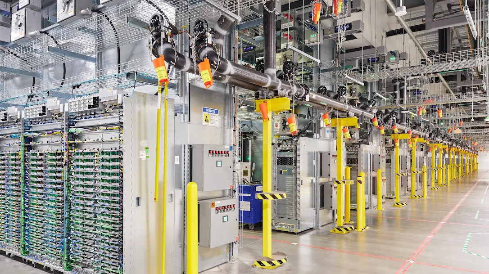

White space: server aisles in Google’s data center at New Albany, Ohio. The capture date is not stated. [Google Data Centers, photo gallery](https://www.datacenters.google/discover-more/photo-gallery/)

### Trace three paths through one rack

Now draw three paths through the same picture. Electrical energy arrives through conductors and conversion equipment. Heat leaves through air, liquid and heat-transfer equipment. Information arrives, moves between machines and leaves through communication links. The three arrows mean different things. Coolant circulates around a loop and comes back, while heat crosses an exchanger from one loop into the next. Data can travel both ways along a link, while electrical energy keeps flowing into the equipment. Give each arrow one meaning, and the drawing shows how the parts really connect.

NVIDIA’s GB300 NVL72 gives the lesson a real rack. Its enterprise reference architecture lists a full-rack requirement of up to 142 kilowatts (kW). That is a published ceiling for planning, the most the rack should need, and the facility in this lesson takes it as each rack’s draw at its alternating-current (AC) input.

The same rack shows that the information path has boundaries of its own. A GB300 NVL72 holds 72 Blackwell Ultra graphics processing units (GPUs) in 18 compute trays, and nine NVLink switch trays connect every GPU to every other GPU in the rack, so all 72 can work as one multi-GPU unit. That group is a scale-up domain. A separate scale-out network connects racks to one another, storage traffic travels on a network of its own, and at the campus edge a carrier takes traffic to other sites and users. Each network has its own bandwidth budget and physical reach, so where a job is placed decides which of its exchanges stay on the rack fabric and which cross the cluster.

### Draw the boundary, then close the ledger

A boundary is the imaginary line around the equipment you are accounting for. Draw it tightly around a processor and its voltage regulators may lie outside. Draw it around a rack and those regulators, the fans and the power supplies may all be inside. Draw it around the facility and the cooling pumps and outdoor heat-rejection equipment join the account. Widening the boundary changes which loads you count, while every load keeps drawing exactly what it drew before. So always ask where the meter sits relative to the line.

Now fill in a facility. Ten GB300 racks draw 142 kW each at their AC inputs. Networking and storage equipment outside those racks, on its own meters, draws another 80 kW, and it counts as IT load alongside the computers. Behind the IT sit three facility loads: 40 kW lost in upstream electrical conversion, 240 kW for the cooling machinery and 20 kW for other facility equipment, 300 kW of overhead in all. Each load sits in exactly one category, so the categories add without overlap. The worked example below does the sums: 1,500 kW of IT and 1,800 kW at the facility input.

Compare that demand with a supply whose nameplate is 2,000 kW. The nameplate is a rating, and the 1,800 kW is the load drawn through it. Treat the gap between them as headroom at that one rating: redundancy requirements, cooling and downstream electrical limits can each run out before it does. The whole facility shares the nameplate, too. Its 300 kW of overhead flows through the same supply as the 1,500 kW of IT.

Over a steady interval, nearly all of that electrical input ends up as heat. Computing produces valuable results, yet the results themselves carry away a negligible share of the energy, so the electrical input sets the cooling requirement. The 1,500 kW of IT therefore means about 1,500 kW of heat to remove from the IT equipment. The other 300 kW turns into heat as well, in the electrical rooms, the cooling plant and elsewhere in the building, and the boundary you draw decides where the compressor and pump power enters the thermal account.

The word “about” matters. During a transient, stored electrical energy can rise or fall, the equipment’s own material can warm up or cool down, and a little energy leaves as light and signals. Over a steady interval those effects are small, which makes the balance a sound engineering approximation. It holds while heat is removed as fast as it is made.

### Use the ledger to catch mistakes

Double counting is the usual mistake, and the meter’s position decides what counts twice. Each 142 kW is measured at a rack’s AC input, so everything that runs inside the rack is already in it: the GPUs, the fans, and the power supplies together with their conversion losses. Start instead from a meter downstream of those supplies, which misses their losses, and the losses become a line of their own. One move of the meter changes the arithmetic, while every piece of equipment keeps its name.

A line-by-line ledger takes more work than one campus number, and it earns that work back the first time someone claims a saving. Ask which line moved: electrical losses, cooling overhead, or energy per finished task. Cut the racks’ input by 100 kW and there is 100 kW less heat to remove. Move a converter out of the rack into the room next door and the rack’s number falls by the converter’s loss, while the facility’s total stays exactly where it was. The loss has changed address.

Now remove the cooling power arrow and leave the IT electricity connected. The racks keep turning 1,500 kW into heat with the removal path gone, so the heat accumulates and the equipment warms. How fast it warms, and how long it can keep running, depends on thermal storage, coolant flow, controls and equipment limits, which the thermal lessons model. The ledger’s job is to expose the missing dependency. Naming the dependency before estimating a time is a habit that carries through every later electrical and thermal comparison.

### Worked example: Ten GB300 racks behind a 2 MW supply

- Each of ten GB300 NVL72 racks draws its published 142 kW upper requirement at its AC input; this operating point is assumed, not measured.
- Rack input totals already include their internal power supplies and fans.
- Separately metered networking and storage lie outside the ten rack totals.
- All values are simultaneous steady real power; the 2,000 kW supply nameplate is a rating.

1. Compute-rack input — 10 × 142 kW = 1,420 kW — Multiply the per-rack input by the number of identical racks.
2. All IT — 1,420 + 80 = 1,500 kW — Include separately metered networking and storage once.
3. Facility input — 1,500 + 40 + 240 + 20 = 1,800 kW — Add electrical losses, cooling, and other facility loads at matching boundaries.
4. Margin at the supply — 2,000 − 1,800 = 200 kW — This is arithmetic margin at one rating, not usable IT capacity.
5. Four-hour energy — 1,800 kW × 4 h = 7,200 kWh — Holding the load constant turns a rate into an energy total.

**Result:** The facility draws 1.8 megawatts (MW) against a 2 MW nameplate; IT contributes approximately 1.5 MW of heat.

**Model boundary:** The heat figure concerns IT equipment; it is not the duty of a specified outdoor cooling device, and the 200 kW margin ignores redundancy and downstream limits.

### The tradeoff

Choice: Meter each subsystem as well as the facility total.

Benefit: Each line of the ledger gets its own reading, so a claimed saving shows up on the line that moved: rack input, electrical losses or cooling.

Cost: More meters, and their readings must cover the same interval before they can be added.

### When the situation changes

Trigger: IT stays powered while its only heat-removal path fails.

Mechanism: Electrical input keeps turning into heat, which now accumulates in the equipment and its coolant, so temperatures rise.

Response: Name the lost heat path, then use a thermal model of storage, flow and equipment limits before predicting how long operation can continue.

### Apply the idea

If 70 kW of the ten racks’ measured input is internal supply loss, should facility power become 1,870 kW? Separately, sketch an IT hall and its supporting electrical room. A rack converter moves to a cabinet beside the rack, then to that room. Label white and gray space at each step. Does either move show lower facility power or a smaller building?

Reveal the worked answer

No. It remains 1,800 kW. The rack and the adjacent cabinet occupy white space; the separate electrical room is gray space. Neither move by itself shows lower facility power or a smaller building.

The 70 kW is already part of the 1,420 kW rack input. It becomes a separate line only when the ledger starts from a meter downstream of the supplies. Area labels locate equipment, and the equipment draws the same power wherever it stands. A freed rack slot is one gain; the new cabinet or room, its service access and its cable and replacement routes are costs that a footprint claim must also count.

**The idea to keep:** Choose the boundary before adding watts, and count each load once. Nearly all the power the IT equipment draws, computation included, comes back out as heat.

### Sources

- [EIA — Laws of energy](https://www.eia.gov/energyexplained/what-is-energy/laws-of-energy.php) — www.eia.gov · Reviewed 2026-09-06. Energy changes form rather than disappearing; the ledger uses conservation.
- [DOE — Best Practices Guide for Energy-Efficient Data Center Design](https://www.energy.gov/sites/default/files/2024-07/best-practice-guide-data-center-design_0.pdf) — www.energy.gov · Published 2024-07 · Reviewed 2026-09-06. Data-center accounting separates IT, electrical, and cooling systems.
- [Leviton — Data center white space and gray space](https://leviton.com/support/literature/newsletters/insider/insideroctober2025/focusedproductoctober2025) — leviton.com · Published 2025-10 · Reviewed 2026-09-10. White space houses IT; gray space describes supporting back-of-house infrastructure.
- [Vertiv — Deploying Liquid Cooling in the Data Center](https://prod.vertiv.cn/4a9616/globalassets/documents/white-papers/liquid-cooling/vertiv-liquidcooling-wp-en-na-sl-71113-web.pdf) — prod.vertiv.cn · Published 2023 · Reviewed 2026-09-10. Cooling equipment may occupy white space or a grey-space mechanical gallery; service and replacement need room in either location.
- [NVIDIA NVL72 AI Factory — System Hardware & Components](https://docs.nvidia.com/enterprise-reference-architectures/nvl72-ai-factory/latest/components.html) — NVIDIA · Reviewed 2026-09-12. Describes the GB300 NVL72 rack’s compute trays, in-rack switched connectivity, external compute and storage networks, management, power shelves and cooling interfaces, with a full-rack requirement of up to 142 kW.
- [Google Data Centers — Photo gallery](https://www.datacenters.google/discover-more/photo-gallery/) — Google · Reviewed 2026-09-26. Google’s photograph of server aisles in its New Albany, Ohio data center shows a data hall’s white space.

## A megawatt is not a megawatt-hour

**2. Data center overview**

Integrate a stepped load profile, distinguish average and peak demand, and test what interval sampling hides.

**Driving question:** How can two facilities use equal energy but need different electrical capacity?

### Read the height and the area

Power tells you how quickly energy is transferred. One watt is one joule per second; a kilowatt is one thousand watts, and a megawatt is one thousand kilowatts. Energy includes duration. One megawatt-hour is the energy transferred by a constant one-megawatt rate for one hour. The hour is multiplied by the power, not divided into it. A battery described as one megawatt-hour does not necessarily have a one-megawatt output capability.

Draw time horizontally and power vertically. The height answers how much power the system must deliver at that moment. The area under the trace answers how much energy was delivered during an interval. A rectangular segment has width measured in hours and height measured in megawatts, so its area is measured in megawatt-hours. For a stepped trace, find each rectangle's area and add them. This is the same idea used by integration, without requiring calculus.

A capacity rating is a limit or capability stated under conditions. A measured load is what equipment actually draws. If a service is rated 12 MW, the most we can say from that number alone is that a specified capacity claim exists at that boundary. We cannot conclude that the site draws 12 MW continuously, that its cooling can remove the associated heat, or that IT is installed. Even multiplying 12 MW by a year only creates an energy ceiling under the added assumption of continuous full loading.

### Calculate a day, then change its shape

Take a facility whose live inference plus fixed facility support draws a steady 4 MW. An offline evaluation queue, a fixed set of prompts to run against a model checkpoint, is ready at 00:00 and due at 24:00, and it needs 48 megawatt-hours (MWh) of added energy. Run all its batches together and the queue adds 4 MW for 12 hours: the facility draws 8 MW for those 12 hours and 4 MW for the other 12. The two energy blocks are 96 and 48 MWh, 144 MWh in all. Spread that energy evenly across the day and the average is 144 divided by 24, or 6 MW. The peak is still 8 MW, so a 6 MW connection could not carry this trace.

Now stagger the batch starts and limit how many run at once, so the queue adds 2 MW for all 24 hours. The facility draws a flat 6 MW. Total energy is still 144 MWh and the queue still finishes by the deadline, but peak demand falls from 8 MW to 6 MW. Scheduling has changed the capacity the site needs while the work and its energy stay the same. Live inference keeps answering users as before; only the independent evaluation batches move. The comparison assumes spare compute is available all day and that the evaluations use the same energy and give the same results, whereas a real schedule change can alter GPU efficiency, idle power and cooling. In the lab below, 8 MW for 12 hours followed by 4 MW for 12 hours gives 144 MWh at a 6 MW average and an 8 MW peak; one 6 MW segment of 24 hours reproduces the staggered day.

Look at the headroom under a 6.5 MW supply limit. Running together, the 8 MW hours exceed it by 1.5 MW. Staggered, every hour leaves 0.5 MW of arithmetic margin. Neither number is a complete admission policy for a new workload: other equipment, redundancy requirements and fast excursions may bind first. An arithmetic margin at a meter is useful evidence about that meter, and the equipment downstream of it needs its own check.

### Measurement resolution changes the question

Suppose a displayed five-minute average is 8 MW. That display could come from a constant 8 MW draw. It could also come from one minute at 12 MW followed by four minutes at 7 MW: the energy-equivalent average is (12 + 4 × 7) divided by 5, also 8 MW. These traces are indistinguishable to the average yet impose different peak demands. When investigating a disturbance, collect measurements at a timescale capable of seeing the behavior in question.

The converse mistake is turning a brief spike into a full-day energy assumption. A one-minute excursion may matter to control and protection while adding little to the daily energy total. Quantify both before deciding what to change. A storage device might smooth a short peak if its power, usable energy, controls, and connection permit it. It cannot be selected merely by comparing the daily MWh with a capacity label.

There is also an operational tradeoff. Flattening a flexible training workload may reduce peaks but postpone completion. Flattening interactive demand by making people wait changes the service being delivered. A fair comparison therefore keeps the workload deadline or latency requirement beside the power trace. If the service requirement changes, acknowledge that change instead of reporting a pure electrical improvement.

When you read an energy bill, equipment rating, or monitoring graph, name four things before calculating: the electrical boundary, the units, the duration, and whether the value is a measurement or a rating. Those four labels determine which arithmetic is meaningful. They also prevent a monthly energy total from masquerading as a transient power model, or a large planned connection from masquerading as electricity already consumed.

### Worked example: Two schedules for one evaluation queue

- Live inference plus fixed support draws 4 MW all day.
- The evaluation queue needs 48 MWh, is ready at 00:00 and is due at 24:00.
- All loads are measured at the same facility input against a 6.5 MW supply limit.

1. Run together — 8 MW × 12 h + 4 MW × 12 h = 96 + 48 = 144 MWh — Area equals power multiplied by time; the queue adds 4 MW × 12 h = 48 MWh.
2. Average and peak — 144 / 24 = 6 MW average; 8 MW peak — Divide energy by the full duration to recover average power; the peak is the tallest segment.
3. Stagger — (4 + 2) MW × 24 h = 144 MWh — Spreading the same 48 MWh over 24 hours adds only 2 MW.
4. Supply check — 8 − 6.5 = 1.5 MW over; 6.5 − 6 = 0.5 MW spare — Only the staggered schedule fits under the 6.5 MW limit.

**Result:** Both schedules use 144 MWh and finish the queue on time; staggering lowers the peak from 8 MW to 6 MW, below the 6.5 MW limit.

**Model boundary:** Each segment is a constant average. The model shows neither subinterval peaks nor the changes in GPU efficiency, idle power or cooling that a real schedule change can cause.

### The tradeoff

Choice: Stagger the evaluation batches across the day instead of running them together.

Benefit: Peak demand falls from 8 MW to 6 MW while the queue’s 48 MWh and its deadline stay the same in the model.

Cost: Spare compute must be available all day, individual batches finish later, and real GPU efficiency, idle power and cooling can change with the schedule.

### When the situation changes

Trigger: Use a five-minute average to assess a one-minute limit violation.

Mechanism: Averaging can hide the peak that challenged the electrical system.

Response: Compare the relevant time-resolved trace with the applicable limit and measurement boundary.

### Apply the idea

A 2 MW excursion lasts 90 seconds. How much extra energy is it, and does that determine the storage output rating?

Reveal the worked answer

Extra energy is 0.05 MWh, or 50 kWh; the output power must separately support the 2 MW excursion.

Ninety seconds is 90/3,600 = 0.025 hours. Multiplying by 2 MW gives 0.05 MWh. Energy alone says nothing about whether an inverter can deliver 2 MW.

**The idea to keep:** Capacity constrains a rate; energy adds that rate across time.

### Sources

- [EIA — Measuring electricity](https://www.eia.gov/energyexplained/electricity/measuring-electricity.php) — www.eia.gov · Reviewed 2026-09-06. kW and MW measure power; kWh and MWh include elapsed time.
- [OpenStax — Electrical Energy and Power](https://openstax.org/books/university-physics-volume-2/pages/9-5-electrical-energy-and-power) — openstax.org · Published 2016-10-06 · Reviewed 2026-09-06. Electrical power is a rate of energy transfer.
- [Google Cloud — Best practices for batch inference on GKE](https://docs.cloud.google.com/kubernetes-engine/docs/best-practices/machine-learning/inference/batch-inference) — Google Cloud · Reviewed 2026-09-12. Distinguishes scheduled, latency-tolerant batch inference from real-time serving and from request batching.

## Attach a denominator and a date

**2. Data center overview**

Reconcile facility and IT metrics, then separate engineering laws, scenarios, product specifications, and operating evidence.

**Driving question:** What does an efficiency or capacity claim actually establish?

### A ratio answers the question in its denominator

Suppose a facility meter records 1,800 kilowatt-hours (kWh) over one hour, while matching IT meters record 1,500 kWh, including networking and storage. The ratio of facility to IT energy is 1,800 divided by 1,500, or 1.20. The overhead is 300 kWh. Relative to IT, that overhead is 300/1,500 = 20 percent; relative to total facility energy, it is 300/1,800 ≈ 16.7 percent. Both percentages are correct. Their denominators differ, so their meanings differ.

That ratio of facility energy to IT energy over the same interval is the facility’s power usage effectiveness (PUE) for that hour. Formal PUE reporting defines measurement categories and periods, and a published figure normally follows those rules, so label a one-hour or one-day ratio with its interval and keep it apart from an annual report. An energy ratio over any period also differs from the instantaneous power ratio at a hot afternoon peak or during an outage, and an annual summary cannot supply an unmeasured plant operating curve.

Now add service. Assume that hour completes 600 accepted jobs under a fixed workload definition. It uses 1,800 kWh divided by 600 jobs, or 3.0 kWh per completed job at the facility boundary. Using IT energy instead gives 2.5 kWh per job. These are different useful measurements. A compute-only submeter might give another value. State whether the job count includes failures, retries, and jobs that missed their deadline; otherwise the denominator can improve on paper while users receive a worse service.

### Compare outcomes without changing the test

Start by isolating facility overhead. Hold the installed IT, the completed workload and the hour’s IT energy at 1,500 kWh. Reduce supporting-system energy from 300 to 150 kWh: facility energy falls from 1,800 to 1,650 kWh, PUE for the hour falls from 1.20 to 1.10, and facility energy per job falls from 3.0 to 2.75 kWh. IT capacity and actual IT energy both stay fixed, and they remain distinct quantities. The overhead reduction is an assumed input. In the lab below, the same facility runs for a whole day: 36 MWh of IT energy, 7.2 MWh of overhead and 14,400 accepted jobs give PUE 1.2 and 3 kWh per job, and cutting overhead to 3.6 MWh gives PUE 1.1 and 2.75 kWh per job.

Fair comparisons require matching conditions. A faster or lower-energy run at a different model quality, precision, input length, batch size, or failure policy is not automatically an improvement for the original service. Record the changed condition and decide whether it is acceptable. The same discipline applies to a site case: a source-side connection rating and a rack count collected months apart cannot be combined as though they were simultaneous measurements of one commissioned configuration.

### Extension: a higher ratio can mean less energy per job

Run the baseline facility for a full day. Day A uses 36 MWh of IT energy and 7.2 MWh of overhead, 43.2 MWh in all, and completes 14,400 accepted jobs at 3.0 kWh each. Day B completes the same 14,400 jobs with 30 MWh of IT energy while overhead stays at 7.2 MWh. Day B’s ratio rises to 37.2/30 = 1.24, yet it uses 37.2 MWh, about 2.58 kWh per job and 14 percent less energy for the same useful work. Judging only by the overhead ratio would punish the better total-energy result.

Reverse the experiment. Add an unnecessary 6 MWh of IT consumption to Day A without changing useful output or facility overhead. The ratio falls to 49.2/42 ≈ 1.17 because the denominator grows, even though total electricity use increases. Overhead metrics still earn their place; pair each one with the outcome it cannot measure. Facility overhead, workload efficiency, resource use and availability are separate questions, and a dashboard should keep them separate rather than compressing them into one score. In the lab, set IT energy to 30 MWh to see Day B.

### Sort evidence before drawing a conclusion

Classify six example statements. First, energy is conserved: that is a physical principle, with the chosen boundary determining the bookkeeping. Second, the ledger in “One rack, three paths” assumes each of ten GB300 racks draws 142 kW: that is a teaching input. Third, a manufacturer's document rates a product at a specified voltage and load: that is a product specification under its stated conditions. Fourth, an operator reports that a particular building began a named workload on a particular date: that is a dated operating claim, whose scope is limited by the evidence given.

Fifth, a developer announces a future campus capacity: that shows a stated intention, not installed equipment. Sixth, an analyst predicts a future architecture's market share: that is a forecast, not a measurement. A credible author can produce several of these evidence types in one article. Authority does not make the types interchangeable. Preserve the distinction in notes and diagrams so a forecast never quietly becomes the assumed as-built configuration of a real facility.

To call additional capacity operational, ask which complete service path has been shown to work. The answer may require connection status, installed and accepted electrical equipment, cooling at the applicable conditions, configured IT, and actual workload evidence. Different questions need different documents. Commissioning reports show tested behavior within their scope, while months of productive utilization need operating records. One building may be operating while the rest of the campus is still in construction.

The practical payoff is precision rather than skepticism for its own sake. You can calculate confidently when the scenario supplies the necessary inputs, and you can stop cleanly when a real claim does not. Mark the missing fact and the evidence that would resolve it. That produces a useful question for an operator or source author instead of a spurious decimal produced by multiplying unrelated headline numbers.

### Worked example: Lower overhead at the same IT energy

- Installed IT, completed work and IT energy stay fixed at 1,500 kWh over one hour.
- Supporting-system energy falls from 300 to 150 kWh; the reduction is assumed.
- The hour completes 600 identical accepted jobs.
- The ratio covers one hour; it is not an annual PUE report.

1. Baseline facility energy — 1,500 + 300 = 1,800 kWh — Facility energy is IT energy plus overhead over the same hour.
2. Baseline PUE — 1,800 / 1,500 = 1.20 — Facility energy is the numerator and IT energy the denominator.
3. Lower overhead — 1,500 + 150 = 1,650 kWh; 1,650 / 1,500 = 1.10 — Only the numerator changes, because IT energy is held fixed.
4. Energy per job — 1,800 / 600 = 3.0 kWh → 1,650 / 600 = 2.75 kWh — With the work fixed, the overhead saving also shows up per completed job.

**Result:** PUE falls from 1.20 to 1.10 and facility energy per job from 3.0 to 2.75 kWh, while IT energy stays at 1,500 kWh.

**Model boundary:** This comparison holds IT energy, workload definition, completion count, and the one-hour window fixed; it says nothing about how efficiently the IT equipment did the work.

### The tradeoff

Choice: Optimize an overhead metric alone.

Benefit: It highlights facility energy outside IT and helps track that category.

Cost: It cannot show computing productivity and can move opposite to total energy per useful result.

### When the situation changes

Trigger: Combine an announced connection with an unrelated rack specification to report operating compute.

Mechanism: The calculation supplies missing deployment, configuration, and utilization facts without evidence.

Response: Label the output as a conditional scenario or leave the operating quantity unknown.

### Apply the idea

A facility uses 150 MWh while IT uses 120 MWh. Is its 30 MWh overhead 20 percent or 25 percent?

Reveal the worked answer

It is 20 percent of facility energy and 25 percent of IT energy.

Thirty divided by 150 is 0.20; thirty divided by 120 is 0.25. Neither ratio says how many useful jobs the site completed.

**The idea to keep:** A useful claim has a defined boundary, time window, evidence type, and limit on what follows from it.

### Sources

- [DOE — Best Practices Guide for Energy-Efficient Data Center Design](https://www.energy.gov/sites/default/files/2024-07/best-practice-guide-data-center-design_0.pdf) — www.energy.gov · Published 2024-07 · Reviewed 2026-09-06. Facility efficiency metrics require defined IT and facility boundaries.
- [MLCommons — MLPerf Inference: Datacenter](https://mlcommons.org/benchmarks/inference-datacenter/) — mlcommons.org · Reviewed 2026-09-06. Benchmark energy/performance comparisons declare workload scenarios and measurement boundaries.
- [Commissioning & Performance Validation | AI Data Center Energy Performance Framework](https://www.ashrae.org/technical-resources/ai-data-center-framework/commissioning-performance-validation) — ASHRAE · Reviewed 2026-09-06. Commissioning and documented performance validation have a defined scope and evidentiary role.
- [The Green Grid — PUE: A Comprehensive Examination of the Metric](https://datacenters.lbl.gov/sites/default/files/WP49-PUE%20A%20Comprehensive%20Examination%20of%20the%20Metric_v6.pdf) — The Green Grid · Published 2012-10-02 · Reviewed 2026-09-11. PUE compares facility energy with IT equipment energy and cannot by itself establish useful-work efficiency.
- [The Wild Wild West Of LEGO Datacenters](https://newsletter.semianalysis.com/p/the-wild-wild-west-of-lego-datacenters) — SemiAnalysis · Published 2026-07-29 · Reviewed 2026-09-26. Describes the commissioning ladder L1 to L5: factory witness test, delivery and installation verification, pre-functional start-up, functional performance testing and integrated systems testing under simulated failures.

### Check your understanding: What does the meter establish?

Pause and make a prediction, then compare your reasoning.

A hypothetical campus records 12 MWh at the facility meter and 10 MWh at its IT meters during the same hour. An analyst adds them and reports 22 MW of useful compute.

**Pause and predict:** Correct the total and explain what these readings leave unknown.

Compare your reasoning

The facility averaged 12 MW, including the IT load. These readings do not measure useful compute output.

The IT boundary sits inside the facility boundary, so adding the two readings counts the IT energy twice. Over this hour, the facility used 2 MWh beyond the IT load and its energy ratio was 12 / 10 = 1.2. Neither that ratio nor the electrical demand tells us how much accepted work the campus completed.

**The next problem:** We can now account for the watts. What job must those watts support, and what counts as a successful result?

Continue in **3. Workloads and requirements**: Interactivity and total throughput.

## Interactivity and total throughput

**3. Workloads and requirements**

Use a GB300 NVL72 and Llama 3.1 70B to connect model state, context and service requirements to infrastructure demand.

**Driving question:** What must the infrastructure deliver for this workload to count as successful?

### Interactivity is output tokens per second per user

Interactivity is the output token rate experienced by one user after a large language model (LLM) starts generating. At 40 tokens per second per user, the average gap between tokens is 25 milliseconds; at 80 it is 12.5 milliseconds. Time to first token measures the separate initial wait. A token may be a whole word or part of a word. Total throughput counts output tokens across the system, so it answers a different question from the rate of an individual answer.

Serving more requests together can increase aggregate throughput while reducing interactivity. Choose the minimum acceptable per-user output rate, then benchmark how much throughput the system delivers while meeting that requirement.

NVIDIA’s August 2026 Figure 2 plots throughput per graphics processing unit (GPU) against interactivity for Qwen3.8-2.4T-A95B on GB300 NVL72, with 8k input and 1k output tokens, TensorRT-LLM, 8-bit floating point (FP8) and multi-token prediction. Set a minimum of 100, 200 or 300 tokens per second per user, and only the part of the curve to its right qualifies. Raising this threshold reduces the throughput available on that curve. It is a separate benchmark case from the Llama 3.1 70B memory ledger.

The plot does not tabulate concurrent users. Do not invent an exact session count or combine peak throughput with peak interactivity from different points. A supported-session answer requires the matching concurrency sweep, with its model, lengths, quality, precision and software fixed.

### Compare training and inference memory together

Training compute is counted in floating-point operations (FLOPs); FLOP/s expresses how fast those operations execute. These quantities describe the computational workload and its execution rate. Model quality still requires evaluation against the intended task. Inference throughput instead counts generated tokens across all users; first-token and inter-token latency describe the response experienced by each user.

Using the rounded class size of 70 billion parameters, inference weights stored in BF16, a 16-bit floating-point format that takes 2 bytes per value, require approximately 70 billion × 2 bytes = 140 decimal gigabytes (GB). A classic mixed-precision Adam training ledger stores 2-byte weights, 2-byte gradients, 4-byte master weights and two 4-byte optimizer moments: 16 bytes per parameter, or approximately 1,120 GB of state. The comparison explains why serving a model and training its parameters can require different distributions of state.

These are partial accounts. Inference also needs each request's key-value (KV) cache, the attention keys and values stored for tokens already processed, and runtime workspace. Training adds activations, communication buffers and other workspace. Precision, optimizer, recomputation, offload and sharding alter the numbers.

### Derive how context changes resident concurrency

Meta’s Llama 3.1 70B definition specifies 80 layers, hidden width 8,192, 64 query heads and eight KV heads. Head dimension is 8,192/64 = 128. With BF16 keys and values, each cached token occupies 2 × 80 × 8 × 128 × 2 = 327,680 bytes, or 320 kibibytes (KiB; 1 KiB is 1,024 bytes). This is model-specific full-context cache accounting; it excludes prefix sharing, block rounding, quantization and other implementation effects.

Choose a 64 gibibyte (GiB) allocation for KV cache, distinct from weights and workspace. At 8,192 cached tokens per request, each uses 2.5 GiB and the pool admits at most 25 requests. At 32,768 tokens, each uses 10 GiB and the pool admits six. The fourfold context increase changes resident concurrency on unchanged hardware. Maintaining 100 such sessions therefore needs at least four versus seventeen equivalent independent pools under this limited model. Those are not GPU counts: parallelism and replication determine which devices own each pool.

This is the facility connection: longer context can change replica requirements, memory traffic, communication and measured power for the same token service. Capacity alone does not predict token speed. A fitting allocation still needs an execution benchmark on the chosen hardware and software.

Prefix caching reuses stored keys and values for initial tokens that requests have in common, such as a shared system prompt. It does not mean that unrelated contexts can share arbitrary KV state. The calculation above counts each request independently; sharing an identical prefix can reduce that allocation.

DeepSeek’s V4 technical report shows another way to change the budget: compressed attention. Its Figure 1, below, compares V4-Pro and V4-Flash with V3.2 as sequence length grows. At about one million tokens of context, accumulated KV cache is 9.5 times smaller for V4-Pro and 13.7 times smaller for V4-Flash than for V3.2. Its architecture and KV storage formats differ from Llama 3.1 70B, so the preceding 320 KiB-per-token factor does not describe those curves.

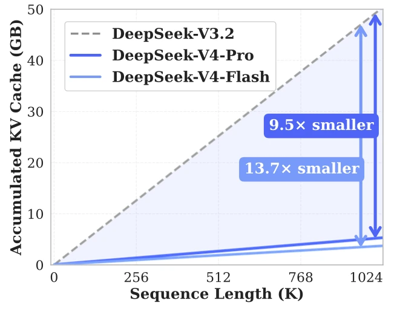

DeepSeek V4 technical report, Figure 1, KV-cache panel. Compressed attention and mixed KV precision make these curves a different model from the Llama 3.1 70B calculation above. [DeepSeek V4 technical report, Figure 1](https://arxiv.org/html/2606.19348v1)

### Carry a workload brief into design

Do not derive actual tokens per second by dividing a GPU peak-FLOPS number by one approximate operation count. Precision, sustained utilization, attention work, memory bandwidth, interconnects, batching and software all matter. State a service requirement first, then benchmark the intended workload and measure power at its actual electrical boundary.

Record complete-run energy, peak demand, transition duration and recovery behavior together with token delivery and response times. Those become inputs to siting, source capacity, cooling, protection and buffering decisions. A rack inventory and an average kW figure leave important parts of that brief unmeasured.

### Worked example: How context changes a fixed KV-cache pool

- Llama 3.1 70B geometry; BF16 KV entries.
- 64 GiB is a chosen cache allocation, excluding weights and workspace.
- Equal full contexts; no prefix sharing, block rounding or cache quantization.

1. Per-token state — 2 × 80 × 8 × 128 × 2 = 327,680 bytes = 320 KiB — K and V × layers × KV heads × head dimension × bytes per element.
2. 8,192-token context — 8,192 × 320 KiB = 2.5 GiB; floor(64 / 2.5) = 25 requests — Each complete active request occupies its context state.
3. 32,768-token context — 32,768 × 320 KiB = 10 GiB; floor(64 / 10) = 6 requests — Longer contexts reduce resident concurrency without changing the cache allocation.

**Result:** The same pool holds 25 or six complete contexts; this changes the service capacity problem.

**Model boundary:** Memory capacity is not throughput. Pool count is not GPU count; actual runtime allocations need measurement.

### When the situation changes

Trigger: Accept a short compute benchmark as proof of production service.

Mechanism: The test excludes queueing, data movement, recovery, or the required workload distribution.

Response: Match acceptance conditions to the actual service and measure the missing phases.

### Apply the idea

A customer keeps the same active-session count but increases context from 8,192 to 32,768 tokens. What must be revisited before promising unchanged token speed and power?

Reveal the worked answer

Revisit cache allocation and request admission, then benchmark the intended parallelism/replicas and token latency at the new lengths.

The fixed pool admits fewer full contexts. Adding capacity or distributing the model changes power and communication; neither arithmetic memory fit nor a peak-FLOPS rating supplies the missing performance measurement.

**The idea to keep:** Start with accepted work and its constraints; hardware quantities follow from a measured workload model.

### Sources

- [NVIDIA — DGX SuperPOD Key Components](https://docs.nvidia.com/dgx-superpod/reference-architecture-scalable-infrastructure-h100/latest/dgx-superpod-components.html) — docs.nvidia.com · Reviewed 2026-09-16. A documented AI cluster architecture includes compute, management, networking, and storage components.
- [MLCommons — MLPerf Inference: Datacenter](https://mlcommons.org/benchmarks/inference-datacenter/) — mlcommons.org · Reviewed 2026-09-06. Benchmark results depend on a declared workload scenario and measurement conditions.
- [Meta — Llama model SKU architecture definitions](https://github.com/meta-llama/llama-models/blob/main/models/sku_list.py) — Meta · Reviewed 2026-09-12. Llama 3.1 70B architecture: hidden width 8,192, 80 layers, 64 query heads and 8 key/value heads.
- [ZeRO: Memory Optimizations Toward Training Trillion Parameter Models](https://arxiv.org/html/1910.02054) — Microsoft Research authors / arXiv · Published 2019-10-04 · Reviewed 2026-09-12. Mixed-precision Adam training keeps two bytes each for weights and gradients, four for a master copy of the weights and eight for the two optimizer moments: 16 bytes per parameter before activations and buffers.
- [NVIDIA NVL72 AI Factory — System Hardware & Components](https://docs.nvidia.com/enterprise-reference-architectures/nvl72-ai-factory/latest/components.html) — NVIDIA · Reviewed 2026-09-12. The GB300 NVL72 rack contains 72 Blackwell Ultra GPUs.
- [NVIDIA AIPerf — Metrics Reference](https://docs.nvidia.com/aiperf/reference/ai-perf-metrics-reference) — NVIDIA · Reviewed 2026-09-13. Defines per-user output token throughput as the reciprocal of inter-token latency, separately from total throughput and time to first token (TTFT).
- [NVIDIA — Qwen3.8 throughput and interactivity on GB300 NVL72](https://developer.nvidia.com/blog/serve-qwen3-8-2-4t-a95b-a-2-4t-parameter-model-with-configurable-reasoning-on-nvidia-gb300-nvl72/) — NVIDIA · Published 2026-08-12 · Reviewed 2026-09-13. Figure 2 plots throughput per GPU against per-user interactivity for Qwen3.8-2.4T-A95B on GB300 NVL72 at 8k input and 1k output tokens, with TensorRT-LLM, FP8 and multi-token prediction.
- [DeepSeek-V4: Towards Highly Efficient Million-Token Context Intelligence](https://arxiv.org/html/2606.19348v1) — DeepSeek-AI · Published 2026-04-26 · Reviewed 2026-09-14. Figure 1 and section 2.3.4 compare accumulated KV-cache state for V3.2, V4-Pro and V4-Flash.
- [vLLM — Inside vLLM: Anatomy of a High-Throughput LLM Inference System](https://vllm.ai/blog/2025-09-05-anatomy-of-vllm) — vLLM · Published 2025-09-05 · Reviewed 2026-09-14. KV blocks for identical token prefixes can be reused across requests.

## Measure complete useful work and diagnose exposed waits

**3. Workloads and requirements**

Compare energy at fixed accepted output and align training dependencies with power rather than treating activity or mean kW as a service result.

**Driving question:** Does the power reduction improve energy for the same completed work, and what dependency is consuming the time?

### Keep the completed token workload fixed

Compare two runs that produce the same accepted outputs at the same quality within a common system boundary. Run A averages 100 kW for 10 minutes: 100 × 10/60 = 16.7 kWh. Run B averages 80 kW for 15 minutes: 80 × 15/60 = 20 kWh. B draws less power but takes five minutes longer, so it consumes 20 percent more energy for the same work.

Count waiting, supporting equipment and the complete run at the same meter. Compare these energy totals alongside accepted output and response time. A short GPU compute-phase power sample and rack alternating-current (AC) energy over an entire job describe different boundaries.

### Locate the dependency that exposed the wait

A synchronous training step may require collective gradient exchange before its next update can complete. If the required exchange is late, workers remain allocated and powered while dependent computation waits. Allocation is a reservation; useful training progress is an outcome. Communications may overlap arithmetic, so the presence of network traffic does not itself identify a stalled step.

Align collective timings, GPU activity and power, network counters and storage events. Then test a specific hypothesis: an exposed collective, input starvation, checkpoint traffic or another dependency. Merely observing lower GPU utilization cannot identify the root cause, nor can high memory activity be treated as universally maximum power.

### Connect the diagnosis to the facility

Synchronized dependency changes can align the power transitions of many workers. The production H100 example in the next lesson shows that such variation is observed; the controlled traces explain how it adds at a shared meter. Removing a bottleneck may raise average useful compute and change power demand, so record token or training progress and the electrical trace together.

An inference load balancer places eligible requests on serving replicas. It does not perform the same function as an electrical buffer, and it cannot arbitrarily shift one worker inside a coupled training collective. Software and power remedies must match the actual dependency.

### Worked example: Less mean power, more energy for identical output

- Runs finish the same accepted token workload at the same quality.
- Power is the mean over each entire run at the same meter.
- Run A averages 100 kW for 10 minutes; run B averages 80 kW for 15 minutes.

1. Run A — 100 kW × (10 / 60) h = 16.7 kWh — Ten minutes is one-sixth of an hour.
2. Run B — 80 kW × (15 / 60) h = 20 kWh — The extra five minutes outweighs the reduction in mean power.

**Result:** Run B consumes 20 kWh instead of 16.7 kWh for the same accepted output: 20 percent more energy.

**Model boundary:** A real power-performance curve and quality-controlled benchmark are needed to choose a configuration.

### The tradeoff

Choice: Keep spare serving capacity to absorb incoming requests.

Benefit: Requests can begin sooner during bursts.

Cost: Average allocation can be lower, and idle energy must be included in the service account.

### When the situation changes

Trigger: Count allocated hardware as useful work.

Mechanism: A job retains resources during waits, retries, or failures while the allocation metric stays high.

Response: Inspect synchronized phase and accepted-output traces, then test the suspected bottleneck.

### Apply the idea

A power-capped run draws less mean power but shows longer collective waits. Which measurements would distinguish an energy improvement from a slower, less efficient job?

Reveal the worked answer

Measure whole-run duration and integrated energy, accepted output/quality, and aligned collective and GPU activity traces under both settings.

Mean power alone lacks duration and output. Correlated traces locate an exposed dependency; a controlled comparison tests whether the cap changed it.

**The idea to keep:** Define utilization by the resource and denominator; measure useful output independently of power.

### Sources

- [MLCommons — MLPerf Inference: Datacenter](https://mlcommons.org/benchmarks/inference-datacenter/) — mlcommons.org · Reviewed 2026-09-06. The public MLPerf power description measures the system AC boundary during the performance measurement.
- [NVIDIA — DGX SuperPOD Key Components](https://docs.nvidia.com/dgx-superpod/reference-architecture-scalable-infrastructure-h100/latest/dgx-superpod-components.html) — docs.nvidia.com · Reviewed 2026-09-16. Compute, storage, and communication are distinct cooperating parts of a cluster.
- [Microsoft, OpenAI and NVIDIA — Power Stabilization for AI Training Datacenters](https://arxiv.org/html/2508.14318v1) — Microsoft, OpenAI and NVIDIA authors / arXiv · Published 2025-08-20 · Reviewed 2026-09-12. Reports production training power swings that follow synchronized compute and communication phases, and compares software smoothing, GPU power controls and rack-level energy storage.

## The workload has a rhythm

**3. Workloads and requirements**

Connect request queues and job phases to latency, aggregate power, and the limits of a benchmark-derived design envelope.

**Driving question:** How do batching and synchronized phases change demand without changing installed equipment?

### Prefill and decode use hardware differently

LLM prefill processes the prompt and creates the request’s initial KV cache. Many prompt tokens can be processed together, giving the GPU substantial parallel matrix work: prefill is usually compute-bound. Decode generates tokens successively. At low batch sizes, fetching model weights and cached context can take more time than the arithmetic itself: decode is often memory-bandwidth-bound. Larger batches, long contexts, model design and the hardware can change which resource limits performance. Time to first token includes queueing and prompt processing; time between output tokens concerns the stream after that.

Weight reuse helps explain why prefill is usually compute-bound while low-batch decode is memory-bandwidth-bound. The model’s weights live in the GPU’s high-bandwidth memory (HBM). A matrix operation copies a small block of them, a tile, into much smaller on-chip memory, where one token vector or several can use it before it is replaced. With eight token vectors instead of one, the same tile read supports eight times the arithmetic. Prefill supplies many prompt tokens at once, and batching decode requests supplies several, so both reduce the weight bytes fetched per token. On-chip memory is far smaller than HBM, so this reuse happens one tile at a time rather than by keeping the whole model on the chip.

vLLM describes continuous scheduling of running and waiting requests. When one sequence finishes, the scheduler can admit new work while others continue. Take two batch slots and three requests: A needs two decode steps, B five and C three, and C is already queued. The fixed batch waits for B; the continuous case admits C after A finishes. Each step is one iteration, not an equal wall-clock duration, and the comparison is not a measured speedup. Real admission also depends on prefill work, token budgets and KV capacity.

This matters to facility reasoning because active request membership changes compute and memory demand. Continuous batching is a documented serving mechanism, not a guarantee that rack power stays constant.

These bottlenecks are tendencies. A short prompt may offer too little parallel matrix work to saturate compute. A large decode batch can reuse each loaded weight across enough tokens that matrix multiplication becomes compute-bound, while attention or interconnect traffic may still be limiting. Model, context length, batch size, parallelism and hardware determine the actual bottleneck.

### NVIDIA uses separate racks for prefill and decode

NVIDIA Groq 3 LPX is a rack of 256 Groq language processing unit (LPU) accelerators deployed alongside Vera Rubin NVL72 GPU racks. In NVIDIA’s standard prefill–decode configuration, Rubin processes the prompt and transfers its KV cache once per turn. Groq LPX then uses that cache and model weights held in on-chip static random-access memory (SRAM) to generate the response. Each LPU has 500 megabytes (MB) of SRAM with 150 terabytes per second (TB/s) of bandwidth, 128 GB across the rack, which suits decode's constant weight reads but gives each chip far less capacity than a GPU's HBM. The two phases can therefore use hardware suited to different demands, connected by a cache handoff.

This example pairs Groq with Rubin GPUs. NVIDIA also describes an attention–feed-forward network (FFN) configuration that divides work within decode, plus speculative decoding with a separate draft model. The standard prefill–decode split shows the hardware division most clearly.

### Start with production evidence, then use a controlled trace

Choukse and colleagues from Microsoft, OpenAI and NVIDIA publish production DGX-H100 training power telemetry in Figure 1 of their 2025 paper. They connect synchronized compute and communication phases to power variation visible at larger electrical boundaries. The source figure is normalized, not a GB300 kW rating. Their later storage figures are simulations and their GB200 power-smoothing figure is a microbenchmark; neither is relabeled as production storage evidence.

Now take a simplified 60-second cycle: 30 seconds compute at 120 kW, 15 exchange at 40 kW and 15 save at 60 kW. Its energy is 5,100 kJ and mean power 85 kW. Four coincident copies give 480, 160 and 240 kW at the shared meter, with 340 kW mean. The values show how phases add at a shared meter; a real training job has its own phase lengths.

### Use staggering only when its dependency assumptions hold

If four independent periodic jobs can shift by 0, 15, 30 and 45 seconds without extra waiting, contention or missed deadlines, two compute while one exchanges and one saves: 340 kW throughout the ideal cycle. Their energy remains 5.667 kWh. This is a conditional scheduling thought experiment, not an assertion that production artificial intelligence (AI) clusters routinely use these offsets.

Workers inside one synchronous job are a different case. Delaying a participant may force the others to wait at a collective, violating the unchanged-duration assumption. The lesson is to identify which scheduling freedom actually exists before proposing it as a power remedy.

### Read the trace to choose a response

Read peak power, change magnitude, transition duration, repetition and energy at the intended meter. In a separate assumed transition, 480 to 160 kW over two seconds is a 160 kW/s decrease; over 0.2 seconds it is 1,600 kW/s. The same two plateaus can require a very different response. These ramp examples do not silently change the energy of the ideal stepwise cycle.

Schedulers change eligible workload timing. Supported GPU power controls change device behavior, potentially affecting runtime or energy. Storage changes source-facing power within its conversion, charge, discharge and usable-energy limits. Choose among them using workload dependencies and electrical timescales. A request load balancer does not provide stored energy, and a buffer cannot sustain an average power deficit indefinitely.

### End with the engineering handoff

End with a workload brief. Carry model and hardware identity, software/precision, prompt/output lengths, active sessions, token delivery, first-token targets and quality. Add a measured power trace, complete-run energy and recovery cases at a declared boundary. This supports the next siting/supply decision; unknown rack throughput and electrical behavior remain unknown.

### Worked example: Synchronized versus staggered independent jobs

- Four identical, independent jobs each repeat a 60-second cycle.
- Per job: 30 s at 120 kW, 15 s at 40 kW, and 15 s at 60 kW.
- Staggering causes no extra waiting or resource contention in this model.

1. One-job average — (120 × 30 + 40 × 15 + 60 × 15) / 60 = 85 kW — Weight each power by its time fraction.
2. Four-job energy — 4 × 5,100 / 3,600 = 5.667 kWh per cycle — The same individual phase durations imply the same aggregate energy.
3. Synchronized maximum — 4 × 120 = 480 kW — All jobs occupy the high-power phase simultaneously.
4. Ideal staggered power — 2 × 120 + 40 + 60 = 340 kW — A fifteen-second offset maintains this composition of phases.

**Result:** The ideal staggering lowers the peak from 480 to 340 kW while preserving cycle energy.

**Model boundary:** This result requires independent jobs and excludes contention; it cannot be imposed on synchronized workers without analysis.

### The tradeoff

Choice: Admit new inference requests during ongoing decode rather than waiting for a fixed batch to finish.

Benefit: Released execution/cache capacity may serve queued work sooner.

Cost: Admission and prefill still consume resources; memory occupancy, latency, quality and power need measurement.

### When the situation changes

Trigger: Assume a smooth average remains smooth during synchronized job transitions.

Mechanism: Several jobs change phase together, creating a large aggregate step.

Response: Use a time-resolved workload envelope and test controls/scheduling against the relevant transitions.

### Apply the idea

A distributed training workload has acceptable average power but large synchronized transitions. What evidence would distinguish scheduling freedom from a need for local buffering or device controls?

Reveal the worked answer

Inspect the dependency graph and deadlines, measure coincident power at the shared boundary with relevant time resolution, and test qualified controls or buffers against peak power, transition speed, usable energy and recharge.

A flatter hypothetical sum does not prove jobs can be shifted. A mean does not reveal transition duration, and a buffer cannot remove a sustained energy deficit.

**The idea to keep:** The timing of work matters alongside its total amount; a mean load does not define a demand envelope.

### Sources

- [NVIDIA Triton — Batchers](https://docs.nvidia.com/deeplearning/triton-inference-server/user-guide/docs/user_guide/batcher.html) — docs.nvidia.com · Reviewed 2026-09-06. Dynamic batching can combine requests and introduce a configurable waiting interval.
- [Vertiv — BESS and UPS roles in large data center power architecture](https://www.vertiv.com/en-us/insights/articles/white-papers/bess-and-ups-roles-in-large-data-center-power-architecture/) — www.vertiv.com · Reviewed 2026-09-06. Argues that synchronized AI load changes call for coordination across power-system levels.
- [vLLM — Inside vLLM: Anatomy of a High-Throughput LLM Inference System](https://vllm.ai/blog/2025-09-05-anatomy-of-vllm) — vLLM · Published 2025-09-05 · Reviewed 2026-09-14. Describes prefill and decode, key/value-cache allocation, continuous scheduling of new and running requests, serving load balancing, and latency and throughput measurement.
- [Microsoft, OpenAI and NVIDIA — Power Stabilization for AI Training Datacenters](https://arxiv.org/html/2508.14318v1) — Microsoft, OpenAI and NVIDIA authors / arXiv · Published 2025-08-20 · Reviewed 2026-09-12. Reports production training power swings that follow synchronized compute and communication phases, and compares software smoothing, GPU power controls and rack-level energy storage.
- [NVIDIA — Inside NVIDIA Groq 3 LPX](https://developer.nvidia.com/blog/inside-nvidia-groq-3-lpx-the-low-latency-inference-accelerator-for-the-nvidia-vera-rubin-platform/) — NVIDIA · Published 2026-03-16 · Reviewed 2026-09-26. LPX is a separate rack-scale system with 256 Groq LPU accelerators, deployed alongside Vera Rubin NVL72; each LPU has 500 MB of on-chip SRAM as its primary working storage, with 150 TB/s of on-chip memory bandwidth.
- [NVIDIA — How Groq 3 LPX Unlocks Ultrafast Interactivity at Long Context](https://developer.nvidia.com/blog/how-nvidia-groq-3-lpx-unlocks-ultrafast-interactivity-at-long-context-on-nvidia-vera-rubin/) — NVIDIA · Published 2026-08-24 · Reviewed 2026-09-26. Standard prefill–decode disaggregation: Vera Rubin NVL72 runs prefill and hands off the KV cache once per turn; Groq 3 LPX runs the entire decode step using that cache and SRAM-resident weights, with 128 GB of SRAM across its 256 LPUs.
- [NVIDIA — What Is Disaggregated Serving?](https://www.nvidia.com/en-gb/glossary/disaggregated-serving/) — NVIDIA · Reviewed 2026-09-13. Explains compute-heavy prompt processing and memory-bandwidth-heavy token generation, dedicated hardware for each phase, and the required KV-cache transfer.
- [Groq — What is a Language Processing Unit?](https://groq.com/blog/the-groq-lpu-explained) — Groq · Published 2025-03-07 · Reviewed 2026-09-26. Groq expands LPU as Language Processing Unit, its inference processor, built around deterministic execution and memory on the same chip as compute.

### Check your understanding: Same hardware, different service

Pause and make a prediction, then compare your reasoning.

Two hypothetical inference services have the same accelerator count and average IT demand. One meets its response-time target; the other builds a queue whenever requests arrive in bursts.

**Pause and predict:** Would you give them the same usable-service rating? Name the missing evidence.

Compare your reasoning

No. Equal hardware and average demand do not establish equal output within the response-time target.

Compare accepted responses under the same arrival pattern, quality requirement and latency target, including the slow end of the response-time distribution. Then measure the load phases and simultaneous peaks needed to deliver that service. A mean demand alone does not define its infrastructure envelope.

**The next problem:** Once the workload has an explicit demand envelope, where can the required power actually be delivered?

Continue in **4. Siting, grid connection and supply**: Deliver the campus one usable phase at a time.

## Deliver the campus one usable phase at a time

**4. Siting, grid connection and supply**

Follow a real phased delivery, trace the electricity and fuel connections behind it, compare four supply arrangements, then weigh generation by its duty, its fuel and its date.

**Driving question:** How can a campus obtain usable power by its opening date?

### Begin with a released phase: CoreWeave at Polaris Forge 1

On October 27, 2025, Applied Digital reported the first 50 megawatts (MW) at Polaris Forge 1, in Ellendale, North Dakota, ready for service. Half of the building’s capacity was released while work on the other half continued. Twenty-eight days later, on November 24, the next 50 MW reached the same milestone and completed the first 100 MW building, which is leased to CoreWeave. The campus was fully contracted at 400 MW, and the October release described a possible expansion path to 1 gigawatt (GW). Applied Digital’s October 2025 investor presentation shows Building 1 from the air, below.

A supply decision answers four questions: how much usable capacity, on which date, through which connections, and in which operating states. Power, cooling, network access and finished space all have to reach the same block on the same date. Make the first block independently serviceable and it can go into service while construction continues around it. A cooling connection or network route shared with unfinished work can hold the block back even when its electrical feeder is ready.

Ready for service is a delivery milestone. The information technology (IT) power the tenant draws, the accelerators it installs and the tokens they produce come later, once the workload runs, and each needs its own measurement.

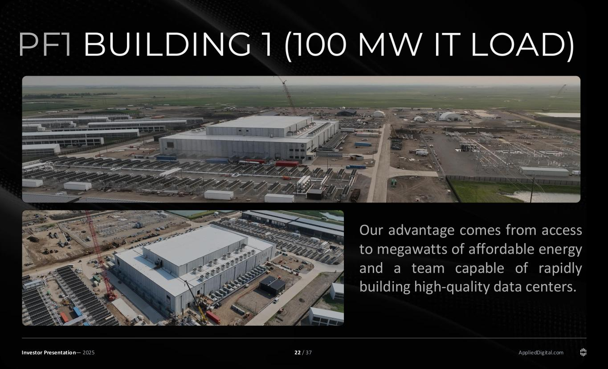

Polaris Forge 1 Building 1 in Applied Digital’s October 2025 investor presentation. The capture days of the two photographs are not stated. [Applied Digital, October 2025 investor presentation, page 22](https://ir.applieddigital.com/sec-filings/all-sec-filings/content/0001144879-25-000076/apld_invxfinalpresentati.htm)

### Abilene: one campus, several scopes

Abilene, Texas, is the real campus this course keeps returning to: the original Oracle and OpenAI campus built by Crusoe, followed through its service, construction and cooling. Crusoe describes that original campus as eight buildings and a 1,200 MW plan. Two nearby numbers belong to other scopes. Crusoe’s June 9, 2026 release lists a new 900 MW campus for Microsoft as a separate project, and the 10 GW commitment in OpenAI’s Stargate announcement covers Stargate’s wider US buildout.

Snapshot, September 2026. Oracle reports 75% of total Abilene capacity delivered, with the rest to follow in later quarters, and its aerial photograph below is dated July 15, 2026. Seventy-five percent of the 1,200 MW plan would be 900 MW if Oracle and Crusoe count capacity on the same basis. Oracle leaves that basis undefined and reports no operating megawatts, so 900 MW is a conditional estimate of delivered capacity, separate from any metered load. On March 27, 2026, Crusoe described two of the original buildings as energized and six more planned, an earlier point on the same timeline.

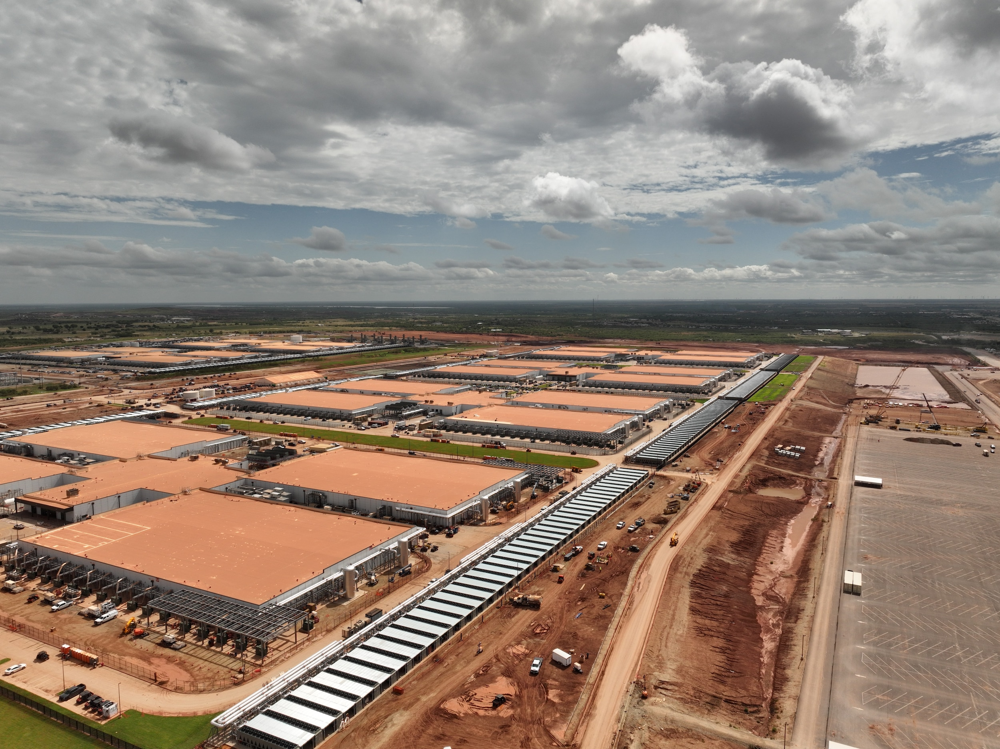

Abilene, Texas, in Oracle’s aerial dated July 15, 2026. [Oracle Data Centers: Abilene, Texas](https://www.oracle.com/data-centers/)

### Fuel arrives by pipe, in stages

A gas turbine is only as useful as the pipe that feeds it. Being near a pipeline gives a site somewhere to connect. Burning gas at scale takes four more things: a lateral (a branch line from the main to the site), the rights of way to build it, metering and pressure regulation at the fence, and enough upstream capacity to hold pressure with every turbine at full output. Each is a construction project with its own schedule, running alongside the turbine order.

Abilene shows the sequence. Energy Transfer began delivering gas to the Oracle data center near Abilene in January 2026, reported a second 14-mile lateral in the area completed by August, and signed a separate agreement with Crusoe for gas facilities to feed about 900 MW of generation. The fuel arrived in stages, as the power did.

Snapshot, August 2026. Sources: Energy Transfer’s fourth-quarter 2025 results, released in February 2026, and its August 2026 investor presentation. The roughly 900 million cubic feet per day (MMcf/day) of gas named in the February release covers three Oracle projects combined.

### A grid connection is studied, then built

Picture two campuses whose supply routes lead back to the same substation, the installation of transformers, switchgear and protection where transmission voltage is stepped down and circuits divide. Before either campus gets service, a connection study checks whether that substation and the lines above it can carry both campuses’ demand at once, together with other customers and the outages the grid must withstand. Sitting next to a transmission line gives a campus a place to connect. Study, upgrades and acceptance turn that place into usable capacity.

Between a large-load request and available service, the utility or grid operator may run studies, sign agreements, build network upgrades, wait for equipment, construct and authorize operation; the names and order of the steps vary by jurisdiction and project. The Electric Reliability Council of Texas (ERCOT), which runs the grid for most of Texas, announced a batch study in June 2026 that assesses several large projects together against the network they would share. A customer’s requested date is an input to that planning; the studies and upgrades determine when the grid can carry the load.

Abilene’s own grid connection arrived in two steps. Mortenson’s project page for the campus distinguishes the initial 200 MW connection at 138 kilovolts (kV) from the later 1 GW expansion at 345 kV, whose five transformers were all energized by March 10, 2026.

Inside the fence, the staging continues. Electrical equipment can be energized while cooling, control integration, network connections or IT acceptance are still under way. Commissioning checks how a stated scope behaves; operation then shows the service it delivers. A phased campus therefore carries several statuses at once, so track each released block apart from the construction that remains. A project-wide completion percentage, like Oracle’s 75% at Abilene, describes the whole campus, while acceptance is recorded block by block.

### Behind the meter names an electrical boundary

Behind the meter (BTM) means electrically on the customer’s side of a particular utility meter. Draw that meter between the grid and the customer bus, then connect the local generator, the storage and the site’s loads to the customer bus: everything on that side is behind the meter. A real campus can have several meters, so name the one a claim refers to. The electrical drawing settles it; the property line and the equipment’s owner answer other questions.

Four words describe four different things. On-site is a physical location. Behind the meter is an electrical relationship to a named meter. Islanded is a way of operating, disconnected from the wider grid, and off-grid describes a site that runs with no utility connection at all. An off-site power purchase agreement (PPA) is a contract to buy a generator’s output. The generator stays on the far side of the meter, and its energy reaches the campus through the grid, so losing the grid path cuts it off too.

The meter records the net exchange across the boundary. Local generation can shrink imports while the customer load stays the same and the grid stays connected, so a meter reading zero at some moment still describes a grid-connected site. Export works the same way in reverse: a site that exports stays physically tied to the grid, and permission to import is a separate agreement. These distinctions organize the four arrangements that follow.

### Four normal operating arrangements

Grid-supplied. The utility serves normal demand. The site may still have backup generators and an uninterruptible power supply (UPS); those belong to the continuity design. An off-site energy contract changes what the site buys, while the power still arrives over the same feeder.

Grid-parallel. Local generation and grid imports share the load while the site stays connected. The normal import can be much smaller than the import the site needs when a generator trips, so the design needs a plan for that larger number: reserved import capacity, reserve generation, storage or a planned cut in load. Export permission and the fallback states the site supports are settled site by site.

Export-only. Local generation serves the load, and the grid connection carries the surplus out. The agreement allows export only, so every watt the load uses comes from local generation. The site is still electrically connected to the grid. Backup import rights and the ability to survive as an island after a grid disturbance each need their own design and agreement.

Off-grid. The site runs on local resources alone. They carry the full continuing load and set the voltage and frequency themselves, so sustained generation, fast balancing, fuel, reserves and storage limits become one operating problem. Off-grid names the connection, and the resources can be of any kind: gas turbines, for example, or solar with storage sized explicitly for the night.

The four arrangements describe normal supply relationships. A complete design adds backup, switching, grounding, protection, auxiliary loads and storage. Meter location, import and export rights, and island capability are three related questions, and a site can answer each one differently.

### Bridge power can become backup

Crusoe’s 2025 Impact Report, published in May 2026, describes a 350 MW natural-gas plant at Abilene with two jobs: temporary bridge power, and a long-term backup role in place of diesel generators. One plant can therefore serve an early phase before permanent grid delivery arrives and stay on afterward as backup. At 350 MW it is under a third of the original 1.2 GW campus plan, so the backup design still has to name the loads it protects.

Moving from bridge to backup is an engineered change of duty. As bridge power, the plant carries the load in normal operation. As backup, it has to start and pick up the protected load when the grid fails, so its start and transfer behavior, protection settings, maintenance, fuel delivery and operating permissions all have to be designed for the new duty. The report describes the strategy, and each project’s own design sets the switch-over date and the redundancy.

### An island needs energy and a working electrical system

Losing the grid tests two things at once. The first is an energy balance: local generation and storage have to cover the whole protected load for as long as the outage lasts, within their power limits, their stored energy and their fuel. The second is a working electrical system: the site has to transfer to island operation, hold its voltage and frequency stable, and keep a surviving route from each source to the load. The worked example below runs the first test for a grid-parallel site. Its arithmetic gives how long each resource lasts, and the second test needs evidence of its own.

Three habits follow. Size the problem by the protected load on the bus, because the import the meter shows in normal operation is only the gap between that load and local generation. Check a store against both of its limits, its output power and its usable energy. And give each backup source its own fuel: a second generator on the same failed gas connection adds little protection against that failure.

### How simple-cycle and combined-cycle gas turbines make electricity

In a simple-cycle gas turbine, a compressor squeezes incoming air, fuel burns in the compressed air, and the hot gas expands through turbine blades. The turbine’s shaft work drives both the compressor and an electric generator. A starter turns the machine to get it going, and from then on burning fuel supplies all of the shaft work. Engineers model this process as the Brayton cycle. Because the machine draws air from the atmosphere and returns its exhaust there, it is also called open cycle, a name for the air path; how often the machine runs is a separate choice.

A combined-cycle plant sends that hot exhaust through a heat recovery steam generator (HRSG). Heat crosses into a separate water and steam circuit, whose own water becomes the steam while the exhaust stays apart. The steam expands through a steam turbine for more shaft work, a condenser rejects the remaining heat and turns the steam back into water, and a pump returns the water to the HRSG. That steam loop is the Rankine cycle. The description leaves out supplementary firing, in which the HRSG burns extra fuel of its own.

In GE Vernova’s cutaway below, follow the air through the compressor, combustors and turbine to the shaft that turns the generator. In Siemens Energy’s combined-cycle diagram, trace the hot exhaust and the water and steam loop separately through the heat recovery unit, steam turbine and condenser. Its “up to 64%” label is the manufacturer’s maximum efficiency.

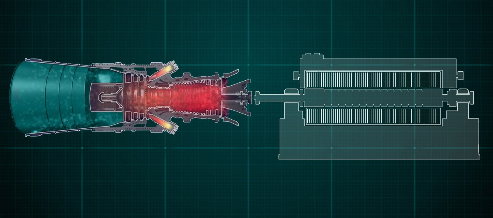

Gas turbine and generator. The image carries no labels: from the left, compressor, combustors and turbine share one shaft, which turns the generator on the right. [GE Vernova, What Is a Gas Turbine?](https://www.gevernova.com/gas-power/resources/education/what-is-a-gas-turbine)

Siemens Energy’s combined-cycle principle. The up-to-64% label is the manufacturer’s maximum. [Siemens Energy, Combined Cycle Power Plants](https://www.siemens-energy.com/global/en/home/products-services/product/combined-cycle-power-plants.html)

### Compare fuel at equal output

Compare the two at equal output with round numbers: each plant delivers 100 MW of net electricity, the simple-cycle plant at 40% net efficiency and the combined-cycle plant at 60%. The simple-cycle plant burns 100 ÷ 0.40 = 250 MW of fuel energy and leaves 150 MW unrecovered. The combined-cycle plant burns 100 ÷ 0.60 = 166.7 MW and leaves 66.7 MW. Heat rate states the same comparison per unit of output: 2.5 megawatt-hours (MWh) of fuel for each MWh of electricity against 1.67 MWh.

All of these numbers use the fuel’s lower heating value (LHV), the heat released by burning it when the water vapor formed in combustion leaves uncondensed. The higher heating value (HHV) also counts the heat recovered by condensing that vapor, so it is the larger of the two. The choice changes the denominator of every efficiency and heat rate, so quote fuel prices and efficiencies on the same basis, and keep net and gross output apart for the same reason.

The comparison holds output fixed across two separate plants. Add a steam cycle to an existing gas turbine instead and the output grows, because the recovered exhaust heat drives the extra steam turbine. The price is more plant: the HRSG, steam turbine, condenser, water and cooling systems all add construction, capital, maintenance and operating dependencies. GE Vernova’s 2025 gas power catalog sums up the trade: simple cycle has the simpler capital and construction profile, and combined cycle the higher efficiency. The actual schedule of either still depends on equipment delivery, fuel, permits and site works.

### A real combined-cycle plant: Dania Beach

Florida Power & Light’s (FPL’s) Dania Beach Clean Energy Center, near Fort Lauderdale, puts the mechanism in a real utility plant. Two GE 7HA.03 gas turbines pass their exhaust heat to a steam cycle, and GE Vernova reports up to 1,260 MW for the whole plant, steam cycle included. The model name reads as a code: 7 is the 60 hertz (Hz) family, H stands for high efficiency, A for air-cooled, and .03 is the model version.

GE Vernova’s May 2025 fact sheet gives catalog values for a 7HA.03 combined-cycle block with one gas turbine and one steam turbine, a 1×1 configuration: 640 MW net at 63.9% LHV efficiency, a rapid-response hot start in under 30 minutes, a ramp rate of 75 MW per minute and a minimum load of 26%. The values apply to a net plant burning natural gas at the International Organization for Standardization (ISO) reference conditions. They describe the catalog design, while Dania Beach’s day-to-day performance depends on its own configuration and conditions. The hot-start figure applies to a warm plant; a cold start needs a figure of its own.

### Baseload, intermediate duty and peaking are roles

Grid demand has a floor and a shape. Baseload is the floor, present through the whole interval. Intermediate, or mid-merit, duty covers the long periods above that floor, and peaking duty covers the short intervals of highest demand. The U.S. Energy Information Administration (EIA) describes combined-cycle plants serving base and intermediate load and simple-cycle turbines commonly covering the peaks. Those are typical roles with loose edges: combined cycle can follow load, and engines, storage and other resources also provide peaking service.

Siemens Energy’s conceptual dispatch charts, below, set a conventional supply stack beside a system with much more wind and solar. In the second, the demand left after wind and solar, called the residual load, swings sharply even when total demand changes slowly, and flexible plants have to follow it. A steady artificial intelligence (AI) campus adds demand in the hard hours as well as the easy ones, so what matters for a new campus is the spare generation and transmission in the hardest hours, which its annual energy total leaves hidden.

“Fast” has three meanings, each on its own clock. Building a plant takes as long as its equipment delivery, permits, fuel connection and construction. Starting an existing plant depends on its thermal state, so a start time names the state, as the fact sheet’s hot start does. Changing the output of a running plant depends on its controls and limits, such as the ramp rate and minimum load. A catalog ramp rate belongs to the third clock only. Actual dispatch also depends on reserves, outages, network constraints and fuel availability.

Conceptual weekly dispatch from Siemens Energy, not measured grid data. [Siemens Energy, Peaker Plants](https://www.siemens-energy.com/global/en/home/products-services/product/peaker-plants.html)

### Hours decide the cost, and speed decides the date

Efficiency costs money up front, and fuel savings pay it back over the hours a plant runs. Keep the same two 100 MW plants and give them round annual costs. Capital and fixed operating costs, spread over the years, come to $8 million a year for simple cycle and $16 million for combined cycle. Fuel costs $20 per MWh of fuel energy on the LHV basis, so with the heat rates above, each MWh of electricity needs $50 of fuel from the simple-cycle plant and $33.33 from the combined-cycle plant.

Annual cost is the fixed cost plus 100 MW × equivalent full-load hours × fuel cost per MWh. Equivalent full-load hours are the year’s electricity output divided by the 100 MW rating, so two hours at half output count as one. At 500 hours a year, simple cycle costs $10.50 million against combined cycle’s $17.67 million. At 7,000 hours, combined cycle costs $39.33 million against $43.00 million. The two lines cross at 4,800 hours, where combined cycle’s extra $8 million of fixed cost is exactly repaid by fuel savings of $16.67 per MWh.

A data center runs close to all 8,760 hours of the year, far past the crossover. There the model gives simple cycle $8 million + $43.8 million = $51.8 million against combined cycle’s $16 million + $29.2 million = $45.2 million. On annual cost, combined cycle wins at data-center duty. Simple cycle’s case at a campus is speed to power: the simpler plant can start serving the load sooner.

Price that speed with the same model. At 8,760 hours, simple cycle burns $14.6 million more fuel than combined cycle, and its fixed costs are $8 million lower, so the net penalty for choosing it is $14.6 million − $8 million = $6.6 million a year. If simple cycle opens one month earlier, that month pays for the choice when its contribution, what it earns after the costs of serving it, exceeds $6.6 million plus any premium for the faster build that the $8 million leaves out. Those serving costs include the fuel either plant would burn, so the extra fuel is counted once, inside the $6.6 million. The fuel gap alone would set the bar at $14.6 million; the fixed-cost saving brings it down to $6.6 million.

The model prices one year and leaves out start costs, variable maintenance, emissions prices, part-load performance, downtime and project financing. The fuel gap recurs every year the plant runs, so a longer comparison sets the whole period’s extra fuel, capital, financing, maintenance and availability against the value of the early months. Construction speed, delivered fuel, water, cooling and the service requirement can rule out either plant before cost comes into it. Efficiency is also a separate question from whether the plant can island, provide redundancy or keep the campus in service, which are the continuity questions above.

### Southaven: a simple-cycle plant and the price of speed

xAI’s Colossus 2 data center is on Tulane Road in Memphis, Tennessee. MZX Tech LLC’s generating plant is at 2875 Stanton Road South in Southaven, Mississippi, across the state line. SemiAnalysis’s September 2025 account attributes the cross-border siting to pushback in Tennessee and to Mississippi’s permitting route for temporary turbines, and reports medium-voltage (MV) connections between the sites. Neighboring parcels can answer to different permitting authorities, while the power still crosses between them on a physical connection.

MZX Tech’s January 2026 permit application, prepared by Trinity Consultants as its January 14, 2026 cover email records, proposed 41 simple-cycle turbines with about 1.2 GW of generating nameplate for the site’s own use. The site map and process drawing below come from that application and show the proposal as it stood then. The process drawing connects conditioned gas to the turbines, and the turbines’ electricity to the data center and to battery packs. It was drawn for an air permit, so it carries emissions branches and leaves switching and voltages to the electrical design.

SemiAnalysis’s later procurement account describes imported power modules and medium-voltage delivery used to avoid the long lead times of large transformers. The next lesson, “Move power with fewer amperes”, prices that trade by carrying 200 MW at 34.5 kV and at 161 kV: fewer transformer stages in exchange for more current.

The permission was temporary by design. Mississippi’s July 2025 determination attached mobility and less-than-twelve-month conditions to the turbines’ temporary treatment. On July 30, 2026, SpaceXAI reported an agreement to remove 69 temporary turbines by July 2027 while building permitted permanent generation. A different plant shares the town’s name: the Tennessee Valley Authority’s (TVA’s) Southaven combined-cycle station.

The compute contracts show what earlier capacity can earn. SpaceX’s June 2026 prospectus discloses fees from Anthropic of $1.25 billion a month after a May–June ramp, for compute across Colossus and Colossus II. A separate filing with the Securities and Exchange Commission (SEC) puts Google’s fees at $920 million a month, with reduced ramp fees until the full fees begin in October 2026. Together that is $2.17 billion a month before costs, earned only while the service is delivered under each agreement’s delivery and termination terms. The fees are revenue: SpaceX’s AI segment, which also includes X, Grok, research and development (R&D) and infrastructure, reported $2.561 billion of revenue and a $1.257 billion operating loss in the second quarter of 2026, and the filings give neither contract’s margin nor a megawatt figure that ties the fees to Southaven. SemiAnalysis describes the prices as a premium for large-scale compute available soon and forecasts recovery of the capital expenditure (capex) in under a year; its 3–5 months is the delivery lead time. The $6.6 million bar above belongs to the round-number 100 MW model, and testing any real plant against such a bar takes a contribution margin, which these revenue disclosures leave undisclosed.

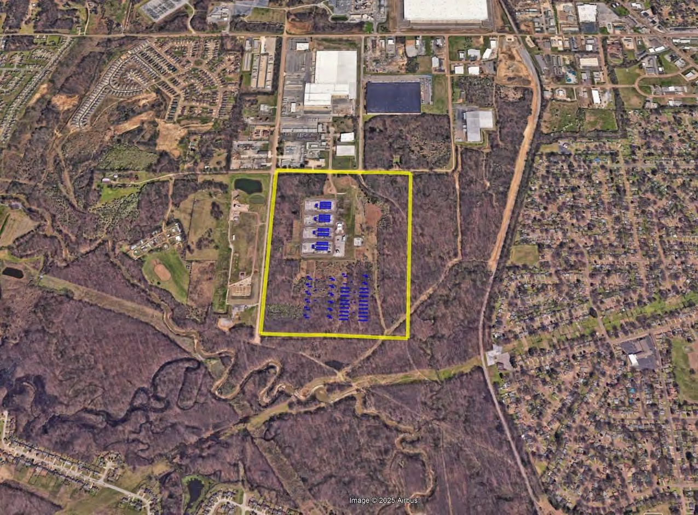

MZX application, January 2026 revision, site map (PDF page 80). The image carries its Airbus imagery credit. Historical proposed facility area. [MZX Tech / Trinity Consultants — site map](https://upload.wikimedia.org/wikipedia/commons/e/e2/MZX_Tech_LLC_Draft_Air_PSD_Construction_Permit.pdf#page=80)

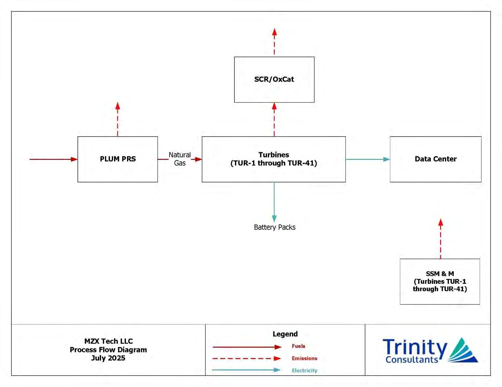

Figure 2-1, July 2025, in the January 2026 application (PDF page 13). Air-permit process diagram, including its emissions branches. [MZX Tech / Trinity Consultants — process figure](https://upload.wikimedia.org/wikipedia/commons/e/e2/MZX_Tech_LLC_Draft_Air_PSD_Construction_Permit.pdf#page=13)

### Carry the supply plan into the site decision

Land, fiber, climate, water, electrical service, equipment access and local rules all push on one another. A site with earlier grid availability may need a cooling design that changes its auxiliary power and its delivery date. A location with cheap energy may add network latency to the workload or leave a hard path to expansion. Sort the requirements into conditions a site must pass and tradeoffs among the sites that pass. A weighted score works for the tradeoffs. A hard requirement is a gate, and a site that fails it is out, however well it scores elsewhere.

Treat a missing fact as open, with a name attached. If an application needs a maximum network round-trip time, a location outside it fails however cheap it is. If a cooling design depends on a water allocation that is still pending, record the allocation as unresolved, along with the party or document that could settle it. On-site supply can make an earlier phase possible, and it brings fuel, emissions, cooling, control and maintenance dependencies of its own.

Finish by writing the service envelope: how much load, starting when, under which normal and degraded conditions, and with which uncertainties still open. That turns a comparison of locations into an infrastructure decision, and it points further work where it pays most: at the dependency that sets the delivery date, the capacity that limits accepted load, or the operating condition that would break the service promise.

### Worked example: Ride through a grid outage on local generation and storage

- A grid-parallel customer bus supplies 8 MW, including cooling, controls and downstream losses.
- A stable local generator supplies 6 MW net and holds four hours of fuel at that output.
- Storage holds 4 MWh of usable output energy with a 3 MW output limit at this bus, and is idle while the grid is connected.
- After the grid is lost, authorized and stable island operation is taken as already in place.

1. Normal import — 8 MW − 6 MW = 2 MW — The meter sees 2 MW, while the site remains an 8 MW load.
2. Deficit after grid loss — 8 − 6 = 2 MW, within the 3 MW output limit — Storage has enough output power to replace the lost import.
3. Storage duration — 4 MWh ÷ 2 MW = 2 h — Usable energy divided by the deficit gives the time storage can carry it.
4. Binding limit — min(2 h storage, 4 h fuel) = 2 h — Storage runs out before the generator’s fuel does.
5. Protect 6 MW instead — 6 − 6 = 0 MW deficit, so fuel binds at 4 h — Cutting protected demand to the generator’s output removes the storage deficit and leaves the fuel limit.

**Result:** The site imports 2 MW in normal operation. Islanded, it carries the full 8 MW for two hours, when storage runs out; protecting 6 MW extends that to the generator’s four hours of fuel.

**Model boundary:** All values are hypothetical and are not Abilene equipment specifications. The arithmetic gives durations only; a successful transfer, stable voltage and frequency, a surviving electrical route and an independent fuel supply each need their own evidence.

### When the situation changes

Trigger: Treat the earliest energized subsystem as a completed site.

Mechanism: A later building, cooling, fiber, or acceptance dependency prevents the intended service.

Response: Track complete blocks and keep readiness, commissioning, and observed operation as separate evidence states.

### Apply the idea

A proposed first phase has an energized feeder and installed racks, but its coolant return and network entrance are shared with unfinished later work. What evidence would justify releasing it? Separately, a local gas plant normally cuts grid imports: what must be shown before calling it backup?

Reveal the worked answer

Show accepted cooling and network service for the released block, safe separation from the ongoing work, and the intended operating limits. For backup, show the protected load, starting and transfer behavior, independent surviving paths, fuel, controls and usable capacity.

An energized feeder is one completed dependency. A released phase needs all the required services and supported operating states. A generator’s location and normal output describe normal operation; taking over the load during the failure being considered is a separate duty with its own evidence.

**The idea to keep:** Plan supply one released phase at a time. Each phase needs energy that can be delivered on its date, a connection that can carry it, and a design for the states it must survive, such as losing the grid.

### Sources

- [ERCOT — Batch Zero large-load connection announcement, June 18, 2026](https://www.ercot.com/news/release/06182026-puct-approves-ercots) — www.ercot.com · Published 2026-06-18 · Reviewed 2026-09-06. Large-load connection studies consider shared network capacity and required upgrades.
- [Commissioning & Performance Validation | AI Data Center Energy Performance Framework](https://www.ashrae.org/technical-resources/ai-data-center-framework/commissioning-performance-validation) — ASHRAE · Reviewed 2026-09-06. Commissioning and handover can occur in smaller infrastructure blocks with documented acceptance.
- [DOE — Islanding a Microgrid](https://www.energy.gov/cmei/femp/articles/islanding-microgrid) — www.energy.gov · Published 2021-10-15 · Reviewed 2026-09-10. Grid-connected and islanded operation require a coordinated system of sources and loads.
- [NARUC — Regulators’ Financial Toolbox: Behind-the-Meter Energy Storage](https://pubs.naruc.org/pub/6233DBE2-B58B-52FF-925E-250DD26DECF9) — pubs.naruc.org · Reviewed 2026-09-10. Behind-the-meter describes the customer side of the utility meter; it can include resources that exchange power with the grid.
- [DOE — Solar Integration: Distributed Energy Resources and Microgrids Basics](https://www.energy.gov/cmei/systems/solar-integration-distributed-energy-resources-and-microgrids-basics) — www.energy.gov · Reviewed 2026-09-10. Local generation and designed island operation are distinct; many solar systems disconnect during loss of the wider grid.
- [US EPA — Physical PPA](https://www.epa.gov/green-power-markets/physical-ppa) — www.epa.gov · Reviewed 2026-09-10. A physical PPA is a purchase arrangement that may involve on-site or off-site generation; an off-site project can deliver through the grid.
- [Crusoe — Abilene campus development update](https://www.crusoe.ai/resources/newsroom/crusoe-announces-new-900-mw-ai-factory-campus-in-abilene-texas-to-support-microsoft-ai-infrastructure) — Crusoe · Published 2026-03-27 · Reviewed 2026-09-12. Historical March 27 milestone separating the original Abilene campus from the adjacent Microsoft development.
- [GE Vernova — How a combined-cycle plant produces electricity](https://www.gevernova.com/gas-power/resources/education/combined-cycle-power-plants) — GE Vernova · Reviewed 2026-09-12. Gas turbine shaft work, exhaust heat recovery in an HRSG, and steam-turbine electricity production.
- [EIA — Natural gas generation by technology and region](https://www.eia.gov/todayinenergy/detail.php?id=61444) — U.S. Energy Information Administration · Published 2024-02-22 · Reviewed 2026-09-12. Combined-cycle generation serves base and intermediate duty; simple-cycle gas turbines commonly cover shorter peak periods.
- [GE Vernova — 7HA gas-turbine and combined-cycle fact sheet](https://www.gevernova.com/content/dam/gepower-new/global/en_US/downloads/gas-new-site/products/gas-turbines/7ha-fact-sheet-product-specifications.pdf) — GE Vernova · Published 2025-05 · Reviewed 2026-09-12. 7HA.03 1×1 combined-cycle catalog: 640 MW net, 63.9% LHV efficiency, <30 min rapid-response hot start, 75 MW/min ramp and 26% minimum load.
- [GE Vernova — First 7HA.03 commercial operation at FPL Dania Beach](https://www.gevernova.com/gas-power/resources/case-studies/first-7ha-florida-power-light) — GE Vernova · Reviewed 2026-09-12. Two 7HA.03 gas turbines and up to 1,260 MW at FPL’s Dania Beach plant, with a manufacturer photograph of the plant.
- [GE Vernova — 2025 Gas Power Catalog, plant configuration comparison](https://www.gevernova.com/content/dam/gepower-new/global/en_US/downloads/noindexpdf/GEA35241-GE-Vernova-Gas-Power-Catalog.pdf) — GE Vernova · Published 2025 · Reviewed 2026-09-12. Simple-cycle construction and capital simplicity versus combined-cycle efficiency and additional steam-cycle equipment.
- [Applied Digital Achieves Ready for Service for Phase 1 at Polaris Forge 1](https://ir.applieddigital.com/news-events/press-releases/detail/133/applied-digital-achieves-ready-for-service-for-phase-1-at) — Applied Digital · Published 2025-10-27 · Reviewed 2026-09-16. First 50 MW of the first 100 MW building at Polaris Forge 1 in Ellendale, North Dakota reached ready-for-service on October 27, 2025.
- [Applied Digital Completes Phase II Ready for Service at Polaris Forge 1](https://ir.applieddigital.com/news-events/press-releases/detail/137/applied-digital-completes-phase-ii-ready-for-service-at) — Applied Digital · Published 2025-11-24 · Reviewed 2026-09-16. Second 50 MW of the first building reached ready-for-service November 24, 2025, bringing that building to 100 MW.
- [Oracle Data Centers: Abilene, Texas](https://www.oracle.com/data-centers/) — Oracle · Reviewed 2026-09-17. Reports 75% of total Abilene capacity delivered as of September 2026, with aerial photographs dated July 15, 2026.
- [Energy Transfer August 2026 Investor Presentation](https://ir.energytransfer.com/static-files/1cb70dca-abed-4005-95aa-793e3345626c) — Energy Transfer · Published 2026-08 · Reviewed 2026-09-12. Records completion of a second 14-mile Abilene lateral and a separate gas-facilities agreement with Crusoe to support approximately 900 MW of generation.
- [Energy Transfer Reports Fourth Quarter 2025 Results](https://ir.energytransfer.com/node/52241/pdf) — Energy Transfer · Published 2026-02-17 · Reviewed 2026-09-12. Reports that natural-gas delivery to the Oracle data center near Abilene began in January 2026, separately from later expansion agreements.
- [Crusoe 2025 Impact Report](https://media.ffycdn.net/us/crusoe/PL5TuZz5apXB9pVsd3H1.pdf) — Crusoe · Published 2026-05-28 · Reviewed 2026-09-26. Pages 16 and 19 describe a 350 MW natural-gas plant and temporary bridge power with a long-term backup role at Abilene. Page 33 documents the Sparks solar-and-battery case.
- [Combined Cycle Power Plants](https://www.siemens-energy.com/global/en/home/products-services/product/combined-cycle-power-plants.html) — Siemens Energy · Reviewed 2026-09-12. Explains how a combined-cycle plant pairs a gas turbine with a steam cycle, with a full-system diagram and single-shaft and multi-shaft layouts.
- [Peaker Plants](https://www.siemens-energy.com/global/en/home/products-services/product/peaker-plants.html) — Siemens Energy · Reviewed 2026-09-12. Compares conventional generation roles with renewable-driven load following and explains why fast, flexible gas generation is useful.
- [What Is a Gas Turbine?](https://www.gevernova.com/gas-power/resources/education/what-is-a-gas-turbine) — GE Vernova · Reviewed 2026-09-12. Explains the compressor, combustion, turbine and generator of a gas turbine, with a manufacturer cutaway of the machine.
- [Crusoe’s Contracted AI Infrastructure Capacity Approaches 5 Gigawatts Across Data Centers and Cloud](https://www.crusoe.ai/resources/newsroom/crusoes-contracted-ai-infrastructure-capacity-approaches-5-gigawatts-across-data-centers-and-cloud) — Crusoe · Published 2026-06-09 · Reviewed 2026-09-16. Separates the original 1.2 GW Oracle Abilene campus from a distinct 900 MW Microsoft campus.
- [Abilene Data Center Development](https://www.mortenson.com/projects/abilene-data-center-development) — Mortenson · Reviewed 2026-09-14. Reports five expansion transformers energized by March 10, 2026, and distinguishes the initial substation from the later expansion.
- [MZX Tech LLC — Southaven PSD permit application, January 2026 revision](https://upload.wikimedia.org/wikipedia/commons/e/e2/MZX_Tech_LLC_Draft_Air_PSD_Construction_Permit.pdf) — MZX Tech LLC / Trinity Consultants; public record released by MDEQ, Wikimedia mirror · Published 2026-01-14 · Reviewed 2026-09-12. Original Southaven site and area maps and generating-plant process figure; historical proposed 41 simple-cycle turbines and approximately 1.2 GW.
- [SpaceX — EU prospectus, compute services agreements with Anthropic](https://content.spacex.com/cms-assets/FINAL_Documents%20and%20Updates/SpaceX%20-%20EU%20Prospectus%20%28Approved%20by%20Bafin%29%20-%20June%205%2C%202026.pdf) — Space Exploration Technologies Corp. · Published 2026-06-05 · Reviewed 2026-09-12. Section 4.3.4.5: approximately 325,000 GPUs across Colossus and Colossus II; $1.25B monthly fees through May 2029, with reduced ramp fees and termination provisions.
- [SpaceX — Google Cloud Service Agreement, free writing prospectus](https://www.sec.gov/Archives/edgar/data/1181412/000162828026041150/spacexagreementfwp.htm) — Space Exploration Technologies Corp. / SEC · Published 2026-06-05 · Reviewed 2026-09-12. Approximately 110,000 GPUs and $920M monthly service fees from October 2026, with reduced ramp fees, delivery conditions and 90-day termination rights.
- [SpaceX — second-quarter 2026 Form 10-Q, AI segment results](https://www.sec.gov/Archives/edgar/data/1181412/000162828026052535/spcx-20260630.htm) — Space Exploration Technologies Corp. / SEC · Published 2026-08-04 · Reviewed 2026-09-12. Separates service-fee run rates from reported results: Q2 AI segment $2.561B revenue and $1.257B operating loss; cloud-service revenue timing and customer cancellation exposure.
- [SemiAnalysis — Meta Compute: Everyone Wants To Be A Neocloud](https://newsletter.semianalysis.com/p/meta-compute-everyone-wants-to-be) — SemiAnalysis · Published 2026-07-02 · Reviewed 2026-09-12. Analyst account of premium pricing for near-term large-scale SpaceX compute and why short cancellation rights differentiate these deals.
- [GE Vernova — 7HA gas turbines, model family and specifications](https://www.gevernova.com/gas-power/products/gas-turbines/7ha) — GE Vernova · Reviewed 2026-09-12. Identifies 7HA.03 as a 60 Hz air-cooled H-class gas-turbine model; distinguishes simple-cycle turbine output from complete combined-cycle plant output.
- [U.S. Department of Energy — heating-value glossary](https://www.energy.gov/cmei/fuels/glossary) — U.S. Department of Energy · Reviewed 2026-09-12. Defines lower and higher heating value and the role of condensing combustion water vapor.
- [Applied Digital — October 2025 investor presentation](https://ir.applieddigital.com/sec-filings/all-sec-filings/content/0001144879-25-000076/apld_invxfinalpresentati.htm) — Applied Digital · Published 2025-10 · Reviewed 2026-09-13. Page 22 shows two aerial photographs of Polaris Forge 1 Building 1.
- [GE — How its latest gas turbine could save Florida customers money](https://www.ge.com/news/reports/in-the-money-how-ges-latest-gas-turbine-could-help-save-florida-customers-300-million) — GE · Published 2019-10-03 · Reviewed 2026-09-13. GE naming explanation: H means high efficiency, A means air-cooled. Dania Beach uses a combined-cycle design.
- [GE Vernova — Supporting Vietnam’s energy needs](https://www.gevernova.com/gas-power/resources/articles/2021/supporting-vietnams-energy-needs) — GE Vernova · Published 2021-03-15 · Reviewed 2026-09-13. Distinguishes 7HA for 60 Hz grids from 9HA for 50 Hz grids.
- [SpaceXAI — Greater Memphis site update, July 30, 2026](https://x.ai/memphis/updates) — SpaceXAI · Published 2026-07-30 · Reviewed 2026-09-13. Reports agreement to remove 69 temporary Southaven turbines by July 2027 while building permitted permanent generation.
- [MDEQ — Determination letter on portable gas combustion turbines, July 29, 2025](https://cdn.mississippitoday.org/wp-content/uploads/2025/11/20104011/2025.07.29-MDEQ-Determination-Letter-on-Portable-Gas-Combustion-Turbines-signed.pdf) — Mississippi Department of Environmental Quality · Published 2025-07-29 · Reviewed 2026-09-13. Historical determination includes mobility and less-than-twelve-month conditions for the temporary-turbine treatment.
- [MLGW — 2025 xAI Update](https://www.mlgw.com/images/content/files/pdf/new/xAI%202025%20Update.pdf) — Memphis Light, Gas and Water · Published 2025 · Reviewed 2026-09-13. Locates the Tulane Road Colossus 2 facility near the Tennessee–Mississippi state line.
- [xAI's Colossus 2 - First Gigawatt Datacenter In The World, Unique RL Methodology, Capital Raise](https://newsletter.semianalysis.com/p/xais-colossus-2-first-gigawatt-datacenter) — SemiAnalysis · Published 2025-09-16 · Reviewed 2026-09-13. Cross-border Colossus 2 / Southaven siting and reported MV connection; SemiAnalysis attributes the siting to different temporary-turbine permitting routes.
- [OpenAI: Five new Stargate sites](https://openai.com/index/five-new-stargate-sites/) — openai.com · Reviewed 2026-09-13. The 10 GW commitment concerns Stargate’s wider US buildout, distinct from the Abilene campus plan and current operating load.
- [US Census TIGERweb — Tennessee state boundary and Tulane Road geocode](https://tigerweb.geo.census.gov/arcgis/rest/services/TIGERweb/State_County/MapServer/0) — US Census Bureau · Reviewed 2026-09-14. Places the Tennessee–Mississippi state line between the Tulane Road site in Memphis and the Southaven plant site.

## Move power with fewer amperes

**4. Siting, grid connection and supply**

Start with a closed DC circuit and AC waveforms, explain the three-phase power equation, then compare transport current and conductor heating at a fixed campus load.

**Driving question:** Why does a higher transport voltage reduce one important class of losses?

### Build from a closed DC loop to alternating current

Voltage is an electrical potential difference: energy transferred per unit charge. Current is the rate at which charge passes a point. In a simple direct-current (DC) boundary, their product gives electrical power. A higher voltage can therefore transfer the same power with less current. That observation is the starting point for understanding transport voltage, but it does not by itself choose an installation voltage. Equipment interfaces, insulation, protection, clearances, conversion, and cost still matter.

In a steady DC circuit, voltage keeps one polarity and conventional current travels around a complete source–load–return loop. Both the outgoing and return conductors carry the same current; adding their magnitudes counts one circuit current twice. For an ideal resistive load receiving 100 kW at 800 V DC, each conductor carries 125 A. The introductory circuit has no conductor or converter losses.

Now use a single-phase sinusoidal alternating-current (AC) source and another resistive load, still chosen to receive 100 kW on average. Voltage and current reverse together every half-cycle. Instantaneous power is their product, so the resistor keeps receiving power when both signs reverse. The root-mean-square (RMS) value is the effective value for resistive heating, not the peak: a 480 V RMS sine wave peaks at about 679 V. This single-phase example needs 208.33 A RMS; its received power ranges from zero to 200 kW and averages 100 kW. The equal-power anchor describes the load requirement, not an unchanged resistor.

### Combine three phases without changing the power requirement

Balanced three-phase AC uses three equal phase voltages separated by 120 degrees, or one-third of a cycle. Picture three equal resistive load branches sharing a star point, a wye connection. Each branch averages one-third of the total power. Their staggered instantaneous powers add to a constant 100 kW in this ideal balanced sinusoidal model. Three phases do not mean three times the specified total load.

The signed line currents sum to zero at every instant. Current entering on some phase conductors leaves on the others, so a neutral would carry zero load current in this balanced sinusoidal case. Real unequal loads or nonlinear current waveforms can require a neutral. Protective earth is not the normal load-current return, and a three-conductor model is not a complete installation drawing.

At 480 V line-to-line RMS, each wye branch sees 480/√3 ≈ 277 V RMS from phase to star point. Line-to-line voltage is the difference between two phase voltages separated by 120 degrees, giving the √3 relationship. Add the three branch powers at power factor one: P = 3 × V_phase-to-neutral × I_line = √3 × V_line-to-line × I_line. The 100 kW example therefore uses 120.281 A RMS per line. The 800 V DC example uses 125 A per conductor; average energy delivery remains equal. Each DC conductor carries slightly more current, but the DC circuit needs two conductors where the three-phase circuit needs three. With the same resistance R in every conductor, the DC heat is 2 × 125² × R = 31,250 × R watts and the AC heat is 3 × 120.28² × R ≈ 43,400 × R watts, so the DC circuit makes about 72 percent of the AC circuit’s conductor heat. At 10 milliohms per conductor that is 312.5 W against about 434 W.

### Use the three-phase formula with a named boundary

For a balanced three-phase AC example, real power is P = √3 × VLL × I × PF. VLL is the line-to-line RMS voltage, I is RMS line current, and PF is the real-to-apparent power ratio. The factor √3, approximately 1.732, comes from the relationship among the three phases and the line-to-line voltage convention. Do not insert a phase-to-neutral voltage into this version of the equation. That would mix definitions and produce an incorrect current.

To solve for current, divide both sides by √3 × VLL × PF. The result is I = P/(√3 × VLL × PF). We will use a balanced, sinusoidal, unity-power-factor scenario so the comparison stays narrow. Later lessons add equipment efficiency and apparent-power limits. For now, the purpose is to predict the direction and size of a current change before relying on a calculator.

### Case study: equipment delivery changes the electrical path

In its August 7, 2026 construction analysis, SemiAnalysis describes a procurement workaround in the Southaven/MiniHard buildout discussion: imported power modules and medium-voltage delivery from generation to transformers supplying low voltage, avoiding long-lead switchgear and large power transformers. This is the reported procurement rationale, rather than a claim that every circuit at Colossus uses medium voltage.

Compare two conceptual paths. One raises generation voltage for transmission and later steps it down again. The other distributes locally at medium voltage before stepping down for the load. Removing the large-transformer stages can remove a delivery dependency, but current, conductor quantity, protection, distance and losses still constrain the alternative. The actual circuit count, ratings and procurement dates require project records.

Comparing the two paths at equal power shows what the lower-voltage route trades away: more current for the same delivered power. Extra current may require more parallel feeders, conductor area and switchgear. The comparison concerns campus AC transport and is separate from the 800 V DC rack and hall comparison in Chapter 9.

### Work through a 200 MW transport comparison

Take a 200 MW receiving boundary supplied at either 34.5 kV or 161 kV line-to-line, balanced, with PF = 1. At 34.5 kV, current is 200,000,000/(1.732 × 34,500), approximately 3,347 A, or 3.35 kA. At 161 kV it is approximately 717 A. The current ratio is 161/34.5 ≈ 4.67, because the delivered real power and power factor are held fixed. These currents are per line, or an aggregate before the current is split across parallel circuits. Neither voltage comes from the Southaven permit figures, which give no circuit counts or losses either, and each voltage needs equipment rated for it.

Resistive heating, also called Joule heating, is I²R per conductor, so three equal phase paths lose 3I²R. Give each phase path the same equivalent resistance of 0.01 ohm. The 34.5 kV route loses 3 × 3,347² × 0.01, approximately 336 kW; the 161 kV route loses about 15.4 kW. Squaring the 4.67 current ratio gives about 21.8 times the heat at the lower voltage. A real 34.5 kV design would split its current across parallel circuits or larger conductors, which lowers the resistance, so these figures estimate no site’s losses.

The difference is about 321 kW. Held for eight hours, it is about 2,565 kWh of conductor heat. This isolates one mechanism. It excludes transformer losses, converter losses, reactive effects beyond the stated power factor, additional auxiliaries, and any change in conductor design, so it is a comparison of one loss rather than a total-system efficiency prediction.

Check the electrical accounting. We specified 200 MW delivered at the receiving boundary, so the sending source must cover that plus the modeled conductor heating: about 200.336 MW in the first case and 200.015 MW in the second. If a diagram labels both ends 200 MW while also showing positive losses, the numbers do not balance. A clear diagram makes the receiving and sending boundaries visible.

### Test which assumptions make the result hold

Change the power factor to 0.80 while keeping delivered real power and voltage fixed. Current rises by 1/0.80 = 1.25, to about 4,184 A at 34.5 kV. Conductor heating rises by 1.25 squared, or 1.5625, to about 525 kW at the same resistance. Power factor has increased the current needed to deliver the same real power. The stated 200 MW of real load is still 200 MW.

Distance enters through resistance. A conductor’s resistance is proportional to its length and inversely proportional to its cross-sectional area, R = ρL/A, where ρ is the resistivity of the metal. Double the route length with the same conductor and R doubles, so at the same current the I²R heat doubles too. The current saved by a higher voltage therefore saves more heat the longer the route it travels.

Now change the conductor rather than the voltage. If the higher-voltage route has a different resistance, because it is longer or uses a thinner conductor, the loss ratio becomes the current-squared ratio multiplied by the resistance ratio. Twice the resistance at 161 kV halves the 21.8-fold advantage to about 10.9. You cannot keep quoting the first ratio after changing the assumption that produced it. This is why a comparison should show its fixed inputs next to its result.

Higher transport voltage brings a real tradeoff. It can reduce current and conductor burden for a given transfer, but requires appropriate equipment and insulation interfaces and may change conversion placement. If a higher-voltage route needs an additional conversion stage, its losses belong in a whole-path comparison. The correct choice depends on the complete architecture, not only the elegant inverse-square relationship.

A useful failure test is to ask what happens if the required load doubles while the transport voltage and conductor remain unchanged. Current doubles and conductor heating becomes four times as large in the simplified model. Temperature-dependent resistance and equipment operating limits can make the actual response more complicated. The model gives an early warning about scaling, while the engineering design still requires the missing thermal, protection, and installation information.

### Extension: ten megawatts on a campus feeder

The same arithmetic works at the scale of one campus feeder. Deliver 10 MW at either 10 kV or 20 kV line-to-line with PF = 1: current is about 577.4 A at 10 kV and 288.7 A at 20 kV, so doubling the voltage halves the current. With 0.10 ohm per phase conductor, the losses are 3 × 577.4² × 0.10 ≈ 100 kW and about 25 kW, a 75 kW difference, and the sending source supplies 10.100 MW or 10.025 MW. Halving the current quarters this loss because the current is squared. In the lab below, set 10 MW, 10 kV, 20 kV and 0.10 Ω to reproduce it.

### Worked example: Two hundred megawatts at 34.5 kV and 161 kV

- Balanced sinusoidal three-phase load with PF = 1.
- Receiving real power is 200 MW in both cases; currents are per line, before any split into parallel circuits.
- Each phase path has the same 0.01 Ω equivalent resistance at the stated condition.

1. 34.5 kV current — 200,000,000 / (√3 × 34,500) ≈ 3,347 A — Use line-to-line RMS voltage.
2. 161 kV current — 200,000,000 / (√3 × 161,000) ≈ 717 A — At fixed real power, current is inversely proportional to voltage.
3. Current ratio — 161 / 34.5 ≈ 4.67 — The lower-voltage route carries about 4.67 times the current.
4. 34.5 kV conductor heat — 3 × 3,347² × 0.01 ≈ 336 kW — Account for all three equal phase paths.
5. 161 kV conductor heat — 3 × 717² × 0.01 ≈ 15.4 kW — Squaring the 4.67 current ratio gives about 21.8 times less heat.

**Result:** The 34.5 kV route carries about 3.35 kA against 717 A and, at equal resistance, makes about 336 kW of conductor heat against 15.4 kW.

**Model boundary:** No transformer, switchgear, circuit count, installation, or site loss follows from this isolated resistance model; the voltages are comparison inputs, not Southaven specifications.

### When the situation changes

Trigger: Double load without changing the conductor path.

Mechanism: Current doubles and the modeled I²R heating quadruples.

Response: Recalculate the complete operating envelope instead of extrapolating a nameplate or linear loss assumption.

### Apply the idea

Suppose the 161 kV route is three times as long as the 34.5 kV route and uses the same conductor, so each of its phase paths has 0.03 Ω. Does it still make less conductor heat than the 34.5 kV route at 0.01 Ω?

Reveal the worked answer

Yes. It makes about 46.3 kW against 336 kW, about 7.3 times less instead of 21.8 times.

Tripling the length triples R, so the 161 kV heat triples from about 15.4 to about 46.3 kW. The 21.8-fold current-squared advantage divided by the resistance ratio of 3 leaves about 7.3.

**The idea to keep:** At fixed real power and power factor, higher voltage reduces current; the conductor-loss benefit depends on the resistance being compared.

### Sources

- [Schneider Electric — Installed apparent power](https://www.electrical-installation.org/enwiki/Installed_apparent_power_(kVA)) — www.electrical-installation.org · Reviewed 2026-09-06. Balanced three-phase apparent power and line current use line-to-line voltage and the √3 factor.
- [OpenStax — Electrical Energy and Power](https://openstax.org/books/university-physics-volume-2/pages/9-5-electrical-energy-and-power) — openstax.org · Published 2016-10-06 · Reviewed 2026-09-06. Resistive heating follows I²R under the stated resistor model.
- [OpenStax — 20.5 Alternating Current versus Direct Current (College Physics 2e)](https://openstax.org/books/college-physics-2e/pages/20-5-alternating-current-versus-direct-current) — OpenStax, Rice University · Published 2022-07-13 · Reviewed 2026-09-10. Explains AC and DC, sinusoidal peak and RMS values, and average power delivered to a resistive load.
- [Steven H. Low — Power System Analysis: Analytical tools and structural properties (April 7, 2025 draft)](https://netlab.caltech.edu/assets/book/PSA/Low-PSA-v20250407.pdf) — Steven H. Low, California Institute of Technology · Reviewed 2026-09-10. Sections 1.2–1.3 develop balanced three-phase circuits, phase-to-line voltage relationships, constant total instantaneous power and zero neutral current under balanced conditions.
- [SpaceX 10GW in 2027 — construction pace and equipment procurement](https://newsletter.semianalysis.com/p/spacex-10gw-in-2027-why-its-real) — SemiAnalysis · Published 2026-08-07 · Reviewed 2026-09-12. Reported speed-versus-efficiency tradeoff: power modules and medium-voltage generation-to-distribution path bypass long-lead switchgear and large power transformers.
- [OpenStax — College Physics 2e, 20.3 Resistance and Resistivity](https://openstax.org/books/college-physics-2e/pages/20-3-resistance-and-resistivity) — OpenStax, Rice University · Reviewed 2026-09-26. Resistance is proportional to conductor length and inversely proportional to cross-sectional area, R = ρL/A.

## A contract is not a cable

**4. Siting, grid connection and supply**

Separate the shared grid, commercial arrangements, and time-matched supply, then calculate the storage a matching claim leaves out.

**Driving question:** How do energy purchases relate to the physical supply that keeps a rack running?

### Draw two relationships without confusing their arrows

A data center connects electrically through an arrangement of conductors, substations, switches, protection, and upstream grid infrastructure. Those connections determine possible physical power paths. A commercial agreement describes purchases, prices, delivery obligations, or environmental attributes. It may be associated with generation somewhere on that grid, but the agreement is not an extra feeder into the building. Draw it with a different line style so it cannot be mistaken for a redundant electrical route.

The U.S. Environmental Protection Agency (EPA) distinguishes a physical power purchase agreement, involving delivery or title to electricity under its arrangement, from a financial PPA that does not deliver electricity to the buyer. That distinction matters, but neither label alone gives a dedicated generator-to-campus wire or uninterrupted supply. The actual location, contractual structure, utility arrangements, and physical connection still matter. Use the distinction to interpret claims; it is not procurement advice for a particular jurisdiction.

Environmental attributes require their own account. An attribute associated with a quantity of generation addresses the characteristic being claimed for that generation. It does not increase a cable's current limit or make a generator produce during an interval when it is unavailable. Keep the physical service, commercial energy, and attribute ledgers connected by explicit references, while preserving the different questions each can answer. That is more informative than coloring one grid wire green.

### Extension: matching a solar-shaped supply across a day

The off-grid arrangement in “Deliver the campus one usable phase at a time” leaves its local resources open, and solar would need storage sized explicitly for the night. This extension adds an idealized solar-shaped supply, not Crusoe’s Abilene generation plan or a measured plant, to show what matching it hour by hour would take. A facility draws 10 MW for 24 hours, requiring 240 MWh. Separately specified generation produces 20 MW for twelve hours and zero for twelve hours, also totaling 240 MWh. In the lab below, 20 MW for 12 hours followed by 0 MW for 12 hours gives the same 240 MWh and 10 MW average as the constant load, at twice its peak. Equal daily totals leave a 10 MW surplus during production and a 10 MW deficit during the zero-production interval. The exercise asks what additional physical system would be needed to move that energy in time.

The time-matching surplus and deficit are each 10 MW × 12 h = 120 MWh. These are differences between two stated profiles, not a claim about the site's metered import and export. If the generator is elsewhere under a PPA, the campus may still physically import from the shared grid throughout the day. A physical meter reading depends on the actual electrical arrangement, not simply on subtracting contractual generation from campus demand.

Suppose we now construct a separate idealized system in which a battery can capture the entire surplus and later support the full 10 MW deficit. With perfect efficiency, it needs 120 MWh of usable output energy and at least 10 MW of output power. These are separate requirements. It also needs a compatible charge path, charge capability, controls, and an actual connection to the protected load. A 120 MWh store with a 2 MW output limit cannot supply the missing 10 MW service.

Real losses change the matching arithmetic. Assume a 90 percent round-trip efficiency: 120 MWh put into storage returns only 108 MWh. That leaves 12 MWh of the later demand uncovered. Supplying the full 120 MWh from this storage would require 120/0.90 = 133.3 MWh of charging energy, more than the original 120 MWh surplus. Equal production and demand totals therefore cannot close this particular time-shifting balance once losses are included.

### Choose which uncertainty you are solving

A long-term energy agreement can address a commercial objective while leaving the site's connection schedule unresolved. Additional physical service can expand usable power while leaving energy cost or sourcing objectives unresolved. Storage can shift energy in time while leaving a protection or transfer problem unresolved. Each is valuable when matched to the requirement it can actually satisfy. The mistake is allowing one solution's label to stand in for the entire system.

Consider an outage during the nonproducing interval. If that storage is connected only through an unavailable common bus, its energy inventory does not create an alternative path to the racks. If it is designed to support the relevant loads, the available duration still depends on its state of charge and discharge conditions at that moment. A system that has already used its energy for another purpose may have less reserve for an outage. Reserve policy is therefore a real tradeoff, not a free capacity multiplier.

For an on-site supply comparison, add fuel and operating constraints where relevant. A machine's output rating does not tell you how long fuel can be delivered, whether it can operate independently of the grid, or what supporting equipment stays available. A photovoltaic installation is not automatically an island-capable microgrid simply because it sits on the same property. The U.S. Department of Energy (DOE) islanding description treats sources and loads as a coordinated system, with the required behavior at disconnection and reconnection.

When evaluating a supply claim, produce three small drawings or ledgers: the physical path, the commercial/attribute relationships, and the time-resolved energy balance. Then name what each leaves unresolved. This makes the claim actionable. Instead of arguing vaguely about whether a campus has enough power, you can ask whether the missing piece is a connection, deliverable capacity, a particular interval's energy, or the controls and reserve required to survive a disruption.

### Worked example: Matching 240 MWh does not provide every hour

- Facility load is a constant 10 MW for 24 h.
- Generation is 20 MW for 12 h and zero for 12 h.
- The storage exercise is a separately specified hypothetical physical arrangement.

1. Load energy — 10 × 24 = 240 MWh — This is the demand profile area.
2. Generation energy — 20 × 12 = 240 MWh — Equal area does not imply equal height at every time.
3. Zero-generation interval — 10 × 12 = 120 MWh — This energy must come from another source or stored energy.
4. Storage losses — 120 × 0.90 = 108 MWh returned — The original surplus falls 12 MWh short after the assumed round-trip loss.

**Result:** Perfect time shifting needs 120 MWh usable output and 10 MW output capability; 90 percent round-trip efficiency requires extra charging energy.

**Model boundary:** Profile differences are not necessarily actual campus meter imports/exports under an off-site contract.

### The tradeoff

Choice: Use stored energy for normal time shifting as well as outage reserve.

Benefit: The same equipment may support more than one economic or operating objective.

Cost: Energy committed to one use can reduce the reserve available for another unless the policy explicitly preserves it.

### When the situation changes

Trigger: Assume a commercial energy purchase creates a surviving power path.

Mechanism: An agreement does not bypass an unavailable conductor, bus, or conversion interface.

Response: Inspect the physical topology and the state-dependent energy/power budget.

### Apply the idea

If the usable storage output is 80 MWh and its output rating is 12 MW, how long can it cover the 10 MW deficit?

Reveal the worked answer

Eight hours, leaving four hours of the twelve-hour deficit unsupported.

Twelve MW exceeds the required 10 MW, but 80/10 = 8 hours. More inverter power does not create additional stored energy.

**The idea to keep:** Purchased energy and continuous physical service answer different questions; trace and quantify each separately.

### Sources

- [US EPA — Physical PPA](https://www.epa.gov/green-power-markets/physical-ppa) — www.epa.gov · Reviewed 2026-09-10. Physical and financial PPAs differ in whether electricity is physically delivered or title is conveyed under the arrangement.
- [DOE — Islanding a Microgrid](https://www.energy.gov/cmei/femp/articles/islanding-microgrid) — www.energy.gov · Published 2021-10-15 · Reviewed 2026-09-10. Islanding requires coordinated operation of sources and loads within an electrical boundary.

### Check your understanding: Can this phase open?

Pause and make a prediction, then compare your reasoning.

A hypothetical project has an energy contract covering its planned annual consumption. Its first phase needs 10 MW at the facility connection, but the available connection is limited to 8 MW. No local generation or storage is included.

**Pause and predict:** Does the energy contract make the full first phase deliverable? Explain the constraint.

Compare your reasoning

No. The stated connection leaves a 2 MW shortfall at the required boundary.

Commercial energy coverage does not increase the physical connection limit. The project needs an evidenced route to more deliverable power or a smaller operating phase. Matching annual energy also says nothing by itself about supply during each operating hour.

**The next problem:** One connection limit decides whether this project's first phase can open. The Electric Reliability Council of Texas (ERCOT) alone reports hundreds of gigawatts of large-load requests. How much of the capacity requested in ERCOT and in the region run by PJM Interconnection will become usable power, and when?

Continue in **Case study — ERCOT and PJM: the race to connect**.

## ERCOT and PJM: the race to connect

**Case study — ERCOT and PJM: the race to connect**

Read ERCOT and PJM connection numbers by the milestone each one measures (requests, studies, financial commitments, contracts, forecasts and operation), then see why campuses add power of their own.

**Driving question:** What does a place in an interconnection queue actually buy?

### What a place in the queue buys

This case compares two grid regions. The Electric Reliability Council of Texas (ERCOT) operates the grid for most of Texas under state law and the rules of the Public Utility Commission of Texas (PUCT). Texas Senate Bill 6 (SB 6), signed on June 20, 2025, directed the PUCT to set standards for connecting large loads of 75 MW or more in ERCOT. PJM Interconnection (PJM) operates the grid and wholesale market for all or parts of 13 states and Washington, D.C. In both regions a data center that wants a large connection files a request that starts a study: in ERCOT the connecting utility studies the request and submits its study to ERCOT for review, and in PJM the request goes to the utility that owns the local transmission lines, such as Dominion Energy in Virginia. A place in that queue buys the study. Power on a chosen date also needs the studied route built, paid for and approved to operate.

Buying the chips does not power them. In October 2025, Microsoft's chief executive, Satya Nadella, said on Brad Gerstner's BG2 podcast that his biggest issue was power, and building fast enough close to power, rather than a shortage of chips. He described chips “sitting in inventory that I can't plug in” for lack of powered buildings. On Microsoft's October 29, 2025 earnings call, its chief financial officer said the company had been short of space and power rather than of graphics processing units (GPUs) and central processing units (CPUs), the chips that do the computing. These are one company's dated statements, and the constraint they describe covers constructing buildings as well as connecting them. This case follows the connection.

### Supply proposals and load requests are different

A generator seeks permission to inject power; a data center seeks service that withdraws it. Both affect the same network, but they create different operating conditions and obligations. PJM announced on August 3, 2026 that 715 generation projects representing 201.5 GW of nameplate capacity qualified for its first reformed study cycle. Those megawatts are proposed supply awaiting study. They are neither data centers waiting for power nor dependable capacity already built.

The two kinds of request can still meet in one queue. PJM's New Services Queue also holds long-term firm transmission-service requests, which new load can require, and an existing network customer can designate additional load by modifying its agreement. Before using a queue total, ask which requests and which study it counts.

### Read ERCOT's status labels before its total

ERCOT's July 29, 2026 presentation to a Texas Senate committee reports a June 2026 snapshot of every large-load request it has tracked since 2022, as load requested by 2033: 474.7 GW in all, roughly 90 percent of it for data centers. Its six status rows fall into three groups: 284.3 GW with no study submitted to ERCOT, 135.5 GW with a study under ERCOT review, and 55.0 GW with a study approved or further along (the rounded rows sum to 474.8 GW). Only 9.1 GW of that last group has approval to energize, and 5.9 GW of it is observed energized. The future-year columns are cumulative requested ramps, so adding them would count the same requests repeatedly. ERCOT's monthly overviews for June and July 2026 report 465.5 GW and 467.4 GW, so each figure belongs with its dated source. The total is a list of requests, separate from ERCOT's load forecast.

The labels describe maturity. No study submitted means ERCOT has not received the utility's study for those megawatts, although a utility study may be underway; the row also holds megawatts that ERCOT reviewed and did not approve. Observed energized is all-time, non-simultaneous peak consumption: each site's own peak, added together, rather than demand measured across the system at one instant. A request for power in 2030 that draws nothing today is still waiting, so the gap between the largest and smallest numbers measures maturity rather than cancellation.

### Site options become expensive commitments

One business can keep several sites in play. Suppose a developer plans one 1 GW deployment and explores three mutually exclusive sites, requesting 1 GW at each. The applications sum to 3 GW, while the plan builds at most one campus; choosing a site later withdraws the other two requests without cancelling the deployment. Cheap early requests encourage this kind of option, and SB 6 requires disclosure of substantially similar requests that could materially change, delay or displace another request.

Earlier requests carried costs, but before SB 6 there was no ERCOT-wide study fee or per-megawatt security: each transmission utility ran its own process and set its own charges. SB 6 ordered a study fee of at least $100,000 and uniform financial commitments for loads of 75 MW or more, without naming a per-megawatt amount. A forecasting rule in the Texas Administrative Code (TAC), 16 TAC 25.370, came first. From March 1, 2026, it set interim criteria for the load data behind ERCOT's 2026 Regional Transmission Plan, and security of $100,000 per MW was one of three ways a load could show enough commitment to be counted. For later forecasts the same rule counts a load only once its customer has signed an interconnection agreement under the large-load rule that followed.

The PUCT's large-load interconnection rule, 16 TAC 25.194, adopted on September 18, 2026 and effective October 8, 2026, makes the terms uniform. Before ERCOT studies a new request of 75 MW or more, the customer signs an intermediate agreement, pays a $100,000 study fee, with any unused amount returned within 60 days after the study, and posts security of $50,000 per MW. For a 1,000 MW request that is a $50 million face amount, which a qualifying guarantee or letter of credit can satisfy, so security is an assurance rather than cash spent. At the later standard agreement, security becomes the greater of $50,000 per MW or the allocated system-upgrade costs, and a customer that is allocated capacity and withdraws before that agreement forfeits 20 percent of the related security. Study fees, security and construction contributions are separate obligations.

### Batch Zero admits requests to a joint study

ERCOT's legacy large-load process, the one behind the status labels above, ended on July 10, 2026. Its replacement studies requests in batches. Batch Zero, the first, evaluates qualified requests of at least 75 MW together against shared network limits instead of one project at a time. Its rules, ERCOT's Planning Guide Revision Request 145 (PGRR145), were approved by the PUCT on June 18, 2026 and took effect on July 11. A request entering Batch Zero on its studied-and-allocated path had to post security of $50,000 per MW by July 24, the rate that 16 TAC 25.194 later set for every new request of 75 MW or more. Using a July 28, 2026 snapshot, ERCOT reported about 205 GW preliminarily eligible for Batch Zero. Eligibility admits a request to the study; approval to energize comes later. ERCOT's September 9, 2026 notice asked conditionally included loads for supporting documents, to verify the commitments behind their classification.

The June pipeline and the July eligibility figure have different dates and populations. Chaining them into one funnel, with everything outside the smaller number declared cancelled, would mix two different counts. A sound project claim names the gate the project has passed and the conditions that remain.

### In PJM, the utility connects the load

In PJM the grid operator and the connecting utility are different organizations. PJM Interconnection operates the transmission grid and the wholesale market but owns no power lines or generators, and its transmission-zones map divides the region into 21 zones. Dominion Energy Virginia is the main utility in the Dominion zone, which covers most of Virginia and holds Northern Virginia's data-center cluster. A data center there asks Dominion for its connection. The Federal Energy Regulatory Commission (FERC) said in a June 18, 2026 order, which directed PJM to explain or revise its large-load rules, that load interconnection requests go to the transmission owners and that PJM's tariff has no specific large-load study provisions.

Texas splits the same roles between ERCOT and wires utilities such as Oncor, with three differences. Dominion also owns generation and sells retail power; ERCOT has run a central large-load process since March 2022; and ERCOT is a single-state system under the PUCT, while PJM spans many states under FERC. Electric cooperatives in the Dominion zone, such as the Northern Virginia Electric Cooperative (NOVEC) and Rappahannock Electric Cooperative, report their own data-center load to PJM, so Dominion's contract figures cover Dominion's customers only.

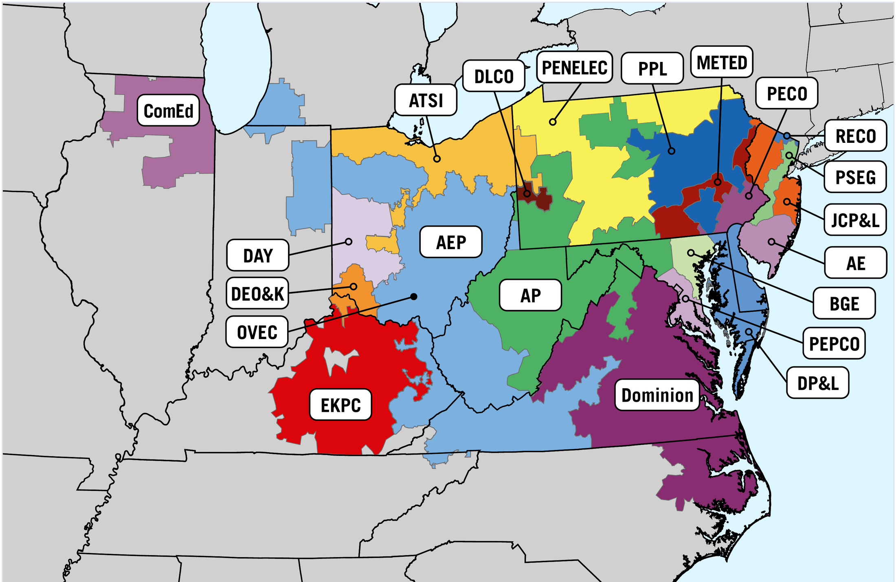

PJM's transmission zones, May 2023 map. A zone can contain more than one utility. [PJM — Transmission Zones map](https://www.pjm.com/-/media/DotCom/about-pjm/pjm-zones.pdf)

### Dominion's contracts run far ahead of its demand

Dominion's customers move through three contract stages. At the first, a substation engineering letter of authorization (SELOA), the customer pays for a detailed engineering plan. After prerequisites such as site control it posts a $250,000 engineering deposit, and a study that typically takes nine to twelve months returns the required infrastructure, an estimated energization date and an estimated cost. The customer may then decline to proceed. A construction letter of authorization (CLOA) reserves capacity and authorizes construction, and the customer must reimburse Dominion's spent costs if it walks away. An electric service agreement (ESA) sets how the customer will take service, with collateral and tariff terms, and carries a revenue requirement whether or not the customer takes service. Dominion's January 6, 2026 letter to PJM calls the first stage an engineering letter of authorization (ELOA); it is the same stage.

Dominion's July 31, 2026 earnings presentation reports about 53.8 GW of data-center contracted capacity in July 2026: 32.4 GW at the SELOA stage, 9.4 GW under CLOAs and 12.0 GW under ESAs. The total was about 16.5 GW in July 2023 and 48.5 GW in December 2025. Demand is far smaller. The January letter reports a coincident data-center peak of about 4 GW in 2025, set against a July 2025 contract total of 47 GW (30.1 GW ELOA, 7.1 GW CLOA and 9.8 GW ESA), and it forecasts 16.6 GW of data-center demand by 2046. Contracted capacity is the most those sites could draw; coincident peak is what they drew together at one moment. The figures carry different dates, and together they show the difference between capacity and demand: Dominion forecasts data-center demand far below the capacity its customers hold under contract.

Dominion Energy Q2 2026 earnings presentation, July 31, 2026, page 5. Contracted capacity only; the 2025 coincident peak of about 4 GW comes from Dominion's January 2026 letter. [Dominion Energy — Q2 2026 earnings call slides](https://s2.q4cdn.com/510812146/files/doc_financials/2026/q2/2026-07-31-DE-IR-2Q-2026-earnings-call-slides-vTCII.pdf)

### A forecast requires more than adding applications

SemiAnalysis's June 18, 2026 comparison places ERCOT's April requests of 410 GW, including roughly 357 GW of data centers, beside its own 45.4 GW tracked data-center buildout through 2030 Q4. Its phantom-or-duplicative classification is the analyst's judgment, not an ERCOT count of duplicates. Different coverage and horizons keep the two figures from being subtracted into a measure of fraudulent or cancelled demand.

A second article reproduces ERCOT's 2025 forecast comparison: 208 GW submitted versus 138 GW adjusted for 2030. Those are whole-system forecasts, not data-center-only requests or energized capacity. The adjustment shows a planner's job: decide which loads, timing and assumptions belong in a system forecast. Each forecast carries its own adjustments, so no single haircut applies to today's queue.

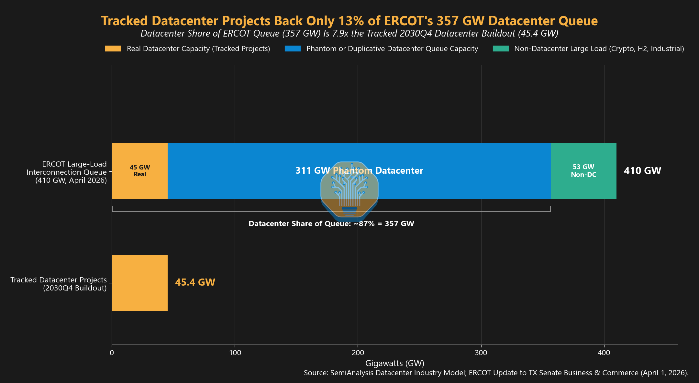

SemiAnalysis model comparison, June 18, 2026. The phantom classification is the publisher’s estimate, not an ERCOT cancellation audit. [SemiAnalysis — Stop Saying Half of 2026 US Datacenter Capacity Is Canceled](https://newsletter.semianalysis.com/p/stop-saying-half-of-2026-us-datacenter)

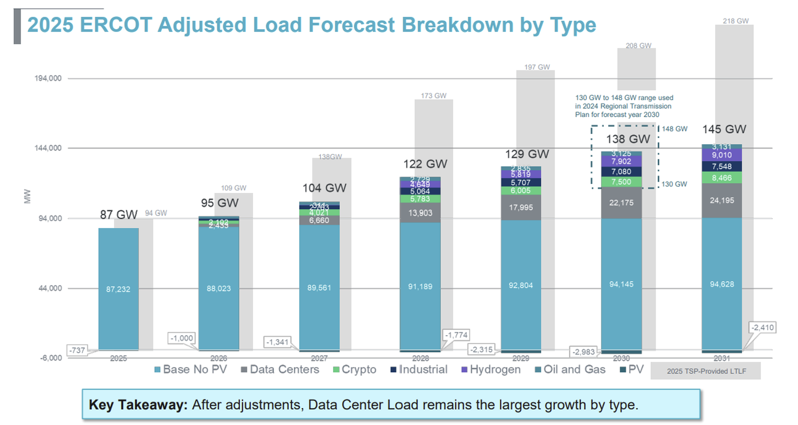

ERCOT’s 2025 whole-system forecast, reproduced by SemiAnalysis in March 2026. [SemiAnalysis — Are AI Datacenters Increasing Electric Bills for American Households?](https://newsletter.semianalysis.com/p/are-ai-datacenters-increasing-electric)

### Connect a supported operating phase

An ERCOT May 4, 2026 workshop illustration, reproduced by SemiAnalysis, pairs a 1,000 MW load with 100 MW of grid withdrawal and two 500 MW onsite generators. Local generation can support a larger load than the permitted grid import. The worked example follows the arithmetic as generation becomes available. Actual service also depends on studies, commissioning, controls and approved operating conditions.

The grid withdrawal limit still applies after a generator trips, so the site cannot replace lost local generation with imports it has not secured. A useful connection offer therefore states four things together: confirmed import, the supported ramp and dates, responsibility for construction, and operating conditions including curtailment. Those terms decide which computing phase can open.

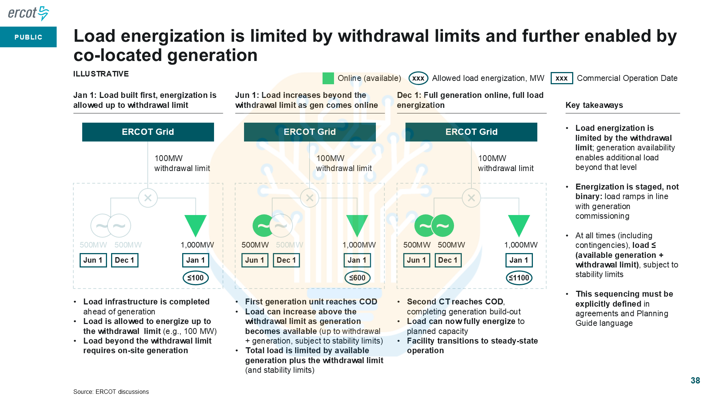

ERCOT's May 4, 2026 workshop illustration, reproduced by SemiAnalysis. Its 1,100 MW of supply, 100 MW of import plus two 500 MW generators, can serve at most the pictured 1,000 MW load. [SemiAnalysis — US Grid Constraints: Towards 40GW+ of Behind-The-Meter Datacenter by 2028?](https://newsletter.semianalysis.com/p/us-grid-constraints-towards-40gw)

### Where the rest of the power comes from

When the grid connection covers only part of a campus, the rest must come from the site's own supply, behind the meter: on the customer's side of the utility meter. SemiAnalysis's June 25, 2026 forecast puts a national number on that gap. For each year from 2026 to 2030 it splits the US data-center capacity it expects to be added by power source; yearly additions rise from 21 GW in 2026 to 84 GW in 2030. Existing grid headroom supplies 16.9 GW in 2026 and 14.6 GW in 2027, then runs out. New grid supply grows from 9.5 GW in 2027 to 18.3 GW in 2030. The remainder, which the publisher says must be met behind the meter, is 14.8 GW in 2027 and 42.6 GW of the roughly 54 GW added in 2028.

Each bar is capacity added in that year, so the bars are not a running total of the fleet. The behind-the-meter remainder is a modeled shortfall rather than a count of contracted onsite plants, and the forecast covers the whole country rather than ERCOT or PJM alone. It shows why the staged connection matters: a place in the queue buys a study and an import limit, and a campus that needs power sooner brings some of its own.

SemiAnalysis forecast, June 25, 2026. Bars are capacity added each year in GW, although the chart title says MW; the behind-the-meter gap is modeled, not contracted generation. [SemiAnalysis — US Grid Constraints: Towards 40GW+ of Behind-The-Meter Datacenter by 2028?](https://newsletter.semianalysis.com/p/us-grid-constraints-towards-40gw)

### Worked example: A gigawatt load behind a 100 MW withdrawal limit

- ERCOT's May 4, 2026 workshop mechanism: a 1,000 MW load, a 100 MW grid withdrawal limit and two 500 MW onsite generators.
- Each commissioned generator can make at most 500 MW available; ignore losses for arithmetic.
- Grid import remains capped at 100 MW; actual service may be lower because of other limits.

1. Grid alone — min(1,000, 100) = 100 MW — The requested campus size does not increase the withdrawal limit.
2. One generator available — min(1,000, 100 + 500) = 600 MW — Local supply raises the arithmetic upper bound.
3. Both generators available — min(1,000, 100 + 500 + 500) = 1,000 MW — Cap the result at the pictured load, even though source ratings sum to 1,100 MW.
4. One generator lost at full load — 1,000 − (100 + 500) = 400 MW — At least 400 MW must be removed from this balance; surviving-generator ramp and reserve limits may require more.

**Result:** Staged supply can advance partial service while preserving a binding import limit.

**Model boundary:** These are steady power bounds for a workshop mechanism, not a named project or a current permission. They leave out transient behavior, protection, generator availability and any permitted load-shedding scheme.

### The tradeoff

Choice: Keep several site options open in ERCOT, then commit to one.

Benefit: Alternative sites can expose a faster route to usable power.

Cost: From October 8, 2026, each 1,000 MW request entering an ERCOT study posts a $50 million security face amount and a $100,000 study fee, so three 1,000 MW options carry $150 million of security until two are withdrawn, and an option withdrawn after it is allocated capacity but before its standard agreement forfeits 20 percent of the related security.

### When the situation changes

Trigger: One 500 MW generator trips while a 1,000 MW campus runs on both generators and a 100 MW grid import.

Mechanism: Supply falls to 100 + 500 = 600 MW, and the grid connection does not acquire import rights to cover the lost generator.

Response: Through the validated operating arrangement, reduce load by at least 400 MW at once or cover that shortfall from another source within its limits; surviving-generator ramp and reserve limits may require more.

### Apply the idea

An offer supports 100 MW grid import and a possible 1 GW later phase. What must be established before scheduling that later phase?

Reveal the worked answer

Establish the later phase's supported supply, import rights, completion milestones, ramp dates and conditions following a generator outage.

A requested final capacity and an early partial connection do not demonstrate that the remaining scope is deliverable.

**The idea to keep:** A place in the queue buys a study and, later, an import limit, not power on your schedule. A credible power date names the import limit, the construction scope, the load ramp and the operating conditions.

### Sources

- [BG2 podcast — Satya Nadella and Sam Altman with Brad Gerstner, October 31, 2025](https://www.youtube.com/watch?v=Gnl833wXRz0&t=1109s) — BG2 Pod · Published 2025-10-31 · Reviewed 2026-09-21. At about 18:29 Microsoft's chief executive says his constraint is power and powered buildings rather than chip supply, describing chips in inventory that he cannot plug in.
- [Microsoft — FY26 Q1 earnings call, October 29, 2025](https://www.microsoft.com/en-us/investor/events/fy-2026/earnings-fy-2026-q1) — Microsoft · Published 2025-10-29 · Reviewed 2026-09-21. Microsoft's chief financial officer says the company had been short of space and power for GPUs and CPUs rather than short of the chips.
- [ERCOT — Senate Business and Commerce update, July 29, 2026](https://www.ercot.com/files/docs/2026/07/29/ERCOT-Senate-July-29-Panel-1-Assessing-The-Grid.pdf) — ERCOT · Published 2026-07-29 · Reviewed 2026-09-26. ERCOT's June 2026 large-load status snapshot through 2033: 474.7 GW requested, roughly 90 percent of it data centers, with 284.3 GW having no studies submitted, 135.5 GW under review and 5.9 GW observed energized.
- [ERCOT — March 2026 Monthly Operational Overview](https://www.ercot.com/files/docs/2026/04/16/ERCOT-Monthly-Operational-Overview-March-2026.pdf) — ERCOT · Published 2026-04-16 · Reviewed 2026-09-20. Defines ERCOT's large-load status categories, including observed energized, approved to energize and no studies submitted.
- [Texas Legislature — SB 6 enrolled text, 89th Legislature](https://capitol.texas.gov/tlodocs/89R/billtext/html/SB00006F.htm) — Texas Legislature · Reviewed 2026-09-20. PURA 37.0561 sets overlapping-request disclosure, site-control evidence, a transmission-screening study fee of at least $100,000 and infrastructure commitments for large loads.
- [Public Utility Commission of Texas — 16 TAC §25.370, ERCOT Large Load Forecasting Criteria](https://ftp.puc.texas.gov/public/puct-info/agency/rulesnlaws/subrules/electric/25.370/25.370.pdf) — Public Utility Commission of Texas · Reviewed 2026-09-26. From March 1, 2026, for the load data behind ERCOT's 2026 Regional Transmission Plan, a large-load customer could show financial commitment in one of three ways, one of which is security of $100,000 per MW of contracted peak demand.
- [PUCT — Order adopting 16 TAC 25.194, September 18, 2026](https://interchange.puc.texas.gov/Documents/58481_218_1684656.PDF) — Public Utility Commission of Texas · Published 2026-09-18 · Reviewed 2026-09-20. The adopted 16 TAC 25.194 sets a $100,000 study fee and $50,000/MW intermediate-agreement security (printed pp. 234–235) and later security of the greater of $50,000/MW or allocated upgrade costs (pp. 251–252).
- [PUCT — Texas Register acknowledgment for adopted 16 TAC 25.194](https://interchange.puc.texas.gov/Documents/58481_219_1684678.PDF) — Public Utility Commission of Texas · Published 2026-09-18 · Reviewed 2026-09-20. The adopted large-load interconnection rule, 16 TAC 25.194, is effective October 8, 2026.
- [ERCOT — Batch Zero large-load connection announcement, June 18, 2026](https://www.ercot.com/news/release/06182026-puct-approves-ercots) — www.ercot.com · Published 2026-06-18 · Reviewed 2026-09-06. The PUCT approved ERCOT's Batch Zero process, set out in PGRR145, on June 18, 2026; it studies qualified large-load requests of at least 75 MW together.
- [ERCOT — PGRR145, Batch Zero Process for Large Load Interconnections](https://www.ercot.com/mktrules/issues/PGRR145) — ERCOT · Reviewed 2026-09-26. Planning Guide Revision Request 145, which sets out Batch Zero, was approved by the PUCT on June 18, 2026 and took effect on July 11, 2026.
- [ERCOT — PGRR145 final PUCT report, June 18, 2026 decision](https://www.ercot.com/files/docs/2026/06/22/145PGRR-130-PUCT-Report-061826.docx) — ERCOT · Reviewed 2026-09-26. Section 9.2.1.2(1)(c): a large load to be studied and allocated in Batch Zero had to post financial security of $50,000 per MW of the peak demand in its most recent load commissioning plan by July 24, 2026.
- [ERCOT — House State Affairs data-center update, August 19, 2026](https://www.ercot.com/files/docs/2026/08/19/ERCOTPanel1DataCenters.pdf) — ERCOT · Published 2026-08-19 · Reviewed 2026-09-20. About 205 GW was preliminarily eligible for Batch Zero in ERCOT's July 28, 2026 snapshot.
- [ERCOT — Batch Zero verification process notice, September 9, 2026](https://www.ercot.com/services/comm/mkt_notices/M-A090926-01) — ERCOT · Published 2026-09-09 · Reviewed 2026-09-20. ERCOT's September 9, 2026 notice requested supporting documents to verify conditionally included Batch Zero loads.
- [PJM — PJM at a Glance fact sheet](https://www.pjm.com/-/media/DotCom/about-pjm/newsroom/fact-sheets/pjm-at-a-glance.pdf) — PJM Interconnection · Reviewed 2026-09-26. PJM coordinates the movement of electricity in all or parts of 13 states and the District of Columbia and does not own the equipment it directs; others own the power lines and power plants.
- [PJM — Transmission Zones map, May 2023](https://www.pjm.com/-/media/DotCom/about-pjm/pjm-zones.pdf) — PJM Interconnection · Published 2023-05-11 · Reviewed 2026-09-21. PJM's transmission-zones map shows 21 zones, with the Dominion zone covering most of Virginia.
- [FERC — PJM large-load show-cause order, June 18, 2026](https://www.ferc.gov/sites/default/files/2026-06/EL26-67-000.pdf) — FERC · Published 2026-06-18 · Reviewed 2026-09-20. Describes how new load is designated and served in PJM, including long-term firm transmission requests in the New Services Queue, and says load interconnection requests go to the transmission owners.
- [Dominion Energy — Data-center load-adjustment letter to PJM, January 6, 2026](https://www.pjm.com/-/media/DotCom/planning/res-adeq/load-forecast/dominion-documentation.pdf) — Dominion Energy · Published 2026-01-06 · Reviewed 2026-09-20. Describes the ELOA, CLOA and ESA stages, the $250,000 engineering deposit, the typical 9–12 month study, a July 2025 contract total of 47 GW, a 4 GW coincident data-center peak in 2025 and a 16.6 GW demand forecast for 2046.
- [Dominion Energy — Q2 2026 earnings call slides, July 31, 2026](https://s2.q4cdn.com/510812146/files/doc_financials/2026/q2/2026-07-31-DE-IR-2Q-2026-earnings-call-slides-vTCII.pdf) — Dominion Energy · Published 2026-07-31 · Reviewed 2026-09-21. Dominion Energy Virginia's data-center contracted capacity reached about 53.8 GW in July 2026: 32.4 GW SELOA, 9.4 GW CLOA and 12.0 GW ESA, up from about 16.5 GW in July 2023.
- [PJM — Over 700 generation projects accepted into Cycle 1, August 3, 2026](https://insidelines.pjm.com/over-700-new-generation-projects-accepted-into-first-cycle-of-reformed-interconnection-process/) — PJM · Published 2026-08-03 · Reviewed 2026-09-20. 715 generation projects totaling 201.5 GW of nameplate capacity qualified for PJM's first reformed study cycle.
- [ERCOT — Batch Study Workshop 8, May 4, 2026](https://www.ercot.com/files/docs/2026/05/04/ERCOT_Batch_Study_Workshop_8_20260504.pptx) — ERCOT · Published 2026-05-04 · Reviewed 2026-09-20. Illustrates staged load: a 1,000 MW request with a 100 MW withdrawal limit and two 500 MW generators.
- [Stop Saying Half of 2026 US Datacenter Capacity Is Canceled](https://newsletter.semianalysis.com/p/stop-saying-half-of-2026-us-datacenter) — SemiAnalysis · Published 2026-06-18 · Reviewed 2026-09-20. Compares ERCOT's April 2026 requests of 410 GW, about 357 GW of them data centers, with SemiAnalysis's 45.4 GW tracked data-center buildout through 2030 Q4.
- [Are AI Datacenters Increasing Electric Bills for American Households?](https://newsletter.semianalysis.com/p/are-ai-datacenters-increasing-electric) — SemiAnalysis · Published 2026-03-03 · Reviewed 2026-09-20. Reproduces ERCOT's 2025 whole-system forecast comparison: 208 GW submitted and 138 GW adjusted for 2030.
- [US Grid Constraints: Towards 40GW+ of Behind-The-Meter Datacenter by 2028?](https://newsletter.semianalysis.com/p/us-grid-constraints-towards-40gw) — SemiAnalysis · Published 2026-06-25 · Reviewed 2026-09-21. Reproduces ERCOT's May 4, 2026 staged-energization illustration and forecasts annual US data-center additions by power source, with a behind-the-meter gap of 14.8 GW in 2027 and 42.6 GW in 2028.

### Check your understanding: Requests, contracts or forecast?

Pause and make a prediction, then compare your reasoning.

A briefing lists three figures from this case study under one heading, "data-center demand": ERCOT's June 2026 snapshot of 474.7 GW of large-load requests, Dominion Energy's July 2025 contract total of 47 GW, and ERCOT's 2025 whole-system forecast for 2030, which adjusted 208 GW submitted to 138 GW. The briefing adds the first two figures and reports 521.7 GW of demand on the way.

**Pause and predict:** What kind of number is each figure? How much of Dominion's 47 GW had reached an electric service agreement, and why can the 474.7 GW and 47 GW not be added?

Compare your reasoning

ERCOT's 474.7 GW is requested capacity, Dominion's 47 GW is a contract snapshot and ERCOT's 138 GW is a system forecast. Only 9.8 GW of Dominion's 47 GW had reached an electric service agreement. The 521.7 GW total adds Texas requests to one PJM utility's contracts, so it is not a demand figure for either region.

Requests record what developers have asked for. Of ERCOT's 474.7 GW, 284.3 GW had no study submitted and 5.9 GW had been observed energized. A developer that requests 1 GW at each of three alternative sites for one 1 GW plan adds 3 GW of requests, while at most one campus gets built.

Contracts record how far each customer has committed. Dominion's 47 GW splits into 30.1 GW under engineering letters of authorization (ELOAs), which a customer may decline after the study, 7.1 GW under construction letters of authorization (CLOAs), which reserve capacity, and 9.8 GW under electric service agreements (ESAs): 30.1 + 7.1 + 9.8 = 47.0 GW. Dominion's coincident data-center peak in 2025 was about 4 GW, a measurement of the demand its connected data centers drew at the same time.

Forecasts record a planner's judgment about which loads arrive and when. ERCOT's adjustment from 208 GW to 138 GW covers every load on its system, so it is broader than data centers. Each figure answers a different question, so read it with its region, date and status before comparing it with another.

**The next problem:** A power date is one condition for opening a phase. Can the parcel, building, access routes and other services support the same phase?

Continue in **5. Physical site, buildings and safety**: Choose a site that can deliver the first phase.

## Choose a site that can deliver the first phase

**5. Physical site, buildings and safety**

Compare greenfield development with brownfield reuse, then evaluate land, utilities, site risks and the date when a first phase can operate. Colossus 1 and Abilene provide the land-use case study.

**Driving question:** Which parcel can support the required campus, with usable land and services ready on time?

### Start with a campus requirement, not a land listing

In this original example, the first phase needs 60 MW delivered at the customer bus, including the stated campus auxiliaries, a 40-acre campus envelope, two physically separate fiber routes, and opening by month 24. The campus envelope includes the buildings, electrical and cooling plant, access and service areas. It is a supplied layout requirement, not an acres-per-megawatt rule. Compare every parcel against that same brief.

A parcel’s price and acreage cannot establish whether that campus can be built. A utility line may be nearby without available capacity. A large tract may lose useful area to drainage or existing rights of way. A land option may expire before the project can resolve its conditions. Keep each unresolved fact visible; a weighted score cannot compensate for a condition that prevents the first phase.

### Confirm the power and fuel that can reach the site

Obtain the capacity, delivery point, required upgrades, operating restrictions and date from the actual utility process. A substation rating is not a commitment to supply that amount to this customer. The grid-connection section develops the electrical service boundary; here the question is whether the proposed parcel can obtain that service on the project schedule.

An on-site gas plant replaces some electrical dependencies with fuel dependencies. Establish required gas volume and pressure, supply and transportation terms, curtailment conditions, and the tap, metering, lateral and any compression needed to connect. Confirm who builds them, when, and across whose land. Gas-turbine guidance from the US Department of Energy explains why insufficient pressure can require a fuel-gas compressor. Owning a generator and seeing a gas pipeline on a map do not answer those questions.

### Draw the land that the campus can actually use

Parcel A has 100 gross acres. The example excludes 25 acres for drainage and flood constraints and a separate, nonoverlapping 15 acres of easements, leaving 60 usable acres. Parcel B has 72 gross acres, with 12 acres of drainage exclusion and 8 separate easement acres, leaving 52. Both exceed the supplied 40-acre campus envelope. Real exclusion polygons can overlap; calculate their union rather than subtracting the same ground twice.

The area screen assumes a contiguous envelope with suitable access. It does not establish foundation design. A topographic survey, grading and drainage plan, geotechnical investigation, equipment routes and expansion layout resolve different questions. The US Department of Agriculture warns that regional soil surveys are not site-specific evaluations and do not test for toxic spills. A flood can also disable an off-site substation, bridge or fuel route while leaving the building dry: trace the dependency beyond the fence.

### Match cooling and fiber to the actual design

For cooling, establish the available water source, allocation, quality and discharge conditions against the chosen heat-rejection design and local weather. A recirculating loop can still need makeup water; dry cooling instead changes the equipment and hot-weather operating requirements. The heat-rejection section explains those heat and water calculations. Here, retain the resulting capacity and readiness conditions in the site comparison.

For communications, verify capacity, route length, delivery dates, site entrances and the rights to construct each route. Two carrier contracts can share a trench or bridge. In this example, two physically separate routes are a stated requirement; Parcel B’s second route arriving in month 23 is the last supplied prerequisite. Its first route arriving earlier does not satisfy both paths.

Two AI campuses make heat rejection concrete. The Tennessee Department of Environment and Conservation identifies Colossus 1 as a user of evaporative cooling; a satellite-imagery study by the Federation of American Scientists also identifies air-cooled chillers there. Crusoe describes Abilene’s air-cooled chillers as non-evaporative. Both facilities can circulate coolant inside the building. The outdoor heat-rejection method determines whether that heat-removal path consumes water through evaporation; a closed indoor loop alone does not answer it.

Physical route diversity is common practice. QTS’s January 2023 account describes diverse fiber entrances and campus conduits at Suwanee, and in September 2026 its Suwanee campus page described a redundant campus fiber conduit system as in progress. Each statement holds at its own date, so end-to-end completion needs current evidence. Zayo’s March 2026 Cambois announcement provides an AI-specific construction example: four diverse fiber routes. A carrier contract and a separate site entrance do not prove every mile avoids a shared trench, bridge or upstream node.

Makeup water is replacement water added to a cooling tower for evaporation, blowdown and other losses. The term describes its function, not whether it is drinking water, reclaimed wastewater or another suitable supply. Climate and water availability constrain site choice; the cooling chapters explain the equipment and temperature and water balances.

### Secure the parcel and the rights across it

A land-purchase option gives the developer a time-limited right to buy on agreed terms without an obligation to complete the purchase. The option is commonly paid for. It can reserve the purchase decision while the developer investigates the site; testing access, extensions and other permissions still depend on the agreement. If the conditions cannot be resolved before expiry, the developer may need to negotiate an extension or let the option lapse.

Purchase, lease and option arrangements give different rights for different periods. Check the actual terms for investigations, access, assignment, closing conditions and extensions, then compare their dates with the utility and permit work. Review title exceptions, recorded easements and the additional routes needed to bring power, gas, fiber and water to the campus. A line crossing another owner’s property needs its own established right; control of the main parcel does not supply it.

Texas provides a concrete title issue: surface and mineral estates may have separate owners. Mineral rights can include reasonably necessary access to the surface for development, so a campus owner may still face drilling, roads or pipeline rights held by someone else. The Railroad Commission explains that deeds, leases, ordinances and the accommodation doctrine can limit these rights. Establish the recorded interests and surface-use arrangements before fixing the building footprint. This example is Texas law, not a claim of a mineral dispute at Abilene.

The required outcome is enforceable rights compatible with the campus, not necessarily ownership of every mineral interest. Relevant mineral owners and existing lessees may agree to surface restrictions or waivers, or agreed drilling and access areas can shape the layout. Purchasing minerals does not automatically rewrite an existing lease. Title investigation must identify the parties whose rights actually affect the site.

### Check permitted uses and neighbors

Identify the approvals and conditions for this layout: land use, air emissions, noise, water, drainage, construction and fire access. Equipment intended for continuous generation can raise different questions from standby equipment. Nearby homes, schools and other sensitive uses affect the actual siting conversation. A permit for one phase does not establish approval for the later campus.

### Greenfield and brownfield: new land or an existing site

A greenfield project starts on previously undeveloped land; brownfield redevelopment, in the ordinary site-reuse sense, begins with an existing site and its history. Industrial reuse may offer roads, utility connections and a building, while also carrying obsolete equipment or contamination. The US Environmental Protection Agency distinguishes historical and site-condition review from sampling and cleanup planning. Establish what can remain, what must be removed, and any restrictions on the intended use. An apparently empty contamination folder is not equivalent to completed investigation. This use of brownfield does not establish a statutory designation or contamination at a named site.

### Two real connections show why the delivery details matter

The 2025 xAI update from Memphis Light, Gas and Water (MLGW), the city’s utility, describes the Paul Lowery Road campus in the former Electrolux facility: an existing 16-inch gas main served the site, and xAI paid for an 8-inch tap. The same dated update describes additional gas capacity at the separate Tulane Road site as still under study. Infrastructure reuse, a funded connection and a pending service study are three different states. The update records the 2025 service states.

Energy Transfer’s second-quarter 2026 investor presentation reports an agreement to construct gas-delivery facilities for Crusoe’s Abilene expansion. It verifies an infrastructure agreement, not completed service. The same presentation separately reports a completed 14-mile Abilene lateral without linking it to Crusoe. Neither case supports casually saying that an AI company built a regional pipeline.

### Case study: Colossus 1 reuses an industrial site

Colossus 1 at Paul Lowery Road in Memphis, Tennessee occupies the former Electrolux factory. This is our brownfield redevelopment example; Abilene’s original phase supplies the greenfield comparison. Reuse can retain a shell, roads and utility access, while a new site offers more freedom to arrange structures and routes. Neither label decides cost or opening date. SpaceXAI uses the name Colossus 1 in its May 2026 Anthropic announcement.

MLGW’s historical 2025 account assigns 8 MW of grid service to the existing substation and 142 MW to a new one. Of that 150 MW total, 142/150 ≈ 94.7% came through the new substation. A reused factory still needed substantial new electrical work. These are historical service quantities, not a present IT-load measurement or evidence of a specific cost saving.

Pause: an owner offers an industrial building with existing utility connections at a lower purchase price. What would justify calling it the cheaper data-center option? Compare the same useful-work target and opening date, including conversion of the shell, new service, cooling, fiber, equipment access, investigations and ongoing operation. Without that common scope, cheaper land or a retained wall cannot establish cheaper delivered compute.

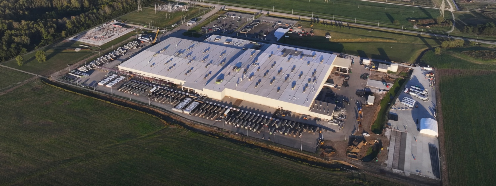

Colossus 1 on Paul Lowery Road, Memphis: the former Electrolux factory. SpaceXAI gives no capture date. [SpaceXAI — Colossus site aerial](https://x.ai/colossus)

### Case study: Meta puts part of Prometheus under tents

Meta’s September 29, 2025 engineering account says its Prometheus cluster combines conventional data-center buildings, weatherproof tents and adjacent colocation facilities. SemiAnalysis’s July 2026 report on modular construction places the tents at New Albany, Ohio: aluminum-framed, fabric-clad halls of roughly 125,000 square feet each that enclose the racks and keep out the weather without a conventional permanent shell.

A tent speeds up the enclosure. Utility interconnection, power, cooling and commissioning still run on their own schedules, and the lighter structure gives up some of the durability and flexibility of a permanent building. A campus plan therefore tracks two dates: when the hall is enclosed and when it can serve load.

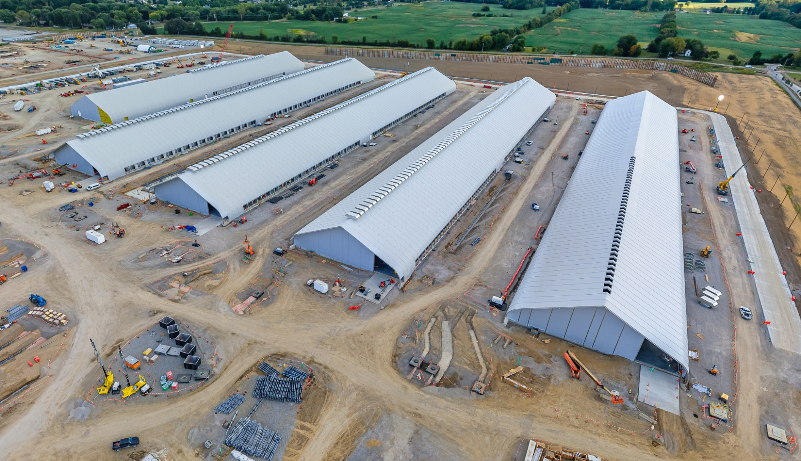

Prometheus tent halls under construction in New Albany, Ohio, published by Meta in September 2025. Meta gives no capture date. [Meta — Meta’s Infrastructure Evolution and the Advent of AI](https://engineering.fb.com/2025/09/29/data-infrastructure/metas-infrastructure-evolution-and-the-advent-of-ai/)

### Case study: a first phase opens while the next is finished

Applied Digital delivered the first 50 MW of Polaris Forge 1’s first building to the ready-for-service milestone on October 27, 2025; the next 50 MW followed on November 24. The tenant was CoreWeave. This is the same phased-delivery case introduced in the power-and-siting chapter. Here it motivates a physical campus plan that keeps construction, delivery traffic and future connections from disrupting the live phase. The two releases document delivery milestones, not the actual routes, operating procedures or power drawn by installed accelerators.

### Case study: Texas Critical Data Centers (TCDC): land secured, waiver pending

New Era’s August 14, 2026 issuer update said all 493 acres for Texas Critical Data Centers near Odessa had been secured, with one final surface waiver pending from a leasehold operator. It also reported removal of 22 abandoned pipelines across 12 rights-of-way. These are distinct site-development milestones.

The release establishes an outstanding agreement, not a quantified mineral-caused delay. Another actual contract, Fermi’s May 2025 Project Matador ground lease, made a surface waiver a commencement condition unless the tenant waived it. Its later filing reports commencement in September 2025 after conditions were satisfied or waived. Agreements can resolve surface use without buying every mineral interest.

For scale, the August 24, 2026 edition of SemiAnalysis’s behind-the-meter (BTM) tracker assigns about 17 GW of booked onsite generating capacity to named Texas sites, more than any other named state. Another 29 GW has no site selected. These are orders for generator nameplate, excluding batteries, not operating IT capacity or counts of data centers. It does not establish that Texas hosts most existing data centers.

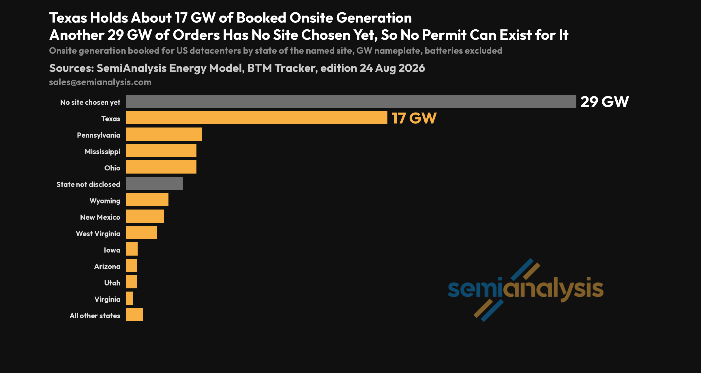

Booked onsite generating capacity by state of the named site, BTM Tracker edition of August 24, 2026, published September 10, 2026. Generator nameplate, excluding batteries. [SemiAnalysis — What is So Hard About Behind-The-Meter Power For Datacenters? Part 1](https://newsletter.semianalysis.com/p/what-is-so-hard-about-behind-the)

### Case study: Getty v. Jones: conflicting surface uses

In Getty Oil v. Jones (Texas Supreme Court, 1971), an established irrigation system needed seven feet of clearance while Getty’s pumpjacks reached 17 and 34 feet. Other operators showed lower-profile or recessed alternatives. The court held that reasonable mineral use can require accommodating an existing surface use where reasonable mineral-development alternatives are available and the surface owner has no reasonable alternative for continuing that existing use.

The court affirmed a remand; this was not a universal order to bury equipment. It is a farming judgment, not a data-center lawsuit. Its lesson for a proposed campus is that dominance of the mineral estate has limits, but a fact-dependent doctrine does not pre-approve a new building layout. Resolve express deeds, leases and surface agreements before relying on litigation.

### Case study: ADA Docklands: building on fill

ADA Infrastructure’s June 2024 announcement planned three data-center buildings in East London’s Royal Docks, on former industrial ground. Menard’s account of the campus groundworks identifies up to six metres of fill above soft alluvium, plus buried foundations, tanks and timber piles. Continuous-flight-auger (CFA) piles support the buildings. About 7,000 Bi-Modulus ground-improvement columns treated 40,000 square metres of external areas and utility infrastructure.

The upper stone sections of those columns could clash with utilities, so utility invert levels had to be coordinated with the treatment. Remediation also affected the work sequence. The case links ground evidence to the buildings, external utility routes and construction sequence; the 7,000 columns are not the building piles.

### Case study: Equinix HO1 during Harvey

Hurricane Harvey reached the Texas coast on August 25, 2017. It moved slowly, so heavy rain continued: flash flooding spread across Harris County on August 26–27, and floods worsened again on August 29–30.

On August 28, 2017, Equinix told Data Center Knowledge that HO1 in Houston remained staffed and operating without interruption, while flooding had closed surrounding streets and made the site inaccessible to customers. The flood cut customers off from a data center that was still running.

Equinix’s subsequent employee account describes water entering its Houston data center and staff staying for days, pumping it out while maintaining power. Continued IT service therefore depended on people already on site as well as equipment.

### Case study: Meet QTS Suwanee

QTS operates a 53-acre colocation campus in Suwanee, Georgia. Its two data-center buildings are at 300 and 120 Satellite Boulevard NW. Customers place IT equipment in such facilities and connect it to their networks through physical fiber routes.

QTS’s January 2023 article described diverse campus fiber entrances and separately proposed four entrances for DC2, the campus’s second building. In September 2026, QTS’s campus page described a redundant campus fiber conduit system as in progress. These are dated statements with different scopes, so completion of the whole campus conduit system remains unconfirmed.

The DC1 connectivity sheet identifies three diverse underground fiber entry laterals. That count differs from the four entrances proposed for DC2 in January 2023. Separate entrances protect against a single cut only while their routes stay apart beyond the fence: three laterals that merge into one shared duct outside the property would fail together.

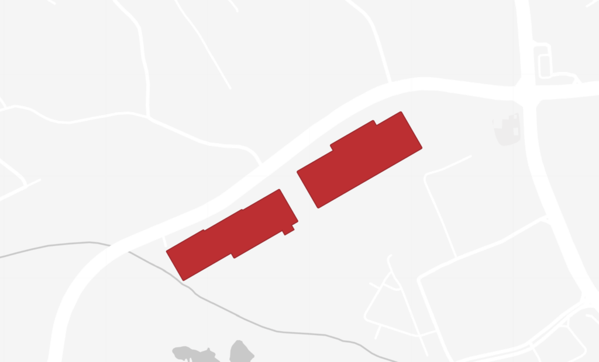

QTS’s official Suwanee campus plan: building footprints and roads only. [QTS — Suwanee campus](https://q.com/data-centers/suwanee-1/)

### Case study: Rogers Toronto: screen the chillers

Parklane’s account of the Rogers headquarters data-center retrofit in Toronto describes rooftop chillers opposite residences and a 15-foot acoustic screen. Sixteen factory-built wall sections were installed in one ten-hour day. With little staging space, the sections were lifted from delivery trucks onto precisely positioned columns.

A barrier interrupts direct sound propagation, while sound can still diffract around its edges; height, placement and construction matter. The open top must also support the chillers’ airflow. Parklane reports meeting the noise requirements without publishing a measured decibel reduction.

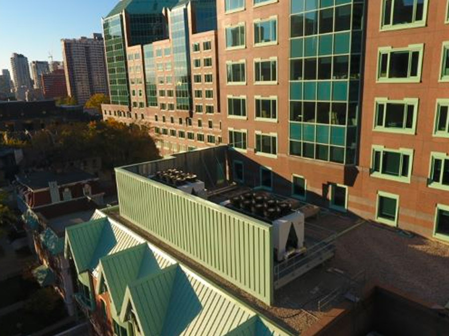

The acoustic screen around the Rogers rooftop chillers. Parklane gives no capture date. [Parklane — Rogers headquarters data-center acoustic screen](https://parklanemechanical.com/noise-control-case-studies/rogers-head-office)

### Knowledge check: expand a live campus

Hall A is live. It depends on one access road and on one duct that carries both of its fiber services, and the excavation planned for Hall B cuts across both. What has to move before digging starts, and in what order?

Build the new access road and the replacement fiber while the original routes stay in service. Test the new routes, then switch Hall A’s vehicle access and live fiber service onto them. Only then start excavating. Moving only the road leaves both fiber services in the duct the excavation cuts; moving only the fiber leaves Hall A without road access.

### Worked example: The smaller parcel meets the opening brief

- Original hypothetical brief: 60 MW net at the customer bus, including auxiliaries; 40 contiguous usable acres; two physically separate fiber routes; opening by month 24.
- Parcel A: 100 gross acres minus 25 drainage/flood acres and 15 nonoverlapping easement acres. Parcel B: 72 minus 12 and 8 respectively. Layout fit, soil suitability and access within the remaining envelope are supplied assumptions.
- Accepted-readiness months for power, civil works, cooling/water, two fiber routes and permits: A = 30, 20, 20, 21, 22; B = 22, 21, 20, 23, 21. These are teaching inputs, not project forecasts.
- A’s land option ends in month 18 without an agreed extension; its proposed gas bridge has no established volume, pressure or lateral rights. B’s required land and service rights are resolved through month 26; its permitted first phase does not rely on gas generation.
- All other prerequisites, including the supplied Phase I/II findings and any required remediation, are assumed resolved for B. The model screens stated conditions; it is not engineering or legal approval.

1. Usable area — A: 100 − 25 − 15 = 60 ac; B: 72 − 12 − 8 = 52 ac — Both fit the supplied 40-acre envelope. The larger acreage is not the deciding constraint.
2. Earliest service date — A: max(30, 20, 20, 21, 22) = month 30; B: max(22, 21, 20, 23, 21) = month 23 — A misses the month-24 brief. B waits for its second fiber route.
3. Control and fuel — A: option ends at 18 < 30; gas bridge unresolved. B: control through 26 > 23 — A needs a new land agreement and evidence for any alternative supply. The proposed gas plant cannot be credited as available power.
4. First-phase selection — B: 52 ≥ 40 ac; 60 MW; month 23 ≤ 24 — B passes the declared screen with 12 acres outside the initial envelope. That remainder is not proven future MW.

**Result:** Select Parcel B for the supplied brief. Parcel A’s extra land does not resolve its later power date or expired land-control assumption.

**Model boundary:** Area exclusions are disjoint and dimensions schematic. Dates represent supplied accepted readiness. No actual site, contract, water allocation, gas capacity, permit or construction program is approved by this example.

### The tradeoff

Choice: Favor a smaller parcel whose first-phase services and rights are established.

Benefit: In the worked example, Parcel B opens in month 23 against the month-24 brief, while Parcel A’s power arrives in month 30.

Cost: Parcel B leaves 12 acres beyond the 40-acre first phase, against 20 at Parcel A. Any later phase on that land still needs its own layout and service evidence.

### When the situation changes

Trigger: Two nominal fiber providers share the only bridge into the site, or the required independent route slips.

Mechanism: The network requirement fails even though the campus buildings and power are ready.

### Apply the idea

Parcel B’s second fiber route is delayed from month 23 to month 28. Its land-control period still ends in month 26. Does the parcel still meet the brief?

Reveal the worked answer

No. Earliest readiness becomes month 28, after both the month-24 opening deadline and the month-26 control period.

A replacement route or changed service requirement would need explicit acceptance. A land extension would solve only the control problem, not the month-24 deadline. Neither change can be assumed from the original parcel choice.

**The idea to keep:** Nearby infrastructure and gross acreage are starting points. A site needs usable space, enforceable rights and services that meet the same capacity and date.

### Sources

- [National Weather Service: Flood Related Hazards](https://www.weather.gov/safety/flood-hazards) — www.weather.gov · Reviewed 2026-09-06. Flood mechanisms differ and can affect low-lying and urban infrastructure through rainfall and overflow.
- [USGS: What is seismic hazard?](https://www.usgs.gov/faqs/what-seismic-hazard-what-a-seismic-hazard-map-and-how-are-they-used) — www.usgs.gov · Reviewed 2026-09-06. Seismic hazard maps incorporate fault, propagation and near-surface site information.
- [DOE — Beyond Land Leases: Harnessing Data Centers for Tribal Economic Development](https://www.energy.gov/indianenergy/beyond-land-leases-harnessing-data-centers-tribal-economic-development-webinar) — US Department of Energy · Reviewed 2026-09-11. DOE speakers connect land, power access, water and cooling choices, fiber, roads, local impacts and development timing.
- [USDA NRCS — Understanding Soil Risks and Hazards](https://www.nrcs.usda.gov/sites/default/files/2023-01/Understanding-Soil-Risks-and-Hazards.pdf) — USDA Natural Resources Conservation Service · Reviewed 2026-09-11. Soil-survey limitations distinguish regional screening from parcel-specific investigation and contamination testing.
- [Railroad Commission of Texas — Oil and Gas Exploration and Surface Ownership](https://www.rrc.texas.gov/about-us/faqs/oil-gas-faq/oil-gas-exploration-and-surface-ownership/) — Railroad Commission of Texas · Reviewed 2026-09-12. Texas surface and mineral estates can be separately owned; mineral development can entail reasonably necessary surface use subject to applicable limits.
- [EPA — Eligible Brownfields Planning Activities](https://www.epa.gov/brownfields/eligible-planning-activities) — US Environmental Protection Agency · Reviewed 2026-09-11. Phase I environmental assessment examines site history and conditions; Phase II can investigate contamination; cleanup planning depends on intended reuse.
- [MLGW — 2025 xAI Update](https://www.mlgw.com/images/content/files/pdf/new/xAI%202025%20Update.pdf) — Memphis Light, Gas and Water · Published 2025 · Reviewed 2026-09-13. The Paul Lowery Road site reused the Electrolux facility and an existing 16-inch gas main; xAI paid for an 8-inch tap. The update separately describes a pending gas-capacity study at Tulane Road.
- [Energy Transfer — Q2 2026 investor presentation](https://ir.energytransfer.com/static-files/c29697db-5336-4262-8bf3-3c6e409ccb19) — Energy Transfer · Reviewed 2026-09-11. Reports a Q2 2026 agreement to construct gas-delivery facilities for Crusoe’s Abilene campus expansion.
- [DOE — CHP Technologies: Gas Turbines](https://betterbuildingssolutioncenter.energy.gov/sites/default/files/attachments/CHP_Gas_Turbines.pdf) — US Department of Energy · Published 2024-04 · Reviewed 2026-09-11. The fuel-supply discussion explains that insufficient site gas pressure requires a fuel-gas compressor.
- [Cornell Legal Information Institute — Option](https://www.law.cornell.edu/wex/option) — Cornell Legal Information Institute · Reviewed 2026-09-11. An option reserves a contractual right to transact during an agreed period without obliging its holder to exercise it; real-estate options depend on specified terms.
- [Crusoe — 2025 impact report web summary](https://www.crusoe.ai/resources/blog/crusoes-2025-impact-report) — Crusoe · Published 2026-05-28 · Reviewed 2026-09-12. Names 12 MW of solar and 63 MWh of repurposed EV battery capacity for the Redwood project; describes original Abilene phase as greenfield.
- [Crusoe — Abilene cooling design](https://www.crusoe.ai/resources/blog/an-inside-look-at-the-abilene-ai-data-center) — Crusoe · Published 2025-08-05 · Reviewed 2026-09-12. Abilene provides a recurring example of grid supply, backup and closed-loop cooling with air-cooled heat rejection.
- [Applied Digital Achieves Ready for Service for Phase 1 at Polaris Forge 1](https://ir.applieddigital.com/news-events/press-releases/detail/133/applied-digital-achieves-ready-for-service-for-phase-1-at) — Applied Digital · Published 2025-10-27 · Reviewed 2026-09-16. The first 50 MW of the first 100 MW building at Polaris Forge 1 in Ellendale, North Dakota reached ready-for-service on October 27, 2025.
- [Applied Digital Completes Phase II Ready for Service at Polaris Forge 1](https://ir.applieddigital.com/news-events/press-releases/detail/137/applied-digital-completes-phase-ii-ready-for-service-at) — Applied Digital · Published 2025-11-24 · Reviewed 2026-09-16. The second 50 MW of the first building reached ready-for-service on November 24, 2025, bringing that building to 100 MW.
- [SpaceXAI — New Compute Partnership with Anthropic](https://x.ai/news/anthropic-compute-partnership) — SpaceXAI · Published 2026-05-06 · Reviewed 2026-09-12. SpaceXAI’s May 2026 announcement names the Paul Lowery Road site Colossus 1.
- [SpaceXAI — Colossus site aerial](https://x.ai/colossus) — SpaceXAI · Reviewed 2026-09-12. Official aerial photograph of the Colossus 1 industrial shell and its surroundings.
- [TDEC — Colossus water-reuse public hearing, SOP-24025](https://www.tn.gov/environment/calendar-of-events/2025/6/25/wr-public-hearing-sop-24025.html) — Tennessee Department of Environment and Conservation · Published 2025-06-25 · Reviewed 2026-09-12. Names the xAI Colossus data center as a proposed reclaimed-water customer for evaporative cooling.
- [Federation of American Scientists — Tracking Hyperscale AI Data Center Growth with Satellite Imagery](https://fas.org/publication/tracking-hyperscale/) — Federation of American Scientists · Published 2026-05-12 · Reviewed 2026-09-12. Original imagery analysis identifies both cooling towers and air-cooled chillers at Colossus 1 in Figures 26 and 27.
- [QTS — Suwanee campus fiber diversity](https://q.com/resources/meeting-atlanta-data-demands-with-an-expansion-in-suwanee-georgia/) — QTS · Published 2023-01-23 · Reviewed 2026-09-12. The existing Suwanee campus is described with diverse fiber entrances and a redundant campus conduit system.
- [Zayo Europe — Four diverse fiber routes for QTS Cambois](https://zayoeurope.com/newsroom/zayo-europe-to-provide-critical-connectivity-infrastructure-for-uks-largest-ai-cloud-data-centre/) — Zayo Europe · Published 2026-03-23 · Reviewed 2026-09-12. Carrier describes constructing four diverse fiber routes for the QTS AI and cloud campus at Cambois.
- [New Era — TCDC construction permits and surface waiver, August 14, 2026](https://www.nasdaq.com/press-release/new-era-energy-digital-files-q2-2026-form-10-q-and-announces-tcdc-construction) — New Era Energy & Digital · Published 2026-08-14 · Reviewed 2026-09-13. Land secured for the 493-acre campus; one leasehold operator’s surface waiver remained pending.
- [Getty Oil v. Jones, Texas Supreme Court, 1971](https://law.justia.com/cases/texas/supreme-court/1971/b-2391-0.html) — Supreme Court of Texas · Published 1971-05-26 · Reviewed 2026-09-13. Existing irrigation clearance and pumpjack heights explain the accommodation doctrine.
- [Fermi Project Matador — executed ground lease, May 14, 2025](https://www.sec.gov/Archives/edgar/data/2071778/000121390025085175/ea025233301ex10-9_fermi.htm) — Fermi / SEC filing · Reviewed 2026-09-13. Surface waiver is a commencement condition unless tenant waives it; section 2.08 covers mineral surface waivers.
- [Fermi — Q3 2025 Form 10-Q, Note 8](https://www.sec.gov/Archives/edgar/data/2071778/000121390025109371/ea0263311-10q_fermiinc.htm) — Fermi / SEC filing · Reviewed 2026-09-13. Lease commenced in September 2025 after conditions were satisfied or waived.
- [Menard — London Silvertown Project Olympus data centre](https://menard.co.uk/soil-expert-portfolio/london-silvertown-project-olympus-data-centre/) — Menard · Reviewed 2026-09-13. Actual ADA Docklands groundworks: fill/alluvium, CFA building piles, about 7,000 external-area columns and utility-depth coordination.
- [Equinix statement — HO1 online but customer access flooded, August 28, 2017](https://www.datacenterknowledge.com/uptime/four-providers-houston-data-centers-online-but-access-roads-flooded) — Equinix, statement reproduced by Data Center Knowledge · Published 2017-08-28 · Reviewed 2026-09-13. Contemporaneous operator statement: HO1 operational and staffed, surrounding roads closed, customer access unavailable.
- [Equinix — Houston staff during Hurricane Harvey](https://blog.equinix.com/blog/2017/11/10/transition-to-tech-veterans-seek-meaningful-civilian-careers/) — Equinix · Published 2017-11-10 · Reviewed 2026-09-13. Employee profile describes staff staying for days and pumping water from the Houston facility while keeping power on.
- [QTS — Suwanee campus](https://q.com/data-centers/suwanee-1/) — QTS · Reviewed 2026-09-13. QTS’s 53-acre Suwanee, Georgia campus has two data-center buildings.
- [Parklane — Rogers headquarters data-center acoustic screen](https://parklanemechanical.com/noise-control-case-studies/rogers-head-office) — Parklane · Reviewed 2026-09-13. Rogers’ Toronto rooftop chiller barrier is 15 feet high; its 16 factory-built sections were installed in one ten-hour day.
- [ADA Infrastructure — Docklands campus planning announcement](https://adainfrastructure.com/en-US/insights/news/ada-infrastructure-approved-to-develop-210-mw-data-center-campus-in-east-londons-royal-docks) — ADA Infrastructure · Published 2024-06-20 · Reviewed 2026-09-13. ADA Infrastructure’s June 2024 announcement of three planned data-center buildings in East London’s Royal Docks.
- [National Weather Service Houston/Galveston — Hurricane Harvey](https://www.weather.gov/hgx/hurricaneharvey) — National Weather Service / NOAA · Reviewed 2026-09-13. Harvey made landfall on the Texas coast on August 25, 2017 and moved slowly, with Harris County flash flooding on August 26–27 and more heavy rain on August 29–30.
- [QTS — Suwanee DC1 connectivity facility sheet](https://web.archive.org/web/20250118045838/https://qtsdatacenters.com/wp-content/uploads/2024/11/QTS_Facility-Data-Sheet_SUW1DC1.pdf) — QTS · Published 2024 · Reviewed 2026-09-26. DC1 is documented with three diverse underground fiber entry laterals.
- [What is So Hard About Behind-The-Meter Power For Datacenters? Part 1](https://newsletter.semianalysis.com/p/what-is-so-hard-about-behind-the) — SemiAnalysis · Published 2026-09-10 · Reviewed 2026-09-10. The August 24, 2026 BTM Tracker assigns about 17 GW of booked onsite generation to named Texas sites, more than any other named state; another 29 GW has no site selected.
- [Meta’s Infrastructure Evolution and the Advent of AI](https://engineering.fb.com/2025/09/29/data-infrastructure/metas-infrastructure-evolution-and-the-advent-of-ai/) — Engineering at Meta · Published 2025-09-29 · Reviewed 2026-09-15. Meta’s Prometheus cluster combines conventional data-center buildings, weatherproof tents and adjacent colocation facilities; source of the construction photograph.
- [The Wild Wild West Of LEGO Datacenters](https://newsletter.semianalysis.com/p/the-wild-wild-west-of-lego-datacenters) — SemiAnalysis · Published 2026-07-29 · Reviewed 2026-09-26. Places Meta’s fabric-clad Prometheus tent halls, roughly 125,000 square feet each, at New Albany and separates faster enclosure from utility, power, cooling and commissioning work.

## A rack must fit on its worst day

**5. Physical site, buildings and safety**

Separate white and gray space, equipment footprints, service and movement envelopes, and the loads actually applied to a structure.

**Driving question:** Why can a layout that fits every rack still be impossible to maintain?

### Draw three floor plans, not one

A footprint drawing answers a narrow question: can the equipment occupy this position? A service drawing asks whether doors, drawers, cables, hoses and lifting aids can move while nearby equipment remains available. A replacement drawing follows a component from its installed position through turns, thresholds, doors, staging areas and the loading route. These drawings overlap, but none can substitute for the others. The longest or heaviest replaceable object may determine feasibility more than the rack cabinet.

Apply the white/gray distinction from the opening lesson to the actual floor plan. The IT hall is white space; a separate supporting electrical room or mechanical gallery is gray space. A coolant distribution unit can be installed in either area, so its equipment name does not settle the classification. Vertiv’s mechanical-space guidance makes this placement choice explicit and requires room for service and replacement. Count access in the area where the equipment is actually placed.

Consider eight hypothetical racks, each 0.8 m wide and 1.2 m deep. Their combined footprint is 7.68 m². Now give the row a specified 1.5 m front service zone, 1.2 m rear zone and 1 m at each end. Its illustrative planning envelope becomes 8.4 m by 3.9 m, or 32.76 m². Those dimensions are supplied exercise inputs, not code requirements. The difference explains why dividing gross room area by cabinet footprint can overstate a useful layout dramatically.

Not every clearance must be permanently exclusive; some activities can share space at different times. That creates a scheduling and availability condition. If replacing rack A blocks the only access to rack B, the design should state which activity takes priority and whether both services remain supportable. A promise of maintainability is conditional on those actual routes, not just on the electrical single-line diagram.

Consider a converter removed from a rack. Putting it in a sidecar beside the rack can release rack mounting units while consuming white-space floor area and access. Moving it to a separate electrical room consumes gray-space area and may change cable routes. Which option reduces the total building footprint? Neither location alone answers that question. Compare both complete layouts, including the space that can actually be reused and the space newly required. A freed rack slot, a freed hall position, and a smaller building are three different claims.

### A real service object: Lenovo’s GB300 compute tray

Lenovo’s GB300 NVL72 documentation puts the configured rack solution at approximately 1,580 kg, with variation by configuration. Its product guide gives a 600 mm-wide MGX rack and a 29 kg compute tray, 799 mm deep including the rear water connections. These are two different handling jobs: moving a complete rack and replacing a tray. Plan the route, lifting equipment and service access for the object actually being moved.

The guide requires an on-site material lift to permit single-person tray service and names the Genie GL-8 and a ServerLift alternative. A floor plan must therefore accommodate the tray, the selected handling equipment, the technician’s access and the replacement route. The rear of each tray carries a water outlet and a water inlet quick disconnect at its two ends and a busbar clip in the middle, so removing a tray disconnects two coolant connections and its power connection. No universal aisle dimension or lifting procedure follows from these product specifications.

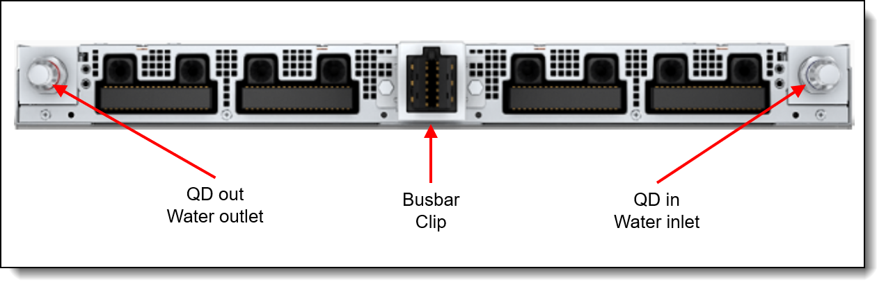

Rear of a GB300 compute tray. Lenovo labels the water outlet and inlet quick disconnects (QD) and the busbar clip. [Lenovo — GB300 NVL72 Rack Scale AI Product Guide](https://lenovopress.lenovo.com/lp2357-lenovo-nvidia-gb300-nvl72-rack-scale-ai)

### A structure sees forces, locations and combinations

Mass becomes a gravitational force through W = mg. Lenovo’s complete GB300 NVL72 rack, at about 1,580 kg, weighs 1,580 × 9.81 = 15,500 N, or about 15.5 kN, using g = 9.81 m/s². Dividing that force by a cabinet footprint produces an average pressure, but it does not describe how feet, rails, spreader plates or casters transmit force to a raised floor and structural members. The local load path matters. So do the equipment operating state, attached piping, installation loads and support configuration.

An allowable uniformly distributed floor load is therefore not automatically a permitted wheel load. A moving rack can place substantial force onto a small number of contact points or cross a panel edge. Structural interpretation belongs to the supplied engineering criteria and qualified review. The worked example below therefore gives the route its own wheel limit. That limit is enough to reject a route; approving one takes the full structural review.

Increasing rack density can reduce the number of cabinets while increasing weight, cooling connections and the demands on handling equipment. NVIDIA’s H100 deployment guidance illustrates the wider principle: rack and layout choices can change cable lengths and other domains. Treat that product configuration as one example, and ask which interfaces must be recalculated when a cabinet changes.

### Treat the route as a chain of interfaces

Follow the same physical object throughout the journey. Its shipping dimensions may differ from operating dimensions, and temporary handling fixtures may widen it. A door can be wide enough while the turn beyond it is not. A lift can have adequate total capacity while the object’s shape prevents entry. A route may cross a space controlled by a different tenant or become unavailable during another phase of construction. Each is a distinct interface, with an owner and evidence.

For a replacement plan, record the object, mass, orientation, handling assembly, clear envelope, permitted loads and any temporary changes. Then identify dependencies on live services: cable trays overhead, coolant hoses nearby, fire access and the surviving maintenance path. The value of this record is that another person can examine the actual limiting step. A reassuring statement that the route was considered gives them little to verify.

You do not need a complete professional design to discover an incompatibility. Suppose the handling assembly rolls on four wheels and the route allows 3 kN per wheel. Shared among four wheels, the rack’s 15.5 kN averages about 3.9 kN per wheel. However unevenly the wheels share the load, at least one of them carries the average or more, so at least one exceeds 3 kN and the route fails. A trolley only adds weight. A pass would need more evidence: the actual load sharing, dynamic effects and structural details. This asymmetry is useful: limited evidence can reject a configuration decisively without being enough to approve it.

Extension: a heavier rack on a trolley. A 2,000 kg rack on a trolley that brings the moving assembly to 2,200 kg weighs 2,200 × 9.81 = 21.58 kN, so even perfectly equal sharing puts 5.40 kN on each of four wheels. The trolley changes the object the route must carry, which is why the check follows the handling assembly rather than the installed rack.

### Case study: Replace a module while the rack runs

Lenovo’s GB300 NVL72 power shelf contains six 5.5 kW hot-swappable power supply unit (PSU) modules. Hot-swappable means a designated component can be replaced while the containing system remains energized and operating, subject to the supported configuration and service procedure. The remaining qualified power supplies must be able to carry the load during replacement.

A field-replaceable unit is not automatically hot-swappable. Lenovo’s compute-tray removal instructions require that tray to be powered off and disconnected before removal. Its workload must stop or move; that does not itself require shutting down every rack component. Both jobs still need physical access and an appropriate service envelope.

### Worked example: A 1,580 kg rack fails a 3 kN wheel limit whatever the load sharing

- Lenovo lists the complete GB300 NVL72 rack at approximately 1,580 kg, depending on configuration.
- The handling assembly rolls on four wheels and the route allows 3 kN per wheel; g = 9.81 m/s², with no dynamic allowance.
- Nothing is assumed about how the four wheels share the load.

1. Rack weight — 1,580 × 9.81 / 1,000 = 15.50 kN — Mass becomes force through W = mg. A trolley or handling fixture adds its own weight on top.
2. Average per wheel — 1,580 × 9.81 / 4,000 = 3.87 kN — This is what each wheel would carry if the four shared the load equally.
3. Most heavily loaded wheel — maximum ≥ average = 3.87 kN > 3 kN — However the load is shared, at least one wheel carries the average or more.

**Result:** The route fails its 3 kN wheel limit for this rack whatever the load sharing, and a trolley only adds weight. Choose a different handling arrangement or route.

**Model boundary:** The four-wheel arrangement and the 3 kN limit are exercise inputs, not Lenovo handling data or a floor rating. A route that passed would still need the actual load sharing, dynamic effects and a structural review.

### The tradeoff

Choice: Reserve a wider replacement corridor.

Benefit: Trays and lifts can reach one rack while its neighbours keep running.

Cost: The corridor takes floor that cannot hold cabinets. Eight racks occupy 7.68 m², but the example row’s service envelope is 32.76 m²; the other 25.08 m² stays clear.

### When the situation changes

Trigger: A failed component is too large for the approved exit route.

Mechanism: The electrical spare exists, but restoration depends on a physical movement the layout cannot support.

### Apply the idea

A floor specification gives an allowable uniformly distributed load, while the replacement route crosses raised-floor panels on a trolley. What is missing from the claim that the route can carry the rack? How does a tray replacement change the object being checked?

Reveal the worked answer

Obtain the relevant concentrated and rolling-load criteria, contact geometry, load sharing and structural route assessment. For tray replacement, check the tray plus its lift, service envelope, rear connections and staging route, rather than the cabinet footprint alone.

A floor-area average does not establish the load at a wheel or panel edge. Equipment dimensions establish size, while the service operation establishes the movement and contact loads. A smaller replaceable component can require a larger temporary envelope once its handling equipment and access are included.

**The idea to keep:** Check installation, operation and replacement configurations. A free square metre is not necessarily usable rack space.

### Sources

- [NVIDIA H100 SuperPOD: White Space Infrastructure](https://docs.nvidia.com/dgx-superpod/design-guides/dgx-superpod-data-center-design-h100/latest/infrastructure.html) — docs.nvidia.com · Reviewed 2026-09-06. Rack dimensions and service/layout choices interact with row arrangement and cable length.
- [NVIDIA H100 SuperPOD: Planning a Data Center Deployment](https://docs.nvidia.com/dgx-superpod/design-guides/dgx-superpod-data-center-design-h100/latest/planning.html) — docs.nvidia.com · Reviewed 2026-09-16. Changes in power density and footprint can affect network layout.
- [Leviton — Data center white space and gray space](https://leviton.com/support/literature/newsletters/insider/insideroctober2025/focusedproductoctober2025) — leviton.com · Published 2025-10 · Reviewed 2026-09-10. White space houses IT; gray space describes supporting back-of-house infrastructure.
- [Vertiv — Deploying Liquid Cooling in the Data Center](https://prod.vertiv.cn/4a9616/globalassets/documents/white-papers/liquid-cooling/vertiv-liquidcooling-wp-en-na-sl-71113-web.pdf) — prod.vertiv.cn · Published 2023 · Reviewed 2026-09-10. Cooling equipment may occupy white space or a gray-space mechanical gallery; service and replacement need room in either location.
- [Lenovo NVIDIA GB300 NVL72 Rack Scale AI Product Guide](https://lenovopress.lenovo.com/lp2357-lenovo-nvidia-gb300-nvl72-rack-scale-ai) — Lenovo Press · Published 2026-08-30 · Reviewed 2026-09-17. The named service example uses a 600 mm-wide MGX rack, 29 kg compute tray and 799 mm tray depth including water connections; Lenovo identifies suitable lift support for servicing.
- [Lenovo — GB300 NVL72 mechanical specifications](https://pubs.lenovo.com/gb300-nvl72/server_specifications_mechanical) — Lenovo · Reviewed 2026-09-12. Rack solution mass is approximately 1,580 kg, depending on configuration.
- [Lenovo — Remove a GB300 compute tray from the rack](https://pubs.lenovo.com/gb300-nvl72/remove_compute_tray) — Lenovo · Reviewed 2026-09-14. Requires compute-tray power-off and disconnection before removal; distinguishes tray service from hot-swappable PSU modules.

## A shared boundary can defeat two independent systems

**5. Physical site, buildings and safety**

Draw hazard and access boundaries around equipment and control systems, then trace an original shared-dependency scenario.

**Driving question:** How do physical access, stored energy and control permissions shape availability?

### Equipment stores more than a place on a diagram

A battery, pressurized fluid circuit, rotating machine and electrical distribution assembly present different forms of stored or supplied energy. Removing one input does not by itself establish that every relevant energy source is absent. This observation changes the questions a layout must answer: where qualified personnel need access, which adjacent services remain live, how an event is detected, and which barriers or separations belong to the approved design.

Fire, electrical and mechanical arrangements interact. A fluid route can cross electrical equipment; a battery installation can alter environmental and emergency-response requirements; a cabinet door can obstruct access that another component needs. The relevant requirements depend on the installation, equipment and jurisdiction. Identify each such interface for specialist review.

The electrical work-practice standard of the US Occupational Safety and Health Administration (OSHA) explicitly addresses stored energy and qualified work. That is evidence that equipment state cannot be reduced to a dashboard on/off label. A drawing should therefore label which work boundary is assumed and which evidence a qualified team would need before accepting it. A schematic that leaves this unspecified cannot prove maintainability.

### Control systems are part of the physical service

A facility controller can change pumps, fans, valves or operating modes. Physical access systems can determine whether an authorized person reaches equipment. These systems therefore influence a physical process even if their visible interface resembles ordinary enterprise software. Special Publication 800-82 from the US National Institute of Standards and Technology treats building automation and physical access as operational technology and emphasizes their performance, reliability and safety context. That classification explains why a generic office-network change can have unintended facilities consequences.

Draw authority as well as connectivity. Who can observe a value, alter a setpoint, change a sequence or install software? Which identity service, management switch, power supply and remote support arrangement do those actions depend on? A read-only monitoring failure differs from a control-command failure. A disconnected controller may continue its local operation, enter a predetermined mode, or become unable to satisfy the process; the actual specified behavior must be established.

Permissions are also temporal. A contractor can require access during a defined maintenance window without needing permanent authority over every tenant’s equipment. Temporary access, change approval, observation and withdrawal of authority should be visible in the operating plan. This is a conceptual governance model. It neither authorizes a person to operate equipment nor prescribes how to configure a particular security system.

### Follow one shared dependency all the way to the rack

Our synthetic facility has two cooling trains, each rated at 6 MW thermal duty under the stated condition. The IT load is 5 MW and either train can meet it. Their mechanical equipment is separate, but both supervisory controllers rely on one 300 W management switch. The drawing appears redundant if it stops at pumps; it has a shared control dependency when the switch is added. The actual consequence of losing that switch depends on the specified local fallback behavior.

For the example, assume the local controllers remain within their established operating limits for loss of supervision, but coordinated load changes are no longer authorized. Cooling may continue at the current supported state, while the ability to increase load has changed. If instead an untested shared configuration command disabled both trains, the same topology could produce service loss. Equipment duplication does not settle either question; control behavior and change scope are essential evidence.

Boundaries should be revisited after migration. A second network link may use the same upstream device; separate credentials may still allow one global write; physical access may require a shared system during an outage. A useful check asks what one action or failure can influence, which state follows, and what evidence shows that state. It avoids declaring independence merely because two labels or two icons appear on the drawing.

### Separate the routes, not only the exit doors

OSHA’s exit-route rule, 29 CFR 1910.36(b)(1) in the Code of Federal Regulations (CFR), connects practical separation of exit routes to preserving an alternative when fire or smoke blocks one. Its adjacent paragraphs address workplaces needing more routes and circumstances allowing a single route. Picture a hall with two exterior exits. If the approaches to both exits run through the same west corridor, smoke in that corridor cuts off both. If one approach runs through a separate east corridor instead, that route stays open. The exit doors are the same in both layouts; the routes leading to them decide whether an alternative survives. Actual route count, capacity, distances, separation and protective construction still need review for the workplace.

### Worked example: Count the control support load separately

- Synthetic control-support load: one 300 W switch plus two 50 W controllers.
- A stated usable direct-current (DC) energy store delivers 0.8 kWh to this load; conversion and reserve deductions are already included.
- The example calculates energy duration only; it does not establish mechanical or thermal ride-through.

1. Support power — 300 W + 2 × 50 W = 400 W = 0.4 kW — The shared switch dominates this small support budget.
2. Energy duration — 0.8 kWh / 0.4 kW = 2 h — This is an ideal constant-load duration at the declared usable-energy boundary.
3. Interpret the result — 2 h of control power ≠ 2 h of useful service — Pumps, valves, heat rejection, communications behavior and workload still have their own dependencies.

**Result:** The stated store can support the modeled control electrical load for two hours, provided its power limit and other assumptions hold.

**Model boundary:** No battery specification, fire arrangement, isolation procedure or guaranteed service duration is established.

### The tradeoff

Choice: Centralize supervisory visibility and configuration.

Benefit: One supervisory view can coordinate load changes across both cooling trains.

Cost: In the lesson’s facility, both 6 MW trains then depend on one 300 W management switch, so a single switch failure or configuration change reaches both.

### When the situation changes

Trigger: A global configuration change reaches two supposedly independent control paths.

Mechanism: Common command authority creates a correlated failure across duplicated equipment.

### Apply the idea

A separate 100 W monitoring device is added to the same usable 0.8 kWh store. What changes, and what remains unknown?

Reveal the worked answer

The ideal energy duration falls to 0.8/0.5 = 1.6 hours. Cooling or service ride-through remains unknown.

Adding 100 W increases support demand by 25 percent, so the constant-energy duration falls by 20 percent. This tells us only about the specified control-support electrical boundary. It says nothing about stored thermal capacity or whether local controllers can meet the process requirements without their shared dependencies.

**The idea to keep:** Two cooling trains are only as independent as their controls, access and maintenance. Trace every shared dependency, down to a single 300 W management switch.

### Sources

- [NIST SP 800-82 Revision 3: OT Security](https://csrc.nist.gov/pubs/sp/800/82/r3/final) — csrc.nist.gov · Published 2023-09-28 · Reviewed 2026-09-06. The abstract includes building automation and physical access within OT and identifies reliability and safety requirements.
- [OSHA 1910.333: Electrical work practices](https://www.osha.gov/laws-regs/regulations/standardnumber/1910/1910.333) — www.osha.gov · Reviewed 2026-09-06. Indexed regulatory excerpts address stored energy and qualified work.
- [OSHA — 29 CFR 1910.36(b), number and separation of exit routes](https://www.osha.gov/laws-regs/regulations/standardnumber/1910/1910.36) — U.S. Occupational Safety and Health Administration · Reviewed 2026-09-13. Section 1910.36(b)(1) links practical separation of exit routes to maintaining an alternative when fire or smoke blocks one. Paragraphs (b)(2) and (b)(3) make required route count depend on workplace conditions.

### Check your understanding: It fits until replacement day

Pause and make a prediction, then compare your reasoning.

A hypothetical equipment room has enough floor area and verified structural capacity. A required cabinet will enter before the final wall is built, but its assembled replacement cannot pass through the finished access route.

**Pause and predict:** Is the layout ready to accept? Identify the missing condition.

Compare your reasoning

No. The layout has not demonstrated a workable replacement route.

Installation, operation and replacement are different physical configurations. A cabinet footprint and acceptable floor loading do not establish how the equipment can later leave or return. The design needs a verified route or an agreed, feasible replacement method before the layout is accepted.

**The next problem:** With the physical routes established, follow the electrical route: what must each device between the campus connection and the load do?

Continue in **6. Campus and building power distribution**: Read a power train as a set of jobs.

## Read a power train as a set of jobs

**6. Campus and building power distribution**

Learn to read a generic single-line diagram by equipment function, then reconcile information technology (IT) and auxiliary demand against two independent limits.

**Driving question:** What changes, branches, and limits between the campus connection and the rack?

### Follow one line without mistaking it for one wire

A single-line diagram simplifies an electrical system so you can see its connections and major equipment. One drawn line may represent a multiphase circuit, not one physical conductor. Symbols stand for equipment whose ratings and detailed wiring live in other documents. Begin by locating the source boundary, then follow the path to the load. Read branches as separate connected loads or alternative routes, and check the legend before interpreting an unfamiliar symbol.

A transformer changes alternating-current (AC) voltage and current while transferring power, with losses. It does not by itself turn AC into direct current (DC). Switching equipment makes or interrupts connections. Protection uses measurements and defined logic to detect conditions requiring isolation, then acts through a suitable interrupting device. Metering reports quantities at a particular point. Switchgear or switchboards can package several of these functions; the enclosure name alone does not tell you the complete protection scheme.

In a generic building path, upstream service supplies transformation and distribution equipment, an uninterruptible power supply (UPS) where the selected loads require it, and downstream conductors or busway to rack connections. A busway is a distribution assembly using bus conductors rather than a loose synonym for the entire power system. A power distribution unit (PDU) distributes power to multiple loads and may include other functions in a particular product. Inspect the specified function rather than assuming every device called a PDU has the same voltage conversion or topology.

Mark the auxiliary branches. Pumps, cooling equipment, controls, and building services draw power too. Some may connect through a different continuity path from the main IT load. Their location matters both to the energy account and to the outage account. Moving them off the IT branch does not make their consumption disappear from the facility meter.

### Two limits can leave the same small margin

Consider a phase-opening scenario. The available facility service is 6.0 megawatts (MW). The IT branch can deliver 4.8 MW at its output boundary. Actual IT demand is 4.6 MW, declared upstream electrical losses are 0.2 MW, and all other facility demand is 1.0 MW. The facility input is 4.6 + 0.2 + 1.0 = 5.8 MW. There is 0.2 MW of arithmetic service headroom and 0.2 MW of IT-branch headroom, but they exist at different boundaries.

A team proposes another 0.5 MW of IT. The expansion estimate also adds 0.1 MW of auxiliaries and 0.02 MW of electrical losses. The facility requirement becomes 5.8 + 0.5 + 0.1 + 0.02 = 6.42 MW, exceeding the 6.0 MW service. The IT requirement becomes 5.1 MW, exceeding the 4.8 MW branch. Upgrading only the utility service would leave the downstream branch problem unresolved.

Now suppose the service upgrade raises the facility limit to 10 MW, while the IT branch remains unchanged. A large number at the top of the diagram does not travel through a narrower downstream interface by arithmetic permission. The 5.1 MW IT request still fails the stated branch limit. Each segment must carry the load that passes through it, and each limit must be compared with demand at the same electrical boundary.

The loss entries here are estimates for this scenario, not a constant-loss model valid at every load. A real extension requires an appropriate efficiency and thermal account for its operating point. The example's purpose is to prevent double counting and reveal separate constraints, not to select conductors or equipment from a few real-power totals.

### Read the diagram in a changed operating state

Return to the initial 4.6 MW IT state, but let a hot-weather scenario raise auxiliary demand from 1.0 to 1.4 MW while the 0.2 MW loss estimate stays fixed. Facility input becomes 6.2 MW, exceeding the original 6.0 MW service even though the IT branch still carries only 4.6 MW. A rack-level limit has not changed, yet the wider system can no longer support the same combination of loads within its stated capacity.

This is why a static picture needs an operating condition. A normal-state line can disappear after a fault; an alternate supply can have a different rating; a cooling branch can demand more power in another climate condition. Annotate the chosen state before tracing what survives. A closed loop in the drawing is not evidence that every connection can be closed simultaneously, and an open switching symbol is not a field instruction.

Centralized infrastructure can simplify shared equipment and measurement, but it can also create a dependency serving many downstream loads. Splitting equipment can limit the affected group while adding interfaces and coordination work. You cannot choose between these layouts by counting boxes. Identify the service each box supports, the common elements still present, and the failure or maintenance condition being tested.

A good reading exercise ends with questions, not just labels. Which load does this meter include? Which component changes voltage? Which device can interrupt this circuit under the specified conditions? Where does the cooling pump obtain power? Which upstream limit still binds after a downstream upgrade? Answering those questions makes unfamiliar diagrams readable without pretending that a simplified course drawing is a complete engineered installation.

### Compass: co-design one electrical package

Siemens and Compass jointly developed a custom prefabricated medium-voltage skid that combines switchgear and a transformer. Siemens supplies the factory-built package; Compass is the data-center customer, not a Siemens catalog family. Sharing a package means agreeing the interfaces between the two jobs: voltage and current, protection and physical connections.

The two functions stay distinct inside one package: switchgear makes and protects connections, while the transformer changes AC voltage. The factory photograph below shows the switchgear portion; the transformer is out of view. The engineering, procurement and construction (EPC) chapter returns to the same package for manufacturing strategy, site work, transport, ownership and release evidence.

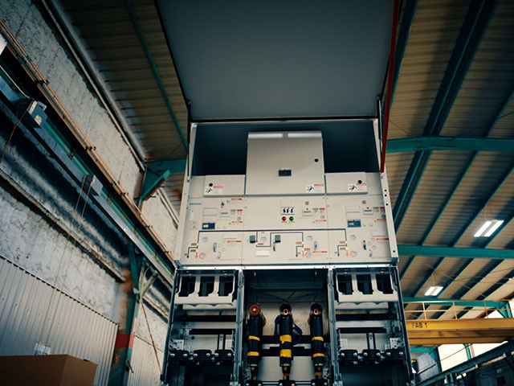

Switchgear portion of the jointly developed Compass skid, in the factory. The transformer is out of view. [Siemens, Compass Datacenters case study](https://www.siemens.com/en-us/company/insights/compass-datacenters-case-study/)

### Fujitsu: put flexible circuits beside the load

A Starline case study, first published in December 2018, describes an extension to a Fujitsu-managed 3.2 MW data center north of London. Existing racks used cables under a raised floor. The extension adopted 250 A Track Busway overhead so the floor remained available for cooling, with wired or wireless metering options at tap-offs. The electrical consequence is a shared bus with local branch connections. A new branch can be easier to place without creating additional current capacity in the end feed.

### Count current toward the end feed

Take a separate row example with balanced 415 V line-to-line AC, power factor one, and a 250 A usable current budget at the end feed. Three 40 kW racks demand about 167 A at the end feed; four demand 223 A. Each branch remains about 56 A. After each tap, a downstream bus segment carries only the loads beyond it. A fifth rack raises the end-feed current to about 278 A, over the budget. These currents are not Fujitsu operating measurements or a conductor-sizing result.

### Trace the path through both transformer stages

Take a reference network with 345 kV at the campus grid connection, 34.5 kV across campus distribution and a 480 V building bus. IT and cooling branch from that bus; the future hall has a separate open medium-voltage feeder. Every load traces back through each upstream stage.

Two parts of this network deserve a closer look: the medium-voltage switchgear, and the 480 V AC connection from the hall transformer into the building bus. The next sections take each in turn.

The high-voltage reference follows Abilene’s expansion: Mortenson distinguishes the initial 200 MW / 138 kV connection from the later 1 gigawatt (GW) / 345 kV expansion and reports all five expansion transformers energized by March 10, 2026. The Longhorn review drawing filed with the Texas Commission on Environmental Quality (TCEQ) separately labels an underground Lancium 34.5 kV feed. That December 4, 2024 drawing is marked not for construction. Together these sources support the reference voltages used here, not a complete as-built 345/34.5 kV ratio for every campus transformer. The hall-level 480 V bus belongs to the reference network rather than to these sources. 34.5 kV is one nominal medium-voltage (MV) level, not the definition of the entire MV range.

### Inside the switchgear: sensing, decision and interruption

Siemens’s sectional drawing of one NXAirS panel, from catalog HA 1702, page 12, shows how the parts are arranged; it appears below. The withdrawable circuit breaker fills the middle of the panel, and the brown upright pole just right of the central frame houses a vacuum interrupter. The busbars sit in their own compartment at upper left, under a yellow pressure-relief duct, and the low-voltage controls sit in a cabinet at upper right. The cable terminations at lower left and the earthing switch beside them are different components. This product family is rated up to 12 kV and is separate from the 34.5 kV campus example and the Compass 8DJH 36 skid.

A breaker-based feeder assembly separates the power path from its control path. The bus and breaker conduct feeder current. A current transformer supplies a scaled measurement to a protection relay. If the protection criteria are met, the relay commands the breaker to trip. Contacts and an interrupting chamber must then stop the power current. A recorded trip command therefore does not prove successful interruption: continuing fault current can trigger breaker-failure or other backup protection and enlarge the interrupted area. Actual switching devices, sensors and protection arrangements vary by design.

Section through one Siemens NXAirS circuit-breaker panel, rated up to 12 kV. The catalog’s numbered callouts are not part of this image. [Siemens, NXAirS catalog HA 1702, page 12](https://cache.industry.siemens.com/dl/files/485/109972485/att_1290488/v1/1702_NXAirS_12kV_Catalogue_EN_final.pdf#page=12)

### CT and CVT: measuring current and voltage

The current transformer (CT) surrounds or forms part of the phase-current path. Its secondary supplies a scaled current signal to the relay. This is measurement, not delivery of the feeder’s load power to the relay. A voltage transformer (VT) supplies a scaled voltage measurement; MV switchgear can use inductive VTs or voltage sensors.

At a high-voltage connection, a capacitor voltage transformer (CVT) uses a capacitive divider and an electromagnetic unit to obtain the voltage signal. It connects from phase to earth, in parallel with the power circuit. Hitachi Energy’s CPB family, for example, covers 72–800 kV, a range that includes this network’s 345 kV connection.

Here the CT provides current and the CVT provides voltage, and the relay uses the measurements its protection function needs. An overcurrent trip uses CT current alone and needs no CVT. Other functions use voltage as well. The relay sends a separate trip signal to the breaker, whose interrupter must stop the power current. Chapter 7 develops fault zones, grounding and AC/DC interruption; detailed protection settings, instrument-transformer saturation and transient response need their own engineering studies.

### Disconnector, breaker and surge arrester are different functions

An air-insulated disconnector provides an isolating air gap and is not assigned fault-current interruption. A switch-disconnector or breaker-disconnector combines functions only when its ratings provide them. A metal-oxide surge arrester instead responds to overvoltage: its nonlinear resistance falls, allowing surge current to be diverted and limiting insulation stress. It is commonly connected from phase to earth. A surge arrester is not an alternate power source or an isolating switch. Chapter 7 builds on these three jobs when it examines fault zones and alternate supply paths.

### Read N, PE and 480Y/277 before following a branch

In 480Y/277 V notation, Y identifies a wye-connected system: 480 V root-mean-square (RMS) is measured between phases, while 277 V RMS is measured from one phase to neutral. N means neutral; PE means protective earth. Neutral can carry return current for phase-to-neutral loads. Protective earth connects exposed conductive parts into the protective arrangement, rather than being another phase. A single-line diagram compresses the multiphase circuit into a readable path; it is not a count of physical wires.

Draw one switchboard-to-rack-PDU circuit twice: once as a single line, and once as its physical conductors, three phases plus neutral and protective earth. Five conductors belong to this example, not every AC circuit. The phase-to-phase voltage is the phase-to-neutral voltage multiplied by √3, so 480Y/277 V is consistent; a 400 V wye system would instead be approximately 400Y/230 V.

### A real transformer operating range is separate from taps

Schneider Electric’s Phaseo ABL6TS25B is a 250 volt-ampere (VA) controls transformer. Its datasheet specifies 360–440 V input on the nominal 400 V connection, or 207–253 V on the 230 V connection, with a 47–63 Hz frequency range. Its secondary is rated 24 V AC; that is not a promise of regulated output throughout the input range. The separate ±15 V compensation taps and dielectric test voltage are not the input-voltage limits. These published limits apply to this controls-scale product, not automatically to a medium-voltage hall transformer.

### Transformer taps change the connected turns

A fixed-ratio transformer passes a source-voltage change through to its output. Hammond Power Solutions illustrates 480 V across 80 primary turns and 120 V across 20 secondary turns. With those same turns connected, 504 V at the primary gives 126 V at the secondary. A 504 V tap connects 84 primary turns; the same 20 secondary turns then receive 120 V. The tap changes the ratio by choosing how much of the winding is connected. These are configured connections, not an automatic voltage regulator. The selected equipment determines the allowed connections and procedures.

### Where conversion placement comes next

This chapter follows normal AC distribution through switchgear, building branches and row busway, with the transformer taps along the way. Chapter 7 develops continuity and fault response. Where rectification happens, including solid-state transformers and the move to 800 V DC, is the subject of “Moving a converter moves an interface”, the last lesson of this chapter, and of Chapter 9, which includes the historical Green Zurich-West 380 V DC case. Conventional building auxiliaries can still require AC when compatible IT is supplied with DC.

### A PDU name does not specify a transformation ratio

A floor PDU distributes branches and may include an isolation/step-down transformer, metering and protection. A rack PDU distributes an existing supply to outlets. A power supply unit (PSU) converts AC to the DC needed by its load. Their voltages vary by product: Schneider’s Galaxy PDU, rated 1,000 kilovolt-amperes (kVA), accepts 480 V three-phase and supplies 400 or 415 V, according to its May 2026 product article.

### When backup protection widens the interruption

Hall A and Hall B share an incoming breaker and bus, with one outgoing feeder breaker per hall. A fault occurs on Hall A’s feeder. The relay issues a trip, but that feeder breaker fails to interrupt. Upstream backup protection must then clear the fault: opening the incoming breaker removes the continuing fault current and also disconnects Hall B, despite no local fault there. A separate healthy feeder does not create an independent upstream supply. Chapter 7 continues from this shared dependency to UPS systems, alternate paths and the cooling loads needed to preserve service.

### Worked example: Opening a phase with two electrical constraints

- Service and IT-branch limits are usable real-power limits given for this scenario.
- Auxiliaries exclude IT, and electrical losses are separately given estimates.

1. Existing facility demand — 4.6 + 0.2 + 1.0 = 5.8 MW — IT, losses, and auxiliaries are distinct categories.
2. Proposed facility demand — 5.8 + 0.5 + 0.1 + 0.02 = 6.42 MW — Account for the support load and added loss as well as new IT.
3. Service exceedance — 6.42 − 6.0 = 0.42 MW — The requested combination exceeds the upstream limit.
4. IT-branch exceedance — 4.6 + 0.5 − 4.8 = 0.30 MW — The downstream branch also fails, independently of the service upgrade.

**Result:** The extension requires resolving both service and IT-branch constraints.

**Model boundary:** These MW limits are not transformer kVA ratings or an equipment-sizing prescription.

### When the situation changes

Trigger: Upgrade only the 6 MW service to 10 MW.

Mechanism: The 4.8 MW downstream branch still cannot deliver the proposed 5.1 MW IT demand.

Response: Trace the complete path and resolve each binding interface.

### Apply the idea

At the original IT demand, auxiliaries rise to 1.4 MW. What limit fails first in the stated ledger?

Reveal the worked answer

The service limit fails: 4.6 + 0.2 + 1.4 = 6.2 MW exceeds 6.0 MW.

The IT branch remains below 4.8 MW. The increased support load matters at the wider facility boundary.

**The idea to keep:** A power train is a connected set of interfaces and constraints, not a list of equipment names.

### Sources

- [DOE — Best Practices Guide for Energy-Efficient Data Center Design](https://www.energy.gov/sites/default/files/2024-07/best-practice-guide-data-center-design_0.pdf) — www.energy.gov · Published 2024-07 · Reviewed 2026-09-06. A data-center distribution path contains several electrical functions and auxiliary loads.
- [Commissioning & Performance Validation | AI Data Center Energy Performance Framework](https://www.ashrae.org/technical-resources/ai-data-center-framework/commissioning-performance-validation) — ASHRAE · Reviewed 2026-09-06. Phased infrastructure acceptance must preserve the scope of what was tested and handed over.
- [Siemens — Compass Datacenters integrated MV skid](https://www.siemens.com/en-us/company/insights/compass-datacenters-case-study/) — Siemens · Reviewed 2026-09-15. Siemens and Compass’s integrated medium-voltage switchgear and transformer skid, with a factory photograph.
- [Siemens and Compass sign modular electrical solution agreement](https://press.siemens.com/global/en/pressrelease/siemens-and-compass-datacenters-sign-multi-year-custom-electrical-solution-agreement) — Siemens · Published 2024-12-04 · Reviewed 2026-09-17. Partnership and integrated electrical functions.
- [Fujitsu selects Starline Track Busway for data centre expansion](https://starlinepower.com/sites/default/files/files/starline_busway_fujitsu-case-study_US.pdf) — Starline / Legrand · Published 2018-12 · Reviewed 2026-09-13. Fujitsu expansion problem and chosen overhead busway.
- [Schneider Electric — Phaseo ABL6TS25B product datasheet](https://iportal.se.com/Contents/docs/SQD-ABL6TS25B_DATASHEET.PDF) — Schneider Electric · Published 2020-02-26 · Reviewed 2026-09-13. A named 250 VA controls transformer specifies 360–440 V input limits for its nominal 400 V connection, 207–253 V for its 230 V connection, and 47–63 Hz network frequency limits. The secondary rating is 24 V AC.
- [Schneider Electric — Elementary switching devices](https://www.electrical-installation.org/enwiki/Elementary_switching_devices) — Schneider Electric · Reviewed 2026-09-13. Plain disconnector isolation versus switching/interrupting capability; combined devices have separately rated duties.
- [Siemens — Vacuum Switching Technology and Components](https://support.industry.siemens.com/cs/attachments/109745538/HG11.01_EN_20190603.pdf) — Siemens · Reviewed 2026-09-13. Metal-oxide surge arresters become conductive during overvoltage and divert surge current, commonly phase to earth.
- [Siemens — SIPROTEC 7SD610 circuit breaker failure protection](https://support.industry.siemens.com/cs/attachments/109743409/7SD610_Manual_A8_V044100_en.pdf) — Siemens · Reviewed 2026-09-13. A feeder protection relay issues a trip; persistent fault current after the command can require backup interruption by other breakers.
- [PDHonline — Standard AC System Voltages (600 V and Less), course E427](https://www.pdhonline.com/courses/e427/e427content.pdf) — PDH Online (David A. Snyder, PE) · Reviewed 2026-09-26. 480Y/277 gives the wye phase-to-phase voltage followed by the phase-to-neutral voltage.
- [Siemens — NXAirS medium-voltage switchgear HA 1702 sectional illustration](https://cache.industry.siemens.com/dl/files/485/109972485/att_1290488/v1/1702_NXAirS_12kV_Catalogue_EN_final.pdf) — Siemens · Published 2024 · Reviewed 2026-09-26. Page 12 shows an NXAirS circuit-breaker panel in section and names its busbar, switching-device, connection and low-voltage compartments, vacuum interrupters, current transformer, cable connection and earthing switch.
- [Schneider Electric — Galaxy PDU 1000 kVA distribution voltages](https://blog.se.com/datacenter/2026/05/18/solving-densification-power-distribution-metering-high-performance-computing/) — Schneider Electric · Published 2026-05-18 · Reviewed 2026-09-14. Floor-PDU output voltage is product-specific: Galaxy 1000 kVA uses 480 V input and 400 or 415 V output.
- [Hammond Power Solutions — How Taps Work](https://americas.hammondpowersolutions.com/news/2014/april/how-taps-work) — Hammond Power Solutions · Published 2014-04-02 · Reviewed 2026-09-14. 480:120 V turns example and 504 V primary tap using 84 primary turns rather than 80.
- [Abilene Data Center Development](https://www.mortenson.com/projects/abilene-data-center-development) — Mortenson · Reviewed 2026-09-14. Original 200 MW / 138 kV grid connection and later 1 GW / 345 kV expansion; five expansion transformers energized by March 10, 2026.
- [Longhorn power plant review drawing — Lancium 34.5 kV feed](https://www.tceq.texas.gov/assets/public/permitting/air/reports/applications/37589-tc.pdf) — Abilene DC 1 / Campos, filed with TCEQ · Reviewed 2026-09-14. Project-specific 34.5 kV campus-feed reference.
- [Hitachi Energy — CPB capacitor voltage transformer, 72–800 kV](https://www.hitachienergy.com/products-and-solutions/instrument-transformers/voltage-transformers/cpb-72-800-kv) — Hitachi Energy · Reviewed 2026-09-14. HV capacitor voltage transformer, phase-to-ground measurement for protection and metering.
- [ABB — Protection criteria for medium voltage networks](https://library.e.abb.com/public/76afab5a1dd44f438409aa65c990ed8b/AP_Protection%20criteria%20MV(EN)C-_1VCP000280-01.2017.pdf) — ABB · Published 2017 · Reviewed 2026-09-26. CT/VT scaling and separation of measurement, relay decision and power-current interruption.

## Kilowatts do not fill a kilovolt-ampere nameplate

**6. Campus and building power distribution**

Relate real power, power factor, and apparent power to a kVA rating, then work backward from a converter’s DC output, preserving every denominator.

**Driving question:** How do efficiency and power factor change upstream equipment loading?

### Real power, apparent power and a kVA rating

Use the electrical foundations from “Move power with fewer amperes”: RMS values describe effective AC magnitudes; 480 V line-to-line is measured between phases, and √3 connects that voltage convention to total balanced three-phase power. The earlier resistive examples used power factor one. Here the power factor drops below one, and a transformer’s kilovolt-ampere rating becomes the limit to check.

An AC boundary has a second power quantity: apparent power, expressed in kilovolt-amperes (kVA) or megavolt-amperes (MVA). It combines voltage and current magnitudes in the stated system. Power factor (PF) is real power divided by apparent power, so apparent power is real power divided by PF. The difference between kVA and kW is not itself a real-power heat term. However, the associated higher current can increase actual conductor and equipment losses, which require their own accounting.

For balanced three-phase conditions, current is apparent power divided by √3 times the line-to-line RMS voltage. Keep the unit conversion explicit: kVA multiplied by one thousand gives VA. In this lesson the voltage is 480 V line-to-line. The numerical exercise assumes the specified balanced conditions and a given total power factor. It does not infer power factor from an arbitrary phase-angle measurement of a distorted load.

Hold real AC input at 900 kW and balanced three-phase voltage at 480 V line-to-line, behind a transformer with a usable rating of 1,000 kVA. At PF 1, apparent power is 900 kVA and line current is 900,000/(√3 × 480) ≈ 1,083 A, 90 percent of the rating. At PF 0.9 the same 900 kW needs 1,000 kVA, exactly the rating. At PF 0.8 it needs 1,125 kVA and about 1,353 A, 112.5 percent of the rating. Real power is the average power delivered to the load, including its losses. Power factor is the ratio of real to apparent power; conversion efficiency is a different ratio. Because 900 kW and 1,000 kVA measure different things, the smaller number does not rescue the PF 0.8 case. In the lab below, conversion efficiency starts at 1, so the 900 kW is also the real input and PF 0.8 gives 1,125 kVA and 1,353 A; set efficiency to 0.96 and PF to 0.90 for the converter extension.

### The power triangle and the glass of beer

Reactive power describes cyclic energy exchange with electric and magnetic fields. For sinusoidal voltage and current, the three quantities form the power triangle: real power and reactive power are perpendicular sides and apparent power is the hypotenuse, so S² = P² + Q². At 900 kW and PF 0.8, the magnitude of reactive power is 675 kilovolt-amperes reactive (kvar), alongside 1,125 kVA of apparent power. It is not the arithmetic difference between kVA and kW. With distorted waveforms, P and true PF alone do not determine Q.

A glass of beer is a common memory cue for the three quantities. The beer is real power in kW, the average rate at which energy is actually delivered. The foam is reactive power in kvar. The whole glass is apparent power in kVA, and the glass is what the transformer and cables must be sized to hold. The picture fails if the heights are added: 900 kW of beer and 675 kvar of foam need a 1,125 kVA glass, not a 1,575 kVA one, because the two parts combine at right angles.

### Extension: start from a converter’s DC output

A rack-side converter must deliver 900 kW of DC output. That is a different boundary from the 900 kW of real AC input above: conversion has losses, so the AC side supplies more than 900 kW. Define conversion efficiency as output real power divided by input real power. At an assumed 96 percent efficiency, every 0.96 units delivered require one unit at the converter input. To recover the input requirement, divide the output by 0.96. Multiplying by 0.96 would move in the wrong direction and suggest that losses create power.

Begin with 900 kW output and efficiency 0.96. Input real power is 900/0.96 = 937.5 kW. The converter dissipates 37.5 kW at this operating point, found by subtracting output from input. That heat belongs wherever the converter sits. Moving it to another room changes the local cooling account, while its electrical input/output difference remains part of the facility balance.

Next divide 937.5 kW by a power factor of 0.90. Apparent power is approximately 1,041.7 kVA. At 480 V, current is 1,041,667/(√3 × 480), approximately 1,253 A, about 104.2 percent of the same 1,000 kVA rating. At PF 0.90 the 900 kW of real input above exactly filled that rating; the converter’s 37.5 kW of loss pushes this case over it. The fact that 937.5 kW is less than 1,000 does not rescue it; those numbers have different units and describe different constraints.

If the power factor improves to 0.99 while output and efficiency remain unchanged, apparent power becomes about 947.0 kVA. The arithmetic screen now fits beneath 1,000 kVA. Real input power is still 937.5 kW and converter heat is still 37.5 kW in the stated model. This isolates the distinction between reducing a current/apparent-power burden and reducing conversion loss.

The screen is necessary but not sufficient. Equipment limits also depend on operating temperature, load waveform, installation, voltage conditions, and the rating's defined duty. Harmonic currents can matter to heating and equipment performance. An aggregate average can conceal unequal phase loading. The short calculation identifies a plainly inconsistent proposal; it does not substitute for the additional studies needed to endorse a real installation.

### Do not multiply allowances without naming them

Suppose the planning policy reserves twenty percent of a 1.2 MVA usable rating. The remaining apparent-power budget is 1.2 × 0.80 = 0.96 MVA. At PF 0.90 that supports 0.864 MW real input. At efficiency 0.96 it supports 0.82944 MW, or 829.44 kW, of the defined DC output. Each factor applies to a different question: reservation, AC power factor, and conversion efficiency. Combining them is valid only because their boundaries and meanings have been stated.

A reserve policy is not automatically a physical derating, and a physical derating is not automatically redundancy. Derating changes the applicable equipment capability under a condition. Reservation holds some otherwise usable capability for a purpose such as uncertainty or expansion. Redundancy asks what remains available after a selected element is unavailable. Treating all three as one unexplained safety factor makes it impossible to tell whether capacity has been counted twice or not at all.

There is a tradeoff between a larger equipment rating and tighter control of the workload envelope. More rated capacity can create room for growth and operating variation, but may increase cost, footprint, and low-load losses. Tighter limits can use existing equipment efficiently but constrain the accepted workload or require enforceable power management. Neither choice can be assessed from an average utilization percentage alone.

Finally, keep the quantities visible on your diagram. Write 900 kW DC at the output, 937.5 kW real and 1,041.7 kVA at the input, and 1,253 A next to the specified 480 V circuit. The labels show why each number exists. If a subsequent lesson changes the converter, voltage, or power factor, you can update the affected terms without rebuilding the entire explanation from vague notions of electrical capacity.

### Place the high-current route deliberately

Take a balanced 2 MW load at power factor one, fed over a 450 m campus route followed by a 20 m hall route. At 34.5 kV, line current is about 33.5 A; at 480 V it is about 2,406 A, excluding losses for this current comparison. Moving the transformer beside the hall keeps the long route at medium voltage. This changes cable and equipment requirements; actual loss requires the resistance and operating conditions of the selected conductors.

### Check phases and heat before treating a rating as usable

A 380 A average can mean three 380 A phases or a 460/350/330 A allocation. With a 400 A per-conductor usable limit, the unequal case exceeds the phase-A limit. The simple average hides that constraint. For a separate balanced conductor example with resistance fixed at 0.020 ohm per phase, loss is 3 I²R: 2.4 kW at 200 A and 9.6 kW at 400 A. Actual temperature also depends on ambient conditions and enclosure. Harmonic current can increase RMS burden and transformer losses, so the waveform belongs in the thermal assessment.

### Equal phase voltages do not enforce equal phase currents

Equinix’s rack installation guidelines explicitly ask for balanced connections across the three phases of a rack PDU. Take six single-phase PSU groups that each draw 20 A at 277 V phase-to-neutral. Two groups on each phase give 40/40/40 A; a four/one/one assignment gives 80/20/20 A. The total load stays fixed but L1 exceeds a 60 A phase limit. A balanced electromagnetic source does not automatically reassign connected loads. Neutral current depends on the vector sum and waveform content; nonlinear load harmonics require a separate check.

### Worked example: 900 kW of real input behind a 1,000 kVA rating

- Real AC input is 900 kW at both power factors.
- The input is balanced three-phase at 480 V line-to-line RMS.
- The transformer’s usable rating is 1,000 kVA.

1. Apparent power at PF 1 — 900 / 1.0 = 900 kVA — Apparent power is real power divided by power factor.
2. Line current at PF 1 — 900,000 / (√3 × 480) ≈ 1,083 A — Use VA and line-to-line volts to obtain amperes.
3. Apparent power at PF 0.8 — 900 / 0.8 = 1,125 kVA — The same real power needs more apparent power.
4. Line current at PF 0.8 — 1,125,000 / (√3 × 480) ≈ 1,353 A — Current rises in step with apparent power.
5. Rating screen — 900 / 1,000 = 90%; 1,125 / 1,000 = 112.5% — The rating fits at PF 1 and is exceeded at PF 0.8.

**Result:** The same 900 kW passes the 1,000 kVA screen at PF 1 and fails it at PF 0.8, where reactive power is 675 kvar.

**Model boundary:** No converter efficiency is applied. Cable, breaker, transformer thermal, harmonic, and installation checks are separate.

### When the situation changes

Trigger: Compare 900 kW of real input directly with a 1,000 kVA rating.

Mechanism: The comparison ignores the stated power factor and therefore understates apparent-power loading.

Response: Convert quantities at matching boundaries before comparing with a rating.

### Apply the idea

At what power factor does the same 900 kW of real input exactly fill the 1,000 kVA rating, and what line current flows then at 480 V?

Reveal the worked answer

At PF 0.9, with about 1,203 A per line.

900 kW divided by 1,000 kVA is 0.9. Then 1,000,000 VA divided by √3 × 480 V gives about 1,203 A. Any lower power factor pushes the same load past the rating.

**The idea to keep:** Output power, input real power, apparent power, and current are different quantities that must be reconciled at their own boundaries.

### Sources

- [Schneider Electric — Installed apparent power](https://www.electrical-installation.org/enwiki/Installed_apparent_power_(kVA)) — www.electrical-installation.org · Reviewed 2026-09-06. The public guide relates output power, efficiency, power factor, apparent power, and balanced three-phase current.
- [Schneider Electric — Choice of transformer rating](https://www.electrical-installation.org/enwiki/Choice_of_transformer_rating) — www.electrical-installation.org · Reviewed 2026-09-06. Transformer rating selection considers apparent-power loading and installation constraints.
- [Schneider Electric — Effects of harmonics: increased losses](https://www.electrical-installation.org/enwiki/Effects_of_harmonics_-_Increased_losses) — Schneider Electric · Reviewed 2026-09-13. Harmonic currents increase heating and transformer losses.
- [Equinix — Customer Installation Guidelines, phase balancing](https://web.archive.org/web/20250708155531/https://docs.equinix.com/assets/files/Customer-Installation-Guidelines-EN-5d94e7d67671467cab7d7c9877ef5229.pdf) — Equinix · Published 2024 · Reviewed 2026-09-26. Rack PDU load allocation should balance connections across all three phases; figure 14 compares balanced and unbalanced racks.
- [Schneider · Definition of power factor](https://www.electrical-installation.org/enwiki/Definition_of_Power_Factor) — Schneider Electric · Reviewed 2026-09-14. Defines real power, apparent power and power factor PF = P/S, independently of conversion efficiency.
- [Schneider Electric — Definition of reactive power](https://www.electrical-installation.org/enwiki/Definition_of_reactive_power) — Schneider Electric · Reviewed 2026-09-14. Sinusoidal power triangle and balanced three-phase P, Q and S relationships.

## Moving a converter moves an interface

**6. Campus and building power distribution**

Compare two complete paths at the same delivered boundary, allocate their losses, and test how centralization changes failure and expansion exposure.

**Driving question:** How should centralized and distributed conversion be compared fairly?

### Compare functions before naming the winning architecture

Electrical power changes form and voltage at several places between a utility connection and a processor. A transformer changes AC voltage. A rectifier converts AC to DC. An inverter converts DC to AC. A DC converter changes a DC voltage level. Actual products can package these functions together with controls, storage interfaces, and protection. Counting the boxes in a simplified drawing can therefore conceal what conversion really occurs.

In a distributed arrangement, conversion may sit near each load or rack. In a centralized arrangement, a larger conversion stage may serve several downstream loads. Those labels describe placement and grouping, not an automatic efficiency ranking. The important comparison is which conductors carry which voltage and waveform, where conversion losses occur, what protection and storage interfaces change, and which equipment is shared. Chapter 9 develops specific 800 V DC proposals; here we set out how to judge a comparison.

Choose a common endpoint. If one architecture is measured at the rack AC inlet and another at a downstream DC bus, their reported input powers are not directly comparable. Draw both paths from the same upstream boundary to the same useful electrical output. Include every different stage between them. Any unchanged stages beyond the endpoint can be excluded only if the exclusion is stated consistently for both alternatives.

### A DC/DC converter can contain a transformer, but it is not one

A transformer transfers energy through a changing magnetic field. It does not take steady DC on its own and continuously deliver a different DC voltage. A DC/DC converter is the complete circuit that changes DC voltage or regulates a DC output.

A non-isolated buck converter lowers voltage using a controlled switch, an inductor and filtering capacitors; it needs no transformer. In an isolated DC/DC converter, switches turn the DC input into a changing waveform, a transformer transfers energy and provides isolation, and rectification plus filtering produces the DC output. The transformer is one component inside that converter.

UPS designs differ at the battery interface: some connect batteries directly to the DC link, while others use a controlled converter. Neither arrangement justifies an assumption of zero internal transient or a universal battery-start delay.

### Why step down before rectifying?

A conventional transformer has conductive windings around a magnetic core, commonly laminated steel. Alternating current creates changing magnetic flux; the changing flux induces voltage in another winding. Electronic switching and a permanent magnet are not required for that function. Some transformers cool by natural convection; larger designs may add fans. Cooling equipment is distinct from the core-and-windings mechanism.

A conventional route is medium-voltage AC → isolation and step-down transformer → controlled AC/DC converter → 800 V DC. The transformer reduces the voltage seen by the electronics and supplies isolation. The controlled converter sets the required DC output; a plain rectifier alone does not turn 13.8 kV AC into an isolated 800 V bus.

This is a semiconductor and system-design tradeoff. A compact direct-MV converter needs devices that withstand higher voltage or multiple switches/cells that share it, with added isolation, control and protection demands. Commercial availability of higher-voltage silicon carbide (SiC) devices can reduce that complexity. SemiAnalysis itself acknowledges conventional MV rectification using series-stacked silicon devices, so its point about device scarcity is not a universal 10 kV system limit.

Rectifying at medium voltage is possible. The design must manage device blocking voltage, AC peaks, transients, insulation and voltage sharing. Cascaded converter cells can divide the input voltage, so each semiconductor need not withstand the full system voltage. A solid-state transformer (SST) combines electronic conversion with an internal high-frequency isolation transformer. It is one way to build the interface; 800 V DC distribution also works with conventional transformers and rectifiers.

Keep the units and product claim precise: 10 kV = 10,000 V. Wolfspeed announced a commercially available 10 kV SiC power metal-oxide-semiconductor field-effect transistor (MOSFET) in March 2026. That is a device-category announcement, not a ceiling on rectifiable system voltage. A 2022 ETH/Delta/Paderborn study already described a 13.2 kV cascaded SST using 1,200 V devices.

The conventional path uses mature transformer and low-voltage power-electronic technologies. Direct medium-voltage conversion for 800 V data centers is a developing alternative, not an unavailable one. In September 2026, Eaton listed a 2 MW medium-voltage solid-state transformer (MVSST) with 12.47 kV nominal input and 800 V DC output. A product offering does not show widespread deployment, delivery time or universal economic superiority.

### Read the architecture drawings from the same boundaries

In the first drawing, compare which AC conversion and distribution functions are grouped into the future 800 V DC interface. The single “medium voltage rectifier or solid-state transformer” block is a system abstraction: voltage reduction, isolation, controls and protection still need an implementation. The drawing’s “Today” and “Future” are the publisher’s conceptual alternatives, not a claim that all facilities follow either path.

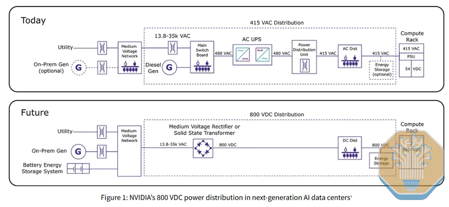

NVIDIA architecture comparison, reproduced as Figure 1 in Wolfspeed’s March 2026 paper. The 480 V and 415 V labels belong to this example; storage and conversion details are condensed. [Wolfspeed, Figure 1, PDF page 3](https://assets.wolfspeed.com/uploads/2026/03/Wolfspeed_Powering_AI_with_reliable_SiC-based_solid-state_transformers_white_paper.pdf)

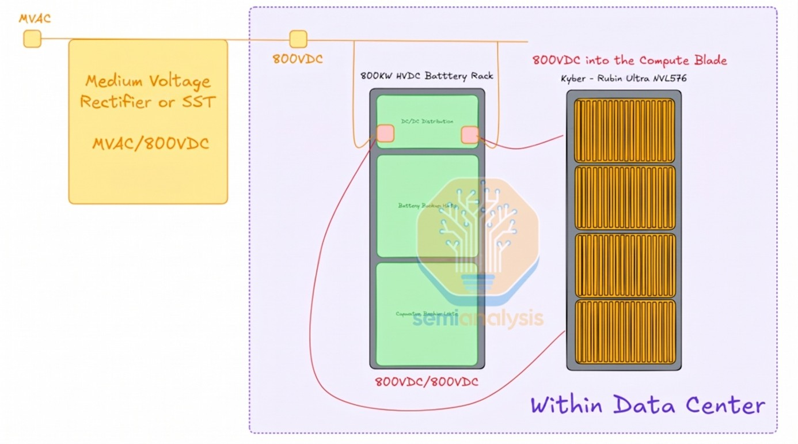

SemiAnalysis battery-rack concept. Upstream rectification does not remove downstream energy storage or distribution. The 800 kW and Kyber/Rubin Ultra labels are source-specific proposal labels, not validated course equipment ratings. “DC/DC distribution” here does not imply a voltage step-down. [SemiAnalysis — Inside the 800VDC Revolution, Part 1](https://newsletter.semianalysis.com/p/inside-the-800vdc-revolution-part)

### A complete two-stage loss calculation

Take a scenario delivering 1 MW at the same rack-side DC boundary. Path A distributes AC with an assumed 98 percent path efficiency, then converts near the rack at 96 percent efficiency. Work backward from the 1 MW output. The rack converter needs 1/0.96 = 1.041667 MW input. The upstream AC distribution needs 1.041667/0.98 = 1.062925 MW. Total modeled loss is therefore approximately 62.925 kW.

Allocate that loss to its location. The near-rack converter dissipates 41.667 kW. The preceding distribution dissipates about 21.259 kW. Together they match the source-to-output difference, allowing for rounding. If a drawing moves the converter outside the rack boundary, the rack's apparent heat burden falls by the relocated amount, but the facility still has to supply and reject that loss unless the converter's actual performance changes.

Path B converts centrally at an assumed 97.5 percent efficiency and then distributes DC with an assumed 99 percent efficiency to the same endpoint. The downstream distribution requires 1/0.99 = 1.010101 MW input. The central converter requires 1.010101/0.975 = 1.036001 MW. Total modeled loss is about 36.001 kW: 10.101 kW in the distribution and 25.900 kW in the central converter. Under these assumptions, Path B needs approximately 26.924 kW less source power.

This is an arithmetic result for two specified models, not evidence that DC universally saves that percentage. The efficiencies are hypothetical operating-point values, including only the stated stages. Different loading, voltage, conductor resistance, standby requirements, or equipment could reverse the outcome. Indeed, if Path B's conversion efficiency were 94 percent instead of 97.5 percent, its source requirement would rise to about 1.074575 MW, exceeding Path A.

### An efficient path must also fit the service

Centralization can remove equipment from individual racks or simplify a shared conversion interface. It can also put more loads behind a common component. If a shared converter is unavailable, which loads retain an independent compatible path? Does the replacement route have enough usable output, and do the connected loads tolerate the transition? A more efficient normal-state diagram is not automatically a better continuity design.

Distributed conversion can support incremental growth because conversion capacity can be added close to a new load group. It can also multiply maintenance points and impose packaging or service-access constraints near racks. Central equipment may be purchased before the full load arrives, so its partial-load and standby behavior matter during early phases. Compare the actual anticipated operating points, rather than assigning one full-load efficiency to every year of the campus plan.

A brownfield migration adds another constraint: equipment already installed has interfaces and limits. A new downstream architecture may retain the existing upstream transformer, service, or feeder. That retained equipment can continue to bind even if a conversion stage becomes smaller. Ask which components are reused, which are replaced, and which must temporarily coexist during migration. A lower eventual loss does not remove the need for a compatible transition plan.

Finish the comparison with a table of interfaces and a balanced loss ledger. Each path should identify its input and output type, voltage boundaries, losses, shared dependencies, and supported maintenance/failure states. Mark uncertain efficiency values as uncertain. That combination lets you ask whether a proposed change is worthwhile under the actual service brief, instead of being persuaded by a shorter line of boxes or a striking rack photograph.

### Zurich-West: centralized DC required compatible loads

ABB and Green opened the Zurich-West DC expansion in May 2012. A 1 MW DC system served the 1,100 square metre extension, using DC-capable HP servers and storage. It is a historical built case of changing the downstream supply interface.

ABB Review’s technical account identifies 16 kV AC at the input and a 1,100 kVA dry transformer inside the central rectifier package. Rectifier modules perform AC/DC conversion after the transformer changes voltage. Figure 2 labels the downstream supply 380 V DC; the text specifies 400 V open-circuit. Preserve that operating-condition distinction. The example shows actual conversion placement, without adopting ABB’s promotional percentage savings as a general comparison.

### Worked example: Two routes to the same 1 MW DC output

- All efficiencies are hypothetical values at the compared operating point.
- Path A: AC distribution 0.98, then near-rack conversion 0.96.
- Path B: central conversion 0.975, then DC distribution 0.99.

1. Path A input — 1 / (0.98 × 0.96) = 1.062925 MW — Overall efficiency is the product because output from one stage becomes input to the next.
2. Path A total loss — 1.062925 − 1 = 0.062925 MW — The common 1 MW output is subtracted once.
3. Path B input — 1 / (0.975 × 0.99) = 1.036001 MW — Work backward through both included stages.
4. Difference — 1.062925 − 1.036001 = 0.026924 MW — The stated models differ by approximately 26.9 kW of source input.

**Result:** Path B wins this specified operating-point calculation; neither the placement label nor DC alone decides the result.

**Model boundary:** Unchanged downstream silicon conversion and unspecified auxiliaries are outside both paths; real equipment curves and topology must be checked separately.

### When the situation changes

Trigger: Compare one architecture at an AC inlet with another at a downstream DC output.

Mechanism: Different included conversions make the reported powers incomparable.

Response: Redraw both from a common source boundary to a common delivered endpoint.

### Apply the idea

If Path B conversion efficiency falls to 0.94 while distribution remains 0.99, which path uses less source power?

Reveal the worked answer

Path A: 1.062925 MW versus Path B: 1/(0.94 × 0.99) = 1.074575 MW.

The altered assumption reverses the ranking. Path B now needs about 11.65 kW more input than Path A for the same output.

**The idea to keep:** Compare complete paths under matching conditions; moving a loss outside the rack does not eliminate it.

### Sources

- [DOE — Best Practices Guide for Energy-Efficient Data Center Design](https://www.energy.gov/sites/default/files/2024-07/best-practice-guide-data-center-design_0.pdf) — www.energy.gov · Published 2024-07 · Reviewed 2026-09-06. Conversion stages and distribution placement affect electrical losses and operating efficiency.
- [Schneider Electric — Choice of transformer rating](https://www.electrical-installation.org/enwiki/Choice_of_transformer_rating) — www.electrical-installation.org · Reviewed 2026-09-06. Initial and future loading and installation conditions matter to upstream equipment selection.
- [Wolfspeed — Powering AI with reliable SiC-based solid-state transformers](https://assets.wolfspeed.com/uploads/2026/03/Wolfspeed_Powering_AI_with_reliable_SiC-based_solid-state_transformers_white_paper.pdf) — Wolfspeed · Published 2026-03-06 · Reviewed 2026-09-26. Reproduces NVIDIA’s comparison of AC distribution with 800 V DC distribution as Figure 1 and describes SiC-based solid-state transformers; states that its 10 kV SiC MOSFET operates above 10,000 Hz, while 6,500 V silicon IGBTs are generally limited to a few hundred hertz.
- [Texas Instruments — TIDA-011012 modular solid-state transformer reference design](https://www.ti.com/tool/TIDA-011012) — Texas Instruments · Published 2026-06-04 · Reviewed 2026-09-16. Explains how input-series converter submodules divide medium-voltage stress across lower-voltage semiconductor devices.
- [Huber et al. — Comparative Evaluation of MVAC–LVDC SST and Hybrid Transformer Concepts for Future Datacenters (IPEC 2022)](https://www.ams-publications.ee.ethz.ch/uploads/tx_ethpublications/1_IPEC_2022_Final_Huber.pdf) — ETH Zurich, Delta Electronics and Paderborn University · Published 2022-05 · Reviewed 2026-09-10. Compares transformer-plus-rectifier and solid-state transformer (SST) architectures for 800 V DC, including a 13.2 kV cascaded design built from 1,200 V devices.
- [Wolfspeed — Introduction of a commercially available 10 kV SiC power MOSFET](https://www.wolfspeed.com/company/news-events/news/wolfspeed-introduces-industrys-first-commercially-available-10000v-silicon-carbide-power-mosfet/) — Wolfspeed · Published 2026-03-05 · Reviewed 2026-09-10. Announces a commercially available 10 kV silicon carbide (SiC) power MOSFET, on March 5, 2026.
- [Inside the 800VDC Revolution – Part 1](https://newsletter.semianalysis.com/p/inside-the-800vdc-revolution-part) — SemiAnalysis · Published 2026-05-26 · Reviewed 2026-09-11. Proposes 800 V DC architectures with upstream medium-voltage rectification and a separate battery rack for storage and distribution.
- [Texas Instruments — Basic Calculation of a Buck Converter’s Power Stage](https://www.ti.com/lit/an/slva477b/slva477b.pdf) — Texas Instruments · Published 2011-12 · Reviewed 2026-09-11. Figure 1 shows a buck converter made from switching, inductance and capacitance without a transformer.
- [Texas Instruments — TIDA-00349 isolated DC/DC converter](https://www.ti.com/tool/TIDA-00349) — Texas Instruments · Reviewed 2026-09-11. Shows an isolated DC/DC converter built from a primary half-bridge, a transformer and secondary rectification.
- [Hitachi Energy — Core-type transformers](https://www.hitachienergy.com/products-and-solutions/transformers/power-transformers/generator-step-up-transformers-gsu/core-type-transformers) — Hitachi Energy · Reviewed 2026-09-11. Transformer anatomy uses conductive windings and a laminated magnetic steel core.
- [Schneider Electric — AA and AA/FA transformer cooling](https://www.se.com/ca/en/faqs/FA102583/) — Schneider Electric · Reviewed 2026-09-11. Natural air convection and added fan cooling are distinct transformer cooling arrangements; fans are not inherent to the transformer function.
- [Eaton — Medium-voltage solid-state transformer](https://www.eaton.com/us/en-us/catalog/medium-voltage-power-distribution-control-systems/medium-voltage-solid-state-transformer.html) — Eaton · Reviewed 2026-09-16. Eaton lists a 2 MW MVSST with 12.47 kV nominal input and 800 V DC output, demonstrating a direct-MV product offering.
- [ABB Review 4/2013 — DC for efficiency](https://library.e.abb.com/public/1afa6036874fd0bb85257d5000710a17/DC%20for%20efficiency.pdf) — ABB · Published 2013 · Reviewed 2026-09-13. Case transformer, rectifier and DC distribution interfaces.
- [ABB and Green open Zurich-West DC data-center expansion](https://new.abb.com/news/detail/12816/worlds-most-powerful-dc-data-center-online) — ABB · Published 2012-05-30 · Reviewed 2026-09-13. Opening date, installation scale and compatible HP IT.

### Check your understanding: Which rating stops the load?

Pause and make a prediction, then compare your reasoning.

At a hypothetical AC interface, a load needs 900 kW at power factor 0.9. The upstream transformer is rated 1,000 kVA, while a downstream device at the same voltage is limited to 950 kVA. Ignore losses and other constraints for this screen.

**Pause and predict:** Does this path pass the stated capacity screen? Show the comparison.

Compare your reasoning

No. The load requires 900 / 0.9 = 1,000 kVA, exceeding the downstream 950 kVA limit.

The transformer reaches its stated rating, but every element of the path must carry the load. Comparing 900 kW directly with a kVA rating would hide the constraint. Passing this arithmetic screen would still leave installation and operating conditions to verify.

**The next problem:** A path that carries normal demand is only the start. What happens when supply is interrupted or equipment is unavailable?

Continue in **7. Continuity, storage and protection**: Battery power, stored energy and runtime.

## Battery power, stored energy and runtime

**7. Continuity, storage and protection**

Calculate output energy using one declared usable-energy window, screen discharge power separately, and distinguish an uninterruptible power supply (UPS) role from a generic storage inventory.

**Driving question:** Can the stored energy reach the load at the required rate?

### Separate the energy inventory from the delivery path

A storage system needs both an energy inventory and a way to deliver that energy. The inventory determines how much can be supplied over time. The power-conversion path determines how quickly it can be supplied under the stated conditions. Two systems with the same megawatt-hours (MWh) can therefore support entirely different loads. A large reservoir behind a narrow outlet is a useful analogy only for this distinction; actual batteries and converters have electrical, thermal, control, and protection limits that the analogy does not capture.

Runtime begins by defining usable energy at a particular boundary. A nameplate may describe a stored-energy quantity under stated test conditions. The available energy at the start of an event depends on the actual state, operating limits, aging, temperature, and reserved inventory. Conversion then changes how much reaches the load. If the given energy figure is already usable output energy, do not apply the same discharge loss again. The calculation must identify which losses are inside its input.

A UPS is a continuity architecture, not merely a synonym for a battery. Public vendor descriptions distinguish protected-load UPS behavior from conventional site-level storage used for energy management. The differences include connection, controls, response, and purpose. Storage that can discharge for an hour is not thereby proven to provide no-break support to a sensitive load. Conversely, a short-duration UPS may be excellent at its intended bridging job without solving a multi-hour energy shortage.

### The UPS and its external batteries

Schneider’s Easy UPS 3-Phase Modular family includes 50–250 kW external-battery models in black and white finishes. The common cabinet is 1,991 mm high, 600 mm wide and 850 mm deep. Its power modules, bypass, control electronics and battery interface belong to the UPS; the main battery inventory is in external cabinets. DC means direct current. A rack battery backup unit (BBU) supplies a local DC power plane; it is distinct from facility UPS batteries. The DC/DC interface is a controlled conversion stage, not simply a cable connector.

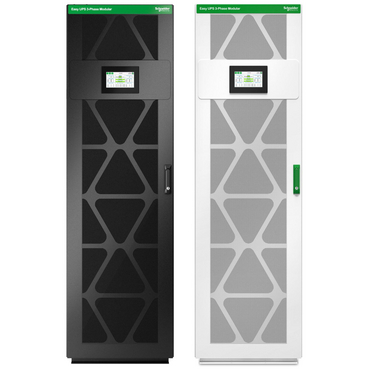

Easy UPS 3-Phase Modular in its two finishes. The photograph does not identify the model or the fitted modules. [Schneider Electric, Easy UPS 3-Phase Modular model list](https://productinfo.se.com/easyups3pmodular/viewer?docidentity=ModelList-1A71D03C&extension=xml&lang=en&manualidentity=TechnicalSpecificationsEasyUPS3-Pha-BC29F805)

### Zero transfer time still needs a fast energy buffer

An online UPS in double-conversion mode already supplies the load through its inverter. Losing the rectifier input does not require switching the load onto a newly started inverter. Zero transfer time describes that output continuity, not instantaneous internal current changes. The battery interface may be a direct DC connection or a controlled DC/DC converter, depending on the equipment; an isolated DC/DC converter may contain a high-frequency transformer.

DC-link capacitors remain useful in online operation. They supply and absorb rapid current differences, smooth switching ripple and support bus voltage while the rectifier or battery path responds. Batteries sustain the longer energy demand. Offline or line-interactive transfer gaps are another reason for load-side hold-up, not the only reason capacitors exist. Capacitors in the UPS DC link and capacitors on a separate rack DC bus occupy different boundaries.

Follow one UPS DC link through an outage. The link runs at 800 V with an effective 0.20 farad (F) of capacitance across it, and the inverter draws a constant 1 megawatt (MW) from it. Capacitance relates plate charge to voltage: Q = C × V. Here Q is charge measured in coulombs, C is capacitance measured in farads, and V is voltage. One farad means one coulomb per volt. The 0.20 F link capacitance at 800 V therefore holds a charge magnitude of 0.20 × 800 = 160 coulombs on each plate, with opposite signs. This is a stored state. Current I measures charge passing per second; P = I × V describes the rate of energy transfer. It cannot replace the capacitance equation.

For fixed capacitance, adding equal amounts of charge raises voltage by equal amounts. Charging from zero to 800 V therefore gives an average of 400 V over the charge added. Each volt is one joule per coulomb: 160 coulombs × 400 V = 64,000 joules stored. Equivalently, the voltage-versus-charge plot has a triangular area E = Q × (V/2). Substituting Q = C × V gives E = (C × V) × (V/2) = ½CV². No calculus is needed. The average is taken over charge increments, not over an arbitrary charging time. Stored energy is not necessarily the total energy consumed by the charging circuit.

Now remove the rectifier’s AC input. Let the inverter stay regulated down to a 700 V shutdown threshold, and at first let no other source contribute. Usable energy is ½ × 0.20 × (800² − 700²) = 15,000 J. Hold-up is 15,000 J / 1,000,000 W = 0.015 s, or 15 ms. At 700 V the bank still stores 49,000 J; that energy is below the permitted operating range.

This 15 ms is capacitor-only hold-up, not a UPS transfer time. The load is defined at the DC link, so do not count the inverter’s losses twice; if instead 1 MW were the inverter’s AC output, link power would include those losses. Once a battery or other source contributes, capacitor energy supplies only the remaining power deficit. The area between the load-power and source-power curves measures the energy supplied by the capacitor. The ideal calculation ignores capacitance variation, equivalent series resistance (ESR), wiring resistance and inductance; those affect actual voltage excursions and usable hold-up.

Now allow the battery contribution into that same link to rise linearly from zero to 1 MW during the first 10 ms. This assumed ramp starts at time zero; it does not wait for the 15 ms capacitor-only limit. The battery supplies 5 kJ and the capacitor supplies the other 5 kJ during those 10 ms. The capacitor deficit is the area of a triangle: ½ × 1 MW × 0.010 s = 5 kJ. Link voltage reaches √(800² − 2 × 5,000/0.20) = 768.1 V, above the 700 V cutoff.

From 10 ms onward the battery supplies the full 1 MW, so capacitor energy stops falling in this ideal model. The DC link remains at 768.1 V until a source returns the missing 5 kJ. The next section closes the energy account.

### Restore the DC link, then recharge the battery

Matching the load arrests the DC-link voltage decline. Restoring its setpoint requires replacing the capacitor energy already released. A regulated battery DC/DC interface can increase delivered current before the generator is ready. Once acceptable alternating current (AC) is available, the rectifier can regulate the link instead. Battery terminal voltage and link voltage need not be equal; directly connected battery architectures behave differently.

Write the energy account first. The missing energy is E_missing = ½C(V_target² − V_initial²). With constant source and load power at the same DC link, surplus power is P_extra = P_source − P_load, so recovery time t = E_missing / P_extra when P_extra is positive. Joules divided by watts gives seconds. Equivalently, choosing a recovery time requires P_source = P_load + E_missing/t. A source that only matches the load provides no surplus for recovery.

Continue from 768.1 V with 5 kJ missing and a constant 1 MW load. At 1.05 MW source output, the 50 kW surplus replaces 5 kJ in 100 ms. At 1.10 MW, the 100 kW surplus restores the same energy in 50 ms. Supplying only 1.00 MW leaves no recharge power. The voltage controller reduces output to the load requirement at 800 V. These times describe recovery after surplus power is available, independently of generator startup.

The voltage curve follows the same account: V(t) = √(V_initial² + 2P_extra t/C) until it reaches the target. For the unrounded initial state, stored energy rises from 59 kJ to 64 kJ. Constant surplus power therefore raises energy linearly while voltage follows a square-root curve. These curves assume constant capacitance and neglect losses; 768.1 V is rounded. The recovery clock starts when the stated surplus is available, not at the generator-start command.

Recharging the UPS battery is a separate energy account from restoring the DC-link capacitors. Generator and rectifier capacity must cover the load, allowed battery charging and losses. When Schneider’s Easy UPS detects a generator supply, it can be configured to disable or enable battery charging. The generator may therefore carry the load alone, or the load plus battery recharge.

### Apply one usable-energy window, then conversion loss

Consider two storage systems. Each begins with a stated 1.0 MWh energy inventory. The scenario permits an 80 percent usable operating window: 1.0 × 0.80 = 0.80 MWh before the specified output conversion loss. This one window already excludes the unavailable 20 percent. Do not subtract that same unavailable slice again as a separate reserve. Any additional reserve would need a distinct purpose and an explicitly stated accounting boundary; none is added here.

Assume event discharge conversion is 95 percent efficient. Deliverable energy at the protected-load boundary is 1.0 × 0.80 × 0.95 = 0.76 MWh. A constant 6 MW protected load uses that in 0.76/6 hours, or 0.76/6 × 60 = 7.6 minutes. MWh divided by MW leaves hours. This is an energy estimate under the given assumptions, not a guaranteed product runtime.

System A can deliver 8 MW at the stated output boundary. It passes the 6 MW power screen, so the energy calculation is relevant. System B can deliver only 4 MW. It cannot support the full 6 MW load even though its energy inventory is identical. Calling System B a 7.6-minute solution would confuse stored energy with deliverable service. Its shortfall begins immediately in the simplified steady power screen.

Now add 0.3 MW of cooling and control auxiliaries to the protected scope. Total protected demand becomes 6.3 MW. System A still passes the power screen, but runtime falls to 0.76/6.3 × 60 = 7.238 minutes, approximately 7.24 minutes. System B still fails. Preserving servers while omitting the equipment needed to keep them usable can produce a misleading continuity claim.

### Reserve policy has an opportunity cost

A usable-energy window can reflect operating limits and reserved inventory. State what it includes before allocating energy to another purpose. Retaining a separate reserve can support another event, uncertainty or a service obligation, but it reduces the energy available now. The 80 percent window in this example is applied once; neither its excluded 20 percent nor the 5 percent conversion loss is deducted twice.

Load shape also matters. For a changing protected demand, calculate energy interval by interval and check the power limit at every relevant interval. A short higher-power phase can fail the power screen while barely changing total energy. A lower sustained phase can fit the converter but exhaust the inventory. Neither the maximum MW nor the total MWh alone describes both problems.

A successful transfer to another supply ends the battery's bridging interval only if the other supply has actually become acceptable to the protected system. Generator start, stabilization, load acceptance, transfer behavior, and auxiliary restoration are system events with their own evidence. No generic runtime formula supplies those timings. Use an explicit timeline and compare the required output energy through that interval with the available energy.

Finally, do not claim complete recovery when the load merely returns to its normal source. The store may be depleted and require recharge before it can support a second event. Recharging competes for electrical capacity and may have its own rate limit. A continuity promise therefore needs the starting state, the supported event, and the restored readiness condition. The next lesson follows that event across electricity and cooling rather than stopping at the battery icon.

### Case study: solar and second-life batteries in Sparks

The solar example is Crusoe and Redwood Materials at Sparks, Nevada. Redwood’s 2 April 2026 introduction to Redwood Energy and Crusoe’s May 2026 impact-report summary specify 12 MW of solar and 63 MWh of repurposed electric-vehicle (EV) battery capacity. These quantities describe generation capability and stored energy. Neither is a statement of current information technology (IT) demand, total-site nameplate load or battery discharge power.

A host-published interview dated 27 July 2025 attributes a 1 MW initial deployment to Forrest Carroll, who worked in Crusoe Energy & Infrastructure Development. This is a dated participant account of the pilot’s scale. The transcript does not specify whether 1 MW is IT power or total facility load, and it is not an equipment nameplate. Later expansion announcements report no measured load to divide by.

Crusoe’s March 2026 update reports 99.2% microgrid availability over seven months and 99.9% Cloud availability using grid backup. Pause: does that mean 99.2% of electricity came from solar? No. Availability measures time meeting a service definition; solar share measures energy from a source. An hourly supply ledger is needed to answer the latter. The grid-backup disclosure also prevents describing this operating account as entirely off-grid. These are historical company-reported operating figures, not a September 2026 measurement interval or a current service guarantee. The May 2026 impact report repeats the case without giving a new measurement period.

### Compare stored energy with the reported 1 MW pilot

Use the historical reported pilot scale for an explicitly ideal comparison: 63 MWh / 1 MW = 63 hours, or 2.625 days. This is a gross energy-to-reported-load ratio, not measured or guaranteed autonomy. It assumes the whole stated inventory reaches a constant 1 MW load and that the delivery path can supply it. The 12 MW solar nameplate is not the load denominator.

Actual runtime requires usable delivered battery energy divided by the total battery-fed load, with a separate output-power check. Starting state of charge, operating window, reserves, conversion losses, auxiliaries and concurrent generation matter. If the reported 1 MW describes IT alone, cooling and electrical overhead increase the battery-fed demand. The sources cited here give no IT load, full-site load or battery discharge power for the expanded installation, so the 1 MW pilot ratio cannot describe it.

### Worked example: Same MWh, different deliverable service

- Starting stated inventory is 1.0 MWh for both systems.
- One 80% usable-energy window is followed by 95% output conversion; no additional reserve is deducted.
- Protected real load is constant at 6 MW.

1. Operating-window energy — 1.0 × 0.80 = 0.80 MWh — Apply the declared usable window once; its excluded slice is already unavailable.
2. Usable load energy — 0.80 × 0.95 = 0.76 MWh — Apply the specified conversion loss once at the protected-load boundary.
3. Power screen — A: 8 MW ≥ 6 MW; B: 4 MW < 6 MW — Only System A can support the stated full load.
4. Energy-limited duration for A — 0.76 / 6 × 60 = 7.6 minutes — The estimate applies after the power screen passes.

**Result:** System A has a 7.6-minute scenario energy budget; System B fails the full-load power requirement.

**Model boundary:** The example supplies the usable window and conversion efficiency. It does not infer battery chemistry behavior, output ratings at other conditions or no-break transfer performance.

### When the situation changes

Trigger: Use an MWh label to claim support for a load above the converter output rating.

Mechanism: The required delivery rate exceeds the available path even before energy is exhausted.

Response: Check the output MW limit and the complete protected scope before calculating runtime.

### Apply the idea

System A must support 6.3 MW including auxiliaries. How long does 0.76 MWh of usable output last?

Reveal the worked answer

About 7.24 minutes.

0.76/6.3 hours multiplied by 60 gives 7.2381 minutes. Do not apply the 80 percent window or 95 percent conversion efficiency again.

**The idea to keep:** Check deliverable power first; divide only the appropriately defined usable energy by the complete protected load.

### Sources

- [EIA — Measuring electricity](https://www.eia.gov/energyexplained/electricity/measuring-electricity.php) — www.eia.gov · Reviewed 2026-09-06. Runtime follows energy divided by power when a constant output load is specified.
- [Vertiv — BESS and UPS roles in large data center power architecture](https://www.vertiv.com/en-us/insights/articles/white-papers/bess-and-ups-roles-in-large-data-center-power-architecture/) — www.vertiv.com · Reviewed 2026-09-06. UPS and conventional behind-the-meter storage have different typical architecture roles.
- [Eaton — DC-link capacitor modules](https://www.eaton.com/gb/en-gb/products/electronic-components/topics/dc-link-modules.html) — Eaton · Reviewed 2026-09-11. DC-link capacitors sit between rectifier and inverter, stabilizing bus voltage, smoothing ripple and supporting rapid load transitions.
- [Eaton — Choosing the optimal UPS topology](https://www.eaton.com/us/en-us/products/backup-power-ups-surge-it-power-distribution/backup-power-ups/choosing-the-optimal-ups-topology-.html) — Eaton · Reviewed 2026-09-11. In online double-conversion operation the inverter supplies the load continuously, giving zero output transfer time, unlike standby and line-interactive designs.
- [Crusoe and Redwood — Sparks microgrid update](https://www.crusoe.ai/resources/newsroom/crusoe-and-redwood-materials-expand-strategic-partnership-scaling-to-7x-the-original-ai-infrastructure-density) — Crusoe · Published 2026-03-24 · Reviewed 2026-09-12. The Sparks, Nevada microgrid combines solar, storage and grid backup; the March 2026 release reports 99.2% microgrid availability over seven months separately from 99.9% Crusoe Cloud availability.
- [Crusoe — 2025 impact report web summary](https://www.crusoe.ai/resources/blog/crusoes-2025-impact-report) — Crusoe · Published 2026-05-28 · Reviewed 2026-09-12. Names 12 MW of solar and 63 MWh of repurposed EV battery capacity for the Redwood project; describes original Abilene phase as greenfield.
- [Crusoe 2025 Impact Report](https://media.ffycdn.net/us/crusoe/PL5TuZz5apXB9pVsd3H1.pdf) — Crusoe · Published 2026-05-28 · Reviewed 2026-09-26. Page 33 repeats the Sparks solar, storage and availability case.
- [Schneider Electric — Easy UPS 3-Phase Modular: Configure the Input Contacts](https://productinfo.se.com/easyups3pmodular/990-6537-easy-ups-3-phase-modular-50-250-kw-operation/English/990-6537%20Operation%20Easy%20UPS%203-Phase%20Modular%2050-250%20kW_0001015104.xml/%24/GalaxyPX_ConfiguretheInputContacts_0000761997) — Schneider Electric · Reviewed 2026-09-12. The detected-genset function can set battery charge power to 0% or 100%. Generator-supplied battery charging is configurable; it is not necessarily enabled in every installation.
- [Eaton — 93E UPS Generation 3 installation and operation manual, 164000301 Rev. 04](https://www.eaton.com/content/dam/eaton/products/backup-power-ups-surge-it-power-distribution/backup-power-ups/eaton-93e-ups/eaton-93e-ups-20kva-30kva-generation-3-manual-p-164000301.pdf) — Eaton · Reviewed 2026-09-12. Printed pages 56–59 describe regulated rectifier output and a buck/boost battery converter. When acceptable AC returns, the rectifier resumes supplying the inverter and the battery can recharge.
- [Redwood Materials — Redwood and Crusoe expand compute to 7x scale](https://www.redwoodmaterials.com/news/redwood-and-crusoe-expand-compute-to-7x-scale/) — Redwood Materials · Published 2026-03-24 · Reviewed 2026-09-13. Announces a sevenfold expansion of Crusoe’s computing at Sparks, with an aerial photograph of the battery and modular data-center deployment.
- [Schneider Electric — Easy UPS 3-Phase Modular model list](https://productinfo.se.com/easyups3pmodular/viewer?docidentity=ModelList-1A71D03C&extension=xml&lang=en&manualidentity=TechnicalSpecificationsEasyUPS3-Pha-BC29F805) — Schneider Electric · Reviewed 2026-09-13. Named 50–250 kW external-battery models and black/white finish options.
- [Schneider Electric — Easy UPS 3-Phase Modular physical specifications](https://productinfo.se.com/easyups3pmodular/990-91580-technical-specifications-easy-ups-3-phase-modular/English/990-91580%20Technical%20Specifications%20Easy%20UPS%203-Phase%20Modular50-250%20kW%20UPS_0001011916.xml/%24/PhysicalREF_0000019941) — Schneider Electric · Reviewed 2026-09-26. Cabinet dimensions of the Easy UPS 3-Phase Modular: 1,991 mm high, 600 mm wide and 850 mm deep.
- [Redwood Materials — Introduction to Redwood Energy](https://www.redwoodmaterials.com/resources/unlocking-affordable-energy-storage-at-scale-an-introduction-to-redwood-energy/) — Redwood Materials · Published 2026-04-02 · Reviewed 2026-09-15. Its Proven at Scale case gives a 12 MW solar array and 63 MWh of repurposed batteries at the Nevada campus.
- [OpenStax — Energy Stored in Capacitors](https://openstax.org/books/college-physics-2e/pages/19-7-energy-stored-in-capacitors) — OpenStax, Rice University · Published 2022-07-13 · Reviewed 2026-09-14. Derives stored capacitor energy from the average voltage over the added charge and Q = CV.
- [Luca Pedretti — From Electrons to Intelligence: How Crusoe Powers AI with Modular, 24/7 Energy](https://lucapedretti850786.substack.com/p/c0b) — Luca Pedretti / The Pexapark Podcast · Published 2025-07-27 · Reviewed 2026-09-15. Host-published interview attributes a 1 MW initial Sparks deployment to Crusoe participant Forrest Carroll.
- [Pexapark — Podcast catalogue, Episode 19 with Forrest Carroll of Crusoe](https://pexapark.com/podcast/) — Pexapark · Published 2025-07-24 · Reviewed 2026-09-15. Lists Episode 19, with Forrest Carroll of Crusoe, dated 24 July 2025.

## Continuity belongs to the complete service

**7. Continuity, storage and protection**

Follow a given electrical and thermal restoration timeline, calculate its energy requirement, and test redundancy under a second unavailable component.

**Driving question:** Which loads remain usable during an interruption, transfer, and maintenance event?

### Follow one timeline across electrical and thermal paths

Begin with a protected system drawing 5 MW for IT, 0.4 MW for circulation pumps, and 0.1 MW for controls. Its total uninterruptible power supply (UPS) output is 5.5 MW. The outdoor heat-rejection plant is on a separately described supply path. At time zero, utility power becomes unavailable. The scenario states that the UPS maintains its connected loads, the generator is ready at 30 seconds, and acceptable generator power reaches the UPS input and outdoor plant at 45 seconds.

The electrical bridge therefore lasts 45 seconds. At 5.5 MW it requires 5.5 × 45/3,600 = 0.06875 MWh, or 68.75 kWh, of usable UPS output energy. If the store has 120 kWh available at that boundary and adequate output power, it passes this energy screen. The claimed continuity still depends on the given transfer behavior actually being valid for the hardware and loads; the arithmetic does not manufacture that behavior.

The thermal timeline continues. Suppose the plant sequence reaches adequate heat rejection only at 90 seconds. Pumps and controls remained powered, but that alone does not prove sufficient heat removal during the interval. Heat may be stored in coolant, equipment, and other material; thermal capacity and temperature margins need their own model. We can identify a 90-second interval requiring thermal evidence without inventing how long the IT can remain within its temperature limits.

After power returns, include restoration and recharge. A store that spent 68.75 kWh cannot immediately promise its original 120 kWh reserve for another event. A successful first transfer and a ready-for-next-event state are different milestones. The system's operating policy must define when full support is again available and what restrictions apply in between.

### Count the capacity that survives the selected event

Now study redundancy separately from the timeline. Redundancy notation counts installed modules against N, the number the load needs. Take a 100 kW protected load and UPS modules that each deliver 50 kW, so N is two modules. N+1 installs three, 150 kW in all: one module can be unavailable and 100 kW remains.

Take one module of that N+1 system out for planned maintenance. The two remaining modules still provide 100 kW. If another module then fails, only 50 kW remains, half the load. N+1 covers one unavailable module, and maintenance plus a failure is two. N+2 installs four modules and covers exactly that pair of events, because two healthy modules still supply 100 kW. In these single-path arrangements every spare shares the same output bus, so a failed common bus stops all of them together. The event being tested must state what is already unavailable, what subsequently fails and what output is required.

2N builds two complete paths, A and B, each with two modules, so either path alone can carry the whole 100 kW. Isolate path A for maintenance and then fail a module on path B, and only 50 kW remains: the load is no longer fully supported. 2(N+1) puts three modules on each path, so with path A isolated and one B module failed, path B still delivers 100 kW. The extra module on each path is what keeps a failure survivable during maintenance.

A second complete path gives a full-capacity alternative route, and its independence is a separate question. If both paths require the same upstream bus, fuel support, control system, or sole cooling interface, that shared dependency may defeat the intended service. Two colors and two power cords cannot prove two independent complete systems.

The load interface matters too. A dual-input device must be able to maintain the required output under the specified surviving-feed condition and transition. Some arrangements share demand across inputs; capacity in normal operation is not automatically the capacity available after one input is lost. The system must demonstrate compatible behavior at the actual required load, not merely show that two connectors exist.

A/B power supply unit (PSU) groups each rated to support a 100 kW load do not force 200 kW into that load. They may share the 100 kW in normal operation; either surviving group must have enough capacity to carry it after the other path is lost. The redundancy comparison counts available capacity, while actual consumption follows the load and conversion losses.

N depends on the load it is counted against. If demand grows from 100 to 150 kW, N becomes three modules, and the three modules installed as N+1 are now exactly N. Growth has consumed the spare without any change to the equipment, so every redundancy label needs its current load written beside it.

### Capacity, maintainability, and fault response answer different questions

Capacity asks whether the remaining equipment can carry the load. Maintainability asks whether selected equipment can be removed from service for planned work while the promised service continues. Fault tolerance asks what happens when a defined unplanned event occurs. These questions overlap but are not identical. A path may have spare capacity but no compatible route around equipment being maintained. A system may tolerate a planned transition while responding differently to an abrupt fault.

Uptime's public Tier descriptions distinguish maintainability and fault-tolerance requirements and include electrical and cooling behavior. A certification claim requires the applicable criteria and assessment of the actual infrastructure. The useful transferable skill is to remove a specified element on paper, trace valid routes, and state which additional evidence is needed before asserting continuity.

There is an economic and operating tradeoff in greater path separation. Additional independent equipment can reduce exposure to a common failure and improve maintenance options, but adds cost, footprint, interfaces, and maintenance obligations. If both nominally independent paths share a neglected dependency, that extra investment may not buy the intended behavior. Spend analytical effort on the complete dependency graph before counting the spare modules.

Return to the 45-second electrical bridge and 90-second thermal interval. Passing the UPS energy screen answers one question. Passing the surviving-module capacity screen answers another. Neither proves that cooling is continuously adequate or that a second event is supported before recharge. A strong continuity explanation keeps these answers separate and then combines only the conclusions that the evidence actually supports.

### What each Uptime Tier adds

Uptime Institute tiers describe what the site infrastructure can withstand. Tier I supplies basic power and cooling. Tier II adds spare capacity components. Tier III permits planned maintenance of equipment and distribution paths while IT remains operating. Tier IV adds tolerance of an unplanned infrastructure fault, including continuous cooling. Tier IV has the most demanding infrastructure requirements in this four-level system; the appropriate investment depends on the service the facility must support.

All four Uptime Tiers include an engine generator for extended utility outages. Tier I already includes this backup source, and higher tiers retain it while adding redundancy and fault protection. For Tier III and IV, the generator plant must support critical load without runtime limits in its applicable capacity rating. Fuel supply and operating permissions still limit endurance; the rating does not require the generator to run continuously. This is a requirement of the Uptime classification, not a claim that every data center follows that classification.

Component counts such as N+1 or 2N do not decide a Tier. The complete design and its response to events matter. Tier III proves planned maintenance can occur without shutting down IT; it does not make Tier IV's additional promise about unplanned faults. Neither certification assigns an annual downtime percentage. Uptime removed expected-downtime assignments in 2009.

### Three, four and five nines in published examples

A number of nines needs a named boundary and evidence type. An operator may report a service result, publish a design capability, or promise a service level agreement (SLA). These are useful examples to compare, but they are not a league table of measured site reliability.

**Three nines — Crusoe Spark, Sparks, Nevada.** Crusoe's March 2026 update says its Cloud maintains 99.9% availability using the grid as backup at the Redwood Materials deployment. The microgrid itself reported 99.2% over seven months. Grid backup helps separate the power source's availability from the Cloud service's availability. The release does not give a separate observation window for the 99.9% Cloud figure.

**Four nines — Microsoft Fairwater Atlanta.** In November 2025, Microsoft described this graphics processing unit (GPU) power design as capable of 99.99% availability at the cost of a three-nines design. This is a design claim tied to highly available utility power; Microsoft did not publish a year of measured outages or a site SLA with the announcement.

**Five nines — NTT DATA Vienna 1.** The facility fact sheet advertises 99.999% power uptime in its service level agreement. It also specifies separate A/B UPS systems with 2N redundancy and N+1 diesel generation. The percentage describes the power SLA, not the availability of every application hosted there. The fact sheet does not give the contract's measurement window or exclusions.

For a common mathematical reference, counting every minute of a 365-day year gives 8 h 45 min 36 s of downtime at 99.9%, 52 min 33.6 s at 99.99%, and 5 min 15.36 s at 99.999%. Those durations are annual equivalents, not the stated contract periods or measured performance of these three examples.

### Fairwater Atlanta: choose backup around the power supply and service

Microsoft chose the Atlanta site for resilient utility power. Its November 2025 description says the GPU fleet can forgo traditional on-site generation, UPS systems and dual-corded distribution, reducing cost and time to market. The same article discusses on-site energy storage for smoothing power fluctuations; the passage does not provide a complete installed-equipment inventory.

The decision is concrete: how much additional local backup does this GPU service need beyond the reliability available from its utility connection? A different utility supply or a service with a different interruption tolerance can justify a different investment. This Fairwater design is not presented as an Uptime Tier certification. It therefore does not contradict the generator requirement within the four Uptime Tiers.

Microsoft does not supply a quantified capital-cost comparison or a measured annual availability record in that announcement. The case shows the chosen architecture and the operator's rationale. It does not prove that omitting backup achieves the same result at another site.

### Microsoft on power oscillations

> We have also worked with our industry partners to codevelop power-management solutions to mitigate power oscillations created by large scale jobs, a growing challenge in maintaining grid stability as AI demand scales. This includes a software-driven solution that introduces supplementary workloads during periods of reduced activity, a hardware-driven solution where the GPUs enforce their own power thresholds and an on-site energy storage solution to further mask power fluctuations without utilizing excess power.

Scott Guthrie, Microsoft, 12 November 2025, in “Infinite scale: The architecture behind the Azure AI superfactory.” The passage appears in the Fairwater design discussion immediately after the Atlanta power paragraph. It describes three power-management approaches; it does not show that all three were commissioned at Atlanta or deployed throughout Azure. The final phrase is Microsoft’s wording; real energy storage still has conversion losses.

### Trace a powered rack with a failed service dependency

Take a separate qualitative scenario: utility power fails, and the generator starts and supplies the cooling plant. Compute racks have UPS and generator support; pumps and heat rejection have generator support; cooling controls have only utility power. The remaining dependency is the unpowered cooling controls. In this case the workload cannot continue merely because its racks still receive electricity.

A protected supply for the controls addresses that missing path. Cooling restart behavior and thermal margin still need checking. This short check gives no transfer times or thermal ride-through duration; the earlier numerical timeline is a separate, explicitly assumed example.

### Check bypass after an inverter failure

Suppose the inverter has failed and forced static bypass supplies the load from utility AC. The battery is charged, but its route to the AC load still requires the failed inverter. If the utility source now fails, neither the inverter path nor the bypass source can supply the load. The load therefore does not ride through in this scenario.

A generator may restore acceptable bypass power after startup and transfer; it does not bridge the intervening interruption. This check assumes no other operating supply path. It also differs from a requested bypass mode with a healthy inverter: Schneider’s Easy UPS manual distinguishes those operating states, so the word bypass alone does not tell you the available battery support.

### Maintenance bypass takes the whole UPS out of the path

Static bypass is an electronic path inside the UPS. Maintenance bypass is a separate, manually closed route that carries the load around the UPS so the UPS can be isolated and serviced. In Schneider Electric’s Easy UPS 3-Phase Modular manual, closing the external maintenance bypass disconnect lets service and replacement be performed on the entire UPS, while the load receives unconditioned power straight from the bypass source.

That access costs the stored-energy protection. The same manual states that the batteries are not available as an alternate power source in maintenance bypass. A 100 kW load fed this way therefore drops if the bypass source is lost, because no surviving route remains. A second complete path, as in 2N, lets one UPS be isolated for maintenance while the other keeps battery-backed support for the load.

### Worked example: An electrical bridge with an unresolved thermal interval

- Protected UPS output is 5.0 + 0.4 + 0.1 = 5.5 MW.
- The given electrical transition completes at 45 seconds.
- Usable UPS output energy is 120 kWh; outdoor heat rejection is restored at 90 seconds.

1. Protected demand — 5.0 + 0.4 + 0.1 = 5.5 MW — Include IT, circulation pumps, and controls at the same output boundary.
2. Bridge energy — 5.5 × 45 / 3,600 = 0.06875 MWh — Convert the given bridge duration to hours.
3. Remaining energy — 120 − 68.75 = 51.25 kWh — This is the remaining stated output-energy inventory after the first bridge.
4. Maximum constant-load energy interval — 0.120 / 5.5 × 3,600 ≈ 78.55 s — This energy ceiling does not prove thermal continuity or transfer compatibility.

**Result:** The 45-second bridge fits the stated energy inventory; the 90-second thermal interval remains an independent unresolved requirement.

**Model boundary:** All sequence times are assumed behavior, not generator or cooling product specifications.

### When the situation changes

Trigger: One module of the three-module N+1 system is maintained, and another then fails.

Mechanism: Only one 50 kW module remains, half the 100 kW load.

Response: State the supported degraded service, or add capacity such as N+2 or 2(N+1), which covers maintenance plus a failure.

### Apply the idea

If electrical transfer takes 100 seconds instead of 45, how much UPS output energy is required, and does 120 kWh suffice?

Reveal the worked answer

About 152.78 kWh is needed; 120 kWh is short by 32.78 kWh.

5.5 × 100 / 3,600 MWh equals 0.15278 MWh. The separate thermal and transfer questions still require evidence even if more energy is added.

**The idea to keep:** A surviving power path needs enough capacity, compatible transfer behavior, and the auxiliaries required to keep the service usable.

### Sources

- [Tier Classification System](https://uptimeinstitute.com/tiers) — Uptime Institute · Reviewed 2026-09-06. Public Tier descriptions distinguish maintainability and fault tolerance and include continuous cooling requirements at the relevant level.
- [Vertiv — BESS and UPS roles in large data center power architecture](https://www.vertiv.com/en-us/insights/articles/white-papers/bess-and-ups-roles-in-large-data-center-power-architecture/) — www.vertiv.com · Reviewed 2026-09-06. Critical-load continuity depends on UPS architecture and the surrounding supply system.
- [Explaining the Uptime Institute’s Tier Classification System (April 2021 Update)](https://journal.uptimeinstitute.com/explaining-uptime-institutes-tier-classification-system/) — Uptime Institute · Published 2014-09-30 · Reviewed 2026-09-12. Separates the Tier I–IV infrastructure outcomes from measured service availability; explicitly states that expected-downtime assignments were removed in 2009.
- [Tier Classification Myths and Misconceptions](https://uptimeinstitute.com/myths) — Uptime Institute · Reviewed 2026-09-12. Explains that generator plants for Tier III/IV must support the critical load without runtime limitations in their applicable capacity rating, but need not run continuously. Clarifies that utility-feed and component counts do not determine Tier.
- [Crusoe and Redwood — Sparks microgrid update](https://www.crusoe.ai/resources/newsroom/crusoe-and-redwood-materials-expand-strategic-partnership-scaling-to-7x-the-original-ai-infrastructure-density) — Crusoe · Published 2026-03-24 · Reviewed 2026-09-12. The Sparks, Nevada microgrid combines solar, storage and grid backup; the March 2026 release reports 99.2% microgrid availability over seven months separately from 99.9% Crusoe Cloud availability.
- [Microsoft — Fairwater Atlanta availability and power design](https://blogs.microsoft.com/blog/2025/11/12/infinite-scale-the-architecture-behind-the-azure-ai-superfactory/) — Microsoft · Published 2025-11-12 · Reviewed 2026-09-16. Microsoft’s rationale for Fairwater Atlanta’s availability and backup design, including supplementary workloads, GPU power thresholds and on-site storage for power oscillations.
- [NTT DATA — Vienna 1 facility and power SLA](https://services.global.ntt/-/media/ntt/global/insights-and-resources/data-sheets/vienna-1-data-sheet.pdf?rev=9057842951194cb1b9d1cf884282f421) — NTT DATA · Published 2024 · Reviewed 2026-09-12. The Vienna 1 fact sheet advertises 99.999% power uptime under its service-level agreement, with 2N A/B UPS systems and N+1 diesel generation.
- [Schneider Electric — Easy UPS 3-Phase Modular 50–250 kW: UPS Modes](https://productinfo.se.com/easyups3pmodular/990-6537-easy-ups-3-phase-modular-50-250-kw-operation/English/990-6537%20Operation%20Easy%20UPS%203-Phase%20Modular%2050-250%20kW_0001015104.xml/%24/GalaxyPX_UPSModes_0000761714) — Schneider Electric · Reviewed 2026-09-26. Distinguishes requested static bypass, forced static bypass and internal and external maintenance bypass. Batteries are not available as an alternate source in forced static bypass or maintenance bypass, and external maintenance bypass permits service on the entire UPS while the load receives unconditioned bypass power.

## Fault isolation, grounding and DC interruption

**7. Continuity, storage and protection**

Explain fault detection and selective isolation, distinguish AC and DC interruption, and use a bounded heating example without pretending to choose real protection settings.

**Driving question:** Why can the same breaker arrangement behave differently under another source or grounding scheme?

### Protect a zone without losing the whole system

A fault is an unintended electrical condition, such as an insulation failure that creates a new current path. The system must detect the relevant condition and interrupt or otherwise manage it within the equipment's capabilities. Protection therefore includes a measurement or detection function, a decision about the affected zone, and a suitable action. A circuit-breaker symbol on a drawing represents only part of that chain. Its presence does not show that the complete system will behave selectively.

Selectivity means coordinating protection so that the appropriate downstream device can isolate the affected circuit while unrelated circuits remain supplied, within the stated range of faults and conditions. Imagine three rack groups connected through separate branch devices to one upstream bus. A fault in the middle branch should not unnecessarily remove all three groups if the architecture is intended to preserve the others. However, a fault on the shared bus is a different event; branch devices cannot create a path around that missing common element.

The available fault current changes with the source. A transformer fed from a strong grid limits a short circuit on its secondary mainly by its own impedance. In a worked example from ABB’s 2008 technical paper on transformer substations and short-circuit calculation, an 800 kVA transformer with a 5 percent short-circuit voltage has about 1,155 A of rated current at 400 V and feeds about 23 kA into a three-phase fault on its secondary, 20 times rated, taking the upstream network as infinitely strong. A synchronous generator’s subtransient reactance, about 10 to 20 percent for smooth-rotor machines and 15 to 30 percent for salient-pole machines in the same ABB paper, lets it feed roughly 3 to 10 times rated current at first, and that current then decays. An inverter limits its own output. Schneider Electric’s technical specifications for the Easy UPS 3-Phase Modular give its 50 kW model 73 A of nominal output current at 400 V and an inverter short-circuit current of 160 A for 220 milliseconds, about 2.2 times rated.

Protection works only when the fault current exceeds the trip setting. ABB’s guide to medium-voltage protection states the rule: the protection trip current must always be lower than the minimum short-circuit current at the point of connection. A breaker whose instantaneous trip needs several hundred amperes clears a fault quickly when the transformer-fed bypass supplies it, yet it cannot trip on the 160 A that the inverter alone delivers. A scheme checked only in the normal utility-fed state may therefore fail in another supported state. Schneider’s public coordination guidance distinguishes source conditions for the same reason, so ask which source and topology were evaluated rather than which setting a nominal load current suggests.

### Compare clearing exposure without designing a breaker

Use a deliberately narrow mathematical example. During a fault, assume a fixed 1,000 A flows through a segment with 0.020 ohm resistance until isolation occurs. Resistive heating during that constant-current interval is I²R times duration. If the interval is 20 milliseconds, convert it to 0.020 seconds: 1,000² × 0.020 × 0.020 equals 400 joules. If it lasts 100 milliseconds, the corresponding value is 2,000 joules.

The fivefold duration produces fivefold heating in this fixed-current, fixed-resistance model. The associated I²t quantities are 20,000 and 100,000 ampere-squared seconds. They are useful for seeing the role of time, but they are not complete equipment damage or personnel hazard calculations. Actual fault current changes with time; resistance can change with temperature; stored energy, arcing, device behavior, and thermal limits require additional analysis.

Selectivity introduces another dimension. If the upstream device removes the entire bus quickly, the isolated branch's exposure may be limited but every downstream group loses power. If the intended branch device isolates only the affected group, service to others can continue under the specified disturbance tolerance. The correct design must satisfy protection and continuity requirements together. It is not enough to declare that the smallest clearing time or the fewest tripped devices is always best.

AC current normally crosses zero periodically, which can assist arc extinction under suitable interrupting conditions. This instantaneous current zero is part of an energized waveform: it is not proof of absent voltage or safe isolation. DC lacks a recurring natural current zero of that kind. Its interrupting system must force or achieve current extinction while managing stored circuit energy and the voltage that appears across the open device. AC and DC ratings therefore cannot be exchanged without checking the specified duty.

### Disconnected AC does not remove every energy source

An open AC input can leave a battery connected to the DC link, and a disconnected capacitor can retain charge. In the earlier ideal example, even the 700 V operating cutoff leaves 49 kJ in the capacitor. A converter stopping its load is therefore a different condition from the circuit being de-energized.

Actual safe isolation must account for every source and stored-energy path and verify the resulting absence of voltage under the applicable equipment procedure. A zero crossing, an open-switch icon or a stopped load does not prove that state.

### Grounding changes the fault path, not the laws of electricity

Grounding, also called earthing in many references, describes how source and exposed conductive parts relate to earth and protective conductors. It influences the voltage that can appear on accessible parts, the path taken by fault current, and the detection strategy required. Current does not disappear into an earth symbol. Draw the complete circuit back toward the source, including the impedances that limit current and any relevant capacitive paths.

Standardized earthing families make different choices about the source-to-earth relationship and the connection of exposed conductive parts. An isolated or impedance-referenced source is not simply a system with no protective bonding, nor a guarantee that faults are harmless. First and subsequent insulation faults can have different consequences. The letters IT in an earthing scheme also do not mean information-technology equipment. These distinctions belong in the vocabulary before using a compact grounding symbol as an explanation.

Power electronics can further alter fault detection. A converter may limit sustained fault current while stored capacitors supply a brief initial contribution. A protection scheme based only on a large sustained overcurrent might therefore be inappropriate. ABB's indexed technical discussion highlights that converter and circuit dynamics matter to interruption. This lesson does not translate that observation into device settings; it identifies the evidence a design comparison must supply.

Before endorsing an architecture, ask for its supported source states, grounding arrangement, prospective fault-current behavior, interrupting ratings, coordination evidence, stored-energy paths, and load disturbance tolerance. Ask separately what happens when protection itself or a common control dependency fails. These are conceptual review questions, not instructions to work on energized equipment. A complete answer must come from the engineered installation and its validation.

The worked heating example makes one mechanism visible: changing current or clearing duration can sharply change energy deposited in a resistive path. The three rack groups on one bus supply a different mechanism: where isolation occurs determines which loads lose service. Combine those perspectives without confusing either with a complete safety or reliability certification.

### Bonding and the complete fault loop

A conductive equipment case can become part of the fault circuit. Protective bonding provides a designed return path that lets protection detect and disconnect the fault. The same event has both a shock-protection consequence and an outage boundary; a case may rise in voltage before disconnection, so bonding is not a promise that every fault leaves its voltage at zero.

Protective bonding connects exposed conductive metal to the protective-conductor system. In a TN system, protective conductors connect exposed metal back to the earthed point of the source, so a live-to-case fault returns along the protective earth (PE) conductor to the source, allowing protection to disconnect the circuit. A surge arrester instead limits a transient overvoltage; it does not replace this permanent bonding connection. Loop impedance Z is the combined opposition of the source, outward live conductor and return protective conductor. Fault current is approximately phase-to-neutral voltage divided by Z; a high impedance can limit current enough to delay an overcurrent trip. Other earthing systems can require different detection arrangements.

Now put a severe short circuit on the shared bus itself, before upstream clearing. The breaker contacts remain closed and fault current can still flow, but bus voltage has collapsed below what the groups need to operate. This differs from a branch fault cleared by opening the upstream breaker. Removing the fault supply later would not itself repair the common bus. The groups have lost usable service, which is not proof of absent voltage or a safe circuit.

Opening contacts can leave an arc carrying current. Chapter 9 applies this principle to an 800 V DC feeder: a conventional arc chamber lengthens and cools the arc until current is extinguished, while circuit energy must be managed. Semiconductor and hybrid devices use different mechanisms. The device’s DC voltage and interrupting ratings must match the circuit.

### A gap is not yet an interrupted current

Follow a breaker’s contacts through three states. First, touching contacts complete a conducting circuit. Next, the contacts separate, but hot ionized gas can bridge the gap and carry current. Finally, the arc is extinguished and the gap no longer conducts. The circuit current is then zero while the source remains energized and voltage can appear across the open contacts.

In the last two states the contacts sit in the same positions; what changes is whether the gap contains a conducting arc. AC current zero crossings can help extinguish an arc; DC interruption must achieve current extinction without that recurring natural zero. Neither an interrupted load current nor this simple sequence proves that every part of real equipment is de-energized.

### Worked example: A fixed-current fault heating comparison

- Fault current is held at 1,000 A solely for this illustration.
- The segment resistance is constant at 0.020 Ω.
- The example excludes arcs, capacitor energy, changing current, and equipment damage thresholds.

1. Convert time — 20 ms = 0.020 s; 100 ms = 0.100 s — Energy calculations require a consistent time unit.
2. Short interval heating — 1,000² × 0.020 × 0.020 = 400 J — I²R gives watts, then multiplication by seconds gives joules.
3. Long interval heating — 1,000² × 0.020 × 0.100 = 2,000 J — At fixed current and resistance, energy scales directly with duration.
4. Exposure ratio — 2,000 / 400 = 5 — Five times the interval gives five times the modeled resistive heating.

**Result:** Clearing duration matters strongly, but the calculation does not select a protective device or define a safe operating procedure.

**Model boundary:** Only a stated constant-current resistive segment is modeled; actual fault and interruption behavior requires topology-specific engineering.

### The tradeoff

Choice: Coordinate isolation to preserve unaffected branches.

Benefit: A local fault can be confined to its intended zone under the validated conditions.

Cost: Coordination must remain valid across source states and equipment limits; a shared-bus fault still affects the common dependency.

### When the situation changes

Trigger: Reuse a protection claim after changing from utility AC supply to a different converter-fed or DC topology.

Mechanism: Fault waveforms, current limits, interruption conditions, or grounding paths may no longer match the earlier evidence.

Response: Require protection and coordination evidence for the new topology and supported states before claiming equivalence.

### Apply the idea

At 2,000 A for 10 ms through the same 0.020 Ω segment, what is the modeled heating?

Reveal the worked answer

800 J, twice the 400 J result for 1,000 A over 20 ms.

Doubling current multiplies I² by four; halving time divides by two. Net heating doubles: 2,000² × 0.020 × 0.010 = 800 J.

**The idea to keep:** Protection must match the actual sources, fault paths, stored energy, earthing arrangement, and loads that need to remain supported.

### Sources

- [Schneider Electric — Coordination between circuit-breakers](https://www.electrical-installation.org/enwiki/Coordination_between_circuit-breakers) — www.electrical-installation.org · Reviewed 2026-09-06. Protection selectivity depends on fault conditions and the available supply source.
- [ABB — Protection Devices for Direct Current Applications](https://library.e.abb.com/public/5cd83dcb95a74dcdb571be5f256e1af8/9AKK108470A9606_en_B_Protection%20Devices%20for%20Direct%20Current%20Applications%20-%20Technical%20Application%20Paper.pdf) — library.e.abb.com · Reviewed 2026-09-06. DC interruption and converter-fed fault behavior depend on circuit dynamics and device capabilities.
- [Schneider Electric — Definition of standardised earthing schemes](https://www.electrical-installation.org/enwiki/Definition_of_standardised_earthing_schemes) — www.electrical-installation.org · Reviewed 2026-09-06. Earthing schemes distinguish the source-earth relationship from exposed-part protective connections.
- [OpenStax — Electrical Energy and Power](https://openstax.org/books/university-physics-volume-2/pages/9-5-electrical-energy-and-power) — openstax.org · Published 2016-10-06 · Reviewed 2026-09-06. The fixed-current resistive energy example follows I²R multiplied by time.
- [Schneider Electric — TN system: Principle](https://www.electrical-installation.org/enwiki/TN_system_-_Principle) — Schneider Electric · Reviewed 2026-09-13. In the TN arrangement, exposed conductive parts connect by protective conductors to the earthed source point; fault current returns through that loop.
- [ABB — Protection Devices for Direct Current Applications, 2025 technical paper](https://library.e.abb.com/public/4b22f4bae7e5424d9bf87039c3c1d0ba/9AKK108470A2501_Technical%20Application%20Paper_Protection%20Devices%20for%20Direct%20Current%20Applications.pdf) — ABB · Published 2025 · Reviewed 2026-09-13. Explains DC arc formation and conventional interruption, which must drive current to zero while managing circuit energy, alongside semiconductor, resonant and hybrid methods.
- [Schneider Electric — Elementary switching devices](https://www.electrical-installation.org/enwiki/Elementary_switching_devices) — Schneider Electric · Reviewed 2026-09-13. Distinguishes disconnection for isolation from load switching and fault interruption.
- [OpenStax — Energy Stored in Capacitors](https://openstax.org/books/college-physics-2e/pages/19-7-energy-stored-in-capacitors) — OpenStax, Rice University · Published 2022-07-13 · Reviewed 2026-09-14. A charged capacitor retains electrical energy even when the external supply is disconnected.
- [ABB — Protection criteria for medium voltage networks](https://library.e.abb.com/public/76afab5a1dd44f438409aa65c990ed8b/AP_Protection%20criteria%20MV(EN)C-_1VCP000280-01.2017.pdf) — ABB · Published 2017 · Reviewed 2026-09-26. The protection trip current must always be lower than the minimum short-circuit current at the point of connection; a relay set above the available fault current does not protect the plant.
- [Schneider Electric — Easy UPS 3-Phase Modular specifications](https://productinfo.se.com/easyups3pmodular/viewer?docidentity=REF_Specifications-B929255A&lang=en&extension=xml&manualidentity=TechnicalSpecificationsEasyUPS3-Pha-BC29F805) — Schneider Electric · Reviewed 2026-09-26. The 50 kW configuration’s nominal output current is 73 A at 400 V, and its inverter output short-circuit current is 160 A for 220 ms.
- [ABB — Technical Application Papers No. 2: MV/LV transformer substations, theory and examples of short-circuit calculation (February 2008)](https://library.e.abb.com/public/2c522f583c884a4fbdf3968e1fdf1481/1SDC007101G0202.pdf) — ABB · Published 2008-02 · Reviewed 2026-09-26. An 800 kVA transformer with 5% short-circuit voltage has about 1,155 A of rated current at 400 V and feeds about 23 kA into a three-phase secondary fault, about 20 times rated; generator subtransient reactances are about 10–20% (smooth rotor) and 15–30% (salient pole).

### Check your understanding: Maintenance, then another loss

Pause and make a prediction, then compare your reasoning.

Three hypothetical UPS modules can each deliver 1 MW to a common output serving 1.8 MW, including all protected auxiliaries. One module is isolated for maintenance; another then fails. Assume the surviving output path remains connected and has enough stored energy for the required bridge interval.

**Pause and predict:** Can the full load remain supported? Explain which limit matters now.

Compare your reasoning

No. Only 1 MW remains available for a 1.8 MW load, leaving a 0.8 MW power shortfall.

With one module unavailable, the two remaining modules supplied 2 MW. Losing another removes that margin and more. Enough stored energy cannot overcome an output-power limit; preserving a smaller service would require a pre-established way to reduce the supported load.

**The next problem:** Carry those power, energy and failure boundaries into the rack. Where do its watts go between the inlet and the chips, and what covers a sudden step in its load?

Continue in **8. Rack power and buffering**: Follow the watts through the rack.

## Follow the watts through the rack

**8. Rack power and buffering**

Build an electrical ledger from the rack inlet to useful device rails, with separate conversion losses and auxiliary loads.

**Driving question:** Why is the sum of processor power ratings not the power entering the rack?

### Draw boundaries before calculating

A rack is a distribution system containing several kinds of load. Accelerators perform arithmetic, host processors manage execution, memory holds working state, switches move information, and management hardware keeps the system observable. Fans and pumps may also draw electricity inside the chosen rack boundary. Begin with the measured inlet, then draw arrows to each converter and load. Label an arrow with both voltage and power. Voltage describes the electrical interface; power describes the rate of energy transfer. Two arrows can carry the same power at very different currents.

A processor rating is attached to a particular device and operating convention. It does not automatically include the memory, conversion losses or external switches supporting that processor. Nor does a collection of ratings establish simultaneous measured demand. For a first ledger, declare a steady operating point and give every branch an assumed load. Later, compare that ledger with telemetry at matching timestamps. If one meter averages a minute while another samples a burst, apparent missing watts may be a measurement-boundary problem.

### Follow one rack from its AC feed to the rear DC busbar

A busway tap or remote power panel supplies the rack through its qualified power cables, often called whips. A power shelf is an assembly holding multiple power supply units (PSUs), a connection to the rack bus and monitoring/control hardware. A PSU converts alternating-current (AC) input into regulated direct-current (DC) output. The rack’s vertical busbar carries that output along the cabinet so trays can connect to a shared DC distribution system. The busbar is a conductor assembly, not a converter. Redundancy belongs to the actual sources, modules and paths, not to the name “power shelf.”

Use the named NVIDIA hardware accurately. A GB300 NVL72 rack holds 18 compute trays. Each tray carries two Grace Blackwell Ultra superchips, and each superchip pairs one Grace central processing unit (CPU) with two Blackwell Ultra graphics processing units (GPUs), so the rack holds 72 GPUs and 36 CPUs, joined by NVLink, NVIDIA’s direct GPU-to-GPU interconnect. All of them, with the switch trays that connect them, draw on the rack’s power system. The DGX GB rack guide describes a nominal 50–51 V DC rack bus, and its annotated DGX GB300 rear view, below, identifies the power busbar. The enterprise GB300 NVL72 reference lists eight 33 kW shelves, each with six 5.5 kW PSUs, and an up-to-142-kW full-rack requirement. These are different quantities and documentation boundaries; adding module labels does not establish continuously usable redundant rack capacity. The local 50–51 V bus is distinct from the proposed 800 V hall-distribution interface. The Open Compute Project’s Open Rack V3 (OCP ORv3), one original equipment manufacturer’s (OEM) NVL72 rack and NVIDIA’s DGX implementation are separate specifications, so read each number against the document that states it.

NVIDIA DGX GB300 rack, exploded rear view. The vertical power bus bar carries the rack’s 50–51 V DC supply to the trays. [NVIDIA DGX GB Rack Scale Systems, hardware guide](https://docs.nvidia.com/dgx/dgxgb200-user-guide/hardware.html)

### A three-phase shelf does not make every PSU a three-phase converter

Specify the electrical plane before labeling a voltage. In a balanced 480/277 V wye supply, 480 V is the root-mean-square (RMS) voltage between live phases and 480/√3 ≈ 277 V is the RMS voltage from a phase to neutral. Neither live phase is protective earth. A shelf can distribute the phases across single-phase PSU modules; its three-phase inlet does not imply that each module rectifies all three phases at 480 V.

Advanced Energy’s original ORv3 example makes the distinction concrete: its 3 kW PSU has a nominal 200–277 V single-phase AC input and a 50 V DC output, and six modules share a shelf. The six modules give the shelf 18 kW of installed capacity, and Advanced Energy rates it at 15 kW with N+1 redundancy: five modules carry the rated load and the sixth is the reserve. That product is an example of the interface distinction, not a claim about the precise wiring inside every GB300 shelf. A qualified 480/277 V path may omit an intermediate 480-to-208-V transformer used in another architecture, but the saved conversion stage does not establish a universal efficiency gain. Compare actual equipment loss at the same load and redundancy state.

### At 1 V, a small resistance takes a large share of the voltage

The final path from regulator to chip carries the largest current in the rack. A chip receiving 1 kW at 1 V draws 1,000 A, while the same 1 kW is only 20 A at 50 V. Current is local to each voltage plane: the 1,000 A flows only in the short path between the last regulator and the die, not all the way from the power shelf.

Give that final loop 100 microohms of resistance. The drop is ΔV = I × R = 1,000 A × 100 microohms = 0.1 V, so the regulator must supply 1.1 V for the chip to receive 1 V. The loop turns I²R = 1,000² × 0.0001 = 100 W into heat, so the regulator supplies 1,100 W: 1,000 W at the chip plus 100 W of loop heat. A 10 microohm loop drops only 0.01 V and dissipates 10 W, so the regulator supplies 1.01 V and 1,010 W. Losses inside the regulator and farther upstream come on top. A 0.1 V drop is a tenth of a 1 V rail, which is why the high-current route near the die must be short and low in impedance.

### Distinguish the converter from its output rail

The PSU supplies the rack DC bus. A board voltage regulator module (VRM) creates and controls the low voltage required by the compute circuits. Vcore names the conductive core-supply rail between that regulator output and the CPU cores; it is not an additional conversion stage. Local capacitors connect to this rail, supplying or absorbing brief current differences while regulation responds. A GPU has the same functional distinction.

An integrated voltage regulator (IVR) can perform the final voltage regulation on the processor die or within its package, replacing a conventional board-mounted VRM for the rails it supplies. It typically still needs an upstream converter. The IVR replaces the final regulation stage, not the entire power-conversion chain.

A direct converter can bring the rack voltage down to the core voltage near the processor. Alternatively, an intermediate bus converter first creates a lower distribution rail, such as 12 V, before a local VRM makes the core voltage. Both can keep the high-current 1 V path short. An intermediate stage can suit the selected downstream regulators and board arrangement; stage count alone does not determine the length of the final core-current path.

Meta’s Clemente compute tray, a GB300 design published through the Open Compute Project, uses the intermediate route. The rack bus supplies a nominal 51 V, with a normal input range of 46 to 52 V. An NVIDIA-designed power distribution board in the tray converts that supply to 12 V, and local regulators beside the processors then produce the processor rails. The specification also calls the same supply a nominal 48 V Open Rack bus and labels its power diagram 50 V; those are three names for one low-voltage bus, not three conversion steps. It leaves the final processor voltages and regulator phase counts unstated, so a ledger built from this document stops at the 12 V rail.

Texas Instruments’ TIDA-050095 is a contemporary 48-to-12 V, 2 kW reference design. Infineon documents both intermediate-bus and direct-to-point-of-load architectures. These examples establish available approaches, not their share of current GPU-rack shipments or the undisclosed layout of a particular GB300 board.

Two conversion efficiencies multiply: 98% followed by 95% gives 93.1% overall. A direct converter may do better or worse at the relevant input voltage, output voltage and load. A fair comparison includes both converter losses and conductor losses, plus space, cooling and transient response. Neither equal total voltage reduction nor smaller individual voltage steps guarantees equal or better efficiency.

### Several switching paths can share one VRM output

A multiphase regulator has several switched paths, each with switching devices and an inductor. Their output currents join at the same rail. Offsetting the switching times makes some rising currents overlap falling currents, reducing variation in their sum while sharing the average load.

Splitting the current reduces what each path carries: four phases sharing a 1,000 A load average 250 A each. Interleaving also shrinks the ripple of their sum. In a two-phase example converting 12 V to 3 V at a 25 percent duty cycle, each phase averages 20 A with 6 A of peak-to-peak ripple. If both switch at the same moment, their sum swings from 34 to 46 A, a 12 A ripple. Offsetting the second phase by half a switching period holds the sum between 38 and 42 A, a 4 A ripple around the same 40 A average. Output capacitors support the remaining difference between regulator and load current, while feedback maintains rail voltage. These high-frequency converter phases are not the facility’s three-phase AC.

Four phases are not four independent VRMs and do not alone establish redundancy. Fault tolerance requires the relevant detection, isolation and surviving-capacity design. What interleaving provides is current sharing and a smaller combined ripple.

Processor boards scale the same idea. Motherboards use different numbers of converter paths around the CPU: a layout might have 6, 12 or 18, each a set of switching devices and an inductor feeding the same rail. More interleaved paths share the load and reduce ripple, but the count alone does not rank a board: controller timing and component ratings set its behavior, and an advertised power-stage count can exceed the number of independently controlled phases.

### Conversion moves the loss as well as the voltage

For a converter with efficiency eta, useful output equals eta times electrical input. Therefore input equals output divided by eta, and loss equals input minus output. Work backward from the loads when the question is how much upstream capacity is required. If two converters operate in series, their efficiencies multiply. If two loads operate on parallel branches, their input powers add. Adding efficiencies, or applying a series product to parallel loads, gives an incorrect answer even when every component rating is accurate.

Conversion loss becomes heat where the conversion takes place. Moving an AC-to-DC stage into a separate power rack can move some heat and occupied space out of the compute rack. It does not make that heat disappear from the building. The final low-voltage regulation close to silicon still matters: supplying a high distribution voltage does not mean applying that voltage directly to a processor. Preserve the distinction between distribution bus, intermediate rail and point-of-load regulator in every diagram.

### Current is a local consequence of the boundary

At a declared DC boundary, P = V × I. A synthetic 100 kW load draws 2,000 A at 50 V and 125 A at 800 V. That sixteenfold difference follows from holding delivered power constant. It says nothing by itself about the total efficiency of two complete architectures. To compare conductor heating with I²R, first specify the same conductor resistance, including the return path. To compare conductor designs, resistance changes with geometry, length, temperature and connection details. Those are different comparisons.

For example, use a deliberately fixed 1 milliohm round-trip resistance. The idealized heating is 4 kW at 2,000 A and about 15.6 W at 125 A. This dramatic ratio is a property of the stipulated currents and unchanged resistance, not a predicted saving for a real rack. It excludes converters, connectors, insulation spacing, protection and cooling. A fair system comparison follows all losses from the same upstream point to the same useful loads, at the same operating conditions. The lower-current result is a reason to investigate architecture, not a completed design.

### Follow the power stack from grid to chip

The path from the grid to a GPU die passes through four functions: grid and substation equipment, building distribution with its uninterruptible power supply (UPS), rack power supplies, and point-of-load regulation beside or inside the processor package. Silicon carbide (SiC) and gallium nitride (GaN) power semiconductors are technologies inside those converters rather than a separate stage. Each function converts or distributes power and turns some of it into heat where it sits, which is why a rack ledger follows the watts one boundary at a time.

### Worked example: A synthetic rack power ledger

- A group of processor rails delivers 72 kW at a steady point.
- Point-of-load conversion efficiency is 92%. Other DC-bus loads total 12 kW, including all auxiliaries inside this example.
- The rack AC-to-DC shelf operates at 97% efficiency; no other electrical stages are inside the rack boundary.

1. Feed the processor regulators — 72 / 0.92 = 78.261 kW — The difference, 6.261 kW, is regulator loss.
2. Add parallel DC loads — 78.261 + 12 = 90.261 kW — The shelf supplies both branches; the 12 kW is already measured at its bus.
3. Find rack input — 90.261 / 0.97 = 93.052 kW — The shelf dissipates another 2.792 kW.
4. Close the ledger — 72 + 12 + 6.261 + 2.792 ≈ 93.052 kW — Rounding explains the last decimal; no load is counted twice.

**Result:** A 72 kW processor total corresponds to about 93.05 kW at this synthetic rack inlet.

**Model boundary:** The assumed efficiencies are illustrative operating points, not product specifications. Facility UPS losses and room cooling are outside this rack ledger.

### When the situation changes

Trigger: An engineer allocates a feeder using processor power alone.

Mechanism: In the worked example, processor rails take 72 kW but the rack inlet draws about 93.05 kW: 12 kW of parallel host, memory, switch and auxiliary load plus about 9.05 kW of conversion loss, which a processor-only allocation omits.

Response: Reconcile a component ledger with inlet measurements for the specified workload and redundancy state before changing the allocation.

### Apply the idea

The 12 kW auxiliary branch increases to 18 kW while every other assumption remains fixed. How much additional AC input is required, and why is it not 6 kW?

Reveal the worked answer

Additional input is 6 / 0.97 = 6.186 kW; total rack input becomes about 99.238 kW.

Only the conversion stages upstream of a changed branch affect its incremental demand. Applying the 92% regulator efficiency would invent a path that this branch does not traverse. An actual shelf may change efficiency with loading, so the fixed-efficiency answer is a controlled approximation.

**The idea to keep:** Every efficiency has an input and output boundary; every watt entering the rack must have a destination.

### Sources

- [NVIDIA NVL72 AI Factory — System Hardware & Components](https://docs.nvidia.com/enterprise-reference-architectures/nvl72-ai-factory/latest/components.html) — NVIDIA · Reviewed 2026-09-12. The NVL72 rack combines compute, switching, management and power-shelf components.
- [NVIDIA DGX GB Rack Scale Systems — Hardware](https://docs.nvidia.com/dgx/dgxgb200-user-guide/hardware.html#power-shelves) — NVIDIA · Reviewed 2026-09-17. The DGX GB300 rear view identifies the power busbar; the guide distinguishes PSUs from power shelves and gives a nominal 50–51 V rack bus.
- [Advanced Energy — ORv3 Power Supply Unit](https://www.advancedenergy.com/en-us/products/ac-dc-power-supply-units/power-shelves/ocp-compliant/orv3-psu/) — Advanced Energy · Reviewed 2026-09-12. A 3 kW ORv3 PSU with nominal 200–277 V single-phase AC input and 50 V DC output; six modules share one shelf, with 18 kW installed and a 15 kW N+1 rating, and the shelf’s input arrangement differs from each PSU’s.
- [Texas Instruments — TIDA-050095 48V–12V 2kW four-phase bus converter](https://www.ti.com/tool/TIDA-050095) — Texas Instruments · Reviewed 2026-09-12. A 2 kW, 48-to-12 V four-phase intermediate bus converter reference design: transformer-less DC/DC conversion ahead of point-of-load regulation.
- [Texas Instruments — The decoupling capacitor: is it really necessary?](https://e2e.ti.com/blogs_/archives/b/precisionhub/posts/the-decoupling-capacitor-is-it-really-necessary) — Texas Instruments · Reviewed 2026-09-12. Short local current paths and trace inductance explain why device decoupling is separate from distant stored energy.
- [Infineon — 200 W dual output 48V-to-PoL single step converter](https://www.infineon.com/assets/row/public/documents/24/42/infineon-dc-dc-converters-200w-dual-output-48v-pol-single-step-converter-xdpp1100-digital-controller-applicationnotes-en.pdf) — Infineon · Published 2020 · Reviewed 2026-09-15. Pages 5–8 compare intermediate-bus and direct-to-load conversion architectures.
- [TI — Benefits of a multiphase buck converter](https://www.ti.com/lit/an/slyt449/slyt449.pdf) — Texas Instruments · Published 2012 · Reviewed 2026-09-15. Interleaved converter paths share output current and reduce combined ripple.
- [Intel — Fully Integrated Voltage Regulator (FIVR)](https://edc.intel.com/content/www/us/en/design/ipla/software-development-platforms/servers/platforms/intel-pentium-silver-and-intel-celeron-processors-datasheet-volume-1-of-2/fully-integrated-voltage-regulator-fivr/) — Intel · Reviewed 2026-09-18. Compute-die FIVRs derive processor rails from an upstream platform VCCIN regulator. Integration relocates final regulation while retaining upstream conversion.
- [NVIDIA GB300 NVL72 — Specifications](https://www.nvidia.com/en-us/data-center/gb300-nvl72/) — NVIDIA · Reviewed 2026-09-14. The GB300 NVL72 rack contains 72 Blackwell Ultra GPUs and 36 Grace CPUs.
- [Meta / OCP — Clemente compute tray specification](https://www.opencompute.org/documents/clemente-compute-tray-ocp-specification-final-pdf) — Meta / Open Compute Project · Reviewed 2026-09-18. Meta’s OCP Clemente GB300 compute tray takes a nominal 51 V rack input (46–52 V normal range); an NVIDIA-designed power distribution board converts it to 12 V ahead of local processor regulators. Final core voltages and phase counts are not stated.

## A rack upgrade is an interface negotiation

**8. Rack power and buffering**

Test a higher-density rack against electrical, thermal, mechanical and operational constraints before accepting the upgrade path.

**Driving question:** Why can a retrofit reject the architecture that looks best on an empty site?

### Start with a service brief and two inventories

Write the desired service first: a workload, useful-throughput target, availability expectation and date. Then create two inventories. The first describes the existing site: available feeder capacity under the intended redundancy condition, cooling interfaces, physical access, floor support, management network and permitted maintenance windows. The second describes the proposed rack: input range, continuous and transient power, coolant conditions and manifold connections, residual air heat, weight, cabling, service clearances and restart behavior. The project consists of reconciling those inventories, not merely fitting the new cabinet into an old footprint.

A missing value is a project risk to resolve, not a zero. If rack weight is unknown, do not infer it from a photograph. If a supplier specifies cooling capacity without fluid and temperature conditions, the interface is incomplete. If the operator promises a maintenance window but the customer cannot checkpoint within it, the operational interface is incomplete. Identify the owner of each missing specification and the evidence that will close it.

### Read the rack format before counting equipment

For a conventional 19-inch rack of the Electronic Industries Alliance (EIA) standard, “19-inch” names the nominal equipment mounting format, not the exterior cabinet width. Vertical space is allocated in rack units: 1U = 1.75 inches = 44.45 mm of mounting pitch. A 2U device occupies two such positions. Its actual enclosure dimensions and mounting kit still come from its specification.

A 42U rack offers 42 units of usable mounting height: 42 × 44.45 = 1,866.9 mm, or 73.5 inches. This is not its outside height; the frame, base and other structure add to the overall dimensions. Check the exterior dimensions separately when planning doorways and placement.

Make a small synthetic rack-space ledger: twelve 2U servers occupy 24U, two 1U switches occupy 2U, a stipulated power shelf occupies 4U, and horizontal cable management occupies 2U. Total allocation is 24 + 2 + 4 + 2 = 32U, leaving 42 − 32 = 10U. Those ten free units are space, not permission to add five more servers. Mounting width, usable depth, equipment weight, electrical power, cooling and service clearances must each fit independently. These quantities are a classroom arrangement, not a product bill of materials.

Do not silently substitute OCP OpenU (OU) for EIA U. The Open Rack V3 base specification defines 48 mm OpenU spacing and separately describes optional 44.45 mm EIA rack-unit support. A label such as 1OU therefore does not mean 1U. Record the actual rack specification, mechanical option and mounting interfaces; an AI rack need not follow the conventional format used in the 42U example.

### Separate steady power from the time response

A feeder can have sufficient average capacity while a load transient still violates a converter’s permitted voltage range. Conversely, a short burst can be buffered locally even when a longer increase cannot be sustained. Plot power against time and label which device responds over each interval. Energy is the area between demand and supply. A 40 kW deficit lasting 0.2 seconds requires 8 kJ delivered to the relevant bus. That arithmetic does not select a battery or capacitor: voltage droop, accessible energy, conversion power, control delay and repetition frequency remain to be established.

For a capacitor model, usable energy between two allowed voltages is one half of capacitance times the difference of their squares. The usable range matters more than total nameplate energy when the load cannot tolerate deep voltage reduction. For a repeated burst, the source must also replenish the buffer between events. A buffer solves a temporary mismatch only while its power and energy limits permit it. It cannot make a permanently overloaded feeder adequate, and recharge can create a new upstream peak.

### Stored energy must be electrically close enough to serve the event

Separate three physical scales. Package and board capacitors provide local transient current at device rails. Rack-bus capacitors and qualified battery backup units (BBUs) support their DC distribution bus. Facility UPS batteries or a battery energy storage system (BESS) act through a larger conversion and distribution path and may serve a broader set of loads. “Closer to compute” is meaningful because impedance, conversion stages and control response sit between stored energy and the load; merely owning more kWh farther away does not remove a fast voltage disturbance at the chip.

Trace the complete forward-and-return path. A changing current creates an inductive voltage term L × di/dt, while resistance produces I × R. Local decoupling shortens the loop that initially supplies a transient. The next regulated stage and its source then take up more load as their controls and power stages respond. These contributions overlap; capacitors do not wait until a fixed timer expires and then hand all power to a battery. An online UPS avoids an output transfer to an inverter that is already running, but its DC-link, battery interface and downstream regulators still have finite dynamics.

For an explicit bus-level model, let demand rise by 40 kW while the upstream converter’s additional contribution rises linearly from zero to 40 kW over 0.2 s. The local buffer, here a rack BBU acting through its converter, supplies the declining difference. Its delivered energy is the triangle ½ × 40 kW × 0.2 s = 4 kJ; a wholly unsupported 40 kW for that interval would instead require 8 kJ. Doubling the stipulated response interval to 0.4 s doubles required energy to 8 kJ while the initial buffer power remains 40 kW. The model excludes resistance, inductance, voltage droop and losses. It separates the energy deficit from the device’s peak power and timing requirements.

The same account runs in reverse when demand falls. If GPU demand drops by 40 kW while the power shelf takes 0.2 s to ramp its output down linearly, the bus receives a triangular surplus of ½ × 40 kW × 0.2 s = 4 kJ; a 0.4 s ramp gives 8 kJ. A bidirectional buffer must absorb that surplus through its controlled converter, starting at 40 kW of charging power in either case, while keeping bus and storage voltages within their limits. Capacitors take the first instant; a battery helps only through a converter and charging controls designed for the transient. A full or charge-limited buffer cannot take the energy, so bus voltage rises unless the source reduces its output faster or another engineered path absorbs the surplus. The 40 kW in these ramps is an assumed buffer power for the example, separate from the 15 kW rating of the Delta Battery Backup System described below.

A capacitor’s usable energy is ½C(Vinitial² − Vminimum²). It must satisfy both the energy account and the permitted voltage/time response. A BBU needs an adequate discharger, charged cells, protection, coordination and a qualified bus interface. A BESS at the facility can help a grid-side power schedule or longer interruption but does not substitute for local chip decoupling. A rack-only BBU also does not by itself keep facility pumps, cooling or remote switches alive.

Group backup sources by their electrical connection rather than by a fixed timed sequence. A generator after startup and connection, or a site BESS through its inverter, can support the facility bus. Rack BBUs support their qualified rack DC bus. Local capacitors support device rails. Which loads continue operating depends on those connections and controls, and source contributions can overlap.

### A BBU is not one universal battery per NVL72 rack

BBU can mean an individual module or a whole shelf in informal discussion; identify which. The ORv3 example has six BBU modules in a shelf with 5+1 redundancy. The OCP module specification calls for 3 kW per module and at least 240 s of discharge under its declared cell-state, temperature and aging conditions. For a 15 kW protected load, five surviving 3 kW modules pass the power screen after one module fails; four supply only 12 kW after two failures. The example establishes an interface-specific capacity calculation, not a BBU count for a 142 kW rack.

The same specification includes a nonzero activation/ramp interval and commanded peak-shaving capability. Whether a deployment uses those functions depends on its configuration and qualification. NVL72 names a domain of 72 GPUs joined by NVLink, NVIDIA’s direct GPU-to-GPU interconnect; it does not prescribe one BBU module or shelf. Choose the storage architecture using the protected load, discharge power, required duration, voltage compatibility, failure condition and recharge policy. NVIDIA’s rack documentation sets no fixed ratio of BBUs to NVL72 racks.

Delta’s removable 3 kW BBU and its six-module, 15 kW Battery Backup System, pictured below, show the form factor. Delta specifies 48 V DC output and four minutes at rated load after four years of service, with an operating-temperature range of 0–40°C. The published system rating is 15 kW; the separate ORv3 module-capacity exercise does not turn this specific product into an 18 kW system. The photographs show the hardware, not a BBU count or configuration for NVL72.

Delta’s product page gives six 3 kW battery modules and a 15 kW shelf rating without stating that the rating reflects N+1 operation. Analog Devices separately identifies the ORv3 six-module example as 5+1. The arithmetic is consistent, but one product’s design intent should not be inferred solely from its module count.

Delta 3 kW BBU module. [Delta Electronics, 3 kW BBU and 15 kW Battery Backup System](https://www.delta-americas.com/en-US/products/Power-Management/12018)

Delta six-module Battery Backup System, rated 15 kW with 48 V DC output. [Delta Electronics, 3 kW BBU and 15 kW Battery Backup System](https://www.delta-americas.com/en-US/products/Power-Management/12018)

### Repeated bursts must leave time and capacity to recharge

Take a DC-bus example with a source capped at 120 kW. The rack normally draws 110 kW, then 160 kW for 0.2 s. A qualified buffer supplies the 40 kW gap, delivering 8 kJ. During the 110 kW interval only 10 kW of source headroom remains, so ideal recharge requires 8/10 = 0.8 s. At 10 s between bursts there is time to refill. At only 0.2 s between bursts, the source can replace just 2 kJ and each cycle loses 6 kJ from the buffer.

The rapid pattern also averages (160 × 0.2 + 110 × 0.2)/0.4 = 135 kW, exceeding the 120 kW source indefinitely. Adding storage delays depletion; it cannot fix that sustained energy shortfall. Reduce or reschedule demand, supply more average power, or accept shorter operating duration. Real losses, discharge limits, battery cycling and a reserved backup state of charge narrow the feasible envelope further. Peak shaving and outage reserve therefore compete for the same usable stored energy unless the design explicitly allocates both.

Compare two quiet intervals after an 8 kJ burst, with 10 kW of recharge power available. One second offers 10 kJ, enough to restore the buffer; half a second offers only 5 kJ. Charging stops once the missing energy has been replaced. The short interval leaves a repeated deficit, so a larger battery postpones depletion rather than fixing the average-power imbalance.

### Brownfield and greenfield optimize different things

On an empty site, the designer can coordinate power rooms, pipe routes, service access and equipment zones before construction. In an occupied building, the same change may require planned outages, temporary capacity and work beside operating systems. Retained assets have both value and constraints. A hybrid power rack may preserve part of the AC system while consuming scarce floor positions. Facility-level DC might offer a cleaner future layout but require a much larger conversion project. The comparison must value time and disruption alongside equipment losses.

Use a decision table whose columns are throughput available by the required date, enabling works, service access, power headroom, cooling headroom and reversibility. Reject a route when a hard requirement cannot be met; score preferences only after that. Then perform a reversal test: identify the smallest plausible change that would alter the choice. If one extra feeder upgrade makes the delayed route attractive, obtain that cost and schedule before declaring a winner. An architecture decision becomes stronger when the team can say what evidence would change it.

### Worked example: A sidecar does not increase feeder capacity

- An existing row has 240 kW available at its AC allocation boundary under the required operating condition.
- Two new compute racks each need 120 kW DC. A shared sidecar is assumed 96% efficient and has 3 kW of additional upstream-fed auxiliaries.
- No simultaneous-load discount is allowed. An alternative reduced setting is 110 kW DC per rack.

1. Test full rack demand — (2 × 120) / 0.96 + 3 = 253 kW — The requested DC output already consumes all nominal AC headroom before losses.
2. Find the shortfall — 253 − 240 = 13 kW — Moving conversion outside the rack does not remove this upstream requirement.
3. Test the reduced setting — (2 × 110) / 0.96 + 3 = 232.167 kW — The lower load leaves about 7.833 kW of modeled electrical headroom.

**Result:** The full setting fails the 240 kW electrical constraint. The reduced setting passes this one arithmetic screen but still needs workload and interface acceptance.

**Model boundary:** These are synthetic allocations, not conductor ampacities or permission to operate equipment. No real rack power cap or performance response is implied.

### The tradeoff

Choice: Use a staged retrofit with a lower initial rack power setting.

Benefit: Potentially meet an earlier service date while completing enabling work later.

Cost: Useful throughput may fall or become workload-dependent; two qualification cycles and future interruptions may be required.

### When the situation changes

Trigger: The design passes steady-state checks but startup triggers simultaneous charging and compute demand.

Mechanism: The aggregate transient exceeds the agreed input envelope or causes a voltage excursion even though the eventual steady point fits.

Response: Have the responsible engineering teams validate startup sequencing, buffer recharge and load-step behavior against both supplier and site limits.

### Apply the idea

The project can obtain another 20 kW of allocation, but doing so adds six weeks. Its customer needs service in three weeks and accepts a verified lower-throughput mode temporarily. Which route is defensible?

Reveal the worked answer

A staged reduced-load route can be defensible if it passes all interfaces and the customer’s measured service target; schedule the larger allocation as a separate enabling phase.

The full setting would then fit the expanded 260 kW allocation, with only 7 kW of modeled margin, but it misses the initial date. The customer’s acceptance changes the feasible set. Without measured low-power throughput and a qualified migration procedure, even the staged route remains a proposal.

**The idea to keep:** An upgrade succeeds only when every required interface can support the agreed operating and failure states.

### Sources

- [Open Rack/SpecsAndDesigns](https://www.opencompute.org/wiki/Open_Rack/SpecsAndDesigns) — Open Compute Project · Reviewed 2026-09-06. Rack, power, connector, battery and manifold interfaces are documented separately with revisions.
- [Why Scaling AI Compute Performance Requires a New Power Architecture](https://blogs.nvidia.com/blog/800-vdc-power-architecture-ai-factory/) — NVIDIA · Published 2026-08-11 · Reviewed 2026-09-06. A hybrid power-rack category can retain upstream AC distribution.
- [Eaton — Rack Basics: Selection, Installation and Cooling](https://web.archive.org/web/20260921080636/https://tripplite.eaton.com/support/rack-cabinet-basics-selection-installation-cooling) — Eaton · Reviewed 2026-09-26. EIA 19-inch mounting terminology, 1.75-inch rack units, usable U height versus external cabinet height, and separate depth and load considerations.
- [Open Compute Project — Open Rack V3 Base Specification, revision 1.0](https://www.opencompute.org/documents/open-rack-base-specification-version-3-pdf) — Open Compute Project · Reviewed 2026-09-17. Sections 6, 6.1.2 and 6.1.3 distinguish 48 mm OpenU spacing from optional 44.45 mm EIA rack-unit support and allow exterior frame dimensions to vary.
- [OCP — Open Rack V3 48V BBU Module Specification revision 1.4](https://www.opencompute.org/documents/open-rack-v3-bbu-module-spec-1-4-pdf) — Open Compute Project / Meta · Reviewed 2026-09-12. A specific modular BBU: 3 kW discharge, at least 240 s under specified conditions, nonzero activation/ramp interval and optional commanded peak-power shaving.
- [Analog Devices — Smart Battery Backup for Uninterrupted Energy, Part 4: BBU Shelf Operation](https://www.analog.com/en/resources/analog-dialogue/articles/smart-battery-backup-for-uninterrupted-energy-part4.html) — Analog Devices · Published 2024-04 · Reviewed 2026-09-12. ORv3 BBU shelf shared-bus architecture, six modules in 5+1 redundancy, monitoring and controlled discharge.
- [Texas Instruments — The decoupling capacitor: is it really necessary?](https://e2e.ti.com/blogs_/archives/b/precisionhub/posts/the-decoupling-capacitor-is-it-really-necessary) — Texas Instruments · Reviewed 2026-09-12. Short local current paths and trace inductance explain why device decoupling is separate from distant stored energy.
- [Delta Electronics — 3 kW BBU and 15 kW Battery Backup System](https://www.delta-americas.com/en-US/products/Power-Management/12018) — Delta Electronics · Reviewed 2026-09-13. Delta’s removable 3 kW BBU module and six-module Battery Backup System, rated 15 kW with 48 V DC output.

### Check your understanding: Can a bigger battery keep up?

Pause and make a prediction, then compare your reasoning.

A rack's direct current (DC) bus has a source limited to 200 kW. The rack normally draws 180 kW and bursts to 260 kW for 0.5 s. A battery backup unit (BBU) supplies the demand above 200 kW and recharges only from the source headroom between bursts. Ignore losses. A proposal doubles the BBU's usable energy so that a new burst can start 0.5 s after the previous one ends.

**Pause and predict:** Will the larger BBU sustain bursts separated by 0.5 s? Find the shortest gap between bursts that the 200 kW source can support.

Compare your reasoning

No. Each burst takes 30 kJ from the BBU, and 20 kW of headroom needs 1.5 s to put it back. With 0.5 s gaps the rack averages 220 kW, more than the source can supply, so any BBU eventually runs empty.

Each burst needs 260 − 200 = 60 kW from the BBU for 0.5 s: 60 × 0.5 = 30 kJ. Between bursts the rack uses 180 kW of the 200 kW source, leaving 20 kW to recharge, so refilling takes 30 / 20 = 1.5 s. With a 1.5 s gap the pattern averages (260 × 0.5 + 180 × 1.5) / 2.0 = 200 kW, exactly the source limit.

With a 0.5 s gap the source replaces only 20 × 0.5 = 10 kJ, so the BBU falls 20 kJ further behind on every cycle. Doubling its stored energy roughly doubles the number of bursts before it is empty; the 20 kJ lost per cycle stays the same. Lasting fixes act on average power: fewer or shorter bursts, longer gaps or a larger source. Energy spent on bursts is also energy the BBU cannot hold for an outage.

**The next problem:** At a 50 V bus, a 100 kW rack draws 2,000 A. What changes, and what stays the same, when power reaches the rack at 800 V DC?

Continue in **9. 800 V DC distribution**: 800 V is an interface, not an entire architecture.

## 800 V is an interface, not an entire architecture

**9. 800 V DC distribution**

Compare a 480 V three-phase feeder with an 800 V DC feeder at the same 100 kW, then place the conversion in the rack, in a sidecar or farther upstream while keeping storage and protection visible.

**Driving question:** How can 800 V DC reduce distribution copper and free compute-rack space?

### Rack power keeps rising

Bank of America’s BofA Global Research forecast charts power capacity per rack across NVIDIA platform generations. It starts from a traditional server rack at 10 to 15 kW, places Grace Blackwell Ultra NVL72 (2025) at about 130 kW and Vera Rubin Ultra NVL576 (2027) at about 640 kW, and ends with Rosa Feynman (2028 and later) above 1.5 MW, nearly 100 times the traditional rack. These are analyst estimates attached to roadmap dates, not measured draw at any site.

At a fixed voltage, current rises with power: I = P ÷ V. A 1.5 MW rack fed at 50 V would need 30,000 A; at 800 V direct current (DC) it needs 1,875 A. Sixteen times the voltage carries the same power with one-sixteenth of the current, and in the same conductor the I²R heat falls by 16² = 256 times. At 50 V the currents are already large. Version 3 of the Open Compute Project (OCP) Open Rack V3 High Power Rack (ORv3 HPR V3) moves the power supplies and backup batteries into a 50 V sidecar power rack, and that design tops out at 300 kW, where its busbars carry 6,000 A. NVIDIA’s May 2025 article gives this growth toward megawatt-scale racks as the reason for 800 V DC distribution. The individual bars remain BofA’s estimates.

### Two conductors instead of three

Compare two feeders that deliver the same power to the same load. Balanced three-phase alternating current (AC) uses three current-carrying conductors; DC uses two. With equal length, cross-section and copper in every conductor, two instead of three is two-thirds of the copper: one-third less in these conductors. Neutral, protective earth, insulation and terminations sit outside that count, so it describes these conductors rather than all the copper in a facility.

The current in each conductor is nearly the same, because the AC formula spreads the power over three lines and measures voltage between two of them: I = P ÷ (√3 × V × power factor) for balanced three-phase AC, against I = P ÷ V for DC. The saving comes from the conductor count, not from a lower current per conductor. Heat follows the count as well. With the same resistance R in every conductor, the AC feeder produces 3I²R and the DC feeder 2I²R.

The lab below compares the two feeders at 100 kW with 10 mΩ per conductor: 480 V three-phase AC carries 120.3 A in each of three conductors and produces 434 W of conductor heat, while 800 V DC carries 125 A in each of two conductors and produces 312.5 W, 28% less. The difference is about 122 W, or 0.12% of the 100 kW delivered, so it is a conductor saving rather than a facility-energy saving. The worked example below takes the same comparison one step at a time.

### 800 V can mean one rail or two

An 800 V label describes one of two arrangements. A single-ended, or monopolar, bus holds one rail at 800 V against a return conductor. A bipolar bus splits the same 800 V into +400 V and −400 V rails around a grounded midpoint, written ±400 V. The load still sees 800 V across its input, so it draws the same current: 125 A at 100 kW, or 1,250 A at 1 MW.

The bipolar form keeps each rail only 400 V from ground. That lets designers use the mature 400 V-class power electronics, capacitors, connectors and fuses built for electric vehicles, the supply chain Google named when it explained its choice of 400 V at OCP’s 2025 summit for Europe, the Middle East and Africa. The price is a third power conductor, the midpoint, which must be routed, terminated and protected along the whole path. The Open Compute Project’s Diablo 400 specification, drafted by Google, Meta and Microsoft in 2025, makes ±400 V its standard configuration and allows single-ended 800 V as a design option. NVIDIA specifies 800 V DC.

Read every voltage label with the conductors it is measured between. Conductor-to-ground stress, fault cases and service interfaces follow from that choice, so a drawing should state it. An AC label needs the same care: 480 V three-phase is measured line to line, and in a 480Y/277 V wye system each phase sits about 277 V from neutral.

### Keep the three architectures separate

Conversion in the rack brings AC distribution to a compute rack, converts it to a lower-voltage DC bus, and regulates power near devices. Conversion in a sidecar retains AC distribution but moves rectification into an adjacent power rack or row unit. A higher-voltage DC connection then reaches compute racks, which contain the required downstream conversion. Conversion farther upstream starts DC distribution in a power room, potentially near the facility electrical boundary. These architectures can share a nominal DC voltage while differing in conductor lengths, maintenance zones, fault exposure and responsibility for stored energy.

The comparison becomes useful when unchanged equipment stays visible. With a sidecar, the upstream AC feeder still carries the aggregate load delivered to the row, plus conversion losses. With conversion farther upstream, a longer portion of the facility becomes a DC distribution system and must be designed accordingly. Neither arrangement determines how many storage modules, isolation stages or protective devices are required. Draw those as explicit blocks with interfaces rather than assuming that central rectification automatically replaces every uninterruptible power supply (UPS) function.

### Where the rack steps down from 800 V

An 800 V supply at the rack inlet does not require one specific voltage on the vertical rack bus. One design converts 800 V to roughly 50 V at the rack entrance, then distributes that lower voltage vertically to the trays. Rack documents give that low-voltage bus as 48, 50, 51 or 54 V depending on the platform and specification; all of them name one class of roughly 50 V rack bus, not separate conversion steps. Another carries 800 V along the vertical bus and steps it down near the trays. Both still need local conversion and regulation to supply processor rails; 800 V does not feed a processor directly.

The comparison is about how far the higher voltage travels before step-down. Retaining a roughly 50 V vertical bus is one option, not an invariant of DC-input racks. SemiAnalysis’s May 2026 forecast distinguishes rack-shelf conversion from on-blade conversion; NVIDIA’s architecture also shows downstream 54 V/12 V and core conversion. Actual nominal rail voltages and the number of conversion stages depend on the platform.

For a hall that distributes 800 V DC, rectification moves upstream and rack inputs use DC/DC conversion. The AC/DC function already existed inside conventional AC-fed rack supplies. Compute-rack space can be released, while the relocated equipment still occupies space and needs cooling elsewhere. DC protection and backup interfaces must match the new path. Compare efficiency across the complete chain at the required operating load rather than treating one converter as a new penalty.

### Should we step down first or rectify first?

The established transformer-plus-converter path first steps medium-voltage AC down with a conventional transformer, then uses controlled lower-voltage electronics to rectify and regulate an 800 V DC output. That choice draws on established transformer and converter equipment. It is not a physical requirement to lower AC voltage before rectification.

A modular solid-state transformer (SST) can reverse that order: rectify the medium-voltage input, then use high-frequency isolated DC/DC conversion to obtain the lower DC output. Semiconductor switching creates the alternating waveform for the internal high-frequency transformer. The transformer itself does not operate on steady DC. Series-connected modules can share input-voltage stress across lower-voltage devices.

SSTs are an available architecture option. Eaton lists a 2 MW medium-voltage SST with a 12.47 kV input and 800 V DC output. Texas Instruments’ modular reference design illustrates the electronic and isolation functions, with its own different ratings. Choosing between the paths involves available equipment, qualification, serviceability, protection and complete-path efficiency; an SST is not required merely because a hall distributes 800 V DC.

### Zurich-West: centralized DC in 2012

ABB and Green opened a 1 MW DC system for the Zurich-West expansion in May 2012. Compatible HP servers and storage accepted its 380 V DC supply. This is a built historical example of upstream rectification; its interface is separate from the later 800 V designs.

ABB’s technical account places a 1,100 kilovolt-ampere (kVA) dry transformer inside the central rectifier unit. It steps down the 16 kV AC input before rectifier modules perform AC/DC conversion. Downstream DC/DC conversion still supplies device rails. ABB labels the distribution 380 V DC and specifies 400 V open-circuit. The package name “rectifier” does not remove the transformer function. Neither its conversion placement nor this historical installation establishes a universal efficiency gain.

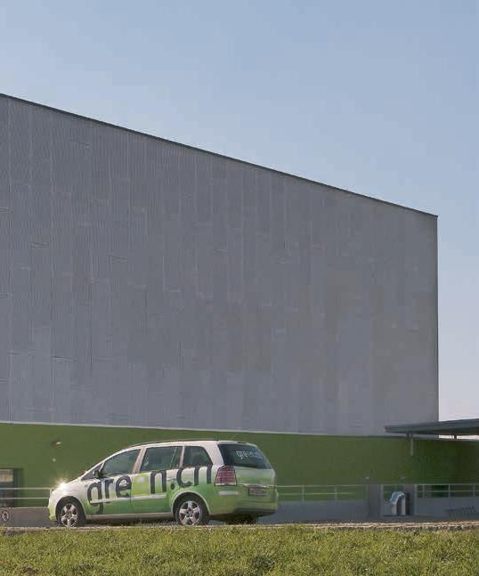

Green Zurich-West · ABB Review 4/2013. The exterior identifies the facility; the electrical path comes from the technical account. [ABB Review — DC for efficiency](https://library.e.abb.com/public/1afa6036874fd0bb85257d5000710a17/DC%20for%20efficiency.pdf)

### Compare the three distribution paths side by side

Trace each column from medium-voltage input to the rack. Traditional AC keeps lower-voltage AC distribution through the hall. The DC sidecar retains those upstream stages, then creates an 800 V DC interface near the rack. The third path makes 800 V DC upstream of the hall distribution and busway through a medium-voltage conversion system.

The right-hand column is a direct-medium-voltage design. It differs from the preceding transformer-plus-low-voltage-rectifier example: both can feed an 800 V DC hall. A compact system block does not mean that voltage reduction, isolation, storage, protection or downstream rack DC/DC conversion cease to be necessary functions where the design requires them. The diagram leaves several of these functions out.

Use this drawing to compare conversion placement and AC/DC interfaces. It has no deployment dates and does not prove an efficiency percentage or equipment readiness. Keep the dated SemiAnalysis roadmap separate from these architectural alternatives.

Three paths to 800 V DC racks, attributed to the Open Compute Project: traditional AC, a DC sidecar, and direct medium-voltage conversion. Each column shows selected conversion and distribution functions, not a complete power or protection design. The linked OCP white paper describes related low-voltage DC architectures. [OCP low-voltage DC power-distribution white paper](https://www.opencompute.org/documents/dcf-power-distribution-lvdc-white-paper-version-1-0-final-pdf-1)

### Read a roadmap as a dated design proposal

NVIDIA’s May 2025 account described a facility-level 800 V DC concept and linked full-scale production to 2027 systems. Its August 11, 2026 update separately described a hybrid power rack expected in the second half of 2026, a row power center expected in 2027, and a broader DC power block. These are vendor descriptions and availability expectations as published. They establish proposed architecture categories, not evidence that a named site has accepted an operating installation or achieved a claimed efficiency.

### Snapshot: SemiAnalysis’s four-phase forecast, May 2026

SemiAnalysis’s May 26, 2026 forecast divides the move to 800 V DC into four phases. Phase 1 (2026/2027) retrofits the white space: a row-level power rack converts AC to 800 V DC, and a power shelf inside the compute rack converts 800 V to about 50 V before the trays. Phase 2 (2027/2028) keeps the row-level power rack, but the 800 V bus runs to each compute blade, where an on-blade power module steps it down to 50 V. Phase 3 (late 2028/2029) moves a central rectifier into the gray space or outdoors, converting 415 V AC to 800 V DC for the whole hall. Phase 4 replaces the low-voltage transformer and rectifier with a solid-state transformer that converts medium voltage directly to 800 V DC. The article’s heading dates Phase 4 after 2029, while its text does not expect SST adoption at scale until early 2029, so this phase has no single forecast date.

These are forecast dates attached to architecture categories. The three architectures above describe where conversion sits, and the phases add the forecaster’s timing: the sidecar covers Phases 1 and 2, and conversion farther upstream covers Phase 3. Conversion in the rack is today’s AC baseline, not Phase 1.

### The 800 V feeder still needs DC fault interruption

Picture an 800 V DC feeder running from a rectifier and its charged bus capacitor through a cable to a DC breaker, with a short circuit downstream. The rectifier and the capacitor can both feed the fault, and the cable’s inductance stores magnetic energy, so the breaker needs a DC voltage rating, fault-current interruption and a way to absorb that stored energy. When a fault develops, opening contacts may draw an arc that continues carrying current. In a conventional mechanical breaker with an arc chamber, the arc is lengthened and cooled to drive current to extinction. DC has no periodic natural current zero; the breaker must manage the actual source, circuit energy and voltage across the open contacts.

This is one interruption mechanism, not a universal description of solid-state or hybrid breakers. Converter current limiting and capacitor discharge can change the fault waveform. Isolation of a feeder also does not prove every downstream store is discharged. The example therefore connects the higher-voltage interface to circuit-specific protection, grounding and stored-energy boundaries without selecting a device or prescribing an operating procedure.

### Compare a chain, not the number of boxes

Fewer conversion stages can be attractive, but stage count is not an efficiency measurement. A larger converter at low load may behave differently from several smaller modules loaded near their intended operating range. Redundancy, thermal conditions, auxiliary power and standby behavior can also change the result. Create a table of stage efficiencies for each architecture at the same delivered load. Multiply efficiencies only along one energy path, add branch loads where they join, and allocate auxiliary consumption to its real location.

Two conversion chains make the point. Path A runs through three stages at 98%, 97% and 95%, and path B through two at 98.5% and 96%, both delivering 100 kW to the same DC load. A’s stages multiply to 0.98 × 0.97 × 0.95 = 90.307%, so it needs 100 ÷ 0.90307 = 110.733 kW of input; B’s multiply to 94.56% and need 105.753 kW. B uses 4.980 kW less, about 4.50% of A’s input. Now add a constant 6 kW auxiliary load at B’s upstream boundary: B needs 111.753 kW, about 1.02 kW more than A. The ranking turns on what the boundary includes, not on the number of stages or the label 800 V.

Conversion losses also dwarf the conductor saving. A single AC-to-DC supply at 98% efficiency delivering 100 kW draws 100 ÷ 0.98 = 102.04 kW and turns 2.04 kW into heat, about 17 times the 122 W the DC feeder saves in its conductors, so an energy comparison between architectures has to follow efficiency along the whole conversion path.

The physical interfaces deserve equal attention. A rack input specification must cover steady demand, peak demand, permitted voltage variation and the response to a sudden load change. The downstream equipment and upstream supply must agree on startup sequencing, fault isolation and shutdown behavior. A higher voltage reduces current at fixed power, but stored electrical energy and fault interruption remain separate engineering questions. For each architecture, list which functions moved and which must be revalidated; a nominal voltage alone does not select the protective equipment.

### Optional market context — SST demand forecast

The model connects future facility adoption to equipment spending using an assumed $1.25 million of SST content per MW. Both adoption and equipment pricing can change; medium-voltage rectifiers compete for part of this opportunity. An 800 V DC interface does not require an SST.

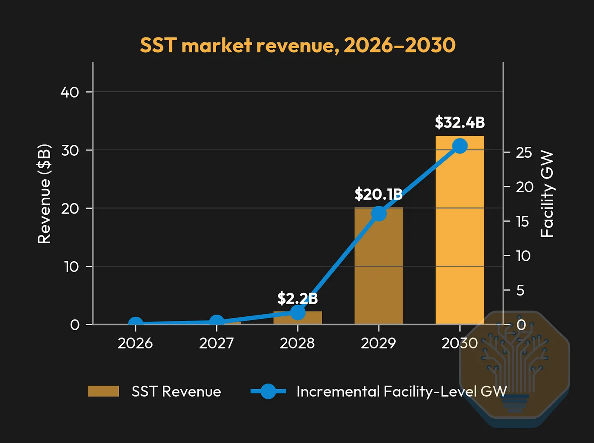

FORECAST · SemiAnalysis, 26 May 2026. Gold: modeled SST revenue ($B). Blue: incremental facility-level GW. These are projections, not observed revenue or deployed capacity. [SemiAnalysis Industrials Model — SST market opportunity](https://newsletter.semianalysis.com/p/inside-the-800vdc-revolution-part)

### Worked example: One 100 kW load, two feeders

- Both feeders deliver 100 kW of real power to the same load.
- The AC feeder is balanced three-phase at 480 V line to line with a power factor of 1, on three current-carrying conductors. The DC feeder holds 800 V across two conductors.
- Every conductor has the same length, cross-section and a resistance of 10 mΩ. Neutral and protective earth are not counted.

1. Count the copper — 2 conductors ÷ 3 conductors = 2/3 — The DC feeder uses one-third less copper in these conductors.
2. Find the AC line current — 100,000 ÷ (√3 × 480 × 1) = 120.28 A — Each of the three lines carries this root-mean-square (RMS) current.
3. Find the DC current — 100,000 ÷ 800 = 125 A — Each of the two conductors carries slightly more current than an AC line.
4. Add the conductor heat — AC: 3 × 120.28² × 0.01 = 434.0 W; DC: 2 × 125² × 0.01 = 312.5 W — Each feeder’s heat is its conductor count times I²R.
5. Compare the heat — 312.5 ÷ 434.0 = 0.72; 434.0 − 312.5 = 121.5 W — The DC feeder produces 28% less conductor heat; the 121.5 W saved is 0.12% of the 100 kW delivered.

**Result:** At the same delivered power, the 800 V DC feeder uses one-third less conductor copper and produces 28% less conductor heat, although each of its conductors carries slightly more current.

**Model boundary:** Equal resistance per conductor is a modeling assumption. Converters, protection, cable sizing and the rest of the facility’s copper are outside this feeder comparison.

### When the situation changes

Trigger: A team treats a hybrid sidecar as a facility-wide DC conversion.

Mechanism: Their drawing hides the AC distribution that the sidecar keeps upstream and wrongly attributes all upstream losses and UPS functions to equipment that has not changed.

Response: Mark every retained and replaced block, then compare the same electrical endpoints under a documented operating state.

### Apply the idea

The AC load draws current at a power factor of 0.9 instead of 1, still receiving 100 kW. Recompute the AC line current and conductor heat. How does the DC feeder’s heat compare now?

Reveal the worked answer

The AC line current becomes 100,000 ÷ (√3 × 480 × 0.9) = 133.6 A, and three conductors at 10 mΩ each turn 535.8 W into heat. The DC feeder still produces 312.5 W, now 58% of the AC heat, or 42% less.

Below a power factor of 1, the AC feeder needs more RMS current to deliver the same real power, and conductor heat grows with the square of that current. The copper count is unchanged, so the DC feeder still uses two-thirds of the copper. Set the lab’s power factor to 0.9 to check the result.

**The idea to keep:** Specify where 800 V begins and ends, what remains AC, and which claims are roadmap statements.

### Sources

- [NVIDIA 800 VDC Architecture Will Power the Next Generation of AI Factories](https://developer.nvidia.com/blog/nvidia-800-v-hvdc-architecture-will-power-the-next-generation-of-ai-factories/) — NVIDIA · Published 2025-05-20 · Reviewed 2026-09-06. May 2025 facility DC concept for megawatt-scale racks, conversion placement and forward-looking 2027 timing.
- [Why Scaling AI Compute Performance Requires a New Power Architecture](https://blogs.nvidia.com/blog/800-vdc-power-architecture-ai-factory/) — NVIDIA · Published 2026-08-11 · Reviewed 2026-09-06. August 2026 distinction between hybrid power rack, row power center and facility DC power block.
- [Inside the 800VDC Revolution – Part 1](https://newsletter.semianalysis.com/p/inside-the-800vdc-revolution-part) — SemiAnalysis · Published 2026-05-26 · Reviewed 2026-09-11. May 2026 forecast of four phases: row-level power racks with rack-shelf (Phase 1, 2026/2027) or on-blade (Phase 2, 2027/2028) step-down, a central 415 V AC rectifier (Phase 3, late 2028/2029) and medium-voltage SSTs (Phase 4, dated after 2029 in its heading and early 2029 in its text); 800 V DC as single-ended 800 V or bipolar ±400 V, with the OCP Diablo 400 specification standardizing ±400 V; 6,000 A at 300 kW in the 50 V ORv3 HPR V3 sidecar; an SST market forecast that assumes $1.25 million of SST content per MW.
- [OCP — Data Center Facility: Low Voltage Direct Current Power Distribution, v1.0](https://www.opencompute.org/documents/dcf-power-distribution-lvdc-white-paper-version-1-0-final-pdf-1) — Open Compute Project · Published 2026-03-30 · Reviewed 2026-09-11. Describes representative low-voltage DC power-distribution architectures for data-center facilities.
- [ABB Review 4/2013 — DC for efficiency](https://library.e.abb.com/public/1afa6036874fd0bb85257d5000710a17/DC%20for%20efficiency.pdf) — ABB · Published 2013 · Reviewed 2026-09-13. Zurich-West: a 1,100 kVA dry transformer inside the central rectifier unit steps 16 kV AC down before rectification to 380 V DC distribution.
- [ABB and Green open Zurich-West DC data-center expansion](https://new.abb.com/news/detail/12816/worlds-most-powerful-dc-data-center-online) — ABB · Published 2012-05-30 · Reviewed 2026-09-13. Opening date, installation scale and compatible HP IT.
- [ABB — Protection Devices for Direct Current Applications](https://library.e.abb.com/public/5cd83dcb95a74dcdb571be5f256e1af8/9AKK108470A9606_en_B_Protection%20Devices%20for%20Direct%20Current%20Applications%20-%20Technical%20Application%20Paper.pdf) — library.e.abb.com · Reviewed 2026-09-06. DC interruption and converter-fed fault behavior depend on circuit dynamics and device capabilities.
- [ABB — Protection Devices for Direct Current Applications, 2025 technical paper](https://library.e.abb.com/public/4b22f4bae7e5424d9bf87039c3c1d0ba/9AKK108470A2501_Technical%20Application%20Paper_Protection%20Devices%20for%20Direct%20Current%20Applications.pdf) — ABB · Published 2025 · Reviewed 2026-09-13. Explains arc formation and conventional arc-chamber interruption in DC breakers, and distinguishes semiconductor, resonant and hybrid interruption methods.
- [Texas Instruments — TIDA-011012 modular solid-state transformer reference design](https://www.ti.com/tool/TIDA-011012) — Texas Instruments · Published 2026-06-04 · Reviewed 2026-09-16. Modular rectification and high-frequency isolated DC/DC conversion explain an SST supply path.
- [Eaton — Medium-voltage solid-state transformer](https://www.eaton.com/us/en-us/catalog/medium-voltage-power-distribution-control-systems/medium-voltage-solid-state-transformer.html) — Eaton · Reviewed 2026-09-16. Eaton’s 2 MW medium-voltage SST is listed with a 12.47 kV input and 800 V DC output.

### Check your understanding: Did moving the converter save energy?

Pause and make a prediction, then compare your reasoning.

A hypothetical redesign moves a converter from each rack to a nearby cabinet. Useful device output, converter efficiency, cable losses and auxiliary demand all remain unchanged.

**Pause and predict:** Did the redesign reduce facility electricity use? Name something it did change.

Compare your reasoning

No energy saving follows from these assumptions. The converter's location and the rack's physical and electrical interfaces changed.

The same output still requires the same total input across the complete path. Conversion heat now occurs outside the rack, and rack space may be released. Shared failure exposure, protection, service access and expansion arrangements need checking at the new location.

**The next problem:** Power now reaches the devices. How do those devices exchange data within a rack and across the cluster?

Continue in **10. Networking and interconnects**: Count the paths, not just the advertised ports.

## Count the paths, not just the advertised ports

**10. Networking and interconnects**

Account for a cluster's ports and cables, then trace its connection through the campus boundary to external networks.

**Driving question:** How do topology, physical distance and the campus fiber handoff constrain a communication plan?

### Separate three communication scales

Scale-up communication joins devices within a tightly integrated execution domain, such as the graphics processing units (GPUs) in a scale-up rack. Scale-out joins nodes or such domains across a cluster. Data-center interconnect (DCI) connects facilities, including buildings on one campus; a wide-area network (WAN) extends communication across more distant sites or provider networks. DCI therefore need not mean long-haul, and scale-up need not end at every rack boundary. These terms describe relationships rather than fixed distances or universal protocols. Identify the participants, synchronization pattern and actual route before assigning a label.

Physical distance establishes a propagation floor that faster serialization cannot remove. Using an illustrative fiber propagation speed of 200,000 kilometers per second, a 100-kilometer route takes at least 0.5 milliseconds one way before switching, queueing or protocol work. A request-response dependency crosses that distance twice, so 100 km of fiber adds at least 1 ms to every round trip. Long bulk transfers may tolerate that delay; many sequential dependent exchanges may not. Route length also differs from straight-line map distance. A WAN proposal needs the actual route and service behavior, not just the names of two cities.

### Three examples from real systems

Scale-up: SemiAnalysis InferenceX reports Kimi K3 inference runs on GB200 NVL72 dated August 21, 2026. The rack provides the tightly coupled NVLink domain, joined by NVIDIA’s direct GPU-to-GPU interconnect, that this kind of model serving uses. This does not mean every model replica uses every GPU in the rack, or that the benchmark identifies Moonshot’s production deployment.

Scale-out: Meta’s October 2024 account states that Llama 3.1 405B training operated across more than 16,000 H100 GPUs. The GPUs exchange data across the cluster network while the software combines several forms of parallel work.

Between facilities: Microsoft’s November 12, 2025 Fairwater account describes Atlanta and Wisconsin sites connected through a dedicated optical AI WAN. It establishes a network joining facilities and allocating AI workloads across sites, without identifying a named completed model-training run stretched synchronously across that entire distance. In November 2025, Microsoft stated its goal: the distributed network is designed to let the Fairwater sites support training models with hundreds of trillions of parameters. Dedicated fiber keeps unrelated traffic off the path, while the propagation delay between the sites remains.

### Locate a real adapter and switch

A network adapter connects the server to an external fabric. The standalone product example is NVIDIA’s ConnectX-7 MCX75310AAS-NEAT: a single octal small form-factor pluggable (OSFP) port supports up to 400 Gb/s, with a PCI Express (PCIe) Gen 4/5 ×16 host interface. Its board is 68.90 × 167.65 mm. This example identifies the adapter’s function and form; it does not identify the adapter fitted to every GB300 configuration. A 400 Gb/s line rate converts to 50 GB/s before protocol overhead and other constraints.

NVIDIA’s one-rack-unit (1U) QM9700 switch provides 64 logical 400 Gb/s ports through 32 twin-port OSFP cages. A front-panel opening and a logical port are therefore different counts. Its aggregate is 25.6 Tb/s in one direction; the advertised 51.2 Tb/s sums both directions. Match the direction of the bandwidth number to the traffic being calculated.

### Why model placement affects the building

A model can be split across GPUs because its state does not fit on one device or because the required service needs more compute. Those GPUs must exchange intermediate results; training also communicates between workers running different data batches. The network therefore influences rack placement, cable routes, switch space, power and cooling. Parameter count alone does not determine how much traffic crosses a link: the parallelization strategy and where workers are placed determine that traffic.

NVLink carries communication within a scale-up domain, such as the 72 GPUs joined by an NVL72 rack’s switch trays. A leaf–spine network connects systems at the scale-out level. Leaf–spine is a general topology used with multiple vendors and workloads, rather than a feature exclusive to NVIDIA GPUs. For comparison, Google’s tensor processing unit (TPU) v4 uses a 3D torus for its internal inter-chip interconnect (ICI) network and optical circuit switches to reconfigure connections; TPU slices can also communicate through the broader data-center network.

### Draw a topology as a graph of constrained resources

Endpoints attach to leaf switches; leaf switches connect through an upper tier such as spines. Each cable consumes a port at each end. A diagram with four uplinks drawn as one thick line still needs four physical links and their associated ports. Specify whether a bandwidth label is per port, per endpoint, the sum of one direction, or a bidirectional aggregate. Dividing an aggregate bidirectional number by a one-way payload is a common way to create an impossibly fast transfer estimate.

Oversubscription compares offered endpoint capacity with capacity available toward the rest of the fabric, under a stated direction and traffic pattern. Four 400 Gb/s downlinks sharing two 400 Gb/s uplinks give a 2:1 ratio at that leaf. This is not a promise that every job runs at half speed. Traffic staying within the leaf may not use uplinks; sparse or staggered transfers may fit easily. The ratio becomes restrictive when simultaneous traffic demands more capacity across the shared cut than the cut can provide.

### Put hardware into the topology

NVIDIA’s DGX H100 SuperPOD reference architecture connects DGX H100 systems through QM9700 leaf and spine switches. Leaf and spine describe each switch’s position and role; they can use the same switch model. Following one server-to-server path through that fabric shows the roles, while the complete reference fabric provides many links and alternative paths.

This fabric sits outside each server’s internal NVLink domain. Likewise, the NVLink switch trays and cable backplane inside an NVL72 should not be labeled as the scale-out leaf–spine fabric. Networking reaches into facility design: NVIDIA’s H100 deployment guide explicitly explains that changes in power or cooling density alter rack footprints, cable lengths and sometimes latency.

### Derive bounds from the traffic matrix

A traffic matrix states who sends how much to whom. For every relevant cut in the graph, add the bytes that must cross it and divide by the usable capacity in that direction. Also check endpoint injection and receiving limits. The largest required time across these constraints is a lower bound, assuming the routing can realize the capacities together. Switch internal bandwidth, routing collisions, protocol overhead, retransmission and queueing can make the actual time longer. Bisection bandwidth is the smallest capacity across any cut that divides the endpoints into two equal halves, so one favorable cut cannot stand in for it. In the worked example below, the weakest equal split separates two leaves from the other two and crosses four 400 Gb/s uplinks: 1,600 Gb/s in each direction, half the 3,200 Gb/s that the eight endpoints on one side can offer. Quote it for one direction, and still check endpoint limits and smaller cuts that are not equal halves, such as one leaf’s 800 Gb/s of uplinks, whenever the traffic crosses them.

A balanced fabric does not guarantee balanced traffic. Many senders targeting one receiver create an incast bottleneck even when the rest of the network is idle. A checkpoint burst can collide with dataset reads if they share links. A topology-aware schedule can reduce traffic through a constrained tier by locating communicating workers together, but placement may wait for suitable resources. The correct decision compares the time saved during execution with additional queueing and the effect on other jobs. Network capacity and scheduling policy are therefore parts of the same system.

### Connect the graph to the installation

After the logical calculation, count cables, endpoint ports and switch ports separately. Then add reach, routing space, patching and replacement access. A feasible graph on paper can be difficult to cable if all high-density connections must cross one congested tray. Labels should preserve the relationship between physical port, logical link and scheduled device. That mapping is essential when a technician needs to locate a degraded link without disconnecting a neighboring healthy path.

### Follow the campus connection to a carrier

Trace an external path from the cluster network through border equipment and patch panels to the outside fiber route. The entrance facility brings outside-plant cabling into the building. A meet-me room (MMR) provides an interconnection area for tenant, operator and carrier cabling; a private campus may use a different room arrangement. These are functions to locate, not a universal sequence of separate rooms. Corning's multitenant example connects outside plant, the MMR and customer rack cabling.

At the agreed demarcation point, mark where one party's service responsibility ends and the next begins. In Equinix's example, customers patch their equipment to the operator's demarcation. An intra-facility cable reaches the MMR and a cross-connect completes the physical connection there. That cable alone does not supply Internet transit: identify the actual carrier or private service, endpoint, capacity and acceptance boundary. The site-planning section checks whether the route and construction rights can be delivered; the networking section checks what the resulting connection carries.

### Test routes, not carrier names

Two carrier contracts do not prove two independent physical paths. Map each circuit through its entrance, duct, splice points, bridge crossings and upstream facilities; two fibers in one cable or conduit share that exposure. The physical-diversity discussion by the U.S. Federal Communications Commission (FCC) identifies shared cables, conduits and structures as common failure points. Provider diversity and route diversity answer different questions. Verify the route evidence and the surviving service, including border equipment and routing behavior; separate entrances alone do not prove end-to-end independence.

In a campus example, two 100 Gb/s services share the same bridge. Cutting both bridge cables removes both services, even though the invoices name different carriers. Moving one service to a verified independent crossing removes that particular shared failure. It does not establish automatic failover, enough remaining payload capacity, or independence from every other hazard. This is the external-network counterpart of the shared-bus failure in the uninterruptible power supply (UPS) lesson.

### Worked example: Four leaves with shared uplinks

- Four leaf switches each connect four endpoints at 400 Gb/s.
- Each leaf has two 400 Gb/s uplinks, one to each of two spine switches. All bandwidth calculations use one direction.
- Four endpoints under one leaf send 32 GB in total to another leaf, with traffic evenly distributed. GB and Gb use decimal units; this model omits overhead and queueing.

1. Count links — 4 × 4 = 16 endpoint cables; 4 × 2 = 8 uplink cables — 24 cables connect the endpoints and the two switch tiers.
2. Count switch ports — Leaves: 16 + 8 = 24; spines: 8 — Each leaf–spine cable consumes a port on both tiers.
3. Find the shared capacity — (4 × 400) / (2 × 400) = 2:1 — A leaf has 1,600 Gb/s toward endpoints but 800 Gb/s toward the spines.
4. Bound the transfer — 800 Gb/s ÷ 8 = 100 GB/s; 32 GB ÷ 100 GB/s = 0.32 s — The sender and receiver uplinks impose the same bound under the stated balanced traffic pattern.

**Result:** Adding two more uplinks per leaf raises shared capacity to 1,600 Gb/s and reduces this transfer bound to 0.16 s. The endpoint links have not changed.

**Model boundary:** This calculation isolates the shared-link constraint; measured application throughput also includes protocol, routing, queueing and endpoint behavior.

### The tradeoff

Choice: Reduce uplinks for a workload expected to communicate mostly within each leaf.

Benefit: Reduce switch-port, cable and transceiver requirements: in the worked example, two uplinks per leaf instead of four remove 8 cables and 16 switch ports.

Cost: Cross-leaf transfers slow down: the 32 GB transfer bound doubles from 0.16 s to 0.32 s, and future workload changes can expose the 2:1 oversubscription.

### When the situation changes

Trigger: A job is spread across leaves despite a local communication pattern assumed during design.

Mechanism: Traffic crosses constrained uplinks that the capacity estimate assumed would remain lightly used.

Response: Compare the observed traffic matrix and placement with the design assumptions before concluding that endpoint network interface cards (NICs) are slow.

### Apply the idea

The transfer is slow only when its participants occupy separate leaves. Transfers between the same number of endpoints on one leaf remain fast. What should you inspect before replacing their network adapters?

Reveal the worked answer

Inspect uplink utilization, queueing, traffic placement and error counters along the cross-leaf route. A fast local transfer makes the shared fabric a stronger suspect than the endpoint port rate alone.

Changing participant placement changes the route without changing their adapters. Compare that changed route with the symptoms, then test the suspected shared resource.

**The idea to keep:** An endpoint link rate is only one constraint on a path through a shared network.

### Sources

- [NVIDIA DGX SuperPOD — Network Fabrics](https://docs.nvidia.com/dgx-superpod/reference-architecture-scalable-infrastructure-h100/latest/network-fabrics.html) — docs.nvidia.com · Reviewed 2026-09-16. A concrete reference distinguishes network roles and accounts for leaf/spine cables and ports.
- [Slurm Workload Manager — Topology Guide](https://slurm.schedmd.com/topology.html) — SchedMD · Reviewed 2026-09-06. Topology-aware allocation can seek to keep jobs within suitable switch groupings.
- [Corning — Meet-Me-Room to Outside Plant Data Center Solutions](https://www.corning.com/data-center/worldwide/en/home/applications/multi-tenant-data-center/meet-me-room.html) — Corning · Reviewed 2026-09-12. Outside-plant fiber, a meet-me room and customer cabling connect in a multitenant data center; DCI can join campus buildings.
- [Equinix — Customer-Managed Pre-Cabling and Demarcations](https://docs.equinix.com/cross-connect/installation/xc-customer-managed-precabling/) — Equinix · Reviewed 2026-09-12. Customer cabling, MMR cross-connects and the demarcation point mark separate responsibilities.
- [FCC 25-21 — Physical Diversity, paragraph 63](https://docs.fcc.gov/public/attachments/FCC-25-21A1.pdf) — Federal Communications Commission · Published 2025-03-28 · Reviewed 2026-09-12. Shared cables, conduits and structures can defeat physical path diversity.
- [NVIDIA ConnectX-7 adapter card specifications](https://networking-docs.nvidia.com/connectx7hw/specifications) — NVIDIA · Reviewed 2026-09-14. MCX75310AAS-NEAT adapter: one OSFP port up to 400 Gb/s, PCIe Gen 4/5 ×16, and 68.90 × 167.65 mm dimensions.
- [NVIDIA QM97xx hardware introduction](https://networking-docs.nvidia.com/qm97x0hw/introduction) — NVIDIA · Reviewed 2026-09-14. QM9700: 64 logical 400 Gb/s ports through 32 twin-port OSFP cages in 1U; 25.6 Tb/s one way versus 51.2 Tb/s summed bidirectional bandwidth.
- [Equinix Cross Connect demarcations](https://docs.equinix.com/cross-connect/installation/xc-demarcations/) — Equinix · Reviewed 2026-09-14. Physical demarcation points define responsibility for patching between customer equipment and a cross connect.
- [Cloud TPU Multislice Overview](https://docs.cloud.google.com/tpu/docs/multislice-introduction) — Google Cloud · Reviewed 2026-09-14. ICI connects chips within a TPU slice; communication across slices uses the data-center network.
- [SemiAnalysis InferenceX — Kimi K3 on GB200 NVL72](https://inferencex.semianalysis.com/run/kimi-k3-on-gb200-nvl72) — SemiAnalysis InferenceX · Reviewed 2026-09-16. Kimi K3 inference was benchmarked on GB200 NVL72 hardware on August 21, 2026.
- [Meta — Open AI hardware vision](https://engineering.fb.com/2024/10/15/data-infrastructure/metas-open-ai-hardware-vision/) — Meta · Published 2024-10-15 · Reviewed 2026-09-16. Meta reports training Llama 3.1 405B across more than 16,000 H100 GPUs.
- [Juniper — Understanding Layer 3 Fabrics](https://www.juniper.net/documentation/us/en/software/network-director6.1/network-director/topics/concept/layer3-fabrics-understanding.html) — Juniper · Reviewed 2026-09-16. Leaf and spine are network topology roles used in Ethernet Clos fabrics, independently of NVIDIA GPU hardware.
- [Microsoft — Fairwater Atlanta availability and power design](https://blogs.microsoft.com/blog/2025/11/12/infinite-scale-the-architecture-behind-the-azure-ai-superfactory/) — Microsoft · Published 2025-11-12 · Reviewed 2026-09-16. Fairwater Atlanta and Wisconsin are connected through a dedicated optical AI WAN.
- [NVIDIA — DGX SuperPOD Key Components](https://docs.nvidia.com/dgx-superpod/reference-architecture-scalable-infrastructure-h100/latest/dgx-superpod-components.html) — docs.nvidia.com · Reviewed 2026-09-16. DGX H100 systems and QM9700 InfiniBand switches form the reference compute fabric.
- [NVIDIA H100 SuperPOD: Planning a Data Center Deployment](https://docs.nvidia.com/dgx-superpod/design-guides/dgx-superpod-data-center-design-h100/latest/planning.html) — docs.nvidia.com · Reviewed 2026-09-16. Power/cooling density changes rack footprints and network cable lengths.
- [Google’s Cloud TPU v4 provides exaFLOPS-scale ML with industry-leading efficiency](https://cloud.google.com/blog/topics/systems/tpu-v4-enables-performance-energy-and-co2e-efficiency-gains) — Google Cloud · Published 2023-04-05 · Reviewed 2026-09-16. TPU v4 uses a 3D torus interconnect and OCS reconfiguration.
- [Microsoft — From Wisconsin to Atlanta, an AI superfactory](https://news.microsoft.com/source/features/ai/from-wisconsin-to-atlanta-microsoft-connects-datacenters-to-build-its-first-ai-superfactory/) — Microsoft · Published 2025-11-12 · Reviewed 2026-09-16. Microsoft states that the Fairwater sites’ distributed network is designed to support training models with hundreds of trillions of parameters, over dedicated inter-site fiber.

## A collective makes waiting contagious

**10. Networking and interconnects**

See why the slowest transfer sets the pace, walk through a ring all-reduce, then connect synchronization, congestion and placement to the job timeline.

**Driving question:** How can one constrained participant delay a job running on many healthy accelerators?

### Understand the result before choosing an algorithm

An all-reduce combines corresponding values from participating workers and returns the combined result to each worker. For example, three workers holding 2, 5 and 7 can all receive 14 after a sum reduction. An all-gather instead distributes each worker’s distinct contribution to everyone; an all-to-all sends different pieces to different destinations. Their names identify data transformations, not one mandatory topology. A library can implement a transformation with different algorithms depending on message size, topology and available hardware.

The workers must agree on the operation they are participating in. The documentation for NVIDIA’s Collective Communications Library (NCCL) requires compatible participation, counts and data types and warns that mismatches can hang, crash or corrupt execution. This is a software correctness condition distinct from link capacity. A job that stops during communication may have a missing or mismatched participant rather than a damaged cable. Diagnosis must examine both communication progress and the execution history that led each rank to that point.

### The slowest server sets the pace

Four servers start their transfers together, and the next step needs all four results. Servers 1, 2 and 3 finish at 20 ms; server 4 finishes at 50 ms. The step begins at 50 ms, the latest completion, so the first three servers each wait 30 ms. Making them faster changes nothing: if they finished at 10 ms, the step would still begin at 50 ms. Only server 4 matters here, and bringing it down to 20 ms would start the step 30 ms sooner.

These are completion times measured from one common start, not ping latencies: they include the time to move each server’s data. Work that does not need the four results can still proceed while the servers wait. The rest of this lesson traces how collectives, congestion and placement create such a late participant.

### Derive one ring rather than memorizing a formula

For a simplified ring all-reduce with N workers, divide each worker’s input buffer into N equal chunks. During a reduce-scatter phase, workers pass and combine chunks for N minus one rounds. At its end, each worker holds one final reduced chunk. During an all-gather phase, another N minus one rounds circulate the completed chunks until everyone holds the full reduced buffer. In this model, each worker sends one chunk in each round, giving total sent bytes of 2(N−1)S/N for an input buffer of size S.

If every ring edge sustains bandwidth B, the transfer component is that byte count divided by B. Add an assumed per-round startup cost alpha for 2(N−1) rounds. This model neglects reduction execution, protocol overhead and interference, and assumes that sends can proceed concurrently around the ring. It is a teaching model of one algorithm. It is not a prediction that a library will choose a ring or that every real all-reduce reaches the resulting time.

### Place the communication on the job’s critical path

If a step cannot begin its next computation until the collective finishes, collective delay extends the step directly. If some independent computation can overlap, only the exposed portion extends the critical path. The distinction matters when evaluating a network upgrade. Halving a communication phase does not halve a job whose time is mostly spent elsewhere. Conversely, a phase that seems small on one device can dominate at scale if it repeatedly waits for a slow participant.

Congestion makes available bandwidth time-dependent. Several flows can share an output queue, and one worker can receive less than its nominal link rate. A degraded link can also shift traffic onto remaining paths. The collective may then wait for the slowest required transfer even while most devices report no local error. Look for distributions of completion time, retransmissions or congestion indicators and rank-level timing. An average utilization metric can hide the worker that determines the finish line.

### Select a fabric as an operating system decision

Ethernet and InfiniBand are families of technologies and implementations, not universal performance rankings. Meta’s March 2024 report describes two clusters of 24,576 H100 GPUs each, one using RDMA over Converged Ethernet (RoCE) and one using InfiniBand. Remote direct memory access (RDMA) lets network adapters place data in permitted memory on another server without a processor-managed copy for each transfer. The report explains that routing, collective software and topology-aware scheduling required joint tuning. That case supports testing the full system. It does not prove equal performance for every workload or make operational expertise irrelevant. A useful comparison names the hardware, protocol configuration, topology, software version, message distribution and failure conditions being tested.

### Optical circuit switching in Google TPU v4

Google’s TPU v4 paper describes 4,096 TPU chips in 64 racks. Each rack contains a 64-chip electrical 4 × 4 × 4 block. Forty-eight optical circuit switches connect these blocks through reconfigurable light paths. An optical circuit switch establishes a connection between fiber endpoints; it does not inspect and forward each packet like a packet switch. Reconfiguration can connect available blocks for a workload and avoid unavailable portions of the machine.

This is the TPU v4 inter-chip network. Google’s Multislice documentation separately distinguishes ICI inside a slice from communication over the data-center network between slices. A wide-area route requires another distance and service budget; the presence of optical switches does not remove propagation delay.

### Diagnose a link that stays connected

For a physical-link diagnosis, consider this evidence: after a cable move, one worker arrives late, its port reports rising retries, and other uplinks retain spare capacity. Trace that worker’s adapter, cable, connectors and switch port before adding general fabric bandwidth. Correlate the link counters with rank timing, localize the affected segment and verify the collective after the repair. A connected link can deliver poor payload service, so link-up status alone does not resolve the diagnosis.

### Worked example: Four workers perform a ring all-reduce

- Four workers each contribute a 1 GB buffer, split into four 0.25 GB chunks.
- Each ring edge sustains 50 GB/s of payload. The bandwidth model omits per-round startup and reduction work.
- Compute takes 200 ms; compare exchange entirely afterward with 20 ms of communication overlapping independent compute.

1. Reduce then distribute — 3 reduce-scatter rounds + 3 all-gather rounds = 6 rounds — After reduction, each worker holds one complete chunk; distribution gives every worker all complete chunks.
2. Count transmitted bytes — 6 × 0.25 GB = 1.5 GB per worker — Each ring edge carries one chunk per round.
3. Find communication time — 1.5 GB ÷ 50 GB/s = 30 ms — All ring edges operate concurrently at the given payload rate.
4. Place it on the critical path — Without overlap: 200 + 30 = 230 ms; with overlap: 200 + (30 − 20) = 210 ms — Only the 10 ms remaining after the compute interval extends the overlapped step.
5. Slow one edge — 1.5 GB ÷ 25 GB/s = 60 ms; with overlap: 200 + (60 − 20) = 240 ms — Each round waits for the slowest edge, so one edge at 25 GB/s paces every worker, the ring version of the late server.

**Result:** Communication takes 30 ms and the overlapped step 210 ms. One edge at half speed doubles communication to 60 ms and stretches every worker’s step to 240 ms, while the 200 ms of compute is unchanged.

**Model boundary:** The uniform ring is a teaching model; actual collective algorithms and achievable overlap depend on the workload and fabric.

### The tradeoff

Choice: Wait for a compact topology placement instead of launching immediately across a wider fabric.

Benefit: Potentially reduce communication time and contention during a long job.

Cost: Increase queueing delay and possibly fragment available resources for other jobs.

### When the situation changes

Trigger: One rank skips a collective after an earlier application exception.

Mechanism: Other ranks wait for a required participant; replacing healthy network hardware would not fix the dependency mismatch.

Response: Correlate rank logs and collective progress, identify the first divergence, and restart from a valid state after correcting the cause.

### Apply the idea

GPU compute stays at 200 ms. Collective time rises from 30 to 60 ms, and counters show output queueing on a shared uplink while link errors remain unchanged. Would you start with faster GPUs, fabric traffic placement, or extra model memory?

Reveal the worked answer

Start with fabric traffic placement and the shared uplink. Inspect which traffic crosses it and whether competing transfers can be separated; verify the result with the same job.

The observed change is exposed communication. More GPU arithmetic throughput or model memory does not directly remove the measured output queue.

**The idea to keep:** Communication is part of the computation’s dependency graph, so local health does not establish global progress.

### Sources

- [NCCL Collective Operations](https://docs.nvidia.com/deeplearning/nccl/user-guide/docs/usage/collectives.html) — docs.nvidia.com · Reviewed 2026-09-14. Defines collective transformations and participation requirements.
- [Building Meta’s GenAI Infrastructure](https://engineering.fb.com/2024/03/12/data-center-engineering/building-metas-genai-infrastructure/) — Meta Engineering · Published 2024-03-12 · Reviewed 2026-09-14. Two 24,576-GPU H100 clusters, one on RoCE and one on InfiniBand, and the joint network, software and placement tuning they required.
- [TPU v4: An Optically Reconfigurable Supercomputer for Machine Learning](https://arxiv.org/abs/2304.01433) — Google Research · Published 2023-04-04 · Reviewed 2026-09-14. TPU v4: 4,096 chips in 64 racks, 64 chips in each electrical 4 × 4 × 4 block, and 48 optical circuit switches connecting the blocks.

## Choose where electricity becomes light

**10. Networking and interconnects**

Compare media and optical packaging at the link level, then include their effects on switch cooling, cabling and repair.

**Driving question:** How should reach, power and replacement boundaries shape the choice between copper, pluggable optics and co-packaged optics (CPO)?

### Start with the required link, not the fashionable package

A link has two endpoints, a required payload rate, a physical route and an acceptable error behavior. Its media choice must satisfy those conditions under the intended environment. Copper carries an electrical signal along the route; optical fiber carries modulated light after electro-optical conversion. Copper can be attractive for sufficiently short qualified connections, while increasing rate and distance can make electrical loss and signal conditioning harder. There is no universal distance at which every copper design stops and every optical design begins: specify the actual interface and approved cable.

A pluggable optical transceiver places the electrical-to-optical boundary in a replaceable module attached to a host port. The signal still travels electrically between the switching silicon and that module. Co-packaged optics moves optical engines close to the switching silicon, shortening that electrical portion. External laser arrangements, fiber connections and serviceable subassemblies vary by design. CPO names a packaging approach, not a guarantee that every optical component is inseparable or that every repair requires replacing an entire switch.

### Choose a qualified reach example

NVIDIA’s 400G LinkX product family illustrates three supported reaches: a 2 m passive copper cable, 50 m multimode optics and 500 m single-mode DR4 optics. These illustrate how the physical route selects a compatible product. They are not universal limits of copper or optical fiber. At the transmitting end an optical module converts an electrical signal into light; at the receiving end another module converts the light back into an electrical signal. Bidirectional links perform both roles at each end. Copper attenuates and distorts high-frequency electrical signals as length increases. At a fixed high link rate, fiber’s lower loss makes longer runs practical; this is not a claim that a bit inherently travels faster through fiber.

### An optical circuit switch steers light between fibers

Light can also be switched without converting it back to an electrical signal. An optical circuit switch sets up direct light paths between fiber endpoints. In Google’s TPU v4 system, arrays of movable micro-electro-mechanical system (MEMS) mirrors steer each beam. Resetting the mirrors changes which endpoints are joined: a switch that connects A to C and B to D can be reconfigured to connect A to D and B to C. Each connection holds until the next reconfiguration, and the switch never reads the packets, so it changes which blocks of a machine are wired together rather than routing individual messages.

### Compare complete and equal power boundaries

NVIDIA’s August 2025 photonics description uses shorter electrical paths as a motivation for CPO and describes then-proposed switch platforms. That is a useful mechanism to study. Treat its advertised savings and reliability ratios as vendor claims for those platforms, not field measurements. A comparison must state the included elements: host electrical interfaces, retimers or signal processing where present, optical engines, lasers and any additional cooling. If one number includes both ends of a link and another includes only the switch end, the apparent saving is not meaningful.

Power is also not energy per completed job. A lower-power network that slows an important collective can keep the much larger compute system running longer. Conversely, a somewhat higher-power network can reduce total job energy if it improves accepted throughput enough. Hold the workload, topology, payload rate and availability condition constant when comparing link hardware. Then separately test the application effect. Keep a component power budget for thermal design and an end-to-end energy ledger for useful service.

### Serviceability is a design requirement with a topology

The relevant maintenance question is what must be isolated, reached and replaced after a specified fault. A front-panel module can offer a convenient replacement boundary, but dense cabling may make access difficult. More integrated optics can change the set of replaceable assemblies and require a different spare strategy. Neither arrangement is automatically more reliable merely because it contains fewer visible boxes. Failure rates, shared dependencies, detection quality and restoration time all matter.

Consider a single optical engine serving several logical links. Its failure may affect more than one endpoint, depending on the design. Consider a removable module with one marginal connection: it may produce intermittent errors rather than a clean link-down event. The software can experience retries or a degraded route while the hardware inventory still looks complete. Acceptance should exercise the intended link rates and communication patterns, and operations should connect error telemetry to physical cable and component identities.

### Treat cabling and cooling as part of the network

Fiber routes require handling, cleaning, bend control, labeling and accessible connection points according to the hardware vendor’s requirements. Copper routes impose their own bend, weight and reach constraints. Dense optical and switching equipment also dissipates heat at a specific location; a switch may have a liquid interface even when its neighboring networking equipment uses air. Moving optical conversion inward can change where heat must be captured. The installation review should therefore connect the logical network graph to cable routes, cooling interfaces and the actual replacement procedure.

### Worked example: A synthetic optical power comparison

- Compare 64 equivalent links at the same payload capability; each link has two counted endpoints.
- Design A assigns 20 W per endpoint to the included optical subsystem.
- Design B assigns 8 W per endpoint plus a shared 160 W laser subsystem and 100 W of incremental cooling electricity. Everything else is held equal.

1. Count optical endpoints — 64 × 2 = 128 endpoints — Counting only one side would understate a full-link comparison.
2. Calculate design A — 128 × 20 = 2,560 W — The stated A boundary has no extra shared load in this constructed example.
3. Calculate design B — 128 × 8 + 160 + 100 = 1,284 W — Include the shared and cooling terms instead of comparing only engine power.
4. Compare at the stated boundary — 2,560 − 1,284 = 1,276 W — The difference is 49.8% of A’s included subsystem power.

**Result:** B uses 1.276 kW less within this hypothetical equal-service boundary. It does not establish the saving of an actual CPO product or whole data center.

**Model boundary:** All wattages are invented. Real comparisons require product-specific optical budgets, load conditions and replacement architectures.

### The tradeoff

Choice: Move optical engines closer to the switch silicon.

Benefit: Potentially reduce electrical-path loss and the power needed to sustain high-rate signaling.

Cost: Change packaging, thermal integration, supply-chain dependencies and the set of components that can be serviced independently.

### When the situation changes

Trigger: A marginal link remains up but repeatedly corrects or retries traffic.

Mechanism: Usable payload bandwidth or latency consistency degrades, extending communication phases before a simple device-count monitor flags a failure.

Response: Correlate physical-link error counters and workload timing; isolate the affected path using the qualified operating procedure and verify performance after repair.

### Apply the idea

Suppose design B causes a 1 MW compute workload to run one extra minute while saving 1.276 kW throughout a one-hour baseline job. Could the link-power saving offset that extra compute energy?

Reveal the worked answer

Extra compute energy is about 16.67 kWh. A uses 2.56 kWh of the compared network subsystem in 60 minutes; B uses 1.284 × 61/60 = 1.3054 kWh. The network saving is only about 1.255 kWh.

The longer compute duration overwhelms the smaller network energy saving. The scenario is synthetic and does not assert that CPO slows workloads; it demonstrates why each design must be compared over the time needed to complete the same useful output.

**The idea to keep:** Moving optical conversion changes the electrical path and service boundary; it does not remove the need for a complete link budget and operating plan.

### Sources

- [Scaling AI Factories with Co-Packaged Optics for Better Power Efficiency](https://developer.nvidia.com/blog/scaling-ai-factories-with-co-packaged-optics-for-better-power-efficiency/) — developer.nvidia.com · Published 2025-08-18 · Reviewed 2026-09-06. Describes moving optical conversion nearer switch silicon and the associated electrical-path mechanism.
- [NVIDIA Optical Transceivers and Cables](https://www.nvidia.com/en-us/networking/interconnect/) — www.nvidia.com · Reviewed 2026-09-06. NVIDIA’s catalog of optical transceivers and cables for its networking platforms.
- [NVIDIA LinkX 100G-PAM4 product line overview](https://docs.nvidia.com/networking/display/400g100gpam4ovdev/LinkX-100G-PAM4-Product-Line-Overview) — NVIDIA · Reviewed 2026-09-16. Qualified 400G LinkX examples: 2 m passive copper, 50 m multimode optics and 500 m single-mode DR4 optics.
- [NVIDIA silicon photonics networking](https://www.nvidia.com/en-us/networking/products/silicon-photonics/) — NVIDIA · Reviewed 2026-09-14. Co-packaged optical engines shorten the electrical signal path between switch silicon and optical conversion.
- [Google’s Cloud TPU v4 provides exaFLOPS-scale ML with industry-leading efficiency](https://cloud.google.com/blog/topics/systems/tpu-v4-enables-performance-energy-and-co2e-efficiency-gains) — Google Cloud · Published 2023-04-05 · Reviewed 2026-09-16. TPU v4 optical circuit switches use MEMS mirrors to redirect light between fiber endpoints.

### Check your understanding: Healthy devices, waiting job

Pause and make a prediction, then compare your reasoning.

A hypothetical synchronized training step cannot finish until every participant completes its required exchange. One shared fabric link becomes congested, although every accelerator remains healthy.

**Pause and predict:** Can the job slow down without losing any accelerators? Trace the dependency.

Compare your reasoning

Yes. Delayed communication can hold up the exchange that the entire step needs before it can advance.

Healthy endpoints do not establish a healthy end-to-end communication path. Follow the affected traffic through shared links and the collective's dependencies. Placement or path changes might help, but only if they relieve the actual constrained route.

**The next problem:** Data now moves between the devices. Where does the heat they produce go?

Continue in **11. Chip and rack heat capture**: A cool room can contain an overheating chip.

## A cool room can contain an overheating chip

**11. Chip and rack heat capture**

Trace heat through local thermal resistances and parallel air/liquid paths, then compare the capture point of different cooling approaches.

**Driving question:** Why do equal rack heat loads create different local cooling problems?

### Name where the cooling happens

A cooling system has several jobs: capture heat at the hardware, transport it through the building, and reject it outdoors. Air cooling, rear-door heat exchangers (RDHX), cold plates and immersion describe capture near the rack. Dry coolers and evaporative towers describe outdoor rejection. A chiller adds refrigeration when the required temperature cannot be maintained by the available passive heat-transfer path. These choices can be combined; they are not competing names for one component.

Water cooler is too ambiguous to identify a data-center architecture. Name the actual equipment: a water-fed cold plate, a chilled-water air handler, a dry fluid cooler, a cooling tower or a water-cooled chiller. In the last term, water-cooled describes the chiller condenser. An air-cooled chiller can still supply chilled water to the building. Always ask which fluid takes heat from which object, then follow it to the next boundary.

### Is air cooling dead?

No, but moving concentrated rack heat through air has practical limits. Carry 100 kW through a 10°C rise: water needs about 2.39 litres per second, while air needs about 8,300 litres per second (8.3 m³/s), roughly 3,500 times the volume. These figures use 1,000 kg/m³ and 4.18 kJ/(kg·K) for water and 1.2 kg/m³ and 1.005 kJ/(kg·K) for air. The equation is the steady-flow sensible-heat balance: Q̇ = ṁ cₚ ΔT = ρ V̇ cₚ ΔT. It relates heat-transfer rate to mass flow, specific heat and fluid temperature rise when the fluid remains in one phase. It is not the boiling/condensation energy balance.

Flow and temperature rise trade against each other. Hold the liquid-path heat at 100 kW and the water inlet at 35°C. At 2.5 kg/s the water rises 100 ÷ (2.5 × 4.18) = 9.57 K and leaves at 44.57°C; doubling the flow to 5 kg/s halves the rise to 4.78 K and the outlet falls to 39.78°C. Those are coolant temperatures, not chip temperatures: the chip sits above the coolant by the temperature difference its local heat path needs.

Lenovo’s GB300 NVL72 guide, updated August 30, 2026, describes approximately 90% liquid and 10% air heat capture at rack level. Cold plates serve the major liquid-cooled components; remaining air-cooled components still need an air path. A GB300 hall therefore needs a coolant distribution unit (CDU) for the liquid heat and air cooling, such as a computer-room air handler (CRAH), for the rest. The proportions depend on the rack implementation and operating conditions.

### Follow temperature through the heat path

In a steady operating state, most electrical energy consumed by computing equipment becomes heat within the facility’s accounting boundary. That energy balance says how much heat must ultimately leave. It does not say that every device is at an acceptable temperature. Heat must cross a sequence of interfaces: from active silicon through its package and thermal interface, then into a heat sink, cold plate or immersion fluid, and onward to another cooling boundary. A restrictive local interface can overheat a device while the room-level heat balance still appears adequate.

A simple thermal-resistance model writes temperature difference as heat flow multiplied by thermal resistance. For example, 100 W crossing a 0.2°C/W path from a GPU to water at 30°C needs a 100 × 0.2 = 20°C difference, so the GPU runs at 50°C. State exactly which two temperatures the resistance connects. Junction-to-case, case-to-fluid and a complete effective path are different quantities. A measurement of coolant inlet temperature is not automatically the local bulk-fluid temperature beside the hottest region. Contact quality, flow distribution and heating along the path can matter. The model is a way to identify required temperature margin, not a substitute for a supplier’s qualified thermal performance map.

### Total heat and heat flux answer different questions

Heat flux is heat flow per area. Two devices each produce 400 W. Through four square centimeters that averages 100 W/cm²; through one square centimeter it averages 400 W/cm², four times as concentrated. The total heat is the same, but in the second device it must leave through a quarter of the area. Heat flux alone does not set a temperature without the geometry and thermal path, but it explains why total rack kilowatts alone cannot rank cooling difficulty. Within one package, local hotspots can be more demanding than the area average.

The temperature limit matters too. A device that tolerates a higher operating temperature has a different allowable path resistance at the same heat and coolant temperature. Reducing coolant temperature can create more margin, but it may increase the work required farther upstream or introduce condensation constraints. Improving the local interface can also create margin. Evaluate those options with the complete thermal and energy system in view. The most effective intervention depends on where the limiting temperature difference actually occurs.

### Compare where each method captures heat

An air-cooled heat sink transfers heat into a moving air stream. Containment and air management help prevent heated exhaust from mixing back into device inlets, but adequate room cooling cannot compensate for insufficient flow through a particular server. A rear-door heat exchanger captures heat from rack exhaust air into a liquid circuit. The server still needs a functioning internal air path, and the added exchanger must be compatible with its airflow and service requirements.

Room air must then pass its heat onward. A computer-room air handler (CRAH) uses a chilled-water coil: room air gives heat to the water, which returns to the cooling plant. A computer-room air conditioner (CRAC) uses a compressor-driven refrigerant circuit, often called direct expansion (DX). Its condenser still needs an air or water heat-rejection path. Perimeter, in-row and overhead describe placement and air delivery, not new ways to eliminate heat.

A cold plate captures heat near selected components and transfers it to the rack coolant loop, also called the technology coolant system. Components outside that liquid path can still reject heat to air, so a liquid-cooled rack may retain a substantial residual-air requirement. Immersion places qualified hardware in a compatible dielectric fluid. Single-phase systems transport sensible heat as the liquid warms; two-phase approaches use boiling and condensation as part of the transfer process. Fluid compatibility, component qualification, vapor or liquid containment and service procedures depend on the actual design. These approaches cannot be ranked from the word liquid alone.

### Close parallel heat paths without erasing local limits

Draw liquid-captured heat and residual air heat as separate arrows whose sum matches the defined rack heat load. Include auxiliaries consistently. If a 100 kW rack transfers 85 kW into a cold-plate loop and 15 kW to room air, the air system still needs to manage that 15 kW at the right locations. A failed fan can harm an air-cooled component while the liquid supply remains normal. Likewise, a blocked cold-plate branch can cause local throttling even if the room is comfortable and the CDU’s aggregate load is below its rating.

### Cold plates and immersion up close

A cold-plate assembly brings coolant through tubes, hoses and couplings to a metal plate mounted on each high-power package. Heat crosses the package, the thermal interface and the plate metal before entering the contained coolant.

2CRSi’s single-phase immersion system, below, pumps dielectric liquid from the tank through a coolant-to-water heat exchanger and back while the liquid stays liquid. The water side then carries the heat to a chilled-water loop, an evaporative cooling tower or a dry cooler. In two-phase immersion, a suitable fluid boils at the electronics, vapor reaches a cooled condenser, and liquid returns to the bath. The words single-phase and two-phase refer to the fluid’s physical state; they do not describe the facility electrical supply.

Single-phase immersion: the dielectric liquid circulates without boiling and hands its heat to a water loop. [2CRSi, single-phase immersion cooling](https://2crsi.com/single-phase-immersion-cooling)

### Worked example: Equal heat, unequal chip temperature

- Two chips each dissipate 400 W at steady state.
- Both are cooled by the same 35°C local coolant. Chip A’s path has an effective thermal resistance of 0.08 K/W; chip B’s has 0.12 K/W.
- Both chips have an 80°C maximum junction temperature; the junction is the hottest point inside the chip. The effective resistance connects that junction to the coolant.

1. Predict chip A’s temperature — 35 + 400 × 0.08 = 67°C — A has 13 K of margin to the limit.
2. Predict chip B’s temperature — 35 + 400 × 0.12 = 83°C — B exceeds the limit despite producing the same total heat.
3. Find the required resistance bound — (80 − 35) / 400 = 0.1125 K/W — The complete effective path must be no worse than this value in the stated model.

**Result:** The same heat and coolant temperature produce different outcomes because the local thermal paths differ: chip A reaches 67°C and chip B 83°C, above its 80°C limit.

**Model boundary:** The resistances and temperature limit are invented; this calculation cannot qualify a processor, cold plate or mounting procedure.

### The tradeoff

Choice: Capture more heat directly with cold plates.

Benefit: Reduce the fraction that must travel through the room-air path and potentially improve local heat removal: a 100 kW rack that sends 85 kW into cold plates leaves 15 kW for air.

Cost: Add fluid interfaces, material and leak qualification, branch-flow requirements and a different maintenance procedure.

### When the situation changes

Trigger: A cold plate has poor thermal contact after maintenance.

Mechanism: Effective local resistance increases while total coolant flow and rack electrical demand remain near normal.

Response: Correlate device temperatures with the qualified local operating model, remove the affected equipment from the agreed service state and have the responsible team verify the interface.

### Apply the idea

For chip B, lowering the coolant temperature to 30°C gives what junction temperature? Does that automatically make the better facility design?

Reveal the worked answer

30 + 400 × 0.12 = 78°C, so it passes the 80°C limit. It does not automatically make the better facility design.

Lower supply temperature may require additional upstream cooling work or condensation management. Improving the local path could preserve warmer facility operation. Compare qualified alternatives across both the device constraint and the wider energy and service boundaries.

**The idea to keep:** Heat quantity sets transport demand; heat concentration, resistance and temperature limits determine whether the device can operate.

### Sources

- [ASHRAE — Emergence and Expansion of Liquid Cooling in Mainstream Data Centers](https://www.ashrae.org/file%20library/technical%20resources/bookstore/emergence-and-expansion-of-liquid-cooling-in-mainstream-data-centers_wp.pdf) — www.ashrae.org · Published 2021 · Reviewed 2026-09-06. Thermal resistance connects device temperature, cooling-medium temperature and device heat; local requirements can drive cooling changes.
- [ASHRAE Handbook, Chapter 20: Data Centers and Telecommunication Facilities](https://handbook.ashrae.org/Handbooks/A23/SI/A23_Ch20/a23_ch20_si.aspx) — ASHRAE · Published 2023 · Reviewed 2026-09-11. Provides context for air and liquid heat paths, CRAH chilled-water coils, CRAC compressorized circuits, and equipment-specific environmental requirements.
- [Trane TRACE 3D Plus — Air Cooled Chillers](https://trace3dplus.help.trane.com/air_cooled_chillers.html) — Trane · Reviewed 2026-09-11. An air-cooled chiller can make chilled water while its condenser rejects heat to air, resolving the ambiguity between load coolant and condenser cooling medium.
- [Lenovo NVIDIA GB300 NVL72 Rack Scale AI Product Guide](https://lenovopress.lenovo.com/lp2357-lenovo-nvidia-gb300-nvl72-rack-scale-ai) — Lenovo Press · Published 2026-08-30 · Reviewed 2026-09-17. GB300 NVL72 rack heat capture is about 90% liquid and 10% air, with residual air-cooled components.
- [2CRSi — Single-phase immersion cooling](https://2crsi.com/single-phase-immersion-cooling) — 2CRSi · Reviewed 2026-09-17. In 2CRSi’s single-phase immersion system, dielectric liquid circulates through the tank and a separate coolant-to-water heat exchanger.
- [2CRSi — Two-phase immersion cooling](https://2crsi.com/two-phase-immersion-cooling) — 2CRSi · Reviewed 2026-09-17. Phase-change mechanism compared with single-phase immersion.

## Flow arithmetic is only the first pump question

**11. Chip and rack heat capture**

Derive a single-phase flow requirement, then add pressure drop, pump operating point and branch maldistribution.

**Driving question:** How much liquid transports the heat, and can that flow reach every required branch?

### Start from the heat balance

The chips in a liquid-cooled rack pass their heat through cold plates into coolant, which carries it to a coolant distribution unit (CDU). Three questions decide whether that works. How much coolant does the heat need? Can the pump push that much through the installed circuit? Does every branch get its share? The first takes one line of arithmetic. The other two decide whether each chip receives the flow the arithmetic asks for.

For a single-phase liquid whose specific heat capacity, cp, stays roughly constant, each kilogram absorbs cp times its temperature rise, ΔT. Multiply by the mass flow rate, ṁ, and you have the heat-transfer rate: Q̇ = ṁ × cp × ΔT. With heat in kilowatts and cp in kilojoules per kilogram-kelvin, mass flow comes out in kilograms per second, and the liquid's density turns that into litres. Keep heat rate and liquid flow apart by their units, kilowatts for one and litres per second for the other, even where a drawing labels both Q.

For water, at about 1 kg/L and 4.2 kJ/(kg·K), the balance reduces to a rule of thumb: a 10 K rise needs 60 ÷ (4.2 × 10) = 1.43 L/min of water for every kilowatt of heat. Halve the allowed rise to 5 K and the rule doubles to 2.86 L/min per kW.

The temperature rise is the liquid's outlet temperature minus its inlet temperature across the load, a separate number from the supply temperature and from a heat exchanger's approach temperature. Flow and rise trade against each other: in the previous lesson’s 100 kW case, doubling the flow from 2.5 to 5 kg/s halved the rise from 9.57 K to 4.78 K. A larger rise saves flow but warms the return and everything along the load path, while a smaller rise asks more of the pumps. The equipment's thermal requirements and the complete system design set the acceptable range.

### Ask what pressure difference produces that flow

A pump makes coolant circulate by supplying a pressure difference that pushes it through the circuit's restrictions: pipes, hoses, valves, filters, connectors and cold plates. The circuit needs more pressure the faster the liquid flows, and the pump adds less pressure the more flow it delivers. Its maximum free-flow figure, the flow at zero added pressure, is the one point on its curve that the installed circuit never reaches. Plot both curves against flow and they cross at the hydraulic operating point: the flow the loop actually gets, and the point to choose a pump by.

Resistance moves the operating point. A partly closed valve or a clogging filter makes the circuit curve steeper, so at unchanged pump speed the two curves meet at a higher pressure and a lower flow. The worked example puts numbers on both points, and in the lab below, raising the circuit coefficient k from 30 to 70 moves the loop from one to the other. The pump is still running and adding more pressure, yet less coolant circulates. Check flow as well as pressure, because the equipment needs enough coolant to carry its heat away.

In a circuit dominated by friction, pressure drop grows roughly with the square of flow over a working range. Hydraulic power is pressure difference times volume flow, so it grows with the cube of flow. On a circuit that needs 120 kPa at 2 L/s, halving the flow to 1 L/s cuts the pressure to 30 kPa and the hydraulic power from 240 W to 30 W, one-eighth. The pump affinity laws give the matching rule for a centrifugal pump changing speed on such a circuit: flow follows speed, pressure follows speed squared, and power follows speed cubed. The cube is the price of a small temperature rise: doubling the flow to halve the rise, as in that 100 kW case, takes four times the pressure and eight times the hydraulic power.

The square law is an approximation. Real pump and circuit curves, fluid viscosity, controls and component limits decide the actual operating point. A glycol mixture has its own density, heat capacity and viscosity, so a water calculation carries over only after those are checked at the intended conditions. Treat the fluid's identity as part of the interface specification.

### Parallel branches can hide a local shortage

A manifold divides the total flow among parallel branches by their hydraulic resistance and the pressure difference across them, whatever heat each carries. A partly blocked filter, a restrictive connector or a moved valve can starve one branch while its neighbours take the difference, and the total at the CDU stays the same. Take 2 L/s of water at 35°C feeding two 42 kW branches. Balanced at 1 L/s each, both return at 45°C. Restrict one branch to 0.5 L/s and the other takes 1.5 L/s: the starved branch returns at 55°C and its neighbour at 41.7°C.

Now mix the two returns. The flow-weighted average is still 45°C, the balanced value, while one branch runs 10 K hotter than design. A single rack-average return temperature cannot see that fault. Local device temperatures, branch flow or the differential pressure across each branch can. Which of them a loop needs depends on the failure modes it must catch and how fast it must respond. Its flow ledger lists every branch as well as the total.

### Include pump energy and qualification boundaries

Pump electricity ends up as heat. The motor and fluid boundaries decide where: the share assigned to the liquid adds to the heat the next exchanger must transfer, and any share that leaves to room air needs its own path in the ledger. A first flow calculation often leaves this small term out to isolate the main mechanism. The final engineering ledger states whether it is in.

A qualified loop also needs compatible wetted materials, fluid chemistry, cleanliness and service procedures. More flow cures a hydraulic shortage. It leaves poor thermal contact at a cold plate exactly as it was, and it can push a component past its allowed pressure, velocity or pumping envelope. Use the manufacturer's pump and system curves and the component limits to tell a hydraulic shortage from a local heat-transfer defect before changing the operating point.

### Worked example: One pump curve, two circuits

- The loop captures 84 kW into single-phase water with cp = 4.2 kJ/(kg·K), rounded from 4.18, and density 1 kg/L. The desired temperature rise is 10 K, and pump heat is left out.
- At fixed pump speed the pump curve is Δp = 160 − 10q² kPa and the circuit curve is Δp = 30q² kPa, with volume flow q in L/s. A partly closed valve raises the circuit curve to Δp = 70q² kPa.
- Overall pump efficiency is 60%.

1. Find the required flow — 84 ÷ (4.2 × 10) = 2 kg/s = 2 L/s = 120 L/min — The fluid density converts mass flow into volume flow.
2. Find operating point A — 160 − 10q² = 30q²; q = 2 L/s; Δp = 30 × 2² = 120 kPa — Pump and circuit agree at exactly the flow the heat balance needs.
3. Calculate pump power at A — 120,000 Pa × 0.002 m³/s = 240 W hydraulic; 240 ÷ 0.60 = 400 W electrical — In the International System of Units (SI), pascals times cubic metres per second give watts.
4. Partly close a valve: operating point B — 160 − 10q² = 70q²; q = √2 ≈ 1.41 L/s; Δp = 70 × 2 = 140 kPa — The pump supplies more pressure but moves less coolant.
5. Find the new temperature rise — 84 ÷ (√2 × 4.2) ≈ 14.1 K — The same heat in less water raises the coolant temperature 4.1 K more.

**Result:** At point A the pump delivers the 2 L/s that a 10 K rise needs, at 120 kPa and 400 W of input. The partly closed valve moves the loop to point B, 1.41 L/s at 140 kPa, and the coolant now rises 14.1 K.

**Model boundary:** The curves illustrate the mechanism and describe no real pump or CDU. Fluid-property variation, branch balance, transients, pressure limits and redundancy are outside the example.

### The tradeoff

Choice: Allow a larger liquid temperature rise to reduce required flow.

Benefit: Reduce hydraulic demand and the burden on piping and pumping: at 84 kW, doubling the allowed rise from 10 K to 20 K halves the required flow from 2 kg/s to 1 kg/s.

Cost: Downstream fluid runs warmer and device thermal margin can shrink. The pump's operating point has to be recalculated for the new flow.

### When the situation changes

Trigger: One of four equal 21 kW branches receives 0.25 L/s instead of its 0.5 L/s.

Mechanism: Its temperature rise doubles from 10 K to 20 K, whatever the other three branches do.

Response: Find the restricted branch from local temperatures and branch flow or pressure readings, then follow the qualified isolation and restoration procedure.

### Apply the idea

If the entire 400 W pump input enters the liquid upstream of the exchanger, what heat must the exchanger reject and what is the overall temperature rise at 2 kg/s?

Reveal the worked answer

The exchanger transfers 84.4 kW, and the overall rise is 84.4 ÷ (2 × 4.2) ≈ 10.048 K.

The difference is 0.048 K, small enough that the first-pass calculation stands. Closing it explicitly keeps pump energy from disappearing between boundaries. If part of the motor's heat went to room air instead, that share would need its own air-path term.

**The idea to keep:** The heat balance sets the flow the heat needs. The pump, the circuit and each branch decide the flow every load actually gets.

### Sources

- [Liquid to Liquid CDU Test Methodology and Performance Rating — Revision 1.0](https://www.opencompute.org/documents/ocp-wp-l-lcdu-test-methodology-performance-rating-r1-pdf) — Open Compute Project · Reviewed 2026-09-06. CDU evaluation includes thermal conditions, technology-loop pressure head and facility-loop flow impedance.
- [Open Compute Project — Cold Plate workstream](https://www.opencompute.org/wiki/Cooling_Environments/Cold_Plate) — www.opencompute.org · Reviewed 2026-09-06. The workstream separates cold-plate, loop, fluid and connector requirements.
- [U.S. DOE and Hydraulic Institute — Improving Pumping System Performance: A Sourcebook for Industry, 2nd ed., May 2006](https://www.energy.gov/sites/prod/files/2014/05/f16/pump.pdf) — U.S. Department of Energy and Hydraulic Institute · Published 2006-05 · Reviewed 2026-09-26. The affinity laws tie pump flow, pressure and speed; friction head rises roughly with flow squared, so doubling the flow quadruples it.
- [Grundfos — How does one read a pump curve of a heating pump?](https://www.grundfos.com/solutions/support/faq/how-does-one-read-a-pump-curve-of-a-heating-pump) — Grundfos · Reviewed 2026-09-26. A pump curve plots delivery head against flow, so higher flow means lower head; the duty point is where the system curve crosses the pump curve.
- [Hydraulic Institute — Pump System Operating Point (combined pump and system curves)](https://datatool.pumps.org/pump-fundamentals/combined.html) — Hydraulic Institute · Reviewed 2026-09-26. The system curve combines static head with friction losses that rise with flow, and the operating point is where it crosses the pump curve. Closing a valve steepens the system curve; changing pump speed shifts the pump curve by the affinity laws.
- [KSB — Characteristic curve (centrifugal pump lexicon)](https://www.ksb.com/en-global/centrifugal-pump-lexicon/article/characteristic-curve-1117926) — KSB · Reviewed 2026-09-26. A centrifugal pump’s characteristic curves plot head, power input, efficiency and net positive suction head (NPSH) required against flow.

## Two liquid loops exchange heat, not fluid

**11. Chip and rack heat capture**

Label a liquid-to-liquid CDU, distinguish loop rise from approach, and read a real 2 MW CoolIT example against its stated conditions.

**Driving question:** What does a CDU do, and why is loop temperature rise different from approach temperature?

### Draw two closed loops with four temperatures

A liquid-to-liquid coolant distribution unit places a heat exchanger between the technology coolant system, the rack coolant loop serving information technology (IT) equipment, and the facility water system carrying heat toward the plant. In normal operation the liquids remain separated; heat crosses the exchanger surface. The technology side can have its own pumps, controls and fluid requirements. This separation allows the two circuits to have different pressure, chemistry and flow conditions within the equipment’s specifications. It does not make either circuit independent of the other’s thermal performance.

Label technology supply going toward the rack and technology return coming back hot. Separately label facility supply entering the CDU and facility return leaving warmer. A load-side temperature rise is technology return minus technology supply. The approach convention used here is technology supply minus facility supply, matching the Open Compute Project (OCP) CDU paper. These differences connect different points. Calling both of them delta T without a diagram invites a serious reasoning error.

### Follow the rack connections, not just the cabinet

In the GB300 cold-plate example, the CDU supplies technology coolant to rack manifolds. Quick-disconnect connections carry it to the trays and their cold plates; the return manifold takes warmed coolant back to the CDU. Lenovo documents top- and bottom-feed manifold options and in-rack or in-row CDU connections. NVIDIA’s exploded rear view of the DGX GB300 rack, below, labels the liquid-cooling manifolds and their FD83 hose connectors separately from the power bus bar and cable cartridges.

A rear-door heat exchanger is different: its coil takes heat from rack exhaust air. Depending on the installation, the door may use compatible facility water directly or a secondary coolant loop through a CDU. Calling the GB300 cold-plate loop technology coolant is correct for this two-loop architecture; it does not establish that every rear-door water circuit has a CDU.

NVIDIA DGX GB300 rack, exploded rear view. Two vertical liquid-cooling manifolds with FD83 hose connectors run beside the power bus bar. [NVIDIA DGX GB Rack Scale Systems, hardware guide](https://docs.nvidia.com/dgx/dgxgb200-user-guide/hardware.html)

### Finite heat transfer requires a temperature difference

A heat exchanger cannot move a finite heat rate with zero driving temperature difference everywhere unless an unphysical infinite conductance is assumed. A simplified exchanger model uses heat rate equal to UA times an appropriate mean temperature difference, where U represents overall transfer behavior and A the effective area. For the special counterflow example below, both end differences are equal, so their common value is also the log-mean difference. General cases require the appropriate exchanger calculation and performance data.

If facility supply becomes warmer while heat load, flow rates and exchanger performance remain fixed, technology supply generally must rise to preserve the required driving difference. More facility cooling capacity in megawatts does not guarantee that the supply temperature is low enough. Likewise, a large CDU nameplate capacity is meaningful only at its rated fluid, flow and temperature conditions. Compare the required operating point with the supplier’s performance map, including the degraded condition that the service promises to survive.

### Controls manage the interface within physical limits

Controls observe temperature, flow, pressure and fault indications, then adjust the available actuators according to the specified design. A controller can alter pump speed or valve position where provided, but it cannot create unlimited exchanger conductance or make hot facility water behave like cold water. Control response also has a time scale. A rapid workload change can temporarily store heat in equipment and liquid before the next boundary responds. The acceptable excursion depends on the system’s thermal mass, flow and device limits.

Leak management and fluid compatibility belong to this same interface. A compatible fluid in an incompatible seal or mixed-metal circuit can create long-term problems even if initial temperature tests pass. Filters and cleanliness protect narrow passages but introduce pressure drop and maintenance needs. Quick disconnects change the service procedure and hydraulic circuit. The appropriate response to a leak or lost flow must be defined jointly by the IT and facility teams so that electrical shutdown, isolation and restoration preserve the intended safety and service conditions.

### A real row-scale CDU: CoolIT CHx2000

The CHx2000 is a freestanding, row-based liquid-to-liquid CDU serving a group of racks. Follow the hardware functions in order: pumps supply the pressure difference that drives technology coolant through piping, filters and cold plates; the heat exchanger transfers the collected heat into a separate facility circuit; sensors and controls adjust operation and report abnormal conditions. The cabinet needs facility-water connections and service access. It does not reject the heat outdoors itself. CoolIT also sells liquid-to-air CDUs, which transfer collected liquid heat into room air instead: CDU describes a function, not one universal destination for heat.

In September 2026, CoolIT’s product page listed 2,000 kW of cooling at a 5°C approach. The 2 MW is heat-transfer capacity, not electrical consumption and not a promise at every water temperature. In the CDU convention used here, a 5 K approach means that 30°C facility supply could correspond to 35°C technology supply at the applicable rated conditions. Those temperatures are illustrative; they are not a complete CHx2000 operating point. The rack-loop temperature rise is a different measurement, found from the sensible-heat balance using the actual load, coolant properties and flow.

Read the remaining specifications independently. The same page listed 2,125 L/min at 35 psi, a hydraulic operating point: useful flow must still be delivered against the loop’s resistance. It also listed 12.24 kW of electrical consumption without tying that figure to the same thermal and hydraulic condition. Do not divide these numbers to claim a measured system efficiency. Its April 2025 launch description identifies 25-micron filtration and serviceable pumps, filters and sensors. Filters keep contaminants away from narrow passages; accumulated debris raises resistance and creates a maintenance requirement. Match any installation to the current manufacturer selection data, including fluid, temperature, pressure and degraded-operation requirements.

### Count surviving cooling paths, not just spare cabinets

Redundancy can be built into pumps and power supplies inside a CDU, across a group of CDUs, or through facility pumps, chillers, heat rejection, piping, power and controls. These are different failure boundaries. NVIDIA’s DSX reference describes N+1 CDU groups with shared piping in mechanical galleries. That is a concrete example of group redundancy; it does not establish two independent facility-water paths.

In this example, a selected liquid heat load is 1,000 kW and each CDU is qualified for 600 kW at the stated fluid conditions. N is therefore two CDUs at the design duty, and three installed units give N+1. An independently isolated unit failure leaves 1,200 kW. The sum is usable only if the surviving branches, headers, pumps and outdoor plant can deliver the required conditions. Loss of their shared facility path defeats the heat-removal route despite healthy CDU cabinets. Spare units do not repair a failed common control panel or a leak in a shared manifold.

A separate 2N example has two upstream trains, each with two 600 kW CDU modules and independent facility-water, outdoor rejection, power and control paths. The model transfers the selected 1,000 kW demand to one compatible surviving train, so its displayed capacity is the larger surviving train capacity rather than A+B. The downstream load interface remains shared. A fault in that shared interface is outside the failure survived by this example; a 2N label at one boundary does not establish whole-campus fault tolerance.

If two of the three CDUs in the first example fail, 600 kW remains. A coordinated IT response is assumed to reduce heat entering that liquid path from 1,000 to 500 kW, leaving 100 kW of thermal capacity margin. This is a comparison of operating points, not a prediction that a controller can react before a temperature limit is reached. A real policy has to account for the hardware’s power scope, heat capture fraction, local flow and temperature limits, and confirmed achieved power. The heat-rejection section develops the distinction between that planned reduction, local thermal protection, and shutdown or isolation when no compatible cooling path remains.

### Choose a capture method against the complete brief

Consider a retrofit with an existing air system, limited floor space, a usable facility water loop and a requirement for routine component replacement. Retained air cooling might require lower density or more air-handling capacity. A rear-door exchanger can move exhaust heat into water while retaining server air paths. Cold plates can remove a declared fraction near the devices but leave residual air loads. Immersion changes the hardware qualification and service workflow more substantially. Evaluate each against actual temperature, fluid, pressure, access, compatibility and maintenance requirements.

The decision cannot be completed by selecting the largest stated cooling capacity. A cold-plate option that captures 85% of a 100 kW rack leaves 15 kW for air; that passes a 20 kW residual-air allowance arithmetically, with 5 kW to spare. It still needs qualified local temperatures and fluid interfaces. Adding a rear-door heat exchanger (RDHX) that captures all 15 kW would leave the room allowance untouched, because only air heat that passes the door counts against it; the door then needs its own airflow and water-side operating point. An immersion proposal with unknown component compatibility remains unresolved even if its heat capacity looks ample. Keep the unknowns visible until evidence closes them.

### Worked example: A counterflow CDU with a five-kelvin approach

- A synthetic CDU transfers 84 kW between two water loops, each modeled at 2 kg/s and cp = 4.2 kJ/(kg·K).
- Technology supply/return are 35°C/45°C. Facility supply/return are 30°C/40°C. Pump heat and ambient losses are excluded.
- The exchanger is counterflow and modeled by fixed UA at this operating point.

1. Verify both loop rises — 84 / (2 × 4.2) = 10 K — Each liquid changes by 10 K while traversing its side of the transfer path.
2. Calculate approach — 35 − 30 = 5 K — This compares the two supply temperatures, not supply and return within one loop.
3. Check both exchanger end differences — 45 − 40 = 5 K; 35 − 30 = 5 K — Equal end differences give a 5 K mean driving difference in this special case.
4. Infer the synthetic conductance — UA = 84 / 5 = 16.8 kW/K — This is an illustrative effective conductance, not a real CDU rating.

**Result:** The loop temperature rise is 10 K while the approach is 5 K; both are correct because they compare different temperature points.

**Model boundary:** Real conductance varies with flows, fluids, fouling and exchanger behavior. This idealized example is not equipment selection.

### The tradeoff

Choice: Target a smaller approach at the same heat load.

Benefit: Potentially deliver cooler technology supply for a given facility supply temperature, or permit warmer facility water.

Cost: Require different exchanger performance, area, flow or operating conditions, with effects on cost, pressure drop and service design.

### When the situation changes

Trigger: Facility supply rises from 30°C to 34°C while the load and the example’s fixed-flow exchanger behavior remain unchanged.

Mechanism: Technology supply rises from 35°C to 39°C to preserve the five-kelvin driving difference; the CDU cannot hold its old supply temperature merely by retaining an 84 kW label.

Response: Compare the new temperature with the IT limit, coordinate a qualified load or plant response and verify the actual exchanger operating point.

### Apply the idea

The IT supply limit is 38°C. At 34°C facility supply and 84 kW load, what maximum approach is allowed, and what conductance would the equal-end-difference model require?

Reveal the worked answer

Approach must be at most 4 K. The simplified model requires UA of at least 84 / 4 = 21 kW/K, compared with the original 16.8 kW/K.

That is 25% more effective conductance at the specified equal-flow operating point. It does not prescribe a replacement size: an actual solution could change facility conditions, exchanger design, flow or permitted load, subject to all other interfaces.

**The idea to keep:** A CDU transfers heat across a finite temperature difference while managing a specified loop; the heat still needs a path out of the building.

### Sources

- [Liquid to Liquid CDU Test Methodology and Performance Rating — Revision 1.0](https://www.opencompute.org/documents/ocp-wp-l-lcdu-test-methodology-performance-rating-r1-pdf) — Open Compute Project · Reviewed 2026-09-06. Defines approach as technology supply minus facility supply and rates performance with fluid and flow conditions.
- [ASHRAE Handbook, Chapter 20: Data Centers and Telecommunication Facilities](https://handbook.ashrae.org/Handbooks/A23/SI/A23_Ch20/a23_ch20_si.aspx) — ASHRAE · Published 2023 · Reviewed 2026-09-11. The ASHRAE data-center chapter treats air and liquid cooling arrangements together with their environmental and facility interfaces.
- [CoolIT Systems — CHx2000 Row-Based CDU for AI](https://www.coolitsystems.com/cdu-product/chx2000/) — CoolIT Systems · Reviewed 2026-09-11. CHx2000 row-based liquid-to-liquid CDU: 2,000 kW at a 5°C approach, 2,125 L/min at 35 psi and 12.24 kW of listed electrical consumption.
- [CoolIT Systems — Cooling Distribution Units](https://www.coolitsystems.com/products-services/data-center-products/cooling-distribution-units/) — CoolIT Systems · Reviewed 2026-09-11. CDU pumping, temperature-control and heat-transfer functions; distinction between liquid-to-liquid and liquid-to-air equipment.
- [CoolIT Systems — CHx2000 launch announcement, April 15, 2025](https://www.coolitsystems.com/resources/news/coolit-systems-announces-further-breakthroughs-in-row-based-coolant-distribution-unit-performance/) — CoolIT Systems · Published 2025-04-15 · Reviewed 2026-09-11. Dated identification of integrated filtration and service access for pumps, filters and sensors.
- [NVIDIA System Management Interface — thermal slowdown, shutdown and power limits](https://docs.nvidia.com/deploy/nvidia-smi/index.html) — NVIDIA · Reviewed 2026-09-11. The Clock Event Reasons, Temperature, GPU Power Readings and Module Power Readings sections distinguish temperature-triggered clock reduction, shutdown thresholds and configured power ceilings.
- [Dell PowerEdge event guide — liquid-cooling and temperature-triggered Emergency Power Reduction](https://www.dell.com/support/manuals/en-us/poweredge-xe9780/error_event_message_guide_c/cpwrpower-configuration-event-messages?guid=guid-3683ef35-10cc-4072-b1bb-e0f44ffcc67f&lang=en-us) — Dell Technologies · Reviewed 2026-09-11. CPWR0139 identifies liquid-cooling-alert-triggered power throttling or shutdown; CPWR0050 and CPWR0131 describe temperature-triggered group EPR. CPWR0026 and CPWR0177 document failed action paths.
- [OCP — Modular Technology Cooling Systems, Revision 1](https://www.opencompute.org/documents/ocp-modular-tcs-rev-1-final-2025-pdf) — Open Compute Project · Reviewed 2026-09-11. Sections 3.7–3.8 connect electrical and cooling boundaries, redundancy/maintainability, and branch flow; Appendix A and the service-level framework discuss failure scope and response expectations.
- [Vertiv — How N+1 redundancy supports continuous data center cooling](https://www.vertiv.com/en-ca/about/news-and-events/articles/educational-articles/how-n1-redundancy-supports-continuous-data-center-cooling/) — Vertiv · Published 2025-08-12 · Reviewed 2026-09-11. Defines cooling N, N+1 and 2N and distinguishes redundant units from shared power, water and control dependencies.
- [NVIDIA — DSX Facilities Infrastructure Reference Design Overview](https://docs.nvidia.com/dsx/facilities-infra/reference-design-overview) — NVIDIA · Published 2026-08-19 · Reviewed 2026-09-11. The mechanical-gallery CDU section specifies N+1 CDU groups with shared piping and separates the technical and facility-water loops.
- [NVIDIA DGX GB Rack Scale Systems — Hardware](https://docs.nvidia.com/dgx/dgxgb200-user-guide/hardware.html#power-shelves) — NVIDIA · Reviewed 2026-09-17. Annotated GB300 rear hardware figure identifies cooling manifolds and liquid interfaces.
- [Lenovo NVIDIA GB300 NVL72 Rack Scale AI Product Guide](https://lenovopress.lenovo.com/lp2357-lenovo-nvidia-gb300-nvl72-rack-scale-ai) — Lenovo Press · Published 2026-08-30 · Reviewed 2026-09-17. CDU inlet/return hoses, tray quick connections and top/bottom-feed rack manifolds.
- [Motivair — ChilledDoor rear-door heat exchanger](https://www.motivaircorp.com/products/chilleddoor/) — Motivair · Reviewed 2026-09-17. A rear-door exchanger can circulate compatible facility water through its coil.

### Check your understanding: The liquid loop is not the whole rack

Pause and make a prediction, then compare your reasoning.

A hypothetical 100 kW rack transfers 80 kW into its liquid loop and 20 kW into room air. Its liquid loop remains available, but the room's air-cooling path becomes unavailable.

**Pause and predict:** Can you claim the rack can keep running at 100 kW? Explain the remaining heat obligation.

Compare your reasoning

No. The 20 kW released to air still needs a working heat-removal path.

Adequate liquid capacity does not establish cooling for components whose heat enters the air. Without another demonstrated path, the supplied facts do not support continued full-load operation. Thermal limits and any allowable ride-through require additional evidence.

**The next problem:** Heat captured from the rack has only started its journey. How does it finally reach the outdoor environment?

Continue in **12. Heat rejection, climate and water**: The heat does not disappear at the chiller.

## The heat does not disappear at the chiller

**12. Heat rejection, climate and water**

Separate rack heat capture from outdoor dry, wet and hybrid rejection; distinguish air- and water-cooled chillers, then close the heat and work balance.

**Driving question:** What reaches the environment after cooling equipment has moved the IT heat?

### Follow the heat before naming the equipment

The chip-cooling section collected heat at an air stream, rear-door exchanger, cold plate or immersion bath. Here the question is how that heat leaves the site. A dry cooler moves warm liquid through a coil while outdoor air passes over it. The streams stay separate and the liquid cools without intentional evaporation. Dry describes outdoor rejection: water can still circulate through the building. The relevant air temperature is the dry bulb, introduced and compared with wet bulb in the next lesson.

Wet cooling uses evaporation. In an open cooling tower, some circulating water evaporates as air contacts it; the remaining water cools and returns to collect more heat. A closed-circuit evaporative cooler instead keeps process liquid inside a coil while separate spray water evaporates outside it. Neither arrangement implies that rack coolant is sprayed into the air. Identify the water circuit that consumes makeup water; the water ledger follows that circuit.

Hybrid equipment combines dry and evaporative operation. One adiabatic arrangement precools entering air through wetted pads before that air reaches a dry coil. The process liquid remains inside the coil, while the precooling step consumes water. Humidity limits the evaporative benefit, and the controller can enable wet operation only under selected conditions. A wet pad is not a compressor, and adding one does not guarantee the required temperature on every day.

A chiller uses refrigeration to transfer heat from its colder evaporator to its warmer condenser. Air-cooled means the condenser rejects to air; water-cooled means it rejects to a separate water circuit. That water circuit commonly leads to a tower, though the supplied design must identify its actual final sink. Both types can deliver chilled water to the same load. Thus liquid cooling at the rack does not determine the chiller type or prove that outdoor rejection consumes evaporative water.

An economizer is an operating arrangement that uses favorable outdoor conditions to reduce or avoid compressor operation. An airside arrangement can use outdoor air to cool the room; a waterside arrangement can transfer heat through a cooler or tower path. Pumps, fans, filtration and controls still require resources. Mark each heat-transfer interface, electrical input and water intake on the same drawing before comparing modes.

### The coefficient of performance (COP) is a ratio at a stated boundary

For cooling, COP is the cooling delivered divided by the corresponding work input, expressed in consistent units. A cooling duty of 10 MW with 2 MW of compressor input has a compressor-boundary COP of five. That is not an electrical conversion efficiency of 500 percent. The machine is moving heat already present at its evaporator, and work is helping drive that transfer. The US Department of Energy (DOE) defines COP as the useful cooling or heating effect relative to work input, so the mode and the equipment boundary both matter.

For our idealized steady chiller, the condenser receives both the evaporator heat and the compressor work: Qcond = Qevap + Wcomp. If a condenser rating is compared only with the IT load, the compressor contribution can be omitted accidentally. Conversely, adding all site overhead to the evaporator and then adding it again at the condenser double counts energy. Follow the actual location where each motor, pump or conversion loss becomes heat, rather than putting every auxiliary in one convenient box.

A broader plant COP includes the chosen pumps and fans in its electrical denominator. It is usually a different number from the chiller COP. Neither ratio by itself is power usage effectiveness (PUE), which relates total facility energy to IT energy over a stated interval. If a dashboard displays a high COP, ask which meters produced the numerator and denominator, how their intervals were aligned, and whether the reported load and input were simultaneous. The ratio is meaningful only after those questions have answers.

### Why a correct balance can still be an incomplete design

A steady energy balance answers how much heat must leave; it does not tell us what temperatures, pressures, flows or equipment will achieve the transfer. Ten megawatts can be collected at different coolant temperatures, and the same outdoor equipment can behave differently across those conditions. The useful design question is whether the entire transfer chain can satisfy the required device inlet conditions at the declared load and ambient condition.

Time adds another boundary. Immediately after a load increase, heat can accumulate in metal, coolant and air. The instantaneous external rejection rate therefore need not equal the instantaneous electrical draw. To predict temperature rise, we would need stored thermal energy, effective heat capacities, mixing, transport delays and control behavior. The worked example below calculates a steady operating point; a ride-through time would need that transient model.

The practical habit is to annotate every arrow with both a physical meaning and an accounting boundary. A fluid arrow represents moving material; a heat arrow represents energy crossing an interface. A wire feeding a fan brings electricity that eventually joins a heat path. Once these are distinct, a changed architecture becomes easier to compare: identify which interfaces moved, which electrical inputs changed, and which outdoor duty remains to be served.

### How an open wet tower exposes water to air

Warm tower water is distributed from spray nozzles or distribution decks over fill. Fill spreads it into films or breaks it into droplets, increasing the wetted area and contact time with air. Some water evaporates into the passing air; the remaining cooled water falls into a basin and recirculates. Evaporation occurs at exposed water surfaces rather than through a closed metal pipe. A closed-circuit evaporative cooler is a different arrangement, with process fluid inside a coil and a separate spray-water circuit outside it.

Dry and wet cooling name equipment mechanisms. Dry-bulb and wet-bulb name two measurements of the same outdoor air. A dry cooler exchanges sensible heat with air, so its temperature comparison uses dry bulb. An open evaporative tower is evaluated against wet bulb. Both weather measurements exist on the same day; selecting a wet tower does not select a different atmosphere.

The CoolIT CHx2000 in Chapter 11 is a liquid-to-liquid coolant distribution unit (CDU). It transfers heat between circuits using a heat exchanger and circulates coolant with pumps; it is not a refrigeration compressor. The chiller introduced here adds a compressor-driven refrigeration cycle when the passive temperature path cannot deliver sufficiently cool water. Check the tower or dry-cooler temperature path first; a chiller is needed only for the hours when that path cannot deliver cool enough water.

### Worked example: One load, two COP boundaries

- Synthetic steady operating point; all rates in MW.
- The evaporator receives 10 MW. Compressor input is 2 MW.
- A separate 0.5 MW of pumps and fans lies outside the chiller electrical boundary. This exercise places its dissipation outside the evaporator load.

1. Chiller COP — 10 MW / 2 MW = 5 — Only compressor input is included in this declared equipment ratio.
2. Condenser duty — 10 MW + 2 MW = 12 MW — Compressor work joins the extracted heat on the hot side.
3. Plant COP — 10 MW / (2 + 0.5) MW = 4 — The same useful cooling is divided by a larger, explicitly defined electrical input.
4. Ultimate heat addition — 10 + 2 + 0.5 = 12.5 MW — All listed energy eventually reaches the environment, although not necessarily through one condenser.

**Result:** The chiller COP is 5, plant COP is 4, and the condenser itself rejects 12 MW under the stated placement of auxiliaries.

**Model boundary:** No equipment sizing, temperature lift, transient response or certified efficiency is inferred.

### The tradeoff

Choice: Move toward warmer coolant where device limits permit.

Benefit: A smaller temperature lift or wider economizer opportunity may reduce cooling work.

### When the situation changes

Trigger: The design review sizes outdoor rejection at the evaporator duty alone.

Mechanism: Compressor heat has been omitted, leaving the selected operating point unsupported.

Response: Size outdoor rejection for the evaporator duty plus the compressor work: 10 + 2 = 12 MW at the condenser in the worked example.

### Apply the idea

The same evaporator duty is 10 MW, but compressor input rises to 2.5 MW and the other auxiliaries stay at 0.5 MW. Find chiller COP, plant COP and condenser duty.

Reveal the worked answer

Chiller COP = 4; plant COP = 10/3 ≈ 3.33; condenser duty = 12.5 MW.

More compressor work lowers both ratios while increasing hot-side rejection. The outdoor condenser receives 10 + 2.5 MW, not 13 MW, because the separate auxiliary dissipation was explicitly placed outside that condenser boundary. Ultimate environmental heat from all listed inputs is 13 MW.

**The idea to keep:** Cooling moves a heat load and often adds another one. State the boundary before calculating COP or rejection duty.

### Sources

- [Incorporate Minimum Efficiency Requirements for Heating and Cooling Products into Federal Acquisition Documents](https://www.energy.gov/cmei/femp/incorporate-minimum-efficiency-requirements-heating-and-cooling-products-federal) — U.S. Department of Energy, Federal Energy Management Program · Reviewed 2026-09-06. Defines cooling COP as the cooling effect divided by the work input, in identical units.
- [ASHRAE Handbook, Chapter 20: Data Centers and Telecommunication Facilities](https://handbook.ashrae.org/Handbooks/A23/SI/A23_Ch20/a23_ch20_si.aspx) — ASHRAE · Published 2023 · Reviewed 2026-09-11. Cooling-system and economizer discussion supports distinguishing heat-path arrangements.
- [ASHRAE Handbook 2024 — Cooling Towers](https://handbook.ashrae.org/Handbooks/S24/IP/s24_ch40/s24_ch40_ip.aspx) — ASHRAE · Published 2024 · Reviewed 2026-09-26. Tower range compares entering and leaving water; tower approach compares leaving water with entering-air wet bulb. Performance depends on the stated heat load, flow and air conditions; closed-circuit towers separate process liquid from spray water.
- [Vertiv — Optimizing Chilled Water Systems, July 2024](https://www.vertiv.com/495988/globalassets/shared/vertiv-chilled-water-solution-white-paper-sl-18066.pdf) — Vertiv · Published 2024-07 · Reviewed 2026-09-11. Adiabatic systems precool entering air through wet pads ahead of the coils; their water use depends on when the controls enable wet operation.
- [Trane — Air vs. Water Cooled Chillers](https://www.trane.com/commercial/north-america/us/en/about-us/newsroom/blogs/air-vs-water-cooled-chillers.html) — Trane · Published 2019-10-31 · Reviewed 2026-09-11. Air-cooled and water-cooled classify the condenser heat-rejection arrangement. The discussed water-cooled configuration uses condenser water and a cooling tower; compressor work depends on operating conditions.
- [Trane TRACE 3D Plus — Air Cooled Chillers](https://trace3dplus.help.trane.com/air_cooled_chillers.html) — Trane · Reviewed 2026-09-11. An air-cooled chiller can make chilled water while its condenser rejects heat to air, resolving the ambiguity between load coolant and condenser cooling medium.
- [DOE FEMP — Cooling Towers: Understanding Key Components](https://www.energy.gov/sites/default/files/2013/10/f3/waterfs_coolingtowers.pdf) — U.S. Department of Energy · Published 2011-02 · Reviewed 2026-09-17. Water distribution decks/nozzles, film and splash fill, evaporation and water collection in open towers.

## The same air temperature can create different cooling limits

**12. Heat rejection, climate and water**

Compare dry and wet heat rejection at explicitly labeled temperatures, check cooling electricity against the site ceiling, and distinguish redundant cooling from reduced-power operation after a fault.

**Driving question:** How do dry bulb, wet bulb and exchanger approach determine whether the rack receives cool enough liquid?

### Dry bulb measures the air; wet bulb reveals evaporative opportunity

Dry-bulb temperature is ordinary air temperature, measured with the sensor shaded from radiation and kept dry. A ventilated wet-bulb sensor has a wetted covering. Evaporation cools it below the dry bulb when the air is unsaturated; the two readings meet at saturation. Wetter air offers less evaporative cooling at the same dry-bulb temperature. Wet bulb is an air condition, not the temperature of the water pipe and not a separate outdoor thermometer measuring colder air.

A conventional dry cooler transferring heat from water to outdoor air needs the cooled water to remain warmer than the entering air at finite duty. Evaporative rejection can cool water below that air’s dry-bulb temperature because evaporation carries energy into water vapor. A conventional cooling tower approaches the entering wet-bulb temperature instead. This is why a hot, dry day can support a wet-cooling mode that a similarly hot, humid day cannot.

Neither temperature is a complete equipment rating. Duty also depends on flow, liquid properties, exchanger capability, fouling and the operating mode. The temperatures below are original teaching inputs. A real selection uses the relevant equipment performance data and local design conditions, not these numerical differences as rules of thumb.

### Approach belongs to two named temperature points

For a cooling tower, approach is leaving-water temperature minus entering-air wet bulb. For the dry cooler in our example, we explicitly use leaving-fluid temperature minus entering-air dry bulb. At the liquid-to-liquid CDU, the chip-cooling example uses technology supply, meaning the rack coolant supply, minus facility supply. State the equipment and the two sensor locations every time: approach is not one universal gap that can be copied between all three.

Loop temperature rise compares warm return with cool supply in one circuit. The same circuit can rise by 10 K across its load while its cooler operates at a 3 K or 5 K approach to another temperature. At the tower the inlet-to-outlet drop is called range. Approach can change with load, flow and equipment configuration; a smaller value at one operating point is not a guaranteed value across the operating envelope.

### Trace one 84 kW load through the two outdoor options

Take an 84 kW load carried by water loops at 2 kg/s with heat capacity 4.2 kJ/(kg·K), so each loop rises by 84 ÷ (2 × 4.2) = 10 K. Require technology supply at or below 35°C, and stipulate a 5 K CDU approach. For this comparison only, specify outdoor air at 35°C dry bulb and 22°C wet bulb. In the wet route chosen here, open-tower water is kept separate from the facility loop, so this design includes another heat exchanger. Count that interface when comparing the complete routes.

Dry route: stipulate a 5 K dry-cooler approach at this load. Its 35°C entering air permits a modeled 40°C facility supply. The CDU’s additional 5 K makes technology supply 45°C, above the 35°C requirement. The full steady temperature pairs would be facility 40°C supply / 50°C return and technology 45°C supply / 55°C return. This is a failed temperature screen, not permission to operate the rack at that point.

Wet route: stipulate a 3 K tower approach, so 22°C wet bulb gives 25°C tower outlet water. A separate counterflow exchanger with a stipulated 5 K approach gives 30°C facility supply. The CDU adds its 5 K to give 35°C technology supply. Label every loop: tower 25°C supply / 35°C return; facility 30°C / 40°C; technology 35°C / 45°C. Both ends of each counterflow exchanger retain a 5 K difference. The additional separating exchanger has been counted rather than hidden.

For this temperature comparison, all circulating-water rates are approximated as 2 kg/s; pump heat and the small flow change caused by evaporation are excluded. Every exchanger is stipulated to transfer 84 kW at its stated point. The tower’s water makeup and blowdown need their own ledger. These 3 K and 5 K approaches are example inputs; real values come from equipment performance data. Meeting the temperature screen alone does not establish capacity reserve, control behavior or a complete plant design.

### Change humidity without changing the dry bulb

Now hold dry bulb at 35°C and raise wet bulb from 22°C to 28°C. In the same stipulated fixed-approach screen, the wet route gives 28 + 3 + 5 + 5 = 41°C technology supply. It now fails the 35°C requirement. The dry route is still screened against 35°C dry bulb. The outdoor air thermometer did not change, but the evaporative option lost its useful temperature advantage.

A different exchanger selection, colder weather, a qualified warmer IT inlet, a reduced heat load or mechanical refrigeration could change the answer. An adiabatic dry cooler must count the wet-pad outlet temperature and the coil approach rather than simply substitute wet bulb for dry bulb. No finite pad automatically reaches the inlet wet bulb. A chiller can maintain a colder load circuit by doing work; its condenser must then reject the load heat plus that work.

### Two ceilings must survive the same hot hour

Consider a site with 10 MW of available electrical input. Its non-cooling overhead is 0.4 MW. In our synthetic model, cooling input equals IT heat divided by a stated plant COP; that ratio includes every cooling electrical load used in this exercise. We assume IT heat equals IT power at the modeled evaporator boundary. Writing PIT for IT power, the site inequality is PIT + PIT/COP + 0.4 ≤ 10 MW. This accounting avoids applying a yearly efficiency average to a particular hour.

In the cool condition the plant COP is eight and available thermal duty is 9 MW. In the hot condition the plant COP is four and thermal duty is 8.5 MW. At a proposed 8 MW IT load, the hot plant can remove the heat, but it consumes 2 MW doing so. The complete site then requires 10.4 MW. Thermal capacity alone says yes; the electrical balance says no. Reducing the IT load to 7.68 MW satisfies the hot electrical limit before the thermal ceiling is reached.

The result is a coupled constraint, not a penalty that can be assigned twice. First calculate feasible IT power from the electrical balance, then compare that result with available thermal duty and every other relevant ceiling. If a real performance curve changes COP with load, this simple division is no longer exact. Solve the electrical and thermal conditions together using the supplied load-dependent values rather than holding a favorable COP constant while changing its operating point.

### A cooling fault changes the available operating envelope

Cooling redundancy asks which complete heat-removal path survives a specified failure. An extra CDU pump can preserve circulation after that pump fails; it does not duplicate the shared heat exchanger, electrical feed, header or outdoor plant. Apply the N+1 and 2N redundancy reasoning from the uninterruptible power supply (UPS) lesson to the actual cooling boundary, at the required flow and temperatures. The Open Compute Project's modular cooling guidance connects loop boundaries with electrical failure scope and treats additional CDU capacity as useful when it serves a defined redundancy or maintenance requirement.

Power reduction is another response, with a different outcome: less heat is generated and less computing work may be delivered. NVIDIA separates temperature-triggered clock reduction on a graphics processing unit (GPU) from a configured power ceiling. A GPU cap is not automatically a cap on the complete rack. Coordinated controls can act on facility signals before waiting for chip protection: Dell's event guide explicitly describes liquid-cooling alerts triggering Emergency Power Reduction by throttling or shutdown. Such integration must be configured and its response demonstrated.

Return to the chip-cooling chapter’s fault example: suppose this liquid path captures 1,000 kW but its surviving route is stipulated to support only 600 kW at the permitted temperatures. If 1,000 kW continues entering while only 600 kW leaves, stored thermal energy rises at 400 kJ/s. Reducing captured heat to 500 kW brings demand below that stated capability. This is a candidate reduced-service state; the capacity screen alone does not establish chip temperatures, branch flow, control response or the performance delivered to users.

Complete loss of useful circulation needs a different analysis. The steady-flow heat equation cannot give a safe operating power or time-to-overheat when flow is zero. Liquid and metal may buffer energy temporarily, but thermal protection does not guarantee continued service. A leak can also require isolation and shutdown even while some cooling remains. NVIDIA's rack-management documentation separates the building management system (BMS), which isolates a leaking rack by cutting its power and closing its coolant valve, from supervisory handling. Restore a validated heat path or follow the specified protective response; an arbitrary power cap does not repair the fault.

### A useful weather model retains timing

An annual climate average hides the duration and coincidence of demanding conditions. A plant may face high ambient temperature when workloads are also heavy, or water restrictions may eliminate a mode assumed available by the energy calculation. For an estimate, divide a supplied time trace into operating bins and integrate the corresponding input. If switching, hysteresis or thermal storage matters, preserve the sequence instead of treating bins as interchangeable hours.

Take a twelve-hour cool period followed by twelve hot hours. In the cool bin the electrical ceiling is (10 − 0.4)/(1 + 1/8) = 8.53 MW, below the 9 MW thermal limit, so the proposed 8 MW of IT runs with 0.53 MW to spare. In the hot bin the site runs at its 7.68 MW ceiling. Both loads are dispatch choices, not measured application demand. The resulting IT energy is 188.16 MWh; cooling uses 35.04 MWh; non-cooling overhead adds 9.6 MWh. Their sum is 232.8 MWh. The reduction in IT work cannot be quantified without a workload model.

An economizer, thermal store or higher supply temperature might alter this result. Each proposal must say which equation or constraint it changes and what additional resource it consumes. A heat-reuse customer is similarly conditional: it must accept the available temperature and heat at the required times. A receiving building that needs little summer heat does not remove the obligation to reject a summer data-center load.

### Worked example: A complete hot-hour power balance

- All values are synthetic, with constant COP within each declared bin.
- Site limit 10 MW; non-cooling overhead 0.4 MW. Cool COP 8 and thermal limit 9 MW; hot COP 4 and thermal limit 8.5 MW.
- IT power becomes the modeled cooling duty; cooling input includes all plant auxiliaries.

1. Proposed hot load — 8 + 8/4 + 0.4 = 10.4 MW — Eight megawatts fits the thermal envelope but exceeds the site electrical limit.
2. Electrical IT ceiling — PIT ≤ (10 − 0.4)/(1 + 1/4) = 7.68 MW — Rearrange the full power budget instead of subtracting a cooling load calculated at a different IT load.
3. Check thermal ceiling — min(7.68, 8.5) = 7.68 MW — The electrical budget is binding for this hot condition.

**Result:** The feasible hot-bin IT ceiling is 7.68 MW in this model.

**Model boundary:** No real climate, product curve or control stability is represented. Other site constraints may reduce the feasible load further.

### The tradeoff

Choice: Retain compressor capacity for unfavorable outdoor conditions.

Benefit: It can widen the temperature envelope in which the required cooling duty is achievable.

Cost: Its electricity counts against the same site limit. In the hot hour at COP 4, cooling 8 MW of IT draws 2 MW, and the site needs 10.4 MW against its 10 MW supply.

### When the situation changes

Trigger: An annual PUE is used to authorize a high-load hot-weather operating point.

Mechanism: The average conceals a higher cooling demand during the constrained hour.

Response: Recompute the constrained hour with its own COP. At COP 4 the 10 MW site supports at most (10 − 0.4)/(1 + 1/4) = 7.68 MW of IT.

### Apply the idea

A revised synthetic hot mode has COP 5 but only 7.5 MW thermal capacity. What now limits IT under the same 10 MW site limit and 0.4 MW overhead?

Reveal the worked answer

The electrical ceiling is 9.6/1.2 = 8 MW, but thermal capacity limits IT to 7.5 MW.

Better COP frees electrical headroom, but it does not repair the separate heat-removal ceiling. At 7.5 MW IT, site input is 7.5 + 1.5 + 0.4 = 9.4 MW. The unused 0.6 MW cannot support additional IT without increasing the thermal capability or changing the stated conditions.

**The idea to keep:** Follow the temperature difference at every interface. Dry bulb, wet bulb, loop rise and approach answer different questions.

### Sources

- [ASHRAE Handbook, Chapter 20: Data Centers and Telecommunication Facilities](https://handbook.ashrae.org/Handbooks/A23/SI/A23_Ch20/a23_ch20_si.aspx) — ASHRAE · Published 2023 · Reviewed 2026-09-11. Data-center cooling choices depend on outdoor environmental conditions and on the system they serve.
- [Best Practices Guide for Energy-Efficient Data Center Design](https://www.energy.gov/cmei/femp/articles/best-practices-guide-energy-efficient-data-center-design) — U.S. Department of Energy, Federal Energy Management Program · Published 2024-07-26 · Reviewed 2026-09-06. The overview identifies environmental conditions, cooling and heat recovery as connected design subjects.
- [National Weather Service — Dry Bulb, Wet Bulb, and Dew Point Temperatures](https://www.weather.gov/source/zhu/ZHU_Training_Page/definitions/dry_wet_bulb_definition/dry_wet_bulb.html) — National Weather Service · Reviewed 2026-09-17. Dry-bulb and ventilated wet-bulb measurement definitions; evaporation lowers wet-bulb temperature in unsaturated air, with equality at saturation.
- [ASHRAE Handbook 2024 — Cooling Towers](https://handbook.ashrae.org/Handbooks/S24/IP/s24_ch40/s24_ch40_ip.aspx) — ASHRAE · Published 2024 · Reviewed 2026-09-26. Tower range compares entering and leaving water; tower approach compares leaving water with entering-air wet bulb. Performance depends on the stated heat load, flow and air conditions; closed-circuit towers separate process liquid from spray water.
- [Vertiv — Optimizing Chilled Water Systems, July 2024](https://www.vertiv.com/495988/globalassets/shared/vertiv-chilled-water-solution-white-paper-sl-18066.pdf) — Vertiv · Published 2024-07 · Reviewed 2026-09-11. Adiabatic systems precool entering air through wet pads ahead of the coils; their water use depends on when the controls enable wet operation.
- [NVIDIA System Management Interface — thermal slowdown, shutdown and power limits](https://docs.nvidia.com/deploy/nvidia-smi/index.html) — NVIDIA · Reviewed 2026-09-11. nvidia-smi reports temperature-triggered clock reduction, shutdown temperature thresholds and configured power limits as separate quantities.
- [Dell PowerEdge event guide — liquid-cooling and temperature-triggered Emergency Power Reduction](https://www.dell.com/support/manuals/en-us/poweredge-xe9780/error_event_message_guide_c/cpwrpower-configuration-event-messages?guid=guid-3683ef35-10cc-4072-b1bb-e0f44ffcc67f&lang=en-us) — Dell Technologies · Reviewed 2026-09-11. CPWR0139 identifies liquid-cooling-alert-triggered power throttling or shutdown; CPWR0050 and CPWR0131 describe temperature-triggered group EPR. CPWR0026 and CPWR0177 document failed action paths.
- [NVIDIA Infra Controller — Leak Detection and Handling](https://docs.nvidia.com/infra-controller/documentation/operations-day-2/leak-detection-handling) — NVIDIA · Reviewed 2026-09-11. Separates BMS electrical and liquid isolation from infrastructure-management handling of critical, severe and general leaks, and lists the integration each requires.
- [OCP — Modular Technology Cooling Systems, Revision 1](https://www.opencompute.org/documents/ocp-modular-tcs-rev-1-final-2025-pdf) — Open Compute Project · Reviewed 2026-09-11. Sections 3.7–3.8 connect electrical and cooling boundaries, redundancy/maintainability, and branch flow; Appendix A and the service-level framework discuss failure scope and response expectations.

## Count water at the boundary, then ask who can use the heat

**12. Heat rejection, climate and water**

Reconcile tower makeup and blowdown, distinguish withdrawal from consumption, and evaluate heat reuse against an actual receiving load.

**Driving question:** Can a facility improve one resource metric while making another site constraint harder?

### Recirculation is not the same as zero water demand

A cooling loop can circulate the same water repeatedly while still requiring makeup water. In an evaporative rejection system, some water leaves as vapor. Dissolved material does not leave in the same proportion, so the remaining water becomes more concentrated. Blowdown removes some concentrated liquid, and makeup replaces losses. Drift and leakage create additional paths. DOE’s cooling-tower guidance explains these mechanisms and the need to manage concentration within the actual water chemistry.

For a deliberately simple steady balance, ignore drift, leaks and storage changes. Let M be makeup, E evaporation and B blowdown. Water balance gives M = E + B. If makeup dissolved-solids concentration is c and blowdown concentration is Cc, a simplified solids balance gives Mc = BCc, so M = CB. Combining the equations yields B = E/(C − 1). C is the cycles-of-concentration ratio. This algebra is a bookkeeping model, not permission to select a treatment setting.

The distinction matters because a site can reduce blowdown while continuing to evaporate almost the same quantity for a given duty. Increasing the allowable concentration therefore does not eliminate water consumption. Chemistry, corrosion, deposition, biological control and equipment materials constrain the feasible regime. An alternative water supply can change freshwater demand but also introduce treatment, storage and reliability requirements. The source of water belongs in the design brief, not just in a favorable annual total.

### Make the numerator say what it measures

Withdrawal refers to water taken from a source; consumption concerns the portion not returned to the relevant water system in the accounting framework. Water delivered by a utility is also different from a facility directly withdrawing from a river or aquifer. The US Geological Survey distinguishes withdrawal and consumptive-use data because they answer different questions. At a data center, a supply meter alone cannot establish every downstream return flow, basin impact or upstream electricity-related water use.

In our synthetic day, evaporation is 100 cubic metres and cycles of concentration are five. With the simplified assumptions, blowdown is 25 cubic metres and makeup is 125. Suppose the 25 cubic metres are returned to the same accounting basin after suitable treatment, while evaporation is counted as consumption. The site then records 125 cubic metres of intake and 100 of consumption. If that return destination were unknown, the consumption conclusion would require qualification rather than an invented return credit.

Normalize only after stating the time and energy boundary. If IT used 100 MWh that day, intake intensity is 1.25 litres per IT kWh, and consumption intensity is 1 litre per IT kWh. Label each ratio by what it counts. The Green Grid’s water usage effectiveness (WUE), defined in 2011, divides a year of site water use in litres by IT equipment energy in kilowatt-hours. Its site water counts tower evaporation, blowdown and drift together, so it follows the intake side of this ledger. A one-day ratio is still a different quantity from a reported annual WUE. If facility energy is 120 MWh that day, its facility/IT energy ratio is 1.20. This one-day ratio is not an annual PUE report. None of these figures tells us useful training progress, watershed scarcity, water quality or the consequences of an outage in the makeup supply.

Evaporation is also a heat ledger. Turning liquid water into vapor absorbs its latent heat, about 2,430 kJ per kilogram at 30°C in the water tables of the NIST Chemistry WebBook from the US National Institute of Standards and Technology, so evaporating about 1.5 litres carries away 1 kWh. If the tower rejected the day’s 100 MWh of IT heat, its 100 cubic metres of evaporation would account for about 67 MWh, two-thirds of it. The cooling-tower chapter of the handbook from ASHRAE, the American Society of Heating, Refrigerating and Air-Conditioning Engineers, explains where the rest goes. Air passing through a tower gains heat in a latent part, which evaporates water, and a sensible part, which only warms the air, and the sensible share grows as the entering air gets colder. Rejecting all 100 MWh by evaporation alone would take about 150 cubic metres, so the water a tower uses for the same heat changes with the weather.

### Heat reuse needs a customer, a temperature and a clock

A stream of warm coolant is not automatically a useful heat product. The receiving process needs a temperature, flow, delivery pressure, schedule and reliability arrangement. Heat may need another exchanger or a heat pump before it is usable. Distribution requires pipework and pumping, and a backup rejection path may remain necessary when the customer shuts down. A reuse proposal should identify how much heat can actually be transferred across the receiver boundary rather than crediting the full IT load.

Consider a separate synthetic receiving load that can accept 2 MW for six hours, while the data center has 4 MW available continuously. The maximum directly accepted heat over those six hours is 12 MWh, assuming suitable temperatures and no distribution losses. The data center produces 96 MWh over the day, so this arrangement accounts for 12.5 percent of that heat. It leaves 84 MWh requiring another destination. A pipe connection is not evidence of year-round demand.

Whether reuse is preferable depends on the counterfactual and the constraints. Does it replace a receiving building’s fuel use, add electricity for a heat pump, or displace another low-emission source? Is the benefit delivered during the same hours that the data center needs rejection? Keep energy, water and emissions ledgers separate. The decisive comparison is a specified service arrangement against an alternative, with the assumptions that could reverse the answer visible.

### Case study: Abilene closes the coolant loop, then rejects heat to air

Crusoe’s August 2025 Abilene description specifies closed-loop facility water and air-cooled chillers for non-evaporative heat rejection. It separately accounts for initial fill and maintenance water. This dated design description is our recurring campus example, not an audited annual water balance.

Follow the mechanism: fluid circulates inside the system, heat crosses the chiller interfaces, and outdoor air receives the rejected heat. Closed-loop describes the fluid path. Non-evaporative describes the rejection process. Neither term means zero compressor work, zero maintenance water or unlimited capacity on a hot day.

Pause: would replacing the air-cooled rejection arrangement with an evaporative tower leave the water ledger unchanged merely because the equipment coolant loop stays closed? No. The equipment loop may still recirculate, while a separate tower circuit needs makeup water. Identify each circuit before applying a water-use claim to the whole campus.

### Case study: a Toronto carrier hotel kept power but lost cooling

Enwave’s district cooling system in downtown Toronto starts with cold water drawn from deep in Lake Ontario. Toronto Water treats that water for drinking. On its way into the city supply, it passes through heat exchangers at the John Street Pumping Station and absorbs heat from a separate district-cooling circuit. That circuit recirculates through downtown buildings, including the carrier hotel at 151 Front Street West, a building where many network operators interconnect, and returns to John Street to be cooled again. Lake water never reaches a server rack: the drinking-water flow and the district loop exchange heat without mixing.

On July 8, 2013, heavy rain flooded Hydro One’s Richview and Manby transmission stations and caused widespread outages across the Toronto area. Data Center Knowledge quoted PEER 1 the next day: the 151 Front Street West building transferred to generator power, while its external chilled-water provider also had power problems, so cooling fell. The same report said Enwave supplied an emergency chiller, which gave some relief until the system was restored.

Erik Levinson, chief technology officer of the tenant Uberflip, described the response on July 9 in a message to the North American Network Operators’ Group (NANOG) mailing list. One suite recovered sooner than another. In the hotter suite, cold-side cabinet air rose above 43°C and some equipment shut down automatically. Operators remotely stopped redundant and nonessential systems, moved some services to the cooler suite, and restored equipment once temperatures returned to normal. His account covers roughly 18:45 to 01:15.

The lake still held cold water. The weak link was the equipment that delivered the cooling, and it depended on the provider’s power supply rather than on the building’s generators. Backup generation protects only the loads connected to it. For each heat-removal path, list the services it needs, such as water supply, pumps and controls, and the power source behind each one.

### Worked example: A synthetic tower water ledger

- One day; E = 100 m³/day, concentration ratio C = 5.
- Negligible drift, leaks and storage change; dissolved solids leave through blowdown.
- IT electricity is 100 MWh/day. Blowdown is assumed returned to the same accounting basin after appropriate treatment.

1. Blowdown — B = 100/(5 − 1) = 25 m³/day — Solve the water and simplified solids balances together.
2. Makeup — M = 100 + 25 = 125 m³/day — This is the measured intake requirement under the assumptions.
3. Intake intensity — 125,000 L / 100,000 kWh = 1.25 L/kWh — Both numerator and denominator cover the same day.
4. Consumption intensity — 100,000 L / 100,000 kWh = 1.00 L/kWh — This conclusion depends on the specified return-flow accounting.

**Result:** Intake and consumption differ even though both are associated with the same cooling system.

**Model boundary:** This is not a water-treatment prescription, site WUE certification, or watershed impact assessment.

### The tradeoff

Choice: Select a dry-rejection alternative for a water-constrained brief.

Benefit: It removes evaporation from the site water ledger, which is 100 of the 125 m³ taken in each day in the worked example.

Cost: Dry rejection is limited by the dry bulb. In the weather lesson’s 84 kW example, 35°C air gives 45°C technology supply through the dry cooler against 35°C through the tower route at 22°C wet bulb, so on that day the dry route needs a chiller, a warmer qualified inlet or a lower load.

### When the situation changes

Trigger: A summer water restriction removes a tower mode assumed available in the design case.

Mechanism: A resource constraint changes the feasible heat path even while the electrical service remains intact.

### Apply the idea

Keep evaporation at 100 m³/day but use C = 3. What are makeup and intake intensity? Does evaporation decrease?

Reveal the worked answer

Blowdown is 50 m³/day, makeup is 150 m³/day and intake intensity is 1.50 L/kWh. Evaporation remains 100 m³/day by assumption.

Lower concentration requires more blowdown in this model. It increases intake by 25 m³/day without changing the stipulated evaporative heat-rejection requirement. The calculation does not establish which concentration is chemically feasible, and no treatment recommendation follows from choosing the lower numerical intake.

**The idea to keep:** Water, electricity and recovered heat have different boundaries and timing. Report them separately before deciding which architecture is preferable.

### Sources

- [DOE FEMP: Cooling Tower Management](https://www.energy.gov/cmei/femp/best-management-practice-10-cooling-tower-management) — www.energy.gov · Reviewed 2026-09-06. Cooling towers lose water to evaporation and blowdown, makeup replaces it, and dissolved solids concentrate as water evaporates.
- [USGS National Water Availability Assessment Data Companion](https://waterdata.usgs.gov/blog/nwdc-overview/) — waterdata.usgs.gov · Published 2026-03-11 · Reviewed 2026-09-06. The water-use discussion distinguishes withdrawals from consumptive use.
- [Crusoe — Abilene cooling design](https://www.crusoe.ai/resources/blog/an-inside-look-at-the-abilene-ai-data-center) — Crusoe · Published 2025-08-05 · Reviewed 2026-09-12. Abilene provides a recurring example of grid supply, backup and closed-loop cooling with air-cooled heat rejection.
- [ASHRAE Handbook 2024 — Cooling Towers](https://handbook.ashrae.org/Handbooks/S24/IP/s24_ch40/s24_ch40_ip.aspx) — ASHRAE · Published 2024 · Reviewed 2026-09-26. Air passing through a tower absorbs heat in a sensible part and a latent part. Only the latent part evaporates water, and the sensible part grows as the entering air gets colder, so the average evaporation over a season falls below the design rate.
- [Enwave — Enwave and Toronto Water tap into innovative energy source](https://www.enwave.com/case-studies/enwave-and-toronto-water-tap-into-innovative-energy-source) — Enwave Energy Corporation · Reviewed 2026-09-26. Lake Ontario water treated for drinking passes heat exchangers at the John Street Pumping Station, which chill a separate district-cooling loop serving downtown Toronto buildings.
- [Hydro One — Power outages due to heavy rains, July 8, 2013](https://www.newswire.ca/news-releases/hydro-one-power-outages-due-to-heavy-rains-512697891.html) — Hydro One Inc., via Cision Newswire · Published 2013-07-08 · Reviewed 2026-09-26. Heavy rain flooded the Richview and Manby transmission stations and caused widespread outages in Brampton, Toronto and Mississauga.
- [Data Center Knowledge — Toronto Flooding KOs Data Center Cooling Systems, July 9, 2013](https://www.datacenterknowledge.com/outages/toronto-flooding-kos-data-center-cooling-systems) — Data Center Knowledge (Rich Miller) · Published 2013-07-09 · Reviewed 2026-09-26. PEER 1 said 151 Front Street moved to generator power while its chill-loop provider's power problems cut cooling; the article reports that Enwave supplied an emergency chiller for relief until the system was restored.
- [Erik Levinson (Uberflip) — What to expect after a cooling failure, NANOG mailing list, July 9, 2013](https://seclists.org/nanog/2013/Jul/130) — NANOG mailing list archive (seclists.org) · Published 2013-07-09 · Reviewed 2026-09-26. A tenant's firsthand account of the hotter suite passing 43°C on the cold side, automatic shutdowns, remote load shedding and transfers, from about 18:45 to 01:15.
- [NIST Chemistry WebBook — Saturation properties for water](https://webbook.nist.gov/cgi/fluid.cgi?Action=Load&ID=C7732185&Type=SatP&Digits=5&THigh=35&TLow=20&TInc=5&RefState=DEF&TUnit=C&PUnit=MPa&DUnit=kg%2Fm3&HUnit=kJ%2Fkg&WUnit=m%2Fs&VisUnit=uPa*s&STUnit=N%2Fm) — US National Institute of Standards and Technology (NIST Standard Reference Database 69) · Reviewed 2026-09-26. At 30°C the vapor and liquid enthalpies, 2,555.5 and 125.73 kJ/kg, give a latent heat of about 2,430 kJ/kg.
- [The Green Grid — White Paper #35: Water Usage Effectiveness (WUE): A Green Grid Data Center Sustainability Metric](https://www.thegreengrid.org/system/files/store/WUE_v1.pdf) — The Green Grid (editor Michael Patterson, Intel) · Published 2011-03-01 · Reviewed 2026-09-26. Site WUE divides annual site water usage by IT equipment energy, in L/kWh; site water includes humidification and tower evaporation, blowdown and drift, while off-site water for energy production belongs to WUEsource.

### Check your understanding: What reaches the condenser?

Pause and make a prediction, then compare your reasoning.

A hypothetical chiller removes 1.0 MW from its evaporator loop while its compressor consumes 0.2 MW. Ignore other heat transfers and exclude pumps and fans from this stated balance.

**Pause and predict:** How much heat must its condenser reject, and what is the cooling COP at this boundary?

Compare your reasoning

The condenser rejects 1.2 MW, and cooling COP is 1.0 / 0.2 = 5.

The condenser receives the cooling duty plus compressor work: 1.0 + 0.2 MW. Cooling COP uses the evaporator duty as its numerator. This balance does not establish outdoor equipment capacity under a given climate, or account for the excluded pumps and fans.

**The next problem:** We have traced the power, work and heat paths. What evidence proves that the delivered equipment can operate as one complete service?

Continue in **13. EPC**: The longest lead time is not the completion date.

## The longest lead time is not the completion date

**13. EPC**

Build a dependency graph, compare site-built and prefabricated delivery of the same 20 MW phase, and decide which work a late rack change actually delays.

**Driving question:** Which delay actually changes the date when a phase can deliver service?

### Make the endpoint a service condition

A schedule needs a precise finish condition. Equipment delivered, building energized and customer service accepted are different endpoints. Suppose our endpoint is a hypothetical first phase whose electrical, cooling and information paths have passed the specified integrated acceptance. Working backward from that condition exposes the necessary predecessors. It also reveals items that do not belong in the first-phase path, rather than forcing the entire future campus into one opening date.

A dependency is a statement that one activity needs an output from another. Procurement may require approved interfaces, installation may require both a delivered assembly and an available room, and integrated testing may require controls, safe test conditions and completed subsystem checks. Some work runs in parallel. Adding every duration produces an unnecessarily late date; taking only the largest individual duration usually produces an implausibly early one.

The schedule assessment guide from the US Government Accountability Office explains why a reliable integrated schedule matters to cost and change assessment. Our exercise uses an original small dependency network to demonstrate the calculation. It excludes calendars, resource contention and probability distributions so that the dependency logic remains visible. Those exclusions matter later: a mathematically consistent plan with one specialist assigned to simultaneous tasks may still be impossible to execute.

### Calculate forward, then find the constraint

Start requirements work at week zero and finish after two weeks. The hypothetical electrical package takes eighteen weeks after those requirements, so delivery occurs at week twenty. Its installation then takes three weeks, finishing at week twenty-three. Cooling procurement takes ten weeks after requirements, followed by four weeks of installation, and finishes at week sixteen. Utility work starts at zero and finishes at week sixteen. All durations are exercise inputs, not current supplier lead times.

Integrated controls and acceptance need all three paths and then take four weeks. Their earliest start is the maximum predecessor finish: max(23, 16, 16) = week twenty-three. Acceptance therefore finishes at week twenty-seven. The electrical chain is critical in this deterministic example. Its eighteen-week procurement is the longest single activity, but the service date includes requirements, installation and the final integration work too.

The cooling path finishes seven weeks before it is needed by the final join. Advancing it by four weeks does not change the earliest service date while the electrical path remains unchanged. Delaying it by eight weeks moves its finish to week twenty-four and pushes acceptance to week twenty-eight. Slack is conditional on the rest of the current schedule; it is not a permanent entitlement to delay work without consequence.

### Recalculate after each intervention

An expedited electrical package that arrives four weeks earlier moves its installation finish to week nineteen and acceptance to week twenty-three. That four-week benefit assumes the installation team, room and test resources are also available earlier. If their calendars remain fixed, the purchased acceleration may become waiting time. A commercial promise to shorten one delivery therefore needs to be evaluated against the rest of the route to usable service.

A change can also create a different critical path. If utility readiness slips to week thirty, even the original electrical installation at week twenty-three is no longer controlling the final join. The utility has slipped fourteen weeks, from week sixteen to week thirty. The first seven use up its float against the electrical finish at week twenty-three; the other seven move acceptance from week twenty-seven to week thirty-four. Expediting the electrical package recovers none of them. The next useful action would address the actual predecessor or alter the scope of the accepted phase, with any changes reviewed explicitly.

Keep forecasts and evidence separate when updating the network. A reported shipment date is not installation complete; installation complete is not a passed test. Record the status date, remaining work and basis for durations. Compare the current forecast with the approved baseline to understand the change, while resisting the temptation to move dates merely to make a dashboard appear healthy. The purpose of scheduling is to expose consequences early enough to make a meaningful decision.

### Amazon’s Project Houdini moves assembly into factories

SemiAnalysis’s July 29, 2026 report describes Project Houdini as the prefabricated data-hall skid program of Amazon Web Services and identifies Cupertino Electric as a partner. This is a manufacturing strategy: assemble sections away from the site while site preparation proceeds. It is distinct from Meta’s use of weatherproof tents at Prometheus.

Cupertino Electric describes modular assembly and testing in its Edgerton, Wisconsin factory, followed by delivery, installation and field verification. The scheduling benefit comes from overlapping factory work with site work, then joining the two at installation and integrated testing. Agreed interfaces make that overlap possible.

The following 20 MW comparison uses original exercise durations to make those dependencies visible. Those durations are not reported Project Houdini delivery times.

### Engineering, procurement and construction (EPC) and manufacturing strategy answer different questions

Consider one illustrative 20 MW IT phase divided into ten 2 MW service zones. Initially each zone serves twenty 100 kW racks. Compare assembling its distribution and cooling services in the building with delivering factory-built service modules. Keep the IT duty, required operating conditions and acceptance endpoint fixed. This is an original comparison, not an Abilene construction account or a supplier delivery claim.

EPC describes the responsibilities assigned in a delivery scope. In this example, the owner contracts one EPC team to coordinate the design, purchase the packages, deliver the site works and integrate the completed systems against the owner’s requirements. Site-built versus prefabricated describes where and how assemblies are made. That same EPC scope can use either strategy or a mixture; a module vendor does not acquire responsibility for the whole facility merely by delivering a tested product. The actual contract must assign the boundaries and acceptance duties.

In the site-built route, factories still manufacture switchgear, cooling equipment and other components. Site trades install supports, assemble distribution and pipework, connect controls and integrate those products in the building. In our prefabricated route, the module factory fits a transportable service frame with electrical distribution, manifolds, internal wiring and controls, and checks the specified internal assemblies before shipment. Site teams still deliver access and foundations, utility and plant connections, unloading and placement, connections between modules and the building, IT rack installation and integrated acceptance. A factory test cannot demonstrate a site connection that did not exist during that test.

### Put the factory and the site on parallel schedule branches

Use a separate controlled schedule for these two routes. Week zero means approved interfaces and available components; upstream equipment lead times have already elapsed equally for both options. All durations are stipulated. Site enabling takes eight weeks. In the site-built route, service assembly then takes six weeks, followed by two weeks of integrated acceptance: 8 + 6 + 2 = week 16. This comparison does not replace the earlier week-27 procurement example.

For the prefabricated route, factory assembly and its internal checks take six weeks while the eight-week site branch runs in parallel. Transport takes one week after the factory release. Setting and site connections take two weeks after both the module arrival and site readiness, then the same two-week integrated acceptance follows: max(6 + 1, 8) + 2 + 2 = week 12. The four-week advance comes from overlapping assembly with site work under these assumptions. It is not a universal percentage saving from modular construction.

Abilene shows a factory branch at campus scale. Crusoe’s 2025 Impact Report describes building its own electrical equipment and switchgear and using factory-built electrical skids for the campus, and its September 14, 2026 release reports more than 2,500 switchboards supplied to Abilene from its Tulsa manufacturing operations. Building that equipment in a factory moves its assembly onto the factory branch, where it can run in parallel with site enabling.

A manufacturing release freezes the dimensions, ratings, connection locations, control definitions and drawings that fabrication will consume. It does not freeze every future software or operating choice. Both routes need design control before irreversible work, but cutting a module frame or manufacturing a manifold can commit an interface while the site is still being prepared. An unresolved dimension can stop the factory branch long before it would have stopped site assembly. Release separate packages only where their approved boundaries establish that later decisions cannot invalidate them.

Transport is a real predecessor. Before releasing the module envelope, agree the shipping configuration, dimensions, mass and center of gravity, route clearances and permitted loads, lifting points, access and placement sequence. A module that works electrically and thermally can still require redesign or a different shipment plan. Confirm these inputs for the actual route; the stipulated one-week transport duration is not evidence of access. Protection during shipment and receipt checks belong between the factory record and the site connection record.

### A late rack change consumes interface float

Just before fabrication, the owner changes the phase from 200 × 100 kW to 100 × 200 kW racks. Each 2 MW zone now serves ten racks. The 20 MW IT total remains fixed, but the local electrical, hydraulic and physical interfaces may change. Continue the revised design and supplier reviews, and continue site work whose approved boundaries are demonstrably unaffected. Hold the affected fabrication packages, rack connections and dependent structural or placement work. The next lesson identifies the evidence that releases each hold.

Suppose those required interface approvals arrive together at week 3. Assume no affected factory assembly can start earlier, the factory still has a six-week slot available then, transport remains one week, and independent site work still finishes in week 8. Arrival moves from week 7 to week 10; setting and connections finish in week 12 and integrated acceptance finishes in week 14: max(3 + 6 + 1, 8) + 2 + 2 = 14. The three-week approval delay causes a two-week completion delay because the original delivery branch had one week of float before the site join.

Under the same assumptions, the site-built route can retain week 16 because the revised service interfaces are approved before site assembly starts in week 8. That does not make late changes free: altered purchasing, foundations, equipment lead times or site scope would change the result. Releasing a revised drawing also does not reserve factory labor, test equipment, a truck or a crane. The scheduler must obtain the available manufacturing slot and logistics dates, connect them to the signed release milestones and calculate the current finish. Different packages can have different release dates; do not hide their dependencies behind one unchanged MW figure.

### Worked example: Three paths join before acceptance

- Synthetic durations in continuous weeks, with unconstrained resources and no calendar effects.
- Requirements: 2 weeks. Electrical procurement: 18 weeks after requirements; electrical installation: 3 weeks.
- Cooling procurement: 10 weeks after requirements; cooling installation: 4 weeks. Utility path: 16 weeks from start. Final integration: 4 weeks after all paths.

1. Electrical ready — 2 + 18 + 3 = week 23 — Sequential predecessors accumulate.
2. Cooling and utility ready — Cooling: 2 + 10 + 4 = week 16; utility: week 16 — These paths run in parallel with electrical delivery.
3. Accepted phase — max(23, 16, 16) + 4 = week 27 — The final join waits for every required predecessor.

**Result:** The earliest modeled acceptance is week 27; expediting cooling alone does not advance it.

**Model boundary:** This is neither a supplier lead-time forecast nor a construction commitment. Resource, permit, interface and risk constraints are omitted deliberately.

### The tradeoff

Choice: Freeze module interfaces early enough to assemble services in parallel with site enabling.

Benefit: In the stipulated comparison, overlap moves integrated acceptance from week 16 to week 12.

Cost: The design commits before site assembly would begin. If the required approvals slip to week 3, the factory branch loses its one week of float and acceptance moves from week 12 to week 14; transport and site integration stay on the path.

### When the situation changes

Trigger: A project keeps its factory release and completion dates because the revised rack population still totals 20 MW.

Mechanism: The unchanged aggregate duty hides unapproved branch ratings, manifold connections and support geometry; the factory may build the wrong interfaces or wait for replacements.

Response: Place holds on the affected packages, continue evidenced independent work, assign release owners and recalculate from actual approval, manufacturing, transport and site milestones.

### Apply the idea

For the 20 MW comparison, required rack-change approvals now arrive at week 5. Factory assembly still takes 6 weeks, transport 1, site setting/connections 2 and integrated acceptance 2; independent site work still finishes in week 8. What can continue, when does the modular route finish, and can the site-built route still finish at week 16?

Reveal the worked answer

Independent approved site work can continue. The modular route finishes at max(5 + 6 + 1, 8) + 2 + 2 = week 16. The site-built route can also retain week 16 if all revised inputs and resources are ready before its week-8 assembly start.

Hold only the work whose inputs are unresolved, including any affected supports or embedded connections on the site branch. Electrical, hydraulic and spatial sign-offs release their packages; the scheduler then confirms factory, transport, site and test resources. A five-week approval delay consumes one week of original arrival float and delays modular completion by four weeks. If the rack change alters the supposedly independent site work or component availability, neither finish follows from these assumptions.

**The idea to keep:** A delivery date belongs to a complete dependency path. Shortening an activity without changing that path may create no earlier service.

### Sources

- [GAO Schedule Assessment Guide](https://www.gao.gov/products/gao-16-89g) — www.gao.gov · Published 2015-12-22 · Reviewed 2026-09-16. The guide overview supports integrated schedules, explicit dependencies and the connection between schedule slippage and cost.
- [WBDG: Commissioning Documents](https://legacy.wbdg.org/building-commissioning/commissioning-documents) — legacy.wbdg.org · Reviewed 2026-09-06. Owner’s project requirements (OPR) and basis-of-design documents connect project requirements to traceable design and acceptance records.
- [The Wild Wild West Of LEGO Datacenters](https://newsletter.semianalysis.com/p/the-wild-wild-west-of-lego-datacenters) — SemiAnalysis · Published 2026-07-29 · Reviewed 2026-09-26. Reports Project Houdini, AWS’s prefabricated data-hall skid program, and its partnership with Cupertino Electric.
- [Cupertino Electric — Modular data centers](https://www.cei.com/core-markets/modular) — Cupertino Electric · Reviewed 2026-09-17. Describes factory assembly and testing at its Edgerton, Wisconsin plant, followed by delivery, installation and field verification.
- [Crusoe 2025 Impact Report](https://media.ffycdn.net/us/crusoe/PL5TuZz5apXB9pVsd3H1.pdf) — Crusoe · Published 2026-05-28 · Reviewed 2026-09-26. The Abilene page (printed page 16) lists in-house manufacturing of electrical equipment and switchgear, factory fabrication, and prefabricated construction with factory-built components such as electrical skids.
- [Crusoe — Crusoe Opens Second Tulsa Manufacturing Facility](https://www.crusoe.ai/resources/newsroom/crusoe-opens-second-tulsa-factory-ai-infrastructure) — Crusoe · Published 2026-09-14 · Reviewed 2026-09-26. Crusoe’s Tulsa facilities make medium-voltage switchgear, low-voltage switchboards, enclosures, controls and copper busbar, and their work includes more than 2,500 switchboards supplied to the Abilene Stargate site.

## Two adequate products can form an inadequate system

**13. EPC**

Keep a 20 MW IT duty fixed, test the changed electrical, hydraulic and spatial interfaces, and assign the evidence needed to release fabrication and schedule holds.

**Driving question:** What can proceed when 200 × 100 kW racks become 100 × 200 kW just before fabrication?

### Start with the required behavior, not the catalog number

An owner requirement describes what the intended service must do. A design basis explains how the proposed arrangement will accomplish it. The Whole Building Design Guide (WBDG) guidance on commissioning documents distinguishes these roles and connects them to reviewed records. In a data-center project, that distinction prevents a vendor selection from quietly redefining the service: an available component is not automatically an adequate response to the original workload, availability or operating envelope.

An interface contract should specify what crosses a boundary and under which conditions. For cooling, this includes temperatures, flow, pressure behavior, fluid compatibility and the division of control responsibility. For power, it includes the relevant electrical characteristics and protection assumptions. For information, it includes the meaning, units, timing and authority of exchanged signals. Physical connectors are only one part of compatibility; a connection can mate while the expected behavior remains impossible.

The contract also needs ownership. Who provides the requirement, who demonstrates it, who reviews the demonstration, and what happens when one side changes? A vague shared responsibility can leave both suppliers assuming the other side provides a necessary sensor or control function. Turning the interface into an explicit record exposes these gaps while the project can still change drawings or procurement terms.

### The same 20 MW puts twice the demand through each rack connection

Continue the delivery comparison: ten service zones each carry 2 MW, changing from twenty 100 kW racks to ten 200 kW racks per zone just before fabrication. Hold the IT load, voltage, power factor and cooling temperatures fixed. These are synthetic equipment and operating assumptions, not product ratings or an Abilene design. The 20 MW is IT power, so it does not establish unchanged total facility demand if cooling pumps, conversion losses or other support loads change.

For the electrical check, use balanced 480 V three-phase alternating current (AC) and a power factor (PF) of 1 at the rack input. Model one supply path carrying the entire rack load: I = P/(√3 × V × PF). A 100 kW rack draws about 120.3 A; a 200 kW rack draws about 240.6 A. The existing complete branch has a stipulated allowable continuous operating current of 160 A under these conditions. It passes the original calculation and fails the revised one. Halving the branch count does not give each remaining conductor, tap, connector or protective device twice its rating. With redundant feeds, the revised design must also establish the current and protection of each surviving path after a specified failure; normal sharing cannot be presumed to solve it.

For the thermal check, assign all IT heat to a single-phase water circuit and ignore auxiliary heat in this balance. At a maximum 10 K rise and cp = 4.18 kJ/(kg·K), each rack needs 100/(4.18 × 10) = 2.39 kg/s before the change and 200/(4.18 × 10) = 4.78 kg/s after it. The phase total stays about 478.5 kg/s and each 2 MW zone stays about 47.8 kg/s. Yet the old rack branch has a stipulated 3.0 kg/s flow limit, so it fails the new requirement. At 10 K it can carry only 125.4 kW. The aggregate thermal rating of a coolant distribution unit (CDU) or header cannot release this branch.

Flow also needs pressure. For a separate check of the reused branch hardware, stipulate a 20 kPa drop at the original flow, an approximately quadratic pressure-flow relationship over this range, and only 60 kPa available across that same hardware. Doubling flow would require about 4 × 20 = 80 kPa, beyond the available pressure. This approximation tests the old hardware; it is not a prediction for a redesigned rack or all parts of the loop. The hydraulic review needs the actual pump and system curves, remaining rack/exchanger losses, balancing behavior and pressure limits. Do not turn a constant total flow into an assumption of constant required pump head.

### Fewer racks do not establish smaller or lighter infrastructure

A rack count is not a floor plan. Obtain the revised cabinet dimensions, service and removal clearances, connector locations, hose routes, cable bends, access to isolation devices and network connection schedule. Ten new racks may require a different arrangement within a zone; the former twenty takeoffs do not automatically line up with ten higher-duty connections. Deleting half the floor area or capping alternate manifold branches before that layout is checked commits the geometry before anyone knows the new racks fit it.

To make the structural consequence concrete, stipulate that the revised vendor drawing specifies twice the installed mass on the same four support feet, with equal static sharing for this comparison. That mass change is an exercise input, not something inferred from doubling kW. Total rack mass per 2 MW zone remains constant because there are half as many racks, but each occupied rack position and each foot carries twice the original load. The structural designer must check the local floor or module frame, anchorage, installation and replacement route; a whole-zone weight total cannot establish those conditions.

The logistics lead and module supplier also need the actual shipping configuration. Our service modules receive IT racks on-site, so the doubled installed rack mass is not automatically a doubled shipping payload. Changed buswork, manifolds or frame design can still alter module mass, lifting loads, center of gravity or dimensions. Release the revised module envelope only when the agreed transport route, clearances, load limits, handling and placement sequence fit that configuration. Module joints need tolerances and accessible connections as well as nominal dimensions.

### Give every module boundary one accountable integration owner

For this exercise, the EPC interface manager owns closure of every connection between the module and the facility. The owner’s requirements representative approves changes to required service; the electrical, mechanical and structural design leads approve their technical interfaces. The module supplier owns its internal assemblies and terminal/flange drawings, and the site contractor owns the external connections and installation records. The commissioning lead defines and witnesses the agreed evidence across the joined systems. Write these duties into the interface register, with one accountable integration owner, drawing revisions and release status for each boundary. Supplier approval of its own end is not closure of the joint.

At the module’s incoming electrical terminals, name the upstream and internal design owners, voltage, load and failure envelope, current and fault-duty limits, protection assumptions and termination geometry. At the coolant flanges, name the facility-loop and module-loop owners, temperatures, flow and pressure envelope, fluid specification, connection locations and isolation duties. At the base and module joints, name the structure and installation owners, datum coordinates, tolerances, support reactions and access. At the controls gateway, name the alarm and command owners, units, timestamps, rack/branch addresses, loss-of-communication behavior and authority to request or enforce load reduction.

The rack change requires new identifiers as well as new hardware: old cooling alarms, power circuits and shutdown groups must map to the intended new racks. The EPC interface manager resolves a cross-boundary conflict and records acceptance by both technical sides; the commissioning lead later verifies that the physical installation and configured behavior match that record. A factory acceptance test (FAT) can release shipment for its specified scope. It cannot release integrated service acceptance for the completed site.

### Acceptance criteria make a requirement observable

A requirement such as sufficient cooling is too vague to test. A stronger record identifies a declared heat load, inlet conditions, measurement locations, allowable behavior, duration and response to specified changes. Each acceptance condition should connect to recorded evidence. If temperature sensors are placed on different sides of a heat exchanger, their difference may not mean the quantity assumed in the flow calculation. The metering plan is therefore part of the interface agreement.

Control semantics deserve the same precision. State whether a reported flow is commanded, measured or inferred; whether an alarm denotes a warning or a protective action; and whether a value is instantaneous or averaged. Specify how stale or unavailable data is represented. A display that silently reuses its last good value can make a stopped communication path look like an unusually stable process. That is an interface failure even though the physical equipment has not changed.

A cooling-fault response is also an interface to demonstrate: identify the sensor, affected rack or branch, action authority, power-cap scope, and confirmation that the action occurred. Distinguish a warning, requested reduction, enforced reduction and shutdown. Dell documents failed Emergency Power Reduction actions when a target is unreachable or rejects shutdown. NVIDIA's rack leak integration requires an explicitly connected and configured building management system. A cooling alarm on a dashboard alone therefore does not establish an operating protection path.

When a revision arrives, compare it with the recorded interface before accepting the substitution. A lighter rack may alter center of gravity; a new CDU may change connection pressure; a software release may rename a signal or change its range. Record the affected requirements, retests and downstream documents. A disciplined change record saves time because it tells the project exactly what to re-examine instead of reopening every design question or assuming nothing consequential changed.

### Release work with evidence, package by package

Proceed with impact analysis, revised drawings, supplier data requests and schedule updates. Site access, earthworks or upstream orders can continue only for packages whose responsible designer has recorded that the changed racks do not alter their approved inputs. For an upstream electrical or cooling package, that record must check operating and failure loads, auxiliary demand, temperatures and interfaces; “still 20 MW” is insufficient. Hold affected embedded services, foundations or common supports too if their geometry or loads remain unresolved.

Electrical hold — Stop fabrication or installation of the affected rack distribution, taps, cables and terminations. The electrical design lead releases it with the revised rack input specification, one-line and branch schedule; verified allowable operating current, equipment/connector ratings and derating; fault-duty and protection review, including required failure states; and coordinated terminal drawings accepted by the module supplier and site electrical contractor. The old 160 A branch cannot receive a 240.6 A duty through a paperwork-only release.

Hydraulic hold — Stop affected manifold takeoffs, rack hoses, connections and any changed CDU/pump selection. The mechanical design lead releases it with the approved rack thermal and coolant envelope, selected components that support 4.78 kg/s at the allowed temperatures, a pressure/flow calculation using actual component and pump curves, balancing and control provisions, and a coordinated piping diagram. A claimed 20 MW plant rating does not discharge the 3.0 kg/s branch limit or the 80 kPa versus 60 kPa pressure mismatch.

Spatial and logistics hold — Stop cutting affected frames and penetrations, fixing supports or foundations, and releasing the revised module for shipment or placement. The structural and layout leads release fabrication using vendor dimensional and mass drawings, coordinated clearances and routes, checked local support loads, anchorage and connection tolerances. The logistics lead separately releases movement against the confirmed as-shipped dimensions, mass, center of gravity, lifting and route/placement plan. A layout approval is not evidence that a truck or crane can deliver that configuration.

Controls and acceptance hold — Hold the changed alarm, circuit and rack-address mappings and any claim that the original test evidence covers the revision. Controls owners provide an approved signal and cause/action matrix for the new rack groups; the commissioning lead updates factory and site test scopes, instrumentation and criteria. Release fabrication or configuration on those approved inputs, release shipment on the specified factory records, and release service only after the required site and integrated tests close the affected issues. Tests at the former rack duty do not demonstrate the new duty.

Schedule hold — Hold an unconditional factory-start or service-date commitment until the EPC scheduler has the signed package releases, revised component availability, a confirmed factory slot, transport and placement resources, site readiness and test resources in one dependency network. For the prior example with all required approvals at week 3, those confirmations support week 14. If the frame can safely begin earlier under its own approved interfaces, model that split explicitly; if a manufacturing slot is lost, use the replacement slot rather than pretending the six-week clock started at drawing approval.

### Case: Siemens and Compass build switchgear and a transformer as one skid

Siemens and Compass Datacenters co-developed a medium-voltage skid that joins Siemens 8DJH 36 switchgear and a transformer on one frame, and in December 2024 they announced a multi-year agreement for these custom electrical solutions. Factory assembly makes the connection between switchgear and transformer part of one repeatable package.

The skid still meets the site at its incoming and outgoing terminals, its foundation and anchorage, and its controls and alarms. Each of those boundaries needs the owner, ratings and release evidence described above. Combining the equipment changes where the assembly work happens and which joints remain for the site to connect and test.

The switchgear portion of the Siemens and Compass skid in the factory; the transformer is outside the frame. Siemens gives no capture date. [Siemens — Compass Datacenters integrated MV skid](https://www.siemens.com/en-us/company/insights/compass-datacenters-case-study/)

### What the Open Compute Project standardizes

The Open Compute Project publishes shared hardware specifications. Open Rack v3 covers such physical interfaces as 48 mm OpenU spacing and the geometry of its 48 V power busbar. It gathers power supply units (PSUs) at rack level, where a conventional design puts one in each server. The Universal Quick Disconnect specification addresses the mating connector and performance requirements for a liquid-cooling connection. These are concrete agreements between hardware suppliers, rather than a promise that any rack fits any facility.

A connector can mate correctly and still impose too much pressure drop at the new rack’s required flow. In the continuing 20 MW example, the total plant duty stays fixed while branch flow doubles. Standardized connector geometry can simplify supplier substitution; selecting the size and proving the pressure-flow operating point remain necessary. This is the link between an open specification and the changed rack interface.

### Worked example: Release a revised 20 MW phase, one interface at a time

- Ten 2 MW zones: 200 × 100 kW racks become 100 × 200 kW. IT duty stays 20 MW; facility auxiliary loads require separate review.
- Balanced 480 V three-phase rack input, PF = 1, one supply path carrying the full rack duty. Old branch allowable continuous current: 160 A.
- All IT heat enters water; cp = 4.18 kJ/(kg·K), maximum rise 10 K, old branch flow limit 3.0 kg/s. For the reused branch hardware alone, Δp ∝ flow², with 20 kPa at old flow and 60 kPa available.
- The new rack has twice the stipulated installed mass on the same four support feet; equal static sharing is assumed. IT racks are installed after module shipment.
- Required approvals arrive at week 3. Confirmed factory work takes 6 weeks, transport 1, independent site work finishes at week 8, site connections take 2 and integrated acceptance takes 2.

1. Electrical branch — 100,000/(√3 × 480) = 120.3 A; 200,000/(√3 × 480) = 240.6 A > 160 A — Hold the affected distribution until a revised rated and protected path is approved.
2. Hydraulic branch — 100/(4.18 × 10) = 2.39 kg/s; 200/(4.18 × 10) = 4.78 kg/s > 3.0 kg/s; 20 × 2² = 80 kPa > 60 kPa — Hold the branch/manifold design; unchanged total heat and flow do not establish local transport capacity or sufficient pressure.
3. Local support — Half as many racks × twice the mass = same zone mass; mass per occupied rack and load per foot both double — Hold affected supports until the local structural and layout review passes. Check the shipping configuration separately.
4. Dependency join — max(3 + 6 + 1, 8) + 2 + 2 = week 14 — Independent site work continues; the factory waits for the required releases. Confirmed resources make the assumed durations usable.

**Result:** Neither unchanged MW nor unchanged total coolant flow releases the affected interfaces. Continue demonstrably independent work; release changed packages only on their named evidence. The modeled acceptance moves from week 12 to week 14.

**Model boundary:** This is an original design-review exercise, not an equipment selection, structural calculation or construction commitment. Real product curves, support details, failure states, factory slots and integrated test records must replace the assumptions.

### The tradeoff

Choice: Release independent module packages while the revised rack interfaces are being resolved.

Benefit: Unaffected site and factory work can preserve useful overlap.

Cost: A supposedly independent frame, penetration or manifold can embed an unresolved interface. The design owner must establish that independence before fabrication, and the schedule must retain the remaining joins.

### When the situation changes

Trigger: The factory deletes alternate 100 kW rack connections and labels the remaining ten positions in each zone 200 kW.

Mechanism: The surviving 160 A and 3.0 kg/s branches cannot support the new duty; local support loads, connector positions and control mappings are also unverified.

Response: Hold the affected fabrication, record the interface owners and obtain revised electrical, hydraulic, spatial and control evidence before release. Recompute manufacturing, transport and integrated acceptance dates.

### Apply the idea

The rack change remains 200 × 100 kW → 100 × 200 kW. The electrical lead has approved replacement branches for the revised normal and failure duties; the mechanical lead has approved the new hydraulic operating points. The revised mass/layout drawing and transport plan are still missing, and no replacement factory slot is confirmed. Which work can proceed, what stays held, and what evidence is still needed?

Reveal the worked answer

Release the approved electrical and hydraulic packages only to the extent that their fabrication does not consume unresolved geometry or common supports. Continue independently released site work and design coordination. Hold affected frames, support locations, penetrations, shipment/placement and an unconditional completion-date commitment.

Electrical and hydraulic adequacy cannot locate connectors or establish floor reactions, access or transport fit. The structural/layout leads must approve the vendor dimensions, twice-per-position loads, routes, tolerances and connection locations; logistics must approve the actual shipping and placement configuration. The EPC interface manager closes the joints with both suppliers, controls owners remap the new rack groups, and the commissioning lead defines revised tests. The scheduler then needs a confirmed factory slot, component readiness, transport/site resources and the resulting dependency dates. Factory records release only their specified scope; site and integrated evidence remain necessary for service acceptance.

**The idea to keep:** The same MW total can require different branches, manifolds and supports. Release each affected package against a checked interface and an accountable owner.

### Sources

- [WBDG: Commissioning Documents](https://legacy.wbdg.org/building-commissioning/commissioning-documents) — legacy.wbdg.org · Reviewed 2026-09-06. Owner’s project requirements (OPR) and basis-of-design documents give each requirement an owner and make acceptance traceable.
- [Commissioning & Performance Validation | AI Data Center Energy Performance Framework](https://www.ashrae.org/technical-resources/ai-data-center-framework/commissioning-performance-validation) — ASHRAE · Reviewed 2026-09-06. Design-phase feedback and early monitoring/control coordination are relevant to interface validation.
- [Dell PowerEdge event guide — liquid-cooling and temperature-triggered Emergency Power Reduction](https://www.dell.com/support/manuals/en-us/poweredge-xe9780/error_event_message_guide_c/cpwrpower-configuration-event-messages?guid=guid-3683ef35-10cc-4072-b1bb-e0f44ffcc67f&lang=en-us) — Dell Technologies · Reviewed 2026-09-11. CPWR0139 identifies liquid-cooling-alert-triggered power throttling or shutdown; CPWR0050 and CPWR0131 describe temperature-triggered group EPR. CPWR0026 and CPWR0177 document failed action paths.
- [NVIDIA Infra Controller — Leak Detection and Handling](https://docs.nvidia.com/infra-controller/documentation/operations-day-2/leak-detection-handling) — NVIDIA · Reviewed 2026-09-11. Separates BMS electrical and liquid isolation from infrastructure-management handling of critical, severe and general leaks, and lists the integration each requires.
- [Open Compute Project — Open Rack V3 Base Specification, revision 1.0](https://www.opencompute.org/documents/open-rack-base-specification-version-3-pdf) — Open Compute Project · Reviewed 2026-09-17. Mechanical spacing and 48 V busbar geometry illustrate standardized rack interfaces.
- [OCP — Universal Quick Disconnect specification, revision 1.0](https://www.opencompute.org/documents/ocp-universal-quick-disconnect-uqd-specification-rev-1-0-2-pdf) — Open Compute Project · Reviewed 2026-09-17. Mating dimensions and pressure, temperature, flow and fluid-loss requirements define a coolant-connector interface.
- [Siemens — Compass Datacenters integrated MV skid](https://www.siemens.com/en-us/company/insights/compass-datacenters-case-study/) — Siemens · Reviewed 2026-09-15. Siemens and Compass co-designed a medium-voltage skid that combines 8DJH 36 switchgear and a transformer; source of the factory photograph.
- [Siemens and Compass sign modular electrical solution agreement](https://press.siemens.com/global/en/pressrelease/siemens-and-compass-datacenters-sign-multi-year-custom-electrical-solution-agreement) — Siemens · Published 2024-12-04 · Reviewed 2026-09-17. December 4, 2024 announcement of a multi-year Siemens and Compass agreement for custom modular electrical solutions.

## Commission the intersection, not the inventory

**13. EPC**

Distinguish installation and subsystem tests from integrated acceptance, then count overlapping accepted rack paths rather than adding milestone totals.

**Driving question:** When do installed components become a tested service path?

### Every milestone answers a different question

Installed equipment is physically present in its intended arrangement. Energized equipment has an electrical state, but that does not establish its full behavior. A component test checks a specified item under declared conditions. A subsystem functional test examines the function of a connected system. Integrated testing asks whether multiple systems work together across the intended scenarios. Service acceptance adds the project’s end-to-end requirements and the evidence the owner requires before using the phase.

Industry practice numbers the testing stages as commissioning levels L1 to L5. L1, the factory witness test, proves each skid or module as a standalone unit at the manufacturer; this is the factory acceptance test (FAT), which checks internal wiring, piping and controls before shipment. L2 verifies delivery and installation on site: the unit is received, set, anchored and inspected. L3 energizes and starts each system on its own, and L4 runs functional performance tests on each system.

L5, integrated systems testing (IST), runs every system together on site under simulated failures, such as losing the A-side supply, an uninterruptible power supply (UPS) transfer, a pump failover and a black-building start. Some frameworks add a Level 0 design review in front. Everything from L2 onward happens on site, because the utility feed, generators and batteries that the tests exercise meet only there.

The AI data-center commissioning framework from ASHRAE, the American Society of Heating, Refrigerating and Air-Conditioning Engineers, describes staged validation from factory and installation checks through functional and integrated performance. Those labels are useful orientation, but a stage or level name is not the test record. A project can use different organization while still needing explicit criteria, observed results and resolution of issues. Ask what was actually exercised, at what load, with which instrumentation, and what remained outside the test scope.

A synthetic test load can establish important facilities behavior without reproducing a full application. An application test can demonstrate job progress without exercising every facility failure case. Both may be necessary. The important distinction is between what a test stresses and what someone later claims it proves. Do not let a successful demonstration at one boundary become evidence for untested behavior at another.

### The same racks must have complete paths

Continue the 20 MW phase after its rack change: one hundred positions, A01 through A100, each for a 200 kW rack. Electrical acceptance covers A01–A80. Cooling acceptance covers A21–A100. Network acceptance covers A01–A60. Taking the minimum of the three counts gives sixty, but that result is wrong: only A21–A60 are present in all three sets. Their intersection contains forty positions. The counts alone concealed that different parts of the hall had been tested.

This distinction is especially important in phased construction. A completed cooling loop can serve a different block from an energized electrical section. The topology and identity of the accepted paths determine what can be combined. A generic capacity minimum is valid only when its constraints have been reconciled to the same population and boundaries. Otherwise, even correct arithmetic produces an unsupported available-capacity claim.

At 200 kW per position, the forty complete positions give an accepted envelope of 40 × 200 kW = 8 MW of the phase’s 20 MW. Extending cooling acceptance to A01–A100 closes the gap at A01–A20: sixty positions, A01–A60, then have all three acceptances, and the envelope grows to 12 MW. An accepted envelope states the conditions under which service was demonstrated and is permitted. The load the racks actually draw and the training throughput they deliver need their own measurements.

### Acceptance includes the ability to operate afterward

A proposed integrated test matrix should cover the required normal behavior, specified failures, maintenance configurations and restoration. For each conceptual scenario, state the starting configuration, observable requirement, measurement points and criteria for stopping or accepting the exercise. Qualified engineers write and run the project’s actual tests; reviewing the matrix finds the evidence that is still missing.

Handover should preserve the configuration that was tested. Updated topology, equipment identifiers, control versions, unresolved issues, operating documentation and training connect the observed result to future operation. If a critical setting changes afterward, the old result may no longer support the same claim. WBDG treats commissioning records as information for ongoing operations, which ties each piece of evidence to a phase and a configuration.

An unresolved issue needs an explicit disposition. Some issues prevent the stated service condition; others may be accepted with a defined limitation and owner decision. A list of open items is more informative than a single percentage complete when it identifies which paths and claims are affected. Before expanding a phase, recalculate the overlap and inspect shared systems whose configuration changes. The next building can affect the first even when their milestone trackers are separate.

Applied Digital’s Polaris Forge 1 in Ellendale, North Dakota, leased to CoreWeave, delivered its first building in two steps: the first 50 MW reached ready-for-service on October 27, 2025, and the second 50 MW on November 24, 2025. Connecting the second phase had to preserve the infrastructure already serving the first. The two releases record the milestones, so a reviewer of such an expansion asks which switchgear, cooling headers and controls the phases share, and how each connection was tested with the first phase live.

### Worked example: Why min(80, 80, 60) is not enough

- The revised 20 MW phase: rack positions A01–A100 at 200 kW each.
- Electrical acceptance: A01–A80; cooling acceptance: A21–A100; network acceptance: A01–A60.
- All other acceptance criteria are met for the intersecting positions.

1. Electrical ∩ cooling — A21–A80 = 60 positions — Both physical requirements apply to these same positions.
2. Add network acceptance — A21–A80 ∩ A01–A60 = A21–A60 = 40 positions — Only the overlap carries the complete evidence set.
3. Accepted envelope — 40 × 200 kW = 8,000 kW = 8 MW — This is accepted capacity, not operating demand.
4. Extend cooling to A01–A100 — A01–A80 ∩ A01–A60 = A01–A60 = 60 positions; 60 × 200 kW = 12 MW — Network acceptance now lies inside both other sets, so here the intersection equals the smallest count.

**Result:** Forty complete rack paths give 8 MW, where the minimum of the counts would have claimed sixty and 12 MW. Extending cooling acceptance to A01 raises the complete paths to sixty and the envelope to 12 MW.

**Model boundary:** The acceptance ranges and rack power are exercise inputs, not a real project’s commissioning status, permitted load or application throughput.

### When the situation changes

Trigger: Individually successful cooling and electrical tests apply to different blocks of the hall.

Mechanism: The project combines their totals without confirming that the same rack paths satisfy both.

Response: Reconcile asset identities, topology and test scope, then state the accepted intersection and remaining gaps.

### Apply the idea

Start again from electrical A01–A80, cooling A21–A100 and network A01–A60. This time the network team extends its acceptance to A01–A100 instead. How many paths are now complete, and what envelope do they give at 200 kW per position?

Reveal the worked answer

Sixty paths, A21–A80, for 12 MW. The minimum of the counts, min(80, 80, 100) = 80, would claim 16 MW.

A01–A20 still lack cooling acceptance and A81–A100 still lack electrical acceptance, so the new network work completes only A61–A80. The count matches the cooling extension’s sixty, but the racks differ: A21–A80 here against A01–A60 there. A handover has to name the positions, not only their number.

**The idea to keep:** Usable service requires the same path to satisfy every necessary condition. Separate subsystem counts do not establish that intersection.

### Sources

- [Commissioning & Performance Validation | AI Data Center Energy Performance Framework](https://www.ashrae.org/technical-resources/ai-data-center-framework/commissioning-performance-validation) — ASHRAE · Reviewed 2026-09-06. The staged commissioning and integrated-systems discussion distinguishes component checks from coupled validation.
- [WBDG: Commissioning Documents](https://legacy.wbdg.org/building-commissioning/commissioning-documents) — legacy.wbdg.org · Reviewed 2026-09-06. Commissioning records and systems documentation support continued operation and maintenance.
- [The Wild Wild West Of LEGO Datacenters](https://newsletter.semianalysis.com/p/the-wild-wild-west-of-lego-datacenters) — SemiAnalysis · Published 2026-07-29 · Reviewed 2026-09-26. Lists commissioning levels L1 (factory witness test) through L5 (integrated systems testing), with work from L2 onward on site.
- [Applied Digital Achieves Ready for Service for Phase 1 at Polaris Forge 1](https://ir.applieddigital.com/news-events/press-releases/detail/133/applied-digital-achieves-ready-for-service-for-phase-1-at) — Applied Digital · Published 2025-10-27 · Reviewed 2026-09-16. The first 50 MW of Polaris Forge 1’s first building reached ready-for-service on October 27, 2025.
- [Applied Digital Completes Phase II Ready for Service at Polaris Forge 1](https://ir.applieddigital.com/news-events/press-releases/detail/137/applied-digital-completes-phase-ii-ready-for-service-at) — Applied Digital · Published 2025-11-24 · Reviewed 2026-09-16. The second 50 MW of the first building reached ready-for-service on November 24, 2025, bringing it to 100 MW.

### Check your understanding: 20 MW stays; what can the factory release?

Pause and make a prediction, then compare your reasoning.

Just before fabrication, the illustrative phase changes from 200 × 100 kW to 100 × 200 kW racks. Each old rack branch permits 160 A and 3.0 kg/s. Use balanced 480 V AC at PF 1; assign all IT heat to water with cp = 4.18 kJ/(kg·K) and a maximum 10 K rise. The new vendor drawing also doubles rack mass on the same four feet. Independent site work remains approved.

**Pause and predict:** What can proceed, what must be held, and what evidence releases each hold? Address electrical, hydraulic, spatial and scheduling constraints. Does a successful factory test establish site service acceptance?

Compare your reasoning

Continue the approved independent site work and redesign. Hold the affected branches, manifold and supports, shipment/placement and any unsupported completion-date promise. The revised rack needs about 240.6 A and 4.78 kg/s, beyond the old limits; the stipulated load per foot doubles. Factory approval alone cannot establish service acceptance.

Electrical: the design lead must approve the revised rack inputs, branch/connector ratings, one-line and protection/failure review. Halving the number of branches does not double each remaining branch’s allowable current.

Hydraulic: the mechanical lead must demonstrate the revised flow at allowed temperatures and pressures with actual pump/component curves, piping and balancing provisions. The phase still needs about 478.5 kg/s in this model, but each rack needs twice its former flow. Constant total flow does not establish adequate branch pressure.

Spatial: the structural/layout leads need coordinated dimensions, local support loads, access and connection locations. Fewer racks with twice the stipulated mass leave total zone mass unchanged while doubling each occupied position’s load. Logistics separately needs the actual shipping envelope, mass, lifting and route/placement plan.

Scheduling: the EPC interface manager records each approved boundary and the scheduler confirms components, factory slot, transport, site and test resources. With all required approvals at week 3, factory work 6 weeks, transport 1, site ready in week 8, connections 2 and acceptance 2, the finish is max(3 + 6 + 1, 8) + 2 + 2 = week 14. Approval dates alone do not reserve those resources.

Acceptance: controls owners must remap alarms and actions to the new racks, and the commissioning lead must revise the tests. Factory evidence covers its tested scope; completed site connections and integrated workload/failure/recovery evidence are still required. No service path has been demonstrated merely because a module can ship.

**The next problem:** After those revised paths pass acceptance, which measurements, configuration records and maintenance responsibilities will keep their operating limits visible?

Continue in **14. Controls, operations and reliability**: A believable number can describe the wrong thing.

## A believable number can describe the wrong thing

**14. Controls, operations and reliability**

Place measurements at physical boundaries, align their times and use conservation checks to discriminate between competing explanations.

**Driving question:** How do we distinguish a real cooling constraint from a measurement problem?

### Give every measurement a location and a meaning

A temperature value needs a physical location. A supply temperature before a mixing junction is not necessarily the temperature reaching a rack; a return value from one branch may not describe the entire loop. A power value needs an electrical boundary. A flow value needs to say whether it is measured, commanded or inferred. Without these labels, combining individually plausible numbers can produce a calculation that corresponds to no actual piece of the system.

Time is equally important. One meter may report an instantaneous sample, another a minute average, and a third its most recent successful value. A plot that places them at the same horizontal position can imply a relationship their acquisition times do not support. Preserve the observation timestamp, the reporting timestamp and the aggregation interval where they differ. A missing measurement should remain missing instead of being interpreted as zero or silently held forever.

Google’s discussion of monitoring in site reliability engineering (SRE) distinguishes observations of internal behavior from observations of externally experienced service. The same distinction helps facilities reasoning. A pump’s reported running state is an internal status; adequate flow at the required interface is a process observation; successful useful work is a service observation. Each can disagree with another without being contradictory, because they measure different parts of the causal chain.

### Use a balance to ask a sharper question

Row B’s twenty racks draw 2.09 MW, and all of that heat enters the row’s water branch. Before the fault the branch carries 100 kg/s from a 30°C supply to a 35°C return. Taking the specific heat of water as 4.18 kJ/(kg·K), the balance is Q = 100 × 4.18 × 5 = 2,090 kW, and the hottest measured chip runs at 70°C against an 80°C operating limit. Then the flow halves to 50 kg/s while the supply stays at 30°C.

At the old 5 K rise, 50 kg/s carries only 50 × 4.18 × 5 = 1,045 kW, half the heat arriving. The other half accumulates in the coolant, the cold plates and the chips, and temperatures climb until the return reaches 40°C. There the 10 K rise carries the full load again: 50 × 4.18 × 10 = 2,090 kW. The water balance closes at both operating points.

The chips tell a different story. At the new equilibrium the hottest measured chip reads 85°C, above its 80°C limit, while the plant dashboard still shows a normal 30°C supply. The water balance describes the water, so it cannot show this. Chip temperature is a separate measurement, and the dashboard has to show it beside the plant readings.

A closed balance says the heat is leaving; it does not say why the flow fell. A valve position, pump speed, pressure difference or blockage hypothesis each needs its own evidence. Conservation is a strong consistency check, and the diagnosis still comes from measurements that separate one cause from another.

Extension: the same numbers from a stale reading. Suppose the flow display had frozen at 100 kg/s when the real flow halved. Multiplying the frozen 100 kg/s by the new 10 K rise reports 100 × 4.18 × 10 = 4,180 kW, as if the racks had doubled their heat output. Several explanations fit that number: the heat input really changed, the flow reading is stale, the temperature sensors do not enclose the intended load, or heat is moving into or out of stored material during a transient. An independent, time-aligned flow measurement of 50 kg/s and an electrical load still at 2.09 MW separate them, and the balance closes at 2,090 kW. Without that observation, picking the stale-flow explanation because it fits the story would be a guess.

### Design monitoring around decisions

A useful sensor arrangement begins with the decisions operators need to make. To determine whether a heat exchanger is meeting its role, instrument the appropriate entering and leaving conditions on the relevant loops. To distinguish excessive electrical load from reduced thermal capacity, align power and process measurements. To understand service impact, inspect job throughput or latency at the same time. Adding many sensors without an explanatory model can increase uncertainty rather than reduce it.

Alarm design should also distinguish a symptom from an actionable condition. A single brief spike, a sustained excursion and stale data may require different interpretation. Set thresholds, delays and severity from the site’s operating requirements and evidence. Document what an alarm means and what additional information supports the approved response. Otherwise, repeated ambiguous alarms train people to ignore signals that may eventually matter.

Keep the diagnostic record reproducible. Preserve raw samples when available, transformations, units, sensor identity, known quality issues and the time range used for the calculation. An incident graph should separate observed values from inferred quantities and hypotheses. When a sensor is corrected, retain the reason rather than rewriting history as though the earlier false reading never existed. That record lets future operators distinguish a recurring physical problem from a recurring measurement failure.

### Worked example: Row B’s water balance closes while its hottest chip overheats

- Row B: twenty racks draw 2.09 MW, all of it transferred to the row’s water branch; water cp = 4.18 kJ/(kg·K).
- Before the flow drop: 100 kg/s, 30°C supply, 35°C return, hottest measured chip 70°C. At the later equilibrium: 50 kg/s, 30°C supply, 40°C return, hottest measured chip 85°C. The chip operating limit is 80°C.
- Chip temperatures are measurements, not results of the water balance. No settling time is given.

1. Before the flow drop — 100 × 4.18 × 5 = 2,090 kW — At equilibrium the water removes all the heat the racks produce.
2. Just after the flow halves — 50 × 4.18 × 5 = 1,045 kW — Removal falls to half the input, so heat accumulates and temperatures rise.
3. New equilibrium — 50 × 4.18 × 10 = 2,090 kW — The larger rise restores removal to the full load at a hotter operating point.
4. Chip check — 85°C > 80°C limit — The balance closes, and the chip is over its limit while the supply water reads a normal 30°C.

**Result:** Row B’s water removes all 2.09 MW at both equilibria, yet its hottest chip runs 5 K over the limit. The next step is local evidence for why the row’s flow fell.

**Model boundary:** The chip temperatures and the 80°C limit are scenario inputs, not a rating for a named graphics processing unit (GPU). The water balance gives neither chip temperature nor how long the transition takes.

### When the situation changes

Trigger: A communication failure freezes a flow value without a visible quality flag.

Mechanism: The frozen 100 kg/s is combined with a current 10 K rise, so the dashboard reports 4.18 MW for a loop that still removes 2.09 MW.

### Apply the idea

You observe a doubled temperature difference and unchanged displayed flow, but have no independent flow or aligned power data. Can you conclude that flow halved?

Reveal the worked answer

No. Halved flow is one hypothesis, not an established diagnosis.

Changed heat input, temperature-sensor error, different measurement boundaries and transient storage can also alter the calculated relationship. State the missing observations: synchronized load measurements, actual flow at the same interface, sensor location/quality and the relevant time behavior. The appropriate next step is an evidence check, not a guessed operational adjustment.

**The idea to keep:** An alarm is evidence of a reported condition. A diagnosis requires consistent measurements that distinguish its possible causes.

### Sources

- [Google SRE: Monitoring Distributed Systems](https://sre.google/sre-book/monitoring-distributed-systems/) — sre.google · Reviewed 2026-09-06. The monitoring discussion distinguishes internal and external observations and separates symptoms from causes.

## The scheduler cannot negotiate with physics after the fact

**14. Controls, operations and reliability**

Separate fast local control, plant-level coordination and workload decisions, then account for the standby start time and any thermal buffer the operating limits allow.

**Driving question:** How should a workload change relate to equipment control and facility operating sequences?

### Three layers answer three different questions

A device controller acts on a local process variable through an actuator. For example, a specified controller may vary a fan or valve to keep a measured condition within its approved operating behavior. A facility sequence coordinates equipment states: which units are enabled, how capacity is staged and what happens under defined changes. A workload scheduler decides when and where jobs run. They may exchange information, but they do not have interchangeable responsibilities.

The US National Institute of Standards and Technology’s description of operational technology includes systems that monitor and change the physical environment. This matters because an apparently simple software request can ultimately influence pressure, temperature or power demand. A scheduler that sees unused accelerators may regard a new job as feasible; a facility sequence may still be bringing required capacity into a ready state. The gap is an interface question, not evidence that either layer should guess the other’s state.

Use explicit signals with understood semantics. Available capacity must specify its boundary, conditions and freshness. Ready must mean a defined physical state, not merely that a start command was sent. Acknowledge, executing and proven available can be different states. When information is missing, the operating policy should say how decisions are constrained. A cheerful green icon does not replace a supported state transition.

### Delays create an energy question as well as a capacity question

Existing work produces 4 MW of heat, and the running cooling removes 5 MW. A new job would add 2 MW, raising the heat input to 6 MW. Standby cooling can raise removal to 7 MW, but its start takes three minutes. If the job starts at once, heat input exceeds removal by 6 − 5 = 1 MW until the standby unit is ready. That heat has to go somewhere: it warms the coolant, the equipment and the room.

Energy is power multiplied by time, so the three-minute gap leaves 1 MW × 3/60 h = 0.05 MWh of heat above removal. No thermal buffer is specified for this site, so nothing allows that heat to accumulate, and the job waits for the standby start. Started at minute three, it meets 7 MW of removal with 1 MW to spare. The installed cooling is the same in both plans; only the order of events differs.

Extension: a site with a stated buffer. Suppose the operating envelope allowed 0.04 MWh of usable thermal buffer. A two-minute standby start would leave 1 MW × 2/60 h = 0.0333 MWh, which fits with 0.0067 MWh to spare. The three-minute start still leaves 0.05 MWh, 0.01 MWh more than the buffer holds. One extra minute turns a fit into a shortfall while the installed cooling stays the same, so capacity, readiness and transition time have to describe the same scenario before a load change is sequenced. A buffer figure covers energy only; local device temperatures, flow distribution and control stability need their own evidence.

### Coordinate before consuming the margin

One possible operating arrangement is to establish the required capacity before admitting the additional workload. Another may allow a documented staged ramp within the supported dynamic envelope. A third may relocate or defer work. These are choices to evaluate through the actual operating requirements. Their costs include waiting time, auxiliary energy, reserve usage and the availability required by the workload.

Overly aggressive reactions can also create interaction between layers. If a workload repeatedly starts and pauses around the same threshold while the plant repeatedly stages equipment, the combined behavior may be undesirable even when each rule appears sensible alone. Time delays, state persistence and different measurements can matter. Engineers set deadbands and controller gains from the real dynamic model and tests, which the simple energy arithmetic leaves out.

After a change, observe whether the intended state was achieved and whether service stayed within its requirement. Preserve the sequence of commands, measured responses and job behavior. If the expected transition does not occur, the record should make the difference visible. That feedback connects commissioning with operation: a new workload or control revision can create behavior not exercised in the original accepted configuration.

### Case: Google checks the optimizer at the local controller

Google’s 2016 system recommended cooling actions that operators then carried out. In its August 2018 account, DeepMind described the next step: an optimizer that controlled the cooling directly under operator supervision, evaluating sensor snapshots every five minutes. Proposed actions had to satisfy operator-defined constraints and pass another check locally before execution. Operators could return control to the existing on-site rules. That is a concrete separation between optimization, local enforcement and human authority; the five-minute interval is not a protective-response deadline.

DeepMind measured the result as cooling energy per unit of cooling delivered, in kilowatts per ton of cooling, against the historical baseline before AI control. Over nine months the improvement grew from about 12 percent to about 30 percent. That compares cooling energy for the same cooling output, which is a smaller quantity than the whole site’s electricity.

For our campus discussion, ask which measurements authorize a change, where an instruction can be rejected, and how the operator verifies the resulting state. The historical Google case supplies a control pattern, not an as-built Abilene implementation.

### Case: a staging sequence decides when the next chiller starts

Johnson Controls publishes a Metasys application note for a Guideline 36 chilled-water plant. Its sequence starts the next chiller stage when the running chillers stay above a part-load threshold: 80 percent for stages made only of positive-displacement chillers, and 90 percent when the current and next stages include constant-speed centrifugal chillers. Thresholds for variable-speed centrifugal chillers change with lift, the sequence also checks time and trend conditions, and temperature and pressure failsafes can stage up on their own.

These thresholds decide when adding a chiller is efficient. The reserve a data center keeps comes from three separate questions: the demand to serve, including its ramp; the capacity that can actually reach the load in the current weather, flow and failure case; and how long new equipment takes to start compared with the thermal storage that can bridge the gap. Spare heat-removal capacity in megawatts is usable capacity minus demand. Stored cold buys time instead.

### Case: Intel stored chilled water to cover a power outage

Intel IT’s September 2007 white paper describes two 24,000-US-gallon tanks of water held at 42°F (5.6°C), connected to a chilled-water system that supplies 55°F (12.8°C) water. The tanks were sized to keep cooling for seven minutes beyond the five minutes of full-load runtime on the uninterruptible power supply (UPS): twelve minutes in all. During a 2006 outage, lightly loaded servers ran for more than fifteen minutes; the stored water kept cooling throughout and removed residual heat afterward. Pumps and air-handler fans ran on backed-up power, which made the stored cooling usable.

Intel’s tanks are a physical thermal buffer of the kind the worked example lacks. For scale, the 0.05 MWh that the three-minute start would leave unremoved is the heat that warms about 8.6 tonnes of water by 5 K. A buffer covers a transition of known length, while steady heat removal still has to come from running equipment.

### Case: Google defers flexible work during grid events

In October 2023, Google described how it lowers data-center demand when a grid operator forecasts a local supply constraint. The notice reaches Google’s computing planning system, which sets hour-by-hour limits on non-urgent work at the affected sites for the duration of the event and lets that work run afterward, or on another grid when feasible. Google’s examples of work that can wait are YouTube video processing and adding new words to Google Translate, while Search, Maps and YouTube stay available. Google gives no megawatt figure for the reduction. Its local utility, the Northern Wasco County People’s Utility District (PUD), reports a day-ahead pilot with Google’s facilities in The Dalles, Oregon.

A checkpointable 4 MW batch job shows the arithmetic. It needs three running hours on top of a steady 20 MW, a grid event runs from 14:00 to 16:00, and the job must finish by 20:00. Started at 13:00 and run straight through, it finishes at 16:00 and holds the site at 24 MW for the whole event. Paused for the event, it runs from 13:00 to 14:00 and from 16:00 to 18:00: the same 12 MWh of work, 20 MW during the event, and a finish two hours before the deadline. The pause costs nothing only if the job keeps its progress, restarts without penalty and finds capacity afterward.

### Worked example: A three-minute start with no specified buffer

- Existing work produces 4 MW of heat; the new job adds 2 MW, so heat input would rise to 6 MW.
- Running cooling removes 5 MW. Standby cooling raises removal to 7 MW after a three-minute start.
- No thermal buffer is specified, so heat may not accumulate above removal.

1. Imbalance if the job starts now — 6 − 5 = 1 MW — Heat the running plant cannot remove accumulates in the coolant and equipment.
2. Heat left over the start — 1 MW × 3/60 h = 0.05 MWh — Power multiplied by duration gives the accumulated energy.
3. Allowed accumulation — 0 MWh < 0.05 MWh — With no buffer specified, starting at once has no allowance to draw on.
4. Start at minute three — 6 MW ≤ 7 MW — Once standby cooling is proven ready, the job runs with 1 MW of removal to spare.

**Result:** Hold the job until standby cooling is ready at minute three. Starting at once would leave 0.05 MWh of heat with no buffer specified to absorb it.

**Model boundary:** Energy arithmetic only, and the three-minute delay is an example rather than a vendor startup specification. Temperatures, rates of change and control behavior during the transition need their own evidence.

### The tradeoff

Choice: Prove extra physical capacity ready before admitting a job.

Benefit: No heat accumulates above removal. In the worked example, starting at once would leave 0.05 MWh over the three-minute start, with no buffer specified to absorb it.

Cost: The job starts three minutes later, and the plant then runs 7 MW of removal for 6 MW of heat.

### When the situation changes

Trigger: The scheduler treats a standby start command as proven available cooling capacity.

Mechanism: The job arrives during a transition whose duration or result is not yet established.

### Apply the idea

The new job adds 1.5 MW instead of 2 MW, so heat input rises to 5.5 MW; standby cooling still takes three minutes. How much heat accumulates if the job starts at once? Can it start before minute three with no specified buffer, and would the extension’s 0.04 MWh buffer hold it?

Reveal the worked answer

(5.5 − 5) MW × 3/60 h = 0.025 MWh. With no buffer specified the job still waits until minute three; a 0.04 MWh buffer would hold it with 0.015 MWh to spare.

Halving the imbalance halves the accumulated heat, but any accumulation exceeds a zero allowance. A supported load envelope therefore states the step size, its timing and the buffer it may use, not only a final megawatt total. The energy check still says nothing about temperatures or dynamics.

**The idea to keep:** Each control layer has a different objective and timescale. A load decision must respect the state the physical system can actually support.

### Sources

- [NIST SP 800-82 Revision 3: OT Security](https://csrc.nist.gov/pubs/sp/800/82/r3/final) — csrc.nist.gov · Published 2023-09-28 · Reviewed 2026-09-06. OT includes physical-process monitoring and control and must account for reliability and performance needs.
- [Google SRE: Monitoring Distributed Systems](https://sre.google/sre-book/monitoring-distributed-systems/) — sre.google · Reviewed 2026-09-06. Monitoring should connect system behavior with externally visible service.
- [Google DeepMind — Safety-first AI for autonomous data centre cooling and industrial control](https://deepmind.google/blog/safety-first-ai-for-autonomous-data-centre-cooling-and-industrial-control/) — Google DeepMind · Published 2018-08-17 · Reviewed 2026-09-17. Every five minutes, a supervisory AI evaluates sensor snapshots and proposed cooling actions. Low-confidence actions are excluded. The cloud evaluates operator-defined constraints; the local system independently checks instructions before implementation. Operators can exit to existing on-site rules.
- [Google — Supporting power grids with demand response](https://cloud.google.com/blog/products/infrastructure/using-demand-response-to-reduce-data-center-power-consumption) — Google · Published 2023-10-03 · Reviewed 2026-09-14. Google sets hour-by-hour limits on non-urgent work during forecast grid events and runs it later or elsewhere; Northern Wasco County PUD reports a day-ahead pilot at The Dalles, Oregon.
- [Johnson Controls — Metasys Chilled-Water Plant for Guideline 36 Application Note: Stage-up part-load ratio (SPLRUP)](https://docs.johnsoncontrols.com/bas/r/Metasys/en-US/Chilled-Water-Plant-for-Guideline-36-Application-Note/1.0/Chiller-sequence-of-operations/Chiller-and-waterside-economizer-staging-determination-5.20.1-15/Stage-Up-Part-Load-Ratio-SPLRUP) — Johnson Controls · Reviewed 2026-09-26. The next chiller stage starts above 80 percent part load for positive-displacement stages and 90 percent when constant-speed centrifugal chillers are involved; variable-speed thresholds vary with lift, and failsafes can stage up on their own.
- [Intel IT — Thermal storage system provides emergency data center cooling, September 2007](https://www.intel.com/content/dam/doc/white-paper/intel-it-thermal-storage-system-provides-emergency-data-center-cooling-paper.pdf) — Intel · Published 2007-09 · Reviewed 2026-09-26. Two 24,000-US-gallon tanks at 42°F were sized to cool for seven minutes beyond five minutes of UPS runtime and carried a 2006 outage, with pumps and air-handler fans on backed-up power.

## Measure the service, investigate the incident

**14. Controls, operations and reliability**

Evaluate maintenance against surviving capacity, calculate a defined service metric and build an evidence-based incident explanation.

**Driving question:** Why do equipment uptime and a redundant topology fail to determine useful-service availability?

### Maintenance consumes a real configuration

Two 3 MW paths do not support a 5 MW load during maintenance of one path if the remaining path can carry only 3 MW. Adding their normal ratings hides the maintenance condition. Three such units might preserve 6 MW after one is removed, but only if their distribution, controls and other dependencies permit the required surviving arrangement. Count the functions available in the actual maintenance state, not the number of equipment symbols.

Uptime Institute distinguishes concurrent maintainability and fault-tolerant infrastructure in its Tier descriptions. Those are topology and performance concepts within a defined framework, not measured uptime percentages that can be assigned to an arbitrary sketch. Its operations criteria also address staffing, maintenance tracking, procedures and incident learning. A design’s intended behavior therefore has to be supported by operating practice and evidence, rather than presumed from installed spares.

A maintenance plan needs a starting configuration, the stated scope of work, surviving service conditions, relevant dependencies and the reviewed restoration condition. Physical access and the possibility of another failure during the work matter too. The plan checks capacity and evidence; the switching and isolation steps themselves come from the site’s qualified procedures.

### Define what counts as unavailable

A component can remain powered while the service misses its latency or completion requirement. Conversely, one component can be unavailable while the service continues through another path. A service-level indicator makes the chosen observable boundary explicit. For a time-based example, specify which intervals count as unavailable; for a request-based measure, specify which requests and outcomes belong in the denominator. Google’s SRE discussion of service-level objectives emphasizes this measurement contract.

In a synthetic thirty-day observation period there are 43,200 minutes. One service incident covers twelve minutes and another eighteen, with four minutes of overlap. The union of unavailable time is 12 + 18 − 4 = 26 minutes. The time-based availability is (43,200 − 26)/43,200 ≈ 99.9398 percent. Adding the two durations without removing overlap counts the same service outage twice. Counting only a failed component’s power loss may miss the application recovery period.

Probabilistic redundancy formulas require assumptions. If two fully sufficient paths have independent unavailability u, their simultaneous unavailability is u² in that simplified model. Shared power, software, configuration, repair resources or environmental events can invalidate independence. If either path alone lacks the capacity required by the load, even the success condition is different. A neat probability calculation is useful only after the physical and service model has been established.

### An incident explanation separates observation from hypothesis

Consider an original timeline: a configuration changes at 10:00, alarms appear at 10:02, jobs miss their requirement at 10:03, configuration recovery is recorded at 10:11, physical conditions stabilize at 10:16 and service recovery is confirmed at 10:22. This supports a nineteen-minute service-impact interval if the stated criterion failed continuously from 10:03. The time ordering makes the configuration change a hypothesis worth investigating, not proof of the entire causal chain.

Preserve evidence that distinguishes alternatives: the affected configuration and scope, telemetry quality, equipment states, job behavior and the timing of recovery actions. A useful corrective action names a mechanism, an owner and a way to verify the improvement. Rewriting an instruction is different from testing that a common failure path has been removed. Training is different from proving the system now constrains the same erroneous action.

Google’s postmortem guidance emphasizes learning rather than assigning personal blame. Applied to facilities, that becomes a practical standard for explanations: describe the conditions that allowed an action or failure to propagate, and specify what evidence would demonstrate prevention or reduced impact. Maintain an honest unresolved section when the cause remains uncertain. A confident but unsupported story can make the next incident harder to diagnose by teaching the organization to look in the wrong place.

### Case: Cloudflare tested less than the failure removed

Cloudflare’s November 2023 account identifies a gap between testing the high-availability portion of PDX-04 and losing the entire PDX-04 facility. Some application dependencies existed only at the failed site. Edge traffic continued, while control-plane and analytics services were disrupted. A useful test record therefore names the removed facility functions and the user-facing service that was observed, rather than merely recording that failover passed.

### Case: A repeated failure tests the corrective work

Cloudflare subsequently added capacity, changed failover behavior and tested a full-facility cut in February 2024. That test found one more gap, in its Logpush service, while failover to Amsterdam kept delivery running; the team fixed the gap before the next real event. During the March 26, 2024 power failure, application programming interfaces (APIs) and dashboards were operating normally seven minutes after power loss, without manual intervention. Analytics recovered later. The comparison shows why corrective actions need a defined verification endpoint: API recovery, analytics recovery and a complete facility cold start measure different outcomes.

### Case: Cooling recovery is not service recovery

Google’s final July 2022 europe-west2 incident summary separates a cooling repair at 14:13 Pacific Daylight Time (PDT) on July 19 from initial cloud-service restoration at 04:28 PDT on July 20: another 14 hours 15 minutes. Some residual recovery continued beyond that milestone. The response also briefly widened the disruption through a routing change that avoided three zones rather than the affected one.

When reviewing such an incident, distinguish the physical repair, configuration scope and application restart dependencies. An operating plan must verify the service after the infrastructure returns, and an incident timeline must retain the remaining exceptions.

### Case: Llama 3 training recovered from 466 interruptions

Meta’s Llama 3 report describes a 54-day training snapshot with 466 interruptions: 47 planned and 419 unexpected. About 78 percent of the unexpected interruptions involved confirmed or suspected hardware problems. Automation handled all but three incidents that needed significant manual intervention, and shorter startup and checkpoint times kept effective training time above 90 percent.

Effective training time compares useful training with elapsed time, so it is a service indicator for the job rather than a measure of facility availability. The job kept making progress because recovery was routine and mostly automatic.

### Case: Meta maintains its fleet one group at a time

Planned interruptions are work the operator schedules; the Llama 3 snapshot counts 47. A separate June 2024 Meta engineering article describes how Meta schedules fleet maintenance with maintenance trains: a bounded group of machines leaves service for upgrades and returns while the next group is serviced, and the rest of the fleet keeps working.

Group size sets the cost. Smaller groups take less capacity out of service at once but interrupt jobs more often; larger groups interrupt less often but remove more compute together. Meta describes this tradeoff qualitatively, without a numerical optimum.

Meta’s maintenance-train illustration, June 2024: one group is out for maintenance while the other groups keep serving. [Meta — Maintaining large-scale AI capacity](https://engineering.fb.com/2024/06/12/production-engineering/maintaining-large-scale-ai-capacity-meta/)

### Knowledge check: can Row C take another 2.50 MW?

Row C is operating normally. It draws 2.09 MW, all of which enters its water branch, at 100 kg/s with 30°C supply and 35°C return. A new workload would add 2.50 MW of electrical load and heat to the same branch. The site’s electrical capacity and its cooling plant each have 3 MW spare, and the row’s return water must stay at or below 40°C. Can the row take the job?

Not at its present flow. The water-side headroom is 100 × 4.18 × (40 − 35) = 2,090 kW, or 2.09 MW, less than the 2.50 MW requested. The new total of 4.59 MW needs 4,590/(4.18 × 10) = 109.81 kg/s, about 110 kg/s, to hold a 10 K rise; at 100 kg/s the return would reach 40.98°C. Raise the proven row flow after checking that the pump, piping and cold plates support it, or place some of the work on another row. Spare capacity at the plant helps only once this branch can carry the heat.

### Worked example: A service-time denominator with overlapping incidents

- Synthetic 30-day period: 43,200 minutes.
- Incident A affects the defined service for 12 minutes; incident B for 18 minutes.
- Their service-impact intervals overlap for 4 minutes; no other unavailability occurs.

1. Unavailable union — 12 + 18 − 4 = 26 min — Subtract the shared interval once.
2. Available fraction — (43,200 − 26)/43,200 = 0.999398… — The denominator covers the complete stated observation interval.
3. Percentage — 0.999398… × 100 ≈ 99.9398% — This is a retrospective time-based metric under the exercise definition.

**Result:** The synthetic service availability is about 99.94 percent; the number is not a topology certification or future guarantee.

**Model boundary:** Request success, degraded performance outside the chosen criterion and other periods are not inferred.

### When the situation changes

Trigger: A shared configuration action changes both nominally independent paths.

Mechanism: Common cause defeats the independence behind the u² calculation, so both paths can fail together.

### Apply the idea

In a 60-minute window, ten minutes violate the specified latency objective even though every server remains powered. What is time-based service availability under that criterion?

Reveal the worked answer

50/60 = 83.33 percent for that one-hour window.

Power availability is a different indicator. The service failed its stated latency criterion during ten minutes, so those minutes belong in the unavailable set. This result should not be extrapolated to a month or combined with request-success percentages without reconciling their denominators and observation scopes.

**The idea to keep:** Reliability claims need a service boundary, dependence assumptions and an operating record. A topology label or component average is not the result.

### Sources

- [Tier Classification System](https://uptimeinstitute.com/tiers) — Uptime Institute · Reviewed 2026-09-06. Public Tier descriptions distinguish concurrent maintainability and fault tolerance.
- [Management and Operations Guideline](https://uptimeinstitute.com/professional-services/management-operations/mando-criteria) — Uptime Institute · Reviewed 2026-09-06. Maintenance tracking, staffing and incident learning are operational concerns beyond equipment topology.
- [Google SRE: Service Level Objectives](https://sre.google/sre-book/service-level-objectives/) — sre.google · Reviewed 2026-09-06. Service indicators and objectives need explicitly defined measurements.
- [Google SRE: Postmortem Culture](https://sre.google/sre-book/postmortem-culture/) — sre.google · Reviewed 2026-09-06. Incident review is intended to support learning and improvement rather than blame.
- [Cloudflare — Post mortem on the Cloudflare Control Plane and Analytics Outage](https://blog.cloudflare.com/post-mortem-on-cloudflare-control-plane-and-analytics-outage/) — Cloudflare · Published 2023-11-04 · Reviewed 2026-09-17. A November 2, 2023 facility power failure disrupted control-plane and analytics services. Cloudflare reports undiscovered facility dependencies and a test scope that covered the high-availability portion of PDX-04 rather than the entire PDX-04 facility. Most control-plane service returned at the disaster-recovery facility at 17:57 UTC on November 2.
- [Cloudflare — Major data center power failure (again): Cloudflare Code Orange tested](https://blog.cloudflare.com/major-data-center-power-failure-again-cloudflare-code-orange-tested/) — Cloudflare · Published 2024-04-08 · Reviewed 2026-09-17. After capacity expansion and failover changes, Cloudflare ran a facility cut test in February 2024. A March 26 power failure began at 14:58 UTC; APIs and dashboards operated normally by 15:05 without human intervention. Analytics required longer recovery.
- [Google Cloud — July 2022 europe-west2 cooling incident report](https://status.cloud.google.com/incidents/fmEL9i2fArADKawkZAa2) — Google Cloud · Published 2022-07-29 · Reviewed 2026-09-17. During extreme heat, simultaneous cooling failures affected part of europe-west2-a on July 19, 2022. The final report’s summary gives shutdown at 10:05 PDT, cooling repair at 14:13, and initial cloud-service restoration at 04:28 PDT July 20. Recovery work therefore continued for 14 hours 15 minutes after cooling returned. An incorrect routing change initially avoided all three zones rather than the affected zone.
- [The Llama 3 Herd of Models — infrastructure and operational reliability](https://arxiv.org/html/2407.21783v3) — Llama Team, AI @ Meta · Published 2024-11-23 · Reviewed 2026-09-14. A 54-day Llama 3 training snapshot had 466 interruptions, 47 planned and 419 unexpected, with effective training time above 90 percent and three incidents needing significant manual intervention.
- [Meta — Maintaining large-scale AI capacity](https://engineering.fb.com/2024/06/12/production-engineering/maintaining-large-scale-ai-capacity-meta/) — Engineering at Meta · Published 2024-06-12 · Reviewed 2026-09-17. Meta rotates bounded maintenance groups through its fleet as maintenance trains; group size trades capacity out of service against interruption frequency.

### Check your understanding: One reassuring number

Pause and make a prediction, then compare your reasoning.

A hypothetical rack reports high device temperatures while the plant's displayed supply temperature looks normal. The plant reading is ten minutes old, and there is no current measurement of flow through the affected rack branch.

**Pause and predict:** Does the normal plant reading establish that rack cooling is adequate? Identify the next evidence you need.

Compare your reasoning

No. Obtain time-aligned measurements at the affected rack's thermal and flow boundaries before choosing a cause.

A stale upstream temperature cannot establish current local flow or heat transfer. Current branch flow, supply and return temperatures, device temperatures and load history can help distinguish restricted flow, a changed load and faulty telemetry. The alarm alone does not select among them.

**The next problem:** Measurements reveal the constraint. Which intervention changes usable service enough to justify its cost and delivery time?

Continue in **15. GPU cloud economics**: What a GPU cloud actually sells.

## What a GPU cloud actually sells

**15. GPU cloud economics**

Separate capacity billing, hardware access and software responsibility.

**Driving question:** What is the customer buying, and who operates it?

### Capacity, not a successful training run

A neocloud supplies computing capacity on graphics processing units (GPUs), with associated services. Its customer may buy a dedicated cluster for a term or consume resources by the hour. The bill need not depend on a successful training run. CoreWeave’s 2025 annual report describes committed capacity access and usage-based access; over 98 percent of that year’s revenue came from committed contracts.

A model application programming interface (API) is a different product layer. CoreWeave’s product comparison includes GPU-hour billing for dedicated inference and token billing for serverless inference. A lab can calculate its internal cost per token or training run even while paying its infrastructure supplier for GPU-hours. Keeping those perspectives separate avoids pretending every facility sells completed AI tasks.

### Bare metal does not settle software responsibility

Bare metal describes hardware access without a virtualization hypervisor. It does not mean that the supplier simply hands over a Secure Shell (SSH) key and stops operating anything. A supplier still supports the contracted hardware, network and facility; software responsibility varies by service. CoreWeave describes Kubernetes on bare metal and a managed Slurm-on-Kubernetes product, SUNK.

For an inference customer, compare running a serving stack on CoreWeave Kubernetes Service (CKS), which CoreWeave calls Inference on CKS, with Dedicated Inference: the latter moves routing, scaling and serving lifecycle work to the provider. Both can retain GPU-hour billing. Containers, Kubernetes and Slurm are not alternatives to bare metal: they can run on it. A purchase decision therefore needs both the hardware access model and the operating responsibility boundary.

### Case: Anthropic buys capacity; Fireworks serves Cursor’s model

CoreWeave’s April 10, 2026 announcement of a multi-year agreement with Anthropic describes capacity for developing and deploying Claude, with Anthropic running production workloads on CoreWeave’s platform. The announcement leaves the hardware access model and the division of serving work unstated, so it documents a capacity purchase.

Fireworks’ June 2024 account of Cursor’s Fast Apply feature documents the provider-run end of the choice above. Cursor trained a specialized model, and Fireworks deployed it on its own inference engine and served it through a completion API. The account covers Fast Apply only. Placing a contract at either end takes a description of who runs the serving, which Fireworks gives for Fast Apply and the Anthropic announcement leaves out.

### Three offers that must not be conflated

On-demand means pay-as-used access with no term or capacity commitment, billed as the provider specifies. Because nothing is reserved, a launch can fail when the provider has no free capacity. An explicitly interruptible Spot product can be reclaimed; Amazon Web Services documents that behavior for its Elastic Compute Cloud (EC2) Spot Instances. A short-term bilateral market rental is not automatically interruptible merely because someone calls its price spot. A reservation adds a capacity and payment commitment for a term set in its contract, so even a one-year reservation is a committed tenor rather than on-demand access.

Compare the same accelerator, memory, interconnect, region, start date and service scope before interpreting an hourly price difference. Storage, data transfer, support, prepayment and interruption terms can move the effective cost. An index combines market observations; it is not necessarily an offer a buyer can execute for the required cluster.

### Worked example: Two GPU-hour offers with different operating scope

- A customer needs dedicated GPUs for its own inference model.
- Compare customer-operated serving on CKS and CoreWeave Dedicated Inference.

1. Hardware — Dedicated GPU capacity — Both paths can use bare-metal servers.
2. Operations — Customer-operated versus provider-operated serving — Routing, autoscaling and lifecycle responsibilities differ.

**Result:** The hardware and billing unit can be similar while the operating burden differs.

**Model boundary:** Use the documented product scope; private support and commercial terms remain contract-specific.

### The tradeoff

Choice: Use provider-managed serving.

Benefit: Reduce the customer’s serving operations burden.

Cost: Accept the supported runtime and management interfaces.

### When the situation changes

Trigger: A price comparison treats bare metal as synonymous with unmanaged software.

Mechanism: Customer-operated serving on CKS and CoreWeave Dedicated Inference can both bill GPU-hours on bare metal, but only the second includes routing, scaling and serving lifecycle work.

Response: Compare the responsibility boundary and the invoice unit separately.

### Apply the idea

A provider offers managed serving on bare-metal GPUs and bills GPU-hours. Is that contradictory?

Reveal the worked answer

No. Hardware access, operating responsibility and billing unit are separate choices.

The provider can operate software directly on dedicated hardware and bill the reserved or consumed capacity.

**The idea to keep:** Separate capacity billing, hardware access and software responsibility.

### Sources

- [CoreWeave 2025 annual report](https://www.sec.gov/Archives/edgar/data/1769628/000176962826000104/crwv-20251231.htm) — CoreWeave · Reviewed 2026-09-17. Capacity contracts, revenue mix and asset-level financing.
- [CoreWeave bare metal](https://www.coreweave.com/products/bare-metal) — CoreWeave · Reviewed 2026-09-17. Kubernetes runs directly on bare-metal servers.
- [CoreWeave inference service options](https://www.coreweave.com/products/dedicated-inference) — CoreWeave · Reviewed 2026-09-17. Customer-operated and managed serving differ; dedicated GPU-hour billing and serverless token billing coexist.
- [Create a CoreWeave SUNK cluster](https://docs.coreweave.com/products/sunk/deploy_sunk/create-sunk-cluster) — CoreWeave · Reviewed 2026-09-17. Managed Slurm on Kubernetes.
- [EC2 Spot Instances](https://docs.aws.amazon.com/AWSEC2/latest/UserGuide/using-spot-instances.html) — AWS · Reviewed 2026-09-17. Spot instances can be reclaimed, unlike an ordinary on-demand commitment.
- [CoreWeave — CoreWeave Announces Multi-Year Agreement With Anthropic, April 10, 2026](https://www.coreweave.com/news/coreweave-announces-multi-year-agreement-with-anthropic) — CoreWeave · Published 2026-04-10 · Reviewed 2026-09-26. Anthropic will use CoreWeave's cloud platform to run workloads at production scale, supporting development and deployment of Claude models.
- [Fireworks AI — How Cursor built Fast Apply using the Speculative Decoding API](https://fireworks.ai/blog/cursor) — Fireworks AI · Published 2024-06-23 · Reviewed 2026-09-26. Cursor trained a specialized Fast Apply model, and Fireworks deployed and served it on its inference engine through its Completion API.

## GPU rental terms, occupancy and financing

**15. GPU cloud economics**

Compare revenue over the whole fleet, then account for costs and risk.

**Driving question:** When is a long contract preferable to selling capacity at short-term prices?

### One, three or five years

SemiAnalysis tracks rental terms from on-demand through five years. The contract duration determines when a provider must sell the capacity again. A longer agreement can reduce exposure to weak future demand and declining rental prices; it can also lock the provider out of higher prices during a shortage. The customer accepts a payment commitment to secure capacity and negotiate terms. No universal rule forces every longer quote to be cheaper.

The public table for NVIDIA’s H100 GPU illustrates why renewal is a risk rather than a guaranteed price decline. One-year rental ranges were $1.45–1.95 in October 2025, $1.50–2.05 in January 2026 and $2.10–2.70 per GPU-hour in April 2026. These are dated 25th–75th percentile observations, with typical 25 percent prepayment. The public table lists the three- and five-year tenors without numeric quotes.

### The price applies only to the hours that pay

In the worked example, a full-fleet commitment receives $2.50 for every contracted GPU-hour. An uncommitted pool receives $4.00 only for rented hours. At half occupancy the pool’s revenue is only $2.00 per available GPU-hour. This is commercial occupancy: a renter may pay for a GPU that is temporarily idle, so rented hours are not the same as processor utilization.

The break-even rented fraction is 2.50/4.00 = 62.5 percent before differences in cost. At 80 percent the pool earns more; at 50 percent it earns less. This does not forecast future occupancy. It identifies what must be believed about bookings before a high hourly price becomes a better revenue strategy.

### Contracts, costs and the timing of cash

CoreWeave reports using asset-level debt supported by take-or-pay customer contracts. A committed receipt stream helps finance expensive hardware, but delivery, customer credit and operating costs still matter. A signed contract is not cash already collected. Payments to suppliers and lenders can fall due while a facility is being commissioned.

A complete GPU-hour cost includes hardware and network investment, facilities, operations and electricity. Avoid counting both equipment purchases and depreciation as separate cash costs, or mixing loan repayments into an inconsistent operating-cost comparison. Financial statements, cash-flow analysis and a simple operating margin answer different questions.

For the energy example, allocate average whole-site power to each GPU, including cooling and shared equipment: 1 kW while it is rented and 0.2 kW while it is unrented but still powered. Over 100 calendar hours at 80 percent billable occupancy, the 80 rented hours use 80 kWh and the 20 idle hours use 4 kWh. Spreading all 84 kWh over the 80 billed hours gives 1.05 kWh per rented GPU-hour: $0.084 at $80/MWh and $0.168 at $160/MWh. As an extension, if unrented GPUs drew the full 1 kW, the 100 hours would use 100 kWh and each billed hour would carry 100 ÷ 80 = 1.25 kWh: $0.10 at $80/MWh and $0.20 at $160/MWh. In the base case, doubling the tariff adds $0.084 per billed GPU-hour. Under an all-in fixed fee, that unhedged increase reduces provider margin; under an energy reimbursement clause, the specified increase reaches the customer. That is what energy pass-through means.

Core Scientific, which supplies colocation capacity to CoreWeave, gives a real example. Its filing for the second quarter of 2026 states that power is passed through to CoreWeave without markup, so electricity raises its revenue and its cost by the same amount and leaves gross profit unchanged. That is a colocation contract with its own billing unit; CoreWeave’s terms with its own GPU-cloud customers are a separate question.

### Case: NVIDIA backstops unsold cloud capacity

On September 9, 2025, CoreWeave signed a capacity order with NVIDIA worth an initial $6.3 billion. Under it, NVIDIA must buy the covered capacity that CoreWeave leaves unsold to other customers through April 13, 2032, subject to delivery, availability and termination terms. It is a purchase obligation for cloud capacity, separate from any guarantee of CoreWeave’s loans.

NVIDIA’s 2026 program is a separate, broader model for clouds that serve many customers. Its Form 10-Q for the quarter ended July 26, 2026 describes commitments that typically last six years and reports $36 billion of AI-cloud commitments at that date. SemiAnalysis’s July 6, 2026 analysis explains the financing logic: lenders can underwrite a cluster against the contracted fallback revenue while the operator rents to customers on shorter terms. NVIDIA’s commitment shrinks as customers use the capacity.

The backstop moves risk between the parties. The operator gains a revenue floor that can support debt, and SemiAnalysis describes it sharing some revenue above that floor with NVIDIA; a floor alone does not ensure an attractive return on equity. NVIDIA’s filing warns that weaker demand could leave it buying capacity it cannot use or resell. The $36 billion is a commitment rather than a loss or cash spent, and it excludes NVIDIA’s separately disclosed hardware-supply and property-lease obligations.

### Worked example: A higher rate with fewer rented hours

- 1,024 GPUs over 8,760 hours. Same service scope; rates are original example inputs.
- Committed: $2.50/GPU-hour for the full fleet. Pool: $4.00/rented GPU-hour at 50% occupancy.

1. Available hours — 1,024 × 8,760 = 8,970,240 GPU-hours — Count the entire fleet over the same interval.
2. Committed revenue — 8,970,240 × $2.50 = $22,425,600 — The commitment pays independently of actual use.
3. Pool revenue — 8,970,240 × 0.50 × $4.00 = $17,940,480 — Unrented hours earn no rental revenue.
4. Equal revenue — Occupancy = $2.50/$4.00 = 62.5% — Costs and risk can still change the preferred strategy.

**Result:** The higher-priced pool earns less at 50% occupancy, and more at 80%.

**Model boundary:** Annual revenue before costs; delivery and collectability are assumed. These are not CoreWeave price quotes.

### The tradeoff

Choice: Commit the fleet for a longer term.

Benefit: More visible receipts and fewer renewal gaps.

Cost: The provider cannot reprice during the term. The one-year H100 range rose from $1.45–1.95 per GPU-hour in October 2025 to $2.10–2.70 in April 2026; a provider that signed at the October range kept that rate while the market rose. Customer-credit and delivery exposure continue for the whole term.

### When the situation changes

Trigger: A model applies a high advertised price to every installed GPU-hour.

Mechanism: It assumes every hour is sold. At $4.00 and 50 percent occupancy, the pool earns $2.00 per available GPU-hour, not $4.00.

Response: Apply billable occupancy and distinguish revenue from profit.

### Apply the idea

If a pool bills $4/GPU-hour but rents 50% of its hours, what full-fleet committed rate produces the same revenue?

Reveal the worked answer

$2 per GPU-hour, before cost differences.

Only half the available hours earn the $4 rate. The comparison needs the same fleet and time interval.

**The idea to keep:** Compare revenue over the whole fleet, then account for costs and risk.

### Sources

- [SemiAnalysis GPU rental pricing index](https://gpu-index.semianalysis.com/) — SemiAnalysis · Reviewed 2026-09-17. One-, three- and five-year tenors and dated H100 one-year ranges.
- [CoreWeave 2025 annual report](https://www.sec.gov/Archives/edgar/data/1769628/000176962826000104/crwv-20251231.htm) — CoreWeave · Reviewed 2026-09-17. Capacity contracts, revenue mix and asset-level financing.
- [Nvidia GPU Debt Backstop Unleashes the AI Project Trinity: Capital, Offtake and Datacenters](https://newsletter.semianalysis.com/p/nvidia-gpu-debt-backstop-unleashes) — SemiAnalysis · Published 2026-07-06 · Reviewed 2026-09-06. Explains how an NVIDIA capacity backstop lets lenders finance a cluster against contracted fallback revenue while the operator rents on shorter terms.
- [CoreWeave — Form 8-K, NVIDIA capacity order, September 2025](https://www.sec.gov/Archives/edgar/data/1769628/000176962825000047/crwv-20250909.htm) — CoreWeave · Published 2025-09-15 · Reviewed 2026-09-26. A September 9, 2025 order with an initial value of $6.3 billion obliges NVIDIA to buy residual unsold capacity through April 13, 2032, subject to delivery, availability and termination terms.
- [NVIDIA — Form 10-Q for the quarter ended July 26, 2026](https://www.sec.gov/Archives/edgar/data/1045810/000104581026000075/nvda-20260726.htm) — NVIDIA · Published 2026-08-26 · Reviewed 2026-09-26. AI-cloud capacity commitments, typically six years long, totaled $36 billion at July 26, 2026 and shrink as others use the capacity; weaker demand could leave NVIDIA unable to use or resell it.
- [Core Scientific — Form 10-Q for the quarter ended June 30, 2026](https://www.sec.gov/Archives/edgar/data/1839341/000183934126000014/core-20260630.htm) — Core Scientific · Published 2026-07-28 · Reviewed 2026-09-26. Colocation power costs are passed through to CoreWeave without markup, so power prices move revenue and cost equally.
- [NVIDIA — NVIDIA Unlocks AI Compute at Scale, Inviting Partners to Power the AI Infrastructure Buildout](https://blogs.nvidia.com/blog/nvidia-unlocks-ai-compute-at-scale-capital-partners-to-power-ai-infrastructure-buildout/) — NVIDIA (Colette Kress and Raj Mirpuri) · Published 2026-07-01 · Reviewed 2026-09-26. NVIDIA’s July 2026 program with AI clouds serving many customers uses a revenue-sharing and credit-support model: the clouds sell NVIDIA-powered cloud services, and NVIDIA earns product revenue and a share of cloud revenue on the supported capacity.
- [Nvidia’s Backstop Universe – Heads I Win, Tails Who Loses?](https://newsletter.semianalysis.com/p/nvidias-backstop-universe-heads-i) — SemiAnalysis · Published 2026-09-11 · Reviewed 2026-09-26. Under the AI Cloud Partner program NVIDIA floors the cloud’s revenue at a level set to repay lenders and takes a share of revenue above that floor; the $36 billion of AI-cloud agreements first appeared in NVIDIA’s August 26, 2026 quarterly report.

## Abilene: commercial roles and delivery

**15. GPU cloud economics**

Compare the original target with a dated report of the same milestone.

**Driving question:** How did the public delivery reports compare with the announced plan?

### Separate the commercial layers

The original Abilene campus links Crusoe’s facility development, Oracle’s cloud infrastructure and OpenAI’s workloads. A megawatt of facility capacity and a GPU cluster available to a customer are different deliverables. The public first-phase report establishes operating Oracle Cloud Infrastructure (OCI) and early workloads; it does not disclose every private ownership, financing or service agreement.

This case follows the Oracle/OpenAI campus. The neighboring Microsoft development is a separate project.

### First phase: target and reported event

On March 18, 2025, Crusoe targeted energization of the first two buildings for the first half of 2025. Its September 30, 2025 report says they were energized within a year of construction starting in June 2024, with the first NVIDIA GB200 racks arriving in June 2025. That report also describes early training and inference workloads. Its publication in September does not mean energization occurred in September.

The first-phase accounts are broadly consistent with the stated half-year energization target. They do not provide a detailed daily commissioning log or the exact start of every customer service obligation. Do not substitute the press-release date for the event date.

### Expansion: construction and customer delivery

The March 2025 expansion announcement targeted completion of six additional buildings in mid-2026. Oracle’s September 2026 update says 75 percent of capacity had been delivered, with the remainder expected in following quarters. That provides a useful comparison with the original ambition, but it changes the milestone from construction completion to customer delivery.

These reports do not support calculating a precise schedule slip. Nor does the percentage establish operating IT demand: its delivery denominator is not defined well enough to multiply it by the campus’s announced 1.2 GW. The relevant commercial question is which contracted capacity was available on which date. Answering it requires the agreed delivery milestone and the corresponding completion record.

Aggregate headlines need the same care. SemiAnalysis’s June 18, 2026 article, “Stop Saying Half of 2026 US Datacenter Capacity Is Canceled,” disputes aggregate delay and cancellation totals, and individual projects can still slip within them. Each campus is judged against its own dated plan and delivery records, as above.

### Worked example: Read the date of the event, not just the announcement

- Crusoe plan published March 18, 2025; first two buildings targeted for energization in 1H 2025.
- September 30, 2025 report states energization within one year of June 2024 and first racks in June 2025.

1. Match the milestone — Energization → energization — Compare the same first-phase event.
2. Locate the event — By roughly June 2025, reported in September — Do not use publication date as the completion date.
3. Separate the expansion — Mid-2026 construction target versus September customer-delivery share — The two descriptions require another record before calculating delay.

**Result:** First-phase reporting is consistent with the half-year target; the expansion comparison is not a precise lateness calculation.

**Model boundary:** Only the original Oracle/OpenAI campus and named public records are included.

### When the situation changes

Trigger: An analyst treats construction completion and delivered customer capacity as the same milestone.

Mechanism: Comparing the mid-2026 target for six more buildings with Oracle’s September 2026 report of 75 percent delivered capacity measures two different events.

Response: Match scope and milestone before calculating a delay.

### Apply the idea

Does Oracle’s 75% capacity-delivery statement prove that 900 MW of IT demand was operating?

Reveal the worked answer

No. It does not define the matched power boundary or delivered-capacity denominator.

The 1.2 GW plan and a delivered share do not together supply a metered IT load.

**The idea to keep:** Compare the original target with a dated report of the same milestone.

### Sources

- [Crusoe — Expands AI data center campus in Abilene to 1.2 gigawatts](https://www.crusoe.ai/resources/newsroom/crusoe-expands-ai-data-center-campus-in-abilene-to-1-2-gigawatts) — Crusoe · Published 2025-03-18 · Reviewed 2026-09-17. March 2025 first-phase energization and six-building construction targets.
- [Crusoe — Flagship Abilene data center is live](https://www.crusoe.ai/resources/newsroom/crusoe-announces-flagship-abilene-data-center-is-live) — Crusoe · Published 2025-09-30 · Reviewed 2026-09-17. September 2025 report of first-phase energization and OCI workloads.
- [Oracle Data Centers: Abilene, Texas](https://www.oracle.com/data-centers/) — Oracle · Reviewed 2026-09-17. September 2026 Abilene update reports 75 percent of capacity delivered.
- [Stop Saying Half of 2026 US Datacenter Capacity Is Canceled](https://newsletter.semianalysis.com/p/stop-saying-half-of-2026-us-datacenter) — SemiAnalysis · Published 2026-06-18 · Reviewed 2026-09-20. Challenges aggregate delay and cancellation claims about 2026 US data-center capacity.

### Check your understanding: A high rate or a full commitment?

Pause and make a prediction, then compare your reasoning.

The same 1,024 GPUs can be fully committed at $2.50 per GPU-hour or rented at $4.00 per booked hour. Expected billable occupancy of the pool is between 50% and 80%.

**Pause and predict:** At what occupancy is annual revenue equal, and what does the comparison leave out?

Compare your reasoning

62.5% billable occupancy. Costs, delivery, customer credit and financing remain to be compared.

Equate $4 × occupancy to $2.50. The pool earns less at 50% and more at 80%. Billable occupancy means paid rental hours, not GPU compute utilization; a committed customer can pay while the GPU is idle.

**The next problem:** Bring the physical and commercial decisions together at Abilene. The five exercises in Chapter 16 are optional practice.

Continue in **16. Putting an AI Factory Together**: Abilene: putting an AI factory together.

## Abilene: putting an AI factory together

**16. Putting an AI Factory Together**

Follow the original Crusoe-built campus for Oracle and OpenAI in Abilene, Texas, from its GB200 workload through gas generation, air-cooled heat rejection and parallel construction to the deals that fund it.

**Driving question:** Why does the Abilene AI factory have this combination of infrastructure, financing and delivery choices?

### One campus, from workload to finance

Abilene, Texas is this course's recurring real campus: the original campus that Crusoe built for Oracle, whose cloud runs OpenAI's training and inference. Construction began in June 2024, and Crusoe reports that the first two buildings were energized within a year. The plan grew to eight buildings and 1.2 GW. Crusoe has also broken ground on a second, 900 MW campus in Abilene for Microsoft; that is a separate project with its own figures. Each choice below answers a requirement set somewhere else in the system, which is why the campus reads best as one machine.

The workload comes first. Crusoe's September 2025 announcement says Oracle began delivering the first NVIDIA GB200 racks in June 2025 and that the first phase was running on Oracle Cloud Infrastructure (OCI); OpenAI reports that it had begun early training and inference there. Each rack sets three requirements for the building: electrical power, heat removal by cold plates plus air for the heat the cold plates miss, and a network fabric that ties the racks together. Working backward sizes the power. In the Chapter 8 rack-power ledger, 72 kW at the processor rails needs 90.26 kW on the rack's DC bus once regulator losses and 12 kW of other rack loads are added, and 93.05 kW at its AC inlet after the power shelf's conversion loss. Those are Chapter 8's example numbers, and the method carries over to Abilene: start from the chips, add each conversion loss and support load, and arrive at the facility's demand.

### Gas generation: bridge first, backup later

Abilene has 350 MW of on-site gas generation. Crusoe's 2025 Impact Report calls the turbines temporary bridge power and long-term backup, and says they replace diesel backup; selective catalytic reduction was added to cut their nitrogen oxide emissions. The same equipment therefore serves a delivery role first and a continuity role later. As bridge power it lets halls operate before the grid alone could supply them, at the cost of a fuel supply, emissions controls and a plant to run.

As backup, the plant's rating has to be compared with the load it would carry. 350 MW is about 29 percent of the 1.2 GW plan, so in a grid outage the plant could carry only part of a fully built campus, and the published sources do not say which loads it would keep running. The worked example compares the rating with the first phase, the full plan and Oracle's delivered share.

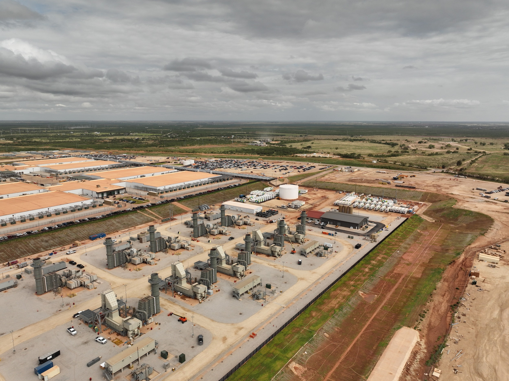

Abilene's gas-generation plant beside the data halls, in Oracle's aerial captioned July 15, 2026. [Oracle Data Centers: Abilene, Texas](https://www.oracle.com/data-centers/)

### Cooling: rejecting heat without evaporating water

The racks' heat must reach the outdoors, and a campus can choose among three routes. Direct dry cooling passes facility water through coils cooled by outdoor air, which works when the air is cool enough relative to the required water temperature. An air-cooled chiller uses refrigeration to make colder water and rejects its heat to outdoor air. A water-cooled chiller paired with a wet cooling tower rejects its heat through the tower, which evaporates water that has to be replaced. Here air-cooled describes the outdoor heat rejection; the GPUs themselves are still cooled by liquid through cold plates.

Crusoe chose air-cooled chillers on a closed loop of facility water, so heat rejection evaporates no water. It estimates about 50,000 gallons per building each year for maintenance and water quality, separate from the initial fill, and says it accepted higher lifecycle and maintenance costs “in the interest of responsible water management.” A wet tower lets a chiller condense at a lower temperature and so can use less compressor electricity, at the price of makeup water, water treatment and tower upkeep. Crusoe publishes no priced alternative or water-price assumptions, so the lifetime cost comparison stays open. Emissions from the on-site gas plant are a separate question from water use.

### Delivery: build in parallel, grow around live work

Crusoe built electrical equipment while the buildings went up. Its Impact Report describes in-house switchgear manufacture and prefabricated electrical skids for Abilene, and its September 14, 2026 release reports more than 2,500 switchboards supplied to Abilene from its Tulsa operations. Factory assembly and site construction proceed at the same time and meet at installation and testing. A factory-complete package still has to match its electrical interfaces and leave room for installation and maintenance before a hall can operate.

The campus also grew around live work. The first phase ran OpenAI workloads while construction continued toward eight buildings joined by an integrated network fabric. Each new phase has to connect its power, cooling and network to shared campus systems while the halls already in service keep running; the general engineering answer is to keep each new interface isolated until its phase is ready. Crusoe targeted the first two buildings for energization in the first half of 2025 and the six additional buildings for mid-2026. Oracle reported 75 percent of Abilene's total capacity delivered as of September 2026, with the rest expected in later quarters. Oracle leaves the basis of that percentage undefined, so converting it into megawatts requires an assumption about that basis.

Abilene data halls in Oracle's aerial captioned July 15, 2026. [Oracle Data Centers: Abilene, Texas](https://www.oracle.com/data-centers/)

### Capital: a hierarchy of deals

Three companies share the operating stack. Crusoe designs, builds and operates the physical campus. Oracle provides the GPU cloud infrastructure, and Crusoe's June 2026 announcement calls the 1.2 GW campus purpose built for Oracle. OpenAI runs training and inference on that infrastructure.

A joint venture sits at the base of the campus's capital stack. In October 2024 Crusoe, Blue Owl-managed funds and Primary Digital Infrastructure announced a $3.4 billion venture for the first phase: 206 MW in two buildings, fully leased long term to a hyperscale tenant the announcement did not name. In May 2025 the same partners announced the second phase, the six additional buildings, of a $15 billion joint venture to fund the 1.2 GW campus. The $15 billion is the venture's size; it is neither a GPU bill nor an amount to add to the earlier $3.4 billion. Blue Owl's funds supply institutional capital, the first phase also drew on construction financing, and Primary Digital co-sponsors the venture and advised on the first-phase transaction. The investors' return rests on the lease: long-term rent and the value of the property. Crusoe keeps the development and operating role, and Primary Digital describes its mission as buying stabilized assets so that developers can recycle capital into their next projects. Each partner's share, cash contribution, fees and target return remain private, so any estimate of a partner's return rests on assumptions.

Keep three budgets apart. The joint venture pays for the physical campus, Oracle pays for the GPU infrastructure it installs, and OpenAI pays Oracle for the compute it uses. Adding the venture's $15 billion to a GPU purchase or to OpenAI's cloud bill would count different layers of one system as a single sum.

### The data center is the machine

Read the campus outward from the rack. The GB200 workload sets requirements for power, cooling and fast connections. Across a hall, those become distribution and cooling systems serving rows of machines. Across the campus, they require substations, outdoor cooling, generation, land and financing. A hardware choice becomes a facility design. The course follows that design both ways: electricity from the site boundary to the chips, and heat from the chips back out.

### Worked example: How far does 350 MW of gas generation reach?

- On-site gas generation: 350 MW (Crusoe 2025 Impact Report).
- First phase: two buildings and 206 MW (Crusoe, October 2024). Full plan: eight buildings and 1,200 MW (Crusoe, March 2025).
- Oracle: 75 percent of total capacity delivered as of September 2026, on a basis it does not define.

1. First phase — 350 / 206 = 1.70 — On ratings alone, the plant is 1.7 times the first phase, so it could bridge that phase before the grid expansion.
2. Full plan — 350 / 1,200 = 0.29 — The plant's rating is about 29% of the planned campus.
3. Delivered share — 0.75 × 1,200 = 900 MW; 350 / 900 = 0.39 — This holds only if Oracle's percentage uses the same basis as the 1.2 GW plan, which Oracle does not say.

**Result:** The plant's rating can cover an early phase but is under a third of the full plan, so as backup it can carry only part of the planned campus unless load is reduced or other supply joins.

**Model boundary:** Ratings only, compared on the bases the sources publish, which they leave undefined (IT or facility, nameplate or available). Generator availability, fuel supply, transfer equipment and the loads a backup must carry are not public, so no Abilene backup design follows from these ratios.

### The tradeoff

Choice: Reject heat with air-cooled chillers instead of wet cooling towers.

Benefit: Heat rejection evaporates no water; Crusoe estimates about 50,000 gallons per building each year for maintenance and water quality, plus the initial fill.

Cost: Crusoe reports higher lifecycle and maintenance costs, and an air-cooled chiller can need more compressor electricity than one rejecting heat through a wet tower.

### Apply the idea

A news summary says Blue Owl paid for Abilene's GPUs. Which layer does the Blue Owl and Primary Digital venture fund, who supplies the GPU infrastructure, and what would you need before calculating any partner's return?

Reveal the worked answer

The venture funds the physical campus that Crusoe builds and operates. Oracle supplies the GPU cloud infrastructure, and OpenAI pays for the compute it uses. A partner's return needs its ownership share, cash contribution, fees and the lease terms, which the announcements do not disclose.

Facility financing, GPU investment and cloud spending are separate layers of the same campus. The lease links the first two: rent from the tenant supports the facility investors' return, while the tenant's hardware and customer contracts sit above it.

**The idea to keep:** A hardware choice becomes a facility design. At Abilene the GB200 workload set the power, cooling and network requirements, and gas generation, air-cooled chillers, factory-built electrical equipment and a lease-backed investment answer them.

### Sources

- [Crusoe — Flagship Abilene data center is live](https://www.crusoe.ai/resources/newsroom/crusoe-announces-flagship-abilene-data-center-is-live) — Crusoe · Published 2025-09-30 · Reviewed 2026-09-17. Construction began in June 2024, the first two buildings were energized within a year, and Oracle began delivering the first GB200 racks in June 2025; the first phase runs on OCI with early training and inference, within a planned eight-building campus on one integrated network fabric.
- [OpenAI: Five new Stargate sites](https://openai.com/index/five-new-stargate-sites/) — openai.com · Reviewed 2026-09-13. OpenAI says the flagship Abilene campus is running on OCI, that Oracle began delivering the first GB200 racks in June 2025, and that OpenAI has started early training and inference workloads there.
- [Crusoe — Expands AI data center campus in Abilene to 1.2 gigawatts](https://www.crusoe.ai/resources/newsroom/crusoe-expands-ai-data-center-campus-in-abilene-to-1-2-gigawatts) — Crusoe · Published 2025-03-18 · Reviewed 2026-09-17. Plans eight buildings and 1.2 GW, with the first two buildings and more than 200 MW targeted for energization in the first half of 2025 and six more buildings for mid-2026.
- [Crusoe 2025 Impact Report](https://media.ffycdn.net/us/crusoe/PL5TuZz5apXB9pVsd3H1.pdf) — Crusoe · Published 2026-05-28 · Reviewed 2026-09-26. Describes 350 MW of on-site gas generation at Abilene as temporary bridge power and long-term backup that replaces diesel backup, with selective catalytic reduction for nitrogen oxides (printed pp. 16, 19), and in-house switchgear and prefabricated electrical skids for the campus (p. 16).
- [Crusoe — Crusoe Opens Second Tulsa Manufacturing Facility](https://www.crusoe.ai/resources/newsroom/crusoe-opens-second-tulsa-factory-ai-infrastructure) — Crusoe · Published 2026-09-14 · Reviewed 2026-09-26. On September 14, 2026, Crusoe reported that its Tulsa operations had supplied more than 2,500 switchboards to the flagship Abilene site, among electrical equipment that includes medium-voltage switchgear, enclosures, controls and copper busbar.
- [Crusoe — Abilene cooling design](https://www.crusoe.ai/resources/blog/an-inside-look-at-the-abilene-ai-data-center) — Crusoe · Published 2025-08-05 · Reviewed 2026-09-12. Abilene uses closed-loop facility water and air-cooled chillers; Crusoe estimates about 50,000 gallons per building a year for maintenance and water quality and accepted higher lifecycle and maintenance costs to conserve water.
- [Trane — Air vs. Water Cooled Chillers](https://www.trane.com/commercial/north-america/us/en/about-us/newsroom/blogs/air-vs-water-cooled-chillers.html) — Trane · Published 2019-10-31 · Reviewed 2026-09-11. Air-cooled chillers avoid cooling-tower water treatment and tower maintenance; water-cooled systems can use less compressor energy.
- [Crusoe’s Contracted AI Infrastructure Capacity Approaches 5 Gigawatts Across Data Centers and Cloud](https://www.crusoe.ai/resources/newsroom/crusoes-contracted-ai-infrastructure-capacity-approaches-5-gigawatts-across-data-centers-and-cloud) — Crusoe · Published 2026-06-09 · Reviewed 2026-09-16. Crusoe calls the 1.2 GW Abilene campus purpose built for Oracle, among its projects contracted to hyperscale clients, and reports breaking ground on a separate 900 MW Abilene campus for Microsoft.
- [Crusoe — Crusoe, Blue Owl Capital and Primary Digital Infrastructure enter $3.4 billion joint venture](https://www.crusoe.ai/resources/newsroom/crusoe-blue-owl-capital-primary-digital-joint-venture) — Crusoe · Published 2024-10-15 · Reviewed 2026-09-26. On October 15, 2024, Crusoe, Blue Owl-managed funds and Primary Digital Infrastructure announced a $3.4 billion joint venture that jointly sponsors the first phase: a 206 MW, two-building data center that Crusoe designs, builds and operates, 100 percent leased long term to an unnamed Fortune 100 hyperscale tenant. Primary Digital describes its mission as buying stabilized assets from developers and operators so that they can recycle capital.
- [Crusoe — Crusoe, Blue Owl Capital and Primary Digital Infrastructure enter second phase of $15 billion joint venture](https://www.crusoe.ai/resources/newsroom/crusoe-blue-owl-capital-and-primary-digital-infrastructure-enter-joint-venture) — Crusoe · Published 2025-05-21 · Reviewed 2026-09-26. On May 21, 2025, Crusoe, Blue Owl-managed funds and Primary Digital Infrastructure announced the second phase, the six additional buildings, of a $15 billion joint venture to fund the 1.2 GW Abilene campus.
- [Kirkland & Ellis — Kirkland advises Blue Owl funds on JV and financing for development of Abilene data center](https://www.kirkland.com/news/press-release/2025/01/kirkland-ellis-advises-bo-funds-on-jv-and-financing-for-development-of-adc) — Kirkland & Ellis · Published 2025-01-23 · Reviewed 2026-09-26. The $3.4 billion first-phase joint venture closed alongside a $2.3 billion construction loan arranged by JPMorgan Chase, and Primary Digital Infrastructure facilitated and advised on the transaction.
- [Oracle Data Centers: Abilene, Texas](https://www.oracle.com/data-centers/) — Oracle · Reviewed 2026-09-17. Oracle reports 75 percent of total Abilene capacity delivered as of September 2026, with the rest in later quarters, and publishes campus and turbine-plant aerials captioned July 15, 2026.

## The servers stay powered. The service does not.

**16. Putting an AI Factory Together · Optional practice**

Combine a power budget, an energy budget and a separately supplied cooling path. Identify exactly what the evidence can establish.

**Driving question:** Can this facility sustain useful work through the specified utility interruption?

### Start with a dependency diagram, not a battery runtime

A hall is delivering a steady 2 MW information technology (IT) load, the power drawn by its servers, storage and network equipment, when its utility supply is interrupted. The IT bus has a battery inverter, but the facility-loop pumps are on a different electrical bus. The diagram in the project pack says redundant power; it does not state which auxiliaries share that redundancy. Your first task is to turn that phrase into a list of actual supply paths. Draw the IT bus, its battery path, the rack cooling devices, the facility-loop pumps, the heat-rejection plant and the controllers that coordinate them. Treat an untraced auxiliary as an unresolved dependency until its supply is shown.

The exercise provides a 2.5 MW inverter and 600 kWh of usable stored direct-current (DC) energy. The inverter converts it to alternating current (AC) for the IT bus, and this discharge path is 90% efficient at the stated operating point. The battery energy can therefore support the specified IT power for a bounded duration. Yet those two checks do not establish whether a thermal limit is reached first. The facility-loop pumps lose their supply immediately. Some components may retain electrical power and keep circulating a local loop while the downstream heat path has already stopped. A circulating local loop keeps warming until the path to the outdoor plant runs again.

### Write a timeline whose unknowns stay unknown

At time zero the utility path is lost. Assume, for this exercise only, that the IT inverter transfers without exceeding the IT equipment's allowed interruption. A separately supplied controller remains available and records the pump supply loss. At ten minutes the generator path is available, but an additional two minutes is required by the supplied restoration sequence before the full cooling path can be established. These are synthetic scenario inputs, not recommended switching delays or equipment guarantees. Keep the sequence as evidence to evaluate, not instructions to perform.

You can compare the twelve-minute electrical support requirement with the available energy: the restoration needs 2,000 kW × 0.2 h = 400 kWh of the battery's 540 kWh of AC energy. The heat has a number too. Over the same twelve minutes the racks turn those 400 kWh into heat, and with the facility-loop pumps unpowered that heat accumulates in the hall's coolant and equipment. For scale, 400 kWh is 1,440 megajoules (MJ), enough to warm 10 m³ of water by about 34 K. Whether the hall can absorb it depends on coolant inventory, operating temperatures, effective thermal capacities, flow after the disturbance, device limits and control behavior, so a safe twelve-minute thermal bridge can be calculated only once those are known. The correct engineering answer can therefore contain both a numerical pass and an unresolved service conclusion. Specify the missing measurements and an acceptance test that would resolve them. A decision to reduce workload should follow the actual operating limits and an authorized control sequence, which a battery calculation cannot supply.

### Worked example: Two passes do not establish service continuity

- Synthetic constant 2 MW IT load; no load shedding in the numerical calculation.
- 2.5 MW inverter, 600 kWh usable DC storage, 90% discharge-path efficiency.
- Cooling pumps lose power; the full restoration sequence takes 12 minutes. Thermal storage and limits are unspecified.

1. Check instantaneous power — 2.5 MW ≥ 2 MW — The stipulated inverter can supply the IT load at this operating point.
2. Convert stored energy to usable AC energy — 600 kWh × 0.90 = 540 kWh — Apply the stated discharge efficiency once.
3. Calculate ideal electrical duration — 540 kWh / 2,000 kW = 0.27 h = 16.2 min — Power and energy are checked at consistent boundaries.
4. Budget the restoration interval — 2,000 kW × (12/60) h = 400 kWh AC — The electrical inventory has 140 kWh AC remaining under the supplied assumptions.
5. State the service conclusion — Electrical support passes; thermal support is unestablished — The missing heat path prevents a justified claim of twelve minutes of useful operation.

**Result:** The IT electrical path has 16.2 ideal minutes, but the available data do not establish continued service for the twelve-minute restoration sequence.

**Model boundary:** No thermal transient, battery ageing, inverter overload curve, protective coordination or actual transfer performance is inferred.

### When the situation changes

Trigger: A project report substitutes the 16.2-minute battery duration for twelve minutes of service ride-through.

Mechanism: The racks keep turning 2 MW into heat while the facility-loop pumps are unpowered: over the 12-minute restoration that is 2,000 kW × 0.2 h = 400 kWh of heat with no path to the outdoor plant.

Response: Correct the report and require an integrated disturbance test that tracks coolant and device temperatures against their limits through the full 12-minute sequence.

### Apply the idea

A redesign places an additional 0.2 MW of required cooling auxiliaries on the same battery system. All energy and conversion assumptions remain fixed. What are the new power check and ideal duration? What conclusion still needs evidence?

Reveal the worked answer

2.2 MW is below the 2.5 MW inverter rating. Duration is 540/2,200 h = 14.73 minutes, approximately.

The energy margin shrinks because the battery now supports both loads. This can sustain the specified electrical loads for twelve minutes in the simplified model. Whether cooling, controls and IT stay within their actual transient operating limits still needs an integrated test and thermal evidence.

**The idea to keep:** Electrical ride-through is one dependency of continued service. It is not a prediction of thermal ride-through.

### Sources

- [Commissioning & Performance Validation | AI Data Center Energy Performance Framework](https://www.ashrae.org/technical-resources/ai-data-center-framework/commissioning-performance-validation) — ASHRAE · Reviewed 2026-09-06. ASHRAE's AI data-center framework guidance on commissioning and validating integrated facility performance.

## A hot day changes two limits at once

**16. Putting an AI Factory Together · Optional practice**

Reconcile the electrical and heat-removal constraints at two supplied operating points, then decide which proposed upgrade would actually help.

**Driving question:** How many complete rack equivalents remain supportable when weather changes cooling capacity and auxiliary power?

### Use paired operating points

A hypothetical site has a 100 MW electrical service limit and an accepted distribution path for 900 identical 100 kW rack equivalents. A rack equivalent is an accounting unit in this exercise, not a promise about real hardware composition or workload throughput. At the mild-weather operating point, the supplied plant table gives 70 MW of heat-removal capacity at the IT boundary and 15 MW of site auxiliary electricity. At the hot-weather point it gives 55 MW of IT heat-removal capacity and 25 MW of auxiliary electricity. Both points use the same required IT inlet conditions.

Do not infer the hot-weather point from an annual power usage effectiveness (PUE), the ratio of a year's total facility energy to its IT energy. The exercise supplies separate instantaneous cooling performance and auxiliary demand because they answer different questions. A real plant's electrical input generally changes with load as well as weather. For this exercise, treat the tabulated auxiliary demands as fixed over the evaluated load range and state that approximation. A detailed operating model would need matched performance curves and control sequences rather than independent sliders.

### Compare remedies against the constraint that matters

At each point, subtract the specified auxiliaries from the service limit to obtain the electrical budget available to IT. Compare that with the cooling limit and the accepted rack-path equivalent. The minimum bounds the supportable count. Taking an average across these constraints has no physical meaning: a rack cannot compensate for missing cooling by having extra network ports or unused feeder capacity. A selected count must satisfy every necessary path at once.

Now consider two proposals. One reduces hot-weather auxiliaries by 10 MW while leaving the 55 MW cooling limit unchanged. The other increases cooling to 65 MW while keeping the supplied 25 MW auxiliary demand. The first saves electricity at a given workload but does not increase the supportable rack count in this case. The second releases some of the binding constraint. Neither outcome is automatically the better investment: service demand, price, capital cost, maintenance and delivery timing determine value. The capstone asks you to distinguish a capacity benefit from an energy benefit before comparing their economics.

### Worked example: Reconcile every limit on the same rack basis

- Synthetic 100 MW site ceiling, 100 kW per rack equivalent, 900 accepted complete paths.
- Mild: 15 MW auxiliaries and 70 MW cooling at IT boundary. Hot: 25 MW auxiliaries and 55 MW cooling.
- Auxiliary values are fixed supplied operating-point inputs for this simplified case.

1. Accepted paths represent 900 × 0.1 MW = 90 MW of IT demand.
2. Mild electrical budget: 100 − 15 = 85 MW. Minimum of 85, 70 and 90 MW is 70 MW, or 700 racks.
3. Hot electrical budget: 100 − 25 = 75 MW. Minimum of 75, 55 and 90 MW is 55 MW, or 550 racks.
4. Reducing hot auxiliaries to 15 MW changes the electrical budget to 85 MW, but cooling still limits the case to 550 racks.
5. Raising hot cooling to 65 MW with 25 MW auxiliaries yields min(75,65,90) = 65 MW, or 650 racks.

**Result:** Hot weather reduces the simplified service envelope from 700 to 550 rack equivalents. The stated cooling upgrade recovers 100; the auxiliary-saving proposal recovers none but can save energy.

**Model boundary:** This is a supplied operating-point comparison, not a chiller-selection model or a measured site forecast. Reserve margins and local constraints must be added before real capacity allocation.

### The tradeoff

Choice: Fund the cooling upgrade or the auxiliary cut.

Benefit: The cooling upgrade adds 100 rack equivalents on a hot day, from 550 to 650; the auxiliary cut adds none.

Cost: The auxiliary cut saves 10 MWh of electricity in every hot-weather hour, which the cooling upgrade does not; choosing between them needs the value of added capacity and the price of energy.

### When the situation changes

Trigger: A vendor presents reduced auxiliary power as proof of more usable compute capacity.

Mechanism: In hot weather the cut raises the electrical budget from 75 to 85 MW, but cooling still binds at 55 MW, so the count stays at 550 rack equivalents.

Response: Recalculate the complete constraint table and distinguish energy savings, capacity gains and actual workload output.

### Apply the idea

Only 600 complete rack paths have been accepted when the 65 MW cooling upgrade becomes available. How many rack equivalents can be used? If demand is 58 MW IT, what is the facility draw under the fixed 25 MW auxiliary assumption?

Reveal the worked answer

Accepted paths now bind at 600 racks, or 60 MW. At 58 MW IT demand the model facility draw is 83 MW.

Installed cooling above 60 MW cannot create missing accepted paths. Actual draw follows the stated 58 MW demand plus auxiliaries; capacity is not the same quantity as demand. The fixed auxiliary approximation should be replaced with a load-dependent plant model for a real operating prediction.

**The idea to keep:** Find the binding constraint at the new operating point before choosing an upgrade.

### Sources

- [ASHRAE Handbook, Chapter 20: Data Centers and Telecommunication Facilities](https://handbook.ashrae.org/Handbooks/A23/SI/A23_Ch20/a23_ch20_si.aspx) — ASHRAE · Published 2023 · Reviewed 2026-09-11. ASHRAE Handbook chapter on data centers: thermal operating envelopes for IT equipment.

## The rack upgrade that does not fit the building

**16. Putting an AI Factory Together · Optional practice**

Compare two complete electrical ledgers, a cooling duty and a service-space requirement before choosing where conversion should happen.

**Driving question:** Does a lower-current rack-power architecture solve the actual retrofit constraint?

### Agree on an equal-load comparison

An existing room can supply 160 kW at the chosen AC feeder boundary and remove 140 kW of heat from the whole room at the stated ambient condition. A proposed rack needs 120 kW at its declared DC load boundary. Architecture A converts AC to that boundary at an assumed 96% efficiency inside the compute rack. Architecture B uses a sidecar conversion stage at an assumed 97%, followed by a near-load conversion stage at an assumed 98%. The sidecar occupies the last usable service bay. These assumptions describe a synthetic comparison; they are not efficiencies or dimensions of NVIDIA products.

Both architectures serve the same 120 kW DC load. Work backward through each conversion chain to find the AC demand. For B, the intermediate 800 V segment carries the input to the near-load converter, so its power is greater than the final 120 kW load. This detail matters: drawing 120 kW beside every box would hide the loss of the downstream stage. At 800 V that 122.449 kW is about 153 A. The same power on a 50 V rack bus would need about 2,449 A, sixteen times as much, and lower current allows smaller conductors, which is the appeal of the higher voltage. The ledger then decides whether that gain outweighs the extra conversion stage.

### Retained constraints can dominate a new interface

A sidecar can move power conversion, heat and maintenance access out of the compute rack. It does not necessarily remove those requirements from the room. Our room-level cooling boundary includes both the rack and the sidecar, so its total heat duty follows the total electrical input at steady state. If the sidecar were outside that boundary, the accounting would need to move with it. The same principle applies to upstream AC equipment: retaining the feeder also retains its capacity limit and relevant protection interfaces.

Before selecting B, ask whether the last service bay is needed to remove an existing uninterruptible power supply (UPS) module, handle a failed tray or maintain required access. A drawing that fits equipment rectangles inside the room can still fail the replacement route. Ask for connector definitions, polarity and grounding, fault-clearing behavior, cable/bus ratings, cooling connections, allowable load transients and the migration sequence. A vendor roadmap can motivate the comparison, but only an identified, compatible configuration can close these interfaces. Record missing answers rather than replacing them with an attractive generic rendering.

### Worked example: Close the ledger before celebrating the lower current

- Synthetic 120 kW final DC load. A: 96% conversion. B: 97% first stage and 98% near-load stage.
- Existing AC feeder limit 160 kW. Whole-room cooling limit 140 kW; no other room load in this simplified comparison.
- B's intermediate bus is specified as an 800 V conductor-to-return DC segment.

1. A needs 120/0.96 = 125 kW AC, with 5 kW conversion loss.
2. B's intermediate DC load is 120/0.98 = 122.449 kW. Its AC input is 122.449/0.97 = 126.236 kW.
3. B's 800 V segment carries 122,449/800 = 153.06 A, approximately. This is not current at the final device rail.
4. Both fit the 160 kW feeder and 140 kW whole-room cooling limits under the stated assumptions.
5. B uses about 1.236 kW more AC input in this synthetic comparison and consumes the service bay. Its lower distribution current alone cannot establish project superiority.

**Result:** Both candidates fit the supplied steady power and heat limits. The assumed sidecar chain has higher total conversion loss and an unresolved maintenance-space conflict.

**Model boundary:** No conductor, protection, grounding or thermal design is supplied. Efficiencies are fixed hypothetical operating points. The exercise compares mechanisms, not available products or installation procedures.

### The tradeoff

Choice: Move conversion to a sidecar while retaining upstream AC.

Benefit: Conversion, its heat and its maintenance move out of the compute rack, and the 800 V segment carries about 153 A for the 120 kW load.

Cost: The two-stage chain draws 126.236 kW of AC against 125 kW for A, about 1.236 kW more, and the sidecar takes the last service bay; the retained AC feeder and room cooling limits still apply.

### When the situation changes

Trigger: The sidecar fits on a layout plan but blocks the required replacement route.

Mechanism: A dense installation becomes unmaintainable without shutting down or removing adjacent equipment.

Response: Resolve the service envelope and change-control interfaces before procurement; do not count nominal floor area as usable access.

### Apply the idea

The final DC load rises to 135 kW. Keep all efficiencies and room limits fixed. Does either architecture fit the 140 kW room cooling limit? What additional information is needed to compare annual energy?

Reveal the worked answer

A draws 140.625 kW; B draws about 142.016 kW. Both exceed the supplied room cooling limit, although both remain below the 160 kW feeder limit.

Raising density moves the binding constraint to whole-room heat rejection. Annual energy comparison needs a load-duration profile and efficiency curves, plus other included auxiliary losses. Multiplying a single rated point by a year silently assumes continuous operation at that point.

**The idea to keep:** An architecture improves a project only through the interfaces and constraints that matter to that project.

### Sources

- [Why Scaling AI Compute Performance Requires a New Power Architecture](https://blogs.nvidia.com/blog/800-vdc-power-architecture-ai-factory/) — NVIDIA · Published 2026-08-11 · Reviewed 2026-09-06. NVIDIA describes hybrid power-rack, row-level and broader facility DC directions for 800 V power in AI factories.

## The powered cluster that keeps waiting

**16. Putting an AI Factory Together · Optional practice**

Trace a payload from sender through fabric to receiver, compare two upgrades, and test the predicted gain against end-to-end progress.

**Driving question:** Which physical segment limits communication, and would upgrading it shorten the complete job cycle?

### Name what the job is waiting for

A hypothetical distributed job repeats a serial cycle: 60 seconds of useful compute, a communication phase, and 10 seconds of other fixed work. The supplied application trace shows no overlap. The same work completes each cycle. Every device remains allocated throughout, including the waiting time; allocation therefore does not establish useful progress. Keep the compute duration and the other work fixed while testing the communication path.

The communication phase moves one supplied 800-gigabyte (GB) payload through a sender, a fabric bottleneck and a receiver. Their achieved payload-rate limits are 80, 40 and 80 GB/s respectively. The path is limited to 40 GB/s, so the transfer takes 20 seconds. These decimal payload units and effective rate limits are original scenario inputs. They are not advertised port speeds or measurements of a named platform. A real collective may add rounds, shared traffic and synchronization; the single-payload model applies only to the declared transfer here.

### Make a falsifiable improvement prediction

Proposal E doubles the sender rate limit from 80 to 160 GB/s while the 40 GB/s fabric bottleneck and 80 GB/s receiver remain unchanged. Proposal F doubles the fabric bottleneck to 80 GB/s, keeping both endpoints unchanged. Predict the achieved path rate, the communication interval and the complete cycle for each proposal before inspecting the result. Improving the sender leaves a slower segment downstream; improving the fabric releases the binding constraint in this supplied path.

Amdahl's law gives the size of the gain. If a part of a serial task takes a fraction p of the time and becomes s times faster, the whole task speeds up by 1 / ((1 − p) + p/s). Communication takes 20 of the 90 seconds, so p = 2/9, and Proposal F doubles its rate: 1 / (7/9 + 1/9) = 9/8 = 1.125, the change from a 90-second to an 80-second cycle. Even infinitely fast communication would leave 70 seconds of compute and other work, which caps any fabric upgrade at 90/70, about 1.29 times the baseline cycle throughput.

After the change, measure the same payload across the complete path and align that measurement with the application trace. An end-to-end rate of 40 GB/s still predicts a 20-second communication phase and a 90-second cycle. A rate of 80 GB/s predicts 10 seconds and an 80-second cycle. If those intervals do not match, investigate another bottleneck, changed synchronization, a different payload or a broken no-overlap assumption. Verify correct output as well as completion time. A link negotiating its new speed does not by itself establish the payload rate or useful job throughput.

### Worked example: Compare an endpoint upgrade with a bottleneck upgrade

- Original serial cycle: 60 s useful compute, one 800 GB communication phase, then 10 s other fixed work; no overlap.
- Achieved payload-rate limits: sender 80 GB/s, fabric bottleneck 40 GB/s, receiver 80 GB/s.
- E doubles only the sender limit; F doubles only the fabric bottleneck. Work per cycle stays fixed.

1. Baseline path rate is min(80, 40, 80) = 40 GB/s. Communication takes 800/40 = 20 s.
2. The complete baseline cycle is 60 + 20 + 10 = 90 s. Useful-compute share is 60/90 = 66.7%.
3. E gives min(160, 40, 80) = 40 GB/s. Communication and the 90 s complete cycle are unchanged.
4. F gives min(80, 80, 80) = 80 GB/s. Communication takes 10 s, and the complete cycle takes 80 s.
5. With fixed work per cycle, F produces 90/80 = 1.125 times baseline cycle throughput: a 12.5% gain. Doubling one phase rate does not double useful job throughput: by Amdahl's law, the gain is limited by the 20 of 90 seconds that communication takes.

**Result:** The fabric intervention saves ten seconds per cycle; the sender intervention saves none on this path. Verify the changed end-to-end rate, phase time and correct output.

**Model boundary:** All payloads, achieved rate limits and phase times are original teaching inputs. The model excludes overlap, collective algorithm details, startup and failure recovery. No rack-power rating, advertised floating-point operations per second (FLOPS) or generic utilization counter is converted into useful output.

### The tradeoff

Choice: Pay for fabric upgrade F rather than sender upgrade E.

Benefit: The cycle falls from 90 s to 80 s, so the job completes 12.5% more cycles in the same time; E saves nothing.

Cost: Doubling the fabric rate buys a 1.125-times cycle gain, and no fabric upgrade, however fast, can exceed 90/70, about 1.29 times, while the 60 s of compute and 10 s of other work stay fixed.

### When the situation changes

Trigger: The new link reports its higher speed, but the complete job cycle remains at 90 seconds.

Mechanism: The achieved payload rate may still be limited by another segment, shared traffic or synchronization; the negotiated link rate is not the end-to-end rate.

Response: Measure the same payload at the path endpoints, align the compute and communication intervals, and check the changed configuration and correct output against the prediction.

### Apply the idea

After the fabric upgrade, a receiver-side limit of 50 GB/s is discovered. The sender and fabric can each deliver 80 GB/s. With the same payload and serial phases, what are the new communication and cycle times? Which path segment should be investigated next?

Reveal the worked answer

The path rate is min(80, 80, 50) = 50 GB/s. Communication takes 800/50 = 16 s, and the complete cycle takes 60 + 16 + 10 = 86 s. The receiver side is now binding.

The bottleneck moves when one segment improves. The cycle-throughput gain is 90/86, about 1.047 times baseline; further sender or fabric upgrades cannot remove the supplied receiver limit.

**The idea to keep:** A job's critical path is a time budget. Improve the segment that governs completion and measure whether the expected gain appears.

### Sources

- [NVIDIA DGX SuperPOD — Network Fabrics](https://docs.nvidia.com/dgx-superpod/reference-architecture-scalable-infrastructure-h100/latest/network-fabrics.html) — docs.nvidia.com · Reviewed 2026-09-16. NVIDIA's DGX SuperPOD H100 reference architecture describes compute-fabric endpoint connections, switches and inter-switch paths.

## Open one phase, with evidence

**16. Putting an AI Factory Together · Optional practice**

Reconcile installation, energization, integrated testing and service acceptance. Build a dependency schedule without treating announcements as operational measurements.

**Driving question:** Which racks can be counted as accepted service, and what must happen before the next phase opens?

### A campus total can hide incomplete paths

A campus has 1,000 rack locations, 800 installed racks and an energized 100 MW site service. Each rack counts as a 100 kW rack equivalent, so the 800 installed racks come to 80 MW and leave 20 MW of the service for cooling and other auxiliaries, which this exercise assumes is enough. The 1,000 locations measure floor space: filled at 100 kW they would take the whole 100 MW and leave nothing for auxiliaries. On a day when auxiliaries need 25 MW, as in the hot-day case of the weather exercise, the same service carries 750 racks, so the site's power budget belongs in the ledger beside the test results.

The handover register splits the installed racks into three groups. Group A's 300 racks have passed the complete electrical, cooling, network, controls and end-to-end service acceptance package. Group B's 250 racks have passed their electrical tests and the integrated cooling test, but their network interface work and end-to-end acceptance are still open. Group C's 250 racks have passed their electrical tests and completed their network interface work, but their integrated cooling test remains open.

Create separate columns for installed equipment, energized paths, individual tests, integrated tests and service acceptance, then count the subsystem columns. Electrical tests have passed on all 800 racks, the integrated cooling test on 550 (groups A and B) and network interface work on 550 (groups A and C). Taking the smallest column gives 550, but the two 550-rack columns overlap only in group A, so just 300 racks appear in all three. Acceptance counts that intersection: the racks whose every path for the service has passed. The project can report 800 installed racks, and its accepted computing capacity is 300 racks, or 30 MW.

### Distinguish a schedule calculation from a public-site inference

Group B’s remaining network interface work can begin immediately and takes four days. End-to-end acceptance testing then takes two days. Group C needs a replacement cooling component delivered in three days, one day of installation, and three days of integrated cooling testing, with each task depending on the preceding one. Assume the supplied durations hold, groups can proceed independently, and qualified teams and all other resources are available. These assumptions make a small dependency schedule calculable. Actual projects require resource, uncertainty and change-control analysis beyond this exercise.

Apply the same ledger to a named campus using only its dated public record. At Abilene, Crusoe reported the first two buildings energized within a year of the June 2024 construction start, and Oracle reported 75 percent of total capacity delivered as of September 2026. Each statement belongs in its own column: an energization report and a customer-delivery share are milestones, not entries in an acceptance register, and neither says which racks passed integrated testing. Leave Abilene's unreported commissioning state, demand and topology blank. The 300, 250 and 250-rack groups and the six- and seven-day schedules belong to this exercise alone.

### Worked example: Count the intersection and trace the dependencies

- Synthetic groups A/B/C contain 300/250/250 installed racks, each represented by 100 kW. The 100 MW service leaves 20 MW for auxiliaries at the 80 MW of installed racks, which is assumed enough.
- Only A has passed the complete service acceptance package. B has passed electrical and integrated cooling tests; C has passed electrical tests and finished network interface work.
- B: four days of network interface work then two days of end-to-end acceptance testing. C: three days delivery, one day installation, then three days integrated cooling testing.

1. Intersect the subsystem columns: electrical {A, B, C}, integrated cooling {A, B} and network {A, C} share only A. The smallest column holds 550 racks; the intersection holds 300.
2. Accepted service today: 300 × 100 kW = 30 MW of rack-equivalent demand. Installed inventory is separately 800 racks or 80 MW at the stated load.
3. B's acceptance path takes 4 + 2 = 6 days. On successful completion, accepted service becomes 550 racks or 55 MW.
4. C's acceptance path takes 3 + 1 + 3 = 7 days. On successful completion, accepted service becomes 800 racks or 80 MW.
5. The earliest all-group acceptance is day seven under the supplied independent-resource assumptions. The longest single activity is not the same as the longest dependency chain.
6. Every projected increase remains conditional on test success and the stated supply/resource assumptions. A failed test changes the schedule rather than being averaged into an accepted count.

**Result:** The evidence supports 300 accepted racks now, a conditional 550 by day six and a conditional 800 by day seven. Installed, energized and future figures remain separate.

**Model boundary:** Synthetic schedule and acceptance register. No named project's operating state, redundancy certification, installed graphics processing unit (GPU) count or measured demand is inferred.

### The tradeoff

Choice: Open accepted group A while completing groups B and C.

Benefit: 300 racks, 30 MW of rack-equivalent demand, serve from day 0 instead of waiting until day 7 for all 800.

Cost: The network interface work on B and the cooling-component replacement on C happen beside a live group, so isolation, access and change control must keep group A within its accepted conditions.

### When the situation changes

Trigger: An executive summary reports 80 MW live because 800 racks are installed and the site service is energized.

Mechanism: The summary collapses equipment inventory and complete service acceptance into one capacity label.

Response: Replace the single number with the evidence ledger, identify open tests and report conditional future milestones separately.

### Apply the idea

Group C's integrated test fails on day seven. Correction requires two days followed by a three-day retest. B succeeds on day six. Assuming correction starts immediately after the failure, what can be reported on day eight and when could all 800 racks first be accepted?

Reveal the worked answer

On day eight, 550 racks are accepted under the scenario. C can first be accepted on day twelve: day seven plus two correction days plus three retest days.

Failed acceptance does not add usable service, although the hardware remains installed. Group B's successful path is unaffected by assumption; any shared dependency would require revising that independence claim. The day-twelve date remains conditional on successful correction, retest and resource availability.

**The idea to keep:** Count complete accepted paths for a specified service; maintain a separate ledger for future capacity and unresolved public claims.

### Sources

- [Commissioning & Performance Validation | AI Data Center Energy Performance Framework](https://www.ashrae.org/technical-resources/ai-data-center-framework/commissioning-performance-validation) — ASHRAE · Reviewed 2026-09-06. ASHRAE's AI data-center framework guidance on commissioning: testing and handover as steps after installation.
- [Oracle Data Centers: Abilene, Texas](https://www.oracle.com/data-centers/) — Oracle · Reviewed 2026-09-17. Oracle reports 75 percent of total Abilene capacity delivered as of September 2026, with the rest in later quarters.
- [Crusoe — Flagship Abilene data center is live](https://www.crusoe.ai/resources/newsroom/crusoe-announces-flagship-abilene-data-center-is-live) — Crusoe · Published 2025-09-30 · Reviewed 2026-09-17. The first two Abilene buildings were energized within a year of the June 2024 construction start.

## Inside a GB300 compute tray

**Compute and memory — further reading**

Locate the central processing unit (CPU), graphics processing unit (GPU), high-bandwidth memory (HBM) and rack interconnect in a GB300 NVL72, then distinguish memory capacity from the paths that supply computation.

**Driving question:** Which hardware and data transfers let a powered rack produce tokens?

### Begin with a rack, then open one compute tray

The electrical journey has reached the rack. This lesson follows the hardware that uses that power: processors perform operations, memories hold the operands and execution state, and links carry data between them. The recurring example is NVIDIA’s GB300 NVL72. Its 18 compute trays contain four Blackwell Ultra GPUs and two Grace CPUs each: 72 GPUs and 36 CPUs in one rack. Nine NVLink switch trays connect the GPUs over NVLink, NVIDIA’s direct GPU-to-GPU interconnect. A compute tray runs its own operating-system image; the shared rack fabric connects multiple such systems.

Keep the physical hierarchy visible as the view changes. One Grace Blackwell Ultra superchip combines one Grace CPU with two GPUs; two of those groups occupy a compute tray. A Blackwell Ultra GPU itself contains two compute dies that appear to CUDA, NVIDIA’s GPU programming platform, as one accelerator. Thus a die, a GPU, a superchip, a compute tray and a rack describe different assemblies. Counting the two dies as two schedulable GPUs would double the inventory incorrectly.

### The CPU prepares and coordinates work; the GPU executes parallel kernels

A CPU can run the serving process, prepare inputs, launch GPU kernels and coordinate the application. For a large language model (LLM) request, tokenization turns text into token IDs; software arranges the tensors and chooses the execution plan. Many large arithmetic operations then run on GPU Tensor Cores, which accelerate matrix multiply-accumulate. Other GPU execution units handle work that does not map to those matrix operations. A network interface card (NIC) connects the tray to an external network, and local solid-state storage on the NVMe (Non-Volatile Memory Express) interface can cache data or hold the operating system.

This is a division of responsibilities, not a requirement that every byte be copied through the CPU. The actual software and input/output (I/O) path determine which preparations run on the host and which transfers can bypass intermediate copies. To diagnose a slow rack, identify the operation waiting and the resource supplying it: host preparation, device memory, a peer GPU, or a remote service.

### HBM is attached to the GPU package, close to its compute dies

HBM means high-bandwidth memory. In this GPU family, stacked DRAM (dynamic random-access memory) sits beside the compute dies within the package, with many short parallel connections. The package arrangement provides the wide interface needed to feed the arithmetic units. HBM still stores data outside the compute dies; cache and other on-chip storage can keep reused operands closer. Moving an operand from HBM and reusing it locally are different amounts of traffic at the HBM boundary.

NVIDIA specifies up to 288 GB HBM3e and up to 8 TB/s of HBM bandwidth per Blackwell Ultra GPU. Capacity is a quantity of data; bandwidth is a transfer rate. These are platform specifications. The transfer account below uses 8 TB/s as a ceiling, not an observed sustained rate. A product implementation can differ: Lenovo’s GB300 NVL72 product guide, updated August 30, 2026, lists 7.7 TB/s for its configuration.

### Follow three distinct paths to the arithmetic

For data resident in local HBM, the path is HBM → GPU memory system → execution units. For data resident in CPU memory, the path includes the coherent NVLink-C2C (chip-to-chip) connection between CPU and GPU. For data on a peer GPU, the path includes that peer’s memory and the rack’s NVLink switching fabric. Coherency permits direct addressing across the CPU/GPU boundary; it does not make all physical memory equally fast.

The NVLink 5 figure of 1.8 TB/s per GPU adds the two transfer directions across all of that GPU’s links. It is neither a separate 1.8 TB/s pipe to every peer nor directly comparable with a one-direction transfer measurement. The 72-GPU rack has an advertised aggregate memory bandwidth of up to 576 TB/s because many local HBM interfaces operate in parallel. A single tensor operation does not automatically receive that aggregate rate. Its partitioning and placement determine which interfaces participate.

### Use a transfer account to connect bytes with time

Suppose an operation must read 144 GB across one GPU’s HBM interface. At an 8 TB/s transfer ceiling, the read alone requires at least 144 × 10⁹ / (8 × 10¹²) = 0.018 seconds, or 18 ms. GB and TB here use decimal powers of ten, as in the International System of Units (SI). Increasing memory capacity while leaving the traffic and bandwidth unchanged does not lower that bound. Reducing the traffic through reuse, or increasing bandwidth, can.

The 144 GB account is chosen to isolate one mechanism; it is not a model checkpoint or one token’s measured traffic. A generated token requires an execution graph, including arithmetic, cache activity and often communication. Converting the 18 ms into a token rate would require establishing how often this transfer occurs and which other dependencies remain. Capacity comes first when a placement cannot fit; transfer time becomes the next question once that placement is feasible.

### Worked example: What can an 8 TB/s HBM interface tell us?

- One operation reads 144 GB from local HBM; all numbers use SI bytes.
- The transfer-rate ceiling is 8 TB/s; the read is not already served by cache.
- We isolate HBM traffic before adding arithmetic and communication.

1. Count bytes at the chosen interface — 144 GB = 144 × 10⁹ bytes — Count actual HBM reads, not every logical reuse of the data.
2. Divide traffic by bandwidth — 144 × 10⁹ / (8 × 10¹²) = 0.018 s = 18 ms — This is the minimum read duration under the stated ceiling.
3. Test a capacity-only upgrade — 144 GB / 8 TB/s = 18 ms — Additional capacity can enable a larger resident working set but does not change this fixed read.
4. Test eliminating half the HBM traffic — 72 GB / 8 TB/s = 9 ms — The improvement requires actual reuse or removal of transfers at this boundary.

**Result:** The useful performance question is how many bytes cross which interface, not merely how many bytes the rack can store.

**Model boundary:** NVIDIA gives the up-to-8-TB/s platform figure. The 144 GB traffic account is assumed for the example; these are transfer bounds, not token rates.

### When the situation changes

Trigger: A deployment fits its state by moving frequently read tensors from HBM to CPU memory.

Mechanism: The address remains accessible, but repeated accesses now traverse the CPU/GPU path.

Response: Identify the tensors and measured traffic crossing that path, then compare placement, reuse and partitioning options.

### Apply the idea

A workload fits in HBM but spends most of its time repeatedly reading the same weights from it. Which evidence would make local reuse a better candidate than buying a larger memory capacity?

Reveal the worked answer

Show that the working set already fits and that the implementation rereads weights across the HBM interface when it could reuse them in faster local storage.

A larger capacity removes no transfer by itself. A changed kernel or execution grouping must reduce measured HBM traffic without changing the required output or exceeding available local storage.

**The idea to keep:** Where a tensor resides determines which memory or interconnect must supply it to the GPU.

### Sources

- [NVIDIA DGX GB Rack Scale Systems — Hardware](https://docs.nvidia.com/dgx/dgxgb200-user-guide/hardware.html#power-shelves) — NVIDIA · Reviewed 2026-09-17. DGX GB300 rack, compute-tray, rear-interface and switch-tray organization.
- [NVIDIA GB300 NVL72 — Specifications](https://www.nvidia.com/en-us/data-center/gb300-nvl72/) — NVIDIA · Reviewed 2026-09-14. The named platform contains 72 GPUs and 36 CPUs; advertised rack GPU memory bandwidth is up to 576 TB/s in aggregate.
- [NVIDIA — Inside Blackwell Ultra](https://developer.nvidia.com/blog/inside-nvidia-blackwell-ultra-the-chip-powering-the-ai-factory-era/) — NVIDIA · Published 2025-08-22 · Reviewed 2026-09-14. Two dies form one CUDA accelerator; up to 288 GB HBM3e and 8 TB/s per GPU; NVLink 5 bandwidth is 1.8 TB/s bidirectional per GPU.
- [NVIDIA — Memory management on hardware-coherent platforms](https://developer.nvidia.com/blog/understanding-memory-management-on-hardware-coherent-platforms/) — NVIDIA · Published 2025-10-14 · Reviewed 2026-09-14. GB300 CPU and GPU memory can be directly addressed across NVLink-C2C while retaining different physical locations and management behavior.
- [Lenovo NVIDIA GB300 NVL72 Rack Scale AI Product Guide](https://lenovopress.lenovo.com/lp2357-lenovo-nvidia-gb300-nvl72-rack-scale-ai) — Lenovo Press · Published 2026-08-30 · Reviewed 2026-09-17. Lenovo’s GB300 NVL72 configuration lists 7.7 TB/s of GPU memory bandwidth.

## Choose the upgrade that removes the active limit

**Compute and memory — further reading**

Derive arithmetic intensity and a roofline bound, then diagnose which resource upgrade changes the operation’s completion time.

**Driving question:** Would this operation benefit from more arithmetic, more memory bandwidth, or less data movement?

### A matrix multiplication explains why reuse matters

For C = A × B, with A shaped M × K and B shaped K × N, there are M × N output elements. Each output combines K products. With the conventional multiply-add accounting, the operation count is approximately 2MKN FLOP: one multiplication plus one addition is two floating-point operations. FLOP counts work; FLOP/s measures its execution rate. This convention lets us connect a named operation to a rate rather than treating an advertised FLOPS number as tokens per second.

One weight tile can contribute to several output elements after being fetched into local storage. If the implementation rereads that tile from high-bandwidth memory (HBM) for every output, traffic rises. If it reuses the tile locally, more arithmetic occurs per byte crossing HBM. Input shape, tile size, available storage and parallelism determine what reuse is possible. Reuse is the mechanism; a larger batch is only one way an application might expose it.

Apply 2MKN to 16-bit values, two bytes each. Multiplying a 4,096 × 4,096 weight matrix by a single vector (N = 1), as a model does when it generates one token for one request, performs 2 × 4,096² ≈ 33.6 million FLOP while reading the 33.6 MB matrix once: about 1 FLOP per byte. Multiplying two 4,096 × 4,096 matrices performs 2 × 4,096³ ≈ 137 billion FLOP over about 101 MB of inputs and output: about 1,365 FLOP per byte. The same weights do over a thousand times more arithmetic per byte when many vectors share them.

### Define the two time accounts

Let W be the operation count in FLOP, F the available arithmetic rate in FLOP/s, Q the bytes moved across the selected HBM boundary, and R that boundary’s bandwidth in bytes/s. The arithmetic time is bounded below by W/F; the memory time by Q/R. With ideal overlap, completion cannot be faster than max(W/F, Q/R). A fully serial model uses their sum. A real dependency schedule can fall between these accounts or take longer because of additional work.

The model below assigns 200 TFLOP/s (200 × 10¹² FLOP/s) to dense matrix arithmetic in BF16, a 16-bit floating-point format, with FP32 (32-bit floating-point) accumulation and 8 TB/s to HBM traffic. The compute rate is a teaching assumption for this instruction mix, not the peak rating of a GB300. Both rates are held constant to isolate the comparison. If effective rates are measured instead, the workload shape, numerical format, clocks and measurement boundary must remain part of that record.

### Derive the roofline from the time bound

Arithmetic intensity I = W/Q is the number of FLOP performed per byte moved across HBM. Dividing work by the idealized elapsed time gives a throughput ceiling of min(F, R × I). On a graph of FLOP/s against FLOP/byte, the bandwidth-limited line rises with I until it meets the horizontal compute ceiling. Their intersection, the ridge point, is I = F/R. This graph is called the roofline model.

With 200 × 10¹² FLOP/s and 8 × 10¹² bytes/s, the intersection is 25 FLOP/byte. At 10 FLOP/byte, the bandwidth ceiling is 8 × 10¹² × 10 = 80 TFLOP/s. Above the intersection, adding memory bandwidth does not raise this model’s 200 TFLOP/s compute ceiling. Moving right through better reuse can help a bandwidth-limited operation; raising the wrong ceiling cannot. In this model the two products from the matrix section sit on opposite sides of the ridge: the matrix-vector product, at about 1 FLOP/byte, can reach only 8 TFLOP/s, while the matrix-matrix product, at about 1,365 FLOP/byte, runs into the 200 TFLOP/s compute ceiling. In the lab below, the worked example’s operation, 2 × 10¹² FLOP over 160 GB, is 12.5 FLOP/byte, so its bandwidth ceiling is 8 × 10¹² × 12.5 = 100 TFLOP/s, which completes 2 × 10¹² FLOP in the same 20 ms as the HBM account.

### Read numerical formats before comparing compute ratings

A peak rate must name both the operation and numerical format. Dense BF16, FP8 and FP4 (16-, 8- and 4-bit floating-point) matrix arithmetic are different claims; sparse throughput assumes a supported sparsity pattern and an implementation that can exploit it. Multiplying the advertised sparse peak by runtime does not establish that many useful dense operations. Likewise, shrinking tensor precision changes more than capacity: it can change traffic, available instructions and the numerical behavior of the model.

For a purchase comparison, keep the required output quality and workload configuration explicit, then measure the achieved operation or service rate. The roofline is useful for predicting which resource to examine, but insufficient parallelism, irregular access, launch overhead and dependencies can leave execution well below either ceiling. A high arithmetic intensity alone does not guarantee that the GPU is busy.

### Communication can become the exposed dependency

The local HBM model stops at the GPU boundary. If results must be exchanged with peers before the next layer can begin, that exchange enters the critical path. For example, 100 ms of computation followed by 50 ms of unavoidable exchange takes 150 ms. Halving computation reduces the total to 100 ms. The exchange now occupies half the step, so another arithmetic upgrade has a smaller effect unless the communication or dependency schedule also changes. This is Amdahl’s law: speeding up one part improves the whole only in proportion to that part’s share of the time. Computation was two-thirds of the 150 ms step, so doubling its speed gives 1 / (1/3 + 2/3 ÷ 2) = 1.5 times, and even infinitely fast arithmetic could not beat the 50 ms exchange, a limit of three times.

Return to the outcome that matters: a rack earns useful throughput by completing the required execution graph. Neither installed megawatts nor a sum of chip peaks supplies the missing operation counts, traffic or synchronization schedule. Those measurements establish whether another GPU, more HBM bandwidth, a different kernel, or a better network path is the relevant next change.

### Worked example: A memory-bound operation and two upgrades

- The operation performs 2 × 10¹² FLOP of dense BF16 matrix arithmetic with FP32 accumulation and transfers 160 GB across HBM.
- Its live state fits. Assigned rates are 200 TFLOP/s and 8 TB/s; compute and HBM traffic overlap ideally.
- Upgrades change only one assigned rate; operation count and traffic remain fixed.

1. Account for computation — 2 × 10¹² / (200 × 10¹²) = 0.010 s = 10 ms — The arithmetic account is shorter than the HBM account.
2. Account for HBM traffic — 160 × 10⁹ / (8 × 10¹²) = 0.020 s = 20 ms — With ideal overlap, 20 ms is the active bound.
3. Double the compute rate — max(5 ms, 20 ms) = 20 ms — Faster arithmetic does not shorten the unchanged memory transfer.
4. Double the HBM bandwidth — max(10 ms, 10 ms) = 10 ms — The changed resource removes the active limit until the two accounts meet.

**Result:** For this operation, the bandwidth upgrade changes the bound; the compute upgrade does not. Reducing actual HBM traffic could address the same limit.

**Model boundary:** The compute rate and workload account are assumed for the example. Full overlap gives an optimistic bound; network time, software overhead and contention are outside this account.

### The tradeoff

Choice: Reuse a matrix tile for more arithmetic before replacing it.

Benefit: Increase FLOP per byte transferred from HBM, potentially moving the operation out of the bandwidth-limited regime.

Cost: Consume local storage and possibly alter occupancy or scheduling; validate the whole kernel rather than only its traffic count.

### When the situation changes

Trigger: An optimized kernel reduces HBM traffic but exposes too little concurrent work.

Mechanism: The arithmetic-intensity calculation improves while execution units remain underused.

Response: Compare actual memory traffic, achieved arithmetic rate and dependency timing before attributing the slowdown to hardware capacity.

### Apply the idea

A second operation moves the same 160 GB but performs 40 × 10¹² FLOP at the original rates. Which of the two upgrades should you test first, and what would make the prediction fail?

Reveal the worked answer

The arithmetic account is 200 ms and HBM is 20 ms. Doubling compute reduces the bound to 100 ms; doubling HBM leaves it at 200 ms. Test compute first.

The recommendation changes with the operation, even on unchanged hardware. It could fail if the assumed arithmetic rate cannot be sustained, another dependency dominates, or the upgrade changes the execution plan and traffic. Measure those quantities rather than treating the bound as a benchmark.

**The idea to keep:** An upgrade helps when it changes a limit on the operation’s critical path.

### Sources

- [GPU Performance Background User’s Guide](https://docs.nvidia.com/deeplearning/performance/dl-performance-gpu-background/index.html) — docs.nvidia.com · Reviewed 2026-09-14. Compute and memory time bounds, arithmetic intensity and the role of sufficient parallelism; multiply-add counts as two floating-point operations.
- [Matrix Multiplication Background User’s Guide](https://docs.nvidia.com/deeplearning/performance/dl-performance-matrix-multiplication/index.html) — docs.nvidia.com · Reviewed 2026-09-14. Matrix dimensions, tiling and operand reuse explain changes in arithmetic intensity.
- [NVIDIA — Inside Blackwell Ultra](https://developer.nvidia.com/blog/inside-nvidia-blackwell-ultra-the-chip-powering-the-ai-factory-era/) — NVIDIA · Published 2025-08-22 · Reviewed 2026-09-14. Two dies form one CUDA accelerator; up to 288 GB HBM3e and 8 TB/s per GPU; NVLink 5 bandwidth is 1.8 TB/s bidirectional per GPU.

## A rack’s repair boundary changes its usable job capacity

**Compute and memory — further reading**

Connect the GB300 physical interfaces to service work, then use a controlled failure-placement example to distinguish healthy devices from feasible jobs.

**Driving question:** What happens to useful work when a tray or shared rack interface becomes unavailable?

### Separate the physical assembly from the job allocation

In the GB300 NVL72, four GPUs share a compute tray with CPUs and other components. Each GPU connects through the NVLink switch fabric to peers in the rack. A compute tray, a 72-GPU communication domain and an application’s tensor-parallel group are therefore different boundaries. A job may use a subset of the rack or span multiple racks, depending on its software and communication needs.

This distinction matters during service. Removing a tray removes its local components from availability. The jobs affected depend on which of those components they use, what shared dependencies were disturbed and whether the software can remap or restart. It does not follow that every GPU in the rack physically fails when one tray is unavailable, or that every job can continue unchanged.

### The rack must meet several facility interfaces at once

Rack integration concentrates power, heat and service work. The electrical inlet must supply the intended load; coolant connections must serve the cold plates; airflow must still remove heat from air-cooled parts; and the network and management interfaces must be accessible. A power allocation alone establishes none of the hydraulic, spatial or software conditions. For the recurring Abilene campus, published capacity milestones do not establish a specific GB300 rack inventory or those as-built interfaces.

Lenovo’s named compute tray weighs 29 kg and combines liquid-cooled high-power components with air-cooled supporting parts. Its removal procedure calls for tray power-off, disconnection and appropriate lifting and coolant-service equipment. Removing a tray is therefore a larger service operation than replacing a single hot-swappable power supply unit (PSU). Detailed clearances, floor loads and handling belong to the physical-site lesson; here the question is which job resources disappear during the repair.

### Failure placement can matter more than the device total

Use an independent teaching system with four groups of eight GPUs. A large job needs eight healthy GPUs in one group, and the configured scheduler cannot combine fragments from different groups. Hold four GPU failures constant. If all four occur in one group, three groups remain intact. If one occurs in each group, none remains intact. Both states contain 28 healthy GPUs, yet they support different numbers of the specified large job.

The healthy fragments remain useful for compatible smaller jobs. With one failure in each group, each group has seven healthy GPUs; a four-GPU job fits once per group, leaving three devices in each for other compatible work. “Unavailable capacity” is therefore always relative to a workload and allocation policy. This controlled grouping is not an assertion that an NVL72 has four eight-GPU fault domains.

### Recovery depends on software as well as the spare

A tightly coupled job may need checkpoint recovery, spare substitution or reconfiguration after a device interruption. NVIDIA’s July 2026 discussion of nonuniform tensor parallelism separates those existing recovery approaches from an experimental scheme that reshards work around missing GPUs. Automatic shrinkage is a software capability to establish, not a property implied by the presence of NVLink.

After physical repair, compatible firmware and configuration must restore the expected topology. Component health checks can pass while a job still encounters a wrong partition or impaired communication path. Returning the group to useful service requires exercising the dependencies used by that workload. Record both whether a placement can run and whether its output meets the expected service condition.

### Diagnose the required service rather than an average

Consider a rack with power, coolant and individual GPU checks all ready, but its required NVLink fabric unavailable. The specified multi-GPU job remains blocked. If a tested reduced mode can use a smaller working group, it may provide a limited service; merely observing that some GPUs respond does not establish that mode. The decision is whether to repair the missing path, use a qualified alternative placement, or wait. The Networking and interconnects chapter follows those communication paths beyond this rack.

### Worked example: Four failures, two placement outcomes

- The teaching system has four independent groups of eight GPUs.
- The large job needs eight healthy GPUs in one group; this configuration cannot combine fragments across groups.
- Four GPUs are unavailable. All other required inputs remain ready. Only failure placement changes.

1. Concentrate the failures — Healthy GPUs per group: 4, 8, 8, 8 — Three groups can each host one large job; the partial group can serve compatible smaller work.
2. Disperse the failures — Healthy GPUs per group: 7, 7, 7, 7 — No group meets the eight-GPU placement requirement.
3. Compare the service result — 28 healthy GPUs in either case; 3 versus 0 large-job slots — The device total hides the location of the missing resources.
4. Change the job requirement — Four-GPU jobs in the dispersed case: 1 per group = 4 jobs — Four smaller jobs occupy 16 GPUs; 12 healthy GPUs remain for other compatible allocations.

**Result:** The workload and placement rule determine usable job capacity. Failure location is part of that account.

**Model boundary:** This four-group scheduling example is original. It does not specify GB300 partition sizes or imply that one unavailable GPU always stops a real rack-wide job.

### The tradeoff

Choice: Use a larger tightly coupled GPU group for one application.

Benefit: Keep more of its communication within a fast scale-up fabric.

Cost: Its useful operation depends on a larger set of participating devices; recovery and repartitioning support affect the outcome of partial faults.

### When the situation changes

Trigger: A replacement tray passes local checks but has not joined the intended NVLink partition.

Mechanism: The hardware inventory is restored while the application’s required communication path remains incomplete.

Response: Verify configuration and the intended multi-GPU workload before counting the group as restored service.

### Apply the idea

The dispersed-failure system must run an eight-GPU job. Would adding one spare GPU anywhere recover a slot, or does placement matter? What else would you verify before promising throughput?

Reveal the worked answer

A spare must be connected and qualified within one affected group so that group again provides eight healthy GPUs. An unrelated ninth group or an unqualified attachment does not satisfy the stated rule.

Restoring one valid group recovers allocation feasibility. Compatible firmware, topology and application behavior still determine whether that slot delivers the required throughput; the spare’s presence alone is not a completed recovery.

**The idea to keep:** A capacity report needs the job’s placement requirements and recovery behavior, as well as a healthy-device count.

### Sources

- [NVIDIA DGX GB Rack Scale Systems — Hardware](https://docs.nvidia.com/dgx/dgxgb200-user-guide/hardware.html#power-shelves) — NVIDIA · Reviewed 2026-09-17. DGX GB300 rack, compute-tray, rear-interface and switch-tray organization.
- [Lenovo NVIDIA GB300 NVL72 Rack Scale AI Product Guide](https://lenovopress.lenovo.com/lp2357-lenovo-nvidia-gb300-nvl72-rack-scale-ai) — Lenovo Press · Published 2026-08-30 · Reviewed 2026-09-17. Named rack and compute-tray components, hybrid cooling, 29 kg tray, service spares and CPU memory configuration.
- [Lenovo — Remove a GB300 compute tray from the rack](https://pubs.lenovo.com/gb300-nvl72/remove_compute_tray) — Lenovo · Reviewed 2026-09-14. Compute-tray removal requires power-off and disconnection, with appropriate lifting and coolant-service provisions.
- [NVIDIA DGX GB Rack Scale Systems — System Health Check](https://docs.nvidia.com/dgx/dgxgb200-user-guide/health-check.html) — NVIDIA · Reviewed 2026-09-14. NVSM checks component health and can stress the system under load.
- [NVIDIA — Nonuniform Tensor Parallelism and training goodput](https://developer.nvidia.com/blog/enhancing-goodput-in-large-scale-llm-training-with-nonuniform-tensor-parallelism/) — NVIDIA · Published 2026-07-06 · Reviewed 2026-09-14. A device interruption can affect a tightly coupled job; recovery depends on checkpointing, spare substitution or supported adaptation.

## Storage is a traffic and state system

**Storage and recovery — further reading**

Separate dataset, cache and checkpoint paths, then model capacity, metadata and sustained throughput independently.

**Driving question:** Why can a large, fast storage array still leave accelerators waiting?

### Give each storage tier a job

Local storage can stage data near a node and absorb temporary output. Shared storage can provide a common namespace or service to many workers. Object storage exposes objects through its application programming interface (API) and can serve as a durable dataset or checkpoint destination under its configured guarantees. These are roles and interfaces, not a universal speed ordering. A well-designed remote path can outperform a poorly used local device, and a local cache can disappear with the node that holds it. Record what each tier stores, who can access it and what failure it is expected to survive.

Trace ingestion and checkpointing as separate paths. Dataset bytes move toward execution, potentially through decoding and caches. Checkpoint bytes move away from an evolving application state toward a recoverable version. Their timing can differ: ingestion may be relatively continuous while many workers checkpoint together. A shared fabric or backend must handle the combined demand under the intended scheduling policy. Two workloads that each meet a bandwidth target in isolation may interfere when synchronized in production.

### Three resource questions hide behind one word

Capacity asks whether the stored data, retained versions, temporary space and redundancy overhead fit. Throughput asks how many bytes the system can sustain for a specified access pattern and concurrency. Metadata performance asks how quickly the system can locate, create, inspect or commit the records describing those bytes. A million tiny files can be constrained by per-object work even when their total payload is small. A large sequential file can exercise a very different path from random small reads.

Compression, sharding and caching change these demands. Combining small records into larger containers can reduce metadata operations but makes random access, updates and parallel ownership different. Compression reduces transported bytes but adds work to encoding or decoding and may change the stage that limits throughput. Caching can make a repeated test look fast while hiding the cold-start path. A storage test must therefore declare dataset size relative to cache, operation sizes, concurrency, read/write mix and whether data was already resident.

### Case study: Meta Research SuperCluster stores and prepares data in tiers

Meta’s January 2022 description of its AI Research SuperCluster (RSC) separates 175 petabytes (PB) of bulk storage, 46 PB of cache and 10 PB of Network File System (NFS) storage. These quantities describe different service roles and can contain overlapping data; adding them does not establish a unique dataset size. Meta’s AIRStore preprocessing prepares reusable training data and reduces repeated transfers across regional networks. This is the reason for the tiers: the graphics processing units (GPUs) need a sustained supply of ready-to-use inputs, not simply enough installed storage to hold the files. The article’s 16 TB/s figure was a phase-two target, not a demonstrated rate.

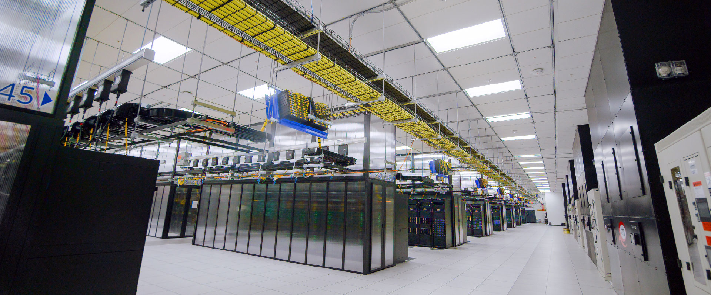

Meta’s AI Research SuperCluster data hall, published January 2022. [Meta](https://ai.meta.com/blog/ai-rsc/)

### A checkpoint needs a completion definition

A distributed checkpoint can contain shards from many workers plus metadata that identifies one coherent state. Writing some shards is not the same as completing that checkpoint. The application needs a way to know that all required data belongs to the same saved version and has reached the promised persistence boundary. A partial new checkpoint should not silently replace the last usable one. The precise commit mechanism depends on the storage system and framework, so teach the invariant before presenting an implementation.

A successful write call can mean different things at different interfaces. Data may be in an application buffer, operating-system cache, a local device or a remote service with specified replication semantics. The recovery claim must name the boundary that was reached and the failures it survives. Checksums can detect some corruption, but do not by themselves create redundancy or authorize access. Replication can improve availability, but synchronized deletion or a bad application write can propagate. A separate retained recovery copy addresses a different failure class.

### Use an end-to-end bottleneck model

For a bulk transfer, compare the source’s ability to produce bytes, the host path, network, destination ingestion and backend persistence. The lowest effective rate is an optimistic sustained bound if all stages overlap. Add serialized setup and commit work when the stated implementation requires it. Do not divide a checkpoint by the sum of drive datasheet bandwidths and call that the recovery time. Restart also includes scheduling, environment setup, reading state, reconstructing distributed ownership and reaching the first valid new output.

### Follow bytes through the whole path

This example fixes one prepared-byte boundary and a GPU demand of 12 GB/s. Source storage can deliver 16 GB/s, the network 24 GB/s and host preparation initially 8 GB/s. With overlapped stages and enough buffering, the host limits supply to 8 GB/s, so the GPU can receive only two-thirds of its demanded input rate. Raising host preparation to 20 GB/s moves the upstream limit to the 16 GB/s source, which can now meet the 12 GB/s demand. This is an input-supply account, not a measurement of a particular accelerator. If decoding changes byte size, convert each stage to the same batch or prepared-byte boundary before comparing rates.

The checkpoint exercise keeps 512 GB fixed while changing 4,096 shards into 65,536. At 1,024 serialized setup operations per second, setup grows from 4 to 64 seconds. A 16 GB/s payload path still transfers the data in 32 seconds, followed by a two-second commit: the total grows from 38 to 98 seconds. With the original shard count, raising source staging to 32 GB/s instead moves the payload bottleneck to the 20 GB/s backend, giving 4 + 25.6 + 2 = 31.6 seconds. These phases and ordering are the exercise inputs; other storage implementations can overlap or batch their metadata work.

### Case study: online replicas did not replace Gmail’s recovery copies

In February 2011, Google reported a storage-software bug that affected multiple online copies of some Gmail users’ data. Google stopped and rolled back the update; offline tape copies survived outside the failure’s reach and supported restoration. Replication had protected against losing individual storage components, but the software fault crossed that protection boundary. Retained recovery copies and a working restore path addressed the different loss. The example concerns that historical incident, not today’s Gmail architecture.

### Worked example: A synthetic checkpoint has more than payload time

- A 512 GB checkpoint is written in 4,096 shards.
- Effective aggregate rates are 16 GB/s for source staging, 24 GB/s for the network and 20 GB/s for backend persistence. Payload stages overlap ideally.
- For this constructed implementation, shard setup is serialized before payload transfer at 1,024 metadata operations per second, followed by a 2-second final commit.

1. Find the payload bottleneck — min(16, 24, 20) = 16 GB/s — The source path limits this checkpoint even though the network is faster.
2. Calculate payload duration — 512 / 16 = 32 s — This is only the bulk-transfer contribution.
3. Account for metadata — 4,096 / 1,024 = 4 s — The example explicitly places this phase before the transfer.
4. Reach the durable completion boundary — 4 + 32 + 2 = 38 s — The checkpoint becomes usable only after the stipulated commit succeeds.

**Result:** The modeled checkpoint takes 38 seconds. A network-only estimate of 21.33 seconds would miss the source bottleneck and serialized work.

**Model boundary:** The phase ordering and rates are invented. Real systems may overlap metadata differently and must define their own durability and commit semantics.

### The tradeoff

Choice: Combine many small checkpoint records into fewer larger shards.

Benefit: Reduce metadata work and improve streaming efficiency: at 1,024 serialized setup operations per second, 4,096 shards take 4 s of setup where 65,536 take 64 s.

Cost: Change parallelism, partial-read cost, failure recovery and the size of a unit that must be rewritten or verified.

### When the situation changes

Trigger: One worker fails after most new checkpoint shards have been written.

Mechanism: The new version is incomplete; treating it as the newest recoverable state can make restart fail or mix incompatible state.

Response: Retain and select the last verified complete checkpoint, record the incomplete attempt and investigate the missing shard before reclaiming older recovery copies.

### Apply the idea

Source staging is upgraded to 32 GB/s while all other assumptions remain. What is the new checkpoint time, and does doubling the source rate halve it?

Reveal the worked answer

Backend persistence becomes the 20 GB/s limit, giving 512 / 20 + 4 + 2 = 31.6 seconds.

The network can sustain 24 GB/s, but the backend cannot. Fixed metadata and commit time also remain. The checkpoint improves by about 16.8%, not 50%, because the original bottleneck was only one part of the complete path.

**The idea to keep:** Usable storage is defined by the required operations and durability boundaries, not by one capacity or bandwidth number.

### Sources

- [NVIDIA DGX SuperPOD — Storage Architecture](https://docs.nvidia.com/dgx-superpod/reference-architecture-scalable-infrastructure-h100/latest/storage-architecture.html) — docs.nvidia.com · Reviewed 2026-09-06. Storage requirements vary with data format, cache behavior, workload and checkpoint traffic.
- [PyTorch Distributed Checkpoint](https://docs.pytorch.org/docs/stable/distributed.checkpoint.html) — docs.pytorch.org · Reviewed 2026-09-06. A distributed checkpoint coordinates application state across participants and storage writers.
- [Introducing the AI Research SuperCluster — Meta’s cutting-edge AI supercomputer for AI research](https://ai.meta.com/blog/ai-rsc/) — Meta AI · Published 2022-01-24 · Reviewed 2026-09-14. Meta’s January 2022 RSC description: 175 PB of bulk storage, 46 PB of cache and 10 PB of NFS storage, with reusable AIRStore preprocessing.
- [Gmail back soon for everyone](https://gmail.googleblog.com/2011/02/gmail-back-soon-for-everyone.html) — Google Gmail Blog · Published 2011-02-28 · Reviewed 2026-09-14. Historical software fault across online replicas and recovery from offline copies.

## Count preserved progress, lost progress and recovery

**Storage and recovery — further reading**

Compare explicit failure timelines and explain why asynchronous saving and replicated storage do not eliminate recovery design.

**Driving question:** When do more frequent checkpoints improve completed work, and when do they only add overhead?

### Draw four different kinds of time

A job timeline contains useful computation, checkpoint work, lost computation and recovery. Useful computation becomes lost only when a failure forces the job to return to an earlier saved state. Recovery includes more than reading bytes: detecting failure, obtaining resources, recreating the environment, restoring state and becoming ready to advance again can each consume time. Color those intervals separately. Otherwise a report can count recomputed work as new progress or describe storage transfer time as the entire outage.

Define the checkpoint interval carefully. It might mean wall-clock time between attempts, useful computation between completed checkpoints, or a number of application steps. These policies behave differently when checkpoint duration changes. The example below uses useful-computation time between checkpoints, pauses progress while saving, and declares a single failure at a fixed wall-clock instant. That makes every interval auditable. It does not assume that real failures arrive periodically or independently.

### A completed snapshot is a recovery point

The recovery point objective describes how much state or progress the service can afford to lose under its intended scenario. The recovery time objective describes how quickly the service should be restored. Checkpoint frequency influences the first, while scheduling, storage reads, initialization and operator response influence the second. Neither objective is guaranteed by a retention policy written on paper. A recovery exercise must demonstrate that the selected checkpoint is readable, coherent and compatible with the environment being restored.

Redundant storage and backup solve overlapping but different problems. Replication may preserve access after a device failure while also copying an accidental deletion. A retained backup may survive that deletion but take longer to restore. A model checkpoint may preserve training state but omit the software environment, dataset version or credentials required to continue safely. The recovery plan therefore includes a manifest of dependencies and a clear definition of valid progress, not only a directory full of large files.

### Asynchronous saving moves contention rather than abolishing it

Asynchronous checkpointing can allow computation to continue while saved state is written. PyTorch’s documented approach includes staging state and managing outstanding saves; its tutorial highlights additional host-memory pressure. The central invariant is that the saved version must remain coherent while the live application changes. Overlap can shorten the visible pause, but memory copies, central processing unit (CPU) work, network traffic and storage writes still consume resources. If these interfere with input preparation or communication, normal steps can become slower.

Bound the number of outstanding saves. If a new checkpoint arrives faster than the backend can persist the previous one, queued state can accumulate and exhaust memory or storage. The newest attempted checkpoint is not necessarily the newest completed recovery point. Monitoring should expose both timestamps. Evaluate the whole job duration and recoverable progress under load, rather than quoting only the time until an asynchronous function returns. A fast return is an API behavior, not a durability measurement.

PyTorch’s asynchronous-saving tutorial makes the two completion events concrete. Its asynchronous-staging example waits for the device-to-host copy before the optimizer modifies model parameters, and tracks upload completion separately. A host-memory snapshot can therefore free the training loop to proceed while remaining vulnerable to losing that host. Model it in two phases: the application stops while state is staged, then a background write overlaps later steps. The checkpoint becomes recoverable only when that write completes, however quickly the save function returns.

### Choose a policy with a failure model and a service goal

More frequent checkpoints generally reduce the maximum unsaved interval while increasing normal saving work. Their benefit depends on when failures occur, what scope is lost and how long restoration takes. A rare node fault that affects one small task differs from a shared storage outage that blocks an entire cluster. Use measured incidents where available and explicit scenarios where they are not. Compare policies across several failure positions and include a no-failure case so the cost of protection remains visible.

The Young/Daly formula turns the balance between saving work and lost work into a starting interval. Saving every W minutes costs C/W of the time, where C is the checkpoint duration. A failure, arriving on average every μ minutes, wastes about half an interval of recomputation, W/(2μ) of the time. The total is smallest at W = √(2μC), the interval Young derived in 1974 and Daly refined in 2006; there the two wastes are equal. With this lesson’s 2-minute checkpoint, policy A’s 20-minute interval fits a mean time between failures of 20² ÷ (2 × 2) = 100 minutes, and policy B’s 40 minutes fits 400 minutes, about 6.7 hours. The formula assumes random, independent failures and an interval much longer than the checkpoint, so it gives a first estimate to test against measured incidents rather than a final policy.

### Case study: Llama 3 needed routine recovery

The Llama 3 report describes 466 interruptions during a 54-day training snapshot: 47 planned and 419 unexpected. It reports more than 90% effective training time and only three incidents requiring significant manual intervention. Automated diagnosis, reduced startup time and shorter checkpoint operations helped preserve useful progress despite interruptions. Its flight recorder captures collective-operation information for diagnosing a stuck distributed job. These are measurements and operational observations from that run; neither interruption count nor effective training time is a hardware-availability guarantee.

### Account for the energy spent recovering

Repeating lost computation also repeats its energy. Take the failure-at-minute-35 timeline and assign the job 1 MW during computation, 0.8 MW during checkpoint pauses and 0.4 MW during restoration. Power is held constant within each stage, so its energy is power multiplied by duration. The 20-minute policy spends 1 MWh on the final 60 useful minutes, 13/60 MWh on computation that the failure discards, 0.8 × 4/60 MWh on saving and 0.4 × 5/60 MWh on restoration: about 1.303 MWh in total. The 40-minute policy spends about 1.643 MWh, including 35 minutes of discarded computation and two minutes saving. This account covers the stated job power; it is not a facility power usage effectiveness (PUE) or campus demand measurement.

### Worked example: Two policies face one failure at minute 35

- The job needs 60 minutes of useful computation. A valid initial checkpoint exists at zero progress.
- Policy A checkpoints after every 20 useful minutes; policy B after every 40. Each checkpoint pauses computation for 2 minutes.
- A single failure occurs at wall-clock minute 35 and restoration takes 5 minutes. No final checkpoint is required to count job completion.

1. Follow policy A to failure — Work 0–20; save 20–22; work 22–35 — A has preserved 20 useful minutes and loses the following 13.
2. Follow policy B to failure — Work 0–35; no completed new checkpoint — B loses all 35 attempted useful minutes and returns to zero.
3. Restore both jobs — Recovery 35–40 — The same five-minute restoration is assumed for both policies.
4. Finish policy A — Work 40–60; save 60–62; work 62–82 — Forty remaining useful minutes produce completion at minute 82.
5. Finish policy B — Work 40–80; save 80–82; work 82–102 — Sixty remaining useful minutes produce completion at minute 102.

**Result:** Policy A finishes 20 minutes earlier for this failure placement. Without a failure, A would incur one extra two-minute checkpoint before completing the same work.

**Model boundary:** This is an explicit scenario, not an estimate of failure probabilities or an optimal interval for a real cluster.

### The tradeoff

Choice: Shorten the interval between checkpoints.

Benefit: Reduce the unsaved progress exposed to many failure timings: in the worked example, saving every 20 useful minutes instead of 40 finishes 20 minutes earlier after the failure at minute 35.

Cost: Increase checkpoint traffic and pauses or asynchronous contention: without a failure, the 20-minute policy spends one extra 2-minute pause. More saved versions also consume retention capacity.

### When the situation changes

Trigger: Monitoring treats an initiated asynchronous save as a completed checkpoint.

Mechanism: After a fault, the service attempts to restore a version whose background write never reached a valid completion boundary.

Response: Track completion and verification separately from initiation, retain a previous valid state and exercise restart from the exact selected version.

### Apply the idea

Move the only failure to minute 55, keeping all policies unchanged. How much progress has each preserved, and when does each finish after the five-minute recovery?

Reveal the worked answer

Both have preserved 40 useful minutes. Both restart at minute 60 and complete the remaining 20 useful minutes at minute 80.

A loses 11 unsaved minutes while B loses 13, but A spent two additional minutes saving before failure. Their net preserved progress is identical at this failure instant. More frequent saving is not strictly better for every realized timeline.

**The idea to keep:** A checkpoint policy trades normal overhead against the amount of work that must be repeated after a specified failure.

### Sources

- [Asynchronous Saving with Distributed Checkpoint](https://docs.pytorch.org/tutorials/recipes/distributed_async_checkpoint_recipe.html) — docs.pytorch.org · Published 2024-07-22 · Reviewed 2026-09-14. A coherent staging copy, background persistence and completion tracking are distinct; outstanding saves consume host memory.
- [PyTorch Distributed Checkpoint](https://docs.pytorch.org/docs/stable/distributed.checkpoint.html) — docs.pytorch.org · Reviewed 2026-09-06. Distributed state saving and loading require coordinated state and backend-specific handling.
- [The Llama 3 Herd of Models — infrastructure and operational reliability](https://arxiv.org/html/2407.21783v3) — Llama Team, AI @ Meta · Published 2024-11-23 · Reviewed 2026-09-14. Dated 54-day interruption snapshot, effective training time, and automated diagnosis/recovery.
- [Checkpointing à la Young/Daly: An Overview](https://icl.utk.edu/files/publications/2022/icl-utk-1569-2022.pdf) — Benoit, Du, Herault, Marchal, Pallez, Perotin, Robert, Sun and Vivien, IC3 2022 (ACM) · Published 2022-08-04 · Reviewed 2026-09-26. The Young/Daly period √(2μC), from Young (1974) and Daly (2006), approximates the checkpoint interval that minimizes expected overhead for a mean time between failures (MTBF) μ and a checkpoint cost C. At that period the time spent saving equals the time lost to re-execution.

## Turn installed hardware into an accepted service

**Storage and recovery — further reading**

Connect scheduling, provisioning, isolation and observability to a reproducible end-to-end acceptance exercise.

**Driving question:** What must a tenant demonstrate before the cluster can be called usable?

### Scheduling matches a request to a feasible set

A scheduler receives more than a request for a device count. A job can require memory per device, host memory, CPU resources, compatible software, network locality, storage access and a duration. The available inventory must satisfy those requirements together. A free device in the wrong topology or software pool may not be usable for that job. This is why physical utilization, allocated utilization and useful output should be reported separately: each answers a different question about the service.

Placement can trade queue time for execution time. Keeping communicating workers close can reduce traffic through constrained network tiers, but suitable groups may be occupied. Slurm’s topology guide describes allocation that considers switch groupings; the actual behavior depends on the configured plugin and version. A scheduler also needs trustworthy resource information. If an unhealthy device remains marked available, allocation can succeed while execution fails. If repaired resources remain drained indefinitely, installed capacity stays hidden from users.

### Provisioning and isolation make the allocation real

Provisioning turns selected hardware into a reproducible execution environment. It includes boot and firmware state, drivers, runtime libraries, application images, network configuration and access to the required data. A container image helps capture user-space dependencies but does not by itself standardize every host driver or device interface. Record versions and compatibility rather than assuming that a successful image download proves a working stack. The same job should start from a declared clean state and produce a recognizable result.

Isolation controls what an allocation may consume and access. Resource accounting reports use; enforcement limits it. Slurm’s cgroup documentation distinguishes mechanisms that track processes, collect usage and constrain resources, so enabling telemetry alone should not be mistaken for enforcement. Storage authorization, network separation and management-plane access are additional concerns. An acceptance plan should test the authorized tenant’s intended operations and verify that its agreed resource boundaries are enforced, using a controlled test environment and explicit service expectations.

### A faster read can lose to a longer allocation wait

In this comparison, both candidate placements can read the same committed 512 GB checkpoint and use the same validated software. A data-local allocation reads at 32 GB/s; an immediately available remote allocation reads at 8 GB/s. Each then has the same 12 seconds of setup in the modeled recovery path. The local read saves 48 seconds, but a 30-second allocation wait consumes some of that advantage: local readiness is 30 + 12 + 16 = 58 seconds, versus 12 + 64 = 76 seconds remotely. When the local allocation wait grows to 90 seconds, its total becomes 118 seconds, and remote recovery wins. Neither option is accepted until the restored job produces the required correct output.

### Test a chain that ends in correct output

Create a small representative workload with a pinned code revision, environment identifier, input checksum, random-seed policy and expected output condition. Specify the allocation topology, startup deadline, sustained-throughput window and allowable variance before running it. Trace the path from authenticated dataset access through job submission, provisioning, collective communication and durable output. Record stage timing as well as total time. A failure should leave enough evidence to identify which dependency broke, rather than only a final nonzero exit code.

Correctness and performance must both pass. A very fast job that silently reads the wrong dataset or produces incomplete output is not accepted. A correct job that misses the agreed response or throughput target also fails that service requirement. Distinguish cold-start and warm-cache conditions, and state whether other tenants or background services are active. Reproduce a result under the same conditions before comparing it with a changed architecture. A single favorable run is a useful observation, not a complete operating envelope.

### Exercise recovery and return to service

Within an isolated, approved acceptance environment, introduce an agreed non-destructive fault such as terminating one test worker after a completed checkpoint. Observe detection, cleanup, replacement allocation, state restoration and the first correct new output. Compare the result with an uninterrupted control using the declared correctness criteria. Then verify that temporary resources and stale processes are removed. This tests recovery as a service path rather than assuming that a restart command proves progress survived.

The final report should say which service configuration passed, which degraded modes were exercised and which conditions remain untested. Keep raw logs, configuration identifiers, timestamps and output checksums with the report. Power-on counts and electrical capacity remain valuable infrastructure facts, but they are inputs to this acceptance exercise. The accepted output is an executable service commitment tied to workload, environment and recovery behavior.

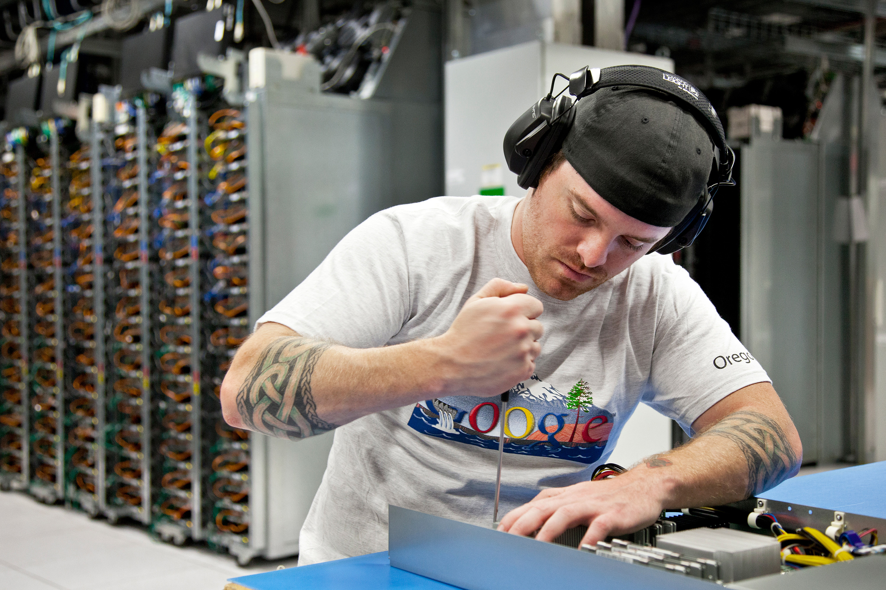

Google identifies Mike replacing a motherboard at its data center in The Dalles, Oregon. [Google](https://www.datacenters.google/discover-more/photo-gallery/)

### Case study: Google shifts flexible work through time

Google’s October 2023 account describes a grid partner notifying its planning system of a forecast demand-response event. The system produces hour-by-hour limits on eligible non-urgent work, runs deferred work later and can move work to another grid when feasible. Northern Wasco County People’s Utility District (PUD) identifies a day-ahead pilot with Google’s facilities in The Dalles, Oregon. The article also describes evening demand reductions at European sites during winter 2022–23.

Consider an interruptible batch job with three hours of work at 4 MW, starting at 13:00. Other load stays at 20 MW. The grid event runs from 14:00 to 16:00. Running straight through finishes at 16:00 and reaches 24 MW during the event. Preserving progress and pausing over the event leaves two hours to run from 16:00 to 18:00. That schedule holds event demand to 20 MW and meets a 20:00 deadline, but misses a 17:00 deadline. Its 12 MWh of job energy remains unchanged and the 24 MW demand returns after the event. The model fixes transition overhead at zero to isolate timing; an actual commitment must include checkpoint/restart overhead, later capacity and placement.

An interactive request with a 200 ms response requirement cannot absorb that two-hour pause. A batch job can move only while meeting its own completion requirement, retaining the needed state and obtaining a feasible later allocation. The demand-response case therefore joins storage and orchestration: the schedule depends on both surviving progress and resources being available when promised.

### Worked example: Thirty-two free GPUs, no eligible allocation

- A fictional cluster has two topology groups, each containing four nodes with eight GPUs per node.
- A job requires four free nodes within one group and a validated common software image.
- Two nodes are free in each group. Every free node is healthy and has the right image. Cross-group placement is outside the accepted service configuration.

1. Count free hardware — 4 free nodes × 8 GPUs = 32 free GPUs — The physical count equals the requested device count.
2. Check each eligible group — Group A: 2 < 4 nodes; group B: 2 < 4 nodes — Neither group can satisfy the placement constraint.
3. State feasible capacity — Eligible four-node allocations = 0 — The job must wait, change requirements or use a separately validated service mode.

**Result:** The hardware is healthy, powered and sufficiently numerous, yet the requested service cannot launch under its accepted topology.

**Model boundary:** The grouping rule is synthetic; it is not an assertion about a particular scheduler’s default behavior.

### The tradeoff

Choice: Admit smaller flexible jobs while waiting for a large topology-constrained allocation.

Benefit: Use otherwise idle resources and improve service for suitable workloads.

Cost: Without reservations or preemption policy, those jobs can prolong fragmentation and delay the larger job.

### When the situation changes

Trigger: A worker restarts with a different runtime library than the remaining ranks.

Mechanism: Device discovery succeeds, but distributed initialization or execution becomes incompatible and useful output stops.

Response: Compare environment manifests, restore the validated version set and rerun the end-to-end acceptance path before releasing the resources.

### Apply the idea

The owner proposes allowing cross-group placement to launch the waiting job immediately. What evidence is required before treating that as equivalent service?

Reveal the worked answer

Measure correctness, collective behavior, sustained throughput, contention effects and recovery under the cross-group topology using the same pinned workload and output criteria.

Relaxing a constraint creates a new configuration. It may be worthwhile even with lower performance, but the service target and customer acceptance must reflect the measured result. The free-device count cannot establish equivalence.

**The idea to keep:** A usable cluster launches the right environment on the right topology, produces correct output and restores progress after an agreed fault.

### Sources

- [Slurm Workload Manager — Topology Guide](https://slurm.schedmd.com/topology.html) — SchedMD · Reviewed 2026-09-06. Topology-aware placement considers network groupings when selecting resources.
- [Control Group in Slurm](https://slurm.schedmd.com/cgroups.html) — slurm.schedmd.com · Reviewed 2026-09-06. Process tracking, accounting and resource confinement have distinct roles.
- [NVIDIA DGX SuperPOD — Software](https://docs.nvidia.com/dgx-superpod/reference-architecture-scalable-infrastructure-h100/latest/dgx-software.html) — docs.nvidia.com · Reviewed 2026-09-06. A reference cluster includes orchestration, system management, libraries and operating-system components.
- [Google — Supporting power grids with demand response](https://cloud.google.com/blog/products/infrastructure/using-demand-response-to-reduce-data-center-power-consumption) — Google · Published 2023-10-03 · Reviewed 2026-09-14. Historical grid notification and scheduling workflow; The Dalles day-ahead pilot.
- [Google Data Centers — Photo gallery](https://www.datacenters.google/discover-more/photo-gallery/) — Google · Reviewed 2026-09-26. Google’s photo gallery shows a technician replacing a motherboard at its data center in The Dalles, Oregon.
