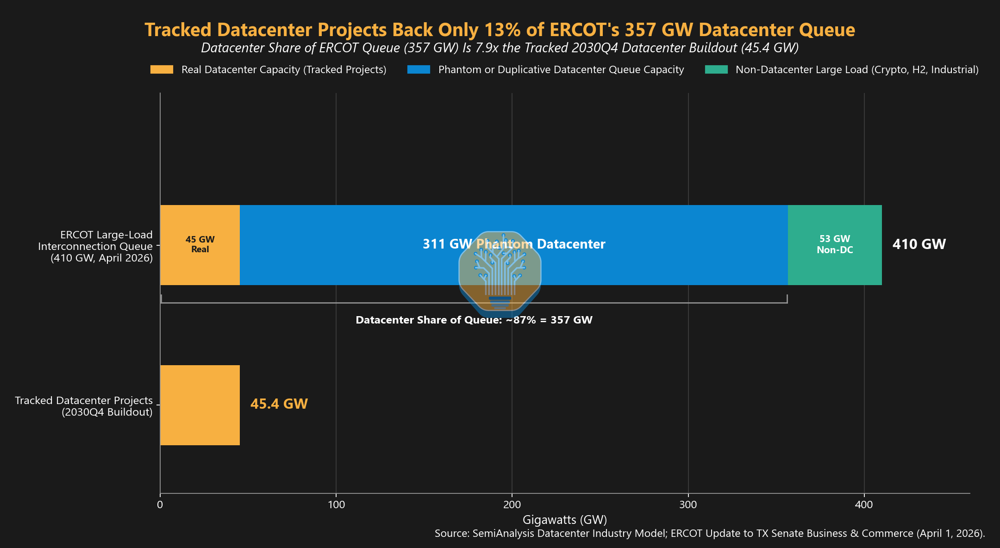
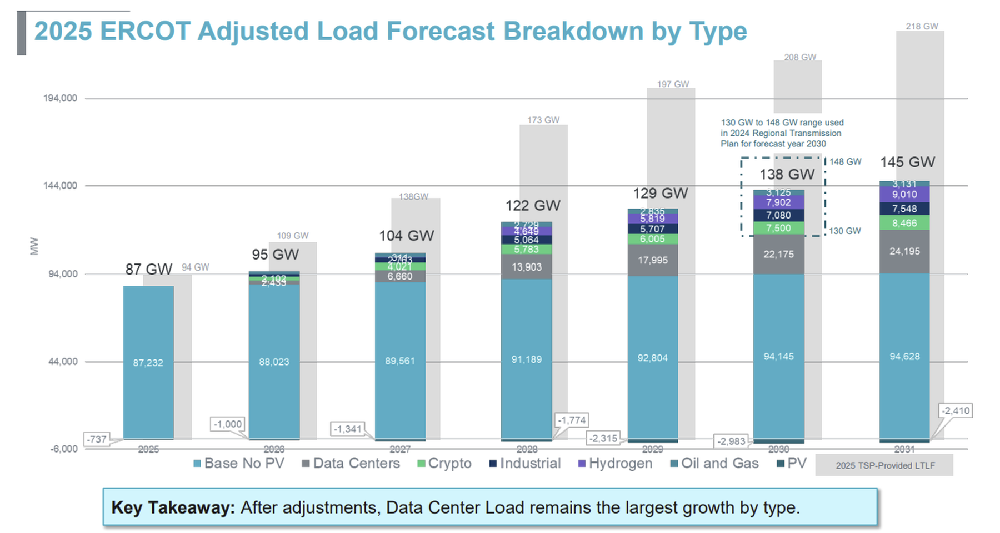
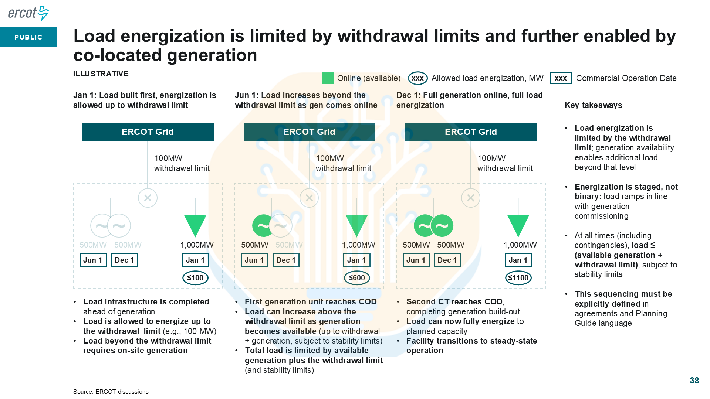

# ERCOT and PJM: the race to connect

Generated reading view. Edit [`course/expansion/grid-queues.json`](https://github.com/kiankyars/gigawatt/blob/main/course/expansion/grid-queues.json), lesson `d03-interconnection-queues`, then run `uv run gigawatt-expand`.

**Case study — ERCOT and PJM: the race to connect · Authored draft**

Read ERCOT and PJM connection evidence by its actual milestone: requested capacity, engineering progress, financial commitment, forecast demand and authorized operation.

**Driving question:** When does a request for a gigawatt become usable power?

## What a connection request buys

A developer wants a gigawatt at a particular site by a particular date. That describes a business requirement. The connection process must determine whether the network can serve it, which facilities must change, who funds them, and how the load must behave. Submitting the requirement begins that work; it does not make the requested electricity available. A study can identify a feasible route while leaving construction, equipment and operating approvals unfinished.

ERCOT manages most of the Texas grid. PJM coordinates a regional system spanning parts or all of thirteen states and Washington, D.C. Their processes are different, and utilities remain essential to the physical service connection. Read every queue number with its region, date, horizon and status. A place in an engineering process is not a reliable countdown to opening day.

## Supply proposals and load requests are different

A generator seeks permission to inject power; a data center seeks service that withdraws it. Both affect the same network, but they create different operating conditions and obligations. PJM announced on August 3, 2026 that 715 generation projects representing 201.5 GW of nameplate capacity qualified for its first reformed study cycle. Those megawatts are proposed supply, not waiting data centers, constructed plants or dependable capacity already available.

Do not turn this distinction into an absolute separation. PJM's New Services Queue also includes long-term firm transmission-service requests. New load can require such service, while an existing network customer can designate additional load and modify its agreement. The useful question is which request and study are being counted, not whether the webpage happens to use the word queue.

## Read ERCOT's status labels before its total

ERCOT's July 29, 2026 presentation reports a June snapshot of the large-load pipeline through 2033: 474.7 GW requested, including 284.3 GW with no studies submitted and 5.9 GW observed energized. The future-year columns are cumulative requested ramps; adding those columns would count the same requests repeatedly. The observed segment represents all-time, non-simultaneous peak consumption, not demand measured across the system at one instant.

These categories reveal maturity, not eventual success. No studies submitted can include insufficient information and megawatts not approved following planning review. A project seeking service years later is not cancelled because it is not consuming power now. Likewise, approval to energize precedes observed operation. The gap between the biggest and smallest numbers is not a cancellation rate.

## Site options become expensive commitments

Consider an illustrative business plan for one 1 GW deployment. Its developer explores three mutually exclusive sites, requesting 1 GW at each. The applications sum to 3 GW; the business plan still needs at most one gigawatt if built. Relatively inexpensive early work can preserve useful alternatives. It also forces planners to distinguish alternatives from independent projects. Texas SB 6 requires disclosure of substantially similar requests that could materially change, delay or displace another request.

The PUCT adopted a new large-load rule on September 18, 2026, effective October 8. It sets a $100,000 study fee by intermediate-agreement execution, with unused amounts returned within sixty days after the study. Intermediate-agreement security is $50,000 per MW: a $50 million face amount for a new 1,000 MW request. Security is financial assurance, not necessarily cash spent. At the later standard agreement, required security is the greater of the per-MW amount or allocated system-upgrade costs. Study fees, security and construction contributions are separate obligations. As of September 20, these adopted terms are not yet effective.

## A study-entry filter is not permission to energize

ERCOT reported approximately 205 GW preliminarily eligible for Batch Zero using its July 28, 2026 snapshot. Batch treatment studies qualified requests together against shared network limits. Preliminary eligibility does not mean that all those megawatts can operate. The September 9 verification notice still called for supporting documents from conditionally included loads. Its purpose was to test the commitments behind the classification.

The June pipeline and July eligibility figures have different dates and populations. They cannot be joined into an exact funnel, with everything outside the smaller number declared cancelled. A defensible project claim states the particular gate passed and the conditions remaining.

## Dominion shows the ladder from engineering to service

Dominion's January 6, 2026 letter describes an Engineering Letter of Authorization, or ELOA, requiring a $250,000 engineering deposit after prerequisites such as site control. The typical nine-to-twelve-month study produces required infrastructure, an estimated energization date and estimated cost. The customer may decline to proceed. A Construction Letter of Authorization, or CLOA, reserves capacity and adds construction, deposit and cancellation obligations. An Electric Service Agreement, or ESA, establishes contracted service, collateral and tariff terms.

The letter's July 2025 contract mix is 30.1 GW ELOA, 7.1 GW CLOA and 9.8 GW ESA, totaling 47 GW. It separately reports a 4 GW coincident data-center peak in 2025. Contract capacity and simultaneous demand are different measures. This is Dominion's customer portfolio, not all PJM. Its firm forecasting category does not prove a guaranteed connection date.

## A forecast requires more than adding applications

SemiAnalysis's June 2026 comparison places ERCOT's April requests of 410 GW, including roughly 357 GW of data centers, beside its own 45.4 GW tracked data-center buildout through 2030 Q4. Its phantom-or-duplicative classification is an analyst judgment, not an ERCOT-verified duplicate count. Different coverage and horizons prevent subtracting the figures to establish fraudulent or cancelled demand.

A second article reproduces ERCOT's 2025 forecast comparison: 208 GW submitted versus 138 GW adjusted for 2030. Those are whole-system forecasts, not data-center-only requests or energized capacity. The adjustment illustrates a planner's job: decide which loads, timing and assumptions belong in a system forecast. It does not supply a universal haircut to apply to today's queue.

SemiAnalysis model comparison, June 18, 2026. The phantom classification is the publisher’s estimate, not an ERCOT cancellation audit. [SemiAnalysis — Stop Saying Half of 2026 US Datacenter Capacity Is Canceled](https://newsletter.semianalysis.com/p/stop-saying-half-of-2026-us-datacenter)

ERCOT’s 2025 whole-system forecast, reproduced by SemiAnalysis in March 2026. [SemiAnalysis — Are AI Datacenters Increasing Electric Bills for American Households?](https://newsletter.semianalysis.com/p/are-ai-datacenters-increasing-electric)

## Connect a supported operating phase

An ERCOT May 4, 2026 workshop illustration, reproduced by SemiAnalysis, pairs a 1,000 MW load with 100 MW of grid withdrawal and two 500 MW onsite generators. Local generation can support a larger load than the permitted grid import. The example below follows the arithmetic as generation becomes available. Actual service also depends on studies, commissioning, controls and approved operating conditions.

The grid withdrawal limit remains relevant after a generator trips. A site cannot simply replace lost local generation with additional imports that it has not secured. A useful connection offer therefore states four things together: confirmed import, the supported ramp and dates, responsibility for construction, and operating conditions including curtailment. Those terms determine which computing phase can open.

Original May 4, 2026 workshop illustration, reproduced by SemiAnalysis. Its 1,100 MW supply ceiling does not enlarge the pictured 1,000 MW load. The teaching slide uses a simpler redraw. [SemiAnalysis — US Grid Constraints: Towards 40GW+ of Behind-The-Meter Datacenter by 2028?](https://newsletter.semianalysis.com/p/us-grid-constraints-towards-40gw)

## Worked example: A gigawatt load behind a 100 MW withdrawal limit

- Illustrative workshop mechanism, not a named project or current permission.
- Each commissioned generator can make at most 500 MW available; ignore losses for arithmetic.
- Grid import remains capped at 100 MW; actual service may be lower because of other limits.

1. Grid alone — min(1,000, 100) = 100 MW — The requested campus size does not increase the withdrawal limit.
2. One generator available — min(1,000, 100 + 500) = 600 MW — Local supply raises the arithmetic upper bound.
3. Both generators available — min(1,000, 100 + 500 + 500) = 1,000 MW — Cap the result at the pictured load, even though source ratings sum to 1,100 MW.
4. One generator lost at full load — 1,000 − (100 + 500) = 400 MW — At least 400 MW must be removed from this balance; surviving-generator ramp and reserve limits may require more.

**Result:** Staged supply can advance partial service while preserving a binding import limit.

**Model boundary:** These are steady power bounds. They do not establish acceptable transient behavior, protection, generator availability or a permitted load-shedding scheme.

## The tradeoff

Choice: Preserve several early site options, then make verifiable commitments.

Benefit: Alternative sites can expose a more practical route to usable power.

Cost: Studies consume engineering resources; security and construction obligations make commitment materially different from an initial request.

## When the situation changes

Trigger: A local generator trips while the campus relies on restricted grid imports.

Mechanism: Local supply falls, but the grid connection does not acquire additional import rights.

Response: Use the validated operating arrangement to reduce demand or supply the shortfall within its limits.

## Apply the idea

An offer supports 100 MW grid import and a possible 1 GW later phase. What must be established before scheduling that later phase?

Reveal the worked answer

Establish the later phase's supported supply, import rights, completion milestones, ramp dates and conditions following a generator outage.

A requested final capacity and an early partial connection do not demonstrate that the remaining scope is deliverable.

**The idea to keep:** A credible power date belongs to a defined import limit, construction scope, load ramp and set of operating conditions.

## Sources and reading boundaries

- [ERCOT — Senate Business and Commerce update, July 29, 2026](https://www.ercot.com/files/docs/2026/07/29/ERCOT-Senate-July-29-Panel-1-Assessing-The-Grid.pdf) — Read the June 2026 cumulative large-load status snapshot through 2033, including 474.7 GW total, 284.3 GW with no studies submitted and 5.9 GW observed energized. Read 2026-09-20. Slide 6 reviewed. Future-year columns are cumulative requested ramps; observed energized is non-simultaneous consumption. Rounded components do not sum exactly to the displayed total. These figures do not establish cancellation or duplicate rates.
- [ERCOT — March 2026 Monthly Operational Overview](https://www.ercot.com/files/docs/2026/04/16/ERCOT-Monthly-Operational-Overview-March-2026.pdf) — Define observed energized, approved to energize and no studies submitted in the large-load status reporting. Read 2026-09-20. Large-load status definitions reviewed. Observed energized represents all-time non-simultaneous peak consumption, not current coincident system load. No studies submitted can include MW not approved following planning review.
- [Texas Legislature — SB 6 enrolled text, 89th Legislature](https://capitol.texas.gov/tlodocs/89R/billtext/html/SB00006F.htm) — PURA 37.0561 establishes overlapping-request disclosure, site-control evidence, an initial transmission-screening study fee of at least $100,000 and infrastructure commitments. Read 2026-09-20. Relevant subsections (d) and (f)–(i) reviewed. The statutory screening fee is distinct from financial security, construction payments and electricity charges. Do not substitute unverified September 2026 implementation terms.
- [PUCT — Order adopting 16 TAC 25.194, September 18, 2026](https://interchange.puc.texas.gov/Documents/58481_218_1684656.PDF) — Printed pages 234–235 establish the $100,000 study fee and $50,000/MW intermediate-agreement security; pages 251–252 establish later SLLIA security. Read 2026-09-20. Relevant final-rule pages independently checked. Unused study fees return within 60 days; security is not a nonrefundable fee and later security may be higher. Adopted September 18, effective October 8 as separately established by item 219; not yet effective on review date.
- [ERCOT — House State Affairs data-center update, August 19, 2026](https://www.ercot.com/files/docs/2026/08/19/ERCOTPanel1DataCenters.pdf) — Slide 3 reports approximately 205 GW preliminary Batch Zero eligibility using the July 28 snapshot. Read 2026-09-20. Preliminary study eligibility, not approved-to-energize capacity. Different date and universe from the June large-load pipeline; do not turn exclusions into cancellations or combine the two as a conserved funnel.
- [ERCOT — Batch Zero verification process notice, September 9, 2026](https://www.ercot.com/services/comm/mkt_notices/M-A090926-01) — Establish that requests for information and documentation verification were continuing through September for conditionally included loads. Read 2026-09-20. Complete public notice reviewed. Passing verification is a condition of inclusion; the notice does not establish audit completion, energized capacity or a final cleaned queue.
- [Dominion Energy — Data-center load-adjustment letter to PJM, January 6, 2026](https://www.pjm.com/-/media/DotCom/planning/res-adeq/load-forecast/dominion-documentation.pdf) — Explain ELOA, CLOA and ESA commitments, the $250,000 engineering deposit and typical 9–12-month study, July 2025 contract mix and reported 2025 coincident peak. Read 2026-09-20. Three-page utility letter reviewed. The 47 GW contract snapshot combines 30.1 GW ELOA, 7.1 GW CLOA and 9.8 GW ESA; 4 GW is coincident demand. Different measures, dates and commitment stages; not a cancellation funnel. Scope is Dominion Energy customers, not all PJM or the whole Dominion zone.
- [PJM — Over 700 generation projects accepted into Cycle 1, August 3, 2026](https://insidelines.pjm.com/over-700-new-generation-projects-accepted-into-first-cycle-of-reformed-interconnection-process/) — Distinguish 715 proposed generation projects and 201.5 GW nameplate qualified for study from large-load demand requests. Read 2026-09-20. Complete public announcement reviewed. Qualified for study does not mean constructed or operating. Nameplate capacity is not dependable capacity or data-center load; the designed study duration does not establish a commissioning date.
- [FERC — PJM large-load show-cause order, June 18, 2026](https://www.ferc.gov/sites/default/files/2026-06/EL26-67-000.pdf) — Printed pages 19–21 describe new load designation and transmission service requests, including long-term firm transmission requests in PJM's New Services Queue. Read 2026-09-20. Relevant existing-process section reviewed, not all 114 pages. This is a show-cause order; preliminary proposed study reforms are not operating entitlements. Do not claim that load-related transmission requests can never share PJM's New Services Queue.
- [PUCT — Texas Register acknowledgment for adopted 16 TAC 25.194](https://interchange.puc.texas.gov/Documents/58481_219_1684678.PDF) — Page 3 establishes October 8, 2026 as the effective date of the adopted large-load interconnection rule. Read 2026-09-20. Effective-date acknowledgment reviewed. Adoption and future effectiveness are different milestones; no claim that the rule was already effective September 20.
- [ERCOT — Batch Study Workshop 8, May 4, 2026](https://www.ercot.com/files/docs/2026/05/04/ERCOT_Batch_Study_Workshop_8_20260504.pptx) — Slide 38 illustrates staged load with a 1,000 MW request, 100 MW withdrawal limit and two 500 MW generators. Read 2026-09-20. Slide 38 independently extracted and marked illustrative. This is not a project, permission or guaranteed ramp. Course calculation caps source availability at requested load and retains stability/contingency conditions.
- [Stop Saying Half of 2026 US Datacenter Capacity Is Canceled](https://newsletter.semianalysis.com/p/stop-saying-half-of-2026-us-datacenter) — Contrast April ERCOT requests with the publisher's tracked 2030 Q4 buildout. Read 2026-09-20. Public June 18 article section and figure reviewed. No subscriber model audited; the phantom/duplicative category is analyst classification, not an ERCOT cancellation audit.
- [Are AI Datacenters Increasing Electric Bills for American Households?](https://newsletter.semianalysis.com/p/are-ai-datacenters-increasing-electric) — Reproduces ERCOT's 2025 whole-system forecast comparison: 208 GW submitted and 138 GW adjusted for 2030. Read 2026-09-20. Public March 3 article section and ERCOT-credited figure reviewed; full paid article not reviewed. Historical forecast vintage, not current queue or adjustment policy.
- [US Grid Constraints: Towards 40GW+ of Behind-The-Meter Datacenter by 2028?](https://newsletter.semianalysis.com/p/us-grid-constraints-towards-40gw) — Reproduces an illustrative ERCOT May 4 workshop sequence with 1,000 MW load, 100 MW import and two 500 MW generators. Read 2026-09-20. Public June 25 article section and figure reviewed. Mechanism illustration, not an approved project or adopted rule. Course arithmetic caps service at load and leaves transient behavior unmodeled.
