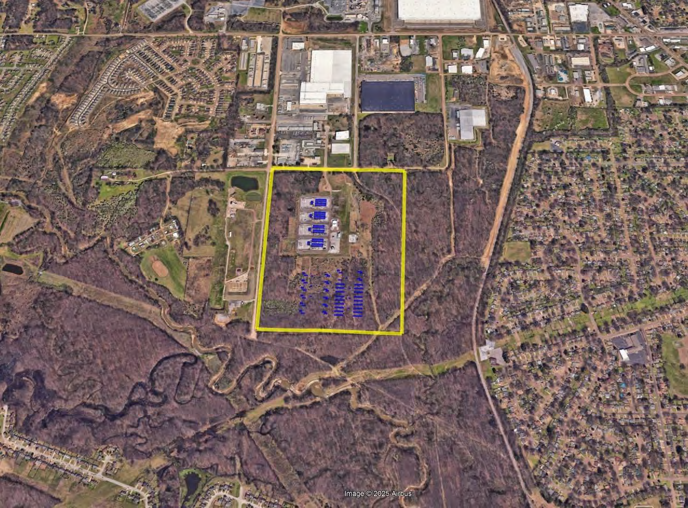
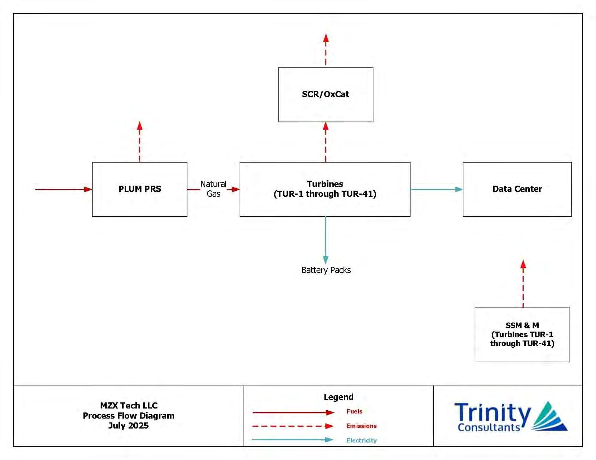

# Deliver the campus one usable phase at a time

Generated reading view. Edit [`course/expansion/foundations-power.json`](https://github.com/kiankyars/gigawatt/blob/main/course/expansion/foundations-power.json), lesson `d03-service-and-siting`, then run `uv run gigawatt-expand`.

**4. Siting, grid connection and supply · Authored draft**

Follow real phased delivery, establish electricity and fuel connections, compare four supply arrangements, then choose generation for the required operating duty.

**Driving question:** How can a campus obtain usable power by its opening date?

## Begin with a released phase: CoreWeave at Polaris Forge 1

This chapter turns the workload brief into a supply decision: what usable capacity can arrive, on which date, through which connections, and in which operating states? Power, cooling, network access and completed space must meet at the same released scope. The following case shows how a project can deliver that scope in stages.

Applied Digital reported the first 50 MW at Polaris Forge 1 in Ellendale, North Dakota ready for service on October 27, 2025. On November 24, the next 50 MW reached the same milestone, completing the first 100 MW building leased to CoreWeave. The campus was 400 MW fully contracted. The October release separately described a possible expansion path to 1 GW; this was not an operating multi-gigawatt campus.

The first block was released 28 days before the second. The releases establish service milestones, not measured IT draw, installed accelerator counts or resulting token throughput. The design lesson is to make the first block independently serviceable while later work continues. A shared unfinished cooling connection or network route can prevent that independence even when its electrical feeder is ready.

## A connection is a process, not a single number

A large-load project begins with an intended service requirement and a proposed physical location. The utility or system operator needs enough information to assess how that load connects and behaves. Studies, agreements, network upgrades, equipment delivery, construction, and operational authorization can all stand between the initial request and available service. Their exact names and sequence differ by jurisdiction and project. A generic course diagram must not be mistaken for the current application procedure of a particular utility.

ERCOT's June 2026 announcement of a batch-study approach provides a dated example of why this matters: multiple large projects must be assessed together against the network they would share. The lesson is not to memorize that announcement's process as universal. It is to recognize that requested capacity can interact with other projects and required grid work. A customer's desired date is an input to planning, not evidence that the grid can deliver the requested load on that date.

Inside the property, electrical equipment can be energized while cooling, control integration, network connections or IT acceptance remains incomplete. Commissioning checks behavior for a stated scope; operation then supplies evidence of actual service. A phased campus can therefore have several statuses at once. Track the released block and the remaining construction separately. A project-wide completion percentage can be useful evidence, but does not identify each subsystem’s accepted state.

## Fuel reaches a site through infrastructure and rights

An on-site gas plant needs deliverable fuel at the required flow and pressure. A nearby pipeline is a possible connection point, not a promise of service. A lateral, rights of way, interconnection equipment and upstream supply capacity must support the operating plan. These are physical development tasks alongside generation procurement.

Energy Transfer’s February 2026 results report says gas deliveries to the Oracle data center near Abilene began in January 2026. Its August investor presentation reports completion of a second 14-mile lateral in the Abilene area. Separately, that presentation describes a gas-facilities agreement with Crusoe supporting approximately 900 MW of generation. These statements establish different pieces of the buildout; the presentation does not justify equating every lateral with the same project scope.

No 12-inch pipe diameter was verified for this case. Likewise, the roughly 900 MMcf/day in the February release refers to three Oracle projects in aggregate, not the Abilene campus alone. The useful lesson is to establish a specific delivery route and commitment before converting regional gas abundance into an assumption about campus power.

## Abilene: current delivery and separate campus scopes

Abilene, Texas is the recurring real campus reference. We follow the original Crusoe-built Oracle/OpenAI campus across service, construction and cooling. Each claim keeps its source date and boundary; hypothetical calculators do not fill gaps in the site’s measurements.

Oracle’s data-center location page reports 75% of total Abilene capacity delivered as of September 2026, with the remainder in subsequent quarters. It does not define a denominator that permits converting that percentage into a new megawatt count, and delivered capacity does not establish metered IT demand or useful output. The original campus and the adjacent Microsoft development remain separate projects.

Oracle’s photograph shown in the presentation is an aerial dated July 15, 2026. Its image date is distinct from the September status statement. Crusoe’s March 27 account of two original buildings and six further planned buildings remains a historical milestone, not the current delivery summary. Crusoe’s June 9 release identifies the original 1.2 GW Oracle campus separately from the new 900 MW Microsoft campus.

## Behind the meter describes a boundary, not independence

Behind-the-meter (BTM) generation or storage is electrically on the customer side of the utility meter used for the comparison. Draw that meter between the grid and the customer bus, then connect the local generator, storage, and site loads to the customer bus. Several meters may exist on a real campus, so state which one defines the claim. A property fence, equipment owner, or nearby power plant does not by itself establish this electrical arrangement.

Keep three descriptions separate. On-site describes physical location. Behind the meter describes the electrical relationship to the stated utility meter. Islanded describes operation while disconnected from the wider grid; off-grid can describe a site operated without a utility connection. An off-site power purchase agreement (PPA) is a commercial supply arrangement. It does not move that generator inside the customer boundary or demonstrate that it can supply this campus after the grid path is lost.

The meter records net exchange across this boundary. Local generation can reduce imports without reducing the customer load or disconnecting the grid. Zero net import at a moment therefore does not prove an electrical island. Conversely, an export connection can remain physically grid-connected without permission to import power to serve the customer load. Those distinctions organize the four operating arrangements below.

## Four normal operating arrangements

Grid-supplied: utility delivery serves the normal customer demand. Backup generation and UPS equipment may still exist, but they are a separate continuity design. An off-site energy contract can address purchasing or sourcing without adding an independent electrical feeder.

Grid-parallel: local generation and permitted grid imports share the load while the site remains connected. The normal net import may be much smaller than the import required during a generator outage. Export permission, reserved import capacity and supported fallback states must be established for the actual site.

Export-only: local generation serves the load and a grid connection permits surplus export, with no grid imports available to serve that load under the stated arrangement. This is still electrically grid-connected. Export permission does not establish backup import rights or survival as an island after a grid disturbance.

Off-grid: there is no operating grid tie. Local resources must supply the full continuing load and establish voltage and frequency. Sustained generation, fast balancing, fuel, reserve and any storage limits become parts of the same operating problem. Off-grid does not imply solar generation; a night-duration example would need an explicit solar and storage design.

These four configurations are a teaching comparison, not an exhaustive industry taxonomy or an installation drawing. The diagram shows normal supply relationships. Backup, switching, grounding, protection, auxiliary loads and storage must be specified separately. Meter location, import/export rights and island capability are related questions with different answers.

## Bridge power can become backup after grid delivery arrives

Crusoe’s 2025 Impact Report, published in May 2026, describes natural-gas turbines at Abilene providing temporary bridge power and replacing diesel backup. The same plant can therefore support an early operating phase before permanent grid delivery and retain a long-term backup role afterward. The report identifies 350 MW of on-site generation capacity; it does not establish full backup coverage for the original 1.2 GW campus.

The transition is an engineered change of operating duty. A prime-power installation does not automatically satisfy the later backup requirement. Start and transfer behavior, the protected load, protection settings, maintenance, fuel delivery and operating permissions still need to support that duty. The report supports the strategy without supplying an exact universal switch-over date or a complete redundancy design.

## How simple-cycle and combined-cycle gas turbines generate electricity

In a simple-cycle gas turbine, air is compressed, fuel burns in that compressed air, and the resulting hot gas expands through turbine blades. Shaft work drives both the compressor and an electric generator. A starter can initially turn the machine; an electric motor is not the continuing source of its output. This gas-turbine process is represented by the Brayton cycle. Open cycle describes intake from the atmosphere and discharge of exhaust; it is not a synonym for peak-only operation.

A combined-cycle plant directs exhaust through a heat recovery steam generator (HRSG). Heat crosses into a separate water/steam circuit; the exhaust gas does not turn into steam. Steam expands through a steam turbine to produce additional shaft work. A condenser rejects heat and returns the steam to liquid, and a pump returns that water to the HRSG. This steam loop is represented by the Rankine cycle. No supplementary firing is assumed in our diagram.

The presentation uses GE Vernova’s original gas-turbine and generator cutaway, then Siemens Energy’s combined-cycle principle diagram. Follow the compressor, combustor, turbine and generator in the first image. In the second, trace the hot exhaust separately from the water/steam loop through the HRSG, steam turbine and condenser. The manufacturer diagram is a simplified mechanism drawing; its up-to-64% label is an illustrative vendor maximum, not a universal operating efficiency.

## Compare fuel at equal net output

Take two hypothetical plant options, each delivering 100 MW net electric output. At 40% net efficiency, simple cycle requires 100/0.40 = 250 MW of thermal fuel input. At 60%, combined cycle requires 166.7 MW. The respective remainders are 150 MW and 66.7 MW of unrecovered energy on this simplified lower-heating-value (LHV) balance. Neither percentage is a product rating or a Dania Beach measurement. Keep fuel heating-value convention and net-versus-gross output consistent.

This comparison holds delivered output fixed across two plant options. It does not say that adding a steam cycle to an unchanged gas turbine leaves its total output fixed. Recovering exhaust heat can increase total output from that installation. The added HRSG, steam turbine, condenser, water and cooling systems also add construction, capital, maintenance and operating dependencies. GE Vernova’s 2025 catalog identifies the simpler capital and construction profile of simple cycle alongside its lower efficiency. The real schedule still depends on equipment delivery, fuel, permits and site works.

Lower heating value (LHV) measures fuel heat content without recovering heat by condensing the water vapor formed in combustion. Higher heating value includes that recovery. The convention changes the efficiency denominator: compare fuel price and efficiency on the same basis. It is not an extra loss in addition to the stated efficiency.

## A real combined-cycle plant: Dania Beach

FPL’s Dania Beach Clean Energy Center near Fort Lauderdale is a utility power station, not a data center. GE Vernova reports two 7HA.03 gas turbines and combined plant output up to 1,260 MW. 7HA.03 is the manufacturer’s gas-turbine model designation, in its air-cooled H-class family for 60 Hz grids. The combined plant output includes the steam cycle; it is not the standalone rating of each gas turbine.

A separate May 2025 GE Vernova fact sheet lists its 7HA.03 1×1 combined-cycle design at 640 MW net and 63.9% LHV efficiency. It separately lists less than 30 minutes for a rapid-response hot start, a 75 MW/min ramp rate and a 26% minimum load. Conditions are net plant, ISO reference conditions and natural gas fuel. These catalog values are not Dania Beach operating measurements. A cold-start duration cannot be inferred from the hot-start entry.

## Baseload, intermediate duty and peaking are service roles

Baseload is the demand floor present through the stated interval. Intermediate or mid-merit duty covers longer periods above that floor, while peaking duty covers shorter intervals of high demand. EIA describes combined cycle serving base and intermediate loads and simple-cycle turbines commonly supplying peaks. These are typical uses, not exclusive identities. Combined cycle can follow load. Engines, storage and other resources can also provide peaking service.

Siemens Energy’s conceptual dispatch diagram contrasts a conventional supply stack with a system containing more variable wind and solar output. In the latter, the remaining demand after those contributions can vary sharply even when total demand changes more slowly. Flexible resources must cover this residual load. A steady AI campus adds demand in difficult hours as well as easy ones; its energy total alone does not establish when spare generation or transmission is available.

The manufacturer graphic illustrates operating roles rather than measured grid data. Actual dispatch also depends on startup and ramp limits, minimum output, reserves, outages, network constraints and fuel availability. Starting a machine from a stated thermal condition, changing the output of a running machine and constructing a new plant are three different timescales. A fast ramp specification cannot stand in for all three.

The generated three-stage illustration distinguishes delivery, startup and ramping. Equipment and construction determine when a plant is available; its thermal state influences startup; controls and operating limits determine how output changes once running. GE’s catalog hot-start and ramp figures describe different operations and do not establish construction time or cold-start performance.

## Why simple cycle can win despite burning more fuel

Use a deliberately bounded annual-cost comparison, not a current equipment quote. Both options have 100 MW net capacity and the earlier assumed efficiencies of 40% and 60%. Assign simple cycle $8 million per year in annualized fixed costs and combined cycle $16 million; these supplied totals stand for annualized capital and fixed operating costs. At $20 per MWh of fuel energy on an LHV basis, fuel costs are $50 and $33.33 per MWh of electricity.

Annual cost in this model is fixed cost plus 100 MW × equivalent full-load hours × fuel cost per MWh electric. At 500 hours, the simple-cycle option costs $10.50 million versus $17.67 million. At 7,000 hours, the combined-cycle option costs $39.33 million versus $43.00 million. The crossover is 4,800 equivalent full-load hours: the additional $8 million of fixed cost is then exactly offset by fuel savings. Equivalent full-load hours mean annual MWh divided by the 100 MW rating, not necessarily literal hours spent at maximum output.

The lesson is the change in decision with utilization. Start costs, variable maintenance, emissions prices, part-load performance, downtime and project-specific financing are excluded. Construction speed, delivered fuel, water/cooling and service requirements can reject either option before this cost comparison becomes relevant. Predict the lower-cost option at 500 versus 7,000 hours, then identify what additional evidence would establish that it can actually supply the campus. A generator’s efficiency does not establish islanding, redundancy or customer-service availability.

## Southaven: read the original proposed site and process

MZX Tech’s January 2026 Southaven application proposed 41 simple-cycle turbines with approximately 1.2 GW of generating nameplate for own-use electricity. The site map and process drawing below are actual excerpts from that application. They establish the historical proposal, not September completion or current operating output.

The process drawing connects conditioned gas to the turbines, then electricity to the data center and battery packs. It is an air-permit process figure, not a switching one-line. It does not specify the 34.5 kV or 161 kV voltages used in the separate course comparison. SemiAnalysis’s later procurement account describes using imported modules and MV delivery to avoid large-transformer lead times; that account and these plan figures are separate evidence.

MZX application, January 2026 revision, site map (PDF page 80). Original image retained, including its Airbus imagery credit. Historical proposed facility area. [MZX Tech / Trinity Consultants — site map](https://upload.wikimedia.org/wikipedia/commons/e/e2/MZX_Tech_LLC_Draft_Air_PSD_Construction_Permit.pdf#page=80)

Figure 2-1, July 2025, in the January 2026 application (PDF page 13). Air-permit process diagram; emissions branches are retained. [MZX Tech / Trinity Consultants — process figure](https://upload.wikimedia.org/wikipedia/commons/e/e2/MZX_Tech_LLC_Draft_Air_PSD_Construction_Permit.pdf#page=13)

## Earlier compute service has a price; contract fees are not profit

SpaceX’s June 2026 prospectus discloses Anthropic fees of $1.25 billion per month after its May–June ramp, for compute across Colossus and Colossus II. A separate SEC disclosure puts Google’s fees at $920 million monthly from October 2026, following reduced ramp fees. The conditional full-service sum is $2.17 billion per month before costs; October is still future as of this September 12 review. Both agreements contain delivery or termination conditions, so annualizing the fees does not establish irrevocable backlog.

Those disclosures do not provide contract-level profit or a shared MW denominator for attributing the fees to Southaven. SpaceX’s Q2 AI segment reported $2.561 billion revenue and $1.257 billion operating loss, across a broader scope including X, Grok, R&D and infrastructure; that result does not establish either individual contract’s margin.

SemiAnalysis separately forecasts capex recovery in less than a year. Its 3–5 months describes delivery lead time. Neither statement proves these two contracts already repaid all project capex in a few months. The course uses this forecast as motivation for the speed decision, then computes a bounded threshold from explicit assumptions.

## Price the operating penalty against the time gained

Continue the original 100 MW comparison at 8,760 full-load hours and $20 per MWh of fuel energy. At 40% efficiency annual fuel costs $43.8 million; at 60%, $29.2 million. The less efficient plant spends $14.6 million more over that year. These efficiencies are illustrative and do not describe Southaven or either compute contract.

One month of earlier service can cover that year’s fuel penalty if its contribution after baseline service costs exceeds $14.6 million plus added faster-build costs. Baseline service costs include the fuel that either design would require; subtract the additional fuel penalty only once. No disclosed fee is allocated to this 100 MW example, and its actual margin remains unknown.

This one-year comparison makes the decision legible without declaring that speed always wins. A lasting efficiency gap requires comparing fuel across the full operating period along with capital, financing, maintenance and availability. The campus AC transport penalty on the preceding slide is a different mechanism from gas-turbine thermal efficiency. Both can influence a real delivery choice; neither is an 800 V DC or rack-density comparison.

## An island needs both an energy balance and a functioning supply

Use a separate hypothetical customer bus supplying 8 MW, including declared cooling, controls and downstream losses. A stable local generator contributes 6 MW net and storage is idle. With grid support available, the remaining 2 MW arrives through the meter. The site is an 8 MW load even though its import is only 2 MW.

If the grid is lost, assume for this calculation that authorized, stable island operation is already established. Storage must replace the missing 2 MW. A store with 4 MWh of usable output energy and a 3 MW output limit at this bus can cover that deficit for two hours. The generator has four hours of fuel at its stated output, so storage binds first. These are explicitly hypothetical values, not Abilene equipment specifications.

Reducing protected demand to 6 MW removes this steady energy deficit but leaves the generator’s fuel limit. Conversely, a second generator on a shared failed gas connection may add little protection against that failure. Duration arithmetic cannot establish successful transfer, stable voltage and frequency, a surviving electrical route or independence of the fuel supply. Those are separate questions for the next continuity and storage lessons.

## Treat siting requirements as coupled constraints

Land, fiber, climate, water, electrical service, equipment access, and local requirements influence one another. A site with earlier grid availability may need a cooling solution that changes auxiliary power and delivery time. A location with low energy prices may impose a workload latency disadvantage or a difficult expansion path. A single weighted score can be useful for preferences, but it should not average away a hard requirement that the site fails.

Separate requirements into conditions that must pass and tradeoffs among feasible options. If an application needs a maximum network round-trip time, a location outside that envelope may be unsuitable regardless of its lower cost. If a cooling design depends on a water allocation that has not been established, that is unresolved evidence rather than zero cost. List the missing fact and the party or document that could establish it.

On-site supply can make an earlier phase feasible while creating its own fuel, emissions, cooling, control and maintenance dependencies. A grid-parallel site that normally imports little power may need much more import capacity when a generator fails. An import agreement sized only for normal operation leaves this changed state unresolved unless the design establishes reserve generation, storage or an acceptable reduction in load. Generation nameplate does not by itself resolve the service requirement.

The final choice should state a complete service envelope: how much load, beginning when, under which normal and degraded conditions, and with which remaining uncertainties. This converts a location comparison into an infrastructure decision. It also identifies where further work has the greatest value: the dependency controlling the delivery date, the capacity limiting accepted load, or the operating condition that breaks the proposed service promise.

## Worked example: What is released at Polaris Forge 1?

- Ready-for-service milestones are taken from Applied Digital’s October 27 and November 24, 2025 releases.
- The first building is 100 MW within a 400 MW fully contracted campus; possible future expansion is separate.
- No metered load, hardware population or measured productivity is supplied.

1. First release — 27 October 2025 · 50 MW ready for service — One phase reaches the stated service milestone before the whole building.
2. Second release — 24 November 2025 · another 50 MW — The first 100 MW building reaches the same milestone.
3. Distinguish the evidence — Released capacity ≠ measured consumption ≠ useful output — Each requires a corresponding boundary and observation.

**Result:** Independent phasing can bring usable scope forward while later capacity remains under construction.

**Model boundary:** The operator’s announcements establish dated delivery milestones. The course does not quantify an unobserved benefit or assert that every dependency was independently duplicated.

## The tradeoff

Choice: Add on-site supply to reduce dependence on a particular utility-service condition.

Benefit: It can support a specifically designed alternative supply mode.

Cost: Fuel, controls, maintenance, environmental requirements, and usable capacity introduce additional dependencies.

## When the situation changes

Trigger: Treat the earliest energized subsystem as a completed site.

Mechanism: A later building, cooling, fiber, or acceptance dependency prevents the intended service.

Response: Track complete blocks and keep readiness, commissioning, and observed operation as separate evidence states.

## Apply the idea

A proposed first phase has an energized feeder and installed racks, but its coolant return and network entrance are shared with unfinished later work. What evidence would justify releasing it? Separately, a local gas plant normally cuts grid imports: what must be established before calling it backup?

Reveal the worked answer

Establish accepted cooling and network service for the released block, safe separation from ongoing work and the intended operating limits. For backup, establish the protected load, starting/transfer behavior, independent surviving paths, fuel, controls and usable capacity.

An energized feeder is one completed dependency. A released phase needs all the required services and supported operating states. A generator’s location and normal output do not prove that it can take over the load during the failure being considered.

**The idea to keep:** A supply plan must connect a released phase to deliverable energy and supported operating states; a campus rating alone establishes none of these.

## Sources and reading boundaries

- [ERCOT — Batch Zero large-load connection announcement, June 18, 2026](https://www.ercot.com/news/release/06182026-puct-approves-ercots) — Large-load connection studies consider shared network capacity and required upgrades. Read 2026-09-06. Read the dated June 18, 2026 ERCOT announcement; do not treat its process or thresholds as universal or permanent.
- [Commissioning & Performance Validation | AI Data Center Energy Performance Framework](https://www.ashrae.org/technical-resources/ai-data-center-framework/commissioning-performance-validation) — Commissioning and handover can occur in smaller infrastructure blocks with documented acceptance. Read 2026-09-06. Public framework discussion reviewed September 6, 2026. The dated Polaris Forge milestones are independently supported by the Applied Digital releases; the island arithmetic remains a hypothetical example.
- [DOE — Islanding a Microgrid](https://www.energy.gov/cmei/femp/articles/islanding-microgrid) — Grid-connected and islanded operation require a coordinated system of sources and loads. Read 2026-09-10. Reviewed the public animation transcript, including coordinated source operation and loss of grid support. The example assumes an established island and does not reproduce its switching sequence or assess a real plant.
- [NARUC — Regulators’ Financial Toolbox: Behind-the-Meter Energy Storage](https://pubs.naruc.org/pub/6233DBE2-B58B-52FF-925E-250DD26DECF9) — Behind-the-meter describes the customer side of the utility meter; it can include resources that exchange power with the grid. Read 2026-09-10. Reviewed the BTM/FTM definition and diagram on printed pages 2–3. The lesson generalizes the electrical-boundary distinction to its stated generator-and-storage example; no tariff benefit or export permission is assumed.
- [DOE — Solar Integration: Distributed Energy Resources and Microgrids Basics](https://www.energy.gov/cmei/systems/solar-integration-distributed-energy-resources-and-microgrids-basics) — Local generation and designed island operation are distinct; many solar systems disconnect during loss of the wider grid. Read 2026-09-10. Reviewed Distributed Energy Resources and Islands and Microgrids. The course does not assume that a data-center generator, inverter, or campus inherits island capability from location or nameplate alone.
- [US EPA — Physical PPA](https://www.epa.gov/green-power-markets/physical-ppa) — A physical PPA is a purchase arrangement that may involve on-site or off-site generation; an off-site project can deliver through the grid. Read 2026-09-10. Reviewed What is a Physical Power Purchase Agreement? and How Do Physical PPAs Work? Contract structure does not establish a dedicated electrical path or island supply for the example.
- [Crusoe — Abilene campus development update](https://www.crusoe.ai/resources/newsroom/crusoe-announces-new-900-mw-ai-factory-campus-in-abilene-texas-to-support-microsoft-ai-infrastructure) — Historical March 27 milestone separating the original Abilene campus from the adjacent Microsoft development. Read 2026-09-12. Historical company announcement: two original 100 MW buildings energized; six more expected by end-2026; adjacent 900 MW project then targeted first energization in mid-2027. Oracle’s September 2026 statement supplies the newer original-campus delivery status.
- [GE Vernova — How a combined-cycle plant produces electricity](https://www.gevernova.com/gas-power/resources/education/combined-cycle-power-plants) — Gas turbine shaft work, exhaust heat recovery in an HRSG, and steam-turbine electricity production. Read 2026-09-12. Read the three mechanism steps. Course paths are conceptual and omit supplementary firing; no site output, net efficiency or startup guarantee follows.
- [EIA — Natural gas generation by technology and region](https://www.eia.gov/todayinenergy/detail.php?id=61444) — Combined-cycle generation serves base and intermediate duty; simple-cycle gas turbines commonly cover shorter peak periods. Read 2026-09-12. Read technology, operating-role and heat-rate sections, published 22 February 2024. Fleet statistics are historical and no universal dispatch order or capacity guarantee is adopted.
- [GE Vernova — 7HA gas-turbine and combined-cycle fact sheet](https://www.gevernova.com/content/dam/gepower-new/global/en_US/downloads/gas-new-site/products/gas-turbines/7ha-fact-sheet-product-specifications.pdf) — 7HA.03 1×1 combined-cycle catalog: 640 MW net, 63.9% LHV efficiency, <30 min rapid-response hot start, 75 MW/min ramp and 26% minimum load. Read 2026-09-12. Complete one-page May 2025 fact sheet reviewed, including net-plant ISO/natural-gas conditions and hot-start footnote. Separate maxima/limits are not assumed simultaneous. No cold-start time or actual campus performance inferred.
- [GE Vernova — First 7HA.03 commercial operation at FPL Dania Beach](https://www.gevernova.com/gas-power/resources/case-studies/first-7ha-florida-power-light) — Reported real plant example: two 7HA.03 gas turbines and up to 1,260 MW at Dania Beach; original manufacturer plant photograph. Read 2026-09-12. Public case text and hero photograph reviewed. No published date shown. Manufacturer-reported plant capacity is not current measured output, and no relationship to a data-center campus is claimed. Marketing emissions and savings claims are not adopted.
- [GE Vernova — 2025 Gas Power Catalog, plant configuration comparison](https://www.gevernova.com/content/dam/gepower-new/global/en_US/downloads/noindexpdf/GEA35241-GE-Vernova-Gas-Power-Catalog.pdf) — Simple-cycle construction and capital simplicity versus combined-cycle efficiency and additional steam-cycle equipment. Read 2026-09-12. Downloaded official PDF and read the plant-configuration comparison on printed page 28. Qualitative manufacturer comparison, not site-specific pricing or guaranteed lead times; numerical annual-cost examples are original assumptions.
- [Applied Digital Achieves Ready for Service for Phase 1 at Polaris Forge 1](https://ir.applieddigital.com/news-events/press-releases/detail/133/applied-digital-achieves-ready-for-service-for-phase-1-at) — First 50 MW of the first 100 MW building at Polaris Forge 1 in Ellendale, North Dakota reached ready-for-service on October 27, 2025. Use as an actual phased handover example. Read 2026-09-12. Operator announcement of ready-for-service capacity, not measured draw or all hardware installed. The campus was 400 MW fully contracted to CoreWeave, with an indicated future expansion path to 1 GW; it was not an operating multi-gigawatt campus.
- [Applied Digital Completes Phase II Ready for Service at Polaris Forge 1](https://ir.applieddigital.com/news-events/press-releases/detail/137/applied-digital-completes-phase-ii-ready-for-service-at) — Second 50 MW of the first building reached ready-for-service November 24, 2025, bringing that building to 100 MW. Compare the two documented milestones. Read 2026-09-12. The 28 days between milestones can illustrate earlier availability of capacity, but no resulting compute, utilization or energy delivery is measured by this release.
- [Oracle Data Centers: Abilene, Texas](https://www.oracle.com/data-centers/) — Abilene section explicitly reports 75% of total capacity delivered as of September 2026. Includes genuine aerial photographs captioned July 15, 2026. Read 2026-09-12. Capacity denominator and delivered boundary are not defined; do not infer MW, utilization or completed building count. The generic January 2026 footer is stale relative to the section-specific September claim. Aerial images are July 15 captures, not September satellite images.
- [Energy Transfer August 2026 Investor Presentation](https://ir.energytransfer.com/static-files/1cb70dca-abed-4005-95aa-793e3345626c) — Records completion of a second 14-mile Abilene lateral and a separate gas-facilities agreement with Crusoe to support approximately 900 MW of generation. Shows the real corridor and fuel-delivery work behind a campus. Read 2026-09-12. August presentation; some statements are forecasts. Do not equate the 14-mile lateral with the exact Crusoe 900 MW agreement without explicit support. A 12-inch pipe diameter was not verified. Forecast September 1 pipeline completion is not proof of completion.
- [Energy Transfer Reports Fourth Quarter 2025 Results](https://ir.energytransfer.com/node/52241/pdf) — Reports that natural-gas delivery to the Oracle data center near Abilene began in January 2026. Distinguishes operating delivery from later expansion agreements. Read 2026-09-12. The approximately 900 MMcf/day figure refers to three Oracle projects in aggregate, not the Abilene campus alone.
- [Crusoe 2025 Impact Report](https://media.ffycdn.net/us/crusoe/PL5TuZz5apXB9pVsd3H1.pdf) — Pages 16 and 19 describe a 350 MW natural-gas plant and temporary bridge power with a long-term backup role at Abilene. Page 33 documents the Sparks solar-and-battery case. Read 2026-09-12. Report launched May 28, 2026 at https://www.crusoe.ai/resources/blog/crusoes-2025-impact-report . Operator-reported case, not independent commissioning evidence. Do not imply 350 MW backs up the full 1.2 GW campus. Repeated Sparks availability figures are not a newly measured September interval.
- [Combined Cycle Power Plants](https://www.siemens-energy.com/global/en/home/products-services/product/combined-cycle-power-plants.html) — Explains the gas-turbine and steam-cycle combination and supplies a clear original full-system diagram, plus single-shaft and multi-shaft layouts. Appropriate for a diagram-dominant CCGT lesson. Read 2026-09-12. Manufacturer illustrations simplify auxiliaries. The displayed up-to-64% figure is a vendor maximum in this illustration, not a universal operating efficiency. Keep the original diagram and a compact attribution.
- [Peaker Plants](https://www.siemens-energy.com/global/en/home/products-services/product/peaker-plants.html) — Supplies a strong diagram comparing conventional generation roles with renewable-driven load following, and explains why fast flexible gas generation is useful. Read 2026-09-12. Load profile is conceptual, not measured grid data. Operating hours and performance claims depend on plant and dispatch conditions. A peaker role does not mean every peaker uses exactly one technology.
- [What Is a Gas Turbine?](https://www.gevernova.com/gas-power/resources/education/what-is-a-gas-turbine) — Explains compressor, combustion, turbine and generator; embedded original cutaway provides a real manufacturer visual for the simple-cycle mechanism. Read 2026-09-12. Cutaway is an explanatory rendering, not a photograph of a particular data-center installation. The image is unlabelled; add restrained overlay labels or explain orally.
- [Crusoe’s Contracted AI Infrastructure Capacity Approaches 5 Gigawatts Across Data Centers and Cloud](https://www.crusoe.ai/resources/newsroom/crusoes-contracted-ai-infrastructure-capacity-approaches-5-gigawatts-across-data-centers-and-cloud) — Separates the original 1.2 GW Oracle Abilene campus from a distinct 900 MW Microsoft campus; useful for avoiding scope conflation in later status updates. Read 2026-09-12. June 9 status is historical. September Oracle delivery update is newer for the original campus. Company-wide contracted capacity and development pipeline are not operating Abilene capacity.
- [Abilene Data Center Development](https://www.mortenson.com/projects/abilene-data-center-development) — Revalidates the March 10, 2026 five-transformer energization milestone and distinguishes the initial substation from the later expansion. Read 2026-09-12. Rechecked September 12: the public project page still gives the historical March milestone and a planned October 2026 temporary-transformer replacement. Preserve event dates and forecast status; no later completion was established.
- [MZX Tech LLC — Southaven PSD permit application, January 2026 revision](https://upload.wikimedia.org/wikipedia/commons/e/e2/MZX_Tech_LLC_Draft_Air_PSD_Construction_Permit.pdf) — Original Southaven site and area maps and generating-plant process figure; historical proposed 41 simple-cycle turbines and approximately 1.2 GW. Read 2026-09-12. Reviewed PDF pages 9, 12–13, 78 and 80, not full 170-page application. Maps are historical proposed site information, not current as-built drawings. No 34.5 kV or 161 kV electrical topology established. Site image retains Airbus 2025 credit. The July 2025 date on the process figure is retained.
- [SpaceX — EU prospectus, compute services agreements with Anthropic](https://content.spacex.com/cms-assets/FINAL_Documents%20and%20Updates/SpaceX%20-%20EU%20Prospectus%20%28Approved%20by%20Bafin%29%20-%20June%205%2C%202026.pdf) — Section 4.3.4.5: approximately 325,000 GPUs across Colossus and Colossus II; $1.25B monthly fees through May 2029, with reduced ramp fees and termination provisions. Read 2026-09-12. Official PDF page 77 (printed page 64) reviewed; remainder not reviewed. Fees are contracted service revenue, not profit or cash collected. The May 6 announcement has a different capacity scope and cannot supply this later contract’s MW denominator. Either party may terminate on 90 days’ notice after the initial three-month period.
- [SpaceX — Google Cloud Service Agreement, free writing prospectus](https://www.sec.gov/Archives/edgar/data/1181412/000162828026041150/spacexagreementfwp.htm) — Approximately 110,000 GPUs and $920M monthly service fees from October 2026, with reduced ramp fees, delivery conditions and 90-day termination rights. Read 2026-09-12. Complete short filing reviewed. October steady-state revenue is future as of September12; no MW allocation, project profit or capex payback is established. Fees can reduce with accepted partial capacity; termination provisions apply.
- [SpaceX — second-quarter 2026 Form 10-Q, AI segment results](https://www.sec.gov/Archives/edgar/data/1181412/000162828026052535/spcx-20260630.htm) — Separates service-fee run rates from reported results: Q2 AI segment $2.561B revenue and $1.257B operating loss; cloud-service revenue timing and customer cancellation exposure. Read 2026-09-12. Reviewed cloud-service accounting, AI segment results and corresponding risk sections, not the full filing. The AI segment includes X, Grok, R&D and infrastructure; its loss does not establish a named contract’s margin.
- [SemiAnalysis — Meta Compute: Everyone Wants To Be A Neocloud](https://newsletter.semianalysis.com/p/meta-compute-everyone-wants-to-be) — Analyst account of premium pricing for near-term large-scale SpaceX compute and why short cancellation rights differentiate these deals. Read 2026-09-12. Public SpaceX-deal section reviewed, not subscriber-only sections or underlying TCO model. No audited contract profit or more precise months-to-payback claim is established in reviewed text.
- [GE Vernova — 7HA gas turbines, model family and specifications](https://www.gevernova.com/gas-power/products/gas-turbines/7ha) — Identifies 7HA.03 as a 60 Hz air-cooled H-class gas-turbine model; distinguishes simple-cycle turbine output from complete combined-cycle plant output. Read 2026-09-12. Reviewed the model family and public simple-cycle table with ISO and natural-gas conditions. Do not mix its 430 MW simple-cycle output or 21-minute hot start with the separate 640 MW 1×1 combined-cycle catalog. No cold-start time or actual site output inferred.
- [U.S. Department of Energy — heating-value glossary](https://www.energy.gov/cmei/fuels/glossary) — Defines lower and higher heating value and the role of condensing combustion water vapor. Read 2026-09-12. Reviewed indexed heating-value definitions; no fuel price or project efficiency inferred.

## Check your understanding: Can this phase open?

Pause and make a prediction, then compare your reasoning.

A hypothetical project has an energy contract covering its planned annual consumption. Its first phase needs 10 MW at the facility connection, but the available connection is limited to 8 MW. No local generation or storage is included.

**Pause and predict:** Does the energy contract make the full first phase deliverable? Explain the constraint.

Compare your reasoning

No. The stated connection leaves a 2 MW shortfall at the required boundary.

Commercial energy coverage does not increase the physical connection limit. The project needs an evidenced route to more deliverable power or a smaller operating phase. Matching annual energy also says nothing by itself about supply during each operating hour.

**The next problem:** Power is one site condition. Can the parcel, building, access routes and other services support the same phase?

Continue in **Physical site, buildings and safety**: A rack must fit on its worst day.
