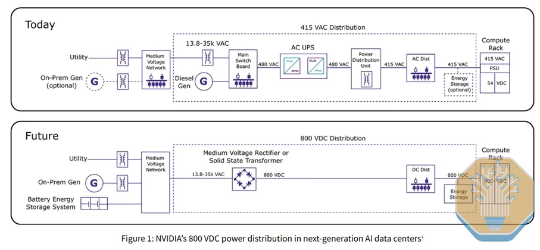
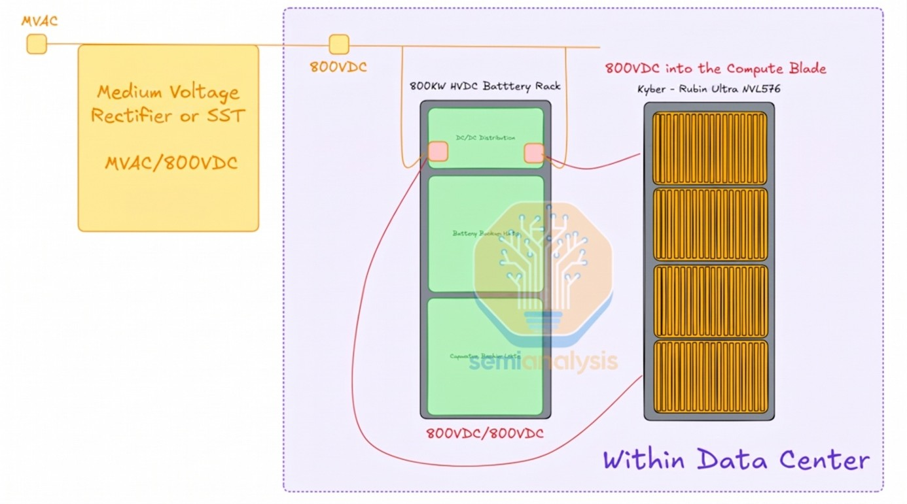

# Moving a converter moves an interface

Generated reading view. Edit [`course/expansion/foundations-power.json`](https://github.com/kiankyars/gigawatt/blob/main/course/expansion/foundations-power.json), lesson `d04-conversion-placement`, then run `uv run gigawatt-expand`.

**D04 · Authored draft · Objectives:** D04.3, D04.4

Compare two complete hypothetical paths at the same delivered boundary, allocate their losses, and test how centralization changes failure and expansion exposure.

**Driving question:** How should centralized and distributed conversion be compared fairly?

## Compare functions before naming the winning architecture

Electrical power changes form and voltage at several places between a utility connection and a processor. A transformer changes AC voltage. A rectifier converts AC to DC. An inverter converts DC to AC. A DC converter changes a DC voltage level. Actual products can package these functions together with controls, storage interfaces, and protection. Counting the boxes in a simplified drawing can therefore conceal what conversion really occurs.

In a distributed arrangement, conversion may sit near each load or rack. In a centralized arrangement, a larger conversion stage may serve several downstream loads. Those labels describe placement and grouping, not an automatic efficiency ranking. The important comparison is which conductors carry which voltage and waveform, where conversion losses occur, what protection and storage interfaces change, and which equipment is shared. The next domain develops specific high-voltage DC proposals; here we establish how to judge a comparison.

Choose a common endpoint. If one architecture is measured at the rack AC inlet and another at a downstream DC bus, their reported input powers are not directly comparable. Draw both paths from the same upstream boundary to the same useful electrical output. Include every different stage between them. Any unchanged stages beyond the endpoint can be excluded only if the exclusion is stated consistently for both alternatives.

## A DC/DC converter can contain a transformer, but it is not one

A transformer transfers energy through a changing magnetic field. It does not take steady DC on its own and continuously deliver a different DC voltage. A DC/DC converter is the complete circuit that changes DC voltage or regulates a DC output.

A non-isolated buck converter lowers voltage using a controlled switch, an inductor and filtering capacitors; it needs no transformer. In an isolated DC/DC converter, switches turn the DC input into a changing waveform, a transformer transfers energy and provides isolation, and rectification plus filtering produces the DC output. The transformer is one component inside that converter.

The UPS battery interface in the teaching diagram is intentionally generic: some designs connect batteries directly to the DC link, while others use a controlled converter. Neither arrangement justifies an assumption of zero internal transient or a universal battery-start delay.

## Why step down before rectifying?

A conventional route is medium-voltage AC → isolation and step-down transformer → controlled AC/DC converter → 800 V DC. The transformer reduces the voltage seen by the electronics and supplies isolation. The controlled converter establishes the required DC output; a plain rectifier alone does not turn 13.8 kV AC into an isolated 800 V bus.

This is a semiconductor and system-design tradeoff. A compact direct-MV converter needs devices that withstand higher voltage or multiple switches/cells that share it, with added isolation, control and protection demands. Commercial availability of higher-voltage SiC devices can reduce that complexity. The SemiAnalysis passage that motivates this question later explicitly acknowledges conventional MV rectification using series-stacked silicon devices; its device-scarcity point should not be converted into a universal 10 kV system limit.

Rectifying at medium voltage is possible. The design must manage device blocking voltage, AC peaks, transients, insulation and voltage sharing. Cascaded converter cells can divide the input voltage, so each semiconductor need not withstand the full system voltage. An SST combines electronic conversion with an internal high-frequency isolation transformer. It is one way to build the interface; 800 V DC distribution also works with conventional transformers and rectifiers.

Keep the units and product claim precise: 10 kV = 10,000 V. Wolfspeed announced a commercially available 10 kV SiC power MOSFET in March 2026. That is a device-category announcement, not a ceiling on rectifiable system voltage. A 2022 ETH/Delta/Paderborn study already described a 13.2 kV cascaded SST using 1,200 V devices.

## Read the architecture drawings from the same boundaries

In the first drawing, compare which AC conversion and distribution functions are grouped into the future 800 V DC interface. The single “medium voltage rectifier or solid-state transformer” block is a system abstraction: voltage reduction, isolation, controls and protection still need an implementation. The drawing’s “Today” and “Future” are the publisher’s conceptual alternatives, not a claim that all facilities follow either path.

NVIDIA architecture comparison, reproduced as Figure 1 in Wolfspeed’s March 2026 paper. User-supplied image preserved unchanged. The 480 V and 415 V labels belong to this example; storage and conversion details are condensed. [Wolfspeed, Figure 1, PDF page 3](https://assets.wolfspeed.com/uploads/2026/03/Wolfspeed_Powering_AI_with_reliable_SiC-based_solid-state_transformers_white_paper.pdf)

SemiAnalysis battery-rack concept. Upstream rectification does not remove downstream energy storage or distribution. The 800 kW and Kyber/Rubin Ultra labels are source-specific proposal labels, not validated course equipment ratings. “DC/DC distribution” here does not establish a voltage step-down. [SemiAnalysis — Inside the 800VDC Revolution, Part 1](https://newsletter.semianalysis.com/p/inside-the-800vdc-revolution-part)

## A complete two-stage loss calculation

Use an original scenario delivering 1 MW at the same rack-side DC boundary. Path A distributes AC with an assumed 98 percent path efficiency, then converts near the rack at 96 percent efficiency. Work backward from the 1 MW output. The rack converter needs 1/0.96 = 1.041667 MW input. The upstream AC distribution needs 1.041667/0.98 = 1.062925 MW. Total modeled loss is therefore approximately 62.925 kW.

Allocate that loss to its location. The near-rack converter dissipates 41.667 kW. The preceding distribution dissipates about 21.259 kW. Together they match the source-to-output difference, allowing for rounding. If a drawing moves the converter outside the rack boundary, the rack's apparent heat burden falls by the relocated amount, but the facility still has to supply and reject that loss unless the converter's actual performance changes.

Path B converts centrally at an assumed 97.5 percent efficiency and then distributes DC with an assumed 99 percent efficiency to the same endpoint. The downstream distribution requires 1/0.99 = 1.010101 MW input. The central converter requires 1.010101/0.975 = 1.036001 MW. Total modeled loss is about 36.001 kW: 10.101 kW in the distribution and 25.900 kW in the central converter. Under these supplied assumptions, Path B needs approximately 26.924 kW less source power.

This is an arithmetic result for two specified models, not evidence that DC universally saves that percentage. The efficiencies are hypothetical operating-point values, including only the stated stages. Different loading, voltage, conductor resistance, standby requirements, or equipment could reverse the outcome. Indeed, if Path B's conversion efficiency were 94 percent instead of 97.5 percent, its source requirement would rise to about 1.074575 MW, exceeding Path A.

## An efficient path must also fit the service

Centralization can remove equipment from individual racks or simplify a shared conversion interface. It can also put more loads behind a common component. If a shared converter is unavailable, which loads retain an independent compatible path? Does the replacement route have enough usable output, and do the connected loads tolerate the transition? A more efficient normal-state diagram is not automatically a better continuity design.

Distributed conversion can support incremental growth because conversion capacity can be added close to a new load group. It can also multiply maintenance points and impose packaging or service-access constraints near racks. Central equipment may be purchased before the full load arrives, so its partial-load and standby behavior matter during early phases. Compare the actual anticipated operating points, rather than assigning one full-load efficiency to every year of the campus plan.

A brownfield migration adds another constraint: equipment already installed has interfaces and limits. A new downstream architecture may retain the existing upstream transformer, service, or feeder. That retained equipment can continue to bind even if a conversion stage becomes smaller. Ask which components are reused, which are replaced, and which must temporarily coexist during migration. A lower eventual loss does not remove the need for a compatible transition plan.

Finish the comparison with a table of interfaces and a balanced loss ledger. Each path should identify its input and output type, voltage boundaries, losses, shared dependencies, and supported maintenance/failure states. Mark uncertain efficiency values as uncertain. That combination lets you ask whether a proposed change is worthwhile under the actual service brief, instead of being persuaded by a shorter line of boxes or a striking rack photograph.

## Worked example: Two routes to the same 1 MW DC output

- All efficiencies are hypothetical values at the compared operating point.
- Path A: AC distribution 0.98, then near-rack conversion 0.96.
- Path B: central conversion 0.975, then DC distribution 0.99.

1. Path A input — 1 / (0.98 × 0.96) = 1.062925 MW — Overall efficiency is the product because output from one stage becomes input to the next.
2. Path A total loss — 1.062925 − 1 = 0.062925 MW — The common 1 MW output is subtracted once.
3. Path B input — 1 / (0.975 × 0.99) = 1.036001 MW — Work backward through both included stages.
4. Difference — 1.062925 − 1.036001 = 0.026924 MW — The stated models differ by approximately 26.9 kW of source input.

**Result:** Path B wins this specified operating-point calculation; neither the placement label nor DC alone establishes the result.

**Model boundary:** Unchanged downstream silicon conversion and unspecified auxiliaries are outside both paths; real equipment curves and topology must be checked separately.

## The tradeoff

Choice: Move a shared conversion function upstream of several racks.

Benefit: It can change packaging and reduce loss under an appropriately specified design.

Cost: Shared failure exposure, partial-load operation, protection, and migration interfaces may become more consequential.

## When the situation changes

Trigger: Compare one architecture at an AC inlet with another at a downstream DC output.

Mechanism: Different included conversions make the reported powers incomparable.

Response: Redraw both from a common source boundary to a common delivered endpoint.

## Apply the idea

If Path B conversion efficiency falls to 0.94 while distribution remains 0.99, which path uses less source power?

Reveal the worked answer

Path A: 1.062925 MW versus Path B: 1/(0.94 × 0.99) = 1.074575 MW.

The altered assumption reverses the ranking. Path B now needs about 11.65 kW more input than Path A for the same output.

**The idea to keep:** Compare complete paths under matching conditions; moving a loss outside the rack does not eliminate it.

## Sources and reading boundaries

- [DOE — Best Practices Guide for Energy-Efficient Data Center Design](https://www.energy.gov/sites/default/files/2024-07/best-practice-guide-data-center-design_0.pdf) — Conversion stages and distribution placement affect electrical losses and operating efficiency. Read 2026-09-06. Read sections 6.1–6.3. Do not reuse the guide’s historical comparison as evidence for present architecture-wide savings; all efficiencies here are hypothetical.
- [Schneider Electric — Choice of transformer rating](https://www.electrical-installation.org/enwiki/Choice_of_transformer_rating) — Initial and future loading and installation conditions matter to upstream equipment selection. Read 2026-09-06. Read the public selection considerations; the lesson does not size a real transformer or declare an architecture optimal.
- [Wolfspeed — Powering AI with reliable SiC-based solid-state transformers](https://assets.wolfspeed.com/uploads/2026/03/Wolfspeed_Powering_AI_with_reliable_SiC-based_solid-state_transformers_white_paper.pdf) — Identify the supplied NVIDIA AC-versus-800-V-DC architecture figure and distinguish a system block from its internal conversion functions. Read 2026-09-10. Reviewed Figure 1 on PDF page 3 and surrounding architecture discussion. Vendor concept comparison, not an as-built site or universal migration plan. Numerical promotional claims are not adopted.
- [Texas Instruments — TIDA-011012 modular solid-state transformer reference design](https://www.ti.com/tool/TIDA-011012) — Explain how input-series converter submodules divide medium-voltage stress across lower-voltage semiconductor devices. Read 2026-09-10. Reviewed overview and feature list. Reference-design architecture, not a deployed data-center system; its stated DC-link voltages are not an 800 V output specification.
- [Huber et al. — Comparative Evaluation of MVAC–LVDC SST and Hybrid Transformer Concepts for Future Datacenters (IPEC 2022)](https://www.ams-publications.ee.ethz.ch/uploads/tx_ethpublications/1_IPEC_2022_Final_Huber.pdf) — Compare transformer-plus-rectifier and SST architectures for 800 V DC; separate system voltage from per-device voltage. Read 2026-09-10. Reviewed Figure 1 and Sections II–IV. The study includes a 13.2 kV cascaded design using 1,200 V devices. Efficiency and density results belong to its 2022 models and are not current universal rankings.
- [Wolfspeed — Introduction of a commercially available 10 kV SiC power MOSFET](https://www.wolfspeed.com/company/news-events/news/wolfspeed-introduces-industrys-first-commercially-available-10000v-silicon-carbide-power-mosfet/) — Scope and date the 10 kV SiC MOSFET announcement; distinguish device availability from achievable converter system voltage. Read 2026-09-10. Manufacturer announcement, March 5, 2026. Attribute the first-commercially-available claim to Wolfspeed and its SiC power MOSFET category. It does not establish that only one semiconductor technology or supplier can rectify medium voltage.
- [Inside the 800VDC Revolution – Part 1](https://newsletter.semianalysis.com/p/inside-the-800vdc-revolution-part) — The supplied battery-rack illustration motivates separating central rectification from downstream storage and distribution. Read 2026-09-10. Read the Phase 3 battery-rack section and voltage-rating claim. Figures are attributed source concepts; product forecasts and broad semiconductor-rating statements are not adopted as facts.
- [Texas Instruments — Basic Calculation of a Buck Converter’s Power Stage](https://www.ti.com/lit/an/slva477b/slva477b.pdf) — Figure 1 shows a buck converter made from switching, inductance and capacitance without a transformer. Read 2026-09-11. Reviewed basic configuration and inductor-ripple discussion. The continuous-conduction calculation is not an 800 V converter or UPS design.
- [Texas Instruments — TIDA-00349 isolated DC/DC converter](https://www.ti.com/tool/TIDA-00349) — Distinguish an isolated DC/DC converter system from its transformer: switching on the primary side and rectification on the secondary side are required functions. Read 2026-09-11. Low-power reference-design overview and topology reviewed; no efficiency, dimensions or power rating are extrapolated to a data-center battery interface.
