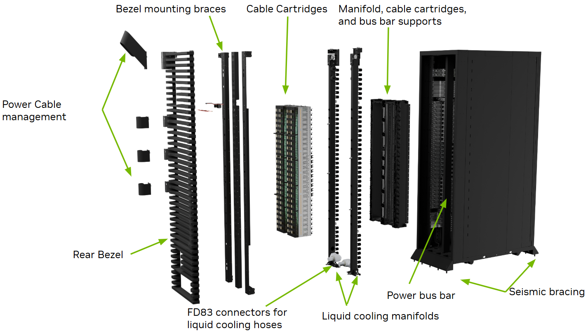

# Follow the watts through the rack

**8. Rack power and buffering**

Build an electrical ledger from the rack inlet to useful device rails, with separate conversion losses and auxiliary loads.

**Driving question:** Why is the sum of processor power ratings not the power entering the rack?

## Draw boundaries before calculating

A rack is a distribution system containing several kinds of load. Accelerators perform arithmetic, host processors manage execution, memory holds working state, switches move information, and management hardware keeps the system observable. Fans and pumps may also draw electricity inside the chosen rack boundary. Begin with the measured inlet, then draw arrows to each converter and load. Label an arrow with both voltage and power. Voltage describes the electrical interface; power describes the rate of energy transfer. Two arrows can carry the same power at very different currents.

A processor rating is attached to a particular device and operating convention. It does not automatically include the memory, conversion losses or external switches supporting that processor. Nor does a collection of ratings establish simultaneous measured demand. For a first ledger, declare a steady operating point and give every branch an assumed load. Later, compare that ledger with telemetry at matching timestamps. If one meter averages a minute while another samples a burst, apparent missing watts may be a measurement-boundary problem.

## Follow one rack from its AC feed to the rear DC busbar

A busway tap or remote power panel supplies the rack through its qualified power cables, often called whips. A power shelf is an assembly holding multiple power supply units (PSUs), a connection to the rack bus and monitoring/control hardware. A PSU converts alternating-current (AC) input into regulated direct-current (DC) output. The rack’s vertical busbar carries that output along the cabinet so trays can connect to a shared DC distribution system. The busbar is a conductor assembly, not a converter. Redundancy belongs to the actual sources, modules and paths, not to the name “power shelf.”

Use the named NVIDIA hardware accurately. A GB300 NVL72 rack holds 18 compute trays. Each tray carries two Grace Blackwell Ultra superchips, and each superchip pairs one Grace central processing unit (CPU) with two Blackwell Ultra graphics processing units (GPUs), so the rack holds 72 GPUs and 36 CPUs, joined by NVLink, NVIDIA’s direct GPU-to-GPU interconnect. All of them, with the switch trays that connect them, draw on the rack’s power system. The DGX GB rack guide describes a nominal 50–51 V DC rack bus, and its annotated DGX GB300 rear view, below, identifies the power busbar. The enterprise GB300 NVL72 reference lists eight 33 kW shelves, each with six 5.5 kW PSUs, and an up-to-142-kW full-rack requirement. These are different quantities and documentation boundaries; adding module labels does not establish continuously usable redundant rack capacity. The local 50–51 V bus is distinct from the proposed 800 V hall-distribution interface. The Open Compute Project’s Open Rack V3 (OCP ORv3), one original equipment manufacturer’s (OEM) NVL72 rack and NVIDIA’s DGX implementation are separate specifications, so read each number against the document that states it.

NVIDIA DGX GB300 rack, exploded rear view. The vertical power bus bar carries the rack’s 50–51 V DC supply to the trays. [NVIDIA DGX GB Rack Scale Systems, hardware guide](https://docs.nvidia.com/dgx/dgxgb200-user-guide/hardware.html)

## A three-phase shelf does not make every PSU a three-phase converter

Specify the electrical plane before labeling a voltage. In a balanced 480/277 V wye supply, 480 V is the root-mean-square (RMS) voltage between live phases and 480/√3 ≈ 277 V is the RMS voltage from a phase to neutral. Neither live phase is protective earth. A shelf can distribute the phases across single-phase PSU modules; its three-phase inlet does not imply that each module rectifies all three phases at 480 V.

Advanced Energy’s original ORv3 example makes the distinction concrete: its 3 kW PSU has a nominal 200–277 V single-phase AC input and a 50 V DC output, and six modules share a shelf. The six modules give the shelf 18 kW of installed capacity, and Advanced Energy rates it at 15 kW with N+1 redundancy: five modules carry the rated load and the sixth is the reserve. That product is an example of the interface distinction, not a claim about the precise wiring inside every GB300 shelf. A qualified 480/277 V path may omit an intermediate 480-to-208-V transformer used in another architecture, but the saved conversion stage does not establish a universal efficiency gain. Compare actual equipment loss at the same load and redundancy state.

## At 1 V, a small resistance takes a large share of the voltage

The final path from regulator to chip carries the largest current in the rack. A chip receiving 1 kW at 1 V draws 1,000 A, while the same 1 kW is only 20 A at 50 V. Current is local to each voltage plane: the 1,000 A flows only in the short path between the last regulator and the die, not all the way from the power shelf.

Give that final loop 100 microohms of resistance. The drop is ΔV = I × R = 1,000 A × 100 microohms = 0.1 V, so the regulator must supply 1.1 V for the chip to receive 1 V. The loop turns I²R = 1,000² × 0.0001 = 100 W into heat, so the regulator supplies 1,100 W: 1,000 W at the chip plus 100 W of loop heat. A 10 microohm loop drops only 0.01 V and dissipates 10 W, so the regulator supplies 1.01 V and 1,010 W. Losses inside the regulator and farther upstream come on top. A 0.1 V drop is a tenth of a 1 V rail, which is why the high-current route near the die must be short and low in impedance.

## Distinguish the converter from its output rail

The PSU supplies the rack DC bus. A board voltage regulator module (VRM) creates and controls the low voltage required by the compute circuits. Vcore names the conductive core-supply rail between that regulator output and the CPU cores; it is not an additional conversion stage. Local capacitors connect to this rail, supplying or absorbing brief current differences while regulation responds. A GPU has the same functional distinction.

An integrated voltage regulator (IVR) can perform the final voltage regulation on the processor die or within its package, replacing a conventional board-mounted VRM for the rails it supplies. It typically still needs an upstream converter. The IVR replaces the final regulation stage, not the entire power-conversion chain.

A direct converter can bring the rack voltage down to the core voltage near the processor. Alternatively, an intermediate bus converter first creates a lower distribution rail, such as 12 V, before a local VRM makes the core voltage. Both can keep the high-current 1 V path short. An intermediate stage can suit the selected downstream regulators and board arrangement; stage count alone does not determine the length of the final core-current path.

Meta’s Clemente compute tray, a GB300 design published through the Open Compute Project, uses the intermediate route. The rack bus supplies a nominal 51 V, with a normal input range of 46 to 52 V. An NVIDIA-designed power distribution board in the tray converts that supply to 12 V, and local regulators beside the processors then produce the processor rails. The specification also calls the same supply a nominal 48 V Open Rack bus and labels its power diagram 50 V; those are three names for one low-voltage bus, not three conversion steps. It leaves the final processor voltages and regulator phase counts unstated, so a ledger built from this document stops at the 12 V rail.

Texas Instruments’ TIDA-050095 is a contemporary 48-to-12 V, 2 kW reference design. Infineon documents both intermediate-bus and direct-to-point-of-load architectures. These examples establish available approaches, not their share of current GPU-rack shipments or the undisclosed layout of a particular GB300 board.

Two conversion efficiencies multiply: 98% followed by 95% gives 93.1% overall. A direct converter may do better or worse at the relevant input voltage, output voltage and load. A fair comparison includes both converter losses and conductor losses, plus space, cooling and transient response. Neither equal total voltage reduction nor smaller individual voltage steps guarantees equal or better efficiency.

## Several switching paths can share one VRM output

A multiphase regulator has several switched paths, each with switching devices and an inductor. Their output currents join at the same rail. Offsetting the switching times makes some rising currents overlap falling currents, reducing variation in their sum while sharing the average load.

Splitting the current reduces what each path carries: four phases sharing a 1,000 A load average 250 A each. Interleaving also shrinks the ripple of their sum. In a two-phase example converting 12 V to 3 V at a 25 percent duty cycle, each phase averages 20 A with 6 A of peak-to-peak ripple. If both switch at the same moment, their sum swings from 34 to 46 A, a 12 A ripple. Offsetting the second phase by half a switching period holds the sum between 38 and 42 A, a 4 A ripple around the same 40 A average. Output capacitors support the remaining difference between regulator and load current, while feedback maintains rail voltage. These high-frequency converter phases are not the facility’s three-phase AC.

Four phases are not four independent VRMs and do not alone establish redundancy. Fault tolerance requires the relevant detection, isolation and surviving-capacity design. What interleaving provides is current sharing and a smaller combined ripple.

Processor boards scale the same idea. Motherboards use different numbers of converter paths around the CPU: a layout might have 6, 12 or 18, each a set of switching devices and an inductor feeding the same rail. More interleaved paths share the load and reduce ripple, but the count alone does not rank a board: controller timing and component ratings set its behavior, and an advertised power-stage count can exceed the number of independently controlled phases.

## Conversion moves the loss as well as the voltage

For a converter with efficiency eta, useful output equals eta times electrical input. Therefore input equals output divided by eta, and loss equals input minus output. Work backward from the loads when the question is how much upstream capacity is required. If two converters operate in series, their efficiencies multiply. If two loads operate on parallel branches, their input powers add. Adding efficiencies, or applying a series product to parallel loads, gives an incorrect answer even when every component rating is accurate.

Conversion loss becomes heat where the conversion takes place. Moving an AC-to-DC stage into a separate power rack can move some heat and occupied space out of the compute rack. It does not make that heat disappear from the building. The final low-voltage regulation close to silicon still matters: supplying a high distribution voltage does not mean applying that voltage directly to a processor. Preserve the distinction between distribution bus, intermediate rail and point-of-load regulator in every diagram.

## Current is a local consequence of the boundary

At a declared DC boundary, P = V × I. A synthetic 100 kW load draws 2,000 A at 50 V and 125 A at 800 V. That sixteenfold difference follows from holding delivered power constant. It says nothing by itself about the total efficiency of two complete architectures. To compare conductor heating with I²R, first specify the same conductor resistance, including the return path. To compare conductor designs, resistance changes with geometry, length, temperature and connection details. Those are different comparisons.

For example, use a deliberately fixed 1 milliohm round-trip resistance. The idealized heating is 4 kW at 2,000 A and about 15.6 W at 125 A. This dramatic ratio is a property of the stipulated currents and unchanged resistance, not a predicted saving for a real rack. It excludes converters, connectors, insulation spacing, protection and cooling. A fair system comparison follows all losses from the same upstream point to the same useful loads, at the same operating conditions. The lower-current result is a reason to investigate architecture, not a completed design.

## Follow the power stack from grid to chip

The path from the grid to a GPU die passes through four functions: grid and substation equipment, building distribution with its uninterruptible power supply (UPS), rack power supplies, and point-of-load regulation beside or inside the processor package. Silicon carbide (SiC) and gallium nitride (GaN) power semiconductors are technologies inside those converters rather than a separate stage. Each function converts or distributes power and turns some of it into heat where it sits, which is why a rack ledger follows the watts one boundary at a time.

## Worked example: A synthetic rack power ledger

- A group of processor rails delivers 72 kW at a steady point.
- Point-of-load conversion efficiency is 92%. Other DC-bus loads total 12 kW, including all auxiliaries inside this example.
- The rack AC-to-DC shelf operates at 97% efficiency; no other electrical stages are inside the rack boundary.

1. Feed the processor regulators — 72 / 0.92 = 78.261 kW — The difference, 6.261 kW, is regulator loss.
2. Add parallel DC loads — 78.261 + 12 = 90.261 kW — The shelf supplies both branches; the 12 kW is already measured at its bus.
3. Find rack input — 90.261 / 0.97 = 93.052 kW — The shelf dissipates another 2.792 kW.
4. Close the ledger — 72 + 12 + 6.261 + 2.792 ≈ 93.052 kW — Rounding explains the last decimal; no load is counted twice.

**Result:** A 72 kW processor total corresponds to about 93.05 kW at this synthetic rack inlet.

**Model boundary:** The assumed efficiencies are illustrative operating points, not product specifications. Facility UPS losses and room cooling are outside this rack ledger.

## When the situation changes

Trigger: An engineer allocates a feeder using processor power alone.

Mechanism: In the worked example, processor rails take 72 kW but the rack inlet draws about 93.05 kW: 12 kW of parallel host, memory, switch and auxiliary load plus about 9.05 kW of conversion loss, which a processor-only allocation omits.

Response: Reconcile a component ledger with inlet measurements for the specified workload and redundancy state before changing the allocation.

## Apply the idea

The 12 kW auxiliary branch increases to 18 kW while every other assumption remains fixed. How much additional AC input is required, and why is it not 6 kW?

Reveal the worked answer

Additional input is 6 / 0.97 = 6.186 kW; total rack input becomes about 99.238 kW.

Only the conversion stages upstream of a changed branch affect its incremental demand. Applying the 92% regulator efficiency would invent a path that this branch does not traverse. An actual shelf may change efficiency with loading, so the fixed-efficiency answer is a controlled approximation.

**The idea to keep:** Every efficiency has an input and output boundary; every watt entering the rack must have a destination.

## Sources

- [NVIDIA NVL72 AI Factory — System Hardware & Components](https://docs.nvidia.com/enterprise-reference-architectures/nvl72-ai-factory/latest/components.html) — NVIDIA · Reviewed 2026-09-12. The NVL72 rack combines compute, switching, management and power-shelf components.
- [NVIDIA DGX GB Rack Scale Systems — Hardware](https://docs.nvidia.com/dgx/dgxgb200-user-guide/hardware.html#power-shelves) — NVIDIA · Reviewed 2026-09-17. The DGX GB300 rear view identifies the power busbar; the guide distinguishes PSUs from power shelves and gives a nominal 50–51 V rack bus.
- [Advanced Energy — ORv3 Power Supply Unit](https://www.advancedenergy.com/en-us/products/ac-dc-power-supply-units/power-shelves/ocp-compliant/orv3-psu/) — Advanced Energy · Reviewed 2026-09-12. A 3 kW ORv3 PSU with nominal 200–277 V single-phase AC input and 50 V DC output; six modules share one shelf, with 18 kW installed and a 15 kW N+1 rating, and the shelf’s input arrangement differs from each PSU’s.
- [Texas Instruments — TIDA-050095 48V–12V 2kW four-phase bus converter](https://www.ti.com/tool/TIDA-050095) — Texas Instruments · Reviewed 2026-09-12. A 2 kW, 48-to-12 V four-phase intermediate bus converter reference design: transformer-less DC/DC conversion ahead of point-of-load regulation.
- [Texas Instruments — The decoupling capacitor: is it really necessary?](https://e2e.ti.com/blogs_/archives/b/precisionhub/posts/the-decoupling-capacitor-is-it-really-necessary) — Texas Instruments · Reviewed 2026-09-12. Short local current paths and trace inductance explain why device decoupling is separate from distant stored energy.
- [Infineon — 200 W dual output 48V-to-PoL single step converter](https://www.infineon.com/assets/row/public/documents/24/42/infineon-dc-dc-converters-200w-dual-output-48v-pol-single-step-converter-xdpp1100-digital-controller-applicationnotes-en.pdf) — Infineon · Published 2020 · Reviewed 2026-09-15. Pages 5–8 compare intermediate-bus and direct-to-load conversion architectures.
- [TI — Benefits of a multiphase buck converter](https://www.ti.com/lit/an/slyt449/slyt449.pdf) — Texas Instruments · Published 2012 · Reviewed 2026-09-15. Interleaved converter paths share output current and reduce combined ripple.
- [Intel — Fully Integrated Voltage Regulator (FIVR)](https://edc.intel.com/content/www/us/en/design/ipla/software-development-platforms/servers/platforms/intel-pentium-silver-and-intel-celeron-processors-datasheet-volume-1-of-2/fully-integrated-voltage-regulator-fivr/) — Intel · Reviewed 2026-09-18. Compute-die FIVRs derive processor rails from an upstream platform VCCIN regulator. Integration relocates final regulation while retaining upstream conversion.
- [NVIDIA GB300 NVL72 — Specifications](https://www.nvidia.com/en-us/data-center/gb300-nvl72/) — NVIDIA · Reviewed 2026-09-14. The GB300 NVL72 rack contains 72 Blackwell Ultra GPUs and 36 Grace CPUs.
- [Meta / OCP — Clemente compute tray specification](https://www.opencompute.org/documents/clemente-compute-tray-ocp-specification-final-pdf) — Meta / Open Compute Project · Reviewed 2026-09-18. Meta’s OCP Clemente GB300 compute tray takes a nominal 51 V rack input (46–52 V normal range); an NVIDIA-designed power distribution board converts it to 12 V ahead of local processor regulators. Final core voltages and phase counts are not stated.
