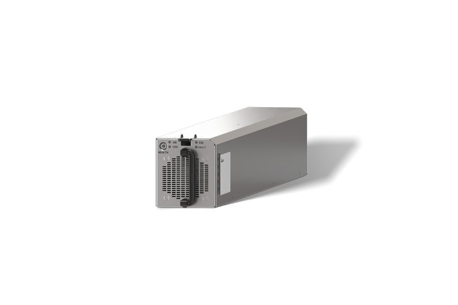
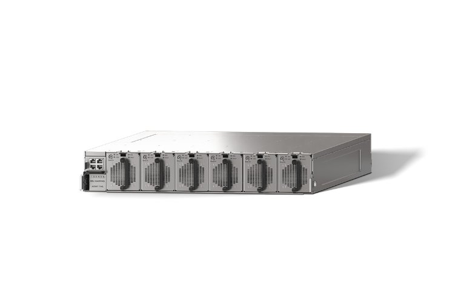

# A rack upgrade is an interface negotiation

**8. Rack power and buffering**

Test a higher-density rack against electrical, thermal, mechanical and operational constraints before accepting the upgrade path.

**Driving question:** Why can a retrofit reject the architecture that looks best on an empty site?

## Start with a service brief and two inventories

Write the desired service first: a workload, useful-throughput target, availability expectation and date. Then create two inventories. The first describes the existing site: available feeder capacity under the intended redundancy condition, cooling interfaces, physical access, floor support, management network and permitted maintenance windows. The second describes the proposed rack: input range, continuous and transient power, coolant conditions and manifold connections, residual air heat, weight, cabling, service clearances and restart behavior. The project consists of reconciling those inventories, not merely fitting the new cabinet into an old footprint.

A missing value is a project risk to resolve, not a zero. If rack weight is unknown, do not infer it from a photograph. If a supplier specifies cooling capacity without fluid and temperature conditions, the interface is incomplete. If the operator promises a maintenance window but the customer cannot checkpoint within it, the operational interface is incomplete. Identify the owner of each missing specification and the evidence that will close it.

## Read the rack format before counting equipment

For a conventional 19-inch rack of the Electronic Industries Alliance (EIA) standard, “19-inch” names the nominal equipment mounting format, not the exterior cabinet width. Vertical space is allocated in rack units: 1U = 1.75 inches = 44.45 mm of mounting pitch. A 2U device occupies two such positions. Its actual enclosure dimensions and mounting kit still come from its specification.

A 42U rack offers 42 units of usable mounting height: 42 × 44.45 = 1,866.9 mm, or 73.5 inches. This is not its outside height; the frame, base and other structure add to the overall dimensions. Check the exterior dimensions separately when planning doorways and placement.

Make a small synthetic rack-space ledger: twelve 2U servers occupy 24U, two 1U switches occupy 2U, a stipulated power shelf occupies 4U, and horizontal cable management occupies 2U. Total allocation is 24 + 2 + 4 + 2 = 32U, leaving 42 − 32 = 10U. Those ten free units are space, not permission to add five more servers. Mounting width, usable depth, equipment weight, electrical power, cooling and service clearances must each fit independently. These quantities are a classroom arrangement, not a product bill of materials.

Do not silently substitute OCP OpenU (OU) for EIA U. The Open Rack V3 base specification defines 48 mm OpenU spacing and separately describes optional 44.45 mm EIA rack-unit support. A label such as 1OU therefore does not mean 1U. Record the actual rack specification, mechanical option and mounting interfaces; an AI rack need not follow the conventional format used in the 42U example.

## Separate steady power from the time response

A feeder can have sufficient average capacity while a load transient still violates a converter’s permitted voltage range. Conversely, a short burst can be buffered locally even when a longer increase cannot be sustained. Plot power against time and label which device responds over each interval. Energy is the area between demand and supply. A 40 kW deficit lasting 0.2 seconds requires 8 kJ delivered to the relevant bus. That arithmetic does not select a battery or capacitor: voltage droop, accessible energy, conversion power, control delay and repetition frequency remain to be established.

For a capacitor model, usable energy between two allowed voltages is one half of capacitance times the difference of their squares. The usable range matters more than total nameplate energy when the load cannot tolerate deep voltage reduction. For a repeated burst, the source must also replenish the buffer between events. A buffer solves a temporary mismatch only while its power and energy limits permit it. It cannot make a permanently overloaded feeder adequate, and recharge can create a new upstream peak.

## Stored energy must be electrically close enough to serve the event

Separate three physical scales. Package and board capacitors provide local transient current at device rails. Rack-bus capacitors and qualified battery backup units (BBUs) support their DC distribution bus. Facility UPS batteries or a battery energy storage system (BESS) act through a larger conversion and distribution path and may serve a broader set of loads. “Closer to compute” is meaningful because impedance, conversion stages and control response sit between stored energy and the load; merely owning more kWh farther away does not remove a fast voltage disturbance at the chip.

Trace the complete forward-and-return path. A changing current creates an inductive voltage term L × di/dt, while resistance produces I × R. Local decoupling shortens the loop that initially supplies a transient. The next regulated stage and its source then take up more load as their controls and power stages respond. These contributions overlap; capacitors do not wait until a fixed timer expires and then hand all power to a battery. An online UPS avoids an output transfer to an inverter that is already running, but its DC-link, battery interface and downstream regulators still have finite dynamics.

For an explicit bus-level model, let demand rise by 40 kW while the upstream converter’s additional contribution rises linearly from zero to 40 kW over 0.2 s. The local buffer, here a rack BBU acting through its converter, supplies the declining difference. Its delivered energy is the triangle ½ × 40 kW × 0.2 s = 4 kJ; a wholly unsupported 40 kW for that interval would instead require 8 kJ. Doubling the stipulated response interval to 0.4 s doubles required energy to 8 kJ while the initial buffer power remains 40 kW. The model excludes resistance, inductance, voltage droop and losses. It separates the energy deficit from the device’s peak power and timing requirements.

The same account runs in reverse when demand falls. If GPU demand drops by 40 kW while the power shelf takes 0.2 s to ramp its output down linearly, the bus receives a triangular surplus of ½ × 40 kW × 0.2 s = 4 kJ; a 0.4 s ramp gives 8 kJ. A bidirectional buffer must absorb that surplus through its controlled converter, starting at 40 kW of charging power in either case, while keeping bus and storage voltages within their limits. Capacitors take the first instant; a battery helps only through a converter and charging controls designed for the transient. A full or charge-limited buffer cannot take the energy, so bus voltage rises unless the source reduces its output faster or another engineered path absorbs the surplus. The 40 kW in these ramps is an assumed buffer power for the example, separate from the 15 kW rating of the Delta Battery Backup System described below.

A capacitor’s usable energy is ½C(Vinitial² − Vminimum²). It must satisfy both the energy account and the permitted voltage/time response. A BBU needs an adequate discharger, charged cells, protection, coordination and a qualified bus interface. A BESS at the facility can help a grid-side power schedule or longer interruption but does not substitute for local chip decoupling. A rack-only BBU also does not by itself keep facility pumps, cooling or remote switches alive.

Group backup sources by their electrical connection rather than by a fixed timed sequence. A generator after startup and connection, or a site BESS through its inverter, can support the facility bus. Rack BBUs support their qualified rack DC bus. Local capacitors support device rails. Which loads continue operating depends on those connections and controls, and source contributions can overlap.

## A BBU is not one universal battery per NVL72 rack

BBU can mean an individual module or a whole shelf in informal discussion; identify which. The ORv3 example has six BBU modules in a shelf with 5+1 redundancy. The OCP module specification calls for 3 kW per module and at least 240 s of discharge under its declared cell-state, temperature and aging conditions. For a 15 kW protected load, five surviving 3 kW modules pass the power screen after one module fails; four supply only 12 kW after two failures. The example establishes an interface-specific capacity calculation, not a BBU count for a 142 kW rack.

The same specification includes a nonzero activation/ramp interval and commanded peak-shaving capability. Whether a deployment uses those functions depends on its configuration and qualification. NVL72 names a domain of 72 GPUs joined by NVLink, NVIDIA’s direct GPU-to-GPU interconnect; it does not prescribe one BBU module or shelf. Choose the storage architecture using the protected load, discharge power, required duration, voltage compatibility, failure condition and recharge policy. NVIDIA’s rack documentation sets no fixed ratio of BBUs to NVL72 racks.

Delta’s removable 3 kW BBU and its six-module, 15 kW Battery Backup System, pictured below, show the form factor. Delta specifies 48 V DC output and four minutes at rated load after four years of service, with an operating-temperature range of 0–40°C. The published system rating is 15 kW; the separate ORv3 module-capacity exercise does not turn this specific product into an 18 kW system. The photographs show the hardware, not a BBU count or configuration for NVL72.

Delta’s product page gives six 3 kW battery modules and a 15 kW shelf rating without stating that the rating reflects N+1 operation. Analog Devices separately identifies the ORv3 six-module example as 5+1. The arithmetic is consistent, but one product’s design intent should not be inferred solely from its module count.

Delta 3 kW BBU module. [Delta Electronics, 3 kW BBU and 15 kW Battery Backup System](https://www.delta-americas.com/en-US/products/Power-Management/12018)

Delta six-module Battery Backup System, rated 15 kW with 48 V DC output. [Delta Electronics, 3 kW BBU and 15 kW Battery Backup System](https://www.delta-americas.com/en-US/products/Power-Management/12018)

## Repeated bursts must leave time and capacity to recharge

Take a DC-bus example with a source capped at 120 kW. The rack normally draws 110 kW, then 160 kW for 0.2 s. A qualified buffer supplies the 40 kW gap, delivering 8 kJ. During the 110 kW interval only 10 kW of source headroom remains, so ideal recharge requires 8/10 = 0.8 s. At 10 s between bursts there is time to refill. At only 0.2 s between bursts, the source can replace just 2 kJ and each cycle loses 6 kJ from the buffer.

The rapid pattern also averages (160 × 0.2 + 110 × 0.2)/0.4 = 135 kW, exceeding the 120 kW source indefinitely. Adding storage delays depletion; it cannot fix that sustained energy shortfall. Reduce or reschedule demand, supply more average power, or accept shorter operating duration. Real losses, discharge limits, battery cycling and a reserved backup state of charge narrow the feasible envelope further. Peak shaving and outage reserve therefore compete for the same usable stored energy unless the design explicitly allocates both.

Compare two quiet intervals after an 8 kJ burst, with 10 kW of recharge power available. One second offers 10 kJ, enough to restore the buffer; half a second offers only 5 kJ. Charging stops once the missing energy has been replaced. The short interval leaves a repeated deficit, so a larger battery postpones depletion rather than fixing the average-power imbalance.

## Brownfield and greenfield optimize different things

On an empty site, the designer can coordinate power rooms, pipe routes, service access and equipment zones before construction. In an occupied building, the same change may require planned outages, temporary capacity and work beside operating systems. Retained assets have both value and constraints. A hybrid power rack may preserve part of the AC system while consuming scarce floor positions. Facility-level DC might offer a cleaner future layout but require a much larger conversion project. The comparison must value time and disruption alongside equipment losses.

Use a decision table whose columns are throughput available by the required date, enabling works, service access, power headroom, cooling headroom and reversibility. Reject a route when a hard requirement cannot be met; score preferences only after that. Then perform a reversal test: identify the smallest plausible change that would alter the choice. If one extra feeder upgrade makes the delayed route attractive, obtain that cost and schedule before declaring a winner. An architecture decision becomes stronger when the team can say what evidence would change it.

## Worked example: A sidecar does not increase feeder capacity

- An existing row has 240 kW available at its AC allocation boundary under the required operating condition.
- Two new compute racks each need 120 kW DC. A shared sidecar is assumed 96% efficient and has 3 kW of additional upstream-fed auxiliaries.
- No simultaneous-load discount is allowed. An alternative reduced setting is 110 kW DC per rack.

1. Test full rack demand — (2 × 120) / 0.96 + 3 = 253 kW — The requested DC output already consumes all nominal AC headroom before losses.
2. Find the shortfall — 253 − 240 = 13 kW — Moving conversion outside the rack does not remove this upstream requirement.
3. Test the reduced setting — (2 × 110) / 0.96 + 3 = 232.167 kW — The lower load leaves about 7.833 kW of modeled electrical headroom.

**Result:** The full setting fails the 240 kW electrical constraint. The reduced setting passes this one arithmetic screen but still needs workload and interface acceptance.

**Model boundary:** These are synthetic allocations, not conductor ampacities or permission to operate equipment. No real rack power cap or performance response is implied.

## The tradeoff

Choice: Use a staged retrofit with a lower initial rack power setting.

Benefit: Potentially meet an earlier service date while completing enabling work later.

Cost: Useful throughput may fall or become workload-dependent; two qualification cycles and future interruptions may be required.

## When the situation changes

Trigger: The design passes steady-state checks but startup triggers simultaneous charging and compute demand.

Mechanism: The aggregate transient exceeds the agreed input envelope or causes a voltage excursion even though the eventual steady point fits.

Response: Have the responsible engineering teams validate startup sequencing, buffer recharge and load-step behavior against both supplier and site limits.

## Apply the idea

The project can obtain another 20 kW of allocation, but doing so adds six weeks. Its customer needs service in three weeks and accepts a verified lower-throughput mode temporarily. Which route is defensible?

Reveal the worked answer

A staged reduced-load route can be defensible if it passes all interfaces and the customer’s measured service target; schedule the larger allocation as a separate enabling phase.

The full setting would then fit the expanded 260 kW allocation, with only 7 kW of modeled margin, but it misses the initial date. The customer’s acceptance changes the feasible set. Without measured low-power throughput and a qualified migration procedure, even the staged route remains a proposal.

**The idea to keep:** An upgrade succeeds only when every required interface can support the agreed operating and failure states.

## Sources

- [Open Rack/SpecsAndDesigns](https://www.opencompute.org/wiki/Open_Rack/SpecsAndDesigns) — Open Compute Project · Reviewed 2026-09-06. Rack, power, connector, battery and manifold interfaces are documented separately with revisions.
- [Why Scaling AI Compute Performance Requires a New Power Architecture](https://blogs.nvidia.com/blog/800-vdc-power-architecture-ai-factory/) — NVIDIA · Published 2026-08-11 · Reviewed 2026-09-06. A hybrid power-rack category can retain upstream AC distribution.
- [Eaton — Rack Basics: Selection, Installation and Cooling](https://web.archive.org/web/20260921080636/https://tripplite.eaton.com/support/rack-cabinet-basics-selection-installation-cooling) — Eaton · Reviewed 2026-09-26. EIA 19-inch mounting terminology, 1.75-inch rack units, usable U height versus external cabinet height, and separate depth and load considerations.
- [Open Compute Project — Open Rack V3 Base Specification, revision 1.0](https://www.opencompute.org/documents/open-rack-base-specification-version-3-pdf) — Open Compute Project · Reviewed 2026-09-17. Sections 6, 6.1.2 and 6.1.3 distinguish 48 mm OpenU spacing from optional 44.45 mm EIA rack-unit support and allow exterior frame dimensions to vary.
- [OCP — Open Rack V3 48V BBU Module Specification revision 1.4](https://www.opencompute.org/documents/open-rack-v3-bbu-module-spec-1-4-pdf) — Open Compute Project / Meta · Reviewed 2026-09-12. A specific modular BBU: 3 kW discharge, at least 240 s under specified conditions, nonzero activation/ramp interval and optional commanded peak-power shaving.
- [Analog Devices — Smart Battery Backup for Uninterrupted Energy, Part 4: BBU Shelf Operation](https://www.analog.com/en/resources/analog-dialogue/articles/smart-battery-backup-for-uninterrupted-energy-part4.html) — Analog Devices · Published 2024-04 · Reviewed 2026-09-12. ORv3 BBU shelf shared-bus architecture, six modules in 5+1 redundancy, monitoring and controlled discharge.
- [Texas Instruments — The decoupling capacitor: is it really necessary?](https://e2e.ti.com/blogs_/archives/b/precisionhub/posts/the-decoupling-capacitor-is-it-really-necessary) — Texas Instruments · Reviewed 2026-09-12. Short local current paths and trace inductance explain why device decoupling is separate from distant stored energy.
- [Delta Electronics — 3 kW BBU and 15 kW Battery Backup System](https://www.delta-americas.com/en-US/products/Power-Management/12018) — Delta Electronics · Reviewed 2026-09-13. Delta’s removable 3 kW BBU module and six-module Battery Backup System, rated 15 kW with 48 V DC output.

## Check your understanding: Can a bigger battery keep up?

Pause and make a prediction, then compare your reasoning.

A rack's direct current (DC) bus has a source limited to 200 kW. The rack normally draws 180 kW and bursts to 260 kW for 0.5 s. A battery backup unit (BBU) supplies the demand above 200 kW and recharges only from the source headroom between bursts. Ignore losses. A proposal doubles the BBU's usable energy so that a new burst can start 0.5 s after the previous one ends.

**Pause and predict:** Will the larger BBU sustain bursts separated by 0.5 s? Find the shortest gap between bursts that the 200 kW source can support.

Compare your reasoning

No. Each burst takes 30 kJ from the BBU, and 20 kW of headroom needs 1.5 s to put it back. With 0.5 s gaps the rack averages 220 kW, more than the source can supply, so any BBU eventually runs empty.

Each burst needs 260 − 200 = 60 kW from the BBU for 0.5 s: 60 × 0.5 = 30 kJ. Between bursts the rack uses 180 kW of the 200 kW source, leaving 20 kW to recharge, so refilling takes 30 / 20 = 1.5 s. With a 1.5 s gap the pattern averages (260 × 0.5 + 180 × 1.5) / 2.0 = 200 kW, exactly the source limit.

With a 0.5 s gap the source replaces only 20 × 0.5 = 10 kJ, so the BBU falls 20 kJ further behind on every cycle. Doubling its stored energy roughly doubles the number of bursts before it is empty; the 20 kJ lost per cycle stays the same. Lasting fixes act on average power: fewer or shorter bursts, longer gaps or a larger source. Energy spent on bursts is also energy the BBU cannot hold for an outage.

**The next problem:** At a 50 V bus, a 100 kW rack draws 2,000 A. What changes, and what stays the same, when power reaches the rack at 800 V DC?

Continue in **9. 800 V DC distribution**: 800 V is an interface, not an entire architecture.
