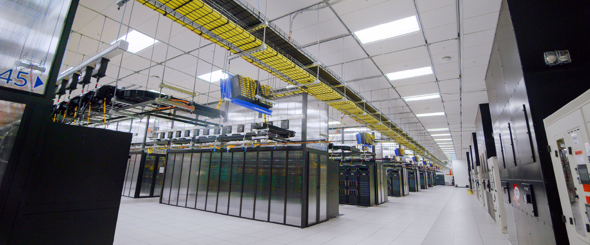

# Storage is a traffic and state system

Generated reading view. Edit [`course/expansion/racks-compute-heat.json`](https://github.com/kiankyars/gigawatt/blob/main/course/expansion/racks-compute-heat.json), lesson `d09-storage-paths`, then run `uv run gigawatt-expand`.

**10. Storage, orchestration and recovery · Authored draft**

Separate dataset, cache and checkpoint paths, then model capacity, metadata and sustained throughput independently.

**Driving question:** Why can a large, fast storage array still leave accelerators waiting?

## Give each storage tier a job

Local storage can stage data near a node and absorb temporary output. Shared storage can provide a common namespace or service to many workers. Object storage exposes objects through its API and can serve as a durable dataset or checkpoint destination under its configured guarantees. These are roles and interfaces, not a universal speed ordering. A well-designed remote path can outperform a poorly used local device, and a local cache can disappear with the node that holds it. Record what each tier stores, who can access it and what failure it is expected to survive.

Trace ingestion and checkpointing as separate paths. Dataset bytes move toward execution, potentially through decoding and caches. Checkpoint bytes move away from an evolving application state toward a recoverable version. Their timing can differ: ingestion may be relatively continuous while many workers checkpoint together. A shared fabric or backend must handle the combined demand under the intended scheduling policy. Two workloads that each meet a bandwidth target in isolation may interfere when synchronized in production.

## Three resource questions hide behind one word

Capacity asks whether the stored data, retained versions, temporary space and redundancy overhead fit. Throughput asks how many bytes the system can sustain for a specified access pattern and concurrency. Metadata performance asks how quickly the system can locate, create, inspect or commit the records describing those bytes. A million tiny files can be constrained by per-object work even when their total payload is small. A large sequential file can exercise a very different path from random small reads.

Compression, sharding and caching change these demands. Combining small records into larger containers can reduce metadata operations but makes random access, updates and parallel ownership different. Compression reduces transported bytes but adds work to encoding or decoding and may change the stage that limits throughput. Caching can make a repeated test look fast while hiding the cold-start path. A storage test must therefore declare dataset size relative to cache, operation sizes, concurrency, read/write mix and whether data was already resident.

## Case study: Meta Research SuperCluster stores and prepares data in tiers

Meta’s January 2022 RSC description separates 175 PB of bulk storage, 46 PB of cache and 10 PB of NFS storage. These quantities describe different service roles and can contain overlapping data; adding them does not establish a unique dataset size. Meta’s AIRStore preprocessing prepares reusable training data and reduces repeated transfers across regional networks. This is the reason for the tiers: the GPUs need a sustained supply of ready-to-use inputs, not simply enough installed storage to hold the files. The article’s 16 TB/s figure was a phase-two target, so the slides do not treat it as a demonstrated rate.

Meta’s AI Research SuperCluster data hall, published January 2022. [Meta](https://ai.meta.com/blog/ai-rsc/)

## A checkpoint needs a completion definition

A distributed checkpoint can contain shards from many workers plus metadata that identifies one coherent state. Writing some shards is not the same as completing that checkpoint. The application needs a way to know that all required data belongs to the same saved version and has reached the promised persistence boundary. A partial new checkpoint should not silently replace the last usable one. The precise commit mechanism depends on the storage system and framework, so teach the invariant before presenting an implementation.

A successful write call can mean different things at different interfaces. Data may be in an application buffer, operating-system cache, a local device or a remote service with specified replication semantics. The recovery claim must name the boundary that was reached and the failures it survives. Checksums can detect some corruption, but do not by themselves create redundancy or authorize access. Replication can improve availability, but synchronized deletion or a bad application write can propagate. A separate retained recovery copy addresses a different failure class.

## Use an end-to-end bottleneck model

For a bulk transfer, compare the source’s ability to produce bytes, the host path, network, destination ingestion and backend persistence. The lowest effective rate is an optimistic sustained bound if all stages overlap. Add serialized setup and commit work when the stated implementation requires it. Do not divide a checkpoint by the sum of drive datasheet bandwidths and call that the recovery time. Restart also includes scheduling, environment setup, reading state, reconstructing distributed ownership and reaching the first valid new output.

## Teaching model: follow bytes through the whole path

The slide exercise fixes one prepared-byte boundary and a GPU demand of 12 GB/s. Source storage can deliver 16 GB/s, the network 24 GB/s and host preparation initially 8 GB/s. With overlapped stages and enough buffering, the host limits supply to 8 GB/s, so the GPU can receive only two-thirds of its demanded input rate. Raising host preparation to 20 GB/s moves the upstream limit to the 16 GB/s source, which can now meet the 12 GB/s demand. This is an input-supply account, not a measurement of a particular accelerator. If decoding changes byte size, convert each stage to the same batch or prepared-byte boundary before comparing rates.

The checkpoint exercise keeps 512 GB fixed while changing 4,096 shards into 65,536. At 1,024 serialized setup operations per second, setup grows from 4 to 64 seconds. A 16 GB/s payload path still transfers the data in 32 seconds, followed by a two-second commit: the total grows from 38 to 98 seconds. With the original shard count, raising source staging to 32 GB/s instead moves the payload bottleneck to the 20 GB/s backend, giving 4 + 25.6 + 2 = 31.6 seconds. These phases and ordering are the exercise inputs; other storage implementations can overlap or batch their metadata work.

## Case study: online replicas did not replace Gmail’s recovery copies

In February 2011, Google reported a storage-software bug that affected multiple online copies of some Gmail users’ data. Google stopped and rolled back the update; offline tape copies survived outside the failure’s reach and supported restoration. Replication had protected against losing individual storage components, but the software fault crossed that protection boundary. Retained recovery copies and a working restore path addressed the different loss. The example concerns that historical incident, not today’s Gmail architecture.

## Worked example: A synthetic checkpoint has more than payload time

- A 512 GB checkpoint is written in 4,096 shards.
- Effective aggregate rates are 16 GB/s for source staging, 24 GB/s for the network and 20 GB/s for backend persistence. Payload stages overlap ideally.
- For this constructed implementation, shard setup is serialized before payload transfer at 1,024 metadata operations per second, followed by a 2-second final commit.

1. Find the payload bottleneck — min(16, 24, 20) = 16 GB/s — The source path limits this checkpoint even though the network is faster.
2. Calculate payload duration — 512 / 16 = 32 s — This is only the bulk-transfer contribution.
3. Account for metadata — 4,096 / 1,024 = 4 s — The example explicitly places this phase before the transfer.
4. Reach the durable completion boundary — 4 + 32 + 2 = 38 s — The checkpoint becomes usable only after the stipulated commit succeeds.

**Result:** The modeled checkpoint takes 38 seconds. A network-only estimate of 21.33 seconds would miss the source bottleneck and serialized work.

**Model boundary:** The phase ordering and rates are invented. Real systems may overlap metadata differently and must define their own durability and commit semantics.

## The tradeoff

Choice: Combine many small checkpoint records into fewer larger shards.

Benefit: Potentially reduce metadata work and improve streaming efficiency.

Cost: Change parallelism, partial-read cost, failure recovery and the size of a unit that must be rewritten or verified.

## When the situation changes

Trigger: One worker fails after most new checkpoint shards have been written.

Mechanism: The new version is incomplete; treating it as the newest recoverable state can make restart fail or mix incompatible state.

Response: Retain and select the last verified complete checkpoint, record the incomplete attempt and investigate the missing shard before reclaiming older recovery copies.

## Apply the idea

Source staging is upgraded to 32 GB/s while all other assumptions remain. What is the new checkpoint time, and does doubling the source rate halve it?

Reveal the worked answer

Backend persistence becomes the 20 GB/s limit, giving 512 / 20 + 4 + 2 = 31.6 seconds.

The network can sustain 24 GB/s, but the backend cannot. Fixed metadata and commit time also remain. The checkpoint improves by about 16.8%, not 50%, because the original bottleneck was only one part of the complete path.

**The idea to keep:** Usable storage is defined by the required operations and durability boundaries, not by one capacity or bandwidth number.

## Sources and reading boundaries

- [NVIDIA DGX SuperPOD — Storage Architecture](https://docs.nvidia.com/dgx-superpod/reference-architecture-scalable-infrastructure-h100/latest/storage-architecture.html) — Storage requirements vary with data format, cache behavior, workload and checkpoint traffic. Read 2026-09-06. H100 reference guidance updated November 19, 2025; its numerical sizing recommendations are not imported.
- [PyTorch Distributed Checkpoint](https://docs.pytorch.org/docs/stable/distributed.checkpoint.html) — A distributed checkpoint coordinates application state across participants and storage writers. Read 2026-09-06. Public indexed API excerpts reviewed; the directly opened stable URL returned a redirect shell. Pin and review the selected framework release and storage writer before implementation; no complete API audit is claimed.
- [Introducing the AI Research SuperCluster — Meta’s cutting-edge AI supercomputer for AI research](https://ai.meta.com/blog/ai-rsc/) — Historical RSC bulk/cache/NFS storage roles and reusable preprocessing, plus the real data-hall photograph. Read 2026-09-14. January 2022 phase-one case. Read Under the hood, AIRStore, and Phase two sections and inspected original infographic and photograph. 16 TB/s and exabyte-scale capacity were phase-two targets, not demonstrated sustained performance.
- [Gmail back soon for everyone](https://gmail.googleblog.com/2011/02/gmail-back-soon-for-everyone.html) — Historical software fault across online replicas and recovery from offline copies. Read 2026-09-14. Historical February 2011 incident and March 1–2 updates. Not evidence of the current Gmail storage architecture or a generic tape restore time.
