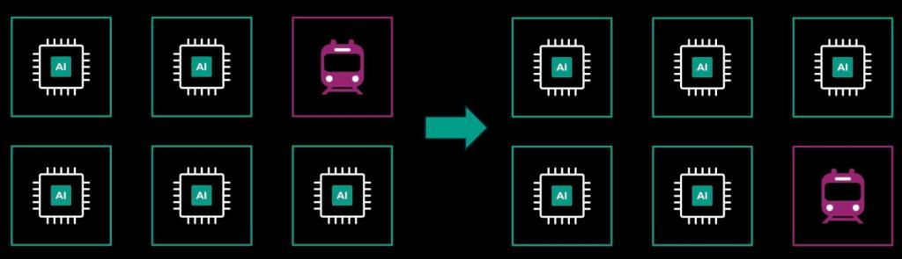

# Measure the service, investigate the incident

**14. Controls, operations and reliability**

Evaluate maintenance against surviving capacity, calculate a defined service metric and build an evidence-based incident explanation.

**Driving question:** Why do equipment uptime and a redundant topology fail to determine useful-service availability?

## Maintenance consumes a real configuration

Two 3 MW paths do not support a 5 MW load during maintenance of one path if the remaining path can carry only 3 MW. Adding their normal ratings hides the maintenance condition. Three such units might preserve 6 MW after one is removed, but only if their distribution, controls and other dependencies permit the required surviving arrangement. Count the functions available in the actual maintenance state, not the number of equipment symbols.

Uptime Institute distinguishes concurrent maintainability and fault-tolerant infrastructure in its Tier descriptions. Those are topology and performance concepts within a defined framework, not measured uptime percentages that can be assigned to an arbitrary sketch. Its operations criteria also address staffing, maintenance tracking, procedures and incident learning. A design’s intended behavior therefore has to be supported by operating practice and evidence, rather than presumed from installed spares.

A maintenance plan needs a starting configuration, the stated scope of work, surviving service conditions, relevant dependencies and the reviewed restoration condition. Physical access and the possibility of another failure during the work matter too. The plan checks capacity and evidence; the switching and isolation steps themselves come from the site’s qualified procedures.

## Define what counts as unavailable

A component can remain powered while the service misses its latency or completion requirement. Conversely, one component can be unavailable while the service continues through another path. A service-level indicator makes the chosen observable boundary explicit. For a time-based example, specify which intervals count as unavailable; for a request-based measure, specify which requests and outcomes belong in the denominator. Google’s SRE discussion of service-level objectives emphasizes this measurement contract.

In a synthetic thirty-day observation period there are 43,200 minutes. One service incident covers twelve minutes and another eighteen, with four minutes of overlap. The union of unavailable time is 12 + 18 − 4 = 26 minutes. The time-based availability is (43,200 − 26)/43,200 ≈ 99.9398 percent. Adding the two durations without removing overlap counts the same service outage twice. Counting only a failed component’s power loss may miss the application recovery period.

Probabilistic redundancy formulas require assumptions. If two fully sufficient paths have independent unavailability u, their simultaneous unavailability is u² in that simplified model. Shared power, software, configuration, repair resources or environmental events can invalidate independence. If either path alone lacks the capacity required by the load, even the success condition is different. A neat probability calculation is useful only after the physical and service model has been established.

## An incident explanation separates observation from hypothesis

Consider an original timeline: a configuration changes at 10:00, alarms appear at 10:02, jobs miss their requirement at 10:03, configuration recovery is recorded at 10:11, physical conditions stabilize at 10:16 and service recovery is confirmed at 10:22. This supports a nineteen-minute service-impact interval if the stated criterion failed continuously from 10:03. The time ordering makes the configuration change a hypothesis worth investigating, not proof of the entire causal chain.

Preserve evidence that distinguishes alternatives: the affected configuration and scope, telemetry quality, equipment states, job behavior and the timing of recovery actions. A useful corrective action names a mechanism, an owner and a way to verify the improvement. Rewriting an instruction is different from testing that a common failure path has been removed. Training is different from proving the system now constrains the same erroneous action.

Google’s postmortem guidance emphasizes learning rather than assigning personal blame. Applied to facilities, that becomes a practical standard for explanations: describe the conditions that allowed an action or failure to propagate, and specify what evidence would demonstrate prevention or reduced impact. Maintain an honest unresolved section when the cause remains uncertain. A confident but unsupported story can make the next incident harder to diagnose by teaching the organization to look in the wrong place.

## Case: Cloudflare tested less than the failure removed

Cloudflare’s November 2023 account identifies a gap between testing the high-availability portion of PDX-04 and losing the entire PDX-04 facility. Some application dependencies existed only at the failed site. Edge traffic continued, while control-plane and analytics services were disrupted. A useful test record therefore names the removed facility functions and the user-facing service that was observed, rather than merely recording that failover passed.

## Case: A repeated failure tests the corrective work

Cloudflare subsequently added capacity, changed failover behavior and tested a full-facility cut in February 2024. That test found one more gap, in its Logpush service, while failover to Amsterdam kept delivery running; the team fixed the gap before the next real event. During the March 26, 2024 power failure, application programming interfaces (APIs) and dashboards were operating normally seven minutes after power loss, without manual intervention. Analytics recovered later. The comparison shows why corrective actions need a defined verification endpoint: API recovery, analytics recovery and a complete facility cold start measure different outcomes.

## Case: Cooling recovery is not service recovery

Google’s final July 2022 europe-west2 incident summary separates a cooling repair at 14:13 Pacific Daylight Time (PDT) on July 19 from initial cloud-service restoration at 04:28 PDT on July 20: another 14 hours 15 minutes. Some residual recovery continued beyond that milestone. The response also briefly widened the disruption through a routing change that avoided three zones rather than the affected one.

When reviewing such an incident, distinguish the physical repair, configuration scope and application restart dependencies. An operating plan must verify the service after the infrastructure returns, and an incident timeline must retain the remaining exceptions.

## Case: Llama 3 training recovered from 466 interruptions

Meta’s Llama 3 report describes a 54-day training snapshot with 466 interruptions: 47 planned and 419 unexpected. About 78 percent of the unexpected interruptions involved confirmed or suspected hardware problems. Automation handled all but three incidents that needed significant manual intervention, and shorter startup and checkpoint times kept effective training time above 90 percent.

Effective training time compares useful training with elapsed time, so it is a service indicator for the job rather than a measure of facility availability. The job kept making progress because recovery was routine and mostly automatic.

## Case: Meta maintains its fleet one group at a time

Planned interruptions are work the operator schedules; the Llama 3 snapshot counts 47. A separate June 2024 Meta engineering article describes how Meta schedules fleet maintenance with maintenance trains: a bounded group of machines leaves service for upgrades and returns while the next group is serviced, and the rest of the fleet keeps working.

Group size sets the cost. Smaller groups take less capacity out of service at once but interrupt jobs more often; larger groups interrupt less often but remove more compute together. Meta describes this tradeoff qualitatively, without a numerical optimum.

Meta’s maintenance-train illustration, June 2024: one group is out for maintenance while the other groups keep serving. [Meta — Maintaining large-scale AI capacity](https://engineering.fb.com/2024/06/12/production-engineering/maintaining-large-scale-ai-capacity-meta/)

## Knowledge check: can Row C take another 2.50 MW?

Row C is operating normally. It draws 2.09 MW, all of which enters its water branch, at 100 kg/s with 30°C supply and 35°C return. A new workload would add 2.50 MW of electrical load and heat to the same branch. The site’s electrical capacity and its cooling plant each have 3 MW spare, and the row’s return water must stay at or below 40°C. Can the row take the job?

Not at its present flow. The water-side headroom is 100 × 4.18 × (40 − 35) = 2,090 kW, or 2.09 MW, less than the 2.50 MW requested. The new total of 4.59 MW needs 4,590/(4.18 × 10) = 109.81 kg/s, about 110 kg/s, to hold a 10 K rise; at 100 kg/s the return would reach 40.98°C. Raise the proven row flow after checking that the pump, piping and cold plates support it, or place some of the work on another row. Spare capacity at the plant helps only once this branch can carry the heat.

## Worked example: A service-time denominator with overlapping incidents

- Synthetic 30-day period: 43,200 minutes.
- Incident A affects the defined service for 12 minutes; incident B for 18 minutes.
- Their service-impact intervals overlap for 4 minutes; no other unavailability occurs.

1. Unavailable union — 12 + 18 − 4 = 26 min — Subtract the shared interval once.
2. Available fraction — (43,200 − 26)/43,200 = 0.999398… — The denominator covers the complete stated observation interval.
3. Percentage — 0.999398… × 100 ≈ 99.9398% — This is a retrospective time-based metric under the exercise definition.

**Result:** The synthetic service availability is about 99.94 percent; the number is not a topology certification or future guarantee.

**Model boundary:** Request success, degraded performance outside the chosen criterion and other periods are not inferred.

## When the situation changes

Trigger: A shared configuration action changes both nominally independent paths.

Mechanism: Common cause defeats the independence behind the u² calculation, so both paths can fail together.

## Apply the idea

In a 60-minute window, ten minutes violate the specified latency objective even though every server remains powered. What is time-based service availability under that criterion?

Reveal the worked answer

50/60 = 83.33 percent for that one-hour window.

Power availability is a different indicator. The service failed its stated latency criterion during ten minutes, so those minutes belong in the unavailable set. This result should not be extrapolated to a month or combined with request-success percentages without reconciling their denominators and observation scopes.

**The idea to keep:** Reliability claims need a service boundary, dependence assumptions and an operating record. A topology label or component average is not the result.

## Sources

- [Tier Classification System](https://uptimeinstitute.com/tiers) — Uptime Institute · Reviewed 2026-09-06. Public Tier descriptions distinguish concurrent maintainability and fault tolerance.
- [Management and Operations Guideline](https://uptimeinstitute.com/professional-services/management-operations/mando-criteria) — Uptime Institute · Reviewed 2026-09-06. Maintenance tracking, staffing and incident learning are operational concerns beyond equipment topology.
- [Google SRE: Service Level Objectives](https://sre.google/sre-book/service-level-objectives/) — sre.google · Reviewed 2026-09-06. Service indicators and objectives need explicitly defined measurements.
- [Google SRE: Postmortem Culture](https://sre.google/sre-book/postmortem-culture/) — sre.google · Reviewed 2026-09-06. Incident review is intended to support learning and improvement rather than blame.
- [Cloudflare — Post mortem on the Cloudflare Control Plane and Analytics Outage](https://blog.cloudflare.com/post-mortem-on-cloudflare-control-plane-and-analytics-outage/) — Cloudflare · Published 2023-11-04 · Reviewed 2026-09-17. A November 2, 2023 facility power failure disrupted control-plane and analytics services. Cloudflare reports undiscovered facility dependencies and a test scope that covered the high-availability portion of PDX-04 rather than the entire PDX-04 facility. Most control-plane service returned at the disaster-recovery facility at 17:57 UTC on November 2.
- [Cloudflare — Major data center power failure (again): Cloudflare Code Orange tested](https://blog.cloudflare.com/major-data-center-power-failure-again-cloudflare-code-orange-tested/) — Cloudflare · Published 2024-04-08 · Reviewed 2026-09-17. After capacity expansion and failover changes, Cloudflare ran a facility cut test in February 2024. A March 26 power failure began at 14:58 UTC; APIs and dashboards operated normally by 15:05 without human intervention. Analytics required longer recovery.
- [Google Cloud — July 2022 europe-west2 cooling incident report](https://status.cloud.google.com/incidents/fmEL9i2fArADKawkZAa2) — Google Cloud · Published 2022-07-29 · Reviewed 2026-09-17. During extreme heat, simultaneous cooling failures affected part of europe-west2-a on July 19, 2022. The final report’s summary gives shutdown at 10:05 PDT, cooling repair at 14:13, and initial cloud-service restoration at 04:28 PDT July 20. Recovery work therefore continued for 14 hours 15 minutes after cooling returned. An incorrect routing change initially avoided all three zones rather than the affected zone.
- [The Llama 3 Herd of Models — infrastructure and operational reliability](https://arxiv.org/html/2407.21783v3) — Llama Team, AI @ Meta · Published 2024-11-23 · Reviewed 2026-09-14. A 54-day Llama 3 training snapshot had 466 interruptions, 47 planned and 419 unexpected, with effective training time above 90 percent and three incidents needing significant manual intervention.
- [Meta — Maintaining large-scale AI capacity](https://engineering.fb.com/2024/06/12/production-engineering/maintaining-large-scale-ai-capacity-meta/) — Engineering at Meta · Published 2024-06-12 · Reviewed 2026-09-17. Meta rotates bounded maintenance groups through its fleet as maintenance trains; group size trades capacity out of service against interruption frequency.

## Check your understanding: One reassuring number

Pause and make a prediction, then compare your reasoning.

A hypothetical rack reports high device temperatures while the plant's displayed supply temperature looks normal. The plant reading is ten minutes old, and there is no current measurement of flow through the affected rack branch.

**Pause and predict:** Does the normal plant reading establish that rack cooling is adequate? Identify the next evidence you need.

Compare your reasoning

No. Obtain time-aligned measurements at the affected rack's thermal and flow boundaries before choosing a cause.

A stale upstream temperature cannot establish current local flow or heat transfer. Current branch flow, supply and return temperatures, device temperatures and load history can help distinguish restricted flow, a changed load and faulty telemetry. The alarm alone does not select among them.

**The next problem:** Measurements reveal the constraint. Which intervention changes usable service enough to justify its cost and delivery time?

Continue in **15. GPU cloud economics**: What a GPU cloud actually sells.
